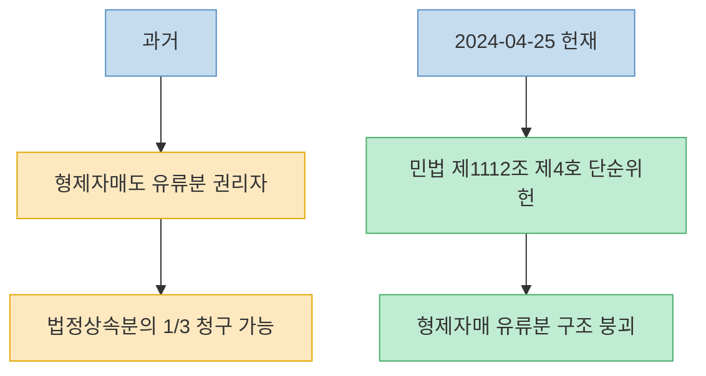
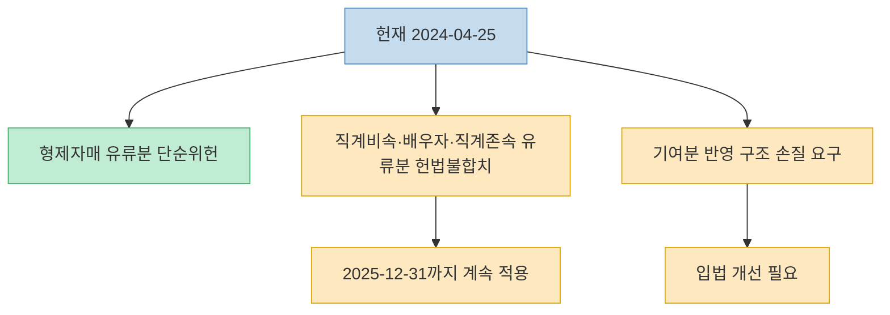
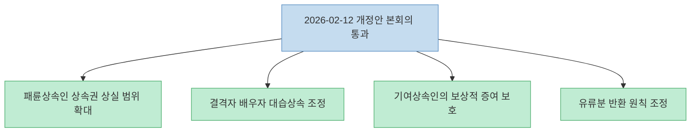
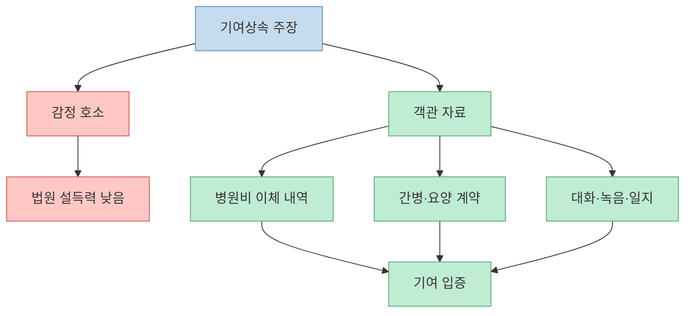
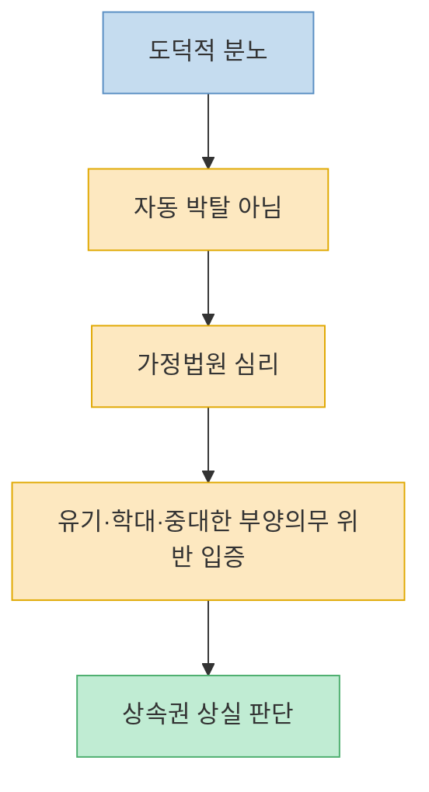
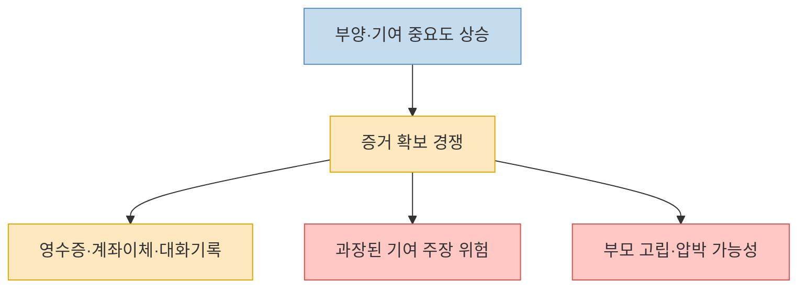

이 영상은 `효도하면 상속 더 받는다`, `형제자매 권리 완전 삭제`, `50년 만에 판이 뒤집혔다`는 식으로 강하게 밀어붙인다. 방향 자체는 크게 틀리지 않지만, 실제 제도 변화는 훨씬 더 정교하다. 어떤 것은 2024년 4월 25일 헌법재판소 결정으로 이미 효력을 잃었고, 어떤 것은 2026년 2월 12일 국회 본회의를 통과한 민법 개정안에서 구체화됐다. 그리고 무엇보다 중요한 건 이 변화가 `효도한 사람이 자동으로 더 받는다`는 뜻은 아니라는 점이다. 오히려 앞으로 상속분쟁은 **감정 호소보다 부양·기여를 입증할 자료가 있는가** 로 더 강하게 이동할 가능성이 크다.

<!--more-->

## Sources

- ["효도하면 상속 더 받는다" 상속법 50년만에 개정으로 판이 뒤집혔다 형제자매 권리 완전 삭제에 발칵 [이슈임당]](https://www.youtube.com/watch?v=lNgrgZ0gKA0) — 신사임당
- [민법 제1112조 등 위헌제청](https://law.go.kr/detcInfoP.do?detcSeq=190071) — 국가법령정보센터 헌재결정례
- [민법 제1112조(유류분의 권리자와 유류분) 조문정보](https://www.law.go.kr/lsLinkProc.do?efYd=20121024&joNo=111200&lnkJoNo=undefined&lsClsCd=L&lsId=prec20121024&lsNm=%EB%AF%BC%EB%B2%95&mode=11) — 국가법령정보센터
- [패륜상속인, 더 이상 재산을 상속받을 수 없습니다 — 유류분 헌법불합치 결정을 반영한 민법 개정안 국회 본회의 통과](https://www.moj.go.kr/bbs/moj/182/490771/download.do) — 법무부, 2026년 2월 12일

---

## 첫 번째 큰 변화: 형제자매의 유류분은 `자동 몫`으로 더는 보기 어렵다

영상이 가장 먼저 강조하는 건 형제자매 유류분의 사실상 퇴장이다. 이건 단순한 유튜브 과장이 아니라 2024년 4월 25일 헌법재판소 결정의 핵심 중 하나다. 국가법령정보센터에 공개된 결정문을 보면, 헌재는 민법 제1112조 제4호, 즉 **형제자매에게 법정상속분의 3분의 1 유류분을 인정하던 조항** 을 단순위헌으로 판단했다. 형제자매 유류분 자체는 위헌선언으로 효력이 제거될 수 있으므로 별도의 유예 없이 위헌이라는 취지다. [(1:34)](https://youtu.be/lNgrgZ0gKA0?t=94), [(2:27)](https://youtu.be/lNgrgZ0gKA0?t=147)

이 변화의 의미는 꽤 크다. 과거에는 독신으로 살며 재산을 만든 사람이 조카나 공익단체에 재산을 남기고 싶어도, 오랫동안 왕래가 없던 형제자매가 유류분을 청구할 수 있는 구조가 있었다. 헌재는 이 부분을 더 이상 정당화하기 어렵다고 본 것이다. 영상의 `30년 연락 없던 형제가 장례식장에 와서 법적 몫을 내놓으라 한다`는 예시는 자극적이지만, 문제의식 자체는 이 위헌 결정과 맞닿아 있다. [헌재결정례](https://law.go.kr/detcInfoP.do?detcSeq=190071), [조문정보](https://www.law.go.kr/lsLinkProc.do?efYd=20121024&joNo=111200&lnkJoNo=undefined&lsClsCd=L&lsId=prec20121024&lsNm=%EB%AF%BC%EB%B2%95&mode=11)

---

## 하지만 `효도한 사람 자동 우대`로 읽으면 곤란하다: 핵심은 헌재가 기존 유류분 구조를 손봤다는 점이다

여기서 영상 제목처럼 `효도하면 더 받는다`고 단순화하면 실제 법리는 놓치기 쉽다. 헌재는 형제자매 유류분만 문제 삼은 게 아니라, 직계비속·배우자·직계존속의 유류분 규정과 기여분을 유류분에 제대로 반영하지 못한 민법 제1118조 등에 대해서도 헌법불합치를 선언했다. 다만 이 부분은 바로 효력을 없애면 법적 공백이 커서, **2025년 12월 31일까지 입법자가 고치기 전까지 계속 적용** 하라고 했다. [헌재결정례](https://law.go.kr/detcInfoP.do?detcSeq=190071)

즉 2024년 4월 25일 이후 벌어진 변화의 본질은 `효도 경쟁 장려`가 아니라, **피상속인의 의사·기여상속인의 형평·패륜상속인 문제를 전혀 반영하지 못하던 기계적 유류분 체계를 수정하라는 헌재의 명령** 이었다. 영상이 말하는 `실질적 정의의 시대`라는 표현은 다소 과장됐지만, 적어도 기존처럼 혈연이라는 이유만으로 무조건 일정 비율을 밀어 넣는 구조가 헌법적으로 흔들렸다는 점은 맞다. [(0:50)](https://youtu.be/lNgrgZ0gKA0?t=50), [(1:02)](https://youtu.be/lNgrgZ0gKA0?t=62)

---

## 두 번째 큰 변화: 2026년 2월 12일 국회 통과 개정안은 `패륜상속`, `배우자 대습`, `기여상속`을 같이 손봤다

법무부의 2026년 2월 12일 보도자료를 보면, 유류분 관련 헌법불합치 결정을 반영한 민법 개정안이 그날 국회 본회의를 통과했다. 이 자료가 정리한 핵심은 네 가지다. 첫째, 상속권 상실 대상 범위가 직계존속 상속인에 한정되던 것에서 **직계비속·배우자 등 모든 상속인** 으로 확대됐다. 둘째, 상속결격된 사람의 배우자가 대습상속 구조를 이용해 사실상 이익을 가져가던 길을 조정했다. 셋째, 피상속인을 특별히 부양하거나 재산 유지·증가에 특별히 기여한 상속인이 받은 **보상적 증여는 유류분 반환대상에서 제외** 하도록 했다. 넷째, 원물반환 원칙 대신 가액반환 원칙으로 바꿔 공유 분쟁을 줄이려 했다. [법무부 2026-02-12](https://www.moj.go.kr/bbs/moj/182/490771/download.do)

이 부분이 영상에서 말하는 `효도하면 더 받는다`의 실제 법적 배경이다. 정확히 말하면 **부양과 기여에 상응하는 보상적 증여를 보호하는 방향으로 법이 움직였다** 는 뜻이지, 가족 간 정서적 평가를 법원이 점수화한다는 뜻은 아니다. 다시 말해 법은 `누가 부모를 더 사랑했는가`를 묻기보다, `누가 실제로 어떤 부양·간병·재산 유지 기여를 했는가`를 증거로 확인하는 방향으로 바뀐다. [(3:25)](https://youtu.be/lNgrgZ0gKA0?t=205), [(6:12)](https://youtu.be/lNgrgZ0gKA0?t=372)

---

## 그래서 앞으로 중요한 건 `효도 서사`가 아니라 `기여 입증`이다

영상에서 가장 현실적인 대목은 따로 있다. `엄마를 제일 사랑한 건 나야` 같은 말은 법정에서 별 힘이 없고, 결국 병원비 이체 내역, 요양원 계약서, 간병 영수증, 카카오톡 대화, 녹음, 일지 같은 **객관 자료** 가 필요하다는 부분이다. 이건 영상의 자극적 톤과 별개로 꽤 정확한 방향이다. 법무부 보도자료도 기여상속인이 받은 보상적 증여를 보호한다고 했지만, 무엇이 `보상적`이고 무엇이 단순 편애인지 구분하는 일은 결국 사실인정의 문제이기 때문이다. [(6:30)](https://youtu.be/lNgrgZ0gKA0?t=390), [(6:48)](https://youtu.be/lNgrgZ0gKA0?t=408), [(13:07)](https://youtu.be/lNgrgZ0gKA0?t=787)

즉 개정 이후 상속분쟁은 감정싸움이 줄어드는 게 아니라, 오히려 다른 방식으로 더 치밀해질 가능성이 있다. 누군가는 실제 간병과 부양을 자료화하려고 할 것이고, 누군가는 그 자료가 과장되거나 편향됐다고 다툴 것이다. 영상이 경고하는 `영수증 전쟁`, `녹음 전쟁`, `CCTV 전쟁`은 다소 과장된 표현이지만, 제도 변화가 증거 수집 경쟁을 부추길 수 있다는 문제의식은 무시하기 어렵다. [(11:24)](https://youtu.be/lNgrgZ0gKA0?t=684), [(11:42)](https://youtu.be/lNgrgZ0gKA0?t=702), [(12:02)](https://youtu.be/lNgrgZ0gKA0?t=722)

---

## 패륜상속과 배우자 대습상속 조정은 `도덕적 분노`를 그대로 자동 반영하는 제도가 아니다

영상은 `부모를 버린 자식은 이제 국물도 없다`, `부정한 배우자 주머니로 돌던 돈길을 막았다`는 식으로 설명한다. 큰 흐름은 법무부 보도자료와 맞지만, 실제 적용은 그렇게 자동적이지 않다. 상속권 상실은 결국 가정법원의 판단을 거쳐야 하고, 단순한 불화가 아니라 **유기·학대·중대한 부양의무 위반 같은 법적 사유** 가 입증되어야 한다. 마찬가지로 배우자 대습상속 조정도 모든 복잡한 재혼·재혼가정 문제를 한 번에 정리해 주는 마법이 아니다. [법무부 2026-02-12](https://www.moj.go.kr/bbs/moj/182/490771/download.do)

그래서 이 개정은 `분노의 자동 집행 장치`가 아니라, **그동안 너무 기계적으로 작동하던 구조를 법원이 더 구체적으로 심리할 수 있게 만든 장치** 에 가깝다. 이 차이를 놓치면 사람들은 `부모를 안 모신 형은 끝났다`, `막내가 고생했으니 무조건 전부 받는다`처럼 오해하기 쉽다. 실제 분쟁에서는 오히려 누가 어떤 사실을 어느 정도 입증하느냐가 핵심이 된다. [(3:25)](https://youtu.be/lNgrgZ0gKA0?t=205), [(4:07)](https://youtu.be/lNgrgZ0gKA0?t=247), [(5:03)](https://youtu.be/lNgrgZ0gKA0?t=303)

---

## 영상 후반의 `부작용` 경고는 공식 개정안 자체가 아니라 현실적 파생효과에 대한 해석이다

영상은 후반부에서 가짜 효도 영수증 만들기, 녹음 유도, 부모 고립, 유언장 압박 같은 부작용을 길게 말한다. 이 부분은 법무부 보도자료나 헌재 결정문에 직접 쓰인 내용은 아니다. 즉 **공식 법조문이 아니라 영상 제작자의 현실적 전망** 에 가깝다. 다만 완전히 허황된 상상으로 치부하기도 어렵다. 기여·부양이 법적으로 더 중요해질수록, 그것을 둘러싼 사실관계 다툼이 치열해질 가능성은 분명 있기 때문이다. [(11:24)](https://youtu.be/lNgrgZ0gKA0?t=684), [(12:29)](https://youtu.be/lNgrgZ0gKA0?t=749)

그래서 이 부분은 이렇게 읽는 것이 적절하다. `개정안이 가족을 망친다`는 단정이 아니라, **제도가 부양과 기여를 더 중시할수록 그 증거를 둘러싼 갈등도 커질 수 있다** 는 경고다. 결국 이 경고가 맞는지 여부는 앞으로 실제 판례와 실무가 어떻게 쌓이는지에서 확인될 문제다. 지금 단계에서는 영상의 문제제기를 받아들이되, 그것을 이미 확정된 사실처럼 쓰는 건 피하는 편이 안전하다.

---

## 핵심 요약

- 2024년 4월 25일 헌재는 형제자매 유류분 조항인 민법 제1112조 제4호를 단순위헌으로 판단했다. [헌재결정례](https://law.go.kr/detcInfoP.do?detcSeq=190071)
- 같은 날 직계비속·배우자·직계존속의 유류분 구조와 기여분 반영 문제는 헌법불합치가 선언됐고, 2025년 12월 31일까지 입법 개선이 요구됐다.
- 2026년 2월 12일 법무부 보도자료 기준, 관련 민법 개정안은 국회 본회의를 통과했고 핵심은 패륜상속 제한 확대, 배우자 대습상속 조정, 기여상속인의 보상적 증여 보호, 가액반환 원칙 전환이다. [법무부 2026-02-12](https://www.moj.go.kr/bbs/moj/182/490771/download.do)
- 따라서 `효도하면 자동으로 더 받는다`기보다, 부양과 기여를 객관 자료로 입증할 수 있는지가 훨씬 중요해졌다.
- 영상 후반의 `가짜 효도 영수증 전쟁` 같은 내용은 공식 법문이 아니라, 제도 변화가 낳을 수 있는 현실적 부작용에 대한 해석으로 보는 편이 적절하다.

---

## 결론

이 영상의 제목은 다소 과격하지만, 지금 상속법 변화의 핵심을 한 문장으로 줄이면 크게 틀리지 않는다. **상속은 더 이상 혈연만으로 자동 배분되는 문제가 아니라, 피상속인의 의사와 부양·기여의 실제를 더 따지는 방향으로 이동하고 있다.** [(0:50)](https://youtu.be/lNgrgZ0gKA0?t=50), [(6:12)](https://youtu.be/lNgrgZ0gKA0?t=372)

다만 그 변화가 뜻하는 건 `효도 점수제`가 아니다. 앞으로는 누가 더 착했는지보다, 누가 무엇을 했고 그것을 어떻게 증명할 수 있는지가 더 중요해진다. 그래서 이 개정의 진짜 키워드는 효도보다도, 어쩌면 **증거** 에 더 가깝다.
