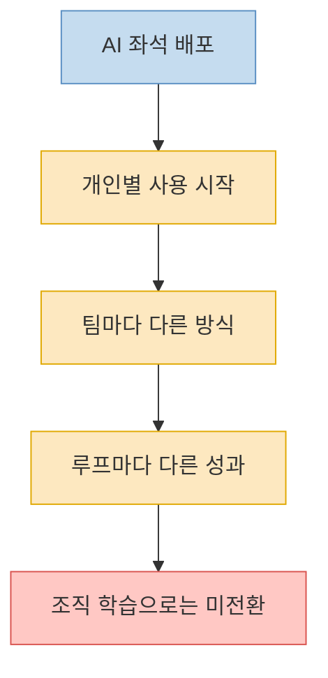
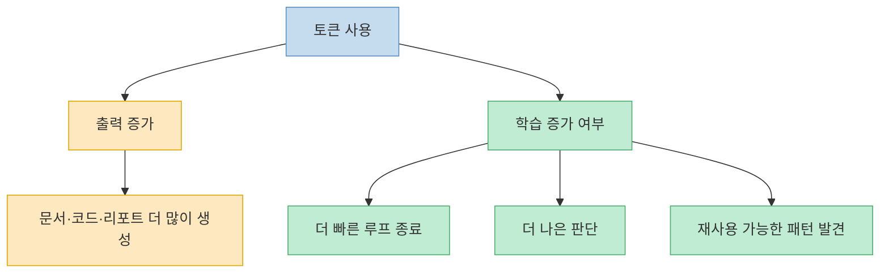
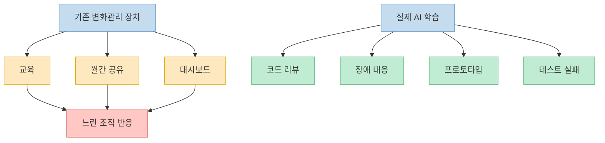
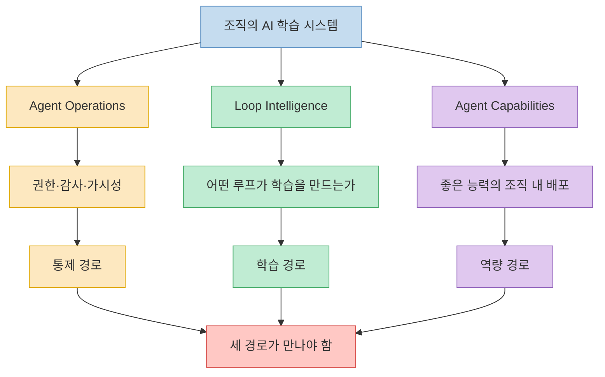
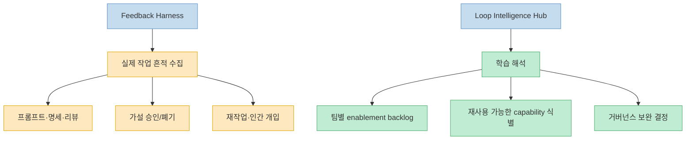
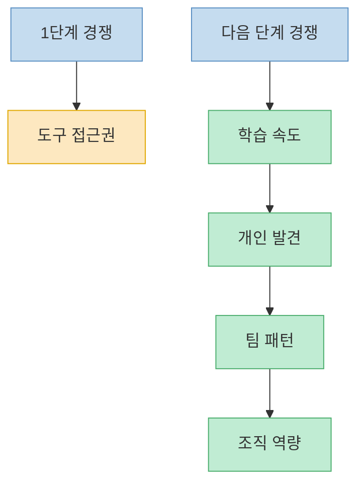

이 글의 출발점은 꽤 날카롭다. 회사 안에서 모두가 Copilot을 쓰고, ChatGPT Enterprise 계정도 있고, 누군가는 Claude Code나 Cursor로 놀라운 일을 해내고 있는데도 정작 회사는 그 경험에서 아무것도 배우지 못할 수 있다는 것이다. Robert Glaser는 이 시점을 `messy middle`이라고 부른다. 접근권한과 도구 배포는 끝났지만, 개별 실험이 조직 학습으로 전환되지 않는 구간이다. 이 글은 왜 그 구간이 그렇게 복잡한지, 그리고 저자가 제안하는 `Loop Intelligence`가 어떤 문제를 풀려고 하는지 구조적으로 정리한다.

<!--more-->

## Sources

- [When everyone has AI and the company still learns nothing](https://www.robert-glaser.de/when-everyone-has-ai-and-the-company-still-learns-nothing/) — Robert Glaser

---

## 도구는 깔렸는데 학습은 퍼지지 않는 순간이 진짜 시작점이다

원문은 AI 도입의 첫 단계가 오히려 쉽다고 본다. 좌석을 산다, 허용 범위를 정한다, 교육을 한다, 챔피언 네트워크를 만든다. 이런 건 전통적인 엔터프라이즈 롤아웃처럼 보이기 때문이다. 하지만 두 번째 단계는 훨씬 이상하다. 어떤 팀은 Copilot을 단순 자동완성 정도로만 쓰고 끝낸다. 다른 팀은 Claude Code를 테스트·리뷰·지속적 조정과 함께 꽉 조여 돌린다. 어떤 프로덕트 매니저는 더 이상 Figma 화면만 만들지 않고 실제 동작하는 프로토타입을 만든다. 지원팀은 반복 문의를 슬쩍 자동화한다. 문제는 이 모든 일이 같은 회사 안에서 동시에 벌어진다는 점이다. [원문](https://www.robert-glaser.de/when-everyone-has-ai-and-the-company-still-learns-nothing/)

그래서 저자는 도입 단위를 더 이상 `회사`나 `팀`으로만 볼 수 없다고 말한다. 실제 도입 단위는 **일 안에서 돌아가는 루프** 다. 어떤 사람은 아주 짧고 촘촘한 협업 루프에서 AI를 쓴다. 어떤 사람은 길고 느슨한 위임 루프에서 쓴다. 이 차이를 모르면 경영진은 라이선스 사용량과 토큰 수만 보고 `ROI가 어디 있지?`를 묻게 되고, 조직은 정작 중요한 학습 경로를 놓친다.

---

## `AI를 쓰는가`보다 `어떤 루프를 닫았는가`가 더 중요하다

글에서 가장 중요한 문장은 이것에 가깝다. 질문은 `사람들이 AI를 쓰고 있는가?`가 아니라, **그 토큰을 써서 무엇이 바뀌었는가** 여야 한다는 것이다. 어떤 루프가 더 빨리 닫혔는가, 어떤 결정이 더 좋아졌는가, 어떤 root-cause 분석이 더 날카로워졌는가, 어떤 리뷰가 더 많은 결함을 잡아냈는가, 어떤 팀이 재사용 가능한 패턴을 배웠는가를 봐야 한다. 토큰 대비 PR 개수나 출력물 수는 결국 예전 생산성 집착이 다른 옷을 입은 것에 불과하다고 저자는 본다. [원문](https://www.robert-glaser.de/when-everyone-has-ai-and-the-company-still-learns-nothing/)

이 문제의식은 AI를 생산성 도구로만 보는 시선과 갈라선다. 출력이 늘어나는 건 중요할 수 있다. 하지만 저자가 진짜 묻는 건 `출력`이 아니라 `학습`이다. 같은 100만 토큰이라도 어떤 팀은 더 빨리 틀린 아이디어를 죽였고, 어떤 팀은 더 정확한 테스트 전략을 얻었고, 어떤 팀은 여전히 그럴듯한 산출물만 더 많이 만들었을 수 있다. 그래서 측정의 핵심도 `token-to-output`이 아니라 **token-to-learning** 이 되어야 한다고 주장한다.

---

## 왜 기존 변화관리 장치는 자꾸 뒤처지는가

원문은 대부분의 회사가 AI 도입도 예전 조직 변화 기계로 처리하려 한다고 말한다. 커뮤니티 오브 프랙티스, 브라운백 세션, 챔피언 네트워크, enablement deck, office hours, 월간 데모, 설문조사, 대시보드 같은 것들이다. 저자는 이런 장치들이 완전히 쓸모없다고 하지는 않는다. 다만 재미있는 AI 작업은 다음 커뮤니티 미팅을 기다리지 않는다고 본다. 진짜 학습은 코드 리뷰 안에서, 세일즈 제안서 안에서, 프로덕트 프로토타입 안에서, 운영 장애 분석 안에서 생긴다. [원문](https://www.robert-glaser.de/when-everyone-has-ai-and-the-company-still-learns-nothing/)

그리고 그 학습의 핵심은 완성된 성공사례 슬라이드에 있지 않다. 맥락이 부족했던 순간, 테스트가 깨졌던 지점, 에이전트가 옆길로 샜다가 사람이 다시 잡아당긴 순간, 즉 **마찰** 에 있다. 그런데 조직은 보통 이 마찰을 정제하고 포장해 늦게 공유한다. 그 시점엔 이미 가장 중요한 이빨이 빠져 있다. 그래서 저자는 adoption playbook보다, 실제 일의 흔적을 듣고 루프를 이해하는 장치가 더 중요하다고 본다.

---

## 저자가 말하는 세 가지 역량: Agent Operations, Loop Intelligence, Agent Capabilities

글의 중심 제안은 세 가지 역량 구분이다. 첫째는 **Agent Operations** 다. 어떤 에이전트와 도구가 어디에 붙어 있고, 무엇을 건드릴 수 있고, 어떤 데이터에 접근하고, 어떤 승인과 감사 체계를 거치는지를 다룬다. 둘째는 **Loop Intelligence** 다. 어떤 AI 보조 루프가 실제로 학습을 만들었는지, 어디서 루프가 열려 있는지, 어느 팀은 왜 아직 촘촘한 감독이 필요한지, 어디서 에이전트가 leverage를 만들고 어디서 옆길로 새는지를 본다. 셋째는 **Agent Capabilities** 다. 어느 팀에서 발견한 유용한 능력을 어떻게 조직 전체로 배포할지의 문제다. [원문](https://www.robert-glaser.de/when-everyone-has-ai-and-the-company-still-learns-nothing/)

이 세 가지를 따로 보면 이상해진다. Operations만 있으면 통제 관료제가 된다. Loop Intelligence만 있으면 좋은 패턴을 발견해도 실제 일에 다시 넣을 방법이 없다. Capabilities만 있으면 그냥 더 세련된 이름의 tool sprawl이 된다. 그래서 저자는 통제 경로, 학습 경로, 역량 경로가 만나는 지점이 필요하다고 보고, 그걸 내부적으로는 `feedback harness`, 바깥으로는 `Loop Intelligence Hub` 같은 개념으로 설명한다.

---

## Feedback Harness와 Loop Intelligence Hub는 `사람 감시`가 아니라 `루프 이해`를 겨냥해야 한다

저자는 여기서 중요한 선을 긋는다. 이 시스템이 직원 감시나 AI 사용 점수화로 가는 순간 모든 것이 망가진다고 본다. 사람들이 `AI를 충분히 썼는가`를 측정한다고 느끼면 신호를 게임화할 것이고, 모든 실험이 생산성 압박으로 돌아온다고 느끼면 실험을 숨길 것이며, 최고의 워크플로가 곧 더 높은 기준선 노동량이 된다고 느끼면 그 워크플로를 조직과 공유하지 않을 것이다. 그러면 조직은 겉으로는 compliance가 보이는데, 실제 학습은 보이지 않는 최악의 상태에 빠진다. [원문](https://www.robert-glaser.de/when-everyone-has-ai-and-the-company-still-learns-nothing/)

그래서 feedback harness가 들어야 하는 건 사람 자체가 아니라 **일의 흔적** 이다. 작업, 프롬프트, 명세, 리뷰, accepted/rejected hypothesis, production signal, rework, human intervention 같은 지점들이다. 그리고 Hub의 출력은 멋진 대시보드가 아니라 결정이어야 한다. 예를 들어 이 팀은 더 느슨한 위임으로 가기 전에 테스트와 backpressure가 필요하다, 저 제품 그룹은 좁은 컴포넌트 범위에서 dark-factory 패턴이 반복 가능하다, 다섯 팀이 엉성하게 재발명한 skill은 이제 플랫폼 레이어로 올려야 한다 같은 결론이다.

---

## 진짜 경쟁우위는 더 이상 접근권한이 아니라 학습 속도다

글의 마지막은 꽤 분명하다. 첫 번째 AI 도입 경쟁은 누가 더 빨리 툴 접근권을 확보하느냐였다. 하지만 frontier intelligence는 점점 `빌릴 수 있는 것`이 된다. 앞으로 차이를 만드는 건 도구 접근권이 아니라, **누가 개인의 발견을 팀의 패턴으로, 팀의 패턴을 조직의 역량으로 더 빨리 전환하느냐** 다. [원문](https://www.robert-glaser.de/when-everyone-has-ai-and-the-company-still-learns-nothing/)

그래서 저자는 messy middle을 버텨야 하는 혼란기로 보지 않는다. 오히려 여기서 배우는 속도가 다음 우위를 만든다고 본다. 누가 더 빨리 useful pattern을 찾는가, 누가 agentic loop에 적절한 저항을 걸어 스프롤을 막는가, 누가 유용한 capability를 monolithic enterprise agent로 망치지 않고 잘 분산시키는가가 앞으로의 경쟁 포인트라는 것이다.

---

## 핵심 요약

- AI 도입의 진짜 어려움은 툴 접근이 아니라 개별 사용이 조직 학습으로 바뀌지 않는 `messy middle`에 있다.
- 중요한 질문은 `AI를 쓰는가`가 아니라 `토큰을 써서 무엇이 바뀌었는가`다.
- 기존 교육·챔피언 네트워크·월간 공유 같은 변화관리 장치는 실제 일 안에서 생기는 빠른 학습을 따라가기 어렵다.
- 조직은 Agent Operations, Loop Intelligence, Agent Capabilities라는 세 축을 함께 가져가야 한다.
- feedback harness와 Loop Intelligence Hub는 직원 감시가 아니라, 실제 작업 루프를 이해하고 학습을 다시 일에 넣는 피드백 경로가 되어야 한다.
- 앞으로의 경쟁우위는 접근권이 아니라 개인 발견을 조직 역량으로 바꾸는 학습 속도에 있다.

---

## 결론

Robert Glaser의 글은 AI 도입을 라이선스 배포 문제에서 조직 학습 문제로 옮겨 놓는다. 모두가 AI를 쓰는 시대에 차이를 만드는 건 `누가 더 많이 썼는가`가 아니라 `누가 더 빨리 배우고 그 배움을 조직의 능력으로 굳히는가`다.

그래서 이 글이 남기는 가장 중요한 문장은 아마 이것일 것이다. 회사가 사야 하는 건 더 많은 좌석만이 아니라, **배움이 개별 실험에서 끝나지 않고 조직 안을 이동하게 만드는 피드백 경로** 다.
