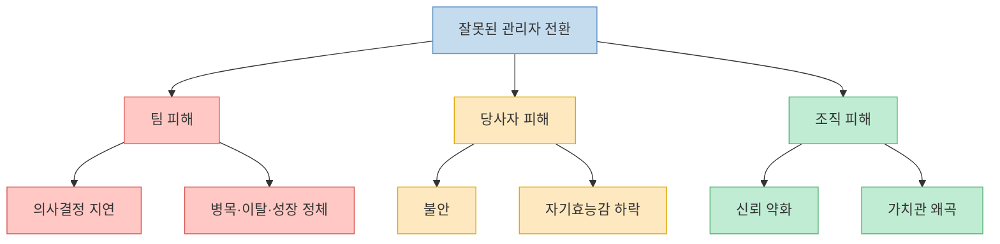
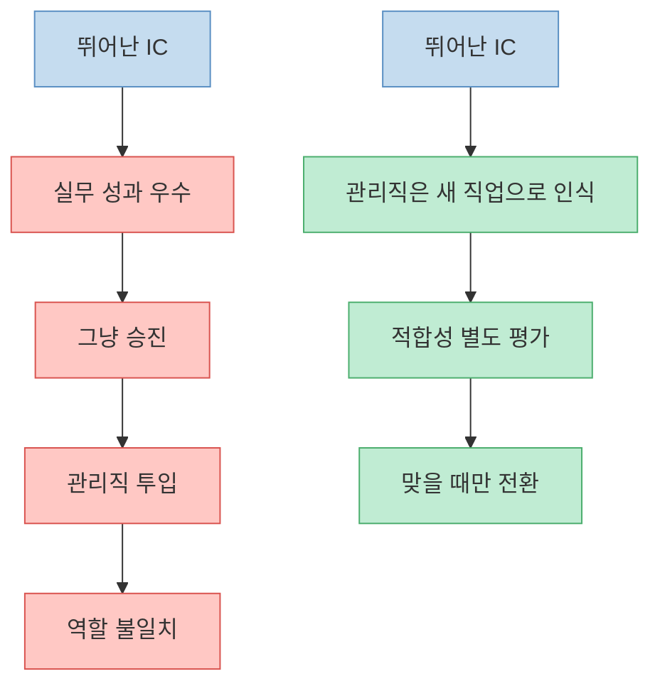
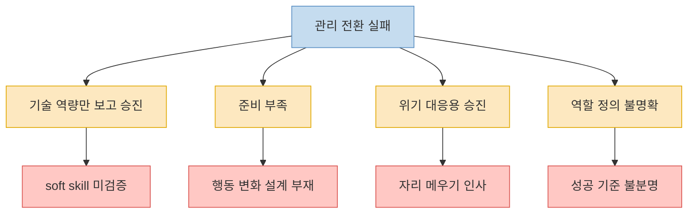
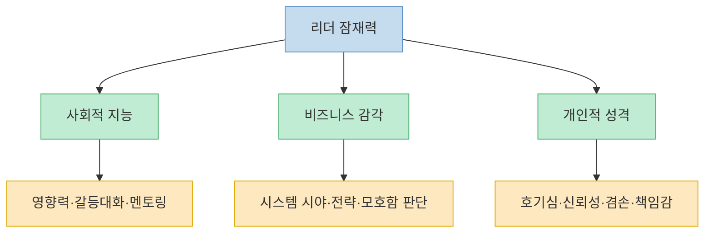
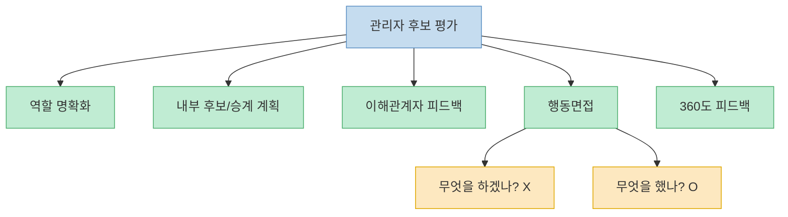
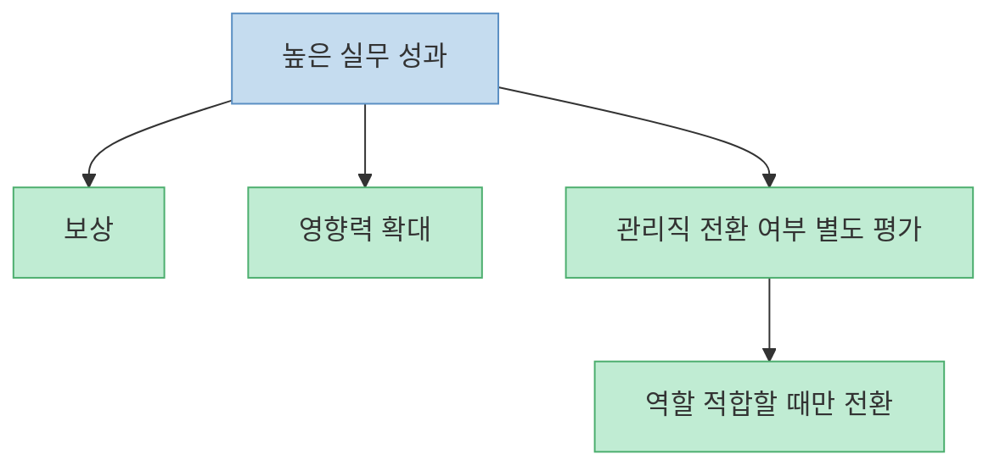

이 글의 핵심은 불편하지만 익숙하다. 회사에서 제일 일을 잘하던 사람이 관리자가 된 뒤, 팀을 망치고 본인도 무너지는 장면은 생각보다 흔하다. Yaniv Preiss는 그 이유를 아주 명확하게 짚는다. 많은 조직이 관리를 `성과에 대한 보상`으로 취급하지만, 실제로 관리는 **새 직업** 이다. 뛰어난 IC를 매니저로 올리는 순간, 우리는 그 사람에게 단지 한 단계 높은 역할을 주는 것이 아니라 전혀 다른 종류의 일로 전직시키고 있는 셈이다. 이 글은 그 전환이 왜 자주 실패하는지, 무엇을 봐야 실패 확률을 낮출 수 있는지를 구조적으로 정리한다.

<!--more-->

## Sources

- [Why Your Best Employee Becomes Your Worst Manager](https://yanivpreiss.com/2026/04/12/why-your-best-employee-becomes-your-worst-manager/) — Yaniv Preiss

---

## 관리 전환이 실패할 때 손해는 세 겹으로 번진다

원문이 가장 먼저 강조하는 건 `잘못된 승진`의 비용이다. 보통 사람들은 팀 성과만 떠올리지만, 글은 피해가 세 겹으로 퍼진다고 본다. 첫째는 팀이다. 팀은 의사결정이 늦어지고, 병목이 생기고, 성장 기회가 줄고, 결국 좋은 사람이 떠난다. 둘째는 새 관리자가 된 당사자다. 애초에 맞지 않는 역할에서 낮은 자기효능감, 불안, 심리적 부담을 오래 겪을 수 있다. 셋째는 조직이다. 이런 미스매치를 위가 알고도 방치하면 `우리는 성과만 보고 사람을 태운다`는 신호가 퍼지고, 조직의 판단력과 가치관에 대한 신뢰가 무너진다. [원문](https://yanivpreiss.com/2026/04/12/why-your-best-employee-becomes-your-worst-manager/)

이 포인트가 중요한 이유는, 관리 전환 실패를 단순한 `한 사람의 아쉬운 시행착오`로 볼 수 없게 만들기 때문이다. 잘못 앉힌 관리자는 팀 성과를 망치고, 좋은 IC를 잃고, 남은 사람들에게도 `조직은 이런 결정을 바로잡지 않는다`는 메시지를 준다. 즉 이 문제는 사람 한 명의 승진 문제가 아니라, **문화와 신뢰를 갉아먹는 조직 설계 문제** 에 가깝다.

---

## 가장 큰 착각: 관리를 `승진`이라고 부르는 순간 이미 절반은 틀린다

글은 Peter Principle을 끌어오면서, 많은 조직이 현재 역할에서의 성과를 근거로 사람을 계속 올리다가 결국 그 사람이 잘하지 못하는 자리까지 밀어 올린다고 말한다. 여기서 핵심 오류는 관리직을 `보상`이나 `상위 버전의 실무`로 보는 시선이다. 하지만 관리는 실무를 더 많이, 더 잘하는 일이 아니다. 타인의 일과 관계, 우선순위, 갈등, 모호함, 상호의존성을 다루는 일이다. 즉 원문이 말하듯 **brilliant engineer → team lead** 는 step up이 아니라 career change다. [원문](https://yanivpreiss.com/2026/04/12/why-your-best-employee-becomes-your-worst-manager/)

이 차이를 이해하지 못하면 조직은 두 가지를 동시에 잃는다. 첫째, 훌륭한 IC를 잃는다. 둘째, 준비되지 않은 매니저를 얻는다. 그래서 원문이 던지는 불편한 질문은 이것이다. `이 사람은 일을 잘하니까 올려야 해`가 아니라, **이 사람은 아예 다른 종류의 일을 좋아하고, 견디고, 배워서 해낼 사람인가** 를 물어야 한다는 것이다.

---

## 원문이 꼽는 네 가지 전환 오류는 생각보다 모두 익숙하다

글은 실무자를 최악의 관리자로 만드는 전환 오류를 네 가지로 정리한다. 첫째, 기술 역량만 보고 올리는 것. 측정하기 쉬운 성과만 보고 승진시키면, 훌륭한 기술자를 잃고 나쁜 관리자를 얻을 수 있다. 둘째, 준비 부족이다. 단발성 워크숍 한 번으로는 전환 계획이 되지 않는다. 셋째, 위기 해결용 승진이다. 자리가 비었고 팀이 커지니 급히 앉히는 방식이다. 넷째, 역할 정의 불명확이다. disciplinary인지 matrix인지, 단일 사이트인지 여러 팀인지, 성공 기준이 무엇인지 흐리면 적합한 사람을 찾는 것 자체가 불가능하다. [원문](https://yanivpreiss.com/2026/04/12/why-your-best-employee-becomes-your-worst-manager/)

이 네 가지를 한 문장으로 묶으면 이렇다. 조직은 보통 `누가 일을 잘하나`는 보지만, `이 역할이 정확히 무엇인가`와 `이 사람이 이 역할로 바뀌는 준비가 되어 있나`는 덜 본다. 결국 실패는 개인보다도 설계에서 먼저 시작된다.

---

## 진짜 잠재력은 `잘하는 일`보다 `주변에 미치는 방식`에서 보인다

원문에서 가장 좋은 부분은 잠재력의 정의다. 미래 리더를 보려면 현재 맡은 좁은 업무만 보지 말고, 그 사람이 `생태계에 어떤 영향을 주는지` 봐야 한다고 한다. 여기서 생태계란 팀원, 다른 팀, 고객, 파트너, 단기와 장기, 조직 전체를 뜻한다. 글은 이를 세 묶음으로 나눈다. 사회적 지능, 비즈니스 감각, 개인적 성격이다. 사회적 지능에는 영향력, 커뮤니케이션, 관계 형성, 감정 조절, 불편한 대화, 멘토링, 갈등 생산성이 포함된다. 비즈니스 감각에는 시스템적 시야, 전략적 사고, 모호함 속 의사결정, 회사 비전 이해가 들어간다. 개인적 성격에는 내적 동기, 호기심, 신뢰성, 겸손, 추가 책임을 자발적으로 지는 태도가 들어간다. [원문](https://yanivpreiss.com/2026/04/12/why-your-best-employee-becomes-your-worst-manager/)

여기서 흥미로운 건, 글이 `타고난 리더십` 신화를 강하게 밀지 않는다는 점이다. 어떤 특성은 자연스럽게 보이지만, 많은 부분은 전환 전에 훈련 가능하고 연습 가능하다고 본다. 즉 후보를 고르는 일은 `완성형 리더 찾기`가 아니라, **이미 일부 증거가 있고 나머지 갭은 학습 가능한 사람 찾기** 에 더 가깝다.

---

## 승진 전 평가도 바뀌어야 한다: `무엇을 하겠나`보다 `무엇을 했나`

원문은 사람을 고르는 과정도 바꾸라고 말한다. 첫 번째는 역할 명확화다. 책임, 경계, 인터페이스, 성공 기준을 먼저 분명히 해야 한다. 두 번째는 succession planning과 내부 소싱이다. 세 번째는 팀과 이해관계자 피드백 수집. 네 번째는 행동면접이다. 여기서 핵심은 `what would you do?`가 아니라 `what did you do?` 를 묻는 것이다. 즉 가상의 모범답안보다 실제 행동 이력을 본다. 다섯 번째는 고영향 역할에 대한 360도 피드백이다. 글은 특히 수직 성과만 보지 말고 다른 팀과의 수평적 협업을 보라고 강조한다. [원문](https://yanivpreiss.com/2026/04/12/why-your-best-employee-becomes-your-worst-manager/)

이 프레임은 실무적으로도 유용하다. 많은 조직이 `관리자가 되고 싶나요?`라고 묻고 끝내지만, 원문은 그보다 훨씬 앞의 질문을 던진다. **이 사람은 이미 현재 자리에서 다음 역할의 일부를 하고 있었는가?** 글이 소개하는 Manager Tools의 `150% rule`, 즉 현재 역할 100%와 다음 역할 50%를 이미 보여 준 사람이 더 유력하다는 기준은 바로 이 질문을 실무 언어로 바꾼 것이다.

---

## 결국 중요한 건 `누가 보상을 받아야 하나`가 아니라 `누가 이 일을 할 수 있나`다

이 글이 남기는 가장 강한 메시지는 인사 철학의 전환이다. 관리직은 뛰어난 성과자에게 주는 메달이 아니라, 조직 시스템을 다루는 별도의 전문직이다. 그래서 조직은 `성과 보상`과 `역할 적합성`을 분리해야 한다. 최고 실무자에게 더 큰 보상, 더 넓은 영향력, 더 어려운 프로젝트를 줄 수는 있다. 하지만 그것이 자동으로 사람 관리 책임을 뜻할 필요는 없다. [원문](https://yanivpreiss.com/2026/04/12/why-your-best-employee-becomes-your-worst-manager/)

이 분리를 하지 않으면 조직은 계속 같은 실수를 반복한다. 일을 제일 잘하던 사람을 태워서, 그 사람도 망가뜨리고 팀도 잃는다. 반대로 이 분리를 해내면 관리자는 보상형 상징이 아니라 역할형 전문직이 되고, 실무자 커리어도 덜 왜곡된다. 결국 원문이 말하는 `best employee becomes worst manager` 문제는 인재 문제가 아니라, **조직이 관리라는 일을 어떻게 정의하느냐의 문제** 다.

---

## 핵심 요약

- 뛰어난 IC를 관리자로 잘못 전환하면 팀, 당사자, 조직이 동시에 손해를 본다.
- 관리직은 실무 성과에 대한 보상이 아니라 새 직업으로의 전환이다.
- 실패를 부르는 대표 오류는 `기술 역량만 보고 승진`, `준비 부족`, `위기 대응용 승진`, `역할 정의 불명확` 네 가지다.
- 진짜 잠재력은 사회적 지능, 비즈니스 감각, 개인적 성격이 현재 생태계에 어떻게 드러나는지에서 봐야 한다.
- 후보 평가는 가상 답변보다 실제 행동 이력을 중심으로 바뀌어야 하고, 승계 계획과 360도 피드백이 중요하다.

---

## 결론

Yaniv Preiss의 글은 관리자를 뽑는 방식에서 가장 흔한 착각을 정확히 찌른다. 일을 제일 잘하는 사람이 팀을 제일 잘 이끄는 사람일 것이라는 믿음이다. 그 믿음이 무너지는 순간 조직은 비로소 승진을 다시 설계하게 된다.

결국 질문은 이것으로 바뀐다. `이 사람에게 보상을 줘야 하는가`가 아니라, `이 사람이 정말 관리라는 다른 직업을 해낼 사람인가`. 이 질문을 바꾸지 않는 한, 최고의 직원이 최악의 관리자가 되는 장면은 계속 반복될 가능성이 높다.
