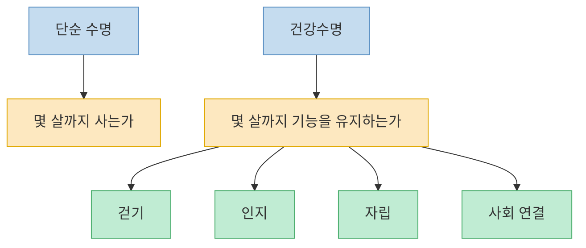
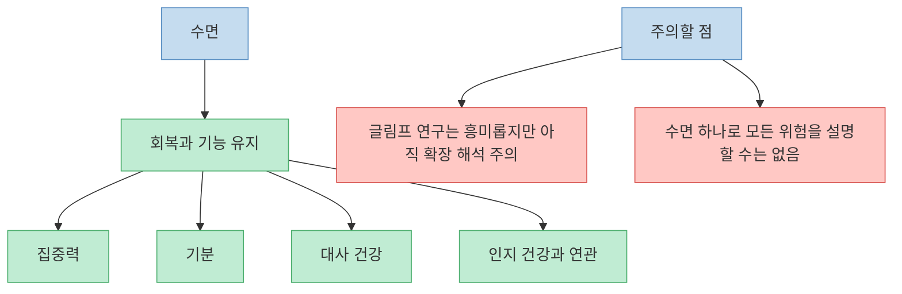
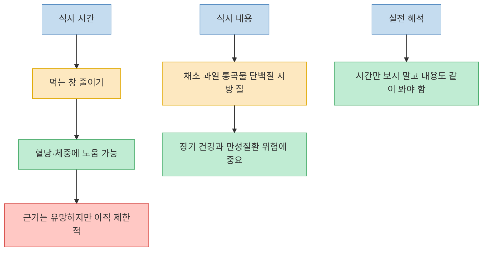
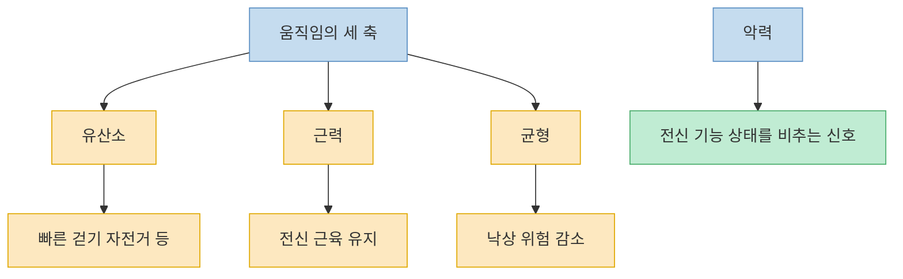
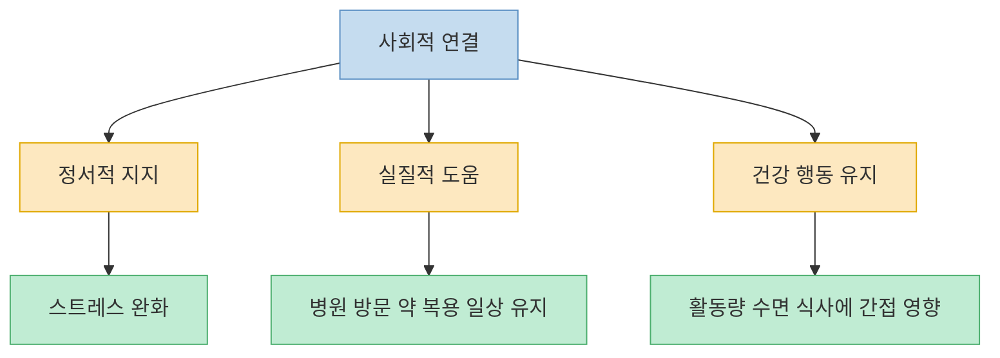

이 영상의 핵심은 단순하다. 오래 사는 것보다 **마지막 10~20년을 얼마나 덜 아프고 덜 의존적으로 보내느냐**, 즉 건강수명이 더 중요하다는 것이다. 그리고 그 건강수명을 가르는 진짜 변수로 영상은 수면, 식사 시점, 근력과 저강도 유산소, 마지막으로 사회적 관계를 꼽는다. 다만 제목처럼 `달리기·채식은 거짓말`이라고 밀어붙이면 과장이 된다. 실제 공식 자료를 같이 보면, 영상은 **우선순위를 다시 보자**는 문제제기에서는 유효하지만, **식단 질이나 일반 운동 권고가 쓸모없다**는 뜻으로 읽으면 곤란하다.

<!--more-->

## Sources

- [수명과 건강을 진짜 결정하는 단 3가지, "달리기·채식 다 거짓말입니다", 마지막 18년을 결정하는 단 3가지](https://www.youtube.com/watch?v=3FNfK-paVMI) — 세상읽기
- [Time-restricted eating for metabolic syndrome](https://www.nih.gov/news-events/nih-research-matters/time-restricted-eating-metabolic-syndrome) — NIH, 2024-10-22
- [Brain waste-clearance system shown in people for first time](https://www.nih.gov/news-events/nih-research-matters/brain-waste-clearance-system-shown-people-first-time) — NIH, 2024-10-15
- [Cognitive Health and Older Adults](https://www.nia.nih.gov/health/brain-health/cognitive-health-and-older-adults) — National Institute on Aging
- [What Counts as Physical Activity for Older Adults](https://www.cdc.gov/physical-activity-basics/adding-older-adults/what-counts.html) — CDC, 2025-12-04
- [Social Connection](https://www.cdc.gov/social-connectedness/about/index.html) — CDC, 2024-05-14
- [Handgrip strength measurement protocols for all-cause and cause-specific mortality outcomes in more than 3 million participants: A systematic review and meta-regression analysis](https://pubmed.ncbi.nlm.nih.gov/36215867/) — PubMed

---

## 이 영상이 진짜로 말하는 것은 `오래 사는 법`보다 `마지막 18년을 어떻게 보낼지`다

영상은 초반부터 건강 담론의 초점을 `수명`에서 `건강수명`으로 바꾼다. 오래 살아도 마지막 구간을 병상 위에서 보내면 게임이 다르다는 식이다. 이 문제제기 자체는 꽤 타당하다. 실제로 공공 보건과 노화 연구에서도 단순 기대수명보다 기능 유지, 독립성, 인지와 이동 능력 유지가 더 중요한 지표로 다뤄진다. 영상이 자극적인 제목을 달았어도, 본론의 중심축은 사실 `채식이냐 고기냐`보다 **노년 기능 유지**에 있다. [영상 00:41](https://www.youtube.com/watch?v=3FNfK-paVMI&t=41s), [영상 02:22](https://www.youtube.com/watch?v=3FNfK-paVMI&t=142s)

이 프레임 전환이 중요한 이유는 우선순위를 바꾸기 때문이다. 체중 숫자나 하루 칼로리보다, 나이가 들어도 **잘 자고, 잘 움직이고, 스스로 생활하고, 고립되지 않는 상태**가 더 핵심이 된다. 그래서 이 글도 영상 제목의 과한 문구보다, 그 안에 들어 있는 우선순위 재배치를 중심으로 읽는 편이 낫다.

---

## 1번으로 수면을 놓는 건 이해되지만, `글림프가 다 해결한다` 식의 단정은 과하다

영상은 수면을 최우선 변수로 놓는다. 특히 깊은 수면 동안 뇌 청소가 일어나는 `글림프 시스템` 이야기를 핵심 근거처럼 사용한다. [영상 04:09](https://www.youtube.com/watch?v=3FNfK-paVMI&t=249s), [영상 06:01](https://www.youtube.com/watch?v=3FNfK-paVMI&t=361s) 이 주장은 완전히 허황된 것은 아니다. NIH는 2024년 사람에서 뇌의 폐기물 배출 경로를 보여주는 소규모 연구를 소개했고, 이 시스템이 수면과 연관될 가능성을 강조했다. 다만 이 연구는 **5명의 수술 환자**를 다룬 proof-of-principle 성격이 강하다. 즉, `잠만 잘 자면 알츠하이머를 막는다` 수준으로 읽으면 안 된다.

공식 자료 쪽에서 더 안정적인 결론은 따로 있다. NIA는 인지 건강을 위해 **대체로 7~9시간 수면**, 만성질환 관리, 금연, 신체 활동, 균형 잡힌 식사를 함께 권한다. 다시 말해 수면은 분명 중요하지만, 영상처럼 거의 모든 것을 설명하는 `왕중왕 변수`로 단순화하면 오히려 전체 그림을 놓친다.

영상의 실천 제안 중 `일찍 눕고 깊게 자는 환경을 먼저 손보라`는 방향은 받아들일 만하다. 다만 `분할 수면은 무조건 동일하지 않다`, `수면제는 무조건 가짜 잠이다`처럼 넓게 일반화하는 대목은 개인의 질환, 불면, 치료 맥락을 지워버릴 수 있어 조심해서 봐야 한다. 수면 문제가 지속되면 생활 습관만이 아니라 진료가 필요한 경우도 많다.

---

## 2번 식사 시점은 생각보다 중요하지만, `무엇을 먹는지보다 100배 세다`는 근거는 부족하다

영상은 식단 내용보다 식사 창을 줄이는 것이 훨씬 강력하다고 말한다. 아침은 산업화 시대 습관일 뿐이고, 저녁을 일찍 끝내고 다음 날 늦게 첫 끼를 먹는 16시간 공복 쪽이 건강수명에 더 중요하다는 식이다. [영상 12:00](https://www.youtube.com/watch?v=3FNfK-paVMI&t=720s), [영상 14:23](https://www.youtube.com/watch?v=3FNfK-paVMI&t=863s)

여기서 공식 자료와 대조하면 균형이 잡힌다. NIH는 2024년 대사증후군 환자 연구를 소개하며 **하루 8~10시간 eating window**가 혈당과 체중, 복부 지방에서 **완만한 개선**을 보였다고 설명했다. 하지만 동시에 **더 크고 긴 연구가 필요하다**고 적었다. 즉, 식사 시점은 실제로 의미가 있을 수 있지만, 아직은 `모든 걸 뒤집는 절대 변수`라기보다 **도움이 될 수 있는 전략**에 가깝다.

반대로 NIA와 CDC 자료를 보면 건강한 노화에는 여전히 **균형 잡힌 식사 자체**가 중요하다. 채소, 과일, 통곡물, 단백질, 지방의 질을 무시하고 `시간만 바꾸면 된다`고 말할 근거는 없다. 영상 제목의 `채식 다 거짓말`은 그래서 과장에 가깝다. 식단 질과 식사 시간은 경쟁 관계라기보다 함께 봐야 한다.

그래서 영상에서 건질 만한 포인트는 이것이다. `무조건 아침을 많이 먹어야 한다`는 도그마를 의심해 볼 수는 있다. 하지만 그 다음 결론이 `아무거나 먹어도 되고 시계만 바꾸면 된다`가 되어서는 안 된다. 특히 당뇨, 저혈당 위험, 약 복용, 수면장애, 교대근무가 있다면 식사 시점 조정도 개인화가 필요하다.

---

## 3번 근력과 존투를 강조한 건 설득력이 크다, 다만 `달리기 무용론`으로 읽으면 곤란하다

영상 후반부는 악력과 가벼운 유산소를 강하게 밀어준다. 악력이 전신 상태의 지표이고, 숨이 너무 차지 않는 저강도 지속 운동이 노년 기능 유지에 더 남는다는 주장이다. [영상 15:30](https://www.youtube.com/watch?v=3FNfK-paVMI&t=930s), [영상 18:03](https://www.youtube.com/watch?v=3FNfK-paVMI&t=1083s)

이 부분은 영상 전체에서 가장 실용적이다. 실제로 악력은 여러 코호트와 리뷰에서 사망, 장애, 질병 위험과 **연관된 지표**로 자주 다뤄진다. 다만 중요한 건 `예측 인자`라는 점이다. 악력이 약하다고 해서 손아귀 힘만 키우면 모든 위험이 해결된다는 뜻은 아니다. 악력은 전신 근력, 영양 상태, 활동량, 질환 burden을 압축해서 보여주는 표지에 가깝다.

CDC도 노년기 신체 활동에서 **유산소 + 근력 + 균형 운동**을 함께 권한다. 그리고 중등도 활동의 대표 예로 brisk walking을 든다. 즉, 영상이 말하는 `빠르게 걷기 30분`, `근력 유지`, `헬스장보다 지속 가능한 패턴`은 공식 권고와 꽤 잘 맞는다. 반면 `달리기 믿음은 박살내자`는 표현은 너무 세다. 달리기가 문제라기보다, **한 가지 운동만 만능 해결책처럼 믿는 태도**가 문제에 더 가깝다.

결국 영상의 메시지를 현실적으로 번역하면 이렇다. `운동을 해야 한다`가 아니라, **나이 들수록 오래 걷고, 버티고, 들고, 균형 잡는 능력을 잃지 말아야 한다**는 것이다. 그 의미에서는 달리기보다 걷기와 근력의 조합을 우선순위 상단에 놓는 설명이 꽤 설득력 있다.

---

## 마지막 반전으로 나온 `사회적 관계`는 의외가 아니라, 오히려 가장 놓치기 쉬운 축이다

영상은 마지막에 사회적 관계를 네 번째이자 어쩌면 가장 센 변수처럼 꺼낸다. [영상 20:56](https://www.youtube.com/watch?v=3FNfK-paVMI&t=1256s) 여기서의 방향도 크게 틀리지 않는다. CDC는 사회적 연결이 더 긴 삶, 더 나은 건강, 더 나은 수면, 스트레스 완화와 관련이 있다고 정리한다. 반대로 고립과 외로움은 우울, 치매, 심혈관 질환 같은 위험과 엮인다.

중요한 건 이 변수가 `마음 건강`에만 국한되지 않는다는 점이다. 관계의 질은 식습관, 활동량, 의료 접근, 스트레스 조절, 약 복용 순응도까지 간접적으로 흔든다. 그래서 영상 마지막의 `친구에게 안부 문자 하나 보내는 것`은 다소 드라마틱한 표현이지만, 관계를 건강 행위의 바깥 문제로 취급하지 말라는 메시지로 읽으면 충분히 의미가 있다.

오히려 건강 루틴을 개인 의지의 문제로만 보는 시선보다, **누구와 연결되어 있는가**를 같이 보는 관점이 더 현실적일 수 있다. 수면도, 운동도, 식사도 혼자서는 오래 유지하기 어렵기 때문이다.

---

## 핵심 요약

- 영상의 진짜 주제는 `오래 살기`보다 `건강수명`, 즉 노년 기능 유지다.
- 수면을 최우선으로 놓는 방향은 이해되지만, 글림프 시스템 하나로 건강을 설명하는 식의 단정은 과하다.
- 식사 시간 제한은 도움 가능성이 있지만, 공식 자료 기준으로는 아직 `완만한 개선` 수준의 근거가 더 안전하다.
- 식단의 질은 여전히 중요하다. `무엇을 먹는지보다 언제 먹는지가 100배 세다`고 말할 근거는 부족하다.
- 근력, 걷기, 균형 능력 유지는 노년 건강수명 관점에서 매우 실용적이다.
- 사회적 관계는 보너스 항목이 아니라 건강 행동 전체를 받치는 구조적 변수에 가깝다.

---

## 결론

이 영상은 제목은 과하지만 문제제기는 좋다. 건강을 체중, 칼로리, 유행 식단, 빡센 운동 한 가지로 환원하지 말고, **잘 자는가, 식사 리듬이 정돈되어 있는가, 몸을 지탱할 힘이 있는가, 혼자 고립되어 있지 않은가**를 먼저 보라는 것이다.

그래서 가장 현실적인 결론은 `달리기나 채식은 다 틀렸다`가 아니다. 오히려 그 반대에 가깝다. **좋은 식사와 운동은 여전히 중요하지만, 건강수명을 보려면 수면·리듬·근력·관계까지 한 단계 넓게 봐야 한다**는 것이다.
