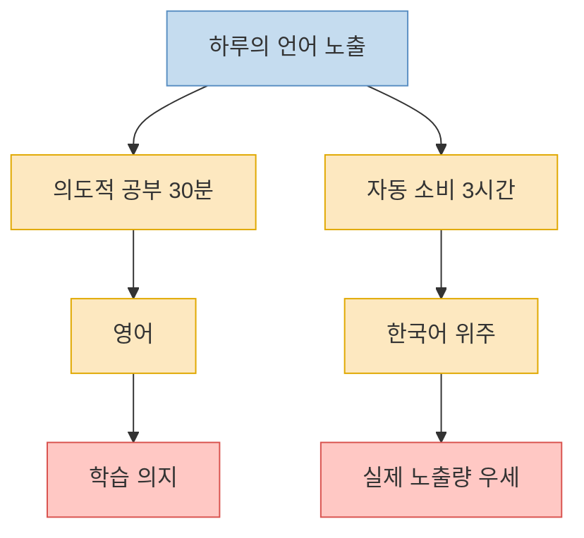
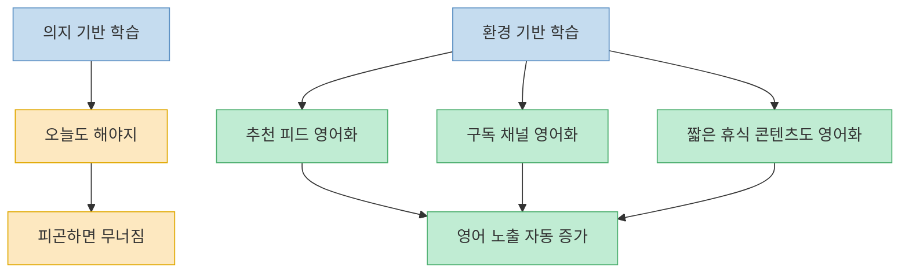
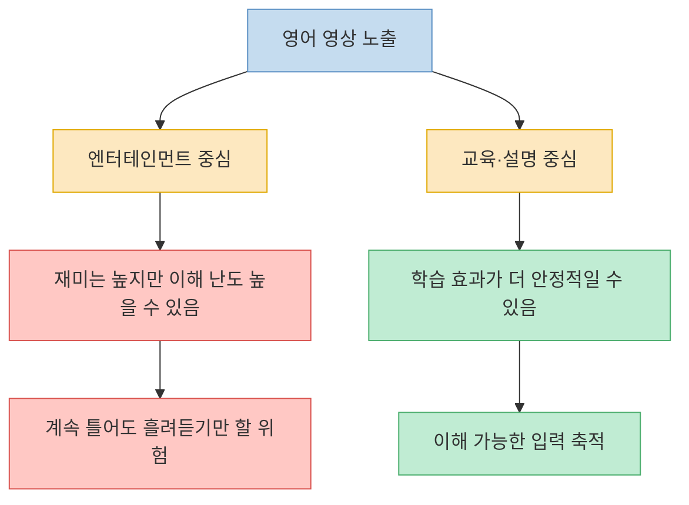
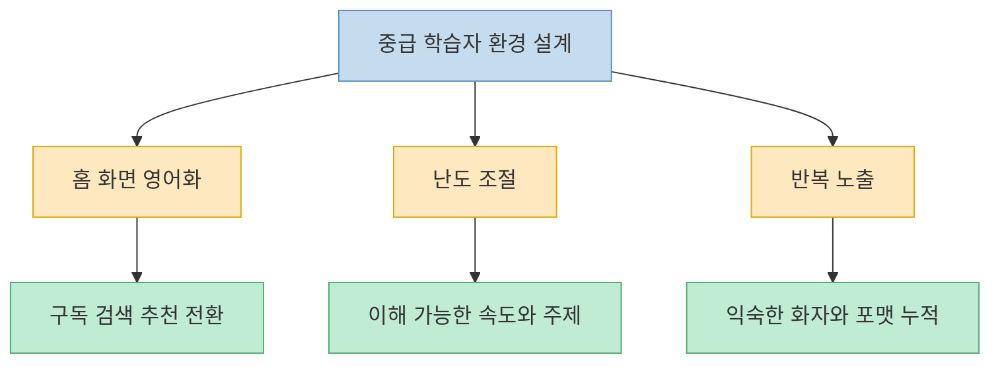

이 Threads 글의 핵심은 아주 직설적이다. 영어 공부를 따로 30분 해 놓고, 나머지 쉬는 시간에는 한국어 유튜브를 3시간씩 본다면 결국 `노출량 싸움`에서 진다는 것이다. 그래서 저자는 공부법보다 먼저 **유튜브 홈 화면과 알고리즘 자체를 영어 쪽으로 돌리라**고 말한다. 이 주장은 다소 과감하지만, 외국어 학습에서 `어떤 입력에 얼마나 자주 노출되는가`가 중요하다는 점을 생각하면 꽤 설득력이 있다. 다만 여기서도 중요한 보정이 하나 있다. **영어에 많이 노출되는 것**과 **이해 가능한 영어에 꾸준히 노출되는 것**은 다르다.

<!--more-->

## Sources

- [Threads 원문](https://www.threads.com/@tonytotally001/post/DYEZzA5EiKD?xmt=AQG0gLftLVbHqMUibyQembhi8ixY5FW4sF1b9YkNrtH1ktb6oo6GC8SRldgqwgGUGQmJ3Xdz&slof=1) — @tonytotally001
- [EXTENSIVE LISTENING AND VIEWING IN ELT](https://journal.teflin.org/index.php/journal/article/view/729) — TEFLIN Journal, 2019
- [The effects of audiovisual input on second language learning: A meta-analysis](https://www.cambridge.org/core/journals/studies-in-second-language-acquisition/article/effects-of-audiovisual-input-on-second-language-learning-a-metaanalysis/9B61BAEF14F110F01148E398D171634A) — Studies in Second Language Acquisition, 2026

---

## 이 Threads가 찌르는 지점은 `공부 시간`보다 `기본 배경음`이다

원문은 이렇게 말한다. `영어 귀 안 뚫리는 사람 특징: 유튜브 홈 화면이 온통 한국어임.` 그리고 `영어 공부 30분 vs 한국 유튜브 영상은 3시간. 이 노출량 싸움에서 지면 절대 안 들려.` [원문](https://www.threads.com/@tonytotally001/post/DYEZzA5EiKD?xmt=AQG0gLftLVbHqMUibyQembhi8ixY5FW4sF1b9YkNrtH1ktb6oo6GC8SRldgqwgGUGQmJ3Xdz&slof=1)

이 말이 날카로운 이유는 많은 사람이 영어를 `공부 세션` 안에만 가둬 두기 때문이다. 단어장, 강의, 쉐도잉 20분은 영어 시간이고, 그 밖의 나머지 휴식·심심함·알고리즘 소비 시간은 전부 모국어로 돌아간다. 그러면 영어는 하루의 메인 환경이 아니라 잠깐 들르는 과외 과목이 된다.

Threads의 포인트는 바로 여기다. 실력은 종종 `결심`보다 `기본값`을 따라간다. 내가 쉬는 시간에 무엇을 자동으로 켜는지, 추천 피드가 어느 언어로 채워지는지, 심심할 때 손이 가는 짧은 영상이 어느 언어인지가 실제 누적 노출을 좌우한다.

---

## 그래서 핵심은 영어 공부를 더 얹는 게 아니라, 소비 환경을 영어 쪽으로 기울이는 것이다

원문이 말하는 `알고리즘 세팅`은 결국 기술적 버튼 설명이라기보다 환경 설계의 문제다. 어차피 유튜브를 볼 거라면, 홈 화면 추천·구독 채널·검색 습관을 영어 쪽으로 틀어 두라는 이야기다. 즉 `오늘 30분 더 버텨야지`가 아니라 **가만히 있어도 영어가 눈앞에 뜨는 상태**를 만드는 쪽에 가깝다.

이 접근은 외국어 학습의 오래된 직관과 맞닿아 있다. TEFLIN Journal의 리뷰는 extensive listening과 viewing을 단순 시험 듣기 훈련이 아니라, **쉽고 충분한 입력을 반복적으로 접하는 환경**으로 본다. 핵심은 억지로 어려운 것을 참는 게 아니라, 이해 가능한 수준의 자료를 넉넉하게 오래 접하는 데 있다.

여기서 중요한 건 `영어로 도배`가 무조건 원어민 속도 브이로그를 틀어 놓으라는 뜻은 아니라는 점이다. 중급 학습자라면 내 관심사를 유지하면서도, 대화 속도와 어휘 난도가 어느 정도 따라갈 수 있는 자료를 섞어야 환경 설계가 오래 간다.

---

## 다만 연구를 같이 보면 `아무 영어 영상`이 자동으로 실력을 올려주는 건 아니다

여기서 한 번 식혀 볼 필요가 있다. 2026년 메타분석은 audiovisual input이 L2 학습에 **작지만 유의미한 효과**를 보였다고 정리한다. 그런데 재미있는 건, TV 시리즈나 영화 같은 entertainment 중심 영상보다 TED, 다큐, language-focused video 쪽의 효과가 더 컸다는 점이다. 즉 영상 노출은 분명 도움이 될 수 있지만, **무슨 영상을 어떻게 보느냐**에 따라 효과 차이가 난다.

Threads의 문장을 그대로 믿고 영어 영상만 마구 틀어 놓으면, 실제로는 `배경 소음`만 늘고 이해 가능한 입력은 적을 수도 있다. 반대로 내 수준보다 조금 쉬운 뉴스 요약, 설명형 채널, 자막이 안정적인 인터뷰, 반복 표현이 많은 콘텐츠는 훨씬 학습 친화적일 수 있다.

그래서 이 Threads의 주장에 연구를 덧붙이면 이렇게 정리할 수 있다. `한국어 알고리즘에 잠식된 상태`는 분명 손해다. 하지만 해결책은 `영어 영상 총량`만 늘리는 게 아니라, **이해 가능한 영어 입력의 비율을 올리는 것**이다.

---

## 중급 학습자에게 더 맞는 해석은 `홈 화면 영어화 + 난도 조절 + 반복 노출`이다

원문이 `(중급용)`이라고 붙인 이유도 여기에 있을 가능성이 크다. 초급자는 알고리즘을 영어로 바꿔도 대부분의 입력이 너무 빠르고 어려워서 오히려 지칠 수 있다. 반면 중급자는 이미 기본 문장 구조와 빈출 표현을 알고 있기 때문에, 생활 속 노출량이 늘어나면 듣기 감각이 조금씩 붙기 시작한다.

실전에서는 세 가지가 중요하다.

첫째, **홈 화면과 구독 목록을 바꾸는 것**이다. 내 관심사 자체를 영어 채널로 대체해야 한다. 생산성, 테크, 영화 해설, 인터뷰, 요리, 여행처럼 내가 원래 보던 장르를 영어로 바꾸는 쪽이 오래 간다.

둘째, **난도를 과하게 올리지 않는 것**이다. `원어민이니까 무조건 좋다`가 아니다. 속도와 억양이 너무 빠르면 흘려듣기만 하게 된다. 짧고 반복 표현이 많은 영상이 오히려 낫다.

셋째, **반복 접촉이 가능한 포맷을 고르는 것**이다. 같은 채널, 같은 말투, 같은 주제군을 오래 보면 귀가 먼저 적응한다. 완전히 새로운 채널을 계속 옮겨 다니는 것보다 `익숙한 화자`를 누적하는 편이 더 낫다.

이렇게 보면 Threads의 메시지는 단순한 자극 문구가 아니라, 영어 공부를 `세션`이 아니라 `생활 기본값`으로 옮기라는 제안으로 읽힌다.

---

## 핵심 요약

- 이 Threads의 요지는 `영어 공부 시간`보다 `일상 노출 환경`이 실력을 더 크게 흔들 수 있다는 것이다.
- 유튜브 홈 화면과 추천 피드가 전부 한국어면, 영어는 잠깐 공부하는 과목으로만 남기 쉽다.
- extensive listening/viewing 관점에서도 충분하고 반복적인 입력 환경은 중요하다.
- 다만 아무 영어 영상이나 많이 보는 것이 자동으로 큰 효과를 내는 것은 아니다.
- 최근 메타분석은 영상 입력이 학습에 도움이 될 수 있지만, 엔터테인먼트 영상보다 교육·설명형 영상이 더 효과적일 수 있음을 보여준다.
- 중급 학습자에게는 `홈 화면 영어화 + 이해 가능한 난도 + 반복 노출` 조합이 가장 현실적이다.

---

## 결론

이 글이 남기는 가장 좋은 문장은 아마 이것일 것이다. **실력은 결심보다 기본값을 따라간다.** 영어를 잘하고 싶다면 공부 시간을 조금 더 짜내는 것만큼, 쉬는 시간의 자동 추천 화면을 어느 언어로 채울지도 함께 바꿔야 한다.

그러니 핵심은 `영어 영상 많이 보기`가 아니다. **내 일상에서 영어가 저절로 재생되는 환경을 만드는 것**, 그리고 그 입력이 너무 어렵지 않도록 조절하는 것이다. 영어 귀는 한 번의 결심보다, 반복되는 기본 설정에서 더 자주 열린다.
