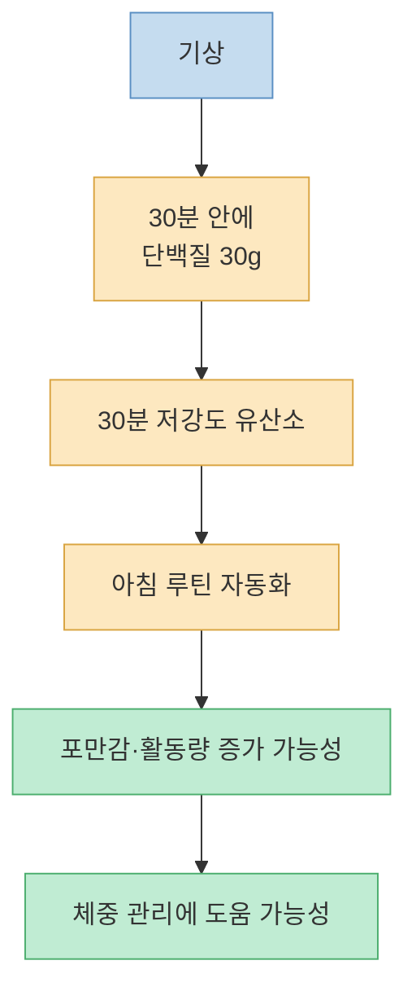
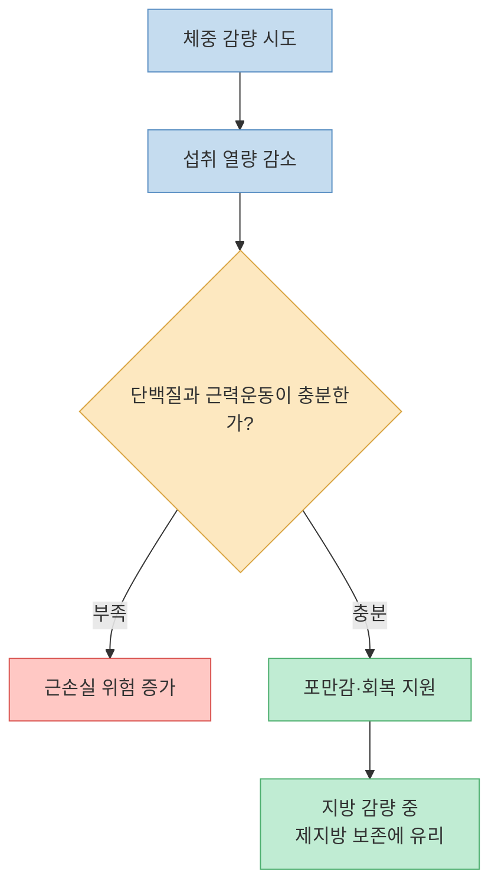
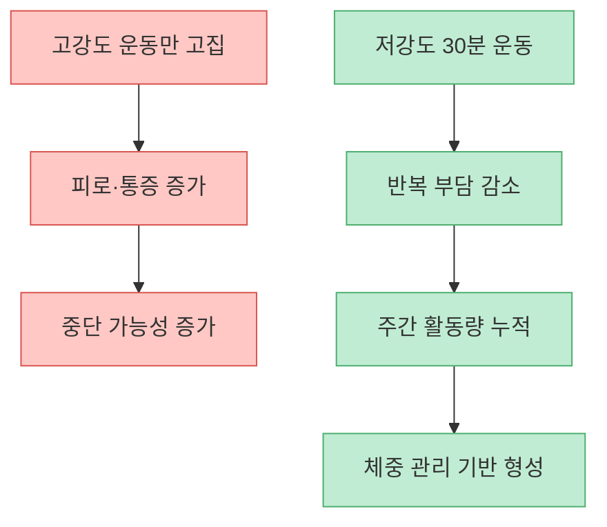
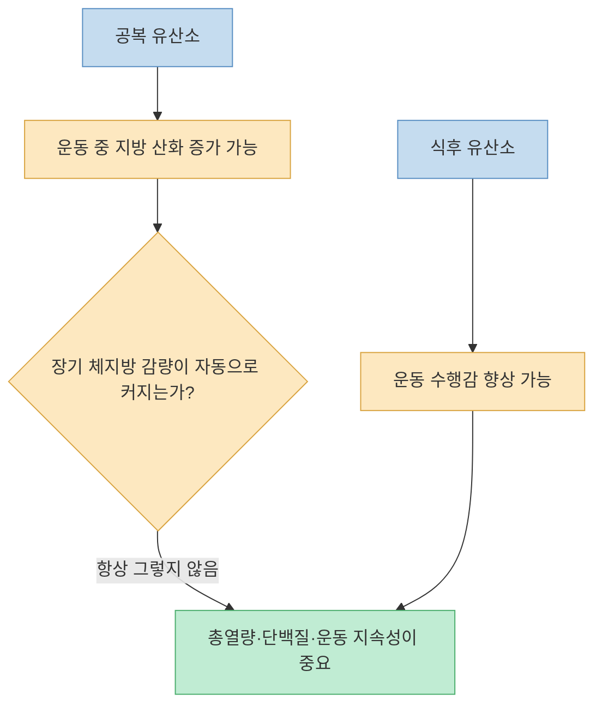
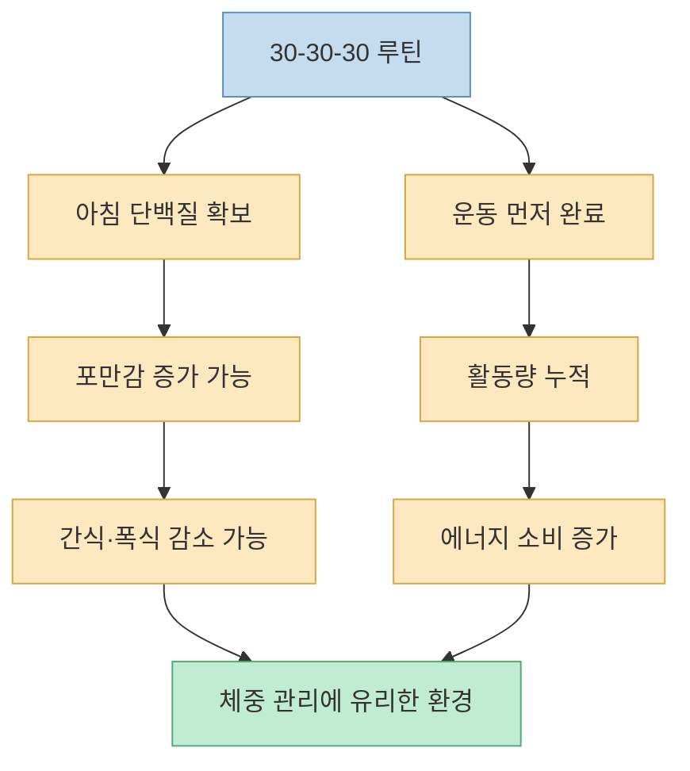
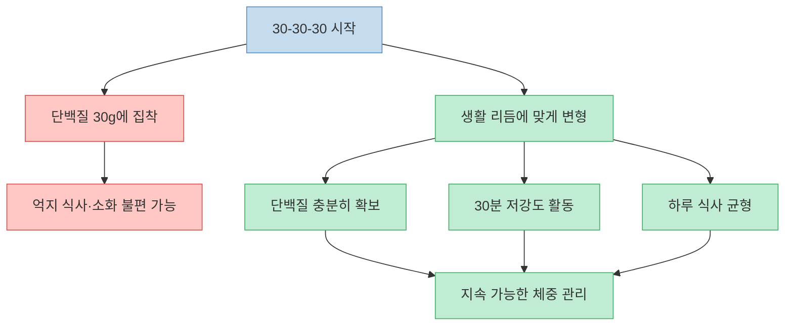

Shorts 영상은 “굶고 뛰어야 살이 잘 빠진다”는 믿음이 틀렸다고 말하며, 대신 `30-30-30` 방법을 제안한다. 기상 후 30분 안에 단백질 30g을 먹고, 이어서 30분 동안 낮은 강도의 유산소 운동을 하라는 공식이다. 이 방식은 아침 식사와 운동을 자동화한다는 점에서 꽤 실용적이다. 다만 영상 속 “공복 운동을 하면 몸이 근육을 소화한다”거나 “지방은 에너지로 바꾸는 데 5시간이 걸린다”는 설명은 과학적으로 지나치게 단순하고 과장되어 있다.

<!--more-->

## Sources

- [YouTube Shorts: 53,000명이 6주 만에 증명한 다이어트 공식](https://youtube.com/shorts/oqfj6V5MVDU?si=yfqd28PdTXmDruQi)
- [Mayo Clinic Press: What Is The Trending 30-30-30 Diet Method and Does the Rule Actually Work?](https://mcpress.mayoclinic.org/nutrition-fitness/what-is-the-30-30-30-diet-and-does-it-work/)
- [Cleveland Clinic: How To Follow the 30-30-30 Diet](https://health.clevelandclinic.org/30-30-30-diet)
- [Journal of Functional Morphology and Kinesiology: Effect of Overnight Fasted Exercise on Weight Loss and Body Composition](https://www.mdpi.com/2411-5142/2/4/43)
- [British Journal of Nutrition: Effects of aerobic exercise performed in fasted v. fed state](https://pubmed.ncbi.nlm.nih.gov/27609363/)
- [Journal of the International Society of Sports Nutrition: ISSN position stand on nutrient timing](https://jissn.biomedcentral.com/articles/10.1186/s12970-017-0189-4)
- [Journal of the International Society of Sports Nutrition: ISSN position stand on protein and exercise](https://jissn.biomedcentral.com/articles/10.1186/s12970-017-0177-8)

---

## 영상의 주장: 굶고 뛰는 대신 `30-30-30`을 하라

영상은 시작부터 “굶고 뛰어야 잘 빠진다”는 생각이 틀렸다고 말한다. 이어서 공복 상태로 운동하면 혈당과 글리코겐이 부족해지고, 운동 중 에너지가 떨어지면 몸이 지방보다 근육을 먼저 쓴다는 식으로 설명한다. [영상 00:00](https://youtu.be/oqfj6V5MVDU?t=0)

그 대안으로 제시되는 것이 `30-30-30`이다. 즉 기상 후 30분 안에 단백질 30g을 먹고, 이어서 30분 동안 안정적인 심박수의 유산소 운동을 하는 방식이다. 영상은 특히 심박수를 135bpm 아래로 낮추라고 말한다. [영상 00:42](https://youtu.be/oqfj6V5MVDU?t=42)

이 공식을 가장 좋게 해석하면 “아침에 단백질을 먼저 확보하고, 무리하지 않는 유산소 운동을 매일 하게 만드는 행동 설계”다. Mayo Clinic Press와 Cleveland Clinic도 30-30-30 자체를 마법 같은 지방 감량 공식으로 보지는 않지만, 단백질 아침 식사와 규칙적인 아침 운동이 포만감과 운동 습관 형성에 도움이 될 수 있다고 설명한다.

---

## 좋은 점 1: 아침 단백질은 포만감과 근육 보존에 도움이 될 수 있다

30g 단백질이라는 숫자는 완전히 엉뚱한 조언은 아니다. 많은 사람의 아침 식사는 탄수화물 위주로 흐르기 쉽다. 빵, 시리얼, 떡, 달달한 커피만 먹으면 금방 배가 꺼지고 오전 간식으로 이어질 수 있다. 아침에 단백질을 충분히 넣으면 포만감이 늘고, 하루 총 단백질 목표를 채우기 쉬워진다.

운동영양학 관점에서도 단백질 섭취는 중요하다. ISSN의 단백질과 운동에 관한 입장은 운동하는 사람이 근육 회복과 적응을 위해 하루 단백질 총량과 식사별 분배를 신경 써야 한다고 본다. 특히 체중 감량 중에는 에너지 섭취가 줄어 근육 손실 위험이 커질 수 있으므로, 단백질과 저항운동은 더 중요해진다.

다만 “기상 후 반드시 30분 안에 먹어야 한다”는 부분은 근거가 약하다. 단백질 섭취의 핵심은 `정확히 몇 분 안에 먹었는가`보다 하루 총량, 식사별 분배, 운동과의 전체적인 조합이다. 아침을 먹기 어려운 사람이라면 30분 규칙에 억지로 맞추기보다, 자기 생활 리듬 안에서 단백질을 안정적으로 채우는 방식이 더 지속 가능하다.

---

## 좋은 점 2: 저강도 유산소는 초보자에게 지속 가능하다

영상이 제안하는 운동은 전력질주나 고강도 인터벌이 아니라 30분의 steady-state cardio, 즉 일정한 강도의 유산소 운동이다. 걷기, 실내 자전거, 가벼운 조깅처럼 숨은 차지만 대화를 완전히 못 할 정도는 아닌 운동에 가깝다. [영상 00:50](https://youtu.be/oqfj6V5MVDU?t=50)

이 접근은 초보자에게 장점이 있다. 너무 힘든 운동은 며칠 하다가 중단되기 쉽지만, 낮은 강도의 운동은 반복 가능성이 높다. 체중 감량에서 중요한 것은 단일 운동 세션의 “지방 연소 모드”보다 몇 주, 몇 달 동안 누적되는 활동량과 식습관이다.

다만 심박수 135bpm이라는 기준은 모든 사람에게 같은 의미가 아니다. 나이, 안정시 심박수, 약물, 체력 수준에 따라 같은 135bpm도 누군가에게는 가볍고 누군가에게는 과할 수 있다. 따라서 더 현실적인 기준은 “숨은 약간 차지만 대화는 가능한 정도” 또는 개인 심박 구간을 기준으로 삼는 것이다.

---

## 과장된 부분: 공복 유산소가 곧바로 근육을 녹인다는 설명은 틀렸다

영상은 공복 상태로 운동하면 20분쯤 지나 글리코겐이 떨어지고, 지방은 에너지로 바꾸는 데 오래 걸리므로 몸이 근육을 태운다고 설명한다. [영상 00:20](https://youtu.be/oqfj6V5MVDU?t=20)

이 설명은 설득력 있게 들리지만 실제 대사는 훨씬 복잡하다. 몸은 운동 중 탄수화물과 지방을 동시에 사용하며, 운동 강도와 지속 시간, 훈련 상태, 전날 식사, 간·근육 글리코겐 상태에 따라 비율이 달라진다. “지방은 5시간, 근육은 3분”처럼 단순한 시간표로 움직이지 않는다.

공복 유산소가 항상 더 많은 지방 감량으로 이어지는 것도 아니다. 공복 운동은 운동 중 지방 산화 비율을 높일 수 있지만, 체지방 감소는 결국 장기적인 에너지 균형과 식사, 운동 지속성에 좌우된다. 공복 유산소와 식후 유산소를 비교한 메타분석들은 체중과 체성분 변화에서 뚜렷한 우위를 단정하기 어렵다고 정리한다.

그렇다고 공복 운동이 무조건 나쁘다는 뜻도 아니다. 어떤 사람은 아침 공복 걷기가 속이 편하고 꾸준히 하기 쉽다. 반대로 어떤 사람은 어지럽거나 운동 강도가 떨어지고, 이후 폭식으로 이어질 수 있다. 핵심은 “공복이냐 식후냐”가 아니라 자신에게 지속 가능한 방식으로 운동을 반복하고, 하루 전체 식사를 관리하는 것이다.

---

## 30-30-30이 효과를 낼 수 있는 진짜 이유

30-30-30이 효과를 낸다면, 그 이유는 특별한 대사 스위치 때문이라기보다 행동 설계 때문이다. 아침에 단백질을 먹으면 오전 허기가 줄 수 있고, 운동을 먼저 끝내면 하루 활동량이 확보된다. 또한 아침 루틴이 정리되면 늦은 밤 폭식이나 불규칙한 식사 패턴을 고치기 쉬워질 수 있다.

Mayo Clinic Press도 30-30-30을 “최고의 체중 감량법”으로 보지는 않는다. 다만 단백질이 많은 아침 식사가 포만감에 도움을 줄 수 있고, 아침 운동은 하루 운동을 미루지 않게 만드는 장점이 있다고 설명한다. Cleveland Clinic 역시 이 방법을 식단 전체와 총열량을 무시해도 되는 공식이 아니라, 건강한 아침 루틴으로 해석한다.

즉 30-30-30은 `지방을 가장 빨리 녹이는 공식`이라기보다 `아침을 단백질과 움직임으로 시작하게 만드는 체크리스트`에 가깝다. 이 관점으로 보면 훨씬 안전하고 오래 쓸 수 있다.

---

## 실천하려면 이렇게 바꾸는 편이 안전하다

첫째, 단백질 30g은 목표치로 두되, 음식으로 자연스럽게 맞추는 편이 좋다. 예를 들어 달걀, 그릭요거트, 두부, 생선, 닭가슴살, 살코기, 콩류를 조합할 수 있다. 단백질 파우더는 편의성 도구일 수 있지만 필수는 아니다.

둘째, 운동 강도는 심박수 숫자 하나보다 체감 강도로 조절하는 것이 낫다. 초보자는 빠르게 걷기부터 시작해도 충분하다. 무릎 통증이나 심혈관 질환이 있다면 달리기보다 걷기, 자전거, 수영처럼 관절 부담이 낮은 운동이 더 적합할 수 있다.

셋째, 체중 감량이 목적이라면 30-30-30만 하고 나머지 식사를 마음대로 먹어도 된다고 생각하면 안 된다. 어떤 루틴도 장기적인 열량 과잉을 이기지는 못한다. 반대로 너무 적게 먹으면 운동 지속성이 떨어지고 근손실 위험이 커질 수 있다.

넷째, 당뇨병 약, 혈압약, 심장질환, 신장질환, 임신·수유, 섭식장애 병력이 있다면 이 루틴도 의료진과 상의하는 편이 안전하다. 특히 단백질 섭취량 조절이 필요한 신장질환자나, 운동 중 저혈당 위험이 있는 사람은 일반적인 Shorts 조언을 그대로 따라 해서는 안 된다.

---

## 핵심 요약

- 영상은 공복으로 무리하게 뛰기보다, 기상 후 단백질 30g과 30분 저강도 유산소를 결합한 `30-30-30`을 제안한다. [영상 00:42](https://youtu.be/oqfj6V5MVDU?t=42)
- 아침 단백질과 저강도 운동은 포만감, 습관 형성, 활동량 증가 측면에서 도움이 될 수 있다.
- 하지만 “공복 운동을 하면 곧바로 근육을 태운다”거나 “지방은 에너지로 바꾸는 데 5시간이 걸린다”는 설명은 과장이다. [영상 00:20](https://youtu.be/oqfj6V5MVDU?t=20)
- 공복 운동과 식후 운동 중 무엇이 더 좋은지는 개인차가 크며, 체지방 감량은 결국 장기적인 식사·운동 지속성에 좌우된다.
- 30-30-30은 마법 공식이 아니라, 아침을 단백질과 움직임으로 시작하게 만드는 실천 루틴으로 이해하는 것이 가장 안전하다.

## 결론

30-30-30은 “53,000명이 증명한 지방 삭제 공식”이라기보다, 꽤 괜찮은 아침 루틴 템플릿이다. 단백질을 먼저 챙기고, 무리하지 않는 유산소 운동을 매일 반복하게 만든다는 점에서 실용성이 있다.

하지만 이 방법이 특별한 대사 법칙 때문에 다른 모든 다이어트보다 압도적으로 빠르다고 보기는 어렵다. 효과를 내려면 결국 하루 전체 식사, 총열량, 단백질 총량, 운동 지속성, 수면이 함께 맞아야 한다. 그러니 30-30-30을 한다면 “무조건 30분 안에 먹어야 한다”는 강박보다, **아침에 단백질을 충분히 먹고 30분 움직이는 습관** 으로 가볍게 시작하는 편이 좋다.

