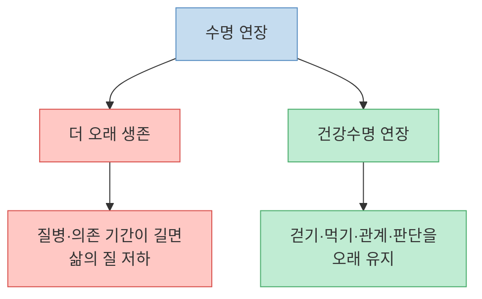
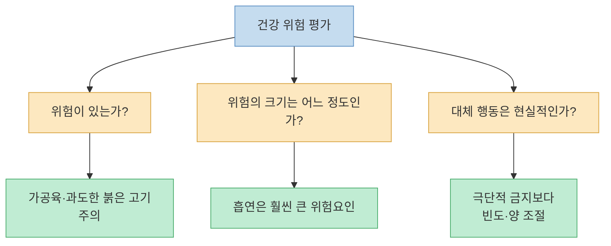
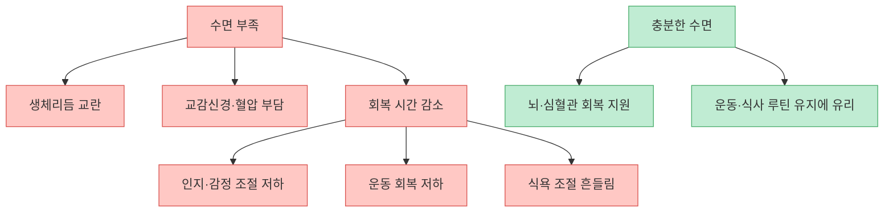
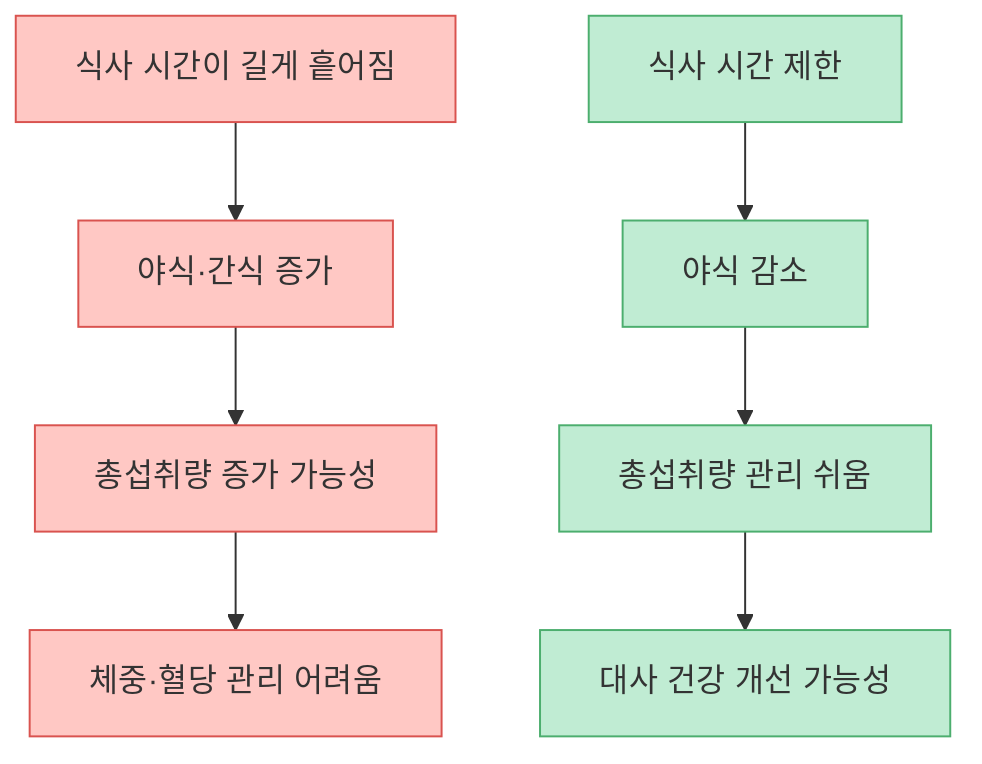
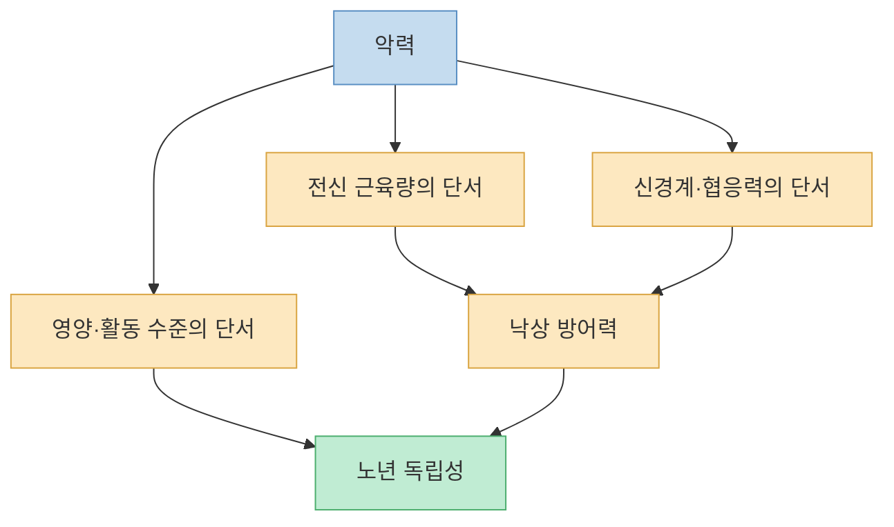
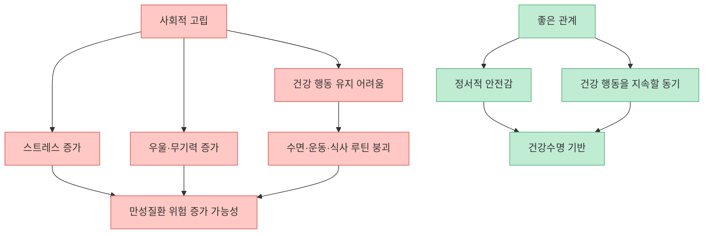
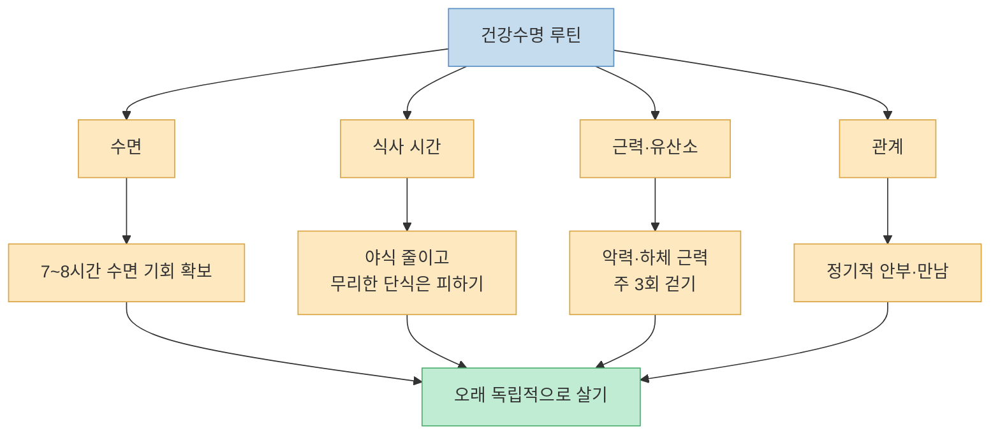

영상은 평균수명보다 `건강수명`이 중요하다고 말하면서, 오래 살기보다 오래 움직이고 오래 독립적으로 사는 것이 핵심이라고 주장한다. 이를 위해 수면, 식사 시간, 악력과 저강도 유산소, 사회적 관계라는 네 가지 변수를 제시한다. 방향은 설득력 있다. 다만 영상은 메시지를 강하게 전달하기 위해 붉은 고기, 아침식사, 자가포식, 러닝의 위험을 다소 과장해서 말한다. 그래서 이 글에서는 영상의 핵심을 살리되, 근거가 있는 부분과 조심해서 해석해야 할 부분을 나눠 정리한다.

<!--more-->

## Sources

- [YouTube: “달리기와 채식, 전부 거짓말” 수명을 결정하는 4가지](https://youtu.be/cmbZBFJsCPo?si=omNTgfPOqAzS8Zks)
- [Korea.net: Life expectancy hits record 83.7 years](https://www.korea.net/NewsFocus/Society/view?articleId=283397)
- [OECD: Health at a Glance 2023](https://www.oecd.org/en/publications/health-at-a-glance-2023_7a7afb35-en.html)
- [IARC: Red Meat and Processed Meat](https://publications.iarc.who.int/Book-And-Report-Series/Iarc-Monographs-On-The-Identification-Of-Carcinogenic-Hazards-To-Humans/Red-Meat-And-Processed-Meat-2018)
- [IARC Q&A: carcinogenicity of red meat and processed meat](https://www.iarc.who.int/wp-content/uploads/2018/11/Monographs-QA_Vol114.pdf)
- [Daylight savings time and myocardial infarction](https://pmc.ncbi.nlm.nih.gov/articles/PMC4189320/)
- [Sleep drives metabolite clearance from the adult brain](https://www.science.org/doi/10.1126/science.1241224)
- [Intermittent fasting and weight loss: Systematic review](https://pmc.ncbi.nlm.nih.gov/articles/PMC7021351/)
- [Lancet PURE study: Prognostic value of grip strength](https://www.sciencedirect.com/science/article/pii/S0140673614620006)
- [Harvard Health: The power and prevalence of loneliness](https://www.health.harvard.edu/blog/the-power-and-prevalence-of-loneliness-2017011310977)

---

## 문제 제기: 오래 사는 것보다 `아프지 않게 오래 사는 것`

영상은 한국인의 평균 기대수명과 건강수명 사이에 큰 간격이 있다는 숫자로 시작한다. 핵심 메시지는 단순하다. 생존 기간이 늘어도 마지막 수십 년을 병상과 의존 상태로 보내면 삶의 질은 크게 떨어진다는 것이다. [영상 00:00](https://youtu.be/cmbZBFJsCPo?t=0)

이 문제 제기는 타당하다. 통계청이 발표한 2024년 한국 기대수명은 83.7년으로 높지만, 기대수명과 건강하게 독립적으로 사는 기간은 같은 개념이 아니다. OECD 역시 고령화 사회에서 단순한 수명 연장보다 기능, 만성질환, 정신건강, 돌봄 부담까지 포함한 건강수명 관리가 중요하다고 본다.

다만 영상처럼 “마지막 18년을 병상에 묶여 산다”고 표현하면 현실보다 자극적이다. 건강수명 지표는 질병·장애·주관적 건강 상태를 반영하는 통계적 개념이지, 모든 사람이 정확히 18년 동안 침대에 누워 지낸다는 뜻은 아니다. 따라서 이 숫자는 공포를 주는 문장보다 “평균수명과 건강하게 기능하는 기간 사이에 간극이 있다”는 경고로 읽는 편이 정확하다.

---

## 식단 논쟁보다 먼저 봐야 할 것: 위험의 크기를 비교하는 법

영상은 붉은 고기와 대장암 위험을 흡연과 폐암 위험에 비교하면서, 고기 몇 점에 지나치게 겁먹을 필요는 없다고 말한다. [영상 01:31](https://youtu.be/cmbZBFJsCPo?t=91)

여기에는 맞는 부분과 위험한 부분이 함께 있다. IARC는 가공육을 사람에게 발암성이 있는 물질로, 붉은 고기를 사람에게 발암 가능성이 있는 물질로 분류했다. 또한 하루 붉은 고기 100g 섭취 증가가 대장암 위험 증가와 관련될 수 있다고 설명한다. 그러므로 “붉은 고기 위험은 전부 거짓말”이라고 말하면 안 된다.

하지만 영상이 말하듯 위험의 크기는 구분해야 한다. 흡연은 폐암, 심혈관질환, 만성폐질환 등 여러 질환에서 매우 큰 위험요인이다. 반면 붉은 고기와 대장암의 관련성은 존재하더라도, 흡연과 폐암의 관련성만큼 압도적인 수준으로 해석하기는 어렵다. 즉 `고기를 조금 먹었다 = 건강을 망쳤다`가 아니라, 가공육과 과도한 붉은 고기 섭취를 줄이고 전체 식단의 질을 높이는 방향이 합리적이다.

아침식사에 대한 영상의 주장도 비슷하게 봐야 한다. “아침밥은 19세기 공장 시스템의 잔재”라는 표현은 흥미롭지만, 모든 아침식사가 나쁘다는 근거는 아니다. 어떤 사람에게는 아침 단백질 식사가 폭식을 줄이고 운동 루틴을 안정시키는 데 도움이 된다. 반대로 어떤 사람에게는 늦은 첫 끼가 더 잘 맞는다. 중요한 것은 `아침을 반드시 먹느냐 마느냐`보다 하루 전체 식사의 질, 총열량, 단백질, 수면 리듬이다. [영상 02:00](https://youtu.be/cmbZBFJsCPo?t=120)

---

## 첫 번째 변수: 수면은 건강수명의 가장 강한 기반이다

영상이 가장 강하게 강조하는 첫 번째 변수는 수면이다. 잠을 줄여 성공을 추구하는 문화가 몸에 재난 경보를 울린다고 말하며, 서머타임 전환 후 심근경색이 늘었다는 연구와 수면 중 뇌 노폐물 청소를 언급한다. [영상 03:02](https://youtu.be/cmbZBFJsCPo?t=182)

수면의 중요성은 과장이 아니다. 서머타임 연구에서는 봄철 시간 변경 직후 특정 요일에 급성 심근경색 발생이 증가하고, 가을철 시간 변경 후에는 감소하는 패턴이 관찰됐다. 물론 이 연구는 시간 변경이라는 특수 상황을 본 관찰 연구이므로 “한 시간 덜 자면 누구나 심장마비 위험이 24% 오른다”고 일반화하면 안 된다. 그래도 수면과 생체리듬 교란이 심혈관계에 부담을 줄 수 있다는 신호로는 충분히 의미가 있다.

수면 중 뇌 노폐물 배출에 관한 설명도 핵심은 맞다. 2013년 Science 논문은 수면 상태에서 뇌의 간질 공간이 넓어지고 대사 산물 제거가 증가하는 현상을 동물 모델에서 보여주었다. 이후 글림프 시스템은 수면, 뇌척수액 흐름, 아밀로이드 베타 같은 물질의 제거와 관련해 계속 연구되고 있다. 다만 이것도 “잠을 적게 자면 곧바로 알츠하이머가 온다”가 아니라, 장기적인 뇌 건강에서 수면이 중요한 축이라는 정도로 이해해야 한다.

실천으로 바꾸면 영상의 결론은 단순하다. 비싼 영양제보다 먼저 수면 시간을 확보하라는 것이다. 다만 “밤 9시 반에서 10시 사이에 무조건 자야 한다”는 식의 고정 규칙보다는, 개인의 출근 시간과 생활 리듬 안에서 7~8시간의 규칙적인 수면 기회를 확보하는 것이 더 현실적이다. [영상 04:33](https://youtu.be/cmbZBFJsCPo?t=273)

---

## 두 번째 변수: 무엇을 먹느냐만큼 `언제 먹느냐`도 중요하다

영상은 식단보다 식사 시간이 더 중요하다고 말하며, 저녁 7시에 식사를 끝내고 다음날 오전 11시까지 16시간 공복을 유지하라고 제안한다. 이때 자가포식이 작동해 고장 난 단백질과 노화된 세포를 정리한다고 설명한다. [영상 04:52](https://youtu.be/cmbZBFJsCPo?t=292)

시간제한 식사나 간헐적 단식은 체중, 혈당, 인슐린 민감도, 식사 빈도 관리에 도움이 될 수 있다. 특히 밤늦은 야식과 잦은 간식을 끊는 효과가 크다. 간헐적 단식에 관한 체계적 문헌고찰도 여러 방식의 단식이 체중과 일부 대사 지표 개선에 도움이 될 수 있음을 보여준다.

하지만 영상처럼 “16시간 공복이면 세포가 강제 리모델링된다”고 단정하면 과장이다. 자가포식은 실제로 존재하는 세포 재활용 과정이지만, 인간에게서 특정 공복 시간 이후 어느 조직에서 얼마나 증가하는지, 그것이 장기적인 질병 예방으로 얼마나 이어지는지는 단순한 공식으로 말하기 어렵다.

또한 16시간 공복이 모두에게 맞는 것도 아니다. 당뇨병 약을 복용하거나 저혈당 위험이 있는 사람, 임신·수유 중인 사람, 저체중이거나 섭식장애 병력이 있는 사람, 고령으로 근손실 위험이 큰 사람은 의료진과 상의해야 한다. 건강수명을 위해 공복을 시도한다면 `더 오래 굶기`보다 `야식을 줄이고, 먹는 시간에는 단백질과 영양을 충분히 채우기`가 우선이다.

---

## 세 번째 변수: 악력과 저강도 유산소는 노년의 독립성을 보여준다

영상은 무릎을 망가뜨릴 정도의 고강도 러닝보다 악력과 존2 유산소를 강조한다. 악력이 5kg 낮아질 때마다 사망 위험이 증가했다는 Lancet PURE 연구도 언급한다. [영상 06:05](https://youtu.be/cmbZBFJsCPo?t=365)

이 주장은 근거가 비교적 강하다. PURE 연구는 17개국 대규모 관찰 연구에서 악력이 낮을수록 전체 사망, 심혈관 사망, 심근경색, 뇌졸중 위험과 관련이 있음을 보고했다. 특히 5kg 낮은 악력마다 전체 사망 위험이 높아지는 패턴이 관찰됐다. 악력은 단순한 손힘이 아니라 전신 근육량, 신경계 기능, 영양 상태, 활동 수준을 반영하는 간접 지표로 볼 수 있다.

다만 악력이 낮다고 해서 악력기만 쥐면 수명이 늘어난다는 뜻은 아니다. 악력은 결과 지표에 가깝다. 실제로는 하체 근력, 균형감각, 보행 속도, 단백질 섭취, 저항운동이 함께 중요하다. 철봉 매달리기는 좋은 보조 운동이 될 수 있지만, 노년 건강을 위해서는 스쿼트 변형, 계단 오르기, 종아리 운동, 가벼운 중량 운동처럼 하체와 몸통을 함께 쓰는 운동이 필요하다.

존2 유산소에 대한 영상의 설명도 방향은 좋다. 최대심박수의 60~70% 정도, 혹은 옆 사람과 말은 할 수 있지만 숨은 약간 찬 정도의 운동은 지속 가능성이 높고 심폐 체력을 기르는 데 도움이 된다. [영상 07:35](https://youtu.be/cmbZBFJsCPo?t=455)

하지만 “러닝은 관절을 망가뜨리는 자해”라고 일반화하면 안 된다. 과도한 훈련, 급격한 거리 증가, 통증을 무시한 달리기는 문제지만, 적절한 강도와 회복을 지킨 달리기는 심폐 건강에 도움이 될 수 있다. 관절이 걱정된다면 빠르게 걷기, 자전거, 수영, 일립티컬처럼 충격이 낮은 운동부터 시작하면 된다.

---

## 네 번째 변수: 사회적 관계는 건강 행동을 지탱하는 바닥이다

영상의 마지막 변수는 사회적 관계다. 수면, 공복, 운동을 갖춰도 사회적 고립이 심하면 건강이 무너질 수 있다고 말하며, 하버드 성인발달연구와 외로움의 위험을 언급한다. [영상 08:24](https://youtu.be/cmbZBFJsCPo?t=504)

관계가 건강에 중요하다는 주장은 매우 설득력 있다. Harvard Study of Adult Development는 오랜 기간 사람들의 삶을 추적하며 관계의 질이 행복과 건강에 깊이 연결된다는 메시지를 널리 알렸다. Harvard Health도 외로움과 사회적 고립이 만성질환, 인지 저하, 조기사망 위험과 관련된다고 설명한다.

중요한 점은 관계의 양보다 질이다. 많은 사람을 아는 것보다, 힘들 때 연락할 수 있는 사람, 가끔이라도 진심으로 안부를 나눌 수 있는 관계, 함께 걷거나 식사할 수 있는 연결이 더 중요할 수 있다. 영상이 말한 “소중한 사람에게 안부 한 통 보내기”는 단순하지만 실천 가치가 높다. [영상 09:06](https://youtu.be/cmbZBFJsCPo?t=546)

---

## 네 가지 변수를 하나의 루틴으로 묶기

영상의 장점은 건강수명을 어렵고 비싼 프로젝트가 아니라 매일 반복할 수 있는 행동으로 낮춰 준다는 점이다. 다만 그대로 따라 하기보다 자기 상황에 맞게 조정하는 것이 중요하다.

가장 먼저 바꿀 것은 수면이다. 매일 같은 시간대에 자고 일어나는 것, 자기 전 빛과 스마트폰을 줄이는 것, 카페인을 늦게 마시지 않는 것만으로도 다른 건강 행동이 쉬워진다.

두 번째는 식사 시간이다. 16시간 공복이 부담스럽다면 12시간부터 시작해도 된다. 저녁 식사 후 야식과 술을 줄이는 것만으로도 큰 변화가 생길 수 있다. 단, 공복을 늘리면서 단백질과 총영양이 부족해지면 건강수명에는 오히려 손해가 될 수 있다.

세 번째는 운동이다. 손으로 버티는 힘, 하체로 일어서는 힘, 숨이 약간 차는 유산소 능력을 함께 키워야 한다. 빠르게 걷기 30분과 주 2~3회 근력운동은 화려하지 않지만 노년의 독립성을 지키는 데 매우 현실적인 조합이다.

마지막은 관계다. 건강 루틴은 혼자서만 굴러가지 않는다. 같이 걷는 사람, 식사를 조절해 주는 가족, 안부를 묻는 친구, 병원에 함께 가 줄 사람이 있을 때 건강 행동은 더 오래 지속된다.

---

## 핵심 요약

- 영상의 핵심 메시지는 평균수명보다 건강수명, 즉 오래 독립적으로 움직이는 능력이 중요하다는 것이다. [영상 00:00](https://youtu.be/cmbZBFJsCPo?t=0)
- 수면은 심혈관, 뇌 건강, 식욕, 운동 회복을 지탱하는 기반이다. 잠을 줄이는 습관은 건강수명 전략과 충돌한다. [영상 03:02](https://youtu.be/cmbZBFJsCPo?t=182)
- 식사 시간 제한은 야식과 총섭취량을 줄이는 데 도움이 될 수 있지만, 16시간 공복과 자가포식을 만능 회춘 공식으로 보면 안 된다. [영상 04:52](https://youtu.be/cmbZBFJsCPo?t=292)
- 악력은 전신 건강의 단서가 될 수 있고, 저강도 유산소는 지속 가능한 심폐 운동 방식이다. 다만 달리기를 무조건 해로운 운동으로 일반화할 필요는 없다. [영상 06:05](https://youtu.be/cmbZBFJsCPo?t=365)
- 사회적 관계는 건강 행동을 지탱하는 바닥이다. 외로움과 고립은 단순한 감정 문제가 아니라 건강 위험요인으로 다뤄야 한다. [영상 08:24](https://youtu.be/cmbZBFJsCPo?t=504)

## 결론

이 영상에서 가장 중요한 메시지는 “채식과 달리기가 거짓말”이라는 자극적인 문장이 아니다. 진짜 핵심은 건강수명을 결정하는 변수들이 생각보다 기본적이라는 점이다. 잘 자고, 밤늦게 먹지 않고, 근육과 심폐 기능을 유지하고, 사람과 연결되어 지내는 것. 이 네 가지는 화려하지 않지만 노년의 독립성을 지키는 데 강력하다.

다만 건강 정보는 강한 문장일수록 한 번 더 걸러야 한다. 고기, 아침식사, 단식, 러닝 중 어느 하나를 절대악이나 만능해법으로 만들 필요는 없다. 건강수명 전략은 극단적인 금지가 아니라, **수면·식사 시간·근력·관계의 기본값을 매일 조금씩 더 좋게 만드는 일** 에 가깝다.
