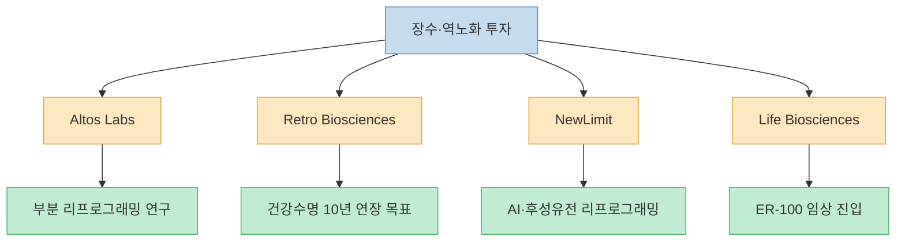
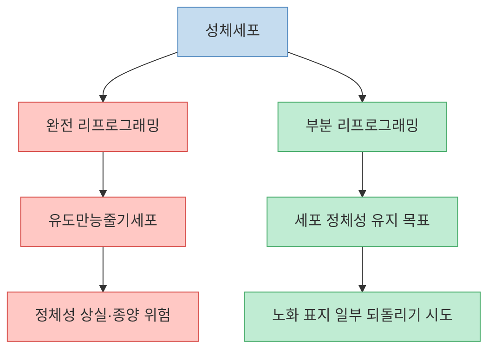
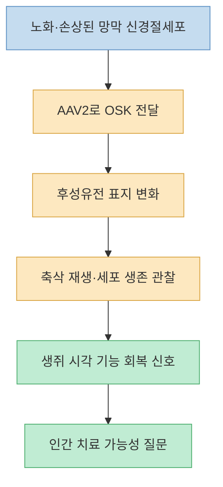
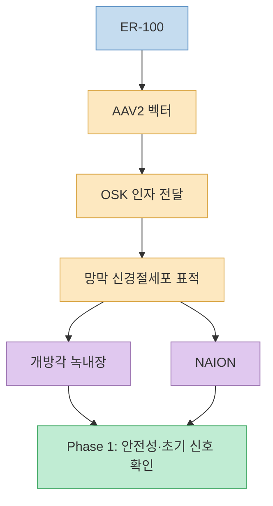
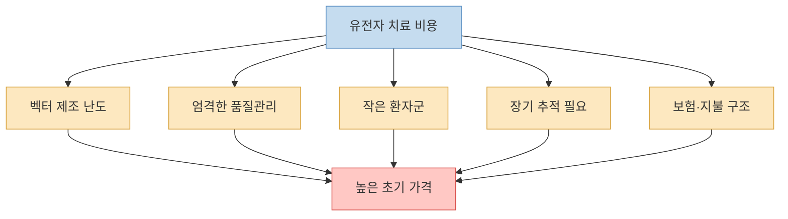
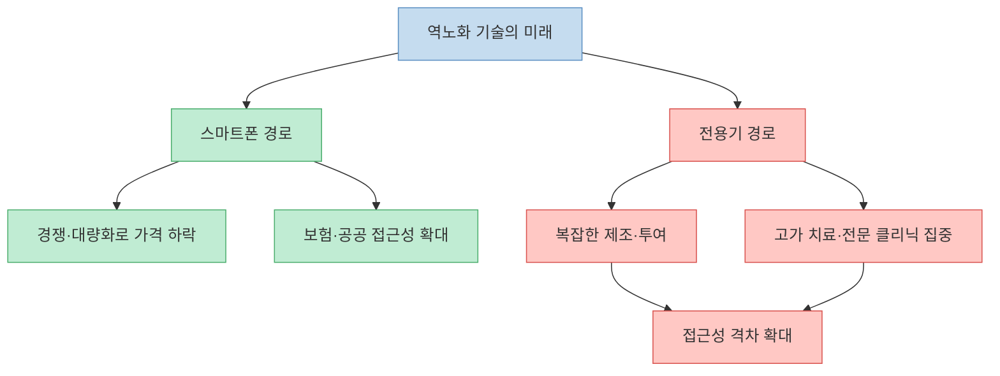
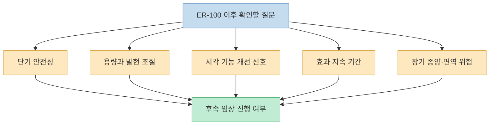

영상은 제프 베이조스, 샘 알트만, 브라이언 암스트롱 같은 실리콘밸리 거물들이 노화 연구에 큰돈을 넣는 이유를 다룬다. 핵심은 단순한 건강관리나 보충제가 아니라, 세포의 후성유전적 상태를 되돌리는 `부분 리프로그래밍` 기술이다. 특히 2026년 1월 Life Biosciences의 ER-100이 미국 FDA로부터 임상시험 진입을 위한 IND clearance를 받으면서, 이 분야는 더 이상 실험실 안의 상상만은 아니게 되었다. 다만 “사람이 이미 젊어졌다”가 아니라 “사람에게 처음 안전성과 가능성을 시험하는 단계에 들어갔다”가 정확한 표현이다.

<!--more-->

## Sources

- [YouTube: 유전자 치료 1회에 27억, 부자만 젊어지는 역노화 시대가 시작됐다](https://youtu.be/DxOJf7UZ15E?si=r3JErHWbgl63TEqh)
- [Life Biosciences: FDA Clearance of IND Application for ER-100](https://www.lifebiosciences.com/life-biosciences-announces-fda-clearance-of-ind-application-for-er-100-in-optic-neuropathies/)
- [Life Biosciences: Optic Neuropathies and ER-100](https://www.lifebiosciences.com/optic-neuropathies-er-100/)
- [Nature: Reprogramming to recover youthful epigenetic information and restore vision](https://www.nature.com/articles/s41586-020-2975-4)
- [Nature News: Reversal of biological clock restores vision in old mice](https://www.nature.com/articles/d41586-020-03403-0)
- [Scientific American: Billionaires Bankroll Cell Rejuvenation Tech](https://www.scientificamerican.com/article/billionaires-bankroll-cell-rejuvenation-tech-as-the-latest-gambit-to-slow-aging/)
- [TechCrunch: Retro Biosciences, backed by Sam Altman, is raising $1 billion](https://techcrunch.com/2025/01/24/retro-biosciences-backed-by-sam-altman-is-raising-1-billion-to-extend-human-lifespan/)
- [TechCrunch: NewLimit raises $130M](https://techcrunch.com/2025/05/06/newlimit-founded-by-coinbase-ceo-brian-armstrong-raises-130m-to-develop-age-reversing-therapies/)
- [Drugs.com: Luxturna cost](https://www.drugs.com/medical-answers/luxturna-cost-3387128/)
- [Axios: FDA approves Novartis' gene therapy Zolgensma](https://www.axios.com/2019/05/24/fda-approves-novartis-gene-therapy-zolgensma)

---

## 영상의 핵심 주장: 역노화는 부자들의 취미가 아니라 바이오텍 전쟁이 됐다

영상은 브라이언 존슨이 매년 막대한 돈을 자기 몸에 쓰고, 제프 베이조스와 샘 알트만 같은 인물이 노화 연구 기업에 투자하는 사례로 시작한다. 메시지는 분명하다. 세계 최고 부자들이 이제 우주나 AI만이 아니라 `노화` 자체를 투자 대상으로 보고 있다는 것이다. [영상 00:00](https://youtu.be/DxOJf7UZ15E?t=0)

실제로 Altos Labs는 2022년 약 30억 달러 규모의 초기 자금으로 출범했고, Shinya Yamanaka 같은 세포 리프로그래밍 분야의 핵심 과학자들이 합류했다. Sam Altman은 Retro Biosciences에 1억 8천만 달러를 투자한 것으로 알려졌고, Retro는 건강한 수명을 10년 늘리는 것을 목표로 내세웠다. Coinbase CEO Brian Armstrong이 공동창업한 NewLimit도 후성유전 리프로그래밍 기반 치료제를 개발하며 2025년에 1억 3천만 달러를 조달했다.

다만 부자들이 투자한다고 해서 기술이 곧 성공한다는 뜻은 아니다. 바이오텍은 실패 확률이 높은 산업이고, 동물실험에서 보인 결과가 인간에게 그대로 이어지지 않는 경우가 많다. 따라서 이 흐름은 “역노화가 확정됐다”가 아니라 “노화를 질병과 비슷한 방식으로 개입 가능한 생물학적 과정으로 보려는 자본과 과학의 결합이 본격화됐다”로 읽어야 한다.

---

## 기술의 핵심: 야마나카 인자와 부분 리프로그래밍

영상은 노화를 하드웨어 고장보다 운영체제 오류에 비유한다. DNA 자체가 완전히 망가졌다기보다, 어떤 유전자를 켜고 끌지 결정하는 후성유전 정보가 흐트러진다는 설명이다. [영상 04:32](https://youtu.be/DxOJf7UZ15E?t=272)

이 비유는 부분적으로 유용하다. 2006년 Shinya Yamanaka 연구팀은 Oct4, Sox2, Klf4, c-Myc 네 가지 전사인자를 이용해 성체세포를 유도만능줄기세포 상태로 되돌릴 수 있음을 보여주었다. 이 발견은 세포 운명이 생각보다 유연하다는 사실을 보여주었고, 2012년 노벨 생리의학상으로 이어졌다.

문제는 완전 리프로그래밍이다. 세포를 너무 많이 되돌리면 원래 정체성을 잃고, 통제되지 않은 증식이나 종양 위험이 생길 수 있다. 그래서 역노화 분야가 노리는 것은 세포를 배아줄기세포처럼 완전히 되감는 것이 아니라, 세포 정체성은 유지하면서 노화 관련 후성유전 표지를 일부 젊게 만드는 `부분 리프로그래밍`이다.

영상이 말한 OSK 접근은 여기서 나온다. c-Myc를 제외하고 Oct4, Sox2, Klf4 세 인자를 사용하는 방식이다. c-Myc는 리프로그래밍 효율을 높이지만 암 위험과 관련해 특히 조심스러운 인자이기 때문에, 일부 연구는 이를 제외한 조합을 검토한다. [영상 06:05](https://youtu.be/DxOJf7UZ15E?t=365)

---

## 2020년 Nature 논문: 쥐의 시신경과 시력 회복은 왜 중요했나

영상은 늙어서 앞이 잘 보이지 않던 쥐에게 유전자 세 개를 넣었더니 시신경 기능이 회복됐다고 설명한다. [영상 04:32](https://youtu.be/DxOJf7UZ15E?t=272)

근거가 되는 핵심 연구는 2020년 Nature에 실린 Lu 등 연구다. 이 연구는 AAV2 벡터를 이용해 OSK를 망막 신경절세포에 발현시키고, 시신경 손상 후 축삭 재생과 세포 생존, 노화된 생쥐의 시각 기능 회복을 관찰했다. 논문은 OSK 발현이 DNA methylation 패턴과 전사체를 더 젊은 상태에 가깝게 되돌리는 것과 관련될 수 있다고 보고했다.

이 연구가 중요한 이유는 “나이 든 조직도 일부 기능을 되찾을 수 있는가”라는 질문에 강한 신호를 줬기 때문이다. 하지만 이것은 여전히 동물실험이다. 생쥐의 눈에서 관찰된 결과가 사람의 전신 노화, 뇌, 심장, 근육, 면역계에 그대로 적용된다고 말할 수 없다. 특히 눈은 국소 주입과 관찰이 상대적으로 가능한 기관이므로, 전신 역노화와는 난도가 다르다.

---

## ER-100: 2026년에 사람 대상 시험으로 들어간 첫 번째 의미

영상은 2026년 1월 미국 FDA가 세포 회춘 인체 실험을 승인했다고 말한다. 더 정확히는 Life Biosciences가 ER-100에 대해 미국 FDA로부터 IND clearance를 받았고, 이를 바탕으로 optic neuropathies 대상 Phase 1 임상시험을 시작한다는 발표다. [영상 07:35](https://youtu.be/DxOJf7UZ15E?t=455)

ER-100은 AAV2 벡터를 이용해 OSK를 눈 안에 전달하는 방식으로, 개방각 녹내장과 비동맥성 전방허혈성 시신경병증 같은 시신경 질환을 대상으로 한다. Life Biosciences는 ER-100을 부분 후성유전 리프로그래밍 기반 세포 회춘 치료 후보로 설명한다.

여기서 가장 중요한 보정이 있다. IND clearance는 “이 치료제가 효과가 입증됐다”는 뜻이 아니다. 사람에게 시험해 볼 수 있도록 전임상 독성·제조·프로토콜 자료를 바탕으로 임상 진입을 허용했다는 의미다. Phase 1은 보통 안전성, 용량, 초기 생물학적 신호를 확인하는 단계다. 효과와 장기 안전성을 말하려면 더 큰 규모의 후속 임상이 필요하다.

따라서 2026년 5월 11일 현재, ER-100은 역노화가 사람에게 성공했다는 증거가 아니라 `사람 대상 검증이 시작된 최초급 사례`로 이해해야 한다. 이 차이를 놓치면 과학 뉴스가 투자 홍보나 공포 마케팅으로 바뀐다.

---

## 가격 문제: 왜 유전자 치료는 처음부터 비쌀 가능성이 큰가

영상은 현재 유전자 치료제 가격을 예로 들며, 역노화 치료가 처음부터 수억~수십억 원대가 될 수 있다고 말한다. Luxturna는 한 번 치료에 약 85만 달러, Zolgensma는 약 210만 달러로 알려져 있다. [영상 09:07](https://youtu.be/DxOJf7UZ15E?t=547)

이 우려는 현실적이다. 유전자 치료는 개발비, 제조 난도, 품질관리, 환자 수, 장기 추적, 보험 지불 구조 때문에 가격이 매우 높게 책정되는 경우가 많다. 특히 AAV 벡터 기반 치료제는 생산 공정과 안전성 검증이 복잡하다.

다만 ER-100 같은 치료가 실제로 얼마가 될지는 아직 알 수 없다. 현재 가격 비교는 기존 유전자 치료제의 사례를 통한 추정일 뿐이다. 또한 특정 질환 치료제로 시작할 경우 보험 적용 여부, 환자 수, 치료 지속성, 효과 크기, 대체 치료 존재 여부에 따라 가격과 접근성이 크게 달라진다.

---

## 역노화 불평등: 기술이 스마트폰처럼 퍼질까, 전용기처럼 남을까

영상의 가장 흥미로운 질문은 “이 기술이 결국 모두에게 열릴 것인가, 아니면 부자들만의 특권으로 남을 것인가”이다. [영상 13:41](https://youtu.be/DxOJf7UZ15E?t=821)

낙관론은 있다. 기술은 처음에는 비싸지만, 시장이 커지고 경쟁이 붙으면 가격이 내려간다. 스마트폰, 유전체 분석, GLP-1 비만치료제 시장처럼 수요와 경쟁이 접근성을 바꾸는 사례도 있다. 노화 관련 시장이 커지고 여러 기업이 경쟁하면, 일부 기술은 더 넓은 환자에게 도달할 수 있다.

하지만 비관론도 강하다. 유전자 치료는 소프트웨어나 스마트폰처럼 복제 비용이 거의 0에 가까운 제품이 아니다. 바이러스 벡터 제조, 환자 선별, 투여, 면역 반응, 장기 추적이 필요하다. 특히 건강한 사람의 “젊어짐”을 목적으로 한다면, 질병 치료보다 안전성 기준이 훨씬 더 엄격해져야 한다.

그래서 역노화 기술의 핵심 문제는 과학만이 아니다. 임상시험 설계, 보험 급여, 공공 연구 투자, 가격 규제, 장기 안전성 데이터 공개, 부작용 보상 체계가 함께 가야 한다. 기술이 성공하더라도 사회가 이를 어떻게 배분할지 준비하지 않으면, 건강수명 격차는 더 커질 수 있다.

---

## 우리가 지금 봐야 할 것은 `성공 여부`보다 `검증 방식`이다

영상은 “이미 가능하다”는 식으로 긴장감을 높이지만, 현재 단계에서 더 중요한 질문은 따로 있다. 첫째, ER-100은 사람에게 안전한가. 둘째, 실제로 시신경 기능이나 시각 기능 개선 신호가 있는가. 셋째, 효과가 있다면 얼마나 지속되는가. 넷째, OSK 발현을 얼마나 정밀하게 켜고 끌 수 있는가. 다섯째, 암이나 비정상 세포 변화 같은 장기 위험은 없는가. [영상 16:42](https://youtu.be/DxOJf7UZ15E?t=1002)

첫 인간 데이터가 나오면 언론은 아마 “역노화 성공” 또는 “위험한 실패”처럼 극단적으로 보도할 가능성이 높다. 하지만 초기 임상 데이터는 대개 애매하다. 작은 환자 수, 제한된 추적 기간, 질환 특이성 때문에 결과를 넓게 일반화하기 어렵다. 따라서 우리는 headline보다 임상시험 디자인, 환자 수, 평가 지표, 부작용, 추적 기간을 봐야 한다.

---

## 핵심 요약

- 영상은 베이조스, 알트만, 암스트롱 등 거물 투자자들이 노화 연구와 세포 리프로그래밍에 큰돈을 넣는 흐름을 다룬다. [영상 01:31](https://youtu.be/DxOJf7UZ15E?t=91)
- 야마나카 인자는 성체세포를 더 원시적인 상태로 되돌릴 수 있음을 보여준 발견이며, 역노화 분야는 이를 완전 리프로그래밍이 아닌 `부분 리프로그래밍`으로 활용하려 한다. [영상 06:05](https://youtu.be/DxOJf7UZ15E?t=365)
- 2020년 Nature 논문은 OSK를 이용해 생쥐 망막 신경절세포의 노화 관련 표지를 되돌리고 시각 기능 회복 신호를 보여주었다. [영상 07:35](https://youtu.be/DxOJf7UZ15E?t=455)
- 2026년 1월 Life Biosciences의 ER-100은 FDA IND clearance를 받아 사람 대상 Phase 1 임상시험 단계로 들어갔다. 이는 효과 입증이 아니라 임상 검증 시작을 뜻한다.
- 유전자 치료제는 Luxturna, Zolgensma 사례처럼 매우 비싸게 출발할 수 있어, 역노화 기술이 건강 불평등을 키울 가능성이 있다. [영상 09:07](https://youtu.be/DxOJf7UZ15E?t=547)
- 앞으로 봐야 할 핵심은 “역노화가 된다/안 된다”라는 구호가 아니라, 안전성·지속성·가격·접근성·장기 위험을 검증하는 방식이다.

## 결론

역노화 기술은 더 이상 순수한 공상과학만은 아니다. 세포 리프로그래밍, 후성유전 시계, AAV 기반 유전자 치료, ER-100의 임상 진입은 분명 중요한 전환점이다. 하지만 2026년 5월 11일 현재, 이것은 아직 “인간이 젊어지는 치료가 완성됐다”가 아니라 “인간에게 처음 검증이 시작됐다”에 가깝다.

그래서 이 영상을 볼 때 가장 중요한 태도는 흥분과 회의 사이의 균형이다. 기술은 흥미롭고 잠재력은 크다. 동시에 비용, 안전성, 접근성 문제는 매우 현실적이다. 앞으로의 질문은 단순히 **"사람을 젊게 만들 수 있는가"** 가 아니라, **"그 젊어짐을 누가, 어떤 가격에, 얼마나 안전하게 얻을 수 있는가"** 이다.

