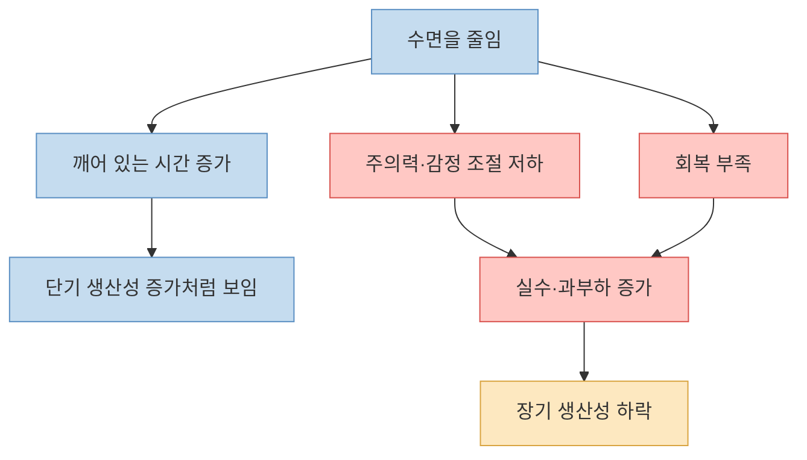
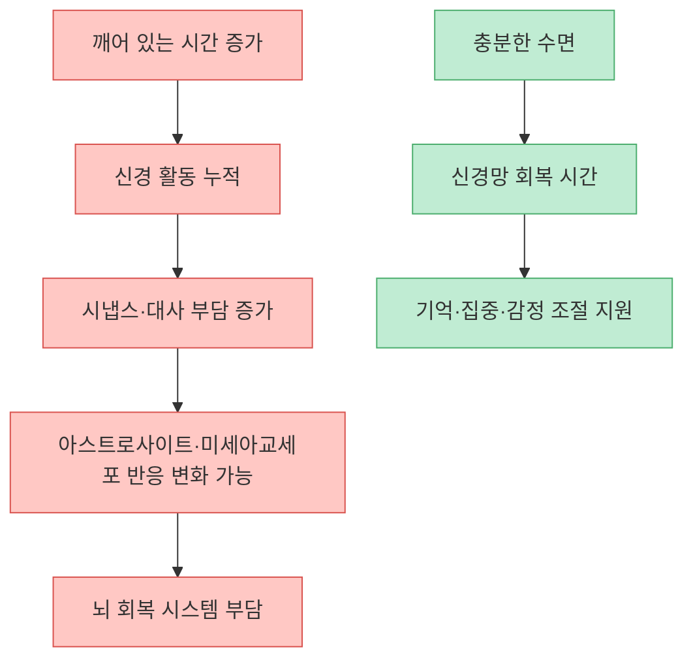
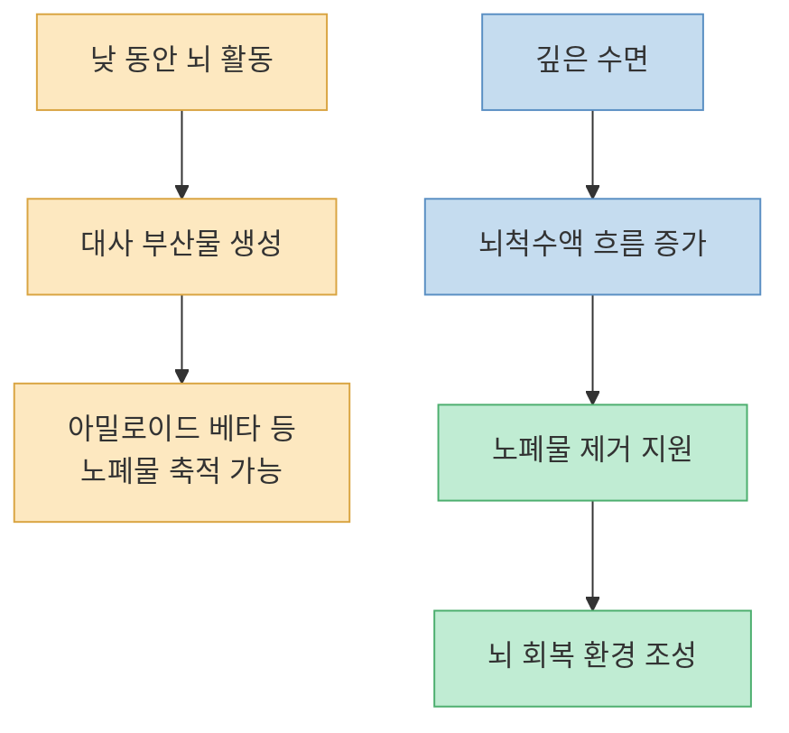
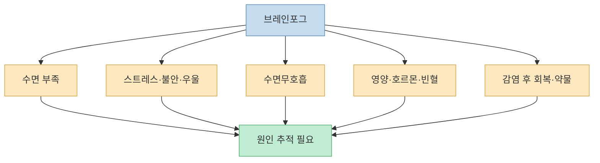
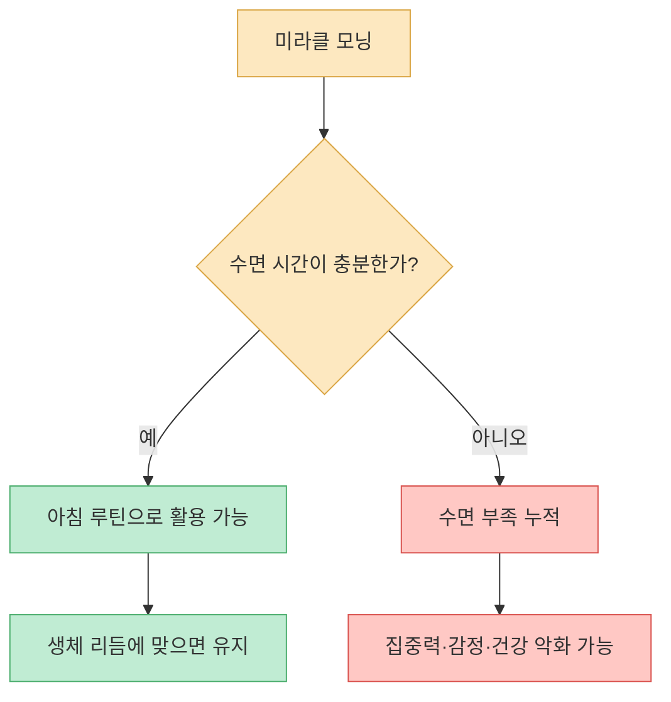
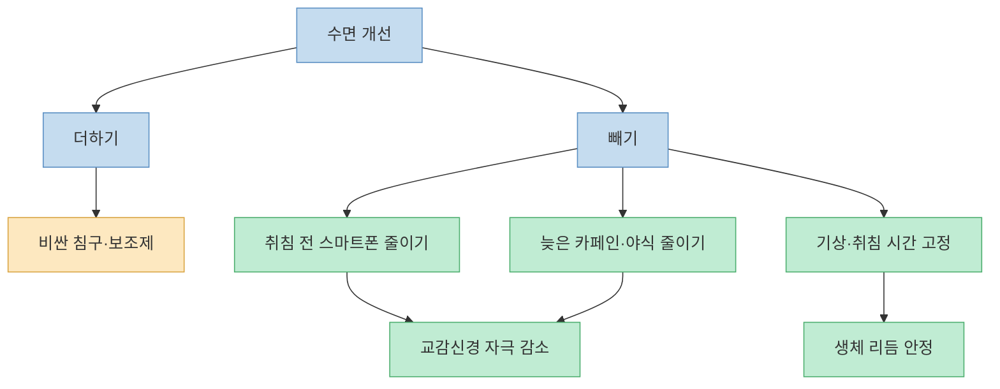
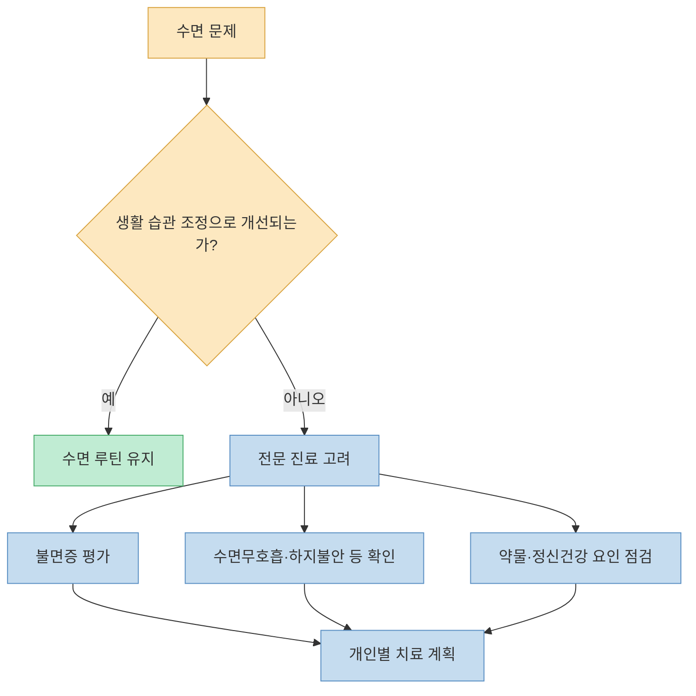

영상은 한국 사회의 수면 부족 문화를 강하게 비판한다. “잠은 죽어서 자는 것”처럼 말하는 문화가 실제로는 뇌와 몸을 갉아먹는 습관일 수 있다는 메시지다. 특히 글림프 시스템, 브레인포그, 수면 부족으로 인한 뇌 신경망 손상 가능성을 강조한다. 방향은 매우 중요하다. 다만 “뇌가 썩는다”거나 “수면 부족이 곧바로 알츠하이머의 씨앗이 된다”는 식의 표현은 경고로는 효과적이지만, 과학적으로는 조금 더 차분하게 해석해야 한다.

<!--more-->

## Sources

- [YouTube: "한국인처럼 자면 큰일납니다" '이것' 모르면 뇌가 썩어가기 시작하는 진짜 이유](https://youtu.be/DeL7Wi9HxHM?si=PpmkLZbDh-SAR7ll)
- [CDC: About Sleep](https://www.cdc.gov/sleep/about/index.html)
- [CDC: About Sleep and Your Heart Health](https://www.cdc.gov/heart-disease/about/sleep-and-heart-health.html)
- [Mayo Clinic: Sleep tips: 6 steps to better sleep](https://www.mayoclinic.org/health/sleep/HQ01387)
- [Sleep Loss Promotes Astrocytic Phagocytosis and Microglial Activation in Mouse Cerebral Cortex](https://pmc.ncbi.nlm.nih.gov/articles/PMC5456108/)
- [Science: Sleep drives metabolite clearance from the adult brain](https://www.science.org/doi/10.1126/science.1241224)
- [Nature Reviews Neurology: Neuronal activity drives glymphatic waste clearance](https://www.nature.com/articles/s41582-024-00963-x)
- [BMC Cancer: Sleep duration and the risk of cancer](https://link.springer.com/article/10.1186/s12885-018-5025-y)

---

## 영상의 문제의식: 한국 사회는 잠을 너무 쉽게 깎아낸다

영상은 “너 지금 그 상황에 잠이 오냐”라는 말을 한국식 수면 문화의 상징처럼 제시한다. 공부, 프로젝트, 취업, 야근 앞에서 피곤하다는 신호를 게으름으로 몰아가고, 잠을 줄이는 사람을 성실한 사람처럼 보는 분위기가 있다는 것이다. [영상 01:30](https://youtu.be/DeL7Wi9HxHM?t=90)

이 지적은 현실적이다. 수면은 여가가 아니라 생리적 회복 과정이다. CDC는 성인에게 대체로 하루 7시간 이상의 수면이 필요하다고 안내하고, 수면 부족이 심혈관 건강, 대사 건강, 정신 건강과 연결될 수 있다고 설명한다. 잠을 줄여 얻은 시간이 생산성을 늘리는 것처럼 보여도, 집중력·판단력·감정 조절이 무너지면 결국 손실로 돌아올 수 있다.

다만 영상에서 말하는 한국 성인의 평균 수면 시간이나 OECD 최하위 같은 표현은 조사 방식과 기준에 따라 숫자가 달라질 수 있다. 중요한 것은 특정 순위보다, 많은 사람이 만성적으로 충분한 수면 기회를 확보하지 못하고 있다는 구조적 문제다. [영상 03:02](https://youtu.be/DeL7Wi9HxHM?t=182)

---

## 수면 부족은 뇌의 `청소부 세포`를 흔들 수 있다

영상은 2017년 연구를 언급하며, 잠을 충분히 자지 못한 쥐의 뇌에서 아스트로사이트가 시냅스를 더 많이 포식하는 현상이 관찰됐다고 설명한다. 비유하자면 먼지만 치워야 할 로봇 청소기가 중요한 물건까지 빨아들이는 상황이라는 것이다. [영상 04:34](https://youtu.be/DeL7Wi9HxHM?t=274)

실제 연구는 수면 손실이 생쥐 대뇌피질에서 별아교세포의 포식 활동과 미세아교세포 활성화와 관련될 수 있음을 보여주었다. 이는 수면이 단순 휴식이 아니라 시냅스 유지, 대사 정리, 면역 반응과 연결된다는 중요한 단서다.

하지만 이 연구를 “잠을 못 자면 인간의 뇌가 바로 스스로를 먹어 치운다”고 읽으면 안 된다. 연구는 동물 모델에서 특정 조건의 수면 제한을 관찰한 것이고, 인간의 일상적 수면 부족과 질병 발생을 그대로 등식으로 연결할 수는 없다. 더 정확한 결론은 “수면 부족은 뇌의 유지보수 시스템을 교란할 수 있으며, 반복되면 인지 기능과 뇌 건강에 부담이 될 가능성이 있다”이다.

---

## 글림프 시스템: 깊은 잠은 뇌의 야간 청소 시간이다

영상의 핵심 과학 개념은 `글림프 시스템`이다. 글리아 세포와 림프 시스템을 합친 개념으로, 뇌척수액이 뇌 조직 사이를 흐르며 대사 노폐물을 제거하는 경로를 뜻한다. 영상은 이를 “뇌 전용 심야 쓰레기 수거 네트워크”라고 설명한다. [영상 07:35](https://youtu.be/DeL7Wi9HxHM?t=455)

2013년 Science 논문은 수면 중 뇌의 간질 공간이 넓어지고, 뇌척수액과 간질액 교환이 증가하며, 아밀로이드 베타 같은 대사 산물 제거가 촉진될 수 있음을 동물 연구에서 보여주었다. 이후 글림프 시스템은 알츠하이머병, 파킨슨병, 뇌혈관질환 같은 신경계 질환과의 관련성 측면에서 활발히 연구되고 있다.

다만 글림프 시스템 연구도 아직 발전 중이다. 특히 인간에서 수면 단계, 뇌척수액 흐름, 노폐물 제거, 치매 위험이 어떤 인과 경로로 연결되는지는 계속 연구 중이다. 따라서 “잠을 적게 자면 뇌가 썩는다”보다 “깊은 잠은 뇌의 대사 정리와 회복에 중요한 조건이며, 만성 수면 부족은 뇌 건강에 불리한 환경을 만들 수 있다”가 더 정확하다.

---

## 브레인포그: MRI가 정상이어도 뇌가 지쳐 있을 수 있다

영상은 낮에 머릿속에 매연이 찬 것처럼 멍하고, 방금 하려던 일을 잊고, 집중이 되지 않는 상태를 `브레인포그`로 설명한다. 병원 검사에서 뚜렷한 이상이 나오지 않아도 일상 기능은 떨어질 수 있다는 것이다. [영상 06:05](https://youtu.be/DeL7Wi9HxHM?t=365)

브레인포그는 단일 질병명이라기보다 증상 묶음에 가깝다. 수면 부족, 스트레스, 우울·불안, 갑상샘 문제, 빈혈, 감염 후 회복기, 약물, 수면무호흡, 과로 등 다양한 원인이 관여할 수 있다. 따라서 “브레인포그 = 글림프 시스템 고장”이라고 단정하면 안 된다.

그래도 수면은 가장 먼저 확인할 만한 변수다. 잠이 부족하면 주의 전환, 작업 기억, 감정 조절, 의사결정이 흔들린다. “머리가 나빠졌다”기보다 뇌가 회복 시간을 충분히 얻지 못해 일시적으로 성능이 낮아진 상태일 수 있다.

---

## 미라클 모닝은 모든 사람에게 기적이 아니다

영상은 새벽 4~5시에 일어나는 미라클 모닝 열풍을 비판한다. 아침 시간을 활용하는 것은 좋지만, 수면 시간을 줄여 억지로 새벽 기상을 하면 자기 생체 리듬과 충돌할 수 있다는 것이다. [영상 09:07](https://youtu.be/DeL7Wi9HxHM?t=547)

이 지적은 중요하다. 사람마다 필요한 수면 시간과 선호하는 수면 타이밍은 다르다. 아침형, 저녁형, 중간형의 차이가 있고, 생활 리듬과 직업에 따라 적절한 수면 시간이 달라진다. CDC와 Mayo Clinic도 핵심은 특정 기상 시간이 아니라 규칙적인 수면 일정, 충분한 수면 시간, 수면 방해 요인의 제거라고 본다.

따라서 미라클 모닝의 진짜 조건은 `새벽 기상`이 아니라 `일찍 잘 수 있는 구조`다. 밤 12시나 1시에 자면서 새벽 5시에 일어나는 것은 자기계발이 아니라 수면 부채를 만드는 일에 가깝다. 반대로 밤 9~10시에 자연스럽게 잘 수 있고 아침 컨디션이 좋다면 새벽 루틴은 충분히 도움이 될 수 있다.

---

## 수면을 고치려면 더하기보다 `방해 요인 빼기`가 먼저다

영상은 비싼 매트리스나 기능성 베개보다, 수면을 방해하는 행동을 줄이는 것이 더 중요하다고 말한다. 특히 잠들기 직전 스마트폰, 야식, 스트레스 자극, 늦은 시간의 쇼핑·콘텐츠 소비가 교감신경을 깨울 수 있다고 설명한다. [영상 10:37](https://youtu.be/DeL7Wi9HxHM?t=637)

Mayo Clinic의 수면 팁도 비슷하다. 매일 비슷한 시간에 자고 일어나기, 낮잠을 길게 자지 않기, 잠자리 환경을 정리하기, 자기 전 큰 식사·카페인·알코올을 피하기, 화면 사용을 줄이기 같은 기본 행동이 먼저다. CDC 역시 전자기기를 잠자기 전 최소 30분 전에 끄는 것을 권한다.

영상이 제안한 수면 다이어리는 특히 실용적이다. 잠든 시각, 깬 시각, 카페인, 운동, 야식, 스마트폰 사용, 낮잠, 스트레스 사건, 다음날 컨디션을 1~2주만 기록해도 패턴이 보인다. “나는 원래 잠을 못 자”가 아니라 “나는 늦은 카페인과 침대 스마트폰에 취약하다”처럼 문제를 구체화할 수 있다. [영상 12:07](https://youtu.be/DeL7Wi9HxHM?t=727)

---

## 병원에 가야 하는 수면 문제도 있다

영상은 생활 습관을 바꿔도 잠이 오지 않으면 신경과나 정신건강의학과 등 전문 진료의 도움을 받으라고 말한다. [영상 12:07](https://youtu.be/DeL7Wi9HxHM?t=727)

이 부분은 매우 중요하다. 불면이 몇 주 이상 이어지고 낮 기능을 무너뜨린다면 단순한 의지 문제가 아니다. 특히 코골이와 숨 멎음, 아침 두통, 낮 졸림, 하지불안, 악몽, 공황, 우울감, 약물 부작용이 함께 있으면 원인을 확인해야 한다.

수면제나 수면유도제는 무조건 피해야 할 악도 아니고, 무조건 해결책도 아니다. 필요한 경우에는 짧은 기간 도움을 받을 수 있지만, 종류와 복용 기간, 의존 가능성, 다른 약과의 상호작용을 의료진과 상의해야 한다. 혼자서 술이나 임의 약물로 잠을 해결하려는 방식은 오히려 수면의 질을 떨어뜨리고 위험을 키울 수 있다.

---

## 핵심 요약

- 영상의 핵심 메시지는 한국 사회가 수면 부족을 성실함으로 포장하지만, 실제로 수면은 뇌와 몸의 회복에 필수라는 것이다. [영상 01:30](https://youtu.be/DeL7Wi9HxHM?t=90)
- 수면 손실은 동물 연구에서 별아교세포의 포식 활동과 미세아교세포 활성화와 관련되었지만, 이를 인간에게 “뇌가 바로 썩는다”로 단정하면 과장이다. [영상 04:34](https://youtu.be/DeL7Wi9HxHM?t=274)
- 글림프 시스템은 수면 중 뇌 대사 노폐물 제거와 관련된 중요한 연구 주제이며, 깊은 잠은 뇌 건강에 유리한 회복 환경을 만든다. [영상 07:35](https://youtu.be/DeL7Wi9HxHM?t=455)
- 브레인포그는 수면 부족뿐 아니라 스트레스, 우울·불안, 수면무호흡, 영양·호르몬 문제 등 다양한 원인을 확인해야 하는 증상이다. [영상 06:05](https://youtu.be/DeL7Wi9HxHM?t=365)
- 미라클 모닝은 수면 시간을 충분히 확보할 때만 도움이 된다. 수면을 줄여 만드는 새벽 루틴은 오히려 건강을 해칠 수 있다. [영상 09:07](https://youtu.be/DeL7Wi9HxHM?t=547)
- 수면 개선은 비싼 침구를 더하는 것보다, 스마트폰·카페인·야식·불규칙한 기상 시간을 줄이는 것에서 시작하는 편이 현실적이다. [영상 10:37](https://youtu.be/DeL7Wi9HxHM?t=637)

## 결론

이 영상에서 가장 중요한 문장은 “한국인처럼 자면 큰일난다”가 아니라 “수면을 희생해 얻는 성실함은 오래가지 않는다”에 가깝다. 잠은 남는 시간에 하는 사치가 아니라, 뇌가 기억을 정리하고 감정을 안정시키고 몸의 회복 시스템을 돌리는 기본 조건이다.

오늘 당장 바꿀 수 있는 것은 거창하지 않다. 잠들기 전 스마트폰을 멀리 두고, 카페인과 야식을 기록하고, 일주일만 수면 다이어리를 써 보는 것이다. 그래도 잠이 무너진다면 참는 것이 답이 아니라 전문적인 도움을 받는 것이 답이다. 좋은 수면은 게으름이 아니라, **내일의 뇌를 지키는 가장 기본적인 투자** 다.

