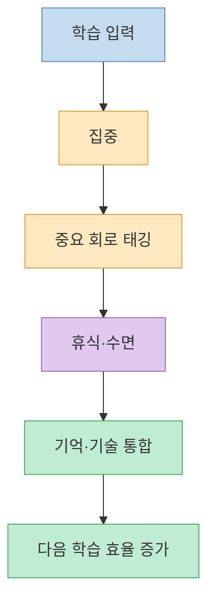
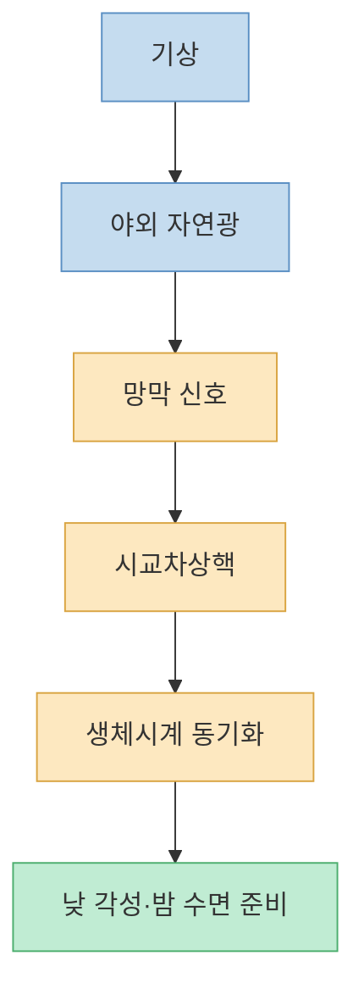
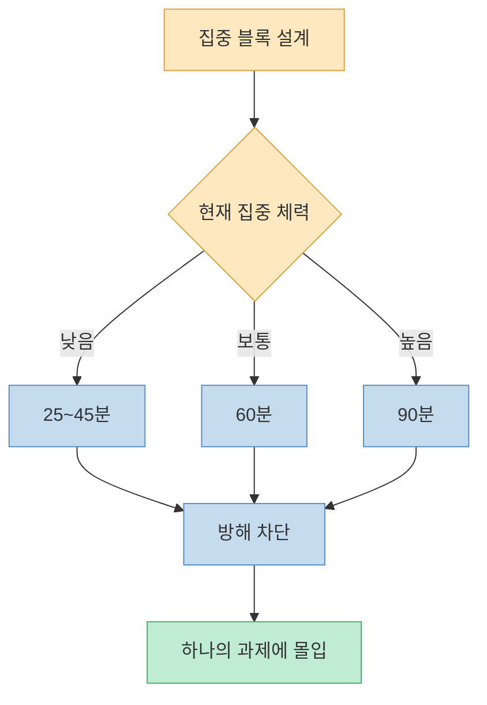
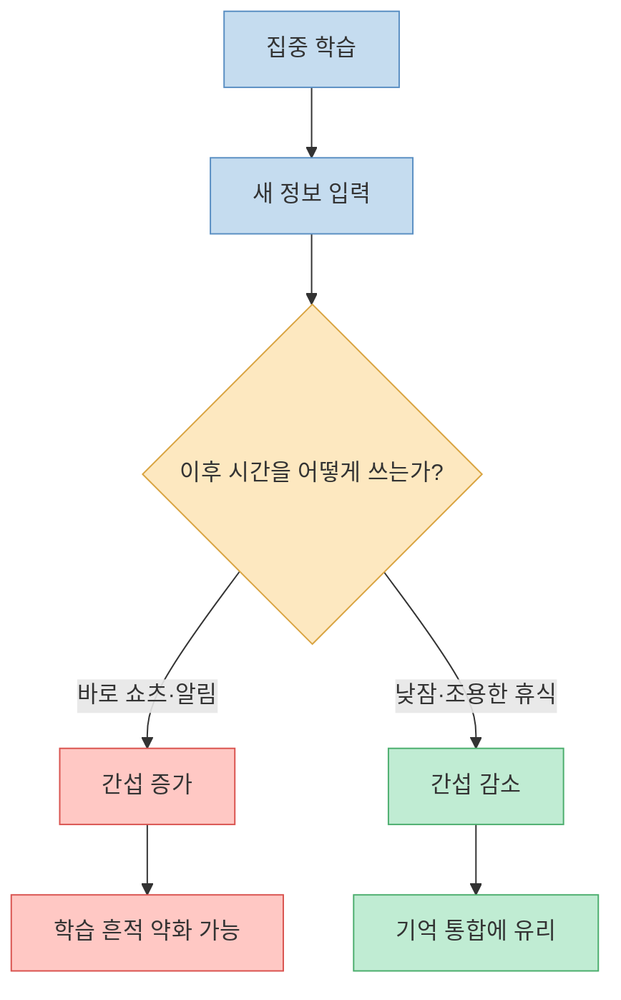
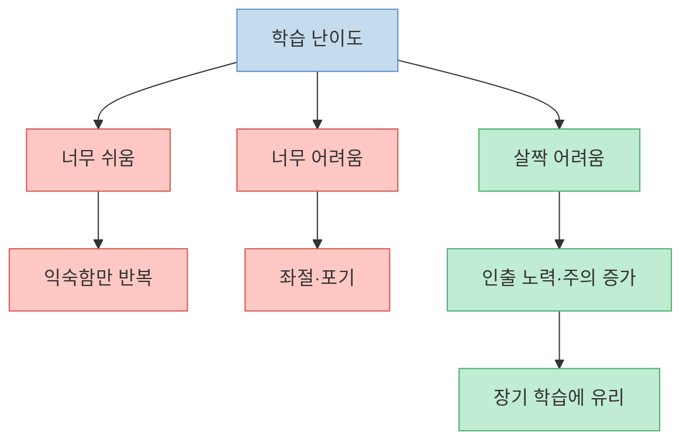
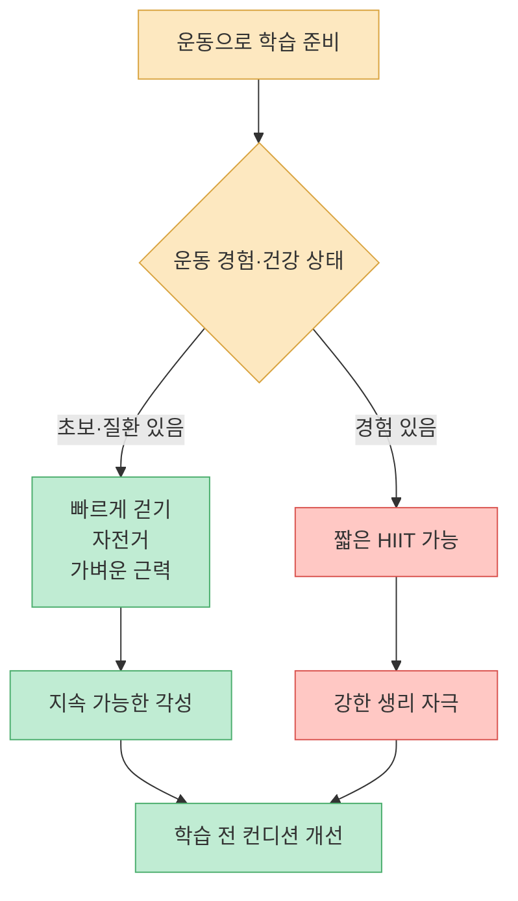
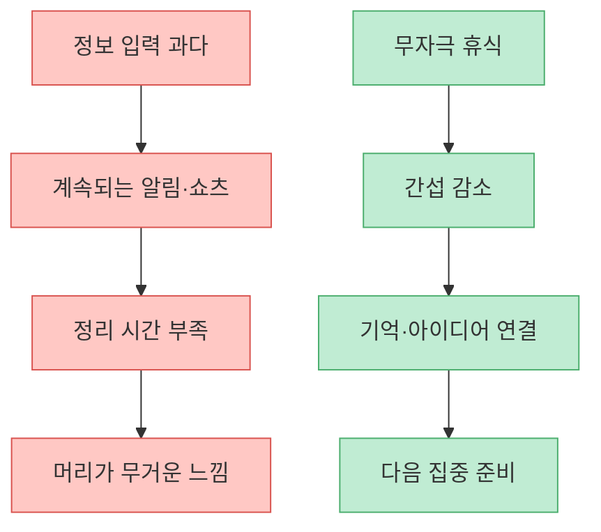
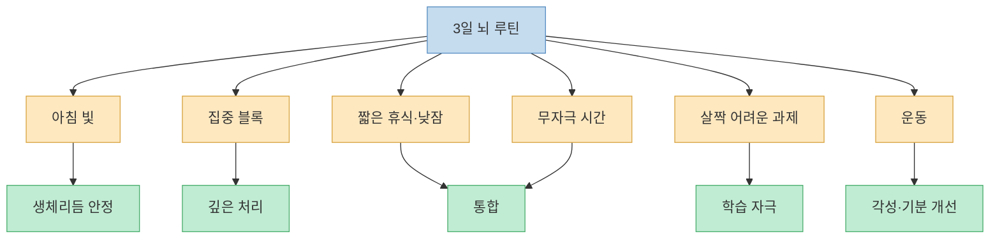

영상은 “3일 만에 뇌의 처리 속도를 30배까지 끌어올릴 수 있다”고 말한다. 방법은 아침 햇빛, 90분 집중 세션, 낮잠, 적당히 어려운 과제, 고강도 인터벌 운동, 아무것도 하지 않는 무자극 시간, 카페인 지연이다. 구성 자체는 꽤 쓸 만하다. 다만 `모든 뇌 능력이 30배 빨라진다`는 식으로 받아들이면 과장이다. 실제로 근거가 있는 것은 “집중과 휴식, 수면과 운동, 적절한 난이도, 방해 자극 제거가 학습과 수행을 개선할 수 있다”는 훨씬 차분한 결론이다.

<!--more-->

## Sources

- [YouTube: 세계최고 뇌과학자가 밝히는 3일만에 30배 빨라지는 뇌 만들기](https://youtu.be/K7NIlLF2XfA?si=6HI9KZ5COpwllpp8)
- [NHLBI: How Sleep Works - Your Sleep/Wake Cycle](https://www.nhlbi.nih.gov/health/sleep/sleep-wake-cycle)
- [NIOSH/CDC: Effects of Light on Circadian Rhythms](https://www.cdc.gov/niosh/work-hour-training-for-nurses/longhours/mod2/19.html)
- [Nature Neuroscience: Daytime sleep condenses the time course of motor memory consolidation](https://www.nature.com/articles/nn1959)
- [PubMed: Effects of wakeful rest on memory consolidation - systematic review and meta-analysis](https://pubmed.ncbi.nlm.nih.gov/40087245/)
- [PLOS ONE: Boosting Long-Term Memory via Wakeful Rest](https://journals.plos.org/plosone/article?id=10.1371/journal.pone.0109542)
- [PMC: Retrieval Practice and Spacing Effects as Desirable Difficulties](https://pmc.ncbi.nlm.nih.gov/articles/PMC4480221/)
- [Brains: Effect of HIIT on Brain-Derived Neurotrophic Factor Levels](https://www.mdpi.com/2076-3425/15/1/34)

---

## 영상의 핵심: 뇌는 혹사가 아니라 `집중-휴식`의 리듬으로 바뀐다

영상은 신경가소성을 설명하면서, 뇌가 아무 때나 바뀌는 것이 아니라 특정 조건이 맞을 때 리모델링 모드에 들어간다고 말한다. 특히 고도의 집중과 깊은 휴식이 번갈아 필요하다고 강조한다. [영상 00:00](https://youtu.be/K7NIlLF2XfA?t=0)

이 방향은 설득력 있다. 학습은 단순히 오래 앉아 있는 시간이 아니라, 집중해서 정보를 처리하는 시간과 그 정보를 안정화하는 회복 시간이 함께 있어야 한다. 수면과 휴식은 학습 후 기억 강화와 기술 학습에 중요한 역할을 한다. Nature Neuroscience의 운동기술 학습 연구도 낮잠이 학습 후 기억 통합 과정을 빠르게 압축할 수 있음을 보여주었다.

하지만 “3일 만에 뇌 처리 속도 30배”라는 표현은 조심해야 한다. 영상도 중간에 특정 과제에서 나온 숫자라고 보정하지만, 제목만 보면 전체 지능이나 모든 업무 속도가 30배 빨라지는 것처럼 들린다. 특정 운동학습 과제나 실험 조건에서 관찰된 큰 차이를 일반적인 공부·업무 능력 전체로 확장하면 과장이다. [영상 04:34](https://youtu.be/K7NIlLF2XfA?t=274)

---

## 1일차: 아침 햇빛은 뇌를 깨우는 가장 단순한 신호다

영상의 첫 번째 실천은 아침에 일어나자마자 야외 자연광을 10분 이상 보는 것이다. 자연광이 망막을 통해 시교차상핵, 즉 생체시계에 신호를 보내고 하루의 각성 리듬을 맞춘다는 설명이다. [영상 03:04](https://youtu.be/K7NIlLF2XfA?t=184)

이 조언은 근거가 좋다. 인간의 수면-각성 리듬은 빛의 영향을 크게 받는다. NHLBI는 생체시계가 빛과 어둠의 주기에 맞춰 멜라토닌 분비와 수면-각성 리듬을 조절한다고 설명한다. NIOSH/CDC도 아침 빛은 생체리듬을 앞당기는 데, 저녁 빛은 늦추는 데 영향을 줄 수 있다고 설명한다.

다만 “스마트폰 불빛은 절대 안 된다”는 표현은 방향은 맞지만 조금 단순하다. 실내 조명과 화면도 생체리듬에 영향을 줄 수 있지만, 일반적으로 야외 자연광은 훨씬 강한 시간 신호다. 그래서 핵심은 “아침에 화면을 보는 대신 밖으로 나가라”가 아니라, “아침에 충분한 밝은 빛을 받고 밤에는 밝은 빛과 화면 자극을 줄여라”에 가깝다.

---

## 1일차: 90분 집중 세션은 유용하지만, 숫자에 집착할 필요는 없다

영상은 첫날에 90분짜리 집중 세션을 하라고 한다. 핸드폰을 멀리 두고 하나의 과제에만 몰입하는 방식이다. [영상 03:04](https://youtu.be/K7NIlLF2XfA?t=184)

이 조언의 핵심은 `90분`보다 `단일 과제 집중`이다. 알림, 메신저, 쇼츠, 멀티태스킹이 계속 끼어들면 뇌는 한 과제의 깊은 구조를 붙잡기 어렵다. 따라서 45분이든 60분이든 90분이든, 방해 자극을 차단한 집중 블록을 만드는 것은 생산성에 도움이 된다.

다만 90분 울트라디안 리듬을 모든 사람에게 적용되는 정밀한 생체 공식처럼 말하면 근거가 약해진다. 90~120분 단위의 생리 리듬과 수면 주기는 연구되어 왔지만, 깨어 있는 동안 모든 사람이 정확히 90분 집중 블록으로 일해야 한다고 단정할 수는 없다. 초보자는 25~45분부터 시작해도 된다.

---

## 낮잠과 휴식: 배운 것을 굳히는 시간

영상은 집중 세션 후 1~2시간 뒤 20~30분 낮잠을 제안한다. 집중 상태에서 태그된 시냅스가 실제로 강화되는 과정이 수면 중에 일어난다는 설명이다. [영상 04:34](https://youtu.be/K7NIlLF2XfA?t=274)

낮잠과 휴식이 학습에 도움을 줄 수 있다는 근거는 있다. 낮잠은 운동기술 학습의 시간 경과를 압축해 성과 향상에 기여할 수 있고, 깨어 있는 조용한 휴식도 새로 배운 정보를 간섭으로부터 보호해 기억 통합을 돕는다는 연구들이 있다.

다만 낮잠은 길어지면 밤잠을 방해할 수 있다. 20~30분 정도의 짧은 낮잠이나 눈 감고 쉬는 비수면 깊은 휴식이 현실적인 선택이다. 불면이 있거나 낮잠 후 멍해지는 사람은 낮잠 대신 산책, 눈 감고 호흡, 조용한 휴식을 시도하는 편이 낫다.

---

## 2일차: `바람직한 어려움`은 진짜 학습을 만든다

영상은 둘째 날의 핵심으로 `의도적 어려움`을 제시한다. 너무 쉬운 과제는 뇌가 바뀔 이유가 없고, 너무 어려운 과제는 좌절만 만든다. 현재 수준보다 한 단계 어려운 과제를 골라야 한다는 설명이다. [영상 06:06](https://youtu.be/K7NIlLF2XfA?t=366)

이 개념은 학습과학의 `desirable difficulties`와 연결된다. 간격을 두고 복습하기, 스스로 인출하기, 문제 유형을 섞기, 약간 어려운 조건에서 연습하기는 당장은 힘들지만 장기 기억과 전이에 도움이 될 수 있다.

영상은 영어 원서를 예로 들며 모르는 단어가 30% 정도 섞인 자료를 말한다. 숫자 자체는 상황에 따라 다르지만 방향은 맞다. 너무 쉬운 자료는 성장 폭이 작고, 너무 어려운 자료는 이해가 무너진다. 핵심은 “대부분 이해되지만 중간중간 멈춰 생각해야 하는 수준”이다.

---

## 운동: HIIT는 뇌에 자극이 될 수 있지만 모두에게 맞지는 않는다

영상은 둘째 날에 고강도 인터벌 운동을 넣으라고 한다. 예를 들어 30초 전력질주와 90초 걷기를 8~10회 반복하는 방식이다. 운동 후 BDNF가 증가해 학습 효율이 좋아질 수 있다는 설명도 나온다. [영상 06:39](https://youtu.be/K7NIlLF2XfA?t=399)

운동이 뇌 건강과 학습에 좋은 영향을 줄 수 있다는 근거는 많다. HIIT가 BDNF 수준에 영향을 줄 가능성을 보여주는 체계적 문헌고찰도 있다. BDNF는 신경가소성과 관련된 중요한 단백질로 자주 언급된다.

하지만 HIIT는 부담이 큰 운동이다. 운동 경험이 적거나 심혈관 질환, 관절 통증, 고혈압, 어지럼증이 있는 사람에게는 위험할 수 있다. 뇌를 빠르게 만들겠다고 갑자기 전력질주를 시작하는 것은 좋은 전략이 아니다. 빠르게 걷기, 계단 오르기, 실내 자전거처럼 안전한 강도부터 시작해도 충분하다.

---

## 3일차: 아무것도 안 하는 시간은 낭비가 아니다

영상은 셋째 날의 핵심으로 최소 1시간의 무자극 시간을 제안한다. 스마트폰, TV, 음악 없이 멍하니 있거나 산책하면서 뇌가 정보를 정리하게 두라는 것이다. [영상 07:37](https://youtu.be/K7NIlLF2XfA?t=457)

이 조언도 방향이 좋다. 깨어 있는 조용한 휴식은 기억 통합을 돕는다는 연구들이 있고, 기본모드 네트워크는 자기참조, 기억, 미래 시뮬레이션, 의미 연결과 관련된다. 우리가 아무것도 안 하는 것처럼 보일 때도 뇌는 이전 경험을 정리하고 연결할 수 있다.

다만 1시간이 부담스럽다면 10분부터 시작해도 된다. 현대인의 문제는 무자극 시간이 아예 0분이라는 데 있다. 버스 대기, 화장실, 식사, 잠들기 전까지 모두 화면으로 채우면 뇌가 정리할 틈이 줄어든다.

---

## 카페인 90분 지연: 해볼 수는 있지만 필수 법칙은 아니다

영상은 아침에 일어나자마자 커피를 마시는 것이 최악이며, 첫 커피를 기상 후 90~120분 뒤로 미루라고 말한다. [영상 10:39](https://youtu.be/K7NIlLF2XfA?t=639)

이 조언은 Andrew Huberman을 통해 널리 퍼졌지만, 강한 임상 근거가 있는 절대 법칙이라기보다는 실험해 볼 만한 생활 팁에 가깝다. 기상 직후에는 코르티솔 각성 반응이 나타나고, 카페인은 아데노신 수용체를 차단해 졸림을 줄인다. 하지만 “90분 지연이 누구에게나 오후 크래시를 막는다”고 단정할 근거는 제한적이다.

실용적으로는 이렇게 보면 된다. 아침 커피를 바로 마셔도 하루 컨디션과 수면이 좋다면 굳이 바꿀 필요가 없다. 반대로 오전 커피 후 오후에 심한 피로가 오거나, 커피를 늦게 마셔 밤잠이 망가진다면 시간 조정을 실험해 볼 만하다. 특히 오후 늦은 카페인은 수면을 해칠 수 있으므로 더 조심해야 한다.

---

## 3일 루틴을 현실적으로 다시 쓰면

영상의 프로토콜은 그대로 따라 하기보다 자기 생활에 맞게 줄여서 시작하는 편이 좋다. 핵심은 과학 용어를 많이 아는 것이 아니라, 뇌에 방해되는 자극을 줄이고 집중과 회복의 리듬을 만드는 것이다.

첫째 날은 아침 햇빛 10분, 45~90분 집중 블록 1개, 짧은 휴식으로 충분하다. 둘째 날은 현재 수준보다 약간 어려운 학습 과제를 고르고, 가벼운 운동을 붙인다. 셋째 날은 10~30분이라도 스마트폰 없는 무자극 시간을 확보한다. 이 정도만 해도 “뇌를 30배 빠르게”보다 훨씬 현실적인 변화를 만들 수 있다.

---

## 핵심 요약

- 영상의 핵심은 뇌를 오래 혹사하는 것이 아니라, 집중과 휴식을 전략적으로 반복하라는 것이다. [영상 01:32](https://youtu.be/K7NIlLF2XfA?t=92)
- 아침 자연광은 생체시계를 맞추는 강력한 신호이며, 낮 각성과 밤 수면 리듬에 도움이 될 수 있다. [영상 03:04](https://youtu.be/K7NIlLF2XfA?t=184)
- 90분 집중 세션은 유용한 템플릿이지만, 모든 사람에게 정확히 90분이 맞는 것은 아니다. 핵심은 방해 없는 단일 과제 집중이다. [영상 03:34](https://youtu.be/K7NIlLF2XfA?t=214)
- 낮잠과 조용한 휴식은 학습 후 기억 통합에 도움이 될 수 있지만, 밤잠을 방해하지 않는 짧은 형태가 좋다. [영상 04:34](https://youtu.be/K7NIlLF2XfA?t=274)
- `바람직한 어려움`은 장기 학습에 도움이 된다. 너무 쉬운 반복보다 약간 어려운 인출과 적용이 중요하다. [영상 06:06](https://youtu.be/K7NIlLF2XfA?t=366)
- HIIT는 뇌와 몸에 강한 자극을 줄 수 있지만 모두에게 안전한 것은 아니다. 초보자는 걷기나 가벼운 운동부터 시작하는 편이 낫다. [영상 06:39](https://youtu.be/K7NIlLF2XfA?t=399)
- 카페인 90분 지연은 절대 법칙이 아니라 개인 실험용 팁에 가깝다. 가장 중요한 것은 늦은 카페인으로 밤잠을 망치지 않는 것이다. [영상 10:39](https://youtu.be/K7NIlLF2XfA?t=639)

## 결론

“3일 만에 30배 빨라지는 뇌”라는 표현은 과장이다. 하지만 영상이 제안한 재료들, 즉 아침 햇빛, 방해 없는 집중, 낮잠과 휴식, 적당히 어려운 학습, 운동, 무자극 시간은 모두 충분히 실천 가치가 있다.

가장 현실적인 결론은 이것이다. 뇌를 빠르게 만들려면 더 많은 자극을 넣는 것이 아니라, **필요한 자극은 깊게 넣고 불필요한 자극은 과감히 빼야 한다**. 3일 동안 모든 것을 완벽히 바꾸려 하기보다, 내일 아침 햇빛 10분과 스마트폰 없는 집중 45분부터 시작하면 된다.

