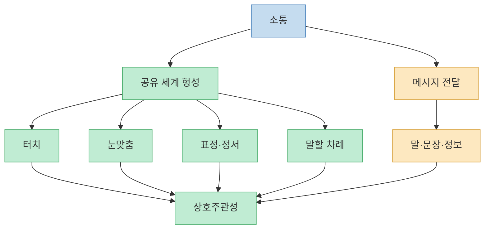
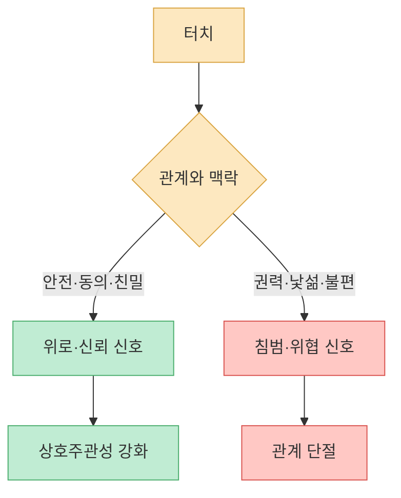
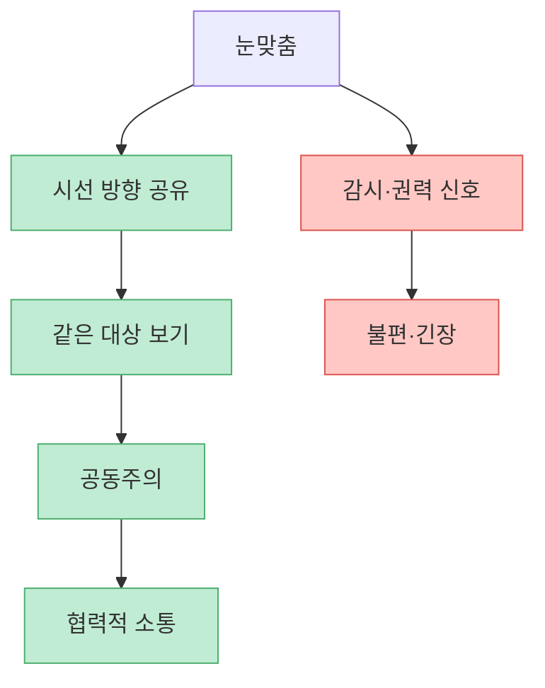
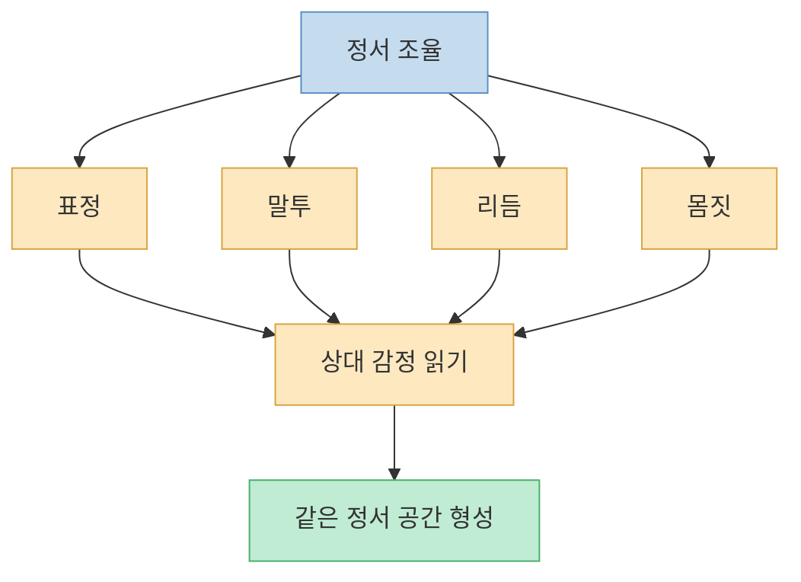
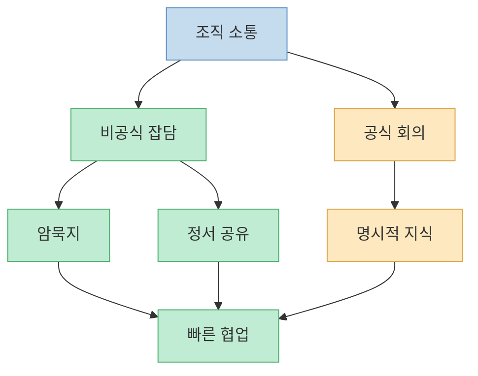
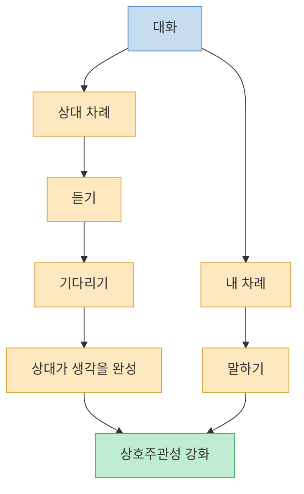
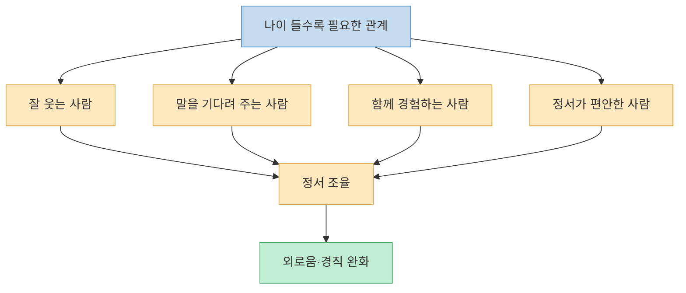

이 영상의 핵심은 “소통은 메시지 전달이 아니다”라는 말로 요약된다. 우리는 보통 말을 잘하면 소통이 잘된다고 생각하지만, 실제 대화에서는 말이 나오기 전에 이미 많은 것이 오간다. 터치, 눈맞춤, 표정, 정서의 리듬, 침묵, 말할 차례를 넘겨주는 방식이 먼저 관계의 바닥을 만든다. 그래서 나이가 들수록 웃긴 사람, 잘 웃는 사람, 말을 끊지 않는 사람, 함께 있으면 정서가 편안해지는 사람을 가까이 두는 것이 중요하다.

<!--more-->

## Sources

- [YouTube: 나이들수록 웃긴 사람들을 가까이 둬야 하는 이유](https://youtu.be/xHgOZCXZQXo?si=ErzJGdD8YR49izcA)
- [PubMed: Altruistic acting caused by a touching hand](https://pubmed.ncbi.nlm.nih.gov/34746947/)
- [PMC: Altruistic acting caused by a touching hand](https://pmc.ncbi.nlm.nih.gov/articles/PMC9071415/)
- [Association for Psychological Science: Teaching Contentious Classics - Harlow](https://www.psychologicalscience.org/index.php/publications/observer/2014/october-14/teaching-contentious-classics.html)
- [Big Think: The 7-38-55 rule, debunked](https://bigthink.com/the-learning-curve/the-7-38-55-rule-debunking-the-golden-ratio-of-conversation/)
- [Journal of Human Evolution: Cooperative eye hypothesis](https://evolutionaryanthropology.duke.edu/sites/evolutionaryanthropology.duke.edu/files/site-images/Tomasello%20et%20al_%20%202007_%20%20Reliance%20on%20head%20versus%20eyes%20in%20the%20gaze%20following%20of%20greate%20apes%20and%20human%20infants-the%20cooperative%20eye%20hypothesis_.pdf)
- [PMC: Analysis of eye movements in the judgment of enjoyment and non-enjoyment smiles](https://pmc.ncbi.nlm.nih.gov/articles/PMC3781329/)
- [Vrije Universiteit Amsterdam: Bad is stronger than good](https://research.vu.nl/en/publications/bad-is-stronger-than-good-2/)

---

## 소통은 메시지 전달이 아니라 `공유 세계`를 만드는 일이다

영상은 우리가 흔히 떠올리는 소통 모델, 즉 한 사람이 메시지를 보내고 다른 사람이 그것을 이해한다는 그림이 틀렸다고 말한다. 메시지는 마지막 단계일 뿐이고, 말하기 전부터 우리는 이미 많은 것을 공유하거나 공유하지 못하고 있다는 것이다. [영상 00:00](https://youtu.be/xHgOZCXZQXo?t=0)

이때 등장하는 개념이 `상호주관성`이다. 대화는 말하는 사람 한 명의 소유도, 듣는 사람 한 명의 책임도 아니다. 두 사람이 함께 만들어 가는 장이다. 그래서 상대가 마음에 들지 않으면 논리적으로 맞는 말도 전달되지 않는다. “당신 말은 맞는데 나는 안 바꿀 거야”라는 상황은 메시지는 이해됐지만 관계의 바닥은 닫혀 있는 상태다. [영상 01:31](https://youtu.be/xHgOZCXZQXo?t=91)

다만 영상에서 언급되는 “메시지는 7%, 비언어가 93%”라는 식의 설명은 조심해야 한다. Mehrabian의 7-38-55 법칙은 감정과 태도 전달에서 말, 목소리, 표정이 불일치할 때 사람들이 어떤 단서를 더 신뢰하는지에 관한 제한된 연구에서 나온 것이다. 모든 소통에서 말의 내용이 7%밖에 안 된다는 뜻은 아니다. 그래도 이 오해를 걷어내고 보더라도, 비언어적 단서가 소통의 바닥을 만든다는 핵심은 여전히 중요하다.

---

## 터치: 말보다 빠르게 관계의 온도를 바꾸는 감각

영상은 터치를 비언어적 소통의 첫 번째 요소로 다룬다. 웨이터가 손님에게 계산서를 줄 때 어깨나 손을 살짝 터치하면 팁이 올라간다는 연구 이야기도 나온다. [영상 03:03](https://youtu.be/xHgOZCXZQXo?t=183)

실제로 `Midas touch effect`라 불리는 현상은 사회적 터치가 친사회적 행동이나 호의적 반응을 높일 수 있음을 보여주는 연구 흐름과 연결된다. 다만 이 효과는 문화, 상황, 관계, 성별, 권력관계에 따라 달라질 수 있다. 친밀하지 않은 관계에서의 터치는 호감이 아니라 불쾌감이나 위협으로 받아들여질 수 있다. 따라서 “터치하면 소통이 잘된다”가 아니라, “안전하고 동의된 관계 안에서의 부드러운 접촉은 신뢰와 위로의 신호가 될 수 있다”가 더 정확하다.

영상은 Harlow의 원숭이 실험도 언급한다. 철사 어미는 먹이를 주고, 헝겊 어미는 부드러운 접촉을 제공했을 때 어린 원숭이들이 헝겊 어미에게 더 오래 머물렀다는 이야기다. 이 실험은 오늘날 윤리적으로 매우 문제적이지만, 애착과 접촉 위안의 중요성을 보여주는 고전 연구로 자주 언급된다. [영상 06:04](https://youtu.be/xHgOZCXZQXo?t=364)

터치는 통증과도 연결된다. 영상은 아픈 곳을 문지르면 통증이 덜해지는 현상을 `게이트 컨트롤 이론`으로 설명한다. 신체 통증뿐 아니라 마음이 아플 때 가까운 사람이 등을 토닥이는 행위도 비슷한 의미를 가진다. 말로 완벽한 위로를 못 해도, 안전한 접촉은 “너 혼자가 아니다”라는 신호가 된다. [영상 07:04](https://youtu.be/xHgOZCXZQXo?t=424)

---

## 눈맞춤: 협력의 신호이면서 권력의 신호이기도 하다

영상은 두 번째 요소로 눈맞춤을 다룬다. 동물에게 눈을 맞추는 일은 공격 신호가 될 수 있지만, 인간은 흰자위가 드러난 눈을 통해 시선의 방향을 공유하고 협력할 수 있게 되었다고 설명한다. [영상 09:06](https://youtu.be/xHgOZCXZQXo?t=546)

이 설명은 `cooperative eye hypothesis`와 연결된다. 인간은 다른 영장류보다 흰자위와 홍채의 대비가 뚜렷해 시선 방향을 읽기 쉽고, 이는 공동주의와 협력적 소통에 유리했을 수 있다는 가설이다. 우리는 상대가 무엇을 보고 있는지 따라가며 같은 대상을 공유한다. 같은 것을 본다는 경험은 같은 세계를 만든다.

하지만 눈맞춤은 항상 따뜻한 신호는 아니다. 영상은 Panopticon과 감시의 구조를 예로 들며, 보는 사람과 보이는 사람 사이의 비대칭이 권력이 된다고 말한다. 직장, 군대, 학교에서 누군가가 나를 계속 보고 있다는 느낌은 협력이 아니라 통제와 긴장을 만든다. [영상 12:11](https://youtu.be/xHgOZCXZQXo?t=731)

그래서 좋은 눈맞춤은 오래 뚫어져라 보는 것이 아니다. 상대가 말할 때 잠깐 바라보고, 반응하고, 고개를 끄덕이고, 필요할 때 시선을 풀어 주는 리듬이다. 소통을 여는 시선과 상대를 압박하는 시선은 다르다.

---

## 정서 조율: 웃는 사람 옆에 있으면 정말 달라지는 이유

영상은 세 번째 요소로 정서 조율을 말한다. 눈을 마주치고 웃는 표정, 말투, 감정의 리듬이 서로 맞아 들어갈 때 소통이 깊어진다는 것이다. [영상 16:45](https://youtu.be/xHgOZCXZQXo?t=1005)

여기서 중요한 예가 `뒤센 미소`다. 진짜 즐거움의 미소는 입꼬리뿐 아니라 눈 주변 근육의 움직임이 함께 나타나는 경향이 있다. 연구들은 사람들이 눈 주변 단서를 통해 즐거움의 미소와 사회적 미소를 구분할 수 있음을 보여준다. 물론 사람은 의도적으로 뒤센 미소를 흉내 낼 수도 있고, 표정 해석은 문화와 상황에 따라 달라질 수 있다. 그래도 눈과 입이 함께 웃는 얼굴이 더 진정성 있게 느껴지는 이유는 있다. [영상 16:45](https://youtu.be/xHgOZCXZQXo?t=1005)

영상은 온라인 공간에서 공격성이 커지는 이유도 정서 조율의 부재로 설명한다. 얼굴을 보지 않고, 눈을 맞추지 않고, 상대의 말투와 표정을 느끼지 못하면 상호주관성이 약해진다. 그 빈자리를 원초적 감정, 특히 분노와 조롱이 채운다는 것이다. [영상 18:17](https://youtu.be/xHgOZCXZQXo?t=1097)

이 설명은 `부정성 편향`과도 연결된다. Baumeister 등은 나쁜 사건, 나쁜 감정, 나쁜 정보가 좋은 것보다 더 강하게 작용하는 경향을 정리했다. 온라인에서는 이 부정적 정보가 더 빨리 주목을 끌 수 있고, 그래서 어그로와 공격적 표현이 보상을 받기 쉽다. [영상 19:48](https://youtu.be/xHgOZCXZQXo?t=1188)

---

## 조직문화: 회의보다 잡담이 중요한 이유

영상은 망하는 회사일수록 회의 시간이 길다고 말한다. 그 이유는 회의가 공식 지식은 전달할 수 있지만, 정서 공유와 암묵지가 흐르는 통로가 되지 못하면 같은 말을 반복하게 되기 때문이다. [영상 22:50](https://youtu.be/xHgOZCXZQXo?t=1370)

공식 문서와 회의는 필요하다. 하지만 조직이 실제로 움직이려면 문서화되지 않는 맥락도 흘러야 한다. 누가 무엇을 중요하게 여기는지, 어떤 표현은 조심해야 하는지, 어떤 아이디어가 아직 말로 정리되지 않았지만 유망한지 같은 정보는 잡담과 비공식적 정서 공유 속에서 많이 이동한다.

이 관점에서 “잡담할 수 있을 때 잡담하라”는 말은 단순히 노는 문화를 만들라는 뜻이 아니다. 사람들이 안전하게 웃고, 묻고, 작은 오해를 풀 수 있는 공간을 만들라는 뜻이다. 정서의 수도관이 막힌 조직은 회의가 길어진다. 왜냐하면 관계의 바닥이 없으니 모든 것을 공식 절차와 반복 설명으로 해결해야 하기 때문이다.

---

## 턴테이킹: 말을 끊지 않는 사람이 결국 소통을 만든다

영상의 네 번째 요소는 `턴테이킹`, 즉 순서 주고받기다. 오바마가 연설 중 침묵을 두고 청중을 초대하는 사례, 엄마와 아기가 “누가 그랬어?” 놀이로 차례를 배우는 사례가 나온다. [영상 30:24](https://youtu.be/xHgOZCXZQXo?t=1824)

대화의 핵심은 내 말을 잘하는 것이 아니라 상대가 말할 차례를 느끼게 해 주는 것이다. 영상은 특히 똑똑한 사람들이 남의 말을 중간에 끊는 실수를 많이 한다고 지적한다. 자신은 빠르게 이해했고 더 좋은 답을 알고 있다고 생각하지만, 상대에게는 존재 확인의 기회를 빼앗는 폭력처럼 느껴질 수 있다. [영상 31:56](https://youtu.be/xHgOZCXZQXo?t=1916)

Stivers 등의 대화 연구는 여러 언어에서 말 차례 전환이 매우 빠르게 일어난다는 점을 보여준다. 사람은 상대 말이 끝난 뒤 생각을 시작하는 것이 아니라, 듣는 동안 이미 다음 반응을 준비한다. 그래서 대화는 탁구공처럼 주고받는 단순 교대가 아니라, 상대의 리듬을 읽고 내 리듬을 맞추는 공동 작업이다.

리더십에서도 이것이 중요하다. 회의에서 가장 똑똑한 사람이 계속 설명하면 팀은 조용해질 수 있다. 하지만 조용해진 팀이 이해한 것은 아니다. 그냥 말할 차례를 빼앗겼을 수 있다. 좋은 리더는 정답을 빠르게 말하는 사람이 아니라, 다른 사람이 자기 생각을 꺼낼 공간을 만드는 사람이다.

---

## 나이 들수록 웃긴 사람을 가까이 둬야 하는 이유

영상 제목의 답은 여기서 나온다. 웃긴 사람은 단순히 농담을 잘하는 사람이 아니다. 함께 있으면 정서 조율이 쉬운 사람, 내 말을 끊지 않는 사람, 눈빛과 표정이 딱딱하지 않은 사람, 내 존재가 줄어들지 않는 사람이다. [영상 21:19](https://youtu.be/xHgOZCXZQXo?t=1279)

나이가 들수록 사회적 역할과 명함이 줄어들고, 몸의 접촉 경험도 줄어들고, 새로운 관계를 만들 기회도 줄어든다. 이때 곁에 불쾌하고 엄숙하고 공격적인 사람만 있으면 정서도 같이 굳는다. 반대로 잘 웃고, 잡담할 수 있고, 같이 음악을 듣거나 산책할 수 있는 사람은 정서의 튜닝을 회복시킨다. [영상 28:53](https://youtu.be/xHgOZCXZQXo?t=1733)

그래서 소통 능력을 키우는 가장 현실적인 방법은 말솜씨를 늘리는 것만이 아니다. 오프라인에서 사람을 만나고, 같이 걷고, 같이 밥 먹고, 같이 음악을 듣고, 상대가 말할 차례를 기다리는 훈련을 다시 하는 것이다. 말하지 않고 말하는 능력은 결국 몸과 정서가 함께 배워야 한다.

---

## 핵심 요약

- 소통은 단순한 메시지 전달이 아니라, 말하기 전부터 공유 세계를 만드는 과정이다. [영상 00:00](https://youtu.be/xHgOZCXZQXo?t=0)
- 터치는 안전하고 동의된 맥락에서는 위로와 신뢰의 신호가 될 수 있지만, 관계와 맥락을 무시하면 침범이 된다. [영상 03:03](https://youtu.be/xHgOZCXZQXo?t=183)
- 눈맞춤은 협력의 신호이면서 감시와 권력의 신호가 될 수도 있다. 좋은 눈맞춤은 압박이 아니라 리듬이다. [영상 09:06](https://youtu.be/xHgOZCXZQXo?t=546)
- 정서 조율은 표정, 말투, 리듬, 몸짓을 통해 일어난다. 웃는 사람 옆에 있으면 즐거워지는 이유가 여기에 있다. [영상 16:45](https://youtu.be/xHgOZCXZQXo?t=1005)
- 온라인 공간은 눈맞춤과 터치, 정서 조율이 약해 공격성과 부정성 편향이 커지기 쉽다. [영상 18:17](https://youtu.be/xHgOZCXZQXo?t=1097)
- 조직에서는 회의보다 잡담이 암묵지와 정서 공유의 통로가 될 수 있다. [영상 22:50](https://youtu.be/xHgOZCXZQXo?t=1370)
- 턴테이킹은 상대에게 존재 확인의 기회를 주는 일이다. 말을 끊지 않는 것은 단순한 예의가 아니라 소통의 핵심 기술이다. [영상 31:56](https://youtu.be/xHgOZCXZQXo?t=1916)

## 결론

이 영상이 말하는 “웃긴 사람을 가까이 두라”는 조언은 가벼운 처세술이 아니다. 인간은 말만으로 연결되지 않는다. 만지고, 보고, 웃고, 기다리고, 같은 리듬을 타면서 서로의 세계를 만든다. 그 바닥이 없으면 아무리 정확한 메시지도 상대에게 닿지 않는다.

소통을 잘하고 싶다면 먼저 덜 설명하고 더 조율해야 한다. 상대의 말을 끊지 않고, 표정을 보고, 눈맞춤의 압력을 낮추고, 안전한 관계 안에서 온기를 주고받아야 한다. 결국 좋은 대화는 **내가 얼마나 많이 말했는가** 가 아니라 **우리 둘 사이에 말할 수 있는 세계가 생겼는가** 로 결정된다.

