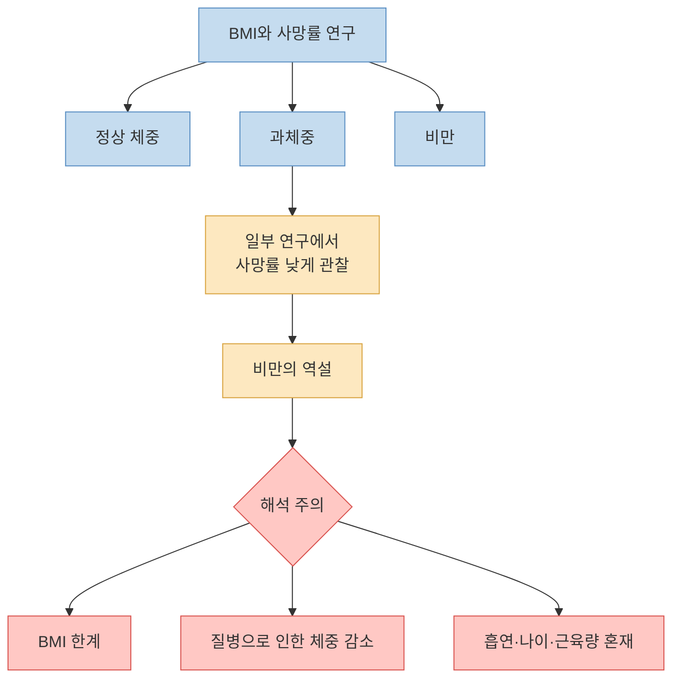
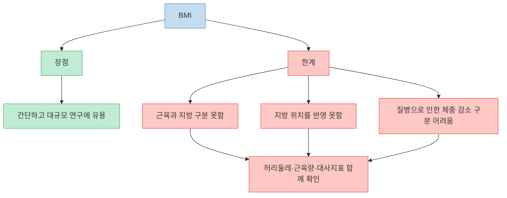
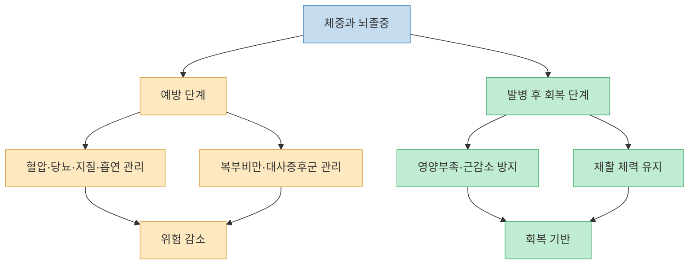
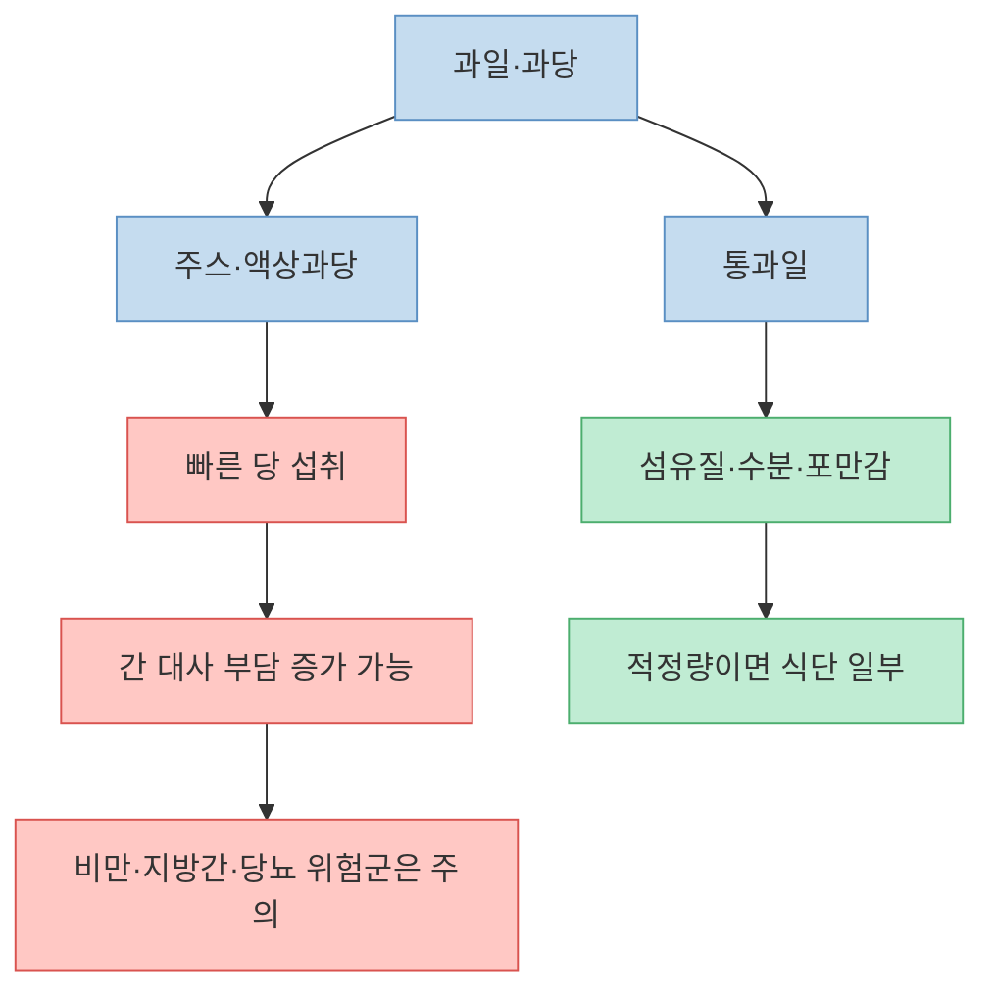
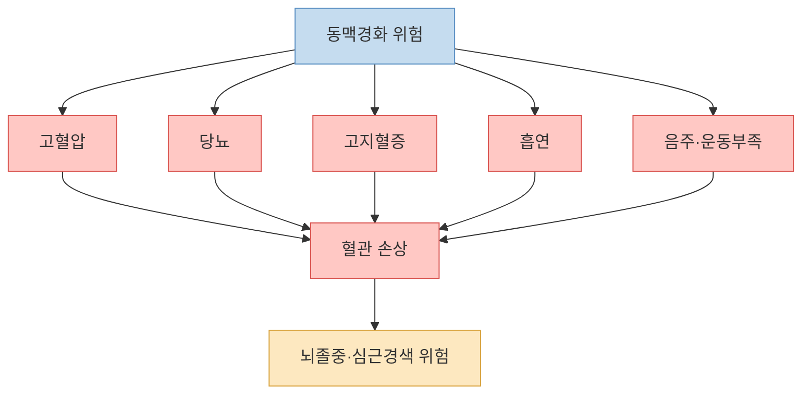
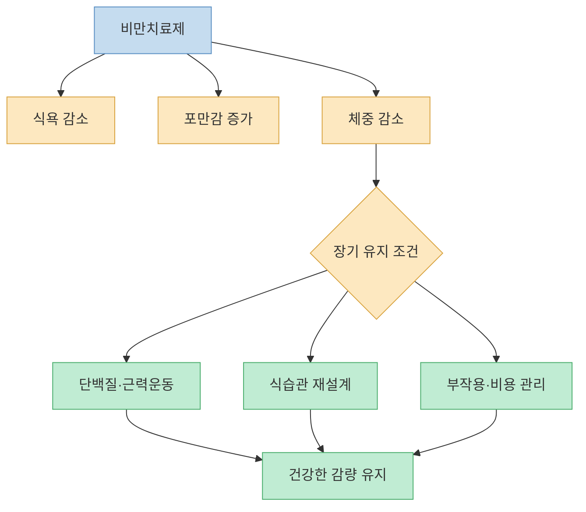

“살찐 사람이 더 오래 산다”는 말은 자극적이지만, 완전히 허무맹랑한 말은 아니다. 일부 대규모 관찰연구와 특정 질환군 연구에서 BMI 기준 과체중 또는 경도 비만 집단의 사망률이 정상 체중 집단보다 낮게 나타난 적이 있다. 이를 `비만의 역설`이라고 부른다. 다만 이 말은 “살을 찌우면 건강해진다”는 뜻이 아니다. BMI의 한계, 흡연·질병으로 인한 체중 감소, 근육량, 나이, 만성질환 상태가 뒤섞이면 이런 역설적 결과가 나타날 수 있다.

<!--more-->

## Sources

- [YouTube: 과학적으로 밝혀진 살찐 사람이 더 오래 사는 이유](https://youtu.be/bgrXlaImNtU?si=96irDdGGPUSzZfXk)
- [요약 포스트: 살찐 사람이 더 오래 산다? 서울대 교수가 밝힌 비만의 역설](https://smile7962.tistory.com/entry/%EC%82%B4%EC%B0%90-%EC%82%AC%EB%9E%8C%EC%9D%B4-%EB%8D%94-%EC%98%A4%EB%9E%98-%EC%82%B0%EB%8B%A4%EC%84%9C%EC%9A%B8%EB%8C%80-%EA%B5%90%EC%88%98%EA%B0%80-%EB%B0%9D%ED%9E%8C-%EB%B9%84%EB%A7%8C%EC%9D%98-%EC%97%AD%EC%84%A4)
- [JAMA: Association of All-Cause Mortality With Overweight and Obesity Using Standard BMI Categories](https://jamanetwork.com/journals/jama/articlepdf/1555137/jrv120009_71_82.pdf)
- [International Journal of Obesity: Obesity paradox misunderstands the biology of optimal weight](https://www.nature.com/articles/ijo201459)
- [PLOS One: Obesity paradox in stroke - Myth or reality?](https://journals.plos.org/plosone/article?id=10.1371%2Fjournal.pone.0171334)
- [International Journal of Stroke: Abnormal body weight and outcomes after stroke](https://journals.sagepub.com/doi/10.1177/17474930231212972)
- [PubMed: Dietary sugars and de novo lipogenesis in NAFLD](https://pubmed.ncbi.nlm.nih.gov/25514388/)
- [CDC: Alcohol Use and Your Health](https://www.cdc.gov/alcohol/about-alcohol-use/index.html)

---

## 비만의 역설: 과체중 구간에서 사망률이 낮게 보이는 이유

영상은 BMI 25~30 또는 25~34 구간에서 사망률이 낮게 나타나는 데이터가 있다고 설명한다. 자막 다운로드가 차단되어 세부 타임스탬프는 확인하지 못했지만, 공개 요약 자료에 따르면 이 부분은 영상의 핵심 주장 중 하나다. [영상 전체](https://youtu.be/bgrXlaImNtU?t=0)

이 주장은 실제 연구 흐름과 연결된다. Flegal 등이 JAMA에 발표한 대규모 메타분석은 표준 BMI 범주에서 과체중 집단의 전체 사망률이 정상 BMI 집단보다 낮게 나타나는 결과를 보고했다. 이런 결과 때문에 “과체중이 오히려 유리한가”라는 논쟁이 오랫동안 이어졌다.

하지만 International Journal of Obesity의 논평처럼, 비만의 역설은 “살이 찔수록 건강하다”가 아니라 생애주기, 질병 상태, 나이, 근육량, 흡연과 질병으로 인한 체중 감소가 관찰연구에 섞인 결과일 수 있다. 특히 이미 아픈 사람이 체중이 줄어 정상 또는 저체중으로 분류되면, 정상 체중군의 사망률이 높아 보일 수 있다.

---

## BMI는 간단하지만 거칠다

비만의 역설을 이해하려면 BMI의 한계를 먼저 봐야 한다. BMI는 체중을 키의 제곱으로 나눈 값이라 계산이 쉽지만, 지방과 근육을 구분하지 못한다. 같은 BMI 27이라도 근육이 많은 사람과 복부 내장지방이 많은 사람의 위험은 다르다.

따라서 “BMI 25~30이 오래 산다”는 말은 개인에게 바로 적용할 수 있는 처방이 아니다. 허리둘레, 혈압, 혈당, 중성지방, HDL 콜레스테롤, 지방간, 수면무호흡, 근육량, 운동능력까지 함께 봐야 한다. 특히 복부비만과 대사증후군이 있으면 BMI가 조금 낮아도 위험할 수 있고, 반대로 근육량이 충분한 과체중은 단순 BMI만으로 평가하기 어렵다.

---

## 뇌졸중과 비만의 역설: 치료 후에는 `마른 것`이 항상 유리하지 않을 수 있다

영상은 이승훈 교수가 신경과·뇌졸중 전문가라는 맥락에서 비만의 역설을 설명하는 것으로 알려져 있다. 공개 요약 자료에 따르면, 뇌졸중 환자에게는 억지로 더 찌우거나 빼기보다 현재 상태를 이해하고 균형 잡힌 식사를 유지하는 메시지가 나온다. [영상 전체](https://youtu.be/bgrXlaImNtU?t=0)

실제로 뇌졸중 이후 체중과 예후를 다룬 연구들에서는 과체중 또는 비만군의 사망률이 낮게 나타나는 결과가 보고된 적이 있다. PLOS One의 체계적 문헌고찰과 2024년 우산형 리뷰도 뇌졸중 이후 `obesity paradox`가 관찰될 수 있음을 다룬다.

그러나 이것도 “뇌졸중 예방을 위해 살을 찌우라”는 뜻은 아니다. 고혈압, 당뇨, 이상지질혈증, 흡연, 심방세동은 뇌졸중의 강력한 위험요인이다. 체중은 예후와 예방에서 서로 다른 맥락으로 읽어야 한다. 뇌졸중 전에는 혈관 위험요인을 낮추는 것이 중요하고, 뇌졸중 후에는 근감소와 영양부족을 피하면서 재활과 기능 회복을 지키는 것이 중요하다.

---

## 과일과 과당: “건강한 단맛”도 과하면 문제가 된다

공개 요약 자료에 따르면 영상은 과일과 과당도 다룬다. 흔히 “밀가루는 안 먹고 과일만 먹는다”고 말하지만, 과당은 간에서 대사되며 지방합성과 연결될 수 있으니 과식하면 안 된다는 취지다. [영상 전체](https://youtu.be/bgrXlaImNtU?t=0)

과당이 간의 de novo lipogenesis, 즉 새 지방 합성과 관련될 수 있다는 연구는 있다. 특히 설탕 음료, 액상과당, 과일주스처럼 빠르게 많이 섭취되는 형태는 지방간과 대사질환 위험 측면에서 주의가 필요하다.

다만 여기서도 구분이 필요하다. 통과일은 식이섬유, 수분, 미량영양소를 함께 제공하고 포만감도 있다. 반면 과일주스나 말린 과일, 과일을 큰 그릇으로 계속 먹는 습관은 당 섭취를 쉽게 늘린다. 따라서 “과일은 나쁘다”가 아니라 “건강하다는 이유로 무제한 먹어도 되는 음식은 아니다”가 정확하다.

---

## 혈관 건강의 핵심은 체중보다 위험요인 관리다

영상 요약은 고혈압, 당뇨, 고지혈증을 동맥경화의 핵심 위험요인으로 정리한다. [영상 전체](https://youtu.be/bgrXlaImNtU?t=0)

이 부분은 매우 중요하다. 살이 조금 찌거나 빠졌는지보다, 혈압이 조절되는지, 당화혈색소가 안정적인지, LDL 콜레스테롤이 위험도에 맞게 관리되는지가 뇌졸중과 심근경색 예방에 훨씬 직접적이다. 체중은 중요한 지표지만, 혈관 건강에서는 대사 지표와 생활습관을 함께 봐야 한다.

스타틴 같은 고지혈증 약은 이 맥락에서 이해해야 한다. 근육통 같은 부작용을 경험하는 사람도 있지만, 심혈관 고위험군에서 LDL 콜레스테롤을 낮추는 치료의 이득은 많은 임상 연구로 확인되어 왔다. 중요한 것은 임의로 끊지 않고, 증상을 의료진에게 말해 약 종류·용량·위험도를 함께 조정하는 것이다.

---

## 위고비·마운자로 같은 약은 `의지 대체제`가 아니라 치료 도구다

공개 요약 자료에 따르면 영상은 위고비·마운자로와 펜터민 같은 약물도 비교한다. GLP-1 또는 GIP/GLP-1 계열 약은 포만감과 식욕 조절 경로에 작용해 체중감량에 도움을 줄 수 있지만, 중단 후 체중이 다시 증가할 수 있고 부작용도 있다. [영상 전체](https://youtu.be/bgrXlaImNtU?t=0)

이 약들은 비만을 “의지 부족”이 아니라 생물학적 질환으로 다루게 만들었다는 점에서 의미가 크다. 그러나 약만 맞고 식습관, 단백질, 운동, 수면, 음주를 그대로 두면 장기 유지가 어렵다. 특히 메스꺼움, 변비, 구토, 담낭·췌장 관련 문제, 근손실 위험, 비용 문제를 함께 고려해야 한다.

또한 펜터민 같은 식욕억제제는 교감신경 자극, 혈압·맥박 상승, 불면, 의존성 위험 때문에 특히 주의가 필요하다. 약물 선택은 체중 숫자만이 아니라 혈압, 심혈관 위험, 정신건강, 수면, 복용 중인 약을 함께 보고 결정해야 한다.

---

## 술은 “적당하면 약”이라는 말에서 멀어지고 있다

영상 요약은 음주에 대해 “아예 마시지 않는 것이 가장 좋다”는 방향을 소개한다. [영상 전체](https://youtu.be/bgrXlaImNtU?t=0)

CDC는 술을 덜 마시거나 마시지 않는 것이 건강 위험을 낮출 수 있다고 안내한다. 특히 일부 암 위험은 음주량이 늘수록 증가하고, 수면의 질 저하, 혈압 상승, 부정맥, 간질환, 사고 위험도 함께 고려해야 한다.

다만 술 문제도 개인의 건강 상태와 문화적 맥락에 따라 다르게 접근해야 한다. 이미 마시지 않는 사람에게 건강을 위해 술을 시작하라고 할 이유는 없고, 마시는 사람은 양과 빈도를 줄이는 것만으로도 이득이 있을 수 있다.

---

## 핵심 요약

- 비만의 역설은 일부 연구에서 과체중 또는 경도 비만 집단의 사망률이 낮게 관찰되는 현상이다. 하지만 이것은 “살을 찌우면 건강해진다”는 뜻이 아니다. [영상 전체](https://youtu.be/bgrXlaImNtU?t=0)
- BMI는 근육량, 내장지방, 질병으로 인한 체중 감소를 구분하지 못한다. 허리둘레와 대사지표를 함께 봐야 한다.
- 뇌졸중 이후 예후에서 과체중이 유리하게 보이는 연구가 있지만, 예방 단계에서는 혈압·당뇨·지질·흡연 관리가 여전히 핵심이다.
- 과일은 건강식일 수 있지만 과당을 과하게 섭취하면 간 대사와 지방간 측면에서 문제가 될 수 있다. 특히 주스와 말린 과일은 주의가 필요하다.
- 스타틴, GLP-1 계열 비만치료제 같은 약은 무조건 피하거나 맹신할 대상이 아니라, 개인 위험도에 맞춰 의료진과 결정할 치료 도구다.
- 술은 “적당히 마시면 약”이라는 인식보다, 덜 마실수록 위험이 줄어든다는 방향으로 이해하는 편이 안전하다.

## 결론

“살찐 사람이 더 오래 산다”는 말은 절반만 맞다. 일부 데이터에서 과체중 집단의 사망률이 낮게 보이는 것은 사실이지만, 그 이유가 지방 자체의 보호 효과인지, BMI의 한계와 질병·흡연·근감소 같은 교란 때문인지는 조심해서 봐야 한다.

개인에게 더 중요한 질문은 “내 BMI가 몇인가”보다 “내 혈압, 혈당, 지질, 허리둘레, 근육량, 식습관, 음주, 운동능력은 어떤가”이다. 건강한 몸은 단순히 마른 몸도, 무작정 찐 몸도 아니다. **혈관이 안전하고, 근육이 유지되고, 대사 지표가 안정적인 몸** 이다.

