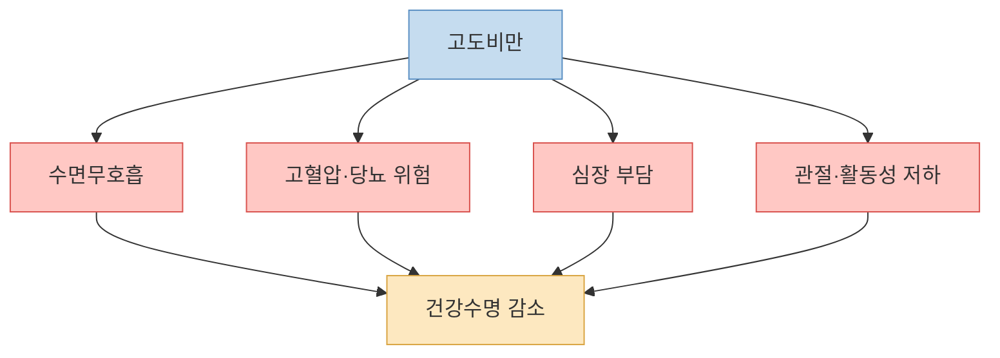
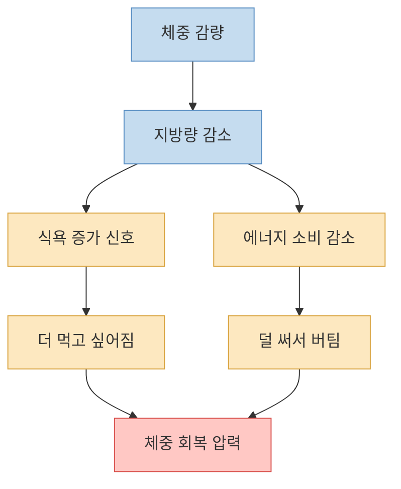
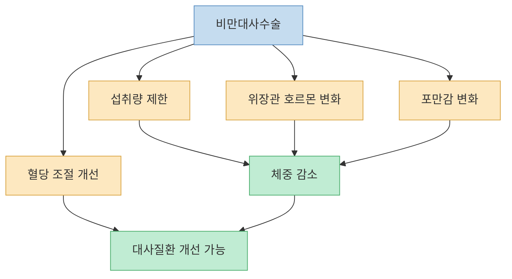
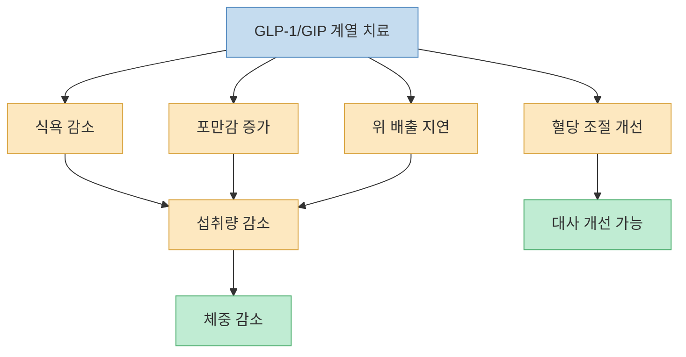
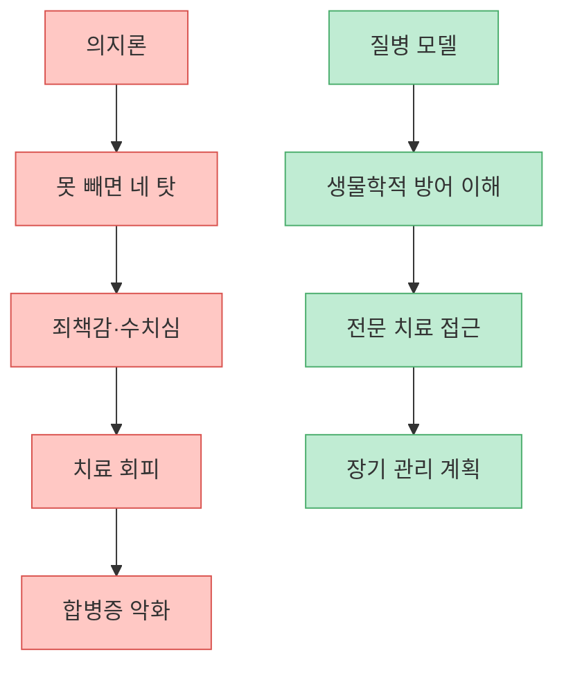
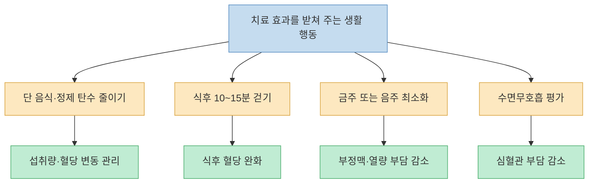
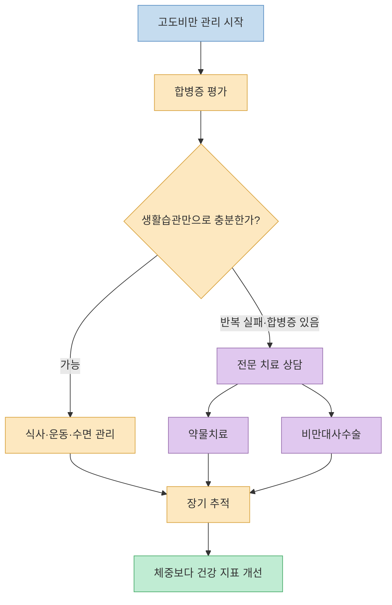

영상의 핵심은 강하다. 고도비만은 의지 부족이 아니라 몸의 조절 시스템이 높은 체중을 방어하는 질병이라는 것이다. 장형우 교수는 흉부외과 의사이자 고도비만을 겪은 환자로서, 수면무호흡·부정맥·당뇨 전단계·비만대사수술·GLP-1 계열 약물 경험을 이야기한다. 이 글의 결론도 비슷하다. 살을 빼려면 “더 독하게 참아라”보다 “내 몸이 왜 다시 찌려고 하는지 이해하고, 필요한 경우 전문 치료를 받아라”가 먼저다.

<!--more-->

## Sources

- [YouTube: "살 빼고 싶으면 의지 버리세요" 116kg 의사가 죽기 살기로 깨달은 딱 '이것'](https://youtu.be/arZj7HElBxs?si=Pg5xE5b2wCmsgNb-)
- [Endocrine Society: Pharmacological Management of Obesity Guideline Resources](https://www.endocrine.org/clinical-practice-guidelines/pharmacological-management-of-obesity)
- [American College of Cardiology: STEP 1 - Semaglutide Treatment Effect in People With Obesity](https://www.acc.org/latest-in-cardiology/clinical-trials/2021/02/18/19/23/step-1)
- [PubMed: Once-Weekly Semaglutide in Adults with Overweight or Obesity](https://pubmed.ncbi.nlm.nih.gov/33567185/)
- [American College of Cardiology: SURMOUNT-1 - Tirzepatide Once Weekly for the Treatment of Obesity](https://www.acc.org/Latest-in-Cardiology/Clinical-Trials/2022/08/04/15/32/SURMOUNT-1)
- [American College of Cardiology: Epicardial Fat and Atrial Fibrillation](https://www.acc.org/Latest-in-Cardiology/ten-points-to-remember/2016/03/08/14/52/Epicardial-Fat-and-Atrial-Fibrillation-Current-Evidence)
- [American College of Cardiology: Risk Factor Modification is an Integral Part of Atrial Fibrillation Management](https://www.acc.org/latest-in-cardiology/articles/2021/03/22/15/16/risk-factor-modification-is-an-integral-part-of-af-management)
- [PubMed: Three 15-min bouts of moderate postmeal walking improves 24-h glycemic control](https://pubmed.ncbi.nlm.nih.gov/23761134/)

---

## 고도비만은 외모 문제가 아니라 생존 문제다

영상은 흉부외과 의사의 관점에서 비만을 이야기한다. 대동맥 질환, 관상동맥 수술, 응급실에서 만나는 젊은 고위험 환자들 중 체중이 큰 위험 요소로 보이는 사례를 반복해서 보았다는 것이다. [영상 00:00](https://youtu.be/arZj7HElBxs?t=0)

물론 “뚱뚱한 사람은 일찍 죽는다”는 문장은 너무 거칠다. 개인의 건강은 BMI 하나로 결정되지 않는다. 하지만 고도비만이 수면무호흡, 고혈압, 당뇨병, 이상지질혈증, 지방간, 관절질환, 심혈관질환 위험과 연결된다는 점은 분명하다. 특히 이미 숨참, 부정맥, 혈압, 당화혈색소, 수면 문제 같은 신호가 나타난다면 체중 문제는 미용이 아니라 의학적 관리 대상이다.

영상이 특히 강조하는 것은 수면무호흡과 부정맥이다. 수면무호흡은 자는 동안 기도가 막혀 산소포화도가 떨어지고 교감신경이 과활성화되는 상태다. 이 과정은 혈압과 심장에 부담을 준다. 또한 비만은 심외막 지방, 염증, 수면무호흡, 고혈압 등 여러 경로를 통해 심방세동 같은 부정맥 위험과 연결된다. [영상 03:03](https://youtu.be/arZj7HElBxs?t=183)

---

## 체중 세트포인트: 몸은 빠진 체중을 다시 채우려 한다

영상의 핵심 개념은 `체중 세트포인트`다. 몸이 특정 체중을 기준점처럼 방어하고, 그 아래로 내려가면 식욕을 올리고 에너지 소비를 낮추며 다시 체중을 올리려 한다는 설명이다. [영상 07:37](https://youtu.be/arZj7HElBxs?t=457)

이 개념은 실제 비만 생리학과 맞닿아 있다. 체중 감량 후에는 식욕 관련 호르몬, 에너지 소비, 포만감, 음식 보상 회로가 감량 전 상태로 돌아가려는 방향으로 움직일 수 있다. 흔히 말하는 요요는 단순히 “의지가 풀렸다”가 아니라, 몸이 이전 체중을 방어하는 생물학적 반응과 관련된다.

다만 세트포인트를 “절대 내려가지 않는 고정값”으로 이해하면 너무 비관적이다. 사람마다 유전, 성장기 환경, 수면, 스트레스, 약물, 음식 환경, 활동량이 다르고, 장기 치료와 생활 변화로 방어되는 체중 범위가 달라질 수 있다. 더 정확한 표현은 `세트포인트` 하나보다 `몸이 방어하는 체중 범위`에 가깝다.

영상의 중요한 메시지는 의지론을 깨는 데 있다. 체중이 잘 빠지지 않는 것이 당연하고, 빠지는 것이 오히려 어려운 일이라는 설명이다. [영상 13:39](https://youtu.be/arZj7HElBxs?t=819)

---

## 비만대사수술: 실패한 다이어트의 끝이 아니라 의학적 치료다

영상에서 교수는 여러 다이어트 실패 후 비만대사수술을 선택했고, 수술 후 6개월에 26kg이 빠졌다고 말한다. 당화혈색소도 당뇨 전단계에서 정상 범위로 내려갔다고 설명한다. [영상 06:06](https://youtu.be/arZj7HElBxs?t=366)

비만대사수술은 단순히 위를 작게 만들어 덜 먹게 하는 수술로만 보면 부족하다. 위장관 호르몬, 포만감, 혈당 조절, 음식 선호, 담즙산 대사 등 여러 경로가 바뀐다. 그래서 일부 환자에서는 체중이 많이 빠지기 전부터 혈당이 개선되기도 한다.

하지만 수술이 끝이 아니다. 영상에서도 90kg까지 빠졌다가 다시 102kg까지 늘었다고 말한다. 이것은 수술이 무의미하다는 뜻이 아니라, 비만이 장기 관리 질환이라는 뜻이다. 수술은 강력한 치료지만, 시간이 지나면 체중 재증가가 생길 수 있고, 영양 관리·운동·추적 진료·필요한 약물 치료가 함께 가야 한다. [영상 15:10](https://youtu.be/arZj7HElBxs?t=910)

---

## GLP-1 계열 치료제: 의지를 대신하는 것이 아니라 생물학을 겨냥한다

영상은 GLP-1 계열 비만치료제를 “첫 번째 열쇠”처럼 설명한다. 이전 비만치료제가 헛다리를 짚었다면, GLP-1 계열은 배부름과 영양 충분 신호를 이용해 체중 세트포인트의 힘을 약하게 만든다는 것이다. [영상 22:47](https://youtu.be/arZj7HElBxs?t=1367)

이 설명은 방향이 맞다. GLP-1 수용체 작용제는 식욕, 포만감, 위 배출, 혈당 조절과 관련된 경로에 작용한다. STEP 1 연구에서 semaglutide 2.4mg은 생활요법과 함께 투여했을 때 위약보다 훨씬 큰 체중 감소를 보였다. SURMOUNT-1 연구에서 tirzepatide도 비만 또는 과체중 성인에서 큰 체중 감소를 보였다.

다만 “약을 맞으면 먹어도 살이 안 찐다”는 식으로 이해하면 위험하다. 이 약들은 식욕과 섭취량을 줄이는 데 도움을 주지만, 무제한 섭취를 무효화하는 마법은 아니다. 또한 메스꺼움, 구토, 변비, 설사 같은 위장관 부작용이 흔하고, 개인 병력에 따라 사용하면 안 되는 경우도 있다. 반드시 의료진과 상의해야 한다.

---

## 의지론이 위험한 이유: 치료가 필요한 사람을 죄책감에 가둔다

영상에서 가장 강한 문장은 “살은 안 빠지는 게 정상이고 빠지는 게 신기한 일”이라는 말이다. [영상 15:10](https://youtu.be/arZj7HElBxs?t=910)

이 말은 비만을 방치하자는 뜻이 아니다. 오히려 반대다. 비만을 의지 문제로만 보면, 치료가 필요한 사람은 죄책감 속에서 혼자 실패를 반복한다. “다음 진료 때까지 5kg 빼 오세요” 같은 말은 쉬워 보이지만, 고도비만 환자에게는 생물학적 방어 시스템과 싸우라는 지시가 될 수 있다.

Endocrine Society의 약물치료 가이드라인도 BMI와 동반질환을 기준으로 비만 약물치료를 고려하도록 제안한다. 즉 생활습관만으로 충분하지 않은 사람에게 약물치료를 붙이는 것은 의지 부족의 인정이 아니라, 질병의 생물학을 겨냥하는 표준적 접근이다.

---

## 그래도 생활습관은 필요하다: 약과 수술의 효과를 받쳐 주는 행동

영상은 전문 치료와 함께 할 수 있는 실천도 제시한다. 단 음식과 정제 탄수화물을 줄이고, 식후에 움직이고, 술을 끊으라는 것이다. [영상 19:43](https://youtu.be/arZj7HElBxs?t=1183)

이 조언은 현실적이다. 단 음식과 정제 탄수화물은 섭취량을 늘리기 쉽고, 혈당 변동과 허기를 키울 수 있다. 식후 걷기는 식후 혈당 상승을 낮추는 데 도움이 될 수 있다. 연구에서도 식후 짧은 걷기나 오래 앉아 있는 시간을 끊는 행동이 식후 혈당과 인슐린 반응을 낮추는 데 유리하다는 결과들이 있다.

술 역시 체중과 부정맥 모두에서 조심해야 한다. 알코올은 열량을 제공하고 식욕 조절을 흐리게 하며, 일부 사람에게는 부정맥 유발 요인이 될 수 있다. 심방세동 관리에서 체중, 수면무호흡, 운동, 음주 같은 위험요인 조절은 중요한 축으로 다뤄진다.

하지만 생활습관은 `전문 치료의 대체재`가 아니라 `전문 치료의 효과를 키우는 기반`으로 보는 편이 좋다. 고도비만 상태에서 운동만으로 체중을 크게 줄이기는 어렵고, 체중이 줄어든 뒤 운동이 훨씬 쉬워지는 경우도 많다. 영상에서 말하듯 살이 빠진 뒤 운동이 재밌어졌다는 경험은 많은 환자에게 현실적이다. [영상 16:40](https://youtu.be/arZj7HElBxs?t=1000)

---

## 이 영상을 실천으로 바꾸는 순서

첫째, 현재 체중만 보지 말고 합병증 신호를 확인해야 한다. 코골이와 주간 졸림, 혈압, 당화혈색소, 간수치, 지질, 허리둘레, 부정맥 증상, 관절 통증을 함께 봐야 한다. [영상 03:03](https://youtu.be/arZj7HElBxs?t=183)

둘째, 반복적인 실패를 경험했다면 혼자 버티는 시간을 줄여야 한다. 비만 전문 진료, 내분비내과, 가정의학과, 비만대사수술 클리닉에서 약물치료와 수술 적응증을 상담할 수 있다.

셋째, 치료를 시작하더라도 장기 계획을 세워야 한다. 약을 끊었을 때 체중이 다시 증가할 수 있고, 수술 후에도 재증가가 가능하다. 따라서 “몇 달 빼기”가 아니라 “몇 년 관리”로 접근해야 한다.

마지막으로, 이 글은 개인 의료 조언이 아니다. 비만치료제와 비만대사수술은 효과가 큰 만큼 개인 병력, 약물, 임신 계획, 췌장·담낭 질환, 정신건강, 수술 위험도 등을 함께 평가해야 한다. 영상의 메시지를 실천으로 옮길 때도 반드시 의료진과 상의하는 것이 안전하다.

---

## 핵심 요약

- 영상은 고도비만을 의지 부족이 아니라 생물학적 방어 시스템이 관여하는 질병으로 설명한다. [영상 07:37](https://youtu.be/arZj7HElBxs?t=457)
- 수면무호흡과 부정맥은 비만에서 중요한 위험 신호다. 코골이, 숨 멎음, 심장 두근거림이 있다면 평가가 필요하다. [영상 03:03](https://youtu.be/arZj7HElBxs?t=183)
- 체중 감량 후 몸은 식욕 증가와 에너지 소비 감소를 통해 이전 체중으로 돌아가려 할 수 있다. 이것이 요요의 생물학적 배경이다. [영상 12:09](https://youtu.be/arZj7HElBxs?t=729)
- 비만대사수술은 단순히 위를 줄이는 것이 아니라 대사와 호르몬 경로를 바꾸는 강력한 치료다. 하지만 장기 관리가 필요하다. [영상 06:06](https://youtu.be/arZj7HElBxs?t=366)
- GLP-1 계열 치료제는 식욕·포만감·위 배출·혈당 조절 경로를 겨냥해 의미 있는 체중감량을 만들 수 있다. 그러나 부작용과 금기, 장기 관리 문제 때문에 의료진 상담이 필수다. [영상 22:47](https://youtu.be/arZj7HElBxs?t=1367)
- 단 음식 줄이기, 식후 걷기, 금주는 약물과 수술의 대체재가 아니라 치료 효과를 받쳐 주는 기반이다. [영상 19:43](https://youtu.be/arZj7HElBxs?t=1183)

## 결론

이 영상의 가장 중요한 메시지는 “의지를 버리라”가 아니라 “의지만으로 설명하지 말라”이다. 고도비만은 단순한 습관 문제가 아니라 뇌, 호르몬, 지방조직, 위장관, 수면, 심혈관계가 얽힌 만성질환이다.

그래서 필요한 태도는 비난도 포기도 아니다. 반복해서 실패했다면 그것은 치료가 필요하다는 신호일 수 있다. 생활습관을 다듬되, 약물치료와 비만대사수술 같은 의학적 선택지도 함께 검토해야 한다. 결국 살을 빼는 가장 현실적인 출발점은 **나를 탓하는 일** 이 아니라 **내 몸이 왜 다시 찌려고 하는지 이해하는 일** 이다.

