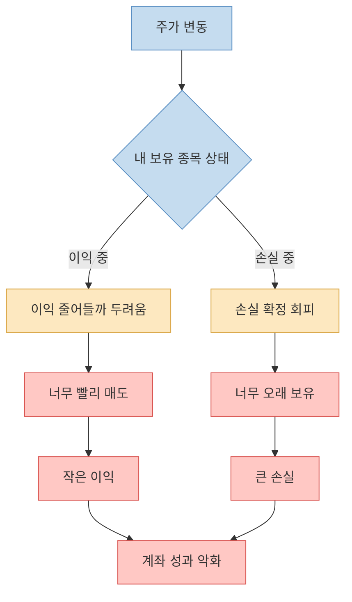
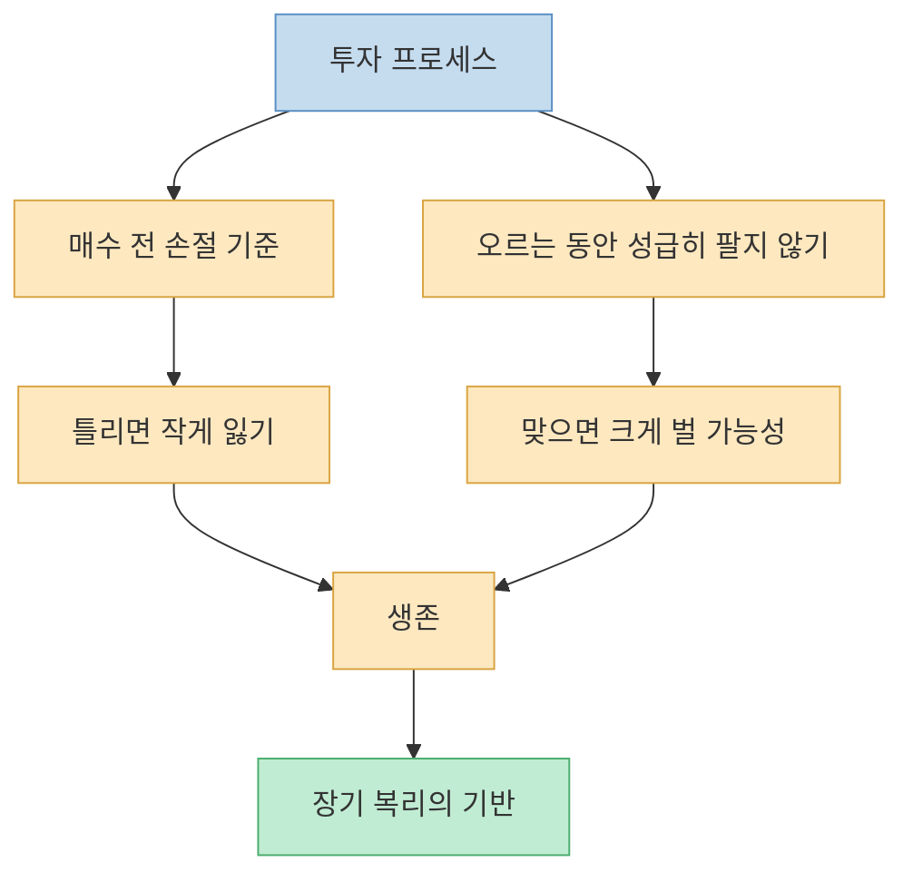
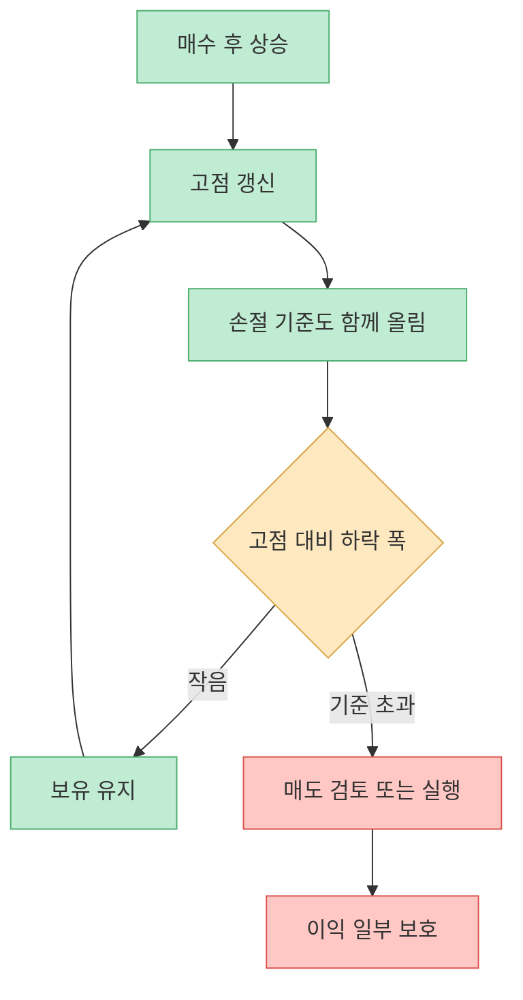
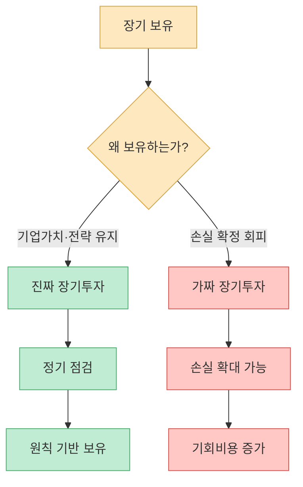
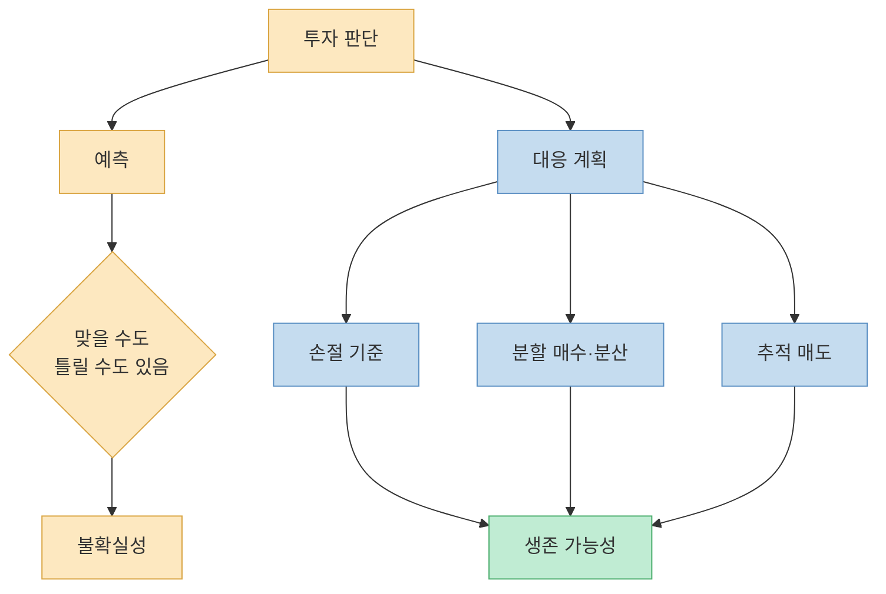
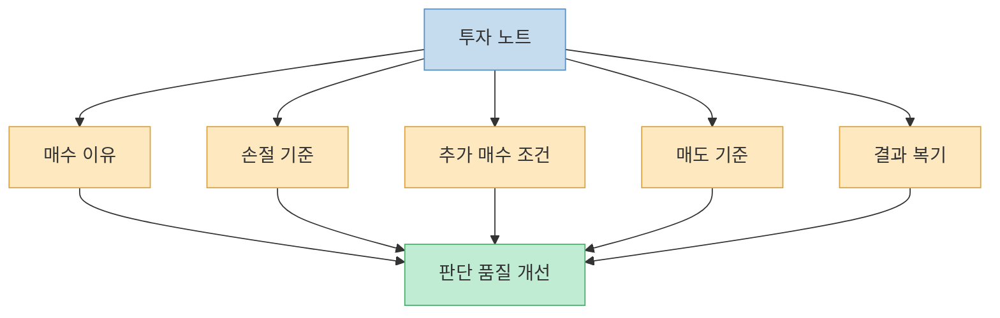
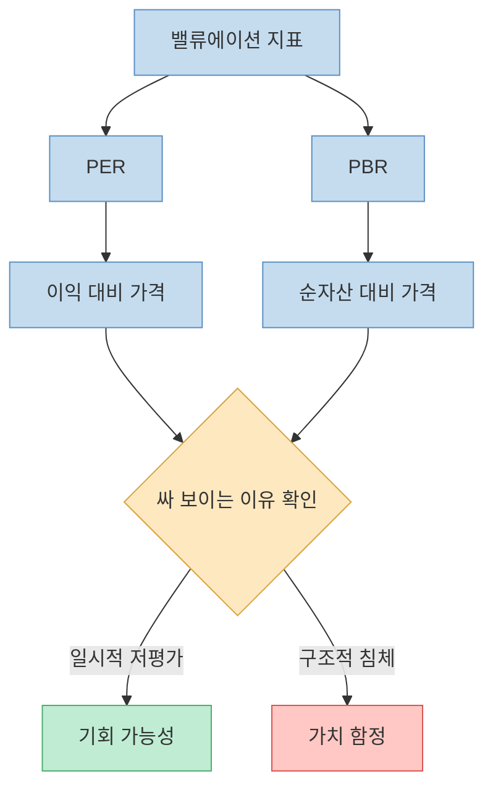

영상의 핵심은 “좋은 종목을 맞히는 것보다 좋은 프로세스를 갖는 것이 먼저”라는 말로 정리할 수 있다. 같은 종목을 사도 어떤 사람은 수익을 내고, 어떤 사람은 손실을 본다. 차이는 종목이 아니라 매수·매도·손절·기록·복기의 과정에 있다. 이 글은 특정 종목 추천이 아니라, 개인 투자자가 자기 행동을 통제하기 위한 투자 프로세스 정리다.

<!--more-->

## Sources

- [YouTube: 큰돈 버는 ‘주식 프로세스’ 총정리해드립니다](https://youtu.be/2291FQ20494?si=Of6JPOZfw9kMIXWr)
- [Timepoint: 영상 챕터 정보](https://timepoint.co.kr/bbs/board.php?bo_table=youtube&page=42&wr_id=5453)
- [요약 포스트: 큰돈 버는 주식 프로세스 총정리](https://smile7962.tistory.com/entry/%ED%81%B0%EB%8F%88-%EB%B2%84%EB%8A%94-%EC%A3%BC%EC%8B%9D-%ED%94%84%EB%A1%9C%EC%84%B8%EC%8A%A4-%EC%B4%9D%EC%A0%95%EB%A6%AC%EC%95%84%EC%8B%9C%EC%95%84-%EC%B5%9C%EA%B3%A0-%EC%95%A0%EB%84%90%EB%A6%AC%EC%8A%A4%ED%8A%B8%EA%B0%80-%EB%B0%9D%ED%9E%8C-%EC%A7%84%EC%A7%9C-%ED%88%AC%EC%9E%90-%EC%9B%90%EC%B9%99)
- [Econometrica: Prospect Theory](https://tesnewdev.econometricsociety.org/publications/econometrica/browse/1979/03/01/prospect-theory-analysis-decision-under-risk)
- [SSRN: Splitting the Disposition Effect](https://papers.ssrn.com/sol3/papers.cfm?abstract_id=1176422)
- [CFA Institute: The Behavioral Biases of Individuals](https://www.cfainstitute.org/insights/professional-learning/refresher-readings/2025/the-behavioral-biases-of-individuals)
- [Investor.gov: Stop, Stop-Limit, and Trailing Stop Orders](https://www.investor.gov/introduction-investing/general-resources/news-alerts/alerts-bulletins-15)
- [Britannica Money: Price-to-book ratio](https://www.britannica.com/money/price-to-book-ratio)

---

## 왜 주식은 오르는데 내 계좌는 손실일까

영상은 주식 투자에서 많은 사람이 손실을 보는 이유를 인간 본성에서 찾는다. 손실이 나면 팔지 못하고, 이익이 나면 빨리 팔아 버린다는 것이다. [영상 01:49](https://youtu.be/2291FQ20494?t=109)

행동재무학에서는 이를 `처분효과`와 연결해 설명한다. 투자자는 이익이 난 자산은 빨리 팔아 이익을 확정하고 싶어 하고, 손실이 난 자산은 손실 확정을 피하려고 오래 들고 가는 경향이 있다. 손실의 고통이 같은 크기의 이익보다 더 크게 느껴진다는 전망이론의 손실회피와도 이어진다.

이 때문에 영상의 첫 번째 결론은 “종목 추천을 받는 것”보다 “내가 이익과 손실에 어떻게 반응하는지 먼저 아는 것”이다. 시장을 예측하기 전에 내 행동을 예측할 수 있어야 한다.

---

## 상위 1%의 원칙: 손실은 짧게, 이익은 길게

영상은 상위 투자자들의 핵심 원칙을 “손실은 줄이고 이익은 늘리는 것”으로 정리한다. 좋은 종목을 사는 것보다, 틀렸을 때 빨리 인정하고 맞았을 때 성급히 팔지 않는 과정이 중요하다는 것이다. [영상 05:05](https://youtu.be/2291FQ20494?t=305)

이 원칙은 단순하지만 어렵다. 손실을 줄이려면 매수 전에 이미 “어디서 틀렸다고 판단할지” 정해야 한다. 반대로 이익을 늘리려면 “이 정도 벌었으니 됐다”는 조급함을 견뎌야 한다.

여기서 중요한 것은 손절이 실패가 아니라는 점이다. 손절은 “내 판단이 틀렸을 가능성을 인정하고 다음 기회를 살리는 행동”이다. 투자에서 가장 큰 위험은 틀리는 것이 아니라, 틀렸는데도 계속 맞았다고 우기는 것이다.

---

## 올랐을 때 팔면 초보라는 말의 진짜 뜻

영상은 “오르는 주식은 절대 팔지 말고, 고점에서 일정 비율 빠질 때 팔라”는 식의 추적 손절매 아이디어를 제시한다. [영상 07:59](https://youtu.be/2291FQ20494?t=479)

이 말은 무조건 영원히 보유하라는 뜻이 아니다. 핵심은 상승 추세가 살아 있는 동안 이익을 너무 빨리 확정하지 말고, 대신 고점 대비 하락 폭이 커질 때 빠져나오는 규칙을 만들라는 것이다.

SEC의 Investor.gov도 trailing stop order를 설명하면서, 가격이 유리한 방향으로 움직일 때 stop price가 따라 올라가고 불리한 방향으로 움직이면 고정되는 주문 방식이라고 설명한다. 다만 추적 손절매는 만능이 아니다. 급락이나 갭 하락에서는 예상보다 나쁜 가격에 체결될 수 있고, 너무 좁은 기준을 잡으면 정상적인 변동에도 팔려 나갈 수 있다.

따라서 영상의 “10% 빠지면 팔라”는 숫자는 절대 법칙이 아니라 예시로 봐야 한다. 변동성이 큰 성장주는 더 넓은 기준이 필요할 수 있고, 안정적인 대형주는 더 좁은 기준이 맞을 수도 있다. 중요한 것은 숫자 자체보다 `미리 정한 기준을 지키는 것`이다.

---

## 장기투자의 함정: 오래 보유가 항상 좋은 것은 아니다

영상은 “언젠가 오르겠지”라는 장기 보유가 치명적일 수 있다고 말한다. [영상 11:33](https://youtu.be/2291FQ20494?t=693)

장기투자는 좋은 전략이 될 수 있다. 하지만 좋은 기업을 합리적 가격에 사고, 실적과 경쟁력이 유지되는지 확인하며, 포트폴리오 전체 위험을 관리할 때 그렇다. 반대로 손실을 인정하기 싫어서 “장기투자”라고 이름 붙이는 것은 전혀 다르다.

진짜 장기투자는 매도 기준이 없는 투자가 아니다. 오히려 매수 이유가 훼손됐을 때, 재무 구조가 악화됐을 때, 산업 경쟁력이 바뀌었을 때, 더 나은 기회가 생겼을 때 어떻게 판단할지 기준이 있어야 한다.

---

## 예측보다 대응: 부자로 남는 사람의 방식

영상은 부자로 남고 싶다면 예측보다 대응이 중요하다고 말한다. [영상 13:39](https://youtu.be/2291FQ20494?t=819)

투자자는 미래를 완벽하게 맞힐 수 없다. 금리, 환율, 정책, 전쟁, 기술 변화, 경쟁 환경은 언제든 바뀐다. 그래서 필요한 것은 “내 전망이 틀렸을 때 어떻게 할지”다. 좋은 투자 프로세스는 예측이 맞을 때만 작동하는 계획이 아니라, 예측이 틀렸을 때도 계좌를 살리는 계획이다.

이 관점에서 “나는 이 주식이 오를 것 같다”보다 중요한 질문은 “내가 틀리면 얼마를 잃을 것인가”, “맞으면 어디까지 들고 갈 것인가”, “이 판단을 나중에 어떻게 복기할 것인가”다.

---

## 종목 고르기: 내가 좋아하는 기업이 아니라 시장이 좋아할 기업

영상은 종목을 고를 때 미인대회 원칙처럼 접근하라고 말한다. 즉 내가 좋아하는 기업이 아니라, 시장이 앞으로 더 좋게 평가할 가능성이 있는 기업을 봐야 한다는 것이다. [영상 15:25](https://youtu.be/2291FQ20494?t=925)

이 생각은 Keynes의 미인대회 비유와 닿아 있다. 시장에서는 내가 생각하는 아름다움보다, 다른 사람들이 아름답다고 생각할 것을 예상하는 게임이 벌어진다. 그래서 종목 선정에는 기업의 실제 가치뿐 아니라 시장의 관심, 이익 변화, 수급, 산업 모멘텀이 함께 작용한다.

다만 이 접근은 유행 추격과 다르다. 단순히 오른 종목을 따라 사는 것이 아니라, 왜 오르는지 설명할 수 있어야 한다. 매출, 이익, 산업 구조, 정책, 경쟁 우위, 밸류에이션 변화 중 무엇이 시장의 재평가를 만들고 있는지 확인해야 한다.

---

## 투자 노트: 주식 고수는 기억이 아니라 기록으로 배운다

영상은 주식 고수를 만드는 도구로 투자 노트를 강조한다. [영상 19:31](https://youtu.be/2291FQ20494?t=1171)

투자 노트에는 최소한 네 가지가 들어가야 한다. 첫째, 왜 샀는가. 둘째, 어디서 틀렸다고 인정할 것인가. 셋째, 어떤 조건이면 더 살 것인가. 넷째, 어떤 조건이면 팔 것인가. 이렇게 기록해야 나중에 운과 실력을 구분할 수 있다.

기록이 없으면 사람은 자기 기억을 고친다. 오르면 “원래 알았다”고 생각하고, 떨어지면 “어쩔 수 없었다”고 합리화한다. 투자 노트는 이 자기기만을 줄이는 장치다.

---

## PER·PBR은 싸다/비싸다의 시작점일 뿐이다

영상 후반부는 초보자가 반드시 알아야 할 지표로 PER과 PBR을 다룬다. [영상 31:32](https://youtu.be/2291FQ20494?t=1892)

PBR은 주가를 주당순자산과 비교하는 지표다. Britannica Money는 P/B ratio가 기업의 시장가치와 장부가치를 비교하는 데 쓰인다고 설명한다. PER은 주가를 주당순이익과 비교하는 지표다. 둘 다 “이 기업이 현재 이익이나 자산 대비 어느 정도 가격에 거래되는가”를 보는 출발점이다.

하지만 낮은 PER·PBR이 무조건 싼 주식을 뜻하지는 않는다. 이익이 줄어드는 기업은 PER이 낮아 보여도 비쌀 수 있고, 자산의 질이 나쁘거나 수익성이 낮은 기업은 PBR이 낮아도 재평가가 어려울 수 있다. 반대로 무형자산과 성장성이 큰 기업은 PBR이 높게 나오는 경우도 많다.

그래서 PER·PBR은 결론이 아니라 질문이다. “왜 낮은가”, “비슷한 기업과 비교하면 어떤가”, “이익이 개선될 가능성이 있는가”, “시장 평가가 바뀔 촉매가 있는가”를 묻기 위한 도구다.

---

## 초보자라면 ETF로 프로세스를 먼저 익히는 것도 방법이다

영상은 개별 종목과 ETF 전략도 다룬다. [영상 38:20](https://youtu.be/2291FQ20494?t=2300)

초보자가 개별 종목을 고르면 분석 난도가 높아진다. 산업, 재무제표, 경쟁사, 경영진, 밸류에이션, 수급까지 봐야 한다. 반면 ETF는 개별 기업 리스크를 줄이고, 특정 지수나 산업에 분산 투자할 수 있게 해 준다.

하지만 ETF도 안전자산은 아니다. 지수 ETF도 하락할 수 있고, 테마 ETF는 변동성이 클 수 있다. 그래서 ETF 역시 매수 이유, 비중, 리밸런싱 기준, 손실 허용 범위를 기록해야 한다. ETF는 공부를 대신해 주는 상품이 아니라, 과도한 종목 집중을 줄여 주는 도구에 가깝다.

---

## 핵심 요약

- 영상의 핵심은 종목 추천보다 투자 프로세스가 중요하다는 것이다. 같은 종목을 사도 결과가 다른 이유는 매수·매도·손절 기준이 다르기 때문이다. [영상 05:05](https://youtu.be/2291FQ20494?t=305)
- 개인 투자자는 이익이 난 종목은 빨리 팔고, 손실 난 종목은 오래 들고 가는 처분효과에 빠지기 쉽다. [영상 01:49](https://youtu.be/2291FQ20494?t=109)
- 손실은 매수 전에 정한 기준에서 짧게 끊고, 이익은 상승 추세가 훼손될 때까지 길게 가져가는 것이 핵심 원칙이다. [영상 07:59](https://youtu.be/2291FQ20494?t=479)
- 장기투자는 손실 회피의 핑계가 되어서는 안 된다. 보유 이유와 매도 조건이 있어야 진짜 장기투자다. [영상 11:33](https://youtu.be/2291FQ20494?t=693)
- 투자 노트는 운과 실력을 구분하고, 자기기만을 줄이는 가장 현실적인 도구다. [영상 19:31](https://youtu.be/2291FQ20494?t=1171)
- PER·PBR은 싸다/비싸다의 결론이 아니라 질문의 출발점이다. 낮은 지표가 기회인지 가치 함정인지 따져야 한다. [영상 31:32](https://youtu.be/2291FQ20494?t=1892)

## 결론

주식에서 큰돈을 버는 과정은 “다음 급등주를 맞히는 능력”보다 “내 행동을 통제하는 능력”에 더 가깝다. 손실이 났을 때 인정하고, 이익이 났을 때 성급히 자르지 않고, 모든 판단을 기록하고 복기하는 사람이 오래 살아남는다.

이 글은 투자 권유가 아니다. 모든 투자는 원금 손실 가능성이 있고, 매수·매도 결정의 책임은 투자자 본인에게 있다. 다만 하나는 분명하다. 종목보다 먼저 필요한 것은 **원칙 없는 확신** 이 아니라 **틀렸을 때도 살아남는 프로세스** 다.

