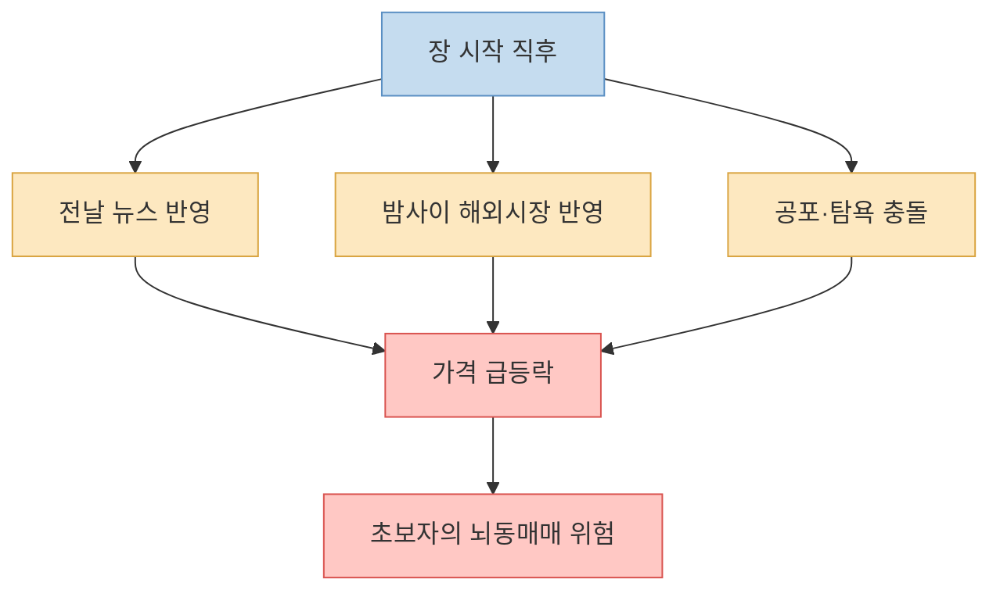
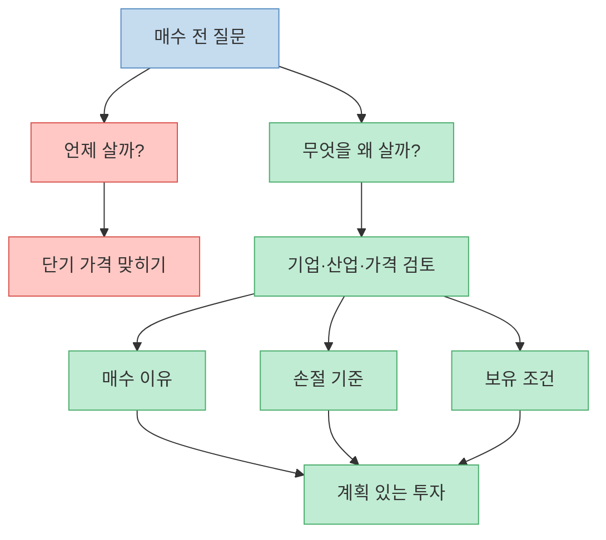
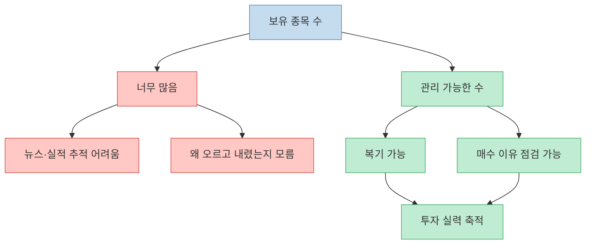
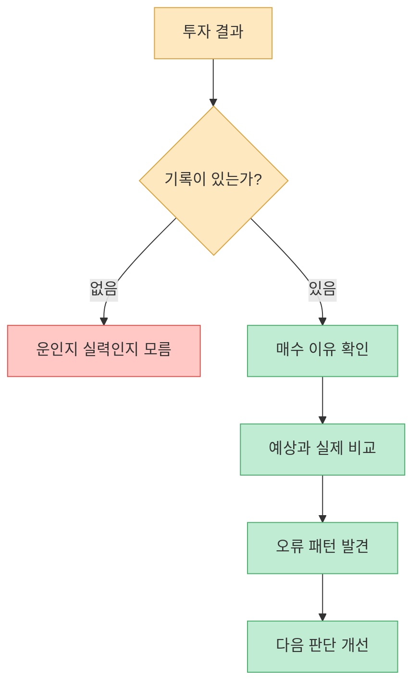
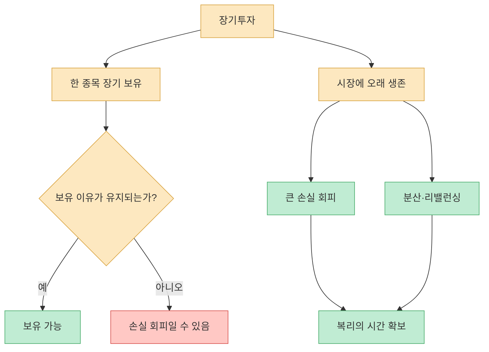
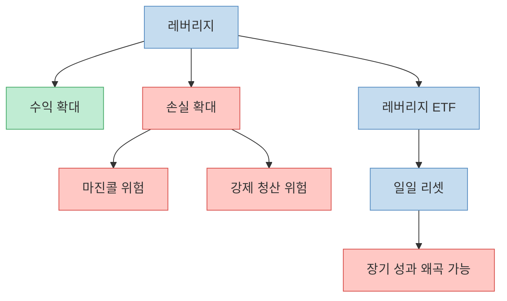
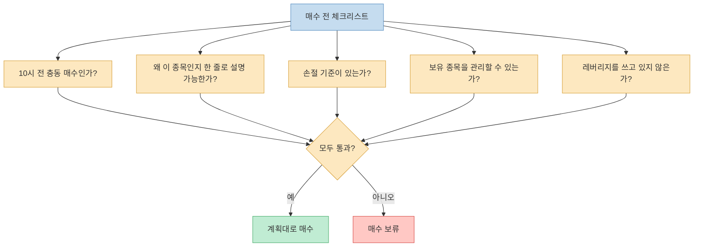

영상의 핵심은 “주식은 언제 사느냐보다 어떤 원칙으로 사느냐가 중요하다”는 말이다. 특히 초보 투자자는 장 시작 직후인 오전 10시 전 매수를 피하고, 종목 수를 줄이고, 레버리지와 단타의 자극에서 멀어져야 한다고 말한다. 이 글은 특정 종목 추천이 아니라, 개인 투자자가 시장에서 오래 살아남기 위한 매매 습관과 리스크 관리 원칙을 정리한 것이다.

<!--more-->

## Sources

- [YouTube: "이 시간에 사지 마세요." 주식 고수들의 투자 철칙](https://youtu.be/FRT5DqFpy1U?si=8zeZx45g31mBOi-S)
- [요약 포스트: 주식 투자 철칙](https://jackcok.com/entry/%EC%A3%BC%EC%8B%9D-%ED%88%AC%EC%9E%90-%EC%B2%A0%EC%B9%99-%EC%A2%85%EB%AA%A9-%EC%84%A0%ED%83%9D-%EB%A7%A4%EC%88%98-%ED%83%80%EC%9D%B4%EB%B0%8D-%EC%9E%A5%EA%B8%B0-%ED%88%AC%EC%9E%90)
- [SEC: Beginners' Guide to Asset Allocation, Diversification, and Rebalancing](https://www.sec.gov/about/reports-publications/investorpubsassetallocationhtm)
- [FINRA: Risk](https://www.finra.org/investors/investing/investing-basics/risk)
- [FINRA: The Lowdown on Leveraged and Inverse Exchange-Traded Products](https://www.finra.org/investors/insights/lowdown-leveraged-and-inverse-exchange-traded-products)
- [FINRA: Non-Traditional ETFs FAQ](https://www.finra.org/rules-guidance/key-topics/etf/non-traditional-etf-faq)
- [Investor.gov: Understanding Margin Accounts](https://www.investor.gov/introduction-investing/general-resources/news-alerts/alerts-bulletins/investor-bulletins-29)
- [arXiv: Individual and collective stock dynamics - intra-day seasonalities](https://arxiv.org/abs/1009.4785)

---

## 장 시작 직후에는 왜 사지 말라고 할까

영상의 대표적인 조언은 “초보자는 오전 10시 전에는 사지 말라”는 것이다. 공개 요약 자료에 따르면, 오전 9시부터 10시까지는 전날 뉴스, 밤사이 해외시장, 투자자들의 공포와 탐욕이 한꺼번에 반영되면서 가격이 과하게 움직일 수 있다고 설명한다. [영상 전체](https://youtu.be/FRT5DqFpy1U?t=0)

이 조언은 시장미시구조 관점에서도 이해할 수 있다. 장 초반에는 미처 반영되지 못한 정보가 한꺼번에 가격에 들어오고, 주문 불균형이 커지며, 변동성이 높아지는 경우가 많다. 고빈도 데이터를 다룬 연구들도 장중 변동성에는 시간대별 패턴이 있음을 보여준다.

물론 “10시 전 매수 금지”가 모든 시장과 모든 전략에 적용되는 절대 법칙은 아니다. 전문 단기 트레이더에게는 장 초반 변동성이 기회일 수도 있다. 하지만 초보 투자자에게는 기회보다 충동이 더 크게 작동한다. 그래서 이 규칙의 본질은 `시간 맞추기`가 아니라 `흥분한 상태에서 사지 않기`다.

---

## 타이밍보다 중요한 질문은 `무엇을 살 것인가`

영상은 매수 타이밍에 집착하기보다 무엇을 살 것인지에 집중하라고 말한다. 바닥을 맞히려는 욕심은 대개 실패하고, 매수 후 하락할 수도 있다는 사실을 전제로 손절 기준을 세우는 것이 더 중요하다는 뜻이다. [영상 전체](https://youtu.be/FRT5DqFpy1U?t=0)

많은 초보자는 “지금 사도 되나요?”라고 묻는다. 하지만 더 중요한 질문은 “왜 이 종목이어야 하나요?”다. 매수 이유가 분명하지 않으면 조금만 흔들려도 팔고 싶고, 반대로 크게 빠져도 무엇이 틀렸는지 알 수 없다.

따라서 매수 전에는 최소한 세 가지가 필요하다. 첫째, 왜 이 종목인지. 둘째, 어느 조건이면 틀렸다고 인정할지. 셋째, 어느 조건이면 더 들고 갈지. 이 세 가지가 없다면 매수 버튼을 누르기 전에 이미 프로세스가 무너진 것이다.

---

## 종목은 3개면 충분하다는 말의 의미

공개 요약 자료에 따르면 영상은 초보자가 처음에는 3종목, 익숙해져도 5종목을 넘기지 말라고 말한다. 이유는 간단하다. 일상생활을 하면서 여러 종목의 뉴스, 실적, 산업 변화, 가격 변동 이유를 모두 추적하기 어렵기 때문이다. [영상 전체](https://youtu.be/FRT5DqFpy1U?t=0)

이 말은 무조건 집중투자가 정답이라는 뜻은 아니다. SEC도 자산배분과 분산투자가 투자 위험을 낮추는 데 중요하다고 설명한다. 다만 여기서 말하는 3종목 원칙은 “분산하지 말라”가 아니라 “내가 이해하고 관리할 수 있는 범위를 넘기지 말라”에 가깝다.

초보자라면 개별 종목 3개 대신 ETF와 개별 종목을 섞는 방식도 가능하다. 예를 들어 시장 전체 ETF, 산업 ETF, 개별 종목처럼 역할을 나누면 과도한 집중과 과도한 분산 사이의 균형을 잡기 쉽다. 단, 구체적인 비중은 개인의 자금 규모, 손실 감내도, 투자 기간에 따라 달라져야 한다.

---

## 복기할 수 없으면 실력이 늘지 않는다

영상은 삼성전자와 SK하이닉스를 모두 사지 말고 하나를 선택해야 복기가 된다는 식의 예를 든다. 두 종목을 모두 사면 반도체가 올랐을 때 내 판단이 맞았는지, 아니면 그냥 산업 전체가 오른 것인지 구분하기 어렵다는 취지다. [영상 전체](https://youtu.be/FRT5DqFpy1U?t=0)

투자 실력은 수익률만으로 늘지 않는다. 왜 샀고, 왜 틀렸고, 왜 맞았는지를 기록해야 늘어난다. 운으로 번 돈은 실력을 키우지 못한다. 반대로 작은 손실이라도 이유를 복기하면 다음 판단의 질이 좋아진다.

좋은 투자 노트는 길 필요가 없다. 매수일, 종목, 매수 이유, 손절 기준, 기대한 촉매, 실제 결과, 복기 한 줄이면 충분하다. 중요한 것은 멋진 문장이 아니라 반복 가능성이다.

---

## 장기투자는 한 종목을 오래 들고 있는 것이 아니다

영상은 장기투자를 “한 종목을 오래 들고 있는 것”으로 오해하지 말라고 말한다. 진짜 장기투자는 시장에 오래 살아남는 것이고, 그러려면 큰 손실을 피해야 한다는 것이다. [영상 전체](https://youtu.be/FRT5DqFpy1U?t=0)

이 말은 매우 중요하다. “장기투자니까 괜찮다”는 말은 때로 손절 회피의 핑계가 된다. 어떤 기업은 시간이 지나면 회복하지만, 어떤 기업은 경쟁력을 잃고 구조적으로 하락한다. 오래 들고 있었다는 사실만으로 좋은 투자가 되지는 않는다.

FINRA도 투자 위험을 설명하며 장기 데이터가 투자자에게 주식 투자가 장기적으로 무위험이라는 착각을 주면 안 된다고 경고한다. 장기투자는 위험이 사라지는 것이 아니라, 위험을 견딜 수 있는 구조를 만들어 시간을 확보하는 전략이다.

---

## 레버리지는 초보자의 장기투자를 망가뜨리기 쉽다

영상은 레버리지 투자를 투자가 아니라 투기에 가깝게 본다. 특히 변동성을 자극적으로 소비하게 만들고, 장기투자와 맞지 않는다고 설명한다. [영상 전체](https://youtu.be/FRT5DqFpy1U?t=0)

레버리지는 수익과 손실을 동시에 키운다. 마진 계좌는 상승할 때 수익률을 높일 수 있지만, 하락할 때 손실도 확대하고 마진콜 위험을 만든다. Investor.gov도 마진 거래가 현금 계좌보다 훨씬 큰 위험을 수반한다고 경고한다.

레버리지·인버스 ETF도 조심해야 한다. FINRA는 많은 레버리지·인버스 ETP가 일일 목표를 갖고 매일 리셋되며, 장기 보유 시 기대한 배수와 다른 결과가 나올 수 있다고 설명한다. 특히 변동성이 큰 시장에서는 복리 효과 때문에 손실이 커질 수 있다.

초보자에게 가장 중요한 것은 빨리 버는 것이 아니라 오래 살아남는 것이다. 레버리지는 이 생존 조건을 무너뜨리기 쉽다.

---

## 이 영상의 원칙을 실제 체크리스트로 바꾸기

영상의 조언을 실행 가능한 체크리스트로 바꾸면 다음과 같다.

이 체크리스트의 목적은 수익을 보장하는 것이 아니다. 손실이 날 때도 이유를 알 수 있게 만들고, 충동매매를 줄이고, 복기 가능한 판단을 남기는 것이다.

---

## 핵심 요약

- 초보자는 오전 10시 전 장 초반 매수를 피하는 것이 좋다. 핵심은 시간 규칙 자체보다 장 초반 과잉 반응과 충동매매를 피하는 것이다. [영상 전체](https://youtu.be/FRT5DqFpy1U?t=0)
- 매수 타이밍보다 중요한 것은 무엇을 왜 사는지, 틀렸을 때 어디서 인정할지다.
- 종목 수는 내가 관리하고 복기할 수 있는 범위 안에 있어야 한다. 초보자에게 너무 많은 종목은 분산이 아니라 방치가 되기 쉽다.
- 장기투자는 한 종목을 무조건 오래 들고 있는 것이 아니라, 시장에서 오래 살아남는 것이다.
- 레버리지와 레버리지 ETF는 손실과 변동성을 키우며, 초보자의 장기투자와 충돌하기 쉽다.
- 투자 노트와 복기는 운을 실력으로 착각하지 않게 만드는 장치다.

## 결론

이 영상의 핵심은 “10시 전에는 절대 사지 마라”라는 시간표가 아니다. 진짜 메시지는 흥분한 상태에서 사지 말고, 관리할 수 없는 종목을 늘리지 말고, 장기투자를 손실 회피의 핑계로 쓰지 말라는 것이다.

주식 투자는 쉬워 보이지만, 오래 살아남기는 어렵다. 오래 살아남으려면 수익률보다 먼저 손실 관리가 필요하고, 확신보다 먼저 기록이 필요하다. 결국 고수의 철칙은 화려한 예측이 아니라 **충동을 줄이고, 기준을 세우고, 복기할 수 있는 매매만 하는 것** 이다.

