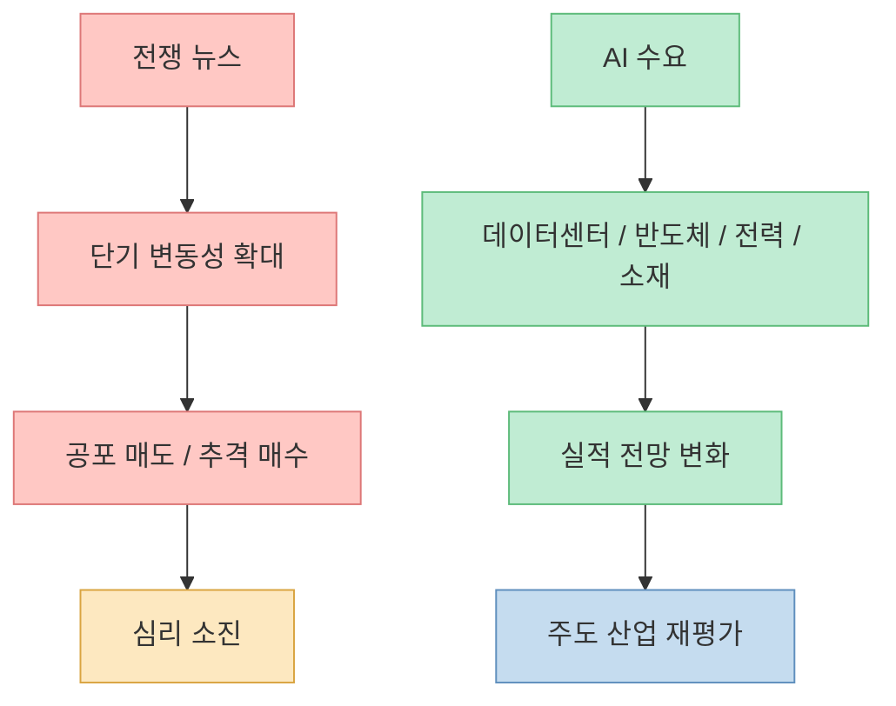
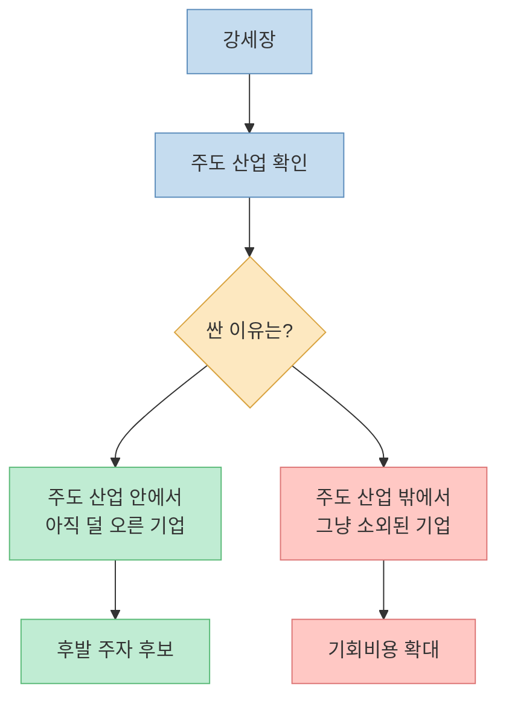
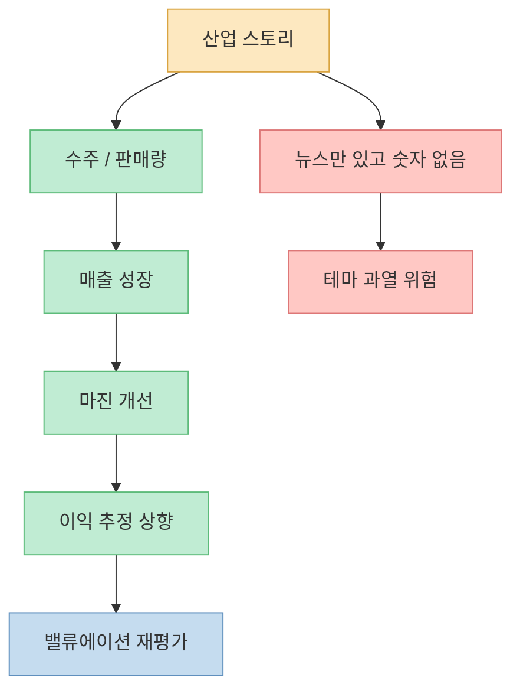
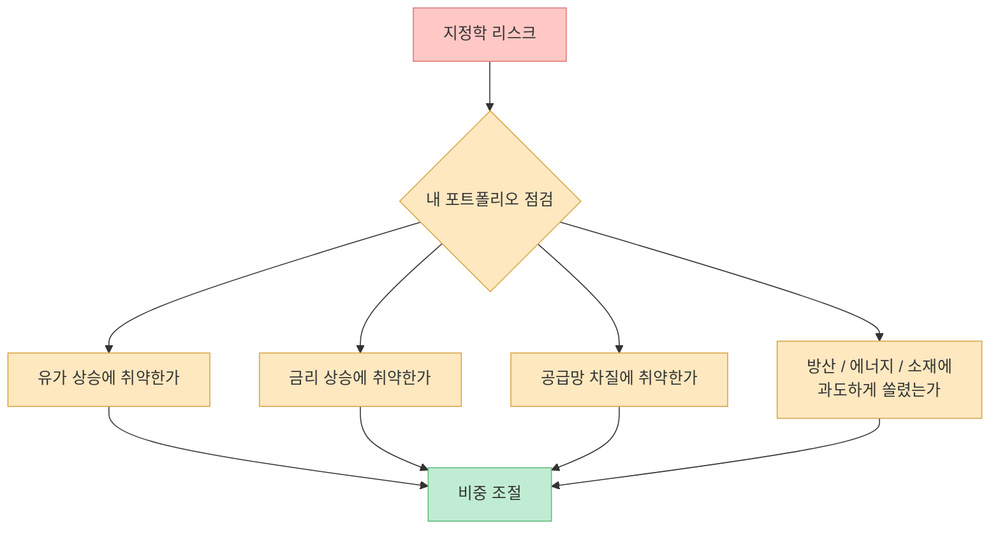
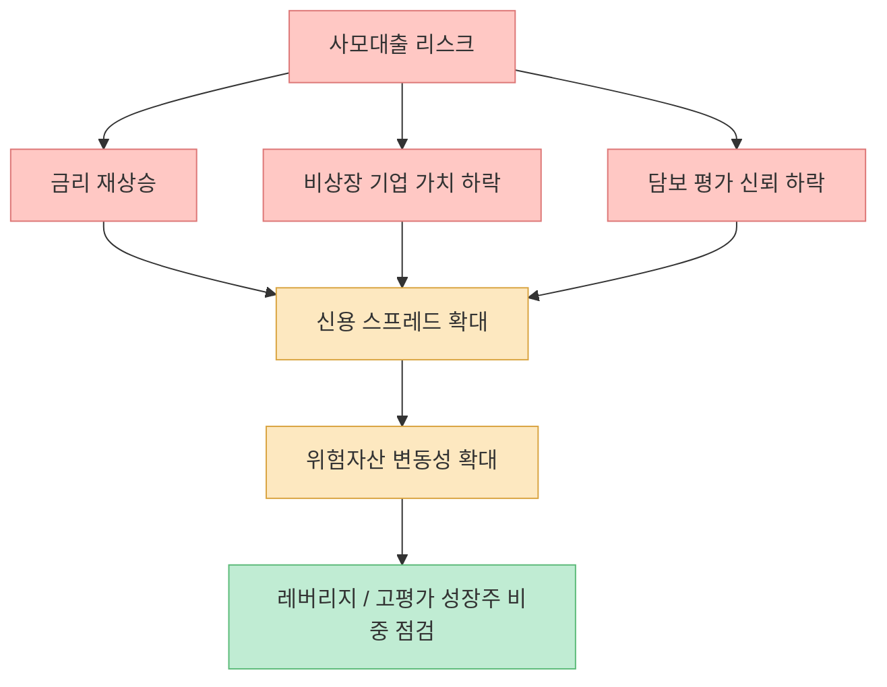
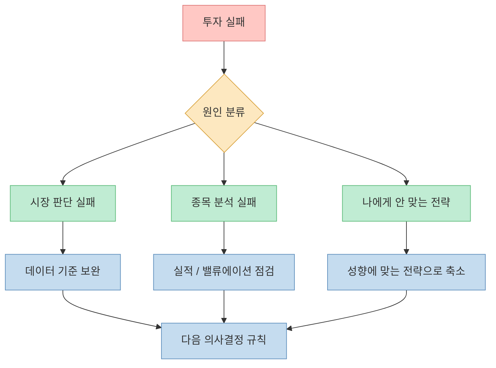

전쟁 뉴스가 나오면 시장은 흔들립니다. 하지만 영상의 핵심은 반대입니다. **전쟁 자체보다 더 오래 가는 변수는 “무엇이 이번 강세장의 주도 산업인가”** 입니다. 이선엽 대표는 지정학 리스크에 매일 반응하기보다, AI가 만드는 수요와 그 수요를 실적으로 바꾸는 산업을 먼저 보라고 말합니다. 동시에 강세장일수록 개인 투자자가 가장 많이 틀리는 지점도 짚습니다. “비싸 보여서 못 사고, 싸 보여서 엉뚱한 종목을 산다”는 것입니다.

<!--more-->

## Sources

- [지금이 가장 저렴하다 전쟁 직후 의외로 수혜 볼 국내 주식ㅣ지식인초대석 EP.123](https://youtu.be/lm2URqHD1nY)
- [애널리스트가 닷컴 버블 때 계좌 박살나고 깨달은 1가지ㅣ지식인초대석 EP.124](https://youtu.be/8mXdNR95u9o)
- [Congress.gov — Understanding the War Powers Resolution](https://www.congress.gov/crs-product/IF13134)
- [SEC — Beginners' Guide to Asset Allocation, Diversification, and Rebalancing](https://www.sec.gov/investor/pubs/assetallocation.htm)
- [SEC — Mutual Funds and Exchange-Traded Funds: A Guide for Investors](https://www.sec.gov/about/reports-publications/investor-publications/introduction-mutual-funds)
- [FINRA — Exchange-Traded Funds and Products](https://www.finra.org/investors/investing/investment-products/exchange-traded-funds-and-products)
- [FINRA — Risk](https://www.finra.org/investors/investing/investing-basics/risk)

## 1. 전쟁 뉴스는 크지만, 시장의 본류는 따로 있다

영상 1부의 출발점은 전쟁입니다. 전쟁이 나면 시장은 처음에는 크게 흔들립니다. 특히 초보 투자자가 많고 ETF를 통한 매매가 늘어난 시장에서는 매도와 매수가 여러 종목에 동시에 퍼지면서 변동성이 커질 수 있습니다. 이 대표는 이런 현상을 “신병 교육대가 실미도처럼 된 상황”에 비유합니다. 경험 많은 투자자에게도 어려운 변수인데, 경험이 적은 투자자는 더 극단적으로 반응하기 쉽다는 뜻입니다. [영상 1부 3분 부근](https://youtu.be/lm2URqHD1nY?t=180)

하지만 그는 전쟁 변수보다 더 중요한 축을 **AI** 로 봅니다. 전쟁 뉴스를 맞히려 하다 보면 정치인의 말 한마디, 협상 뉴스, 휴전 가능성, 재확전 가능성에 계속 흔들립니다. 반면 AI는 미국 제조업, 로봇, 데이터센터, 반도체 수요와 연결되는 더 구조적인 변수입니다. [영상 1부 9분 부근](https://youtu.be/lm2URqHD1nY?t=540)

핵심은 전쟁이 중요하지 않다는 말이 아닙니다. **전쟁은 가격을 흔들지만, 주도 산업은 이익 추정치를 바꿉니다.** 주가는 결국 가격과 이익 전망의 싸움입니다. 가격만 보면 많이 오른 것처럼 보여도, 이익 전망이 더 빠르게 올라가면 “비싸다”가 아니라 “아직 싸다”는 해석이 가능해집니다.

## 2. 강세장에서 제일 위험한 착각: “싼 종목이 언젠가 따라오겠지”

2부에서 가장 중요한 메시지는 강세장의 실수입니다. 이 대표는 과거 중국 산업화 국면을 예로 듭니다. 당시 조선, 플랜트, 철강 등 주도 산업은 크게 올랐지만, 많은 투자자는 이미 많이 오른 주도주를 비싸다고 느끼고 상대적으로 안 오른 대형주를 샀습니다. 결과적으로 지수는 오르는데 내 계좌는 못 오르는 일이 생겼다는 설명입니다. [영상 2부 12분 부근](https://youtu.be/8mXdNR95u9o?t=720)

강세장에서 “싸다”는 말은 두 종류입니다.

1. **주도 테마 안에서 실적이 따라오는데 가격만 덜 오른 싸구려**
2. **주도 테마와 무관해서 그냥 소외된 싸구려**

첫 번째는 기회일 수 있습니다. 두 번째는 함정일 수 있습니다.

이 대목은 개인 투자자에게 매우 현실적입니다. 계좌에 오래 들고 있던 종목이 안 오르면, 사람은 처음에는 버팁니다. 그러다 주도주가 2배, 3배 오르면 뒤늦게 참지 못하고 갈아탑니다. 이 대표는 그때가 오히려 꼭지를 잡는 지점이 되기 쉽다고 말합니다. 그래서 한 번에 다 팔고 갈아타기 어렵다면 **10%씩 옮겨 보라** 고 제안합니다. 작은 비중으로 비교하면 심리적 저항이 줄고, 실제로 어느 쪽이 더 나은 선택인지 확인할 수 있기 때문입니다. [영상 2부 15분 부근](https://youtu.be/8mXdNR95u9o?t=900)

## 3. 한국 시장의 수혜 논리: 반도체, 방산, 조선, 광물

1부 후반은 한국 시장의 수혜 산업으로 이어집니다. 특히 AI 수요가 커지면서 메모리 반도체 가격과 이익 전망이 빠르게 변하고, 일부 기업의 실적 추정이 크게 올라간다는 관점이 나옵니다. [영상 1부 18분 부근](https://youtu.be/lm2URqHD1nY?t=1080)

또한 전쟁 이후 공급망과 안보 불확실성이 커지면 방산, 조선, 핵심 광물의 전략적 가치가 올라갈 수 있다고 봅니다. 미국만 믿기 어려워진 국가들이 대체 공급처를 찾고, 가격과 납기 경쟁력이 있는 한국 기업이 선택지를 넓힐 수 있다는 논리입니다. [영상 1부 24분 부근](https://youtu.be/lm2URqHD1nY?t=1440)

다만 이 주장은 그대로 종목 추천으로 받아들이면 위험합니다. 투자자가 확인해야 할 것은 “좋은 이야기”가 아니라 다음 세 가지입니다.

- 실제 수주와 매출로 이어지는가
- 이익률이 개선되는가
- 이미 가격에 과도하게 반영되지는 않았는가

## 4. 전쟁의 60일, 시장의 시간표, 그리고 투자자의 오해

영상에서는 미국의 군사 행동이 장기화되기 어렵다는 논리 중 하나로 미국 전쟁권한 구조를 언급합니다. Congress.gov의 CRS 자료도 전쟁권한결의와 관련해, 의회의 선전포고·구체적 승인·기간 연장 등이 없으면 일정 기간 이후 무력 사용 종료 문제가 발생한다고 설명합니다. [Congress.gov 자료](https://www.congress.gov/crs-product/IF13134)

하지만 법적 시간표가 곧 시장 시간표는 아닙니다. 시장은 법 조항보다 먼저 움직이고, 때로는 법적 결론이 나기 전에 이미 다음 변수를 가격에 반영합니다. 그래서 투자자가 해야 할 일은 “며칠 뒤 전쟁이 끝난다”를 맞히는 것이 아니라, 전쟁이 길어질 때와 짧게 끝날 때 각각 어떤 포지션이 취약한지 점검하는 것입니다.

## 5. ETF는 쉬운 상품이지만, 쉬운 운용은 아니다

ETF는 초보 투자자에게 좋은 도구가 될 수 있습니다. SEC는 ETF와 뮤추얼펀드가 개별 종목을 직접 많이 사는 것보다 분산을 쉽게 만들 수 있다고 설명합니다. 하지만 동시에 펀드가 특정 산업에 집중하면 그 자체로 위험이 남습니다. [SEC ETF 안내](https://www.sec.gov/about/reports-publications/investor-publications/introduction-mutual-funds)

이 대표의 지적은 조금 다릅니다. 과거 펀드매니저에게 맡겼던 운용 판단이 ETF에서는 개인에게 넘어온다는 것입니다. 상품은 분산되어 있어도, 개인이 공포에 팔고 과열에 사면 결과는 개별 종목 투자와 크게 다르지 않을 수 있습니다. [영상 2부 18분 부근](https://youtu.be/8mXdNR95u9o?t=1080)

FINRA도 ETF·ETP가 거래소에서 주식처럼 사고팔 수 있는 투자수단이라고 설명합니다. 즉 ETF의 장점은 접근성과 분산이지만, **언제 사고팔지의 문제는 여전히 투자자에게 남습니다.** [FINRA ETF 안내](https://www.finra.org/investors/investing/investment-products/exchange-traded-funds-and-products)

ETF를 쓴다면 질문은 단순해야 합니다.

- 이 ETF가 담고 있는 산업을 이해하는가
- 하락했을 때 추가 매수할 기준이 있는가
- 은퇴자금처럼 안정성이 중요한 돈인가, 장기 성장 자금인가
- 단기 뉴스에 따라 전량 매도할 가능성이 높은가

SEC의 자산배분 안내도 비슷한 결론을 줍니다. 적절한 자산배분은 투자 기간과 위험 감내도에 따라 달라지며, 분산은 손실 가능성을 없애지는 않지만 특정 투자 실패의 충격을 줄이는 데 도움이 됩니다. [SEC 자산배분 안내](https://www.sec.gov/investor/pubs/assetallocation.htm)

## 6. 사모대출 리스크: “당장 터진다”보다 “무엇이 방아쇠인가”가 중요하다

2부 초반에는 사모대출 리스크가 나옵니다. 비상장 기업, 특히 소프트웨어 기업에 대한 대출이 늘었고, 담보 가치와 자체 평가의 신뢰성 문제가 불거질 수 있다는 설명입니다. [영상 2부 6분 부근](https://youtu.be/8mXdNR95u9o?t=360)

여기서 중요한 방아쇠는 금리입니다. 금리가 내려갈 것이라는 기대가 흔들리고, 오히려 경제·고용·증시가 강해서 금리 인하가 지연되거나 시장금리가 오르면 대출 구조가 취약해질 수 있습니다. [영상 2부 9분 부근](https://youtu.be/8mXdNR95u9o?t=540)

개인 투자자는 사모대출 시장을 직접 분석하기 어렵습니다. 대신 다음 신호를 체크하면 됩니다.

FINRA는 투자 위험을 관리하는 기본 도구로 자산배분과 분산을 설명합니다. 시스템 리스크를 없앨 수는 없지만, 한 방향으로 과도하게 쏠린 포트폴리오는 작은 충격에도 크게 흔들릴 수 있습니다. [FINRA Risk](https://www.finra.org/investors/investing/investing-basics/risk)

## 7. 실패했을 때 고쳐야 할 것은 “성격”이 아니라 “전략의 부적합”

2부의 마지막 조언은 투자 실패를 다루는 법입니다. 이 대표는 실패했을 때 남의 말을 너무 많이 들었는지, 나에게 맞지 않는 방식을 따라 했는지 먼저 보라고 말합니다. 공격적인 성향의 사람은 공격적인 방식에서 원칙을 세워야 하고, 방어적인 성향의 사람은 방어적인 방식에서 수익 구조를 만들어야 합니다. [영상 2부 21분 부근](https://youtu.be/8mXdNR95u9o?t=1260)

이 말은 단순하지만 중요합니다. 투자에서 모든 사람이 같은 전략을 쓸 수 없습니다.

남의 성공담은 참고자료일 뿐입니다. 내 자금의 성격, 감당 가능한 손실, 투자 기간, 정보 처리 능력, 심리적 안정성이 다르면 같은 전략도 전혀 다른 결과를 냅니다.

## 개인 투자자를 위한 실행 체크리스트

이 두 영상을 하나의 투자 프로세스로 바꾸면 다음과 같습니다.

1. **뉴스와 주도 산업을 분리한다.** 전쟁·정치 뉴스는 단기 변동성, AI·반도체·방산·조선 같은 산업 변화는 이익 전망의 문제로 본다.
2. **강세장에서는 “싼 종목”보다 “주도 산업 안의 실적”을 먼저 본다.**
3. **갈아타기는 한 번에 하지 않는다.** 확신이 낮으면 10%씩 옮겨 실제 성과와 심리 부담을 비교한다.
4. **ETF도 운용 기준이 필요하다.** 상품은 분산되어 있어도 매매 버튼은 내가 누른다.
5. **금리와 신용 리스크를 무시하지 않는다.** 사모대출 같은 위험은 “당장 붕괴”보다 “금리 재상승이 방아쇠가 되는지”를 본다.
6. **실패 후에는 성향을 고치려 하지 말고 전략을 맞춘다.** 공격형이면 공격형의 리스크 관리, 방어형이면 방어형의 수익 구조가 필요하다.

## 결론: 강세장의 핵심은 예측이 아니라 위치 선정이다

전쟁이 언제 끝날지, 정치인이 내일 무슨 말을 할지, 금리가 정확히 몇 월에 내려갈지는 맞히기 어렵습니다. 하지만 지금 시장에서 무엇이 이익 전망을 바꾸고 있는지, 내 포트폴리오가 그 흐름 안에 있는지, 내가 감당 가능한 방식으로 투자하고 있는지는 점검할 수 있습니다.

이 두 영상의 메시지를 한 문장으로 줄이면 이렇습니다.

**강세장에서는 뉴스를 맞히는 사람보다, 주도 산업 안에서 오래 버틸 수 있는 사람이 유리하다.**
