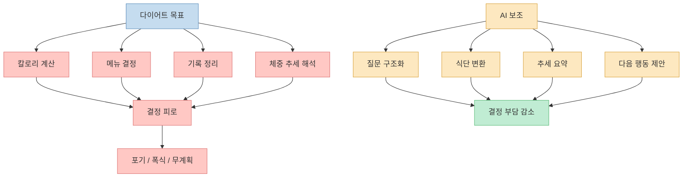
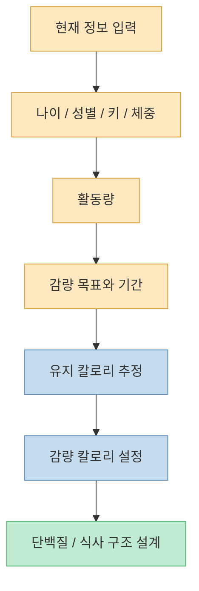
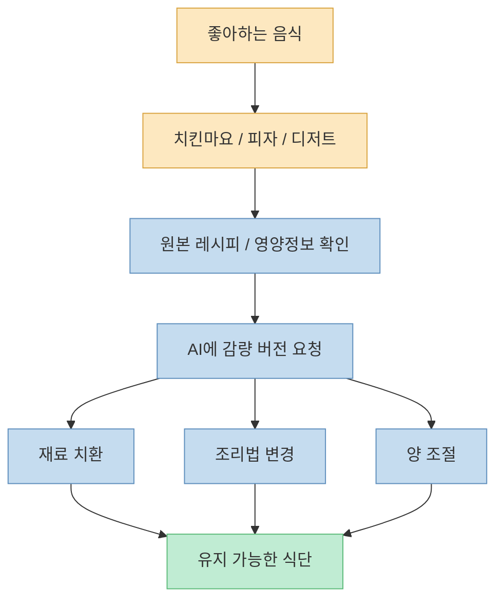
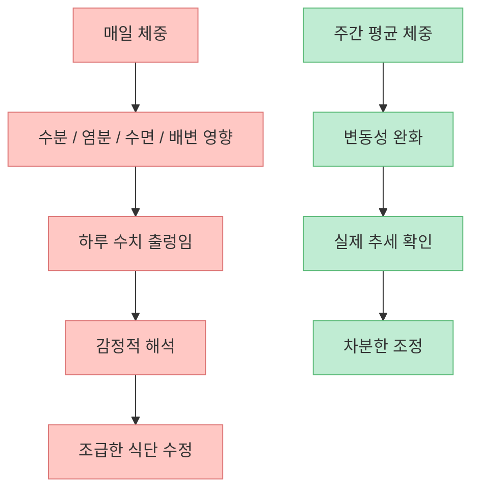
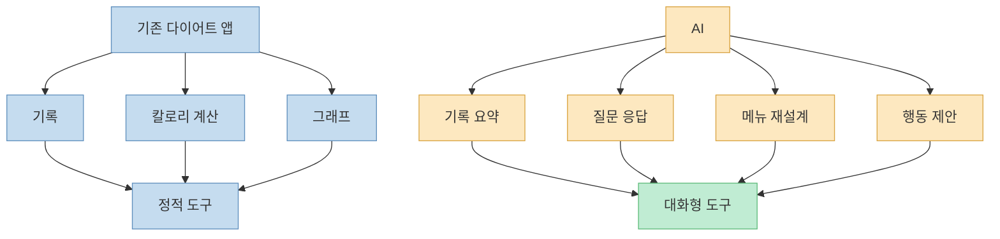
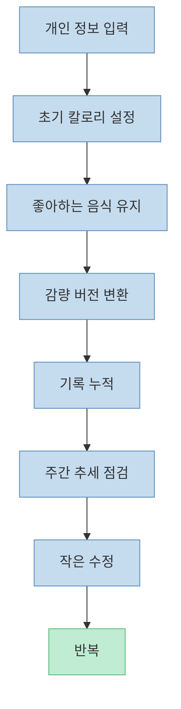

이 영상의 핵심은 “AI가 체중을 대신 빼 준다”가 아닙니다. 핵심은 **다이어트를 망치는 반복 의사결정을 AI가 줄여 준다** 는 데 있습니다. 무엇을 먹을지, 오늘 얼마나 먹어도 되는지, 좋아하는 음식을 어떻게 감량 버전으로 바꿀지, 지금 감량 속도가 맞는지 같은 결정을 자동화하면 다이어트 난이도는 확실히 내려갑니다.

<!--more-->

## Sources

- [GPT가 시킨대로 했더니 50kg 빠졌습니다](https://youtu.be/mlML_fCHo6A)
- [NIDDK — Body Weight Planner](https://www.niddk.nih.gov/health-information/weight-management/body-weight-planner?dkrd=bwplanner.niddk.nih.gov)
- [CDC — Steps for Losing Weight](https://www.cdc.gov/healthy-weight-growth/losing-weight/index.html)
- [CDC — Physical Activity and Your Weight and Health](https://www.cdc.gov/healthy-weight-growth/physical-activity/index.html)
- [NHLBI — Overweight and Obesity: Management](https://www.nhlbi.nih.gov/health/overweight-and-obesity/management)

## 1. 다이어트가 어려운 이유는 의지 부족보다 결정 피로다

영상은 “칼로리 계산, 메뉴 선택, 폭식 관리까지 AI가 대신해 준다”는 메시지로 시작합니다. 발표자는 자신이 ChatGPT를 활용해 큰 폭의 체중 감량을 했고 유지 중이라고 말합니다. 다만 이 수치는 개인 경험이므로 일반화하면 안 됩니다. 우리가 가져와야 할 핵심은 **감량 수치가 아니라 의사결정 구조** 입니다. [영상 0초 부근](https://youtu.be/mlML_fCHo6A?t=0)

다이어트는 생각보다 정보 부족보다 결정 피로 때문에 무너집니다.

- 오늘 몇 칼로리를 먹어야 하지?
- 단백질은 얼마나 챙겨야 하지?
- 치킨이 먹고 싶은데 참아야 하나?
- 오늘 많이 먹었는데 망한 건가?
- 일주일 평균 체중이 이 정도면 잘 가는 건가?

이 질문을 매일 혼자 처리하면 피로가 쌓입니다. AI는 여기서 코치가 아니라 **결정 보조 시스템** 으로 작동할 수 있습니다.

## 2. AI의 첫 역할: 내 유지 칼로리와 감량 칼로리를 추정하는 것

영상은 나이, 성별, 키, 몸무게, 활동량, 목표 체지방 감량량을 입력해서 루틴을 받는 예시를 보여 줍니다. 이때 핵심은 “정답 숫자”가 아니라 **현재 상황에 맞는 출발점** 을 만드는 것입니다. [영상 0초 부근](https://youtu.be/mlML_fCHo6A?t=0)

NIDDK의 Body Weight Planner도 비슷한 철학을 갖고 있습니다. 현재 체중, 활동량, 목표 체중, 기간 등을 넣어 체중 변화 계획을 잡을 수 있게 해 줍니다. [NIDDK](https://www.niddk.nih.gov/health-information/weight-management/body-weight-planner?dkrd=bwplanner.niddk.nih.gov)

CDC도 체중 감량은 결국 식사와 활동을 함께 조정해 **칼로리 적자** 를 만드는 과정이라고 설명합니다. [CDC 신체활동과 체중](https://www.cdc.gov/healthy-weight-growth/physical-activity/index.html)

여기서 중요한 주의점도 있습니다. AI가 계산한 수치는 의료기기 결과가 아닙니다. 출발점으로는 유용하지만, 실제 체중 변화 속도와 허기, 컨디션, 수면, 운동 수행 능력을 보며 조정해야 합니다. NHLBI도 장기적인 체중 관리는 실행 가능한 목표와 지속 가능한 생활습관 변화가 중요하다고 설명합니다. [NHLBI](https://www.nhlbi.nih.gov/health/overweight-and-obesity/management)

## 3. 진짜 강점은 “좋아하는 음식 끊기”를 “좋아하는 음식 변환하기”로 바꾸는 것

영상에서 가장 실용적인 포인트는 치킨, 피자, 디저트를 아예 끊지 않아도 된다는 부분입니다. 발표자는 자신이 좋아하는 메뉴를 고르고, 레시피나 메뉴 정보를 찾아 AI에게 “감량 버전으로 바꿔 달라”고 요청했다고 설명합니다. [영상 0분 50초 부근](https://youtu.be/mlML_fCHo6A?t=50)

이 발상이 중요한 이유는 많은 다이어트가 **금지 중심** 으로 설계되기 때문입니다. 닭가슴살, 샐러드, 무맛 식단만 반복하면 초반 순응은 가능해도 오래 가기 어렵습니다. 반대로 익숙한 음식을 더 낮은 칼로리와 더 높은 포만감 구조로 바꾸면 지속성이 올라갑니다.

예를 들어 AI에게 이런 식으로 시킬 수 있습니다.

- 이 메뉴를 700kcal 이하로 바꿔줘
- 단백질은 40g 이상 유지해줘
- 조리 시간은 15분 이하로 해줘
- 편의점 재료로도 가능하게 바꿔줘
- 배달 메뉴를 시킬 때 옵션 선택까지 추천해줘

이렇게 하면 다이어트가 “참는 프로젝트”가 아니라 “설계 프로젝트”가 됩니다.

## 4. 체중보다 중요한 것은 주간 평균과 추세 해석이다

영상 후반의 중요한 팁은 주간 평균 체중과 하루 평균 섭취 칼로리를 AI에게 보여 주고, “내가 제대로 가고 있나요?”라고 묻는 방식입니다. [영상 3분 부근](https://youtu.be/mlML_fCHo6A?t=180)

이건 매우 좋은 접근입니다. 체중은 하루 단위로 수분, 염분, 배변, 생리주기, 수면에 따라 흔들립니다. 하루 체중만 보고 망했다고 판단하면 불필요한 폭식이나 극단적 제한으로 이어질 수 있습니다.

CDC도 감량은 단기 숫자보다 지속 가능한 습관과 점진적 변화가 중요하다고 설명합니다. [CDC 체중 감량 단계](https://www.cdc.gov/healthy-weight-growth/losing-weight/index.html)

AI는 여기서 숫자를 대신 느끼게 해 주는 장치가 아니라, **숫자를 더 차분하게 읽게 해 주는 장치** 입니다. 예를 들어 “최근 2주간 평균 체중 감소폭이 줄었는데, 활동량 감소 때문인지 섭취 칼로리 증가 때문인지 추정해줘”처럼 물을 수 있습니다.

## 5. AI는 식단 앱을 대체하기보다 ‘코치처럼 질문을 받는 인터페이스’에 가깝다

영상은 PT, 식단 앱, 칼로리 앱이 필요 없다고 강하게 말하지만, 실제로는 그렇게 단정할 필요는 없습니다. 더 정확한 표현은 이렇습니다.

**AI는 기존 앱의 기능 일부를 대체할 수 있지만, 가장 강한 장점은 질문을 받을 수 있다는 점** 입니다.

일반 앱은 보통 기록과 계산은 잘합니다. 하지만 사용자가 이렇게 묻기는 어렵습니다.

- 오늘 저녁 회식인데 내일 체중 흔들려도 망한 게 아닌 이유를 설명해줘
- 편의점 조합으로 단백질 50g 맞춰줘
- 점심을 많이 먹었는데 저녁은 어떻게 조정하면 좋을까
- 폭식 충동이 오는 패턴을 로그에서 찾아줘

그래서 좋은 조합은 “기록은 앱 또는 메모로, 해석과 전략은 AI로”입니다.

## 6. 다이어트 자동화의 핵심은 완벽함이 아니라 반복 가능성이다

영상이 유용한 이유는 복잡한 이론보다 반복 가능한 프로세스를 보여 주기 때문입니다.

1. 내 정보 입력
2. 유지·감량 칼로리 추정
3. 좋아하는 음식 선택
4. 감량 버전으로 변환
5. 체중·칼로리 평균 기록
6. AI에게 추세 점검 요청

이 흐름은 단순합니다. 하지만 단순하기 때문에 오래 갑니다.

지속 가능한 감량은 강한 의지보다 **반복 가능한 시스템** 에서 나옵니다. AI는 의지를 대신해 주지 않지만, 시스템을 만드는 데는 꽤 유능합니다.

## 핵심 요약

- 영상의 핵심은 AI가 체중을 빼 준다는 말이 아니라, 다이어트의 반복 의사결정을 자동화해 준다는 점입니다.
- AI는 개인 정보와 목표를 바탕으로 유지 칼로리, 감량 칼로리, 식사 구조의 출발점을 잡는 데 유용합니다.
- 가장 실용적인 활용은 좋아하는 음식을 끊는 대신 감량 버전으로 바꾸는 것입니다.
- 체중은 하루 수치보다 주간 평균과 추세로 봐야 하며, AI는 그 해석을 돕는 데 강합니다.
- AI의 진짜 장점은 계산 기능보다 “질문을 받을 수 있는 인터페이스”라는 점입니다.
- 좋은 다이어트 시스템은 완벽한 식단보다 반복 가능한 프로세스로 작동합니다.

## 결론

다이어트가 자꾸 실패하는 이유는 내가 나약해서가 아니라, 매일 너무 많은 결정을 혼자 처리하기 때문일 수 있습니다. 무엇을 먹을지, 얼마나 먹을지, 오늘 수치가 괜찮은지, 내일 어떻게 조정할지까지 모두 의지로 해결하려 하면 오래 가기 어렵습니다.

AI는 지방을 태워 주지 않습니다. 하지만 **헷갈림, 망설임, 결정 피로를 줄여 주는 도구** 로는 꽤 강력합니다.

잘 쓰면 다이어트는 참는 싸움이 아니라, 내가 먹고 움직이고 기록하는 방식을 조금씩 자동화하는 작업이 됩니다. 그 차이가 결국 유지 가능한 감량으로 이어집니다.
