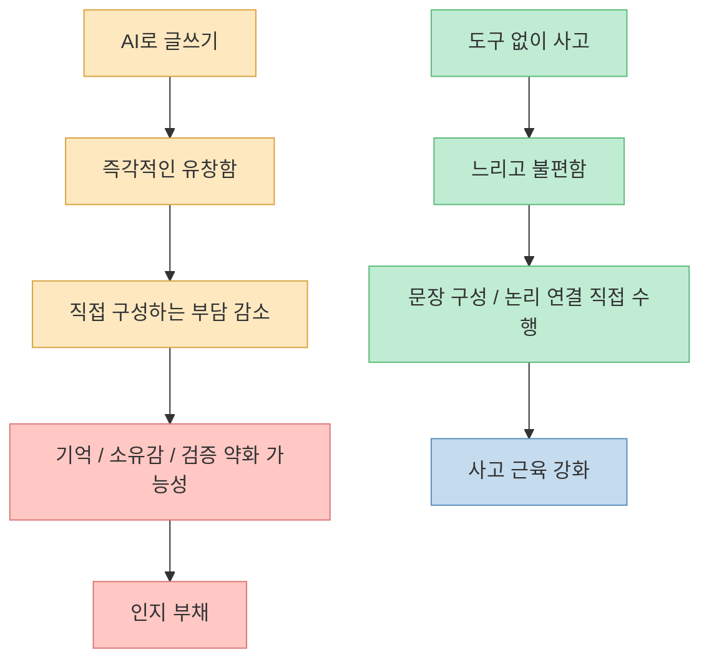
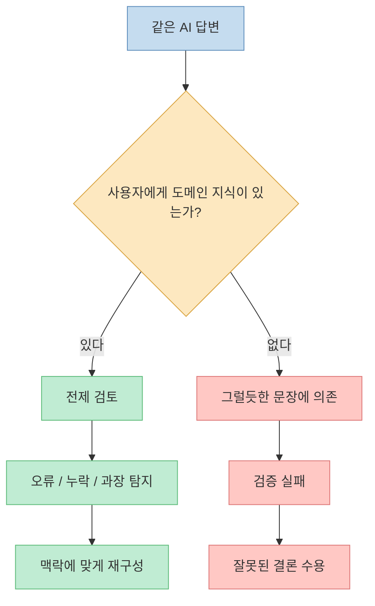
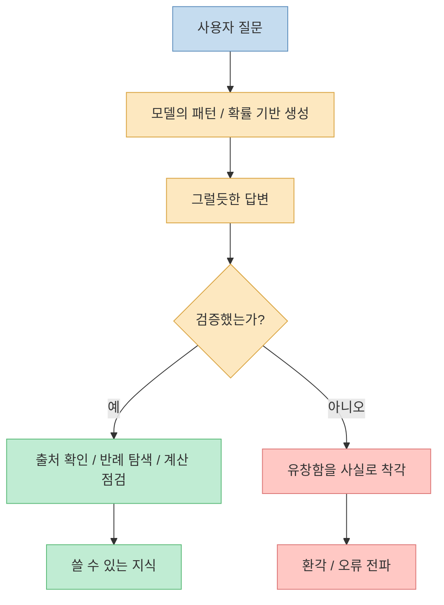
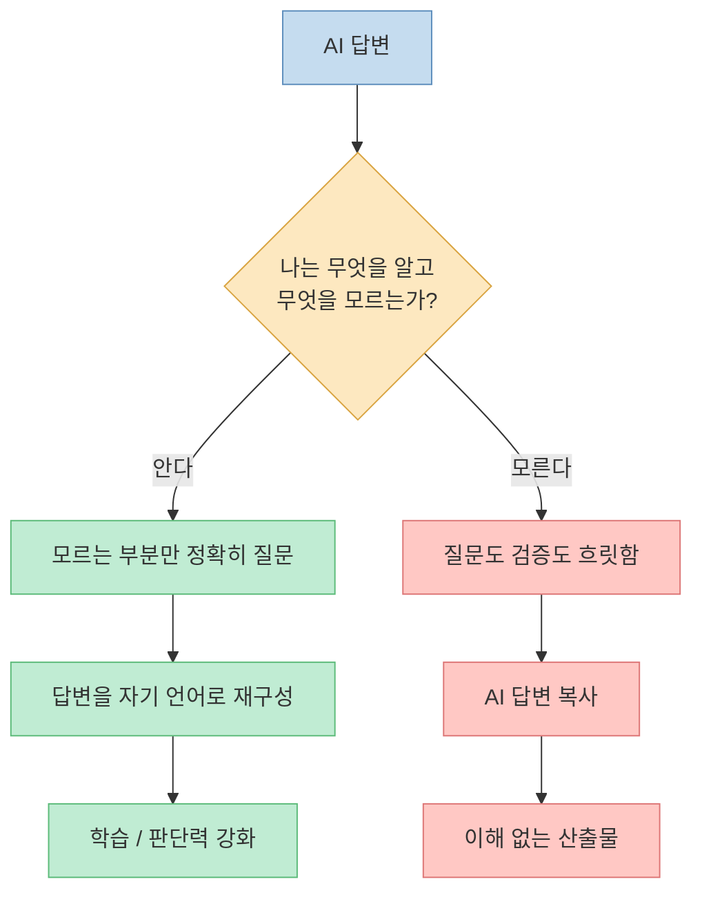
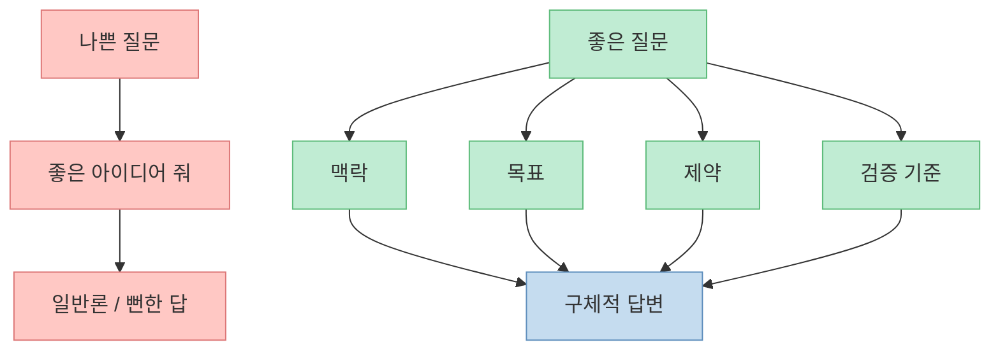
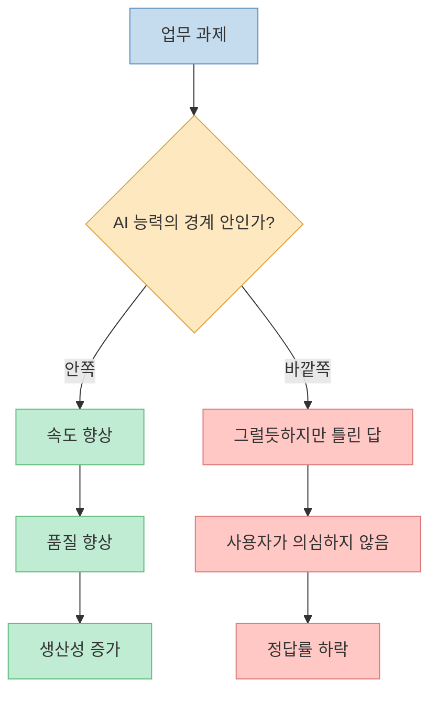
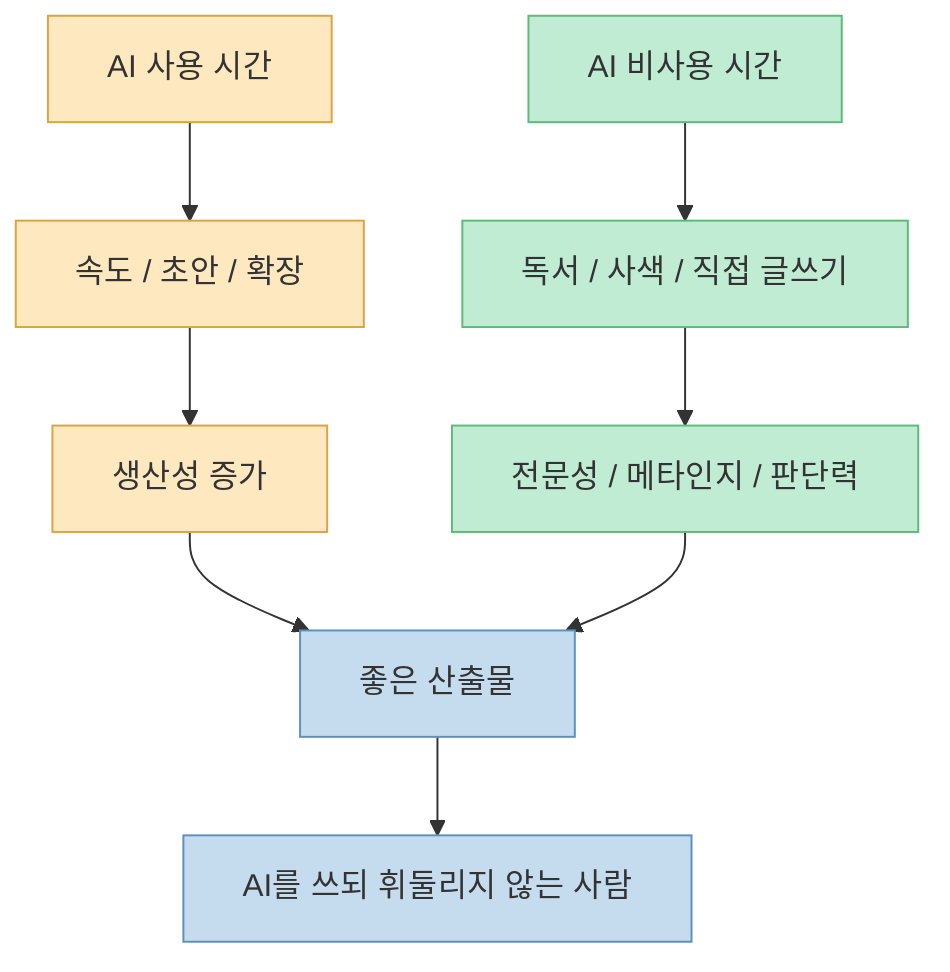

AI를 많이 쓰면 사람은 더 똑똑해질까요, 아니면 점점 생각하지 않게 될까요? 영상의 답은 단순한 찬반이 아닙니다. **AI가 지능을 올려 주는 사람도 있고, 반대로 사고 근육을 약하게 만드는 사람도 있습니다.** 차이는 도구 자체가 아니라 사용자의 전문성, 메타인지, 질문 설계, 검증 습관, 그리고 일부러 AI를 쓰지 않는 시간에 있습니다.

<!--more-->

## Sources

- [AI를 쓸수록 지능이 올라가는 사람의 특징들](https://youtu.be/9O1terlCTts)
- [MIT Media Lab — Your Brain on ChatGPT](https://www.media.mit.edu/publications/your-brain-on-chatgpt/)
- [arXiv — Your Brain on ChatGPT: Accumulation of Cognitive Debt](https://arxiv.org/abs/2506.08872)
- [Microsoft Research — The Impact of Generative AI on Critical Thinking](https://www.microsoft.com/en-us/research/publication/the-impact-of-generative-ai-on-critical-thinking-self-reported-reductions-in-cognitive-effort-and-confidence-effects-from-a-survey-of-knowledge-workers/)
- [Harvard Business School — Navigating the Jagged Technological Frontier](https://www.hbs.edu/faculty/Pages/item.aspx?num=64700)
- [Harvard D^3 — Navigating the Jagged Technological Frontier](https://d3.harvard.edu/navigating-the-jagged-technological-frontier/)

## 1. 문제는 AI 사용이 아니라 “인지 부채”다

영상은 MIT Media Lab의 글쓰기 실험으로 시작합니다. 참가자들은 ChatGPT 사용 그룹, 검색엔진 사용 그룹, 도구 없이 글을 쓰는 그룹으로 나뉘었고, 연구진은 EEG로 글쓰기 중 뇌 활동을 측정했습니다. 영상은 이 연구를 근거로 ChatGPT 그룹의 신경 연결성이 가장 약했고, 도구 없이 쓴 그룹이 가장 강했다는 점을 강조합니다. [영상 0분 부근](https://youtu.be/9O1terlCTts?t=0)

MIT Media Lab의 해당 연구는 2025년 6월 공개된 프리프린트입니다. 연구진은 54명이 초기 세션에 참여했고, 18명이 네 번째 세션까지 완료했다고 설명합니다. EEG, 자연어 처리 분석, 인간 교사와 AI 평가를 함께 사용해 LLM 보조 글쓰기의 신경·행동적 결과를 살폈습니다. 다만 아직 프리프린트이므로, “AI가 모든 사람을 멍청하게 만든다”는 식의 과잉 일반화는 피해야 합니다. [MIT Media Lab](https://www.media.mit.edu/publications/your-brain-on-chatgpt/)

여기서 중요한 표현이 **인지 부채** 입니다. AI가 대신 정리해 주는 순간에는 생산성이 올라간 것처럼 보입니다. 하지만 사용자가 내용을 자신의 언어로 다시 구성하지 않고, 논리를 검토하지 않고, 기억에도 남기지 못한다면 그 편리함은 나중에 갚아야 할 빚이 됩니다. 영상은 ChatGPT 그룹의 상당수가 자신이 방금 쓴 글의 문장을 정확히 인용하지 못했다는 점을 언급하며, 이것을 “뇌가 빚을 지는 상태”로 설명합니다. [영상 0분 부근](https://youtu.be/9O1terlCTts?t=0)

## 2. AI 시대에 전문성은 사치가 아니라 안전장치다

영상의 첫 번째 조건은 **자기 분야를 깊이 이해하는 사람** 입니다. 자기 분야를 모르면 AI가 낸 답의 한계도 보이지 않습니다. 답이 그럴듯해 보이는지, 실제 현장에서 말이 되는지, 중요한 전제를 빠뜨렸는지 판단하려면 도메인 지식이 필요합니다. [영상 3분 부근](https://youtu.be/9O1terlCTts?t=180)

AI는 “아는 사람”에게 더 강력합니다. 전문성이 있는 사람은 AI에게 초안을 맡기더라도 결과를 그대로 받아들이지 않습니다. 빠진 변수를 찾고, 전제를 바꾸고, 반례를 요구하고, 자기 분야의 맥락에 맞춰 다시 조립합니다. 반대로 전문성이 부족한 사람은 AI가 말한 내용을 검증할 기준이 없어서, 유창한 문장을 사실처럼 받아들이기 쉽습니다.

따라서 AI 시대의 전문성은 “AI가 있으니 필요 없는 것”이 아닙니다. 오히려 AI를 안전하게 쓰기 위한 최소 조건입니다. 전문성은 답을 직접 다 외우기 위한 것이 아니라, AI가 낸 답이 어느 지점에서 위험한지 감지하는 레이더 역할을 합니다.

## 3. AI 작동 원리를 모르면 마법 상자에 의존하게 된다

영상의 두 번째 조건은 **AI가 어떻게 작동하는지 원리를 이해하려는 태도** 입니다. 영상은 많은 사람이 AI를 “입력하면 답이 나오는 마법 상자”처럼 쓴다고 지적합니다. 하지만 AI는 본질적으로 다음에 올 단어를 확률적으로 예측하는 시스템입니다. 이 구조를 모르면 답이 자연스럽다는 이유만으로 참이라고 착각하기 쉽습니다. [영상 3분 부근](https://youtu.be/9O1terlCTts?t=180)

AI의 답변은 지식의 최종 판결문이 아니라, 확률적으로 그럴듯한 텍스트입니다. 물론 최신 모델은 단순 자동완성을 넘어 복잡한 추론과 도구 사용을 수행하지만, 사용자가 알아야 할 핵심은 같습니다. **유창함은 진실의 증거가 아닙니다.**

AI를 잘 쓰는 사람은 “AI가 대답했다”에서 멈추지 않습니다. “왜 이런 답을 냈는가”, “어떤 전제가 깔려 있는가”, “이 답이 틀린다면 어디가 틀릴 가능성이 큰가”를 이어서 묻습니다. 이때 AI는 정답 기계가 아니라 사고를 압축해 주는 시뮬레이터가 됩니다.

## 4. 메타인지는 AI 앞에서 무릎 꿇지 않게 하는 힘이다

영상은 Microsoft Research의 연구를 인용하며, 사람들이 AI 답변을 검증하고 개선할 능력이 부족할 때 비판적 사고를 포기한다고 설명합니다. 핵심은 “자기가 무엇을 모르는지 모르는 상태”입니다. 이 상태에서는 AI의 답을 평가할 기준이 없으므로, 결국 AI 앞에서 무릎을 꿇게 됩니다. [영상 6분 부근](https://youtu.be/9O1terlCTts?t=360)

Microsoft Research의 연구도 유사한 문제를 다룹니다. 생성형 AI를 업무에 쓰는 지식노동자들을 대상으로, AI에 대한 신뢰와 자기 신뢰가 비판적 사고와 어떤 관계를 갖는지 분석했습니다. 연구의 요지는 AI를 많이 믿을수록 인지적 노력을 줄일 수 있고, 반대로 자신의 판단 능력에 대한 신뢰가 높을수록 비판적 검토가 늘어난다는 것입니다. [Microsoft Research](https://www.microsoft.com/en-us/research/publication/the-impact-of-generative-ai-on-critical-thinking-self-reported-reductions-in-cognitive-effort-and-confidence-effects-from-a-survey-of-knowledge-workers/)

메타인지가 있는 사람은 AI에게 막연히 “좋은 글 써줘”라고 하지 않습니다. “내 논리에서 가장 약한 전제를 찾아줘”, “이 결론을 반박하는 사례를 들어줘”, “이 설명을 초등학생용이 아니라 실무자용으로 다시 구조화해줘”처럼 자신의 사고 상태를 기준으로 질문합니다. 그래서 AI가 대신 생각하게 만드는 것이 아니라, 내 사고를 더 선명하게 비추는 거울로 씁니다.

## 5. 질문 설계는 AI 시대의 핵심 문해력이다

영상의 네 번째 조건은 **질문을 정교하게 설계하는 능력** 입니다. AI 시대에는 답의 품질이 질문의 품질에 크게 좌우됩니다. 질문이 흐리면 답도 흐리고, 질문이 구조적이면 답도 구조적으로 나옵니다. [영상 6분 부근](https://youtu.be/9O1terlCTts?t=360)

좋은 질문은 보통 네 가지를 포함합니다.

1. **맥락**: 어떤 상황에서 쓰는가
2. **목표**: 무엇을 얻고 싶은가
3. **제약**: 어떤 조건을 지켜야 하는가
4. **검증 기준**: 좋은 답인지 어떻게 판단할 것인가

예를 들어 “블로그 글 써줘”보다 “30대 직장인이 AI 도구를 업무에 도입할 때 생기는 인지 부채 위험을 설명하고, MIT 연구의 한계와 실천 체크리스트를 포함해줘”가 훨씬 낫습니다. 후자는 AI가 수행해야 할 범위와 품질 기준을 동시에 제공합니다.

## 6. AI를 신뢰할수록, 나를 덜 신뢰할수록 위험해진다

영상은 Harvard Business School과 BCG의 실험을 소개합니다. 컨설턴트 758명을 대상으로 한 연구에서, AI 능력 안에 있는 과제에서는 AI 사용자가 더 빠르고 더 높은 품질의 결과를 냈습니다. 하지만 AI 능력 밖의 과제에서는 AI를 쓴 그룹의 정답률이 오히려 낮아졌습니다. 영상은 이를 “운전석에서 잠들기”에 비유합니다. [영상 9분 부근](https://youtu.be/9O1terlCTts?t=540)

Harvard Business School의 working paper도 같은 결과를 제시합니다. AI 역량의 경계 안에 있는 과제에서는 생산성과 품질이 개선되었지만, 경계 밖의 과제에서는 AI 사용자가 정답을 낼 가능성이 낮아졌습니다. 연구진은 이것을 **jagged technological frontier**, 즉 들쭉날쭉한 기술의 경계라고 설명합니다. AI가 잘하는 영역과 못하는 영역이 매끈하게 구분되지 않고, 과제마다 울퉁불퉁하게 갈린다는 뜻입니다. [Harvard Business School](https://www.hbs.edu/faculty/Pages/item.aspx?num=64700)

이 연구가 주는 실무적 교훈은 분명합니다. AI를 쓸 때 가장 먼저 해야 할 질문은 “AI가 똑똑한가?”가 아닙니다. **“이 과제가 AI의 강점 안에 있는가, 바깥에 있는가?”** 입니다. 요약, 초안, 변형, 아이디어 확장, 반복 작업에는 강할 수 있지만, 숨은 전제 판단, 윤리적 결정, 현장 맥락이 중요한 문제에서는 사용자의 개입이 더 중요합니다.

## 7. AI를 쓰지 않는 시간이 AI 사용 능력을 만든다

영상의 마지막 반전은 **AI를 쓰지 않는 시간** 입니다. MIT 실험에서 처음에 도구 없이 글을 쓰던 그룹이 나중에 ChatGPT를 사용했을 때, 오히려 더 다양한 뇌 영역이 활성화되고 더 정교한 프롬프트 전략을 썼다는 설명이 나옵니다. 영상은 여기서 “자기 머리로 사고하는 근육을 먼저 키운 사람만이 AI를 쓸 때도 내가 살아 있을 수 있다”고 정리합니다. [영상 12분 부근](https://youtu.be/9O1terlCTts?t=720)

이 부분은 AI 활용의 핵심 균형입니다. AI를 잘 쓰려면 AI를 많이 써야 합니다. 하지만 동시에 AI 없이 읽고, 쓰고, 생각하고, 대화하고, 직접 경험하는 시간도 필요합니다. AI에게 모든 사고 과정을 위임하면 산출물은 늘어날 수 있지만, 판단의 주체는 약해집니다.

영상은 “나를 키우는 일은 계속 나의 일로 남겨 두어야 한다”고 말합니다. 독서, 사색, 깊은 대화, 직접 부딪히는 경험까지 AI에게 넘기는 순간, AI는 지능 확장 도구가 아니라 사고 대체 도구가 됩니다. [영상 12분 부근](https://youtu.be/9O1terlCTts?t=720)

## 핵심 요약

- AI는 자동으로 사람을 똑똑하게 만들지 않습니다. 사용 방식에 따라 **인지 부채** 가 될 수도 있고 **사고 확장 도구** 가 될 수도 있습니다.
- MIT Media Lab의 2025년 프리프린트는 ChatGPT 보조 글쓰기에서 낮은 신경 연결성, 낮은 기억·소유감 문제를 관찰했습니다. 다만 프리프린트이므로 과잉 일반화는 피해야 합니다.
- AI를 잘 쓰는 사람은 자기 분야의 전문성이 있어 AI 답변의 한계를 봅니다.
- AI 작동 원리를 이해하면 유창한 답변을 곧바로 진실로 착각하지 않습니다.
- 메타인지가 있어야 “내가 무엇을 모르는지”를 기준으로 질문하고 검증할 수 있습니다.
- 질문 설계 능력은 AI 시대의 핵심 문해력입니다. 맥락, 목표, 제약, 검증 기준을 넣어야 답의 품질이 올라갑니다.
- Harvard/BCG 연구는 AI가 잘하는 과제에서는 성과를 올리지만, AI 능력 밖의 과제에서는 오히려 정답률을 떨어뜨릴 수 있음을 보여 줍니다.
- AI를 쓰지 않는 시간은 낭비가 아닙니다. 독서, 사색, 직접 글쓰기는 AI를 더 잘 쓰게 만드는 기초 체력입니다.

## 결론

AI 시대의 질문은 “AI를 쓸 것인가 말 것인가”가 아닙니다. 이미 AI는 쓰지 않기 어려운 도구가 되었습니다. 진짜 질문은 **AI를 내 사고의 대체물로 쓸 것인가, 내 사고를 확장하는 파트너로 쓸 것인가** 입니다.

AI를 쓸수록 똑똑해지는 사람은 AI에게 생각을 맡기지 않습니다. 먼저 자기 분야를 알고, 모르는 부분을 정확히 묻고, 답을 의심하고, 자기 언어로 다시 구성합니다. 그리고 중요한 순간에는 일부러 AI를 끄고 자기 머리로 읽고 씁니다.

결국 AI가 사람의 지능을 결정하는 것이 아닙니다. **AI 앞에서도 사고의 운전석에 남아 있는 사람이 더 똑똑해집니다.**
