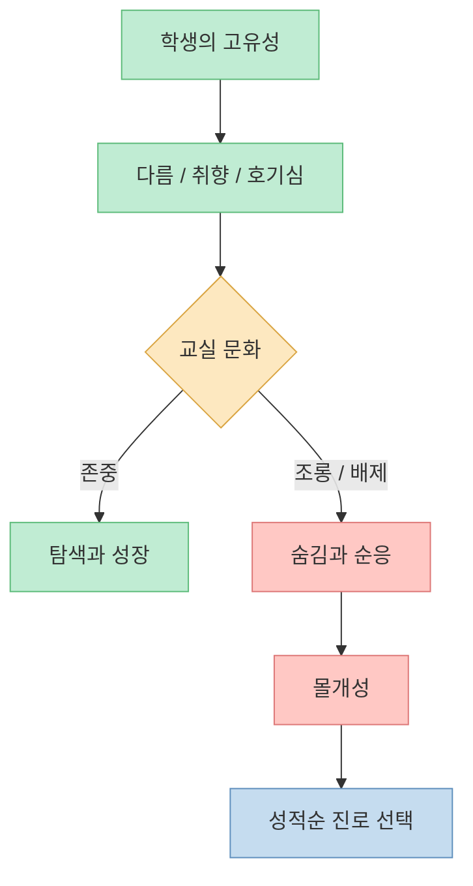
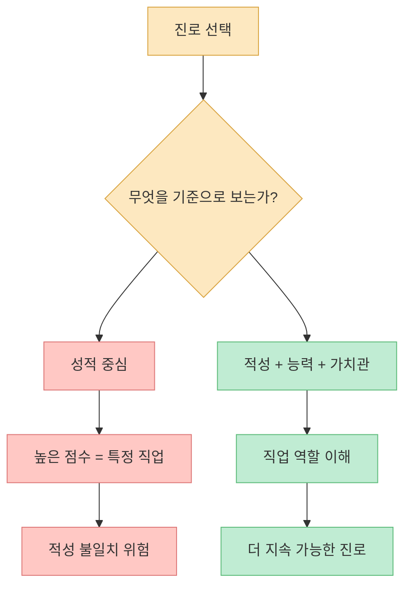
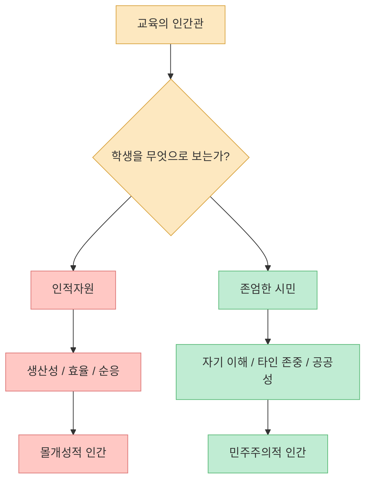
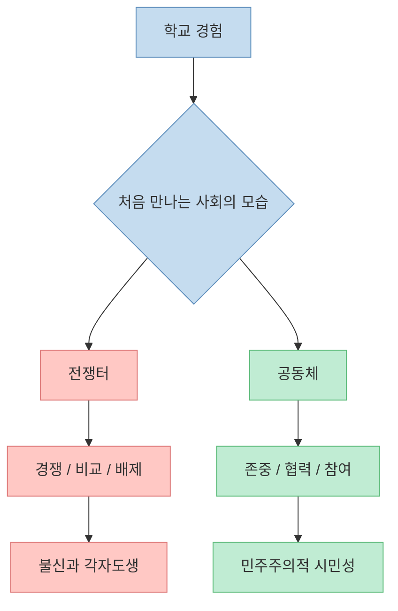
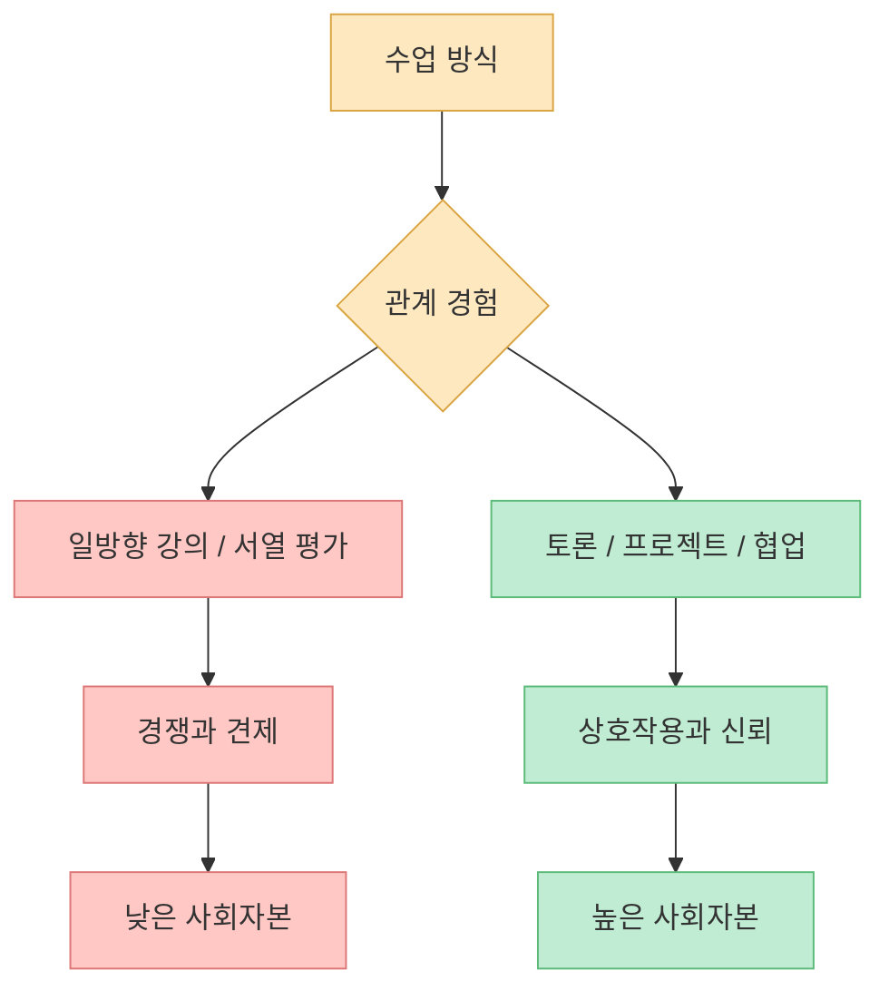
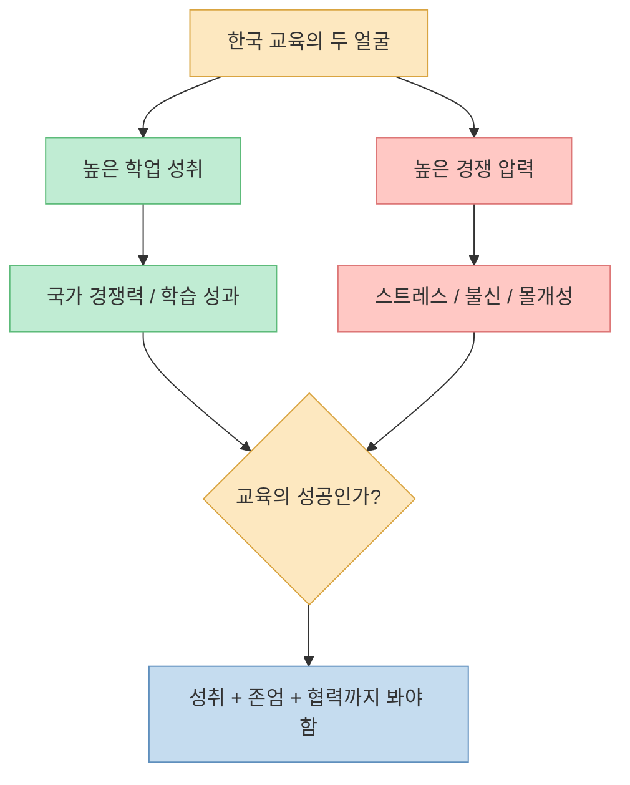
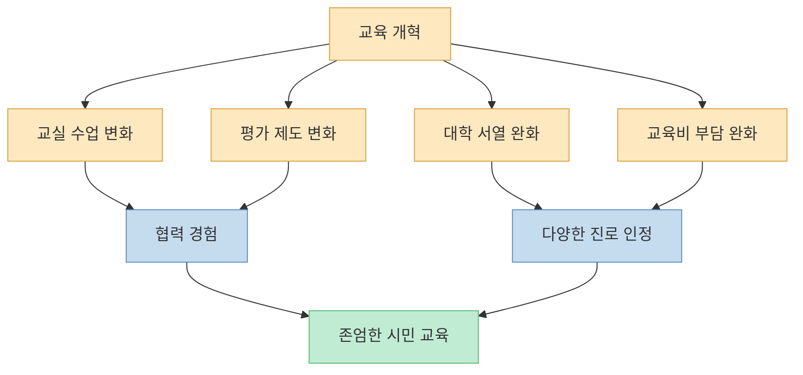

한국 교육의 가장 큰 문제는 성적이 낮다는 것이 아닙니다. 오히려 성적은 높습니다. 문제는 **학생이 어떤 사람인지, 무엇을 잘하고, 어떤 삶을 살고 싶은지 묻지 않은 채 성적순으로 인간을 배치하는 구조** 입니다. 영상의 도발적인 제목처럼, 한국 교육은 오랫동안 학생을 가르치기보다 학생을 줄 세우는 데 익숙했습니다.

<!--more-->

## Sources

- [대한민국의 교육은 학생을 가르친 적이 없다 | KBS 20230830 방송](https://youtu.be/9Sn70v3LCSo)
- [KDI FOCUS — 저신뢰 각자도생 사회의 치유를 위한 교육의 방향](https://kdi.re.kr/research/focusView?pub_no=15778)
- [OECD — PISA 2022 Results Country Note: Korea](https://www.oecd.org/en/publications/pisa-2022-results-volume-i-and-ii-country-notes_ed6fbcc5-en/korea_4e0cc43a-en.html)
- [독일 기본법 제1조 — Gesetze im Internet](https://www.gesetze-im-internet.de/gg/art_1.html)
- [국가법령정보센터 — 대한민국헌법 제10조](https://www.law.go.kr/LSW/lsLawLinkInfo.do?chrClsCd=010202&lsJoLnkSeq=900045088)
- [UNICEF Data — Republic of Korea Child-Related SDG Progress Assessment](https://data.unicef.org/sdgs/country/kor/)

## 1. 개성을 적대하는 교실

영상은 한국 사회가 개성에 적대적이라는 문제의식에서 출발합니다. 학교에서 남들과 다르게 행동하거나 새로운 것을 시도하려 하면 이상하게 보이고, 자신이 무엇을 공부하고 싶은지 말하는 것 자체가 어색해진다는 지적입니다. [영상 0분 부근](https://youtu.be/9Sn70v3LCSo?t=0)

이런 분위기에서는 학생이 자기 고유성을 발견하기 어렵습니다. 공부를 잘하는 학생도 “무엇을 좋아하는가”보다 “어디에 가야 성공인가”를 먼저 배웁니다. 성적이 적성을 압도하고, 진로는 자기 발견의 결과가 아니라 서열의 결과가 됩니다.

영상은 서울대 공대·자연대에 들어간 학생들조차 의대 진학을 위해 다시 수능을 준비하는 현실을 예로 듭니다. 이들은 훌륭한 엔지니어·과학자가 될 사람으로 인정받기보다, 스스로를 “의사가 되기에 실패한 사람”으로 규정할 수 있다는 것입니다. [영상 3분 부근](https://youtu.be/9Sn70v3LCSo?t=180)

## 2. 성적이 적성을 이기는 사회

영상의 강한 표현 중 하나는 “성적을 거꾸로 하면 적성”이라는 말입니다. 한국 교육은 적성이 성적보다 앞서는 것이 아니라, 성적이 적성을 눌러 버리는 구조라는 비판입니다. [영상 6분 부근](https://youtu.be/9Sn70v3LCSo?t=360)

의사가 되려면 지적 능력만 필요한 것이 아닙니다. 환자를 대하는 태도, 공감 능력, 소명 의식, 윤리 감각이 함께 필요합니다. 그러나 성적 중심 선발 구조에서는 “공부를 잘하니까 의대”라는 단순한 경로가 강화됩니다. 이것은 학생 개인에게도 손해이고, 사회 전체에도 손해입니다.

이 문제는 단지 개인의 진로 만족도 문제가 아닙니다. 사회가 가장 우수한 학생들을 몇 개 직업으로만 몰아넣으면 과학, 공학, 예술, 공공, 교육, 창업 등 다양한 영역의 잠재력이 줄어듭니다. 좋은 사회는 “공부 잘하는 사람은 모두 같은 길로 간다”가 아니라, **각자의 능력이 서로 다른 방식으로 존중받는 구조** 를 만들어야 합니다.

## 3. 인적자원이라는 말의 위험

영상은 “인적자원”이라는 표현도 비판합니다. 자원은 원래 써먹기 위한 대상입니다. 인간을 인적자원으로만 보면, 좋은 인간은 생산성이 높고, 지치지 않으며, 개성이 적고, 조직에 잘 맞는 사람으로 축소됩니다. [영상 12분 부근](https://youtu.be/9Sn70v3LCSo?t=720)

물론 경제와 조직 운영에서는 인적자원이라는 표현이 실무적으로 쓰입니다. 그러나 교육의 최종 목적이 “쓸 만한 자원 생산”이 되면, 학생은 존엄한 존재가 아니라 효율 좋은 부품처럼 취급됩니다.

대한민국헌법 제10조는 모든 국민이 인간으로서의 존엄과 가치를 가지며 행복을 추구할 권리가 있다고 규정합니다. 교육이 헌법적 가치와 연결된다면, 학교는 학생을 효율적인 자원으로 만드는 곳이 아니라 존엄한 시민으로 성장시키는 곳이어야 합니다. [국가법령정보센터](https://www.law.go.kr/LSW/lsLawLinkInfo.do?chrClsCd=010202&lsJoLnkSeq=900045088)

## 4. 존엄을 가르치는 교육은 무엇이 다른가

영상은 독일 기본법 제1조를 예로 들며 “인간의 존엄”을 이야기합니다. 독일 기본법 제1조는 인간의 존엄이 침해되어서는 안 되며, 이를 존중하고 보호하는 것이 모든 국가권력의 의무라고 규정합니다. [독일 기본법 제1조](https://www.gesetze-im-internet.de/gg/art_1.html)

영상에서 독일 사례가 중요한 이유는 단순히 독일을 이상화하기 위해서가 아닙니다. 핵심은 교육이 학생에게 어떤 사회를 먼저 경험하게 하느냐입니다. 학교가 경쟁과 배제의 공간이면 학생은 사회를 전쟁터로 배웁니다. 학교가 존중과 협력의 공간이면 학생은 사회를 함께 만드는 공동체로 배웁니다. [영상 15분 부근](https://youtu.be/9Sn70v3LCSo?t=900)

교육은 지식 전달만이 아닙니다. 아이가 학교에서 경험하는 관계 방식, 평가 방식, 실패를 다루는 방식, 약한 친구를 대하는 방식이 그 아이의 사회관을 만듭니다.

## 5. 학교는 유토피아를 미리 경험하는 곳이어야 한다

영상은 훔볼트의 교육 사상을 언급하며 “학교는 가장 이상적인 유토피아를 선취하는 소우주”라는 말을 소개합니다. 학생은 학교에서 가족 바깥의 첫 사회를 경험합니다. 그 첫 사회가 전쟁터라면 학생은 세상을 전쟁터로 배웁니다. 그 첫 사회가 존중의 공간이라면 학생은 더 나은 사회를 상상할 수 있습니다. [영상 21분 부근](https://youtu.be/9Sn70v3LCSo?t=1260)

KDI FOCUS 「저신뢰 각자도생 사회의 치유를 위한 교육의 방향」도 비슷한 문제를 제기합니다. 이 보고서는 한국 대학생의 81%가 고등학교를 “사활을 건 전장”에 가깝다고 생각했다고 소개합니다. 또한 일방향 주입식 수업보다 수평적·참여적 수업이 신뢰와 협력을 높이는 데 도움이 될 수 있다고 봅니다. [KDI FOCUS](https://kdi.re.kr/research/focusView?pub_no=15778)

여기서 사회자본은 신뢰, 연결망, 규범처럼 사람 사이의 관계에서 생기는 힘입니다. 학교가 협력하는 경험을 제공하지 않으면, 학생은 공동체를 배우지 못합니다. 경쟁에서 살아남는 법만 배운 학생에게 민주주의적 시민성을 기대하기는 어렵습니다.

## 6. 한국 교육의 성취와 불행을 동시에 봐야 한다

한국 교육은 성취가 낮아서 문제인 것이 아닙니다. OECD PISA 2022 한국 국가 노트는 한국 학생들이 수학·읽기·과학에서 OECD 평균보다 높은 성취를 보였다고 설명합니다. [OECD PISA Korea](https://www.oecd.org/en/publications/pisa-2022-results-volume-i-and-ii-country-notes_ed6fbcc5-en/korea_4e0cc43a-en.html)

문제는 높은 성취가 반드시 행복한 교육을 뜻하지 않는다는 점입니다. 성적은 높지만 학생이 학교를 전쟁터로 느끼고, 타인을 경쟁자로만 배우고, 자기 적성을 발견하지 못한다면 교육은 성공했다고 말하기 어렵습니다.

UNICEF의 한국 관련 아동 지표도 교육을 성적만으로 볼 수 없게 만듭니다. 아동의 삶은 학업 성취뿐 아니라 정신건강, 안전, 사회적 관계, 삶의 만족도와 함께 평가되어야 합니다. [UNICEF Data](https://data.unicef.org/sdgs/country/kor/)

## 7. 입시·대학서열·등록금: 구조를 바꾸지 않으면 교실은 바뀌기 어렵다

영상의 마지막 제안은 강합니다. 대학 입학시험을 없애고, 대학 서열 체제를 없애고, 대학 등록금을 없애야 한다는 주장입니다. 이 세 가지가 해결되어야 한국에서도 비로소 교실에서 교육이 가능해진다는 문제의식입니다. [영상 27분 부근](https://youtu.be/9Sn70v3LCSo?t=1620)

이 제안의 세부 실현 가능성은 별도 논의가 필요합니다. 하지만 핵심은 분명합니다. 교실 안에서 협력과 존엄을 말해도, 교실 밖 구조가 오직 입시·서열·비용으로 학생을 압박하면 학교는 다시 전쟁터가 됩니다.

KDI 보고서도 수업 방식의 변화와 평가 방식의 변화가 함께 필요하다고 봅니다. 프로젝트 학습, 거꾸로 교실, 팀 단위 평가, 절대평가, 학생 참여형 평가, 과정 중심 평가 같은 방식은 경쟁만이 아니라 협력과 신뢰를 배우게 하는 장치가 될 수 있습니다. [KDI FOCUS](https://kdi.re.kr/research/focusView?pub_no=15778)

## 핵심 요약

- 영상의 핵심 비판은 한국 교육이 학생의 개성과 적성을 묻기보다 성적순으로 인간을 배치해 왔다는 점입니다.
- 성적 중심 사회에서는 “무엇을 잘하고 좋아하는가”보다 “점수로 갈 수 있는 가장 높은 곳은 어디인가”가 진로를 결정합니다.
- “인적자원” 관점이 교육의 중심이 되면 학생은 존엄한 시민이 아니라 생산성 높은 자원으로 축소됩니다.
- 독일 기본법 제1조와 대한민국헌법 제10조는 모두 인간의 존엄을 중요한 가치로 둡니다. 교육도 이 가치와 연결되어야 합니다.
- KDI 보고서는 한국 대학생의 81%가 고등학교를 “사활을 건 전장”으로 인식했다고 소개하며, 수평적·참여적 수업이 사회자본을 높일 수 있다고 봅니다.
- 한국 학생들은 국제 학업 성취에서 높은 성과를 보이지만, 성취만으로 교육의 성공을 말할 수는 없습니다.
- 교실을 바꾸려면 수업 방식뿐 아니라 평가, 대학 서열, 교육비 부담 같은 구조도 함께 봐야 합니다.

## 결론

교육의 목적은 학생을 더 효율적인 부품으로 만드는 것이 아닙니다. 학생이 자신을 이해하고, 타인을 존중하고, 공동체 안에서 자유롭고 책임 있게 살아갈 수 있도록 돕는 것입니다.

한국 교육이 정말 바뀌려면 질문을 바꿔야 합니다. “누가 더 높은 점수를 받았는가?”가 아니라 **“이 학생은 어떤 사람이며, 무엇을 통해 존엄하게 성장할 수 있는가?”** 를 물어야 합니다.

학교가 전쟁터이면 아이들은 전쟁터의 시민이 됩니다. 학교가 존엄과 협력의 작은 유토피아가 될 때, 아이들은 더 나은 사회를 만들 수 있는 시민으로 자랍니다.
