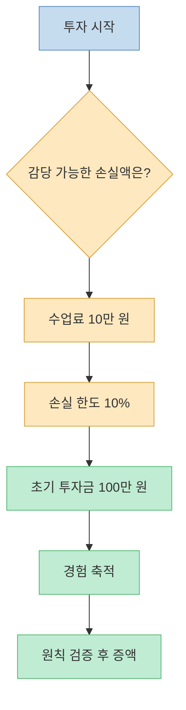
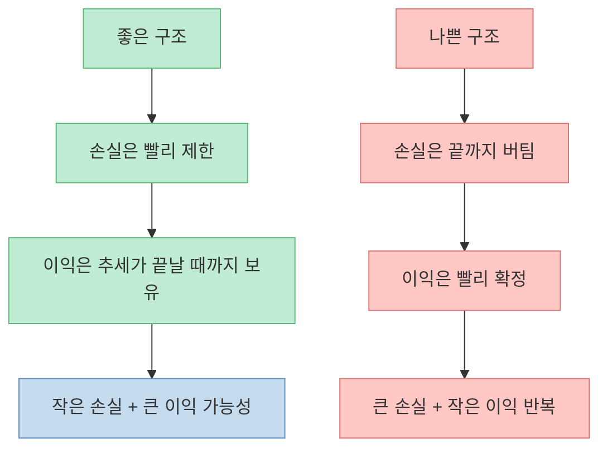
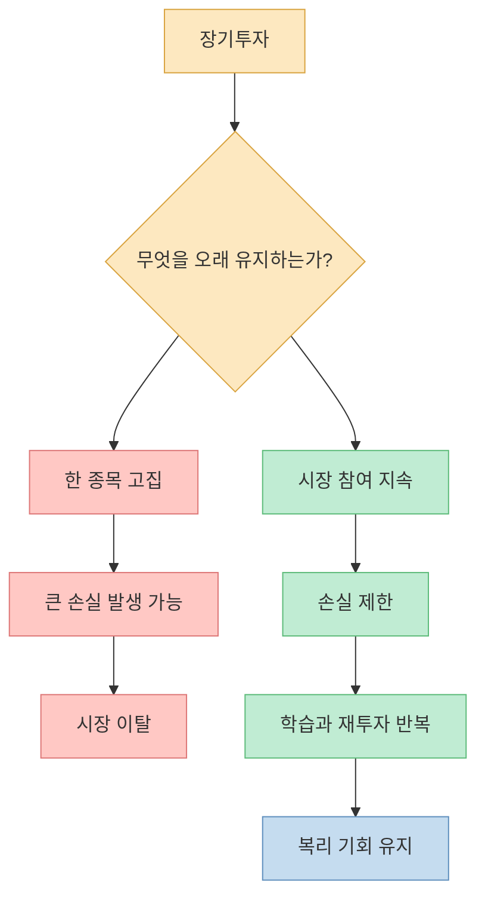
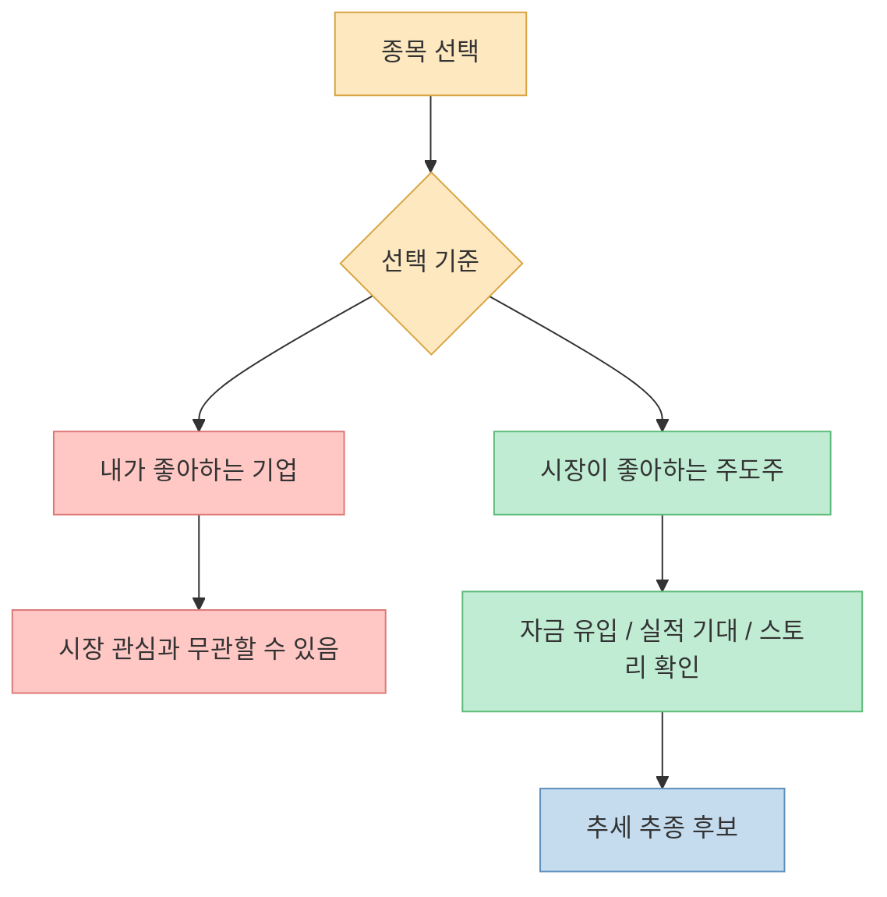
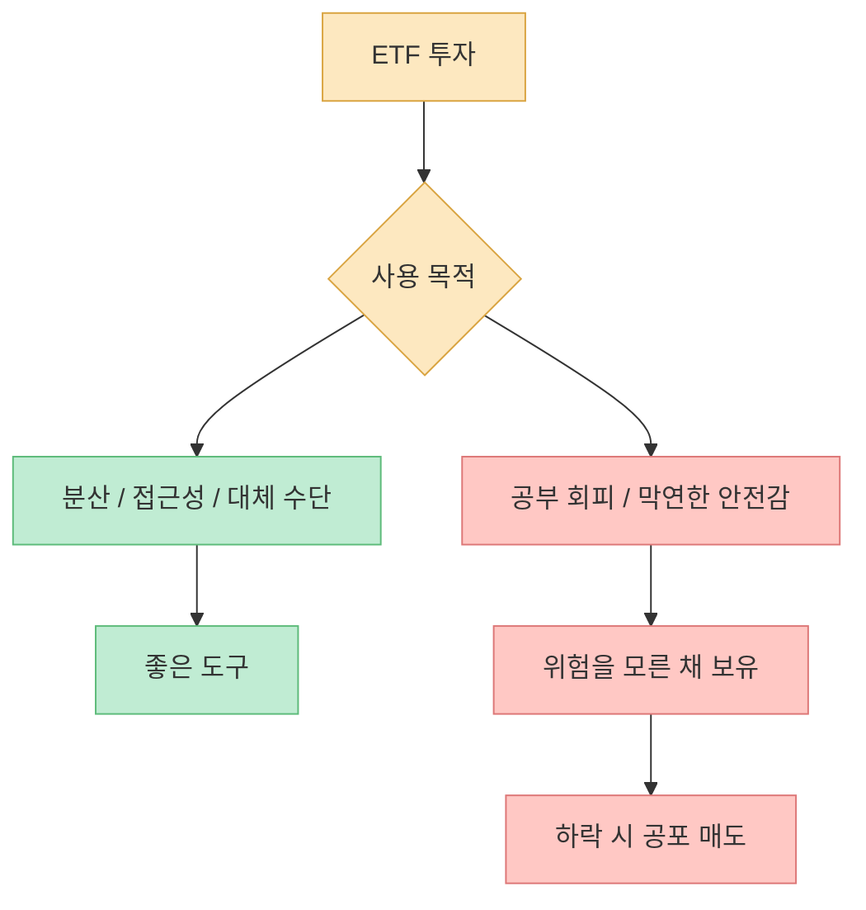
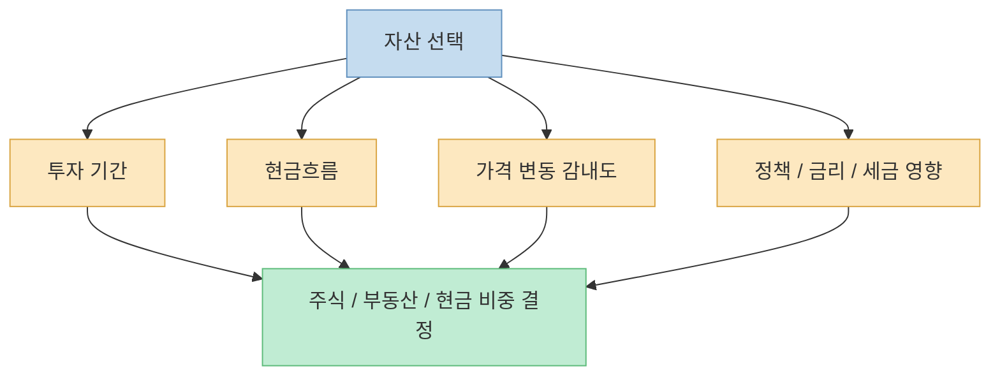
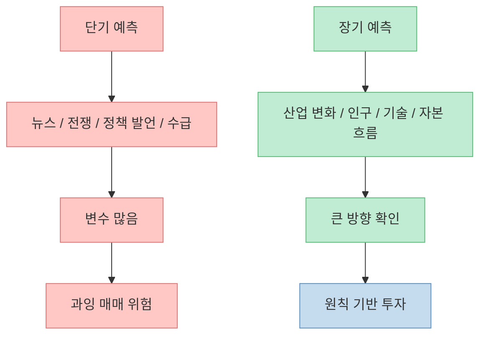

주식 투자에서 가장 흔한 질문은 “지금 들어가도 되나요?”입니다. 하지만 영상의 핵심은 질문을 바꾸라는 것입니다. **지금이 늦었는지보다 먼저 정해야 할 것은 내가 잃을 수 있는 금액, 손실을 끊는 기준, 그리고 시장에 오래 남는 방법** 입니다. 투자 수익은 한 번의 예측보다 반복 가능한 원칙에서 나옵니다.

<!--more-->

## Sources

- [진짜 돈 버는 사람들은 지금부터입니다 | 이광수 광수네복덕방 대표](https://youtu.be/FIUuEd18MU0)
- [SEC — Beginners' Guide to Asset Allocation, Diversification, and Rebalancing](https://www.sec.gov/investor/pubs/assetallocation.htm)
- [FINRA — Risk](https://www.finra.org/investors/investing/investing-basics/risk)
- [FINRA — Asset Allocation and Diversification](https://www.finra.org/investors/investing/investing-basics/asset-allocation-diversification)
- [FINRA — Investing Basics](https://www.finra.org/investors/investing/investing-basics)
- [Investor.gov — Executing an Order](https://www.investor.gov/index.php/introduction-investing/investing-basics/how-stock-markets-work/executing-order)

## 1. “지금 사도 되나요?”보다 먼저 물어야 할 질문

영상에서 가장 많이 나오는 질문은 “지금 투자해도 되나요?”입니다. 시장이 많이 오른 뒤에는 누구나 “일주일 전에 살 걸”, “어제 살 걸”, “전쟁 뉴스가 나왔을 때 살 걸”이라고 생각합니다. 하지만 이 대표는 이런 후회가 투자 판단을 흐리게 만든다고 말합니다. [영상 0분 부근](https://youtu.be/FIUuEd18MU0?t=0)

그가 제안하는 첫 단계는 시장 예측이 아니라 **예산 설정** 입니다. 특히 처음 시작하는 투자자는 “얼마를 벌 수 있을까?”보다 “얼마까지 잃어도 배울 수 있는 수업료로 받아들일 수 있을까?”를 먼저 정해야 합니다. 예를 들어 10만 원 손실을 감당할 수 있고 그것이 전체 투자금의 10%라면 100만 원으로 시작하는 식입니다. [영상 3분 부근](https://youtu.be/FIUuEd18MU0?t=180)

이 방식은 수익을 포기하자는 뜻이 아닙니다. 처음부터 너무 큰돈을 넣으면 작은 변동에도 감정이 흔들리고, 감정이 흔들리면 계획보다 빨리 사고팔게 됩니다. 투자 초반의 목표는 큰돈을 버는 것이 아니라, **내가 손실 상황에서 어떤 행동을 하는 사람인지 알아내는 것** 입니다.

## 2. 주식의 기대값은 손익 비대칭에서 나온다

영상에서 가장 중요한 수학적 설명은 손익의 비대칭입니다. 빚을 내지 않고 주식을 샀다면 손실의 최대치는 -100%입니다. 반대로 상승의 상한은 이론적으로 정해져 있지 않습니다. 그래서 이 대표는 “이익은 위가 없고, 손실은 밑이 정해져 있다”고 설명합니다. [영상 6분 부근](https://youtu.be/FIUuEd18MU0?t=360)

그런데 많은 투자자는 반대로 행동합니다. 손실이 나면 “내일은 오르겠지”라며 끝까지 버티고, 이익이 나면 불안해서 빨리 팝니다. 이러면 손실은 크게 키우고 이익은 작게 확정하는 구조가 됩니다. [영상 6분 부근](https://youtu.be/FIUuEd18MU0?t=360)

FINRA도 투자에는 여러 종류의 위험이 있으며, 자산배분과 분산이 위험 관리에 도움이 될 수 있다고 설명합니다. 손절 원칙은 분산과 함께 “한 번의 실패가 전체 계좌를 망치지 않게 하는 장치”로 볼 수 있습니다. [FINRA Risk](https://www.finra.org/investors/investing/investing-basics/risk)

## 3. 장기투자는 한 종목을 오래 들고 있는 것이 아니다

영상에서 이 대표는 장기투자를 다시 정의합니다. 장기투자는 특정 종목을 무조건 5년, 10년 들고 있는 것이 아니라 **주식시장에 오래 남아 있는 것** 입니다. 큰 손실을 내면 시장에서 퇴출되거나 심리적으로 다시 투자하지 못하게 됩니다. [영상 9분 부근](https://youtu.be/FIUuEd18MU0?t=540)

이 말은 장기투자를 포기하라는 뜻이 아닙니다. 오히려 장기투자를 하려면 손실 관리가 필요하다는 뜻입니다. 마이너스 20~30%를 버티다 마이너스 70~80%까지 커지면, 투자자는 종목이 아니라 시장 전체를 불신하게 됩니다. 그 순간 장기투자는 끝납니다.

FINRA의 투자 기본 안내도 단기적 한 방을 노리는 것보다 장기적 접근이 일반적으로 더 낫다고 설명합니다. 다만 장기투자도 “모든 종목을 영원히 보유한다”는 뜻은 아닙니다. 목표, 위험 감내도, 자산배분을 정하고 정기적으로 점검해야 합니다. [FINRA Investing Basics](https://www.finra.org/investors/investing/investing-basics)

## 4. 주식시장은 미인대회다: 내가 좋아하는 종목보다 시장이 좋아하는 종목

영상은 케인즈의 “주식 투자는 미인대회”라는 비유를 소개합니다. 미인대회에서 우승자는 내가 가장 예쁘다고 생각하는 사람이 아니라 심사위원들이 뽑는 사람입니다. 주식시장도 마찬가지로, 내가 좋아하는 종목보다 **시장 참여자들이 좋아하는 주도주** 를 봐야 한다는 설명입니다. [영상 12분 부근](https://youtu.be/FIUuEd18MU0?t=720)

많은 투자자는 주도주를 보면 “이미 너무 오른 것 아닌가?”라고 생각합니다. 하지만 영상의 논리는 다릅니다. 주식은 위가 막혀 있지 않기 때문에, 많이 올랐다는 이유만으로 반드시 끝났다고 볼 수는 없습니다. 중요한 것은 이미 오른 가격이 아니라, 시장의 돈이 왜 그 종목과 산업으로 몰리는지입니다. [영상 12분 부근](https://youtu.be/FIUuEd18MU0?t=720)

다만 주도주를 따라간다는 말은 무작정 추격 매수하라는 뜻이 아닙니다. 주도 산업의 실적, 수급, 가격 위치, 손실 제한 기준을 함께 봐야 합니다. “오르니까 산다”와 “왜 오르는지 이해하고 정해 둔 리스크 안에서 산다”는 완전히 다릅니다.

## 5. ETF는 대체 수단이지 공부를 피하는 핑계가 아니다

영상에서는 ETF에 대한 관점도 나옵니다. 특정 산업에 투자하고 싶은데 개별 종목을 고르기 어렵거나, 직접 투자할 수 없는 영역이라면 ETF가 대체 수단이 될 수 있습니다. 하지만 “잘 모르니까 ETF나 사자”는 태도로만 접근하면 투자자가 발전하지 못한다고 지적합니다. [영상 15분 부근](https://youtu.be/FIUuEd18MU0?t=900)

SEC는 자산배분과 분산이 투자 위험 관리에 도움이 된다고 설명합니다. 다양한 자산군을 섞으면 특정 자산의 부진이 전체 포트폴리오에 주는 충격을 줄일 수 있습니다. [SEC 자산배분 안내](https://www.sec.gov/investor/pubs/assetallocation.htm)

FINRA도 자산배분, 분산, 리밸런싱이 위험 관리 도구라고 설명합니다. 그러나 분산은 손실을 없애는 마법이 아닙니다. ETF도 어떤 지수나 산업을 담는지, 집중도가 어떤지, 내가 왜 사는지 알아야 합니다. [FINRA 자산배분과 분산](https://www.finra.org/investors/investing/investing-basics/asset-allocation-diversification)

ETF는 좋은 도구가 될 수 있습니다. 하지만 도구가 좋다고 운전자가 사라지는 것은 아닙니다. 어떤 ETF를 왜 샀는지, 언제 비중을 줄일지, 어떤 상황에서 추가 매수할지 기준이 있어야 합니다.

## 6. 부동산보다 주식이라는 전망도 결국 “시간축”의 문제다

영상에서는 현재 관점에서 부동산보다 주식 투자가 더 낫다는 의견도 나옵니다. 이유는 주식시장은 지속 상승 가능성이 높고, 부동산은 정책과 가격 불안정성의 영향을 받는다는 전망입니다. [영상 18분 부근](https://youtu.be/FIUuEd18MU0?t=1080)

이 부분은 특정 시점의 시장 전망이므로 그대로 일반 법칙으로 받아들이면 안 됩니다. 대신 구조적으로 배울 점은 있습니다. 자산 선택은 “좋아 보이는 자산”을 고르는 것이 아니라, **나의 시간축과 현금흐름에 맞는 자산을 고르는 것** 입니다.

집을 사야 하는 사람과 투자 수익을 노리는 사람의 기준은 다릅니다. 실거주는 거주 안정성, 대출 상환 능력, 지역 계획이 중요합니다. 투자 목적이라면 기대수익, 유동성, 세금, 정책 리스크를 봐야 합니다. 영상에서도 집값이 떨어질 때 오히려 더 사기 싫어지는 심리를 지적하며, 미리 계획을 세워야 한다고 말합니다. [영상 21분 부근](https://youtu.be/FIUuEd18MU0?t=1260)

## 7. 더 먼 미래를 볼수록 예측은 오히려 단순해진다

영상의 마지막 핵심은 예측의 시간축입니다. 이 대표는 운전 내비게이션 비유를 듭니다. 아주 짧은 거리는 작은 변수 하나로 도착 시간이 크게 흔들리지만, 장거리는 변수들이 평균화되며 큰 방향이 더 중요해집니다. 투자도 마찬가지로 단기 뉴스보다 장기 변화가 중요하다는 설명입니다. [영상 30분 부근](https://youtu.be/FIUuEd18MU0?t=1800)

이 관점은 단기 매매를 모두 부정하는 것이 아닙니다. 다만 개인 투자자가 매일 뉴스와 가격을 맞히는 게임에 들어가면 정보·속도·심리 면에서 불리합니다. 반대로 장기 변화, 산업 구조, 자금 흐름, 자신의 자산배분을 보면 의사결정이 단순해집니다.

## 핵심 요약

- “지금 사도 되나요?”보다 먼저 정해야 할 것은 **내가 감당할 수 있는 손실액** 입니다.
- 초보 투자자는 처음부터 큰돈을 넣기보다, 손실을 수업료로 받아들일 수 있는 범위에서 시작하는 편이 낫습니다.
- 손실은 -100%가 한계지만 상승은 열려 있습니다. 그래서 투자 구조는 **손실은 작게, 이익은 길게** 가 되어야 합니다.
- 장기투자는 한 종목을 무조건 오래 들고 있는 것이 아니라, 주식시장에 오래 남아 계속 투자할 수 있는 상태를 유지하는 것입니다.
- 종목 선택에서는 내가 좋아하는 기업보다 시장이 좋아하는 주도주를 봐야 합니다.
- ETF는 좋은 도구지만, 공부를 피하는 핑계가 되면 하락장에서 오래 버티기 어렵습니다.
- 주식과 부동산 선택은 전망만이 아니라 투자 기간, 현금흐름, 가격 변동 감내도, 정책·세금 리스크를 함께 봐야 합니다.
- 단기 예측보다 장기 변화에 초점을 맞출수록 투자 판단은 단순해집니다.

## 결론

주식으로 오래 돈을 버는 사람은 매번 바닥을 맞히는 사람이 아닙니다. **손실을 제한하고, 주도 흐름을 인정하고, 시장에 오래 남을 수 있는 사람** 입니다.

처음 시작한다면 질문을 바꿔야 합니다. “지금 늦었나?”가 아니라 “얼마를 잃어도 계속 배울 수 있나?”, “손실을 어디서 끊을 것인가?”, “내가 보는 종목은 시장의 주도 흐름 안에 있는가?”를 물어야 합니다.

투자는 미래를 향한 게임입니다. 더 먼 곳을 볼수록 오늘의 흔들림은 작아지고, 원칙의 중요성은 커집니다.
