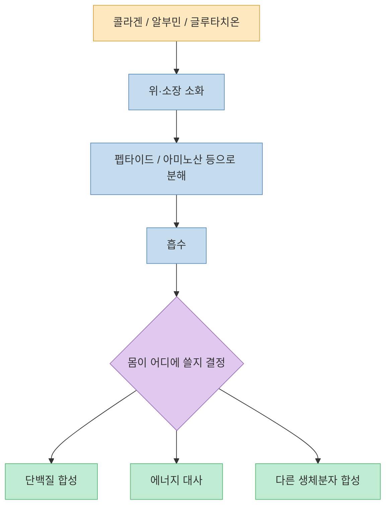
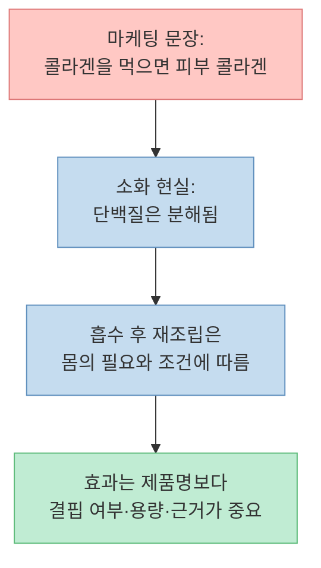
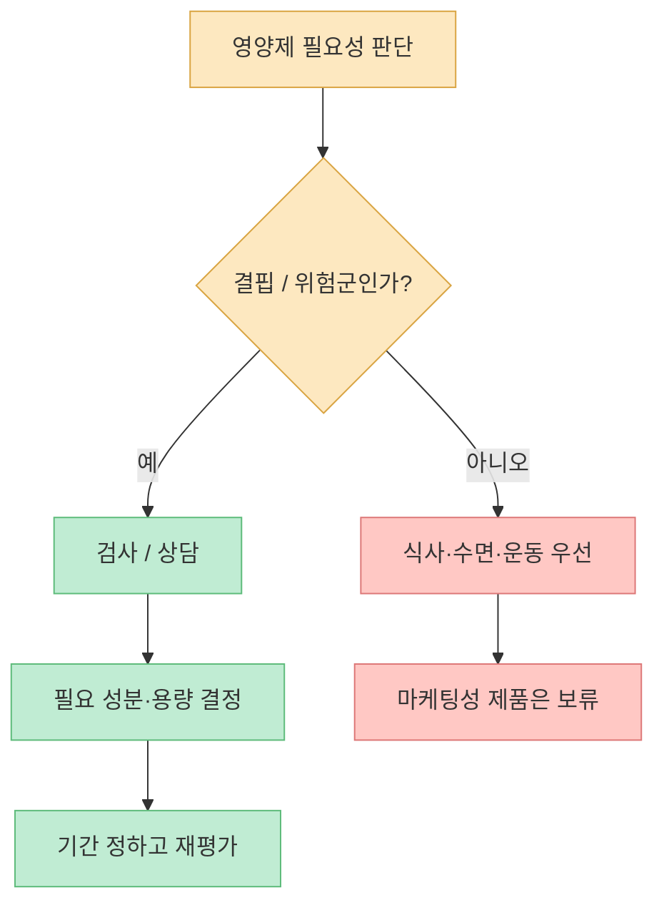
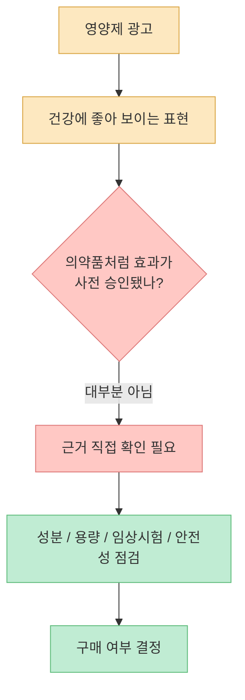
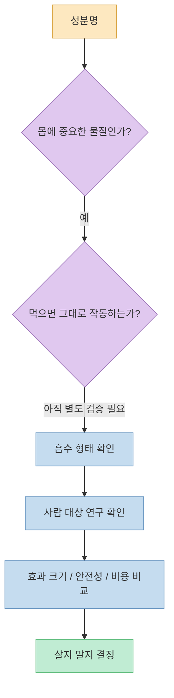

짧은 영상의 핵심은 단순합니다. **우리는 단백질 이름을 그대로 흡수하는 것이 아니라, 대부분 잘게 분해된 성분으로 흡수합니다.** 그래서 글루타치온, 알부민, 콜라겐처럼 이름이 좋아 보이는 단백질성 영양제를 먹는다고 해서 그 이름 그대로 피부·간·혈관·근육에 꽂히는 것은 아닙니다.

<!--more-->

## Sources

- [쓸모없는 영양제 #영양제추천 #건강 #건강정보 #다이어트](https://youtube.com/shorts/tKsk_IEOlV0)
- [NIDDK — Your Digestive System & How it Works](https://www.niddk.nih.gov/health-information/digestive-diseases/digestive-system-how-it-works)
- [NIH ODS — Dietary Supplements: What You Need to Know](https://ods.od.nih.gov/factsheets/WYNTK/)
- [FDA — Questions and Answers on Dietary Supplements](https://www.fda.gov/food/information-consumers-using-dietary-supplements/questions-and-answers-dietary-supplements)
- [NIH News in Health — Should You Take Dietary Supplements?](https://newsinhealth.nih.gov/2013/08/should-you-take-dietary-supplements)
- [NCBI Bookshelf — Physiology, Digestion](https://www.ncbi.nlm.nih.gov/books/NBK544242/)

## 1. 영상의 주장: 단백질 영양제는 이름 그대로 흡수되지 않는다

영상에서 질문자는 “효과가 없을 것 같은 대표적인 영양제가 무엇인가”라고 묻습니다. 답변자는 단백질성 영양제, 특히 글루타치온·알부민·콜라겐을 예로 들며, 음식은 최종적으로 작은 성분으로 분해된 뒤 흡수된다고 설명합니다. 탄수화물은 단당류로, 단백질은 아미노산으로, 지방은 지방산 등으로 분해된다는 논리입니다. [영상 0초 부근](https://youtu.be/tKsk_IEOlV0?t=0)

NIDDK도 소화 과정에서 몸이 음식과 음료를 더 작은 부분으로 분해하고, 몸은 당, 아미노산, 지방산, 글리세롤 등을 에너지·성장·회복에 사용한다고 설명합니다. 즉 “콜라겐을 먹으면 콜라겐이 그대로 피부로 간다”는 식의 직선적 이해는 소화 생리와 맞지 않습니다. [NIDDK](https://www.niddk.nih.gov/health-information/digestive-diseases/digestive-system-how-it-works)

## 2. “먹은 성분이 그대로 간다”는 착각

영양제 마케팅은 종종 성분 이름을 결과와 직접 연결합니다. 콜라겐은 피부, 글루타치온은 항산화, 알부민은 영양 상태처럼 보입니다. 문제는 **먹은 분자와 몸에서 작동하는 분자를 동일하게 보는 착각** 입니다.

소화 과정에서는 큰 단백질이 더 작은 단위로 잘립니다. NCBI Bookshelf의 소화 생리 설명도 지방, 단백질, 복합 탄수화물은 흡수 가능한 작은 단위로 분해된다고 정리합니다. [NCBI Bookshelf](https://www.ncbi.nlm.nih.gov/books/NBK544242/)

따라서 어떤 영양제를 평가할 때는 “이름이 그럴듯한가”가 아니라 다음을 봐야 합니다.

- 이 성분이 경구 섭취로 실제 혈중·조직 수준을 의미 있게 바꾸는가
- 사람 대상 임상시험에서 실제 건강 지표가 개선됐는가
- 사용된 용량과 내가 사려는 제품의 용량이 같은가
- 연구 대상이 내 상황과 비슷한가
- 부작용, 약물 상호작용, 품질 문제가 없는가

## 3. 그렇다고 모든 영양제가 쓸모없다는 뜻은 아니다

영상의 메시지를 “영양제는 전부 사기”로 받아들이면 또 다른 오류가 됩니다. NIH ODS는 영양제가 식단의 부족한 부분을 보충하는 데 도움이 될 수 있지만, 필요 이상으로 많이 먹으면 비용과 부작용 위험이 커질 수 있다고 설명합니다. [NIH ODS](https://ods.od.nih.gov/factsheets/WYNTK/)

NIH News in Health도 다양한 건강한 식품으로 필요한 영양소를 얻을 수 있지만, 일부 사람에게는 부족한 부분을 채우는 용도로 영양제가 유용할 수 있다고 설명합니다. 예를 들어 특정 결핍, 임신, 제한식, 흡수장애, 고령, 특정 약물 복용 같은 상황에서는 의학적 판단 아래 보충이 필요할 수 있습니다. [NIH News in Health](https://newsinhealth.nih.gov/2013/08/should-you-take-dietary-supplements)

핵심은 “필요한 사람에게 필요한 영양제를 필요한 용량으로”입니다. 반대로 결핍도 없고, 목표도 불분명하고, 제품의 임상 근거도 약하다면 비싼 이름값을 사는 것에 가까워질 수 있습니다.

## 4. 영양제는 의약품처럼 사전 승인되는 제품이 아니다

영양제를 고를 때 반드시 알아야 할 제도적 차이가 있습니다. FDA는 식이보충제가 의약품과 다른 규정으로 관리되며, 일반적으로 제품이 판매되기 전에 FDA가 효과와 표시를 승인하지 않는다고 설명합니다. [FDA](https://www.fda.gov/food/information-consumers-using-dietary-supplements/questions-and-answers-dietary-supplements)

NIH ODS도 보충제 라벨의 구조·기능성 문구에는 FDA가 평가하지 않았다는 고지가 붙어야 한다고 설명합니다. 이는 “판매 중인 영양제 = 효과가 입증된 치료제”가 아니라는 뜻입니다. [NIH ODS](https://ods.od.nih.gov/factsheets/WYNTK/)

그래서 영양제는 “유명한 사람이 추천했다”, “후기가 많다”, “성분명이 좋아 보인다”보다 근거 수준이 중요합니다. 특히 질환 치료, 간 기능 회복, 피부 재생, 면역 강화처럼 구체적인 건강 결과를 기대한다면 더 엄격하게 봐야 합니다.

## 5. 글루타치온·알부민·콜라겐을 볼 때의 실전 기준

영상은 세 성분을 대표 사례로 듭니다. [영상 7초 부근](https://youtu.be/tKsk_IEOlV0?t=7)

### 글루타치온

글루타치온은 몸 안에서 중요한 항산화 시스템에 관여합니다. 하지만 “중요한 물질”이라는 사실과 “먹으면 원하는 부위에서 원하는 효과가 난다”는 말은 다릅니다. 경구 섭취 제품은 형태, 용량, 연구 설계에 따라 결과가 달라질 수 있으므로, 단순히 항산화라는 단어만 보고 판단하면 안 됩니다.

### 알부민

알부민은 혈액 속 중요한 단백질이지만, 알부민 수치가 낮은 문제는 단순히 알부민을 먹는 것으로 해결되는 문제가 아닐 수 있습니다. 염증, 간·신장 문제, 영양 상태, 질병 상태 등 원인을 봐야 합니다. 알부민을 “먹어서 보충한다”는 접근은 의학적 원인 평가 없이 단순화된 해석이 될 수 있습니다.

### 콜라겐

콜라겐은 피부와 결합조직의 중요한 구성 요소입니다. 그러나 콜라겐을 먹는다고 그 콜라겐이 그대로 피부 콜라겐으로 배치되는 것은 아닙니다. 제품별로 사용된 펩타이드 형태, 용량, 연구 기간, 평가 지표가 다르기 때문에 “콜라겐”이라는 이름 하나로 효과를 단정하기 어렵습니다.

## 핵심 요약

- 영상의 핵심은 글루타치온·알부민·콜라겐 같은 단백질성 영양제가 이름 그대로 흡수되는 것이 아니라는 점입니다.
- 단백질은 소화 과정에서 주로 펩타이드와 아미노산 등 작은 단위로 분해된 뒤 흡수됩니다.
- “몸에 중요한 성분”과 “먹으면 그 성분이 원하는 부위에서 원하는 효과를 낸다”는 말은 다릅니다.
- 영양제는 의약품처럼 판매 전 효과가 승인되는 제품이 아니므로, 광고 문구보다 사람 대상 연구·용량·안전성을 봐야 합니다.
- 모든 영양제가 쓸모없다는 뜻은 아닙니다. 결핍이나 특정 상황에서는 보충제가 도움이 될 수 있지만, 그때도 검사·상담·재평가가 중요합니다.

## 결론

글루타치온, 알부민, 콜라겐이라는 이름은 건강해 보입니다. 하지만 몸은 제품명을 읽고 흡수하지 않습니다. 몸은 소화하고, 분해하고, 필요한 곳에 다시 배분합니다.

따라서 영양제를 고를 때 가장 중요한 질문은 “이 성분이 좋아 보이는가?”가 아닙니다. **“내게 필요한가, 먹어서 실제로 달라지는가, 그 근거가 사람 대상 연구로 확인됐는가?”** 입니다.

이 질문에 답하지 못하는 영양제라면, 먼저 식사·수면·운동·검사부터 점검하는 편이 더 안전하고 경제적입니다.
