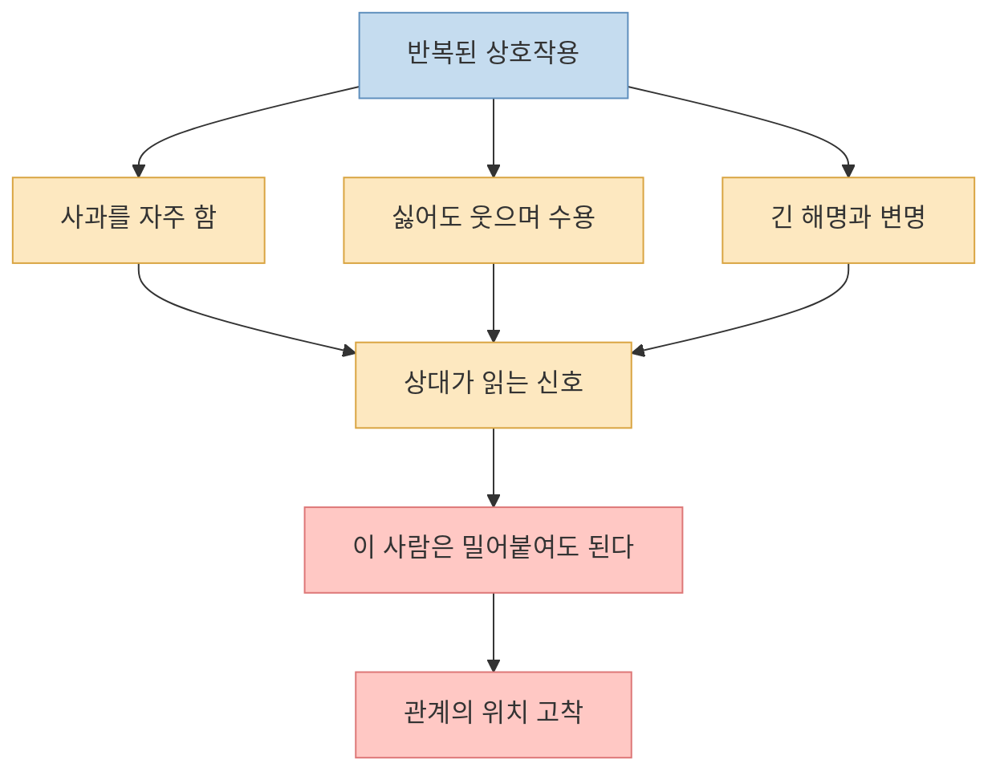
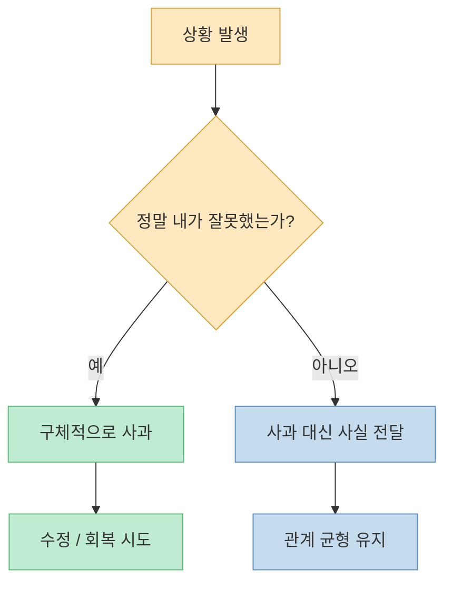
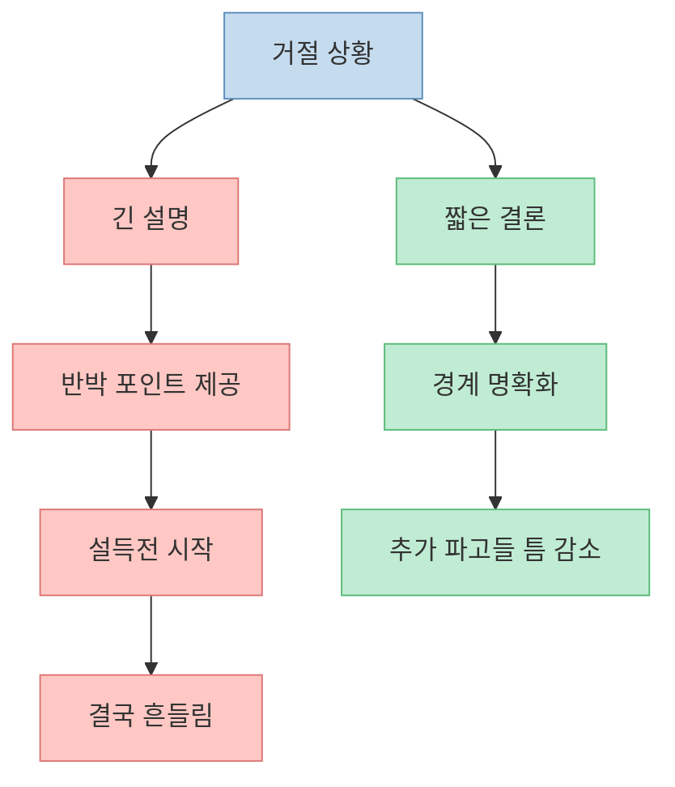
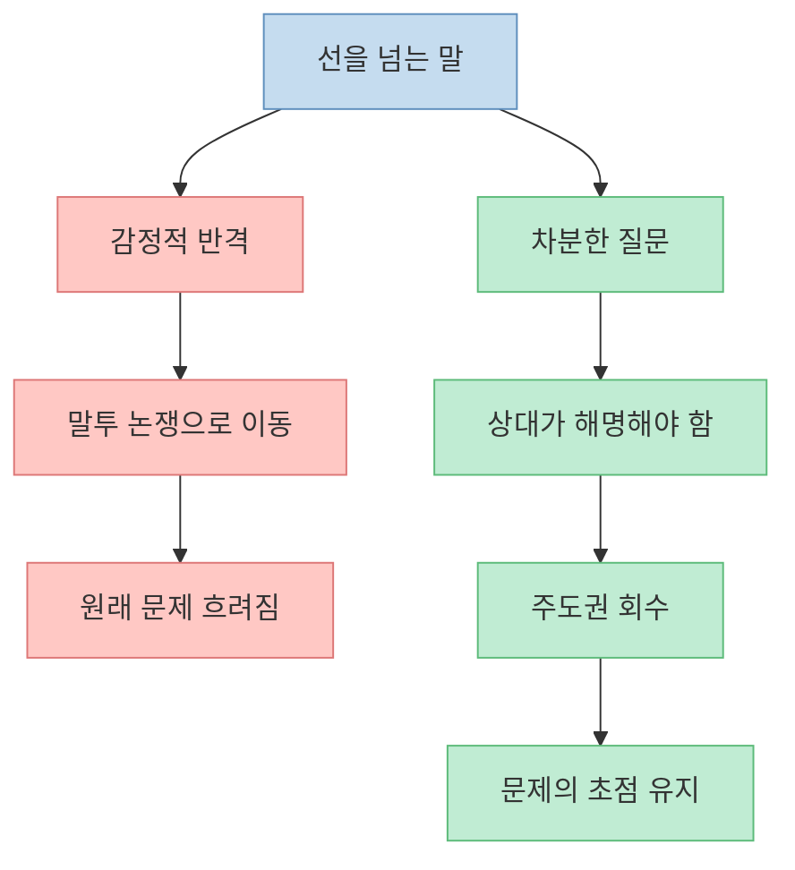
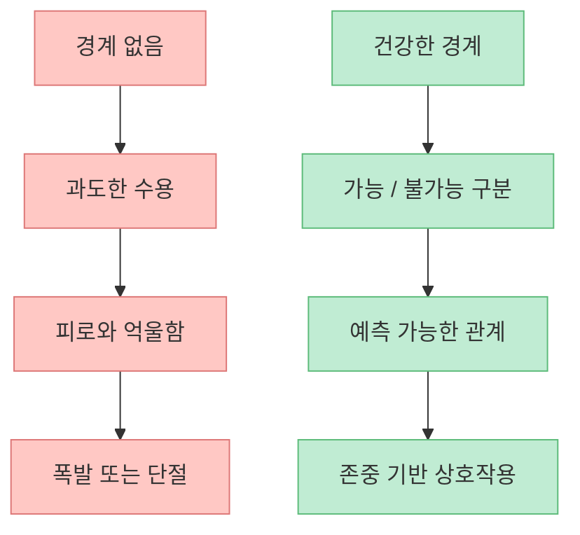
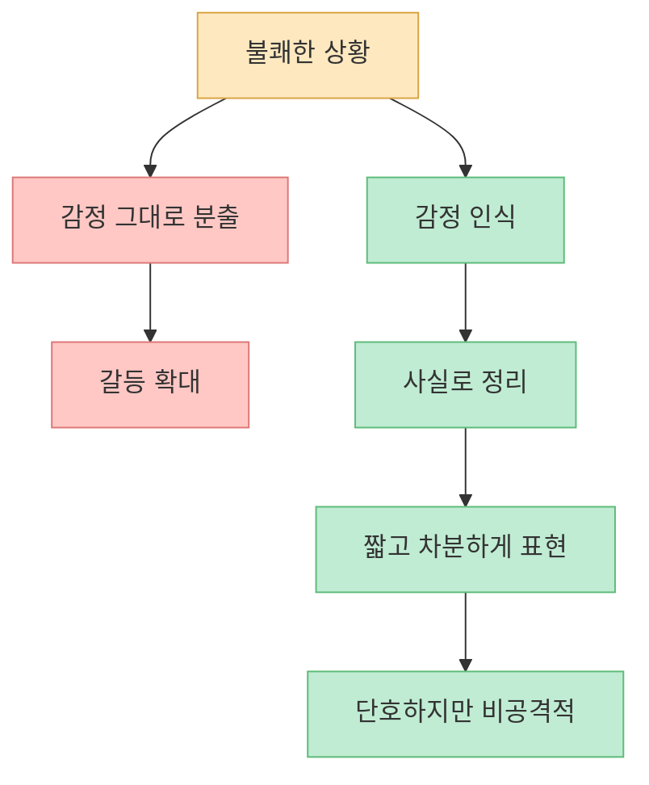

사람들에게 잘해 줬는데도 오히려 더 당연하게 취급받거나, 부탁을 거절하지 못해 점점 지치는 관계가 있습니다. 이럴 때 문제를 단순히 “상대가 나쁜 사람이라서”로만 설명하면 해결이 잘 안 됩니다. 영상이 던지는 핵심은 더 구체적입니다. **상대가 읽는 신호를 바꾸지 않으면 관계의 역할도 잘 바뀌지 않는다** 는 것입니다.

<!--more-->

## Sources

- [딱 3일만 '이 말투' 쓰세요, 무시하던 사람들이 당신 눈치를 봅니다](https://youtu.be/gO9e8jhI6_s)
- [Mayo Clinic — Being assertive: Reduce stress, communicate better](https://www.mayoclinic.org/health/assertive/SR00042)
- [Mayo Clinic Health System — Setting boundaries for well-being](https://www.mayoclinichealthsystem.org/hometown-health/speaking-of-health/setting-boundaries-for-well-being)
- [Cleveland Clinic — How To Set Healthy Boundaries](https://health.clevelandclinic.org/how-to-set-boundaries/)
- [NHS Fife — Communication and assertiveness](https://www.nhsfife.org/pain-talking/a-different-approach/communication-and-assertiveness/)

## 1. 무시는 종종 한 번의 사건보다 반복된 신호에서 만들어진다

영상은 “능력이나 외모보다 말투가 관계의 위치를 결정한다”는 주장으로 시작합니다. 발표자는 무시당하는 사람과 존중받는 사람 사이에 말투 차이가 있었다고 말합니다. [영상 0분 부근](https://youtu.be/gO9e8jhI6_s?t=0)

이 말은 “말투만 바꾸면 모든 관계가 해결된다”는 뜻은 아닙니다. 폭력적이거나 조종적인 관계는 더 근본적인 거리두기와 보호가 필요할 수 있습니다. 다만 건강한 일상 관계에서는 말투와 반응 방식이 실제로 중요한 신호가 됩니다.

Mayo Clinic은 assertive communication, 즉 자기주장적 의사소통을 공격성과 수동성의 중간으로 설명합니다. 자신의 생각과 감정을 분명히 표현하되 상대를 무시하거나 짓누르지 않는 방식입니다. [Mayo Clinic](https://www.mayoclinic.org/health/assertive/SR00042)

즉, 사람들은 말의 내용만 듣는 것이 아니라 말이 실린 방식도 읽습니다. 내가 계속 미안해하고, 불편해도 받아들이고, 경계를 설명하느라 장황해지면 상대는 그것을 “설득하면 넘어오는 사람”이라는 신호로 해석할 수 있습니다.

## 2. 필요 없는 사과는 배려가 아니라 자기 위치를 낮추는 신호가 될 수 있다

영상은 잘못하지 않았는데도 자주 사과하는 습관을 첫 번째 문제로 짚습니다. 예를 들어 내가 먼저 도착했는데도 “늦게 연락해서 죄송해요”라고 말하는 식입니다. [영상 3분 부근](https://youtu.be/gO9e8jhI6_s?t=180)

사과는 잘못을 인정하고 관계를 회복하는 데 중요한 기술입니다. 하지만 사과가 습관이 되면 의미가 달라집니다. 상대는 “이 사람은 기본적으로 자기 책임이 더 크다고 느끼는구나”라고 읽을 수 있습니다.

여기서 중요한 것은 무례해지라는 뜻이 아닙니다. 사과가 필요한 상황과 아닌 상황을 구분하라는 뜻입니다. “죄송합니다”가 자동반응이 되면, 정작 필요한 순간의 사과도 가벼워집니다.

## 3. 긴 설명은 성실함처럼 보이지만, 경계 앞에서는 약점이 되기도 한다

영상의 두 번째 핵심은 거절할 때 이유를 너무 길게 설명하지 말라는 것입니다. 짧게 결론만 말할수록 오히려 강한 신호가 된다는 주장입니다. [영상 6분 부근](https://youtu.be/gO9e8jhI6_s?t=360)

이 부분은 실제 경계 설정 원칙과도 맞닿아 있습니다. Cleveland Clinic은 건강한 경계는 다른 사람을 통제하려는 것이 아니라, 내가 허용할 것과 허용하지 않을 것을 분명히 하는 것이라고 설명합니다. [Cleveland Clinic](https://health.clevelandclinic.org/how-to-set-boundaries/)

긴 설명이 문제인 이유는 두 가지입니다.

- 설명이 길수록 상대가 반박할 지점을 찾기 쉬워집니다.
- 설명이 길수록 내가 허락을 구하는 사람처럼 들릴 수 있습니다.

예를 들어 “이번에는 어렵습니다”는 짧지만 명확합니다. 반면 “제가 원래 도와드리고 싶은데 이번 주에 일이 너무 많고 집안일도 있고 사실 어제도 너무 힘들어서…”는 상대가 “그럼 다음 주는 되나?”, “그 정도는 다들 힘들지 않나?”라고 파고들기 쉬운 구조가 됩니다.

## 4. 질문은 감정적 반격보다 더 강한 주도권 회수 방식이다

영상은 선을 넘는 말이나 무리한 부탁을 받았을 때 설명하거나 사과하지 말고, “방금 하신 말씀 어떤 의미인가요?”처럼 질문으로 되돌리라고 제안합니다. [영상 6분 부근](https://youtu.be/gO9e8jhI6_s?t=360)

이 전략이 효과적인 이유는 상대를 공격하지 않으면서도 책임을 다시 상대에게 돌리기 때문입니다. 무례한 말을 들었을 때 바로 화를 내면 대화 주제가 “당신이 왜 그런 말을 했는가”에서 “왜 그렇게 예민하게 반응하는가”로 바뀌기 쉽습니다. 반면 질문은 원래 문제를 원래 위치에 붙잡아 둡니다.

NHS Fife는 assertiveness를 자신의 입장을 명확하고 직접적으로 표현하면서도 상대를 존중하는 방식으로 설명합니다. 질문은 바로 그 지점을 잘 활용하는 도구입니다. [NHS Fife](https://www.nhsfife.org/pain-talking/a-different-approach/communication-and-assertiveness/)

질문은 낮은 목소리일수록 오히려 강합니다. 큰 감정은 순간적으로 힘이 있어 보이지만, 차분한 질문은 상대에게 “이 사람은 흔들리지 않는다”는 신호를 줍니다.

## 5. 경계는 공격이 아니라 자기 보호다

많은 사람이 단호하게 말하면 차가워 보일까 봐 두려워합니다. 하지만 Mayo Clinic Health System은 건강한 경계 설정이 개인의 웰빙과 관계 건강 모두에 필요하다고 설명합니다. [Mayo Clinic Health System](https://www.mayoclinichealthsystem.org/hometown-health/speaking-of-health/setting-boundaries-for-well-being)

경계는 상대를 벌주는 기술이 아닙니다. 경계는 내가 감당할 수 있는 범위를 알려 주는 기술입니다.

경계가 없는 친절은 오래 가지 못합니다. 처음에는 좋은 사람처럼 보일 수 있지만, 결국 지치고 쌓이고 폭발합니다. 반대로 경계가 있는 친절은 안정적입니다. 내가 무리하지 않으니, 관계도 더 오래 갑니다.

## 6. 단호함은 공격성이 아니라 감정과 사실을 분리하는 능력이다

영상 후반은 짧고 차분하게, 감정을 섞지 말고 사실만 말하라고 조언합니다. “왜 항상 나한테만 이래요?”보다 “방금 하신 말씀은 제가 동의하기 어렵습니다” 같은 표현이 더 힘이 있다는 것입니다. [영상 9분 부근](https://youtu.be/gO9e8jhI6_s?t=540)

Mayo Clinic 역시 assertive communication에서 내용뿐 아니라 표정, 자세, 목소리도 중요하다고 설명합니다. 공격적이지 않아도 단호할 수 있고, 조용해도 분명할 수 있습니다. [Mayo Clinic](https://www.mayoclinic.org/health/assertive/SR00042)

이 방식의 핵심은 감정을 부정하는 것이 아닙니다. 감정은 느끼되, 전달은 구조적으로 하자는 것입니다. 감정은 나침반이지만, 문장은 도구여야 합니다.

## 7. 3일 만에 모든 관계가 바뀌지는 않지만, 내 위치는 바뀌기 시작한다

영상은 “3일만 이 말투를 써 보라”고 말합니다. 실제로 단기간에 주변 사람 전부가 바뀌지는 않을 수 있습니다. 그러나 내가 반복적으로 보내는 신호가 바뀌면, 건강한 관계에서는 꽤 빠르게 변화가 생길 수 있습니다. [영상 9분 부근](https://youtu.be/gO9e8jhI6_s?t=540)

처음 나타나는 변화는 보통 아주 작습니다.

- 부탁의 톤이 조심스러워짐
- 내 의견을 확인하는 빈도가 늘어남
- 예전처럼 함부로 말하지 않음
- 내가 곧바로 해명하지 않자 상대가 말을 고름

이런 작은 변화는 “상대가 갑자기 착해졌다”기보다, **내가 더 이상 예전 역할을 자동으로 맡지 않기 시작했다** 는 뜻입니다.

## 핵심 요약

- 무시당하는 관계는 종종 한 번의 사건이 아니라 반복된 신호에서 굳어집니다.
- 필요 없는 사과는 책임감이 아니라 자기 위치를 낮추는 신호가 될 수 있습니다.
- 거절할 때 긴 설명은 성실함처럼 보이지만, 경계 앞에서는 설득당할 틈을 크게 만듭니다.
- 선을 넘는 말에는 감정적 반격보다 차분한 질문이 더 강한 주도권 회수 방식이 될 수 있습니다.
- 건강한 경계는 공격이 아니라 자기 보호이며, 장기적으로 더 안정적인 친절을 가능하게 합니다.
- 단호함은 소리 크기가 아니라 감정과 사실을 분리해 짧고 분명하게 말하는 능력입니다.

## 결론

무시당하지 않는 말투의 핵심은 말을 예쁘게 꾸미는 기술이 아닙니다. 핵심은 **내 시간, 감정, 에너지의 경계를 내가 먼저 인정하는 태도** 입니다.

사람을 함부로 대하는 관계는 분명 존재합니다. 하지만 많은 일상 관계는 내가 어떤 신호를 보내는지에 따라 예상보다 많이 달라집니다. 필요 없는 사과를 줄이고, 긴 해명을 끊고, 차분한 질문으로 주도권을 되찾는 것만으로도 관계의 공기가 달라질 수 있습니다.

친절한 사람으로 남되, 더 이상 당연하게 소모되는 사람으로 남지 않는 것. 그게 이 말투 변화의 진짜 목적입니다.
