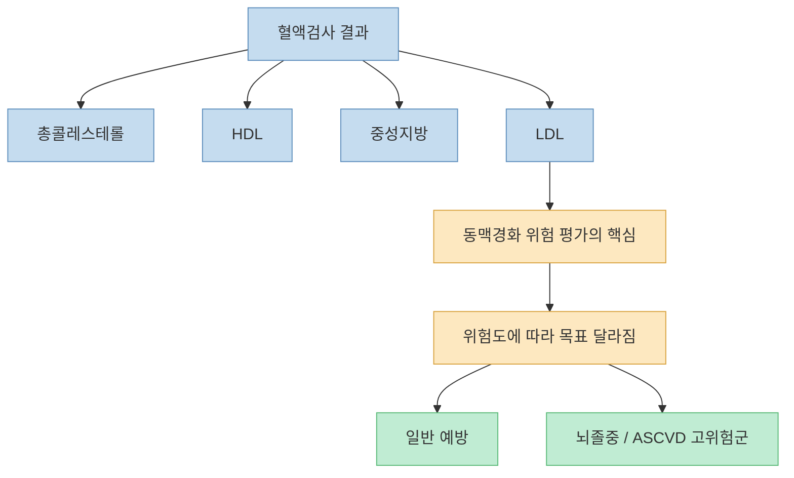
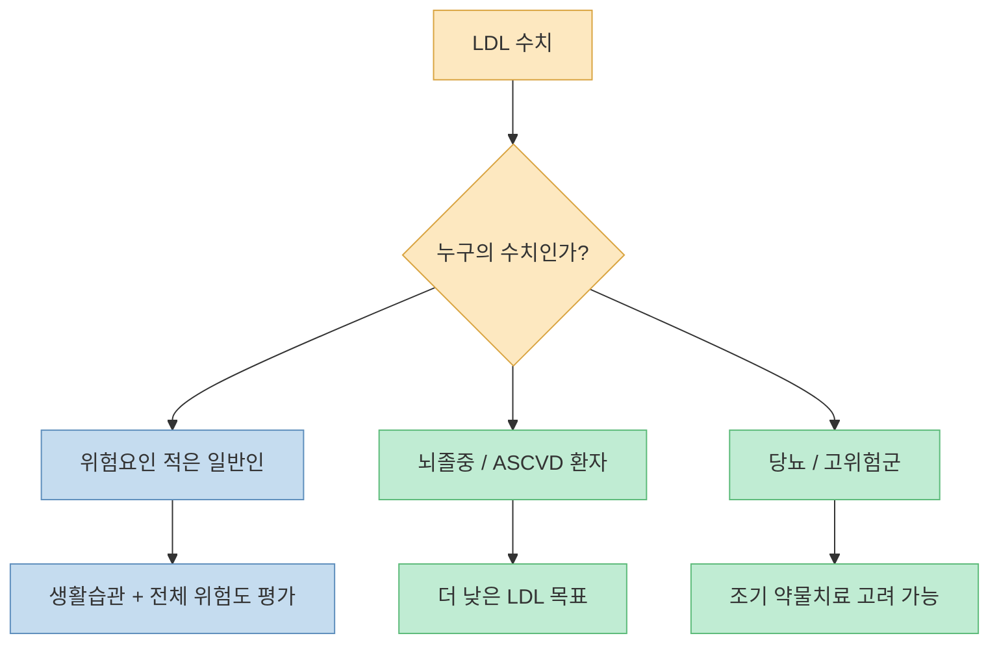
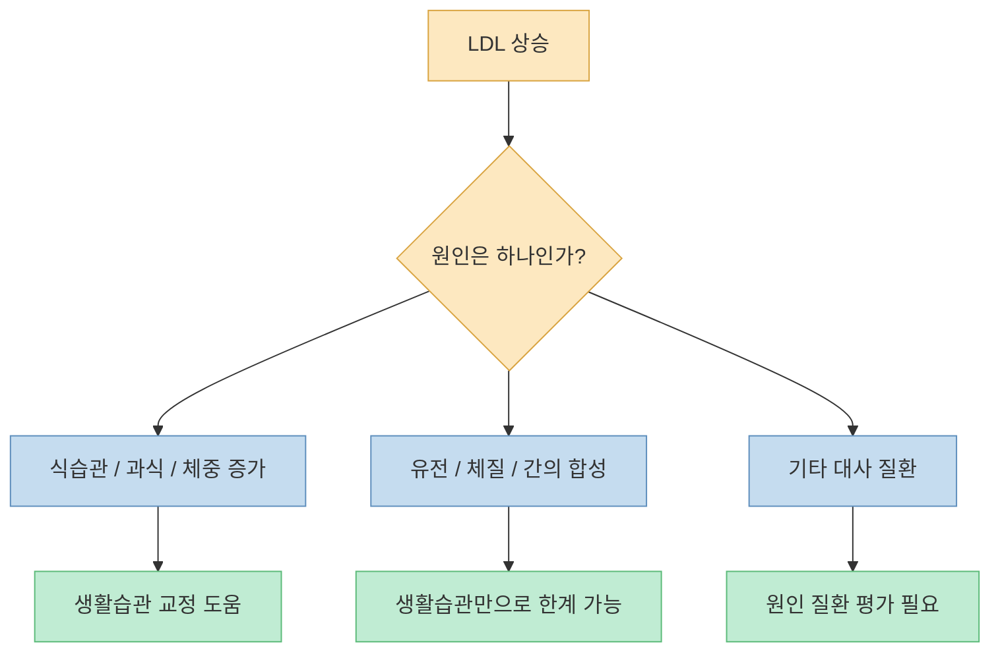
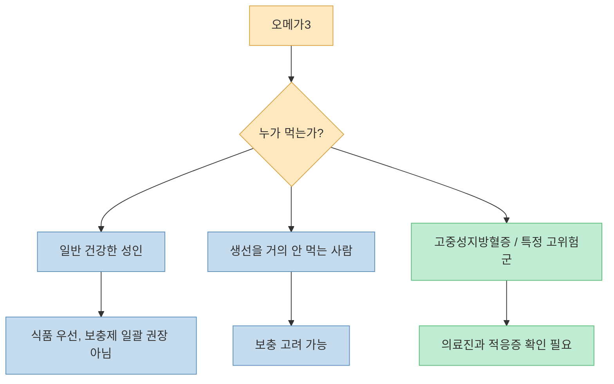
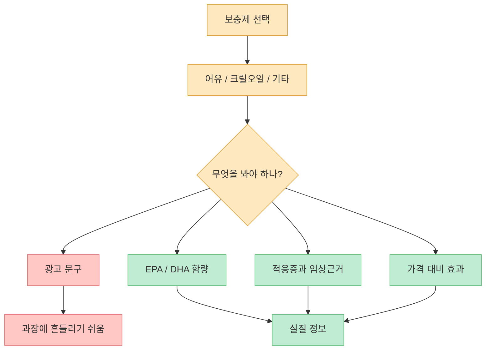
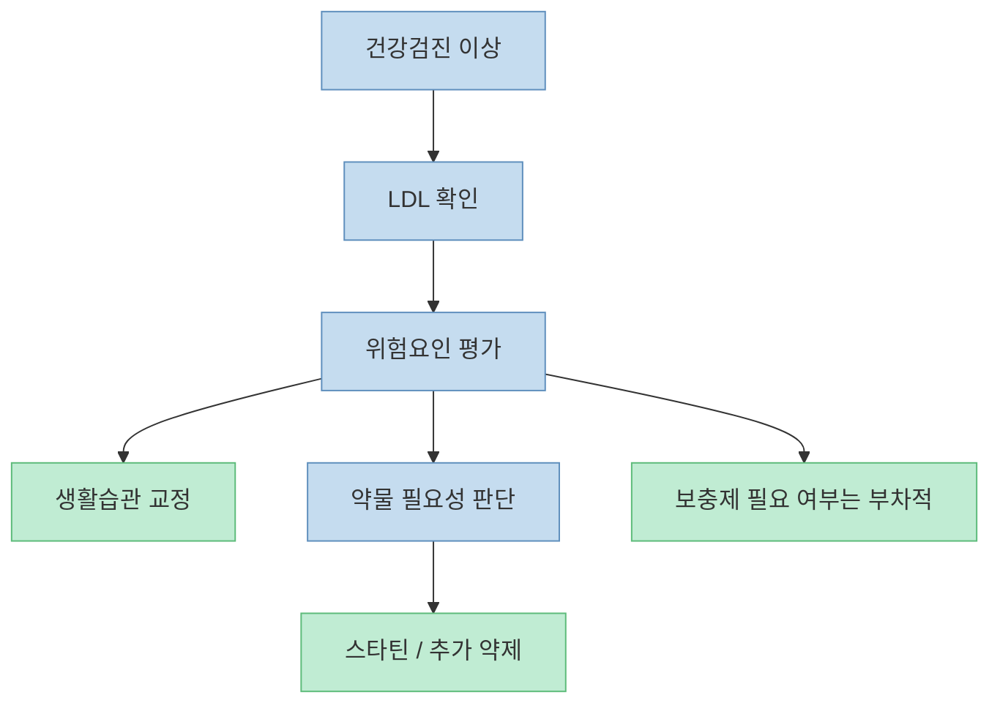

건강검진에서 총콜레스테롤, HDL, LDL, 중성지방 숫자가 한꺼번에 나오면 무엇이 진짜 중요한지 헷갈리기 쉽습니다. 이 영상의 핵심은 단순합니다. **모든 지질 수치를 똑같이 보지 말고, 우선 LDL을 중심으로 위험을 읽으라** 는 것입니다. 그리고 많은 사람이 당연하게 먹는 오메가3·크릴오일 보충제가 정말 필요한지도 다시 묻습니다.

<!--more-->

## Sources

- [아직도 오메가3 드시나요? 서울대 명의가 밝힌 '영양제의 진실'](https://youtu.be/y7givTXVSFU)
- [ACC — AHA/ASA Stroke Secondary Prevention Guideline: Key Points](https://www.acc.org/Latest-in-Cardiology/ten-points-to-remember/2021/06/02/18/08/2021-Guideline-for-the-Prevention-of-Stroke)
- [American Stroke Association — Cholesterol and Stroke](https://www.stroke.org/en/about-stroke/stroke-risk-factors/cholesterol-and-stroke)
- [American Heart Association — Are you getting enough omega-3 fatty acids?](https://www.heart.org/en/news/2023/06/30/are-you-getting-enough-omega-3-fatty-acids)
- [NIH ODS — Omega-3 Fatty Acids Fact Sheet for Health Professionals](https://ods.od.nih.gov/factsheets/Omega3FattyAcids-HealthProfessional/?source=organic)
- [NIH ODS — Omega-3 Fatty Acids Fact Sheet for Consumers](https://ods.od.nih.gov/pdf/factsheets/Omega3FattyAcids-Consumer.pdf)

## 1. 왜 LDL을 가장 먼저 보라고 할까

영상은 총콜레스테롤, 중성지방, HDL, LDL을 한꺼번에 보지 말고 우선 **LDL 콜레스테롤** 하나를 중심으로 보라고 강조합니다. 특히 LDL이 160 mg/dL를 넘는 경우를 강하게 경계하고, 뇌졸중 환자처럼 이미 혈관질환이 있는 사람은 목표를 훨씬 더 낮게 잡아야 한다고 설명합니다. [영상 0분 부근](https://youtu.be/y7givTXVSFU?t=0)

이 관점은 최신 진료 방향과 크게 다르지 않습니다. American Stroke Association은 LDL이 높을수록 동맥벽에 지방 침착이 생겨 뇌졸중 위험이 올라갈 수 있다고 설명합니다. 또한 뇌졸중을 이미 겪은 고위험군에서는 LDL 목표를 더 낮게 가져가는 경우가 있습니다. [American Stroke Association](https://www.stroke.org/en/about-stroke/stroke-risk-factors/cholesterol-and-stroke)

ACC가 정리한 AHA/ASA 2021 뇌졸중 2차 예방 가이드라인도 대부분의 뇌졸중 환자에서 고강도 스타틴 치료와 함께 **LDL 70 mg/dL 미만** 을 권장합니다. [ACC](https://www.acc.org/Latest-in-Cardiology/ten-points-to-remember/2021/06/02/18/08/2021-Guideline-for-the-Prevention-of-Stroke)

즉, LDL 하나만 보면 된다는 뜻이 아니라, **해석의 중심축을 LDL에 두라** 는 의미에 가깝습니다.

## 2. 정상 수치보다 더 중요한 것은 “내 위험도에 맞는 목표”다

영상은 고지혈증에서 “정상 수치”라는 표현이 애매하다고 말합니다. 왜냐하면 같은 LDL 100이라도 누구에게는 괜찮을 수 있고, 누구에게는 너무 높은 수치일 수 있기 때문입니다. [영상 6분 부근](https://youtu.be/y7givTXVSFU?t=360)

이 점은 실제 진료에서도 중요합니다. 이미 뇌졸중, 심근경색, 당뇨, 만성신장질환, 강한 가족력 같은 위험요인이 있는 사람은 더 엄격한 목표가 필요할 수 있습니다. 반대로 위험요인이 거의 없는 사람은 숫자 하나만으로 바로 약을 시작하지 않고 전체 위험을 함께 봅니다.

그래서 건강검진표에서 “참고범위 안”만 보고 안심하거나, 반대로 숫자 하나만 보고 과도하게 불안해할 필요는 없습니다. **LDL은 위험도와 함께 해석해야 하는 목표 지표** 입니다.

## 3. 마른 사람도 LDL이 높을 수 있다: 생활습관만의 문제가 아니다

영상에서 인상적인 부분은 “마르고 채식을 하는데도 LDL이 높을 수 있다”는 설명입니다. 교수는 이런 경우 유전적·체질적 요인, 즉 간이 콜레스테롤을 잘 만들어 내는 세팅일 수 있다고 말합니다. [영상 6분 부근](https://youtu.be/y7givTXVSFU?t=360)

이건 현실적으로 매우 중요합니다. 많은 사람이 콜레스테롤을 “살찐 사람의 문제”로 오해하지만, 실제로는 가족성 고콜레스테롤혈증처럼 체중과 무관하게 LDL이 높게 유지되는 경우도 있습니다. 이런 사람은 생활습관이 좋아도 수치가 충분히 안 내려갈 수 있습니다.

따라서 “나는 마르니까 괜찮다”도 틀릴 수 있고, “나는 잘 먹지 않는데 왜 높냐”도 충분히 가능한 질문입니다.

## 4. 식이조절로 LDL이 생각보다 잘 안 떨어지는 이유

영상은 많은 사람이 식이조절만으로 콜레스테롤을 충분히 낮출 수 있다고 기대하지만, 실제로는 간이 콜레스테롤을 계속 합성하기 때문에 생각보다 잘 안 떨어질 수 있다고 설명합니다. [영상 9분 부근](https://youtu.be/y7givTXVSFU?t=540)

여기서 중요한 건 식단이 의미 없다는 뜻이 아니라, **식단만으로 해결되는 문제와 약물 도움이 필요한 문제를 구분해야 한다** 는 것입니다. 특히 LDL이 높고, 이미 동맥경화성 질환 위험이 큰 사람은 “조금 덜 먹어 보자” 수준으로는 부족할 수 있습니다.

영상은 또 탄수화물 과다, 특히 과당과 과식의 문제를 강조합니다. 이 부분은 LDL 하나만의 문제가 아니라 중성지방, 내장지방, 지방간, 체중 증가와도 연결됩니다. [영상 9분~12분 부근](https://youtu.be/y7givTXVSFU?t=540)

## 5. 오메가3는 모든 사람의 기본 영양제가 아니다

영상 후반은 많은 사람이 자동으로 먹는 오메가3 보충제에 의문을 던집니다. 교수는 해양식품을 꽤 먹는 한국인에게 무조건 오메가3를 더 먹여야 하느냐는 질문을 던지고, 혈액 개선을 위한 만능 보충제처럼 보는 시선에 거리를 둡니다. [영상 15분 부근](https://youtu.be/y7givTXVSFU?t=900)

American Heart Association도 비슷한 방향입니다. AHA는 생선 등 식품으로 오메가3를 섭취하는 것이 중요하다고 보지만, **일반인의 심혈관질환 1차 예방 목적으로 오메가3 보충제를 일괄 권장하지는 않습니다.** [AHA](https://www.heart.org/en/news/2023/06/30/are-you-getting-enough-omega-3-fatty-acids/)

NIH ODS 건강전문가 자료도 오메가3 보충제가 대부분의 심혈관 사건을 유의미하게 줄인다는 근거는 제한적이라고 정리합니다. 다만 특정 상황, 예를 들어 **고중성지방혈증** 이나 일부 심혈관 고위험군에서는 처방형 EPA 제제가 별도로 논의될 수 있습니다. [NIH ODS 전문가용](https://ods.od.nih.gov/factsheets/Omega3FattyAcids-HealthProfessional/?source=organic)

즉, “오메가3는 몸에 좋으니까 누구나 평생 먹어야 한다”는 식의 문장은 너무 단순합니다.

## 6. 크릴오일이 더 좋다는 말은 왜 조심해야 하나

영상은 크릴오일 마케팅을 특히 강하게 비판합니다. 크릴에 인지질과 오메가3가 들어 있어서 더 좋다고 하지만, 인지질은 원래 많은 음식과 세포에 널리 존재하는 성분이며, 그것만으로 특별한 우월성을 주장하기 어렵다고 말합니다. [영상 15분 부근](https://youtu.be/y7givTXVSFU?t=900)

이 지적은 꽤 타당합니다. NIH 소비자 자료를 봐도 오메가3 보충제는 어유, 크릴오일 등 형태가 다양하지만, “크릴이니까 확실히 더 좋다”는 수준의 확립된 임상 근거는 강하지 않습니다. [NIH ODS 소비자용](https://ods.od.nih.gov/pdf/factsheets/Omega3FattyAcids-Consumer.pdf)

핵심은 원료 이름보다 **함량, 적응증, 임상근거, 비용 대비 효과** 입니다.

제품명이 아니라 적응증을 먼저 보는 습관이 필요합니다.

## 7. 결국 중요한 것은 영양제가 아니라 질병의 단계다

영상은 스트레스, 흡연, 음주, 비만, 운동 부족, 과식, 과도한 단당류 섭취처럼 실제 혈관을 손상시키는 요인들을 함께 설명합니다. [영상 18분~24분 부근](https://youtu.be/y7givTXVSFU?t=1080)

이 맥락에서 보면 오메가3 보충제 논쟁의 핵심은 “먹을까 말까”보다 더 큽니다. 진짜 중요한 질문은 다음입니다.

- 내 LDL은 실제로 어느 정도 위험한가
- 나는 이미 동맥경화성 질환 고위험군인가
- 식단·체중·운동·흡연·음주를 얼마나 조정해야 하는가
- 스타틴 같은 검증된 약이 필요한 단계인가
- 오메가3가 있다면 그것은 일반 영양제 수준인가, 특정 적응증 치료의 일부인가

영양제는 보조일 수 있어도, LDL 관리의 중심축을 대체하지는 못합니다.

## 핵심 요약

- 영상의 핵심은 지질검사 해석에서 LDL을 가장 먼저 보라는 것입니다.
- LDL 목표는 “정상 범위” 하나로 정해지는 것이 아니라, 개인의 심혈관 위험도와 질병 유무에 따라 달라집니다.
- 마른 사람, 채식하는 사람도 유전적·체질적 이유로 LDL이 높을 수 있습니다.
- 식이조절은 중요하지만, LDL이 높고 위험도가 큰 사람은 약물치료가 필요할 수 있습니다.
- 오메가3 보충제는 모든 사람의 기본 영양제가 아니며, 일반인의 1차 예방 목적으로 일괄 권장되지 않습니다.
- 크릴오일이 더 특별하다는 마케팅은 임상근거보다 광고가 앞선 경우가 많습니다.
- 결국 중요한 것은 보충제 선택보다 현재의 LDL 수준, 동맥경화 위험도, 그리고 검증된 치료가 필요한 단계인지 판단하는 것입니다.

## 결론

건강검진표를 볼 때 숫자가 많을수록 더 헷갈리지만, 실제 판단은 오히려 단순해질 수 있습니다. **우선 LDL을 중심으로 보고, 그 숫자를 내 질병 위험도와 함께 해석하는 것** 입니다.

오메가3와 크릴오일은 그 다음 문제입니다. 어떤 사람에게는 의미가 있을 수 있지만, 많은 사람에게는 식사·체중·운동·스타틴 같은 기본 축보다 훨씬 뒤에 오는 선택지입니다.

결국 혈관을 지키는 핵심은 “좋아 보이는 영양제”가 아니라, **내 위험도에 맞는 LDL 목표를 알고 그것을 실제로 관리하는 것** 입니다.
