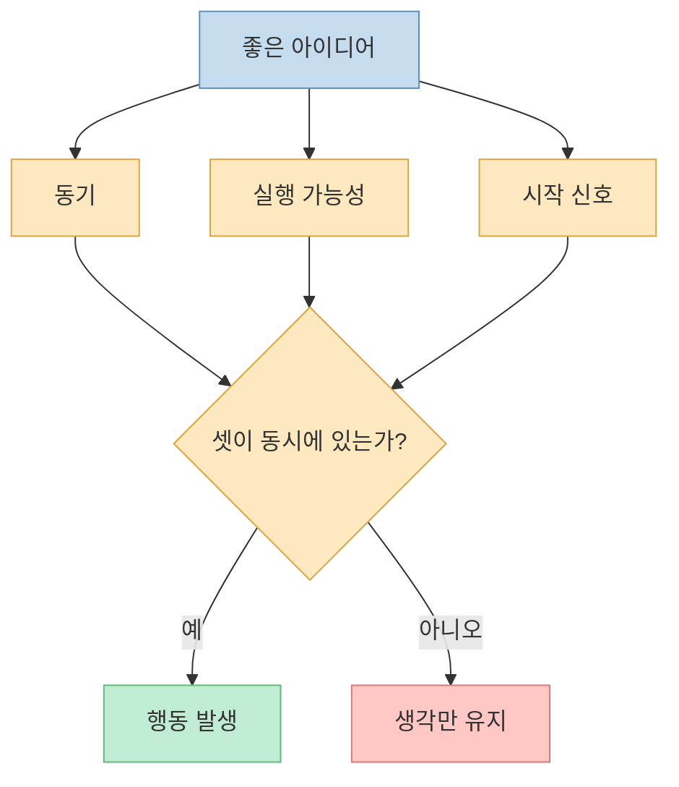
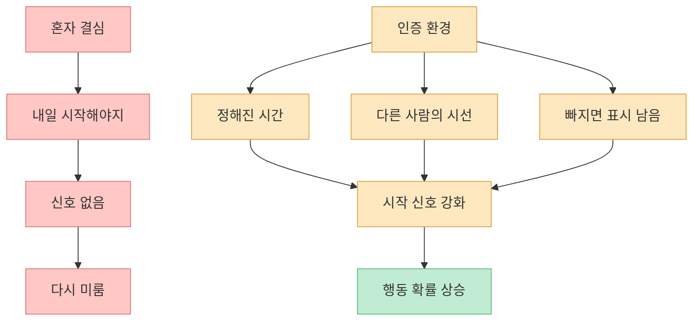
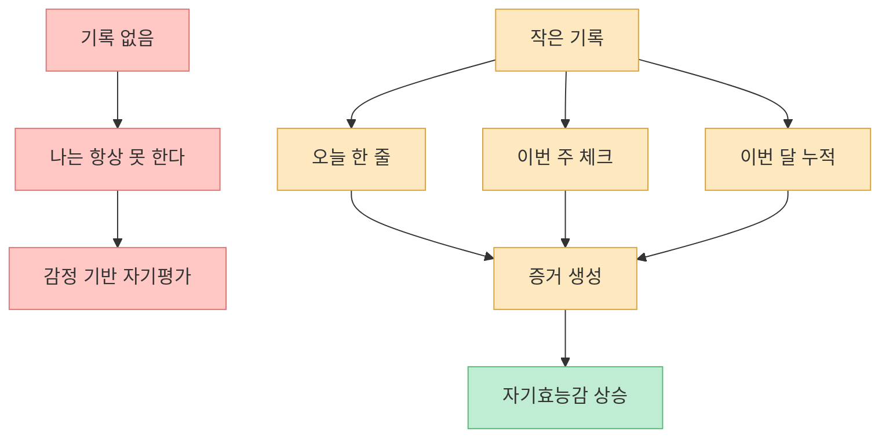
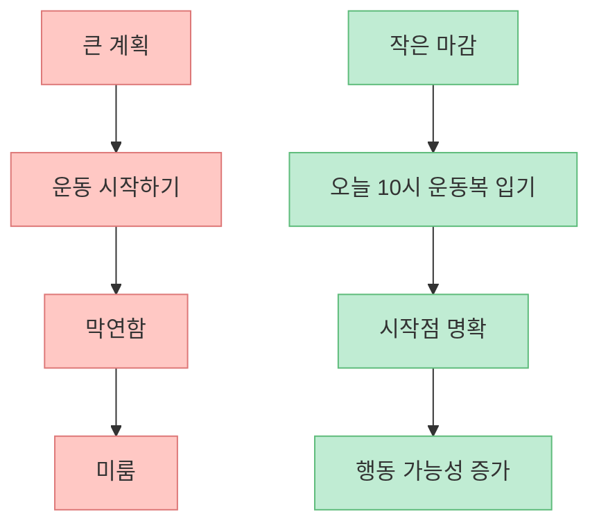
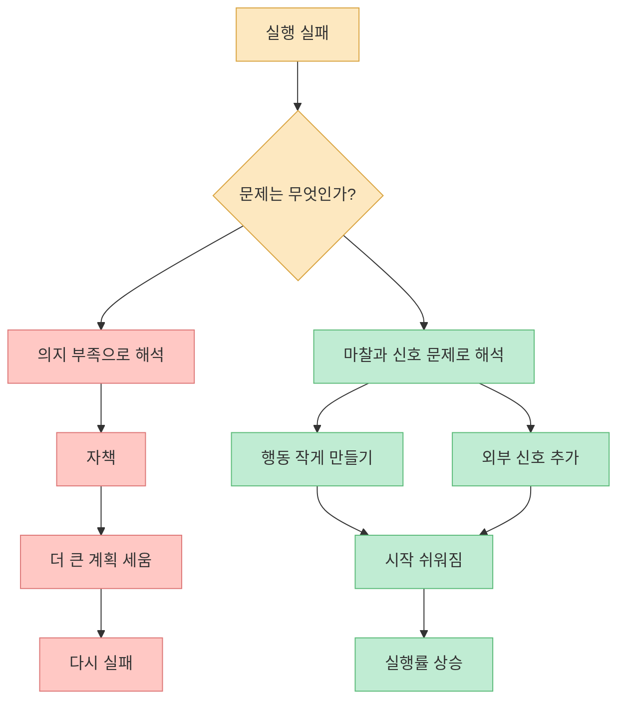
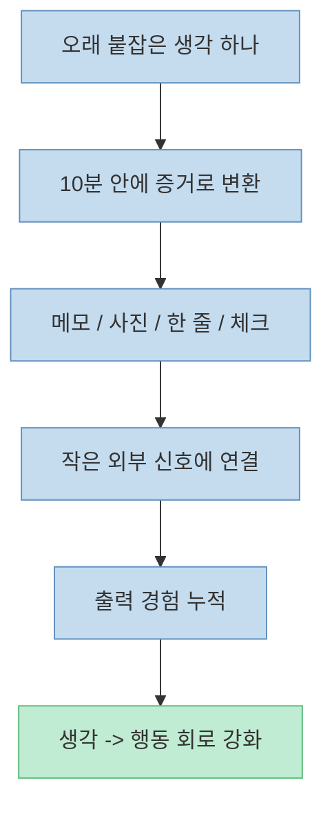

생각은 많은데 결과물이 잘 안 나오는 사람은 대개 자신을 게으르다고 오해합니다. 하지만 영상의 관점은 다릅니다. 문제는 의지 부족이 아니라 **출고 시스템의 부재** 라는 것입니다. 머릿속에서는 계속 일하고 있는데, 생각을 바깥으로 빼내는 구조가 없어서 실행이 멈춘다는 뜻입니다.

<!--more-->

## Sources

- [생각만 많던 IN 유형이 인생을 바꾸기 시작한 순간](https://youtu.be/eiQAfQiftmA)
- [BJ Fogg — Fogg Behavior Model](https://www.behaviormodel.org/home)
- [Stanford GSB — Building Habits: The Key to Lasting Behavior Change](https://www.gsb.stanford.edu/insights/building-habits-key-lasting-behavior-change)
- [International Journal of Behavioral Nutrition and Physical Activity — Impact of feedback generation and presentation on self-monitoring behaviors](https://ijbnpa.biomedcentral.com/articles/10.1186/s12966-023-01555-6)
- [USDA NESR — Self-monitoring strategies and body weight outcomes](https://nesr.usda.gov/what-relationship-between-use-diet-and-body-weight-self-monitoring-strategies-and-body-weight)

## 1. 생각은 생산인데, 출력은 시스템의 문제다

영상은 “머릿속은 풀가동인데 출고가 안 된다”는 문장으로 문제를 설명합니다. 아이디어, 계획, 다짐은 계속 생기지만 노트, 파일, 행동, 결과물로 빠져나오지 않는 상태입니다. [영상 0분 부근](https://youtu.be/eiQAfQiftmA?t=0)

이 설명이 설득력 있는 이유는 실행 실패를 도덕 문제로 보지 않기 때문입니다. 사람은 생각이 많다고 자동으로 움직이지 않습니다. 행동은 “생각이 좋다”만으로 일어나지 않고, 행동을 시작시키는 구조가 있어야 합니다.

BJ Fogg의 행동 모델도 같은 방향을 말합니다. 행동은 **동기(Motivation)**, **실행 가능성(Ability)**, **신호 또는 촉발점(Prompt)** 이 동시에 만날 때 일어난다는 것입니다. [BJ Fogg](https://www.behaviormodel.org/home)

즉, 생각이 많은 사람이 바꿔야 할 것은 성격이 아니라 시스템입니다.

## 2. 인증 환경은 “의지”를 “외부 신호”로 바꿔 준다

영상의 첫 번째 해법은 인증 환경입니다. 매일 아침 운동 사진을 올리는 단톡방, 매일 한 페이지 독서를 공유하는 모임, 30일 루틴 챌린지처럼, 안 하면 다른 사람이 보게 되는 구조를 넣는 것입니다. [영상 3분 부근](https://youtu.be/eiQAfQiftmA?t=180)

이 구조의 핵심은 완벽함이 아닙니다. 영상도 빠진 날이 있고, 겨우 인증만 한 날이 있어도 흐름은 유지된다고 설명합니다. 중요한 것은 “매일 완벽하게 하기”가 아니라 “매일 다시 연결될 수 있는 자리”를 만드는 것입니다.

Stanford GSB에 실린 BJ Fogg 인터뷰도 비슷한 점을 강조합니다. 행동 변화는 의지를 오래 쥐어짜는 것보다, **쉽게 시작할 수 있는 행동과 적절한 프롬프트** 를 설계하는 것이 훨씬 중요합니다. [Stanford GSB](https://www.gsb.stanford.edu/insights/building-habits-key-lasting-behavior-change)

여기서 중요한 것은 강한 통제가 아니라 약한 외부성입니다. 누군가가 감독하는 군대식 구조가 아니라, “내가 하겠다고 한 것이 보이는 자리”만 있어도 행동 확률은 달라집니다.

## 3. 작은 기록은 자신감을 만드는 증거 수집 장치다

영상의 두 번째 해법은 기록입니다. 그날 한 일을 한 줄 적기, 쓴 돈 세 개만 적기, 감정을 한 단어로 적기처럼 아주 작은 기록이 쌓이면서 사람의 상태를 바꾼다고 설명합니다. [영상 6분 부근](https://youtu.be/eiQAfQiftmA?t=360)

많은 사람은 기록을 관리용 도구로만 생각합니다. 하지만 실제로 기록의 힘은 관리보다 **증거 축적** 에 있습니다. “나는 늘 작심삼일이야”라는 자기 인식은 대개 감정에 근거합니다. 그런데 며칠치 기록, 몇 주치 메모, 몇 달치 체크가 쌓이면 자기평가가 감정에서 데이터로 이동합니다.

IJBNPA의 2024 체계적 문헌고찰은 자가 모니터링과 그에 대한 피드백이 행동 변화 개입에서 중요한 역할을 한다고 정리합니다. [IJBNPA](https://ijbnpa.biomedcentral.com/articles/10.1186/s12966-023-01555-6)

영상이 잘 짚는 부분은 “처음 한 달은 거의 못 적었다”는 실패담입니다. 중요한 것은 끊기지 않는 완벽함이 아니라, 다시 시작할 수 있는 구조입니다. 기록 습관은 매끄럽게 이어지는 것이 아니라, 여러 번 다시 열어 보면서 자리를 잡는 경우가 많습니다.

## 4. 작은 마감은 뭉개진 계획을 행동 단위로 자른다

영상의 세 번째 해법은 작은 마감입니다. “이번 주말에 한다” 같은 넓은 문장을 버리고, “오늘 밤 10시까지 운동복 갈아입기”, “일요일 밤까지 책상 왼쪽 한 구역 비우기”처럼 작은 마감을 외부에 걸어 두는 방식입니다. [영상 9분 부근](https://youtu.be/eiQAfQiftmA?t=540)

왜 이게 효과적일까요? 마감은 실행을 강제하는 신호이기 때문입니다. 특히 생각이 많은 사람은 과제가 클수록 머릿속에서 더 오래 굴립니다. 큰 계획은 멋있지만 시작점이 흐립니다. 반대로 작은 마감은 시작점을 선명하게 만듭니다.

영상의 비유처럼 시험 전날 갑자기 생산성이 폭발하는 이유도 머리가 갑자기 좋아져서가 아니라 마감이 생겼기 때문입니다. 실행은 자주 동기보다 마감에 더 민감하게 반응합니다.

## 5. 실행은 성향 문제가 아니라 마찰과 신호의 문제다

영상은 “IN 유형은 마감이 없으면 출력이 잘 안 난다”고 말하지만, 이것을 성격 유형의 고정된 한계로 읽을 필요는 없습니다. 더 유용한 해석은 **출력 회로가 외부 신호와 낮은 마찰을 필요로 한다** 는 것입니다. [영상 12분 부근](https://youtu.be/eiQAfQiftmA?t=720)

BJ Fogg의 모델도 행동을 쉽게 만들려면 ability, 즉 실행 가능성을 높여야 한다고 설명합니다. 쉽게 말해 행동이 작고, 간단하고, 빠를수록 더 적은 동기로도 시작할 수 있습니다. [BJ Fogg](https://www.behaviormodel.org/home)

이 관점은 사람을 덜 죄책감에 빠뜨리고, 더 구체적인 설계로 이동하게 만듭니다.

## 6. 하루 한 개 증거 시스템이 강한 이유

영상의 결론은 “하루 한 개 증거 시스템”입니다. 오늘 가장 오래 붙잡고 있던 생각 하나를 고르고, 그 생각을 10분 안에 밖으로 뺄 수 있는 형태로 바꾸고, 그 결과물을 작은 외부 신호에 걸라는 방식입니다. [영상 15분 부근](https://youtu.be/eiQAfQiftmA?t=900)

이 시스템이 좋은 이유는 세 가지를 동시에 만족시키기 때문입니다.

1. 행동이 작다
2. 출력이 눈에 보인다
3. 외부 신호가 붙는다

USDA의 NESR 리뷰도 식이·체중 자가 모니터링이 행동 변화 전략과 결합될 때 체중 관리에 도움이 될 수 있다고 정리합니다. 여기서 중요한 포인트는 “작게라도 측정하고 피드백 받는 것”입니다. [USDA NESR](https://nesr.usda.gov/what-relationship-between-use-diet-and-body-weight-self-monitoring-strategies-and-body-weight)

이 방식은 대단한 성취를 요구하지 않습니다. 대신 “오늘도 생각만 했다”는 하루를 “오늘은 최소 하나를 밖으로 뺐다”는 하루로 바꿉니다. 그 차이가 누적되면 사람의 자기 인식이 달라집니다.

## 핵심 요약

- 생각이 많은 사람이 실행을 못 하는 이유를 게으름으로만 해석하면 해결이 어렵습니다.
- 행동은 동기, 실행 가능성, 신호가 함께 있을 때 발생합니다.
- 인증 환경은 약한 외부 시선을 통해 시작 신호를 강화합니다.
- 작은 기록은 자기비난을 줄이고 자기효능감을 높이는 증거를 쌓게 합니다.
- 작은 마감은 막연한 계획을 실제 행동 단위로 자릅니다.
- 성향을 고치려 하기보다 마찰을 줄이고 외부 신호를 넣는 편이 실행률을 더 높입니다.
- “하루 한 개 증거 시스템”은 작고 보이는 출력으로 생각을 현실로 빼내는 구조입니다.

## 결론

실행은 성격 테스트 결과로 결정되지 않습니다. 더 정확히 말하면, 성격보다 **환경 설계**의 영향을 훨씬 많이 받습니다.

생각이 많은 사람에게 필요한 것은 더 큰 결심이 아닙니다. 인증 환경 하나, 기록 한 줄, 작은 마감 하나처럼 생각을 밖으로 밀어내는 구조입니다. 머릿속 창고가 꽉 차 있는 사람일수록, 더 거창한 계획보다 더 작은 출고 시스템이 필요합니다.

하루에 한 개만 밖으로 빼도 됩니다. 중요한 것은 더 많이 생각하는 것이 아니라, **생각이 지나간 자리에 증거를 남기는 것** 입니다.
