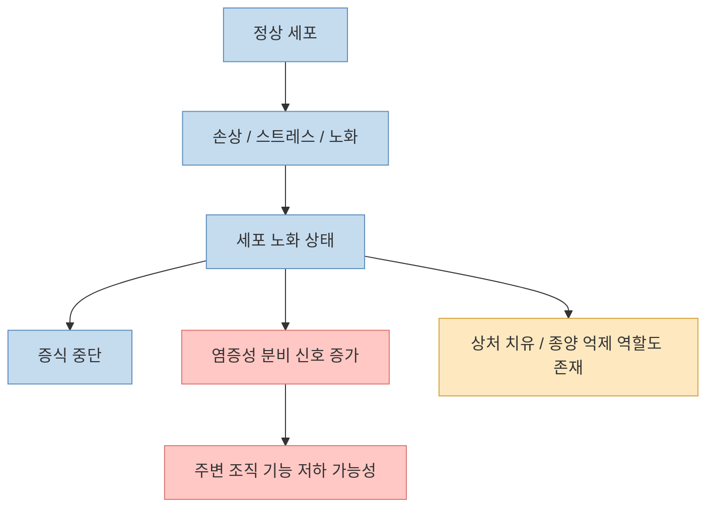
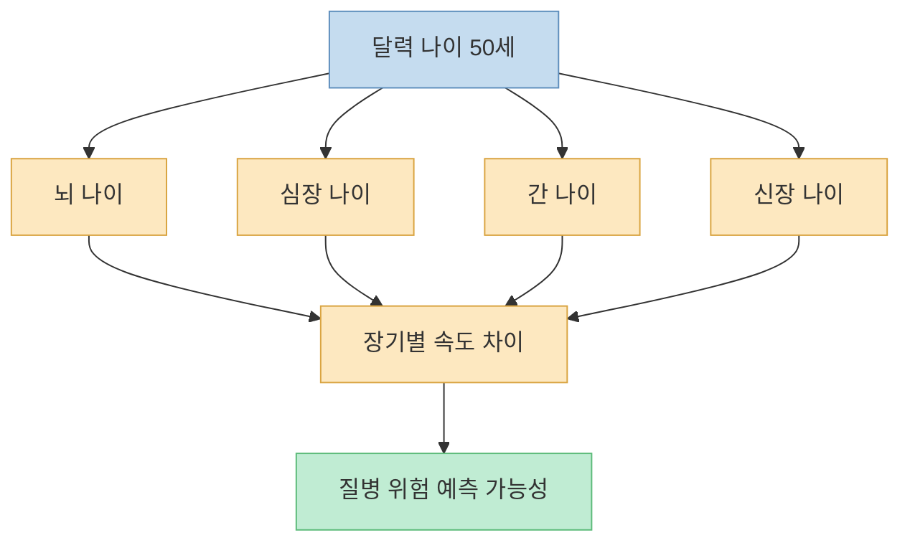
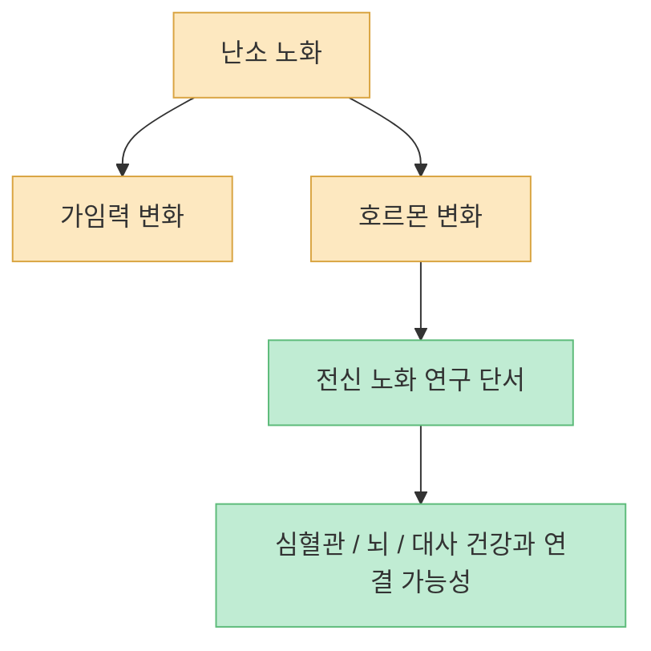
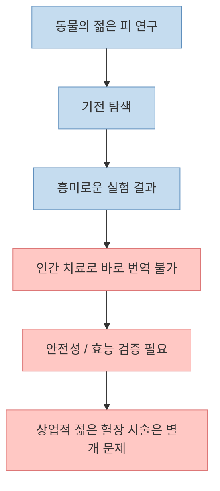
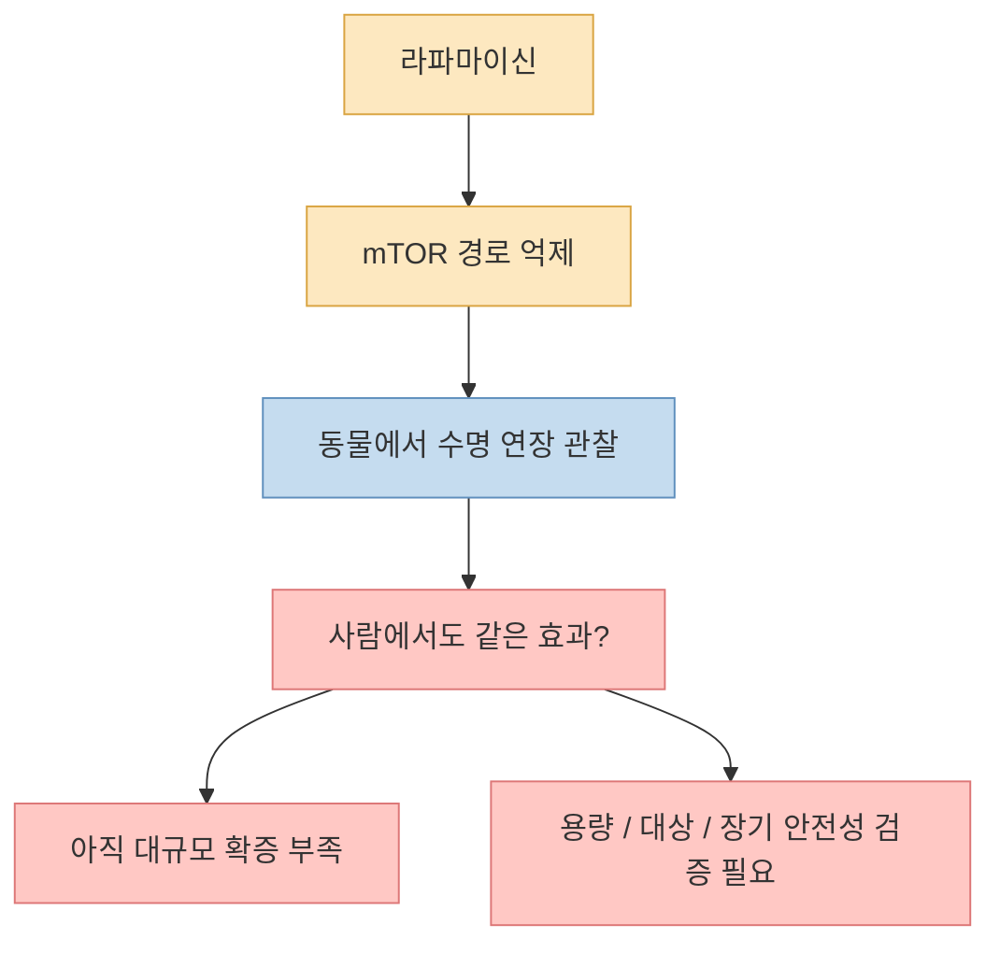
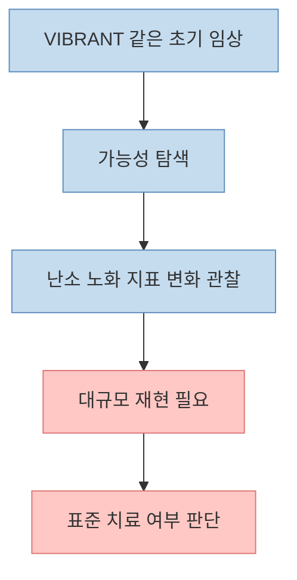
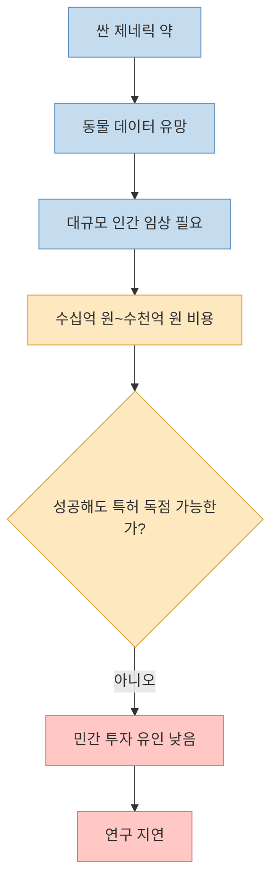

노화 연구가 흥미로운 이유는 단순히 “오래 사는 법”을 찾기 때문이 아닙니다. 더 중요한 질문은 **왜 어떤 장기는 더 빨리 늙고, 왜 어떤 약은 동물에서 유망해도 사람에게는 늦게 오는가** 입니다. 이 영상은 좀비 세포, 젊은 피, 장기별 노화 시계, 라파마이신 같은 주제를 한 번에 묶어 보여 줍니다. 다만 이런 주제는 과장이 많기 때문에, 동물 실험·초기 임상·확립된 인간 근거를 나눠서 보는 것이 중요합니다.

<!--more-->

## Sources

- ["142세까지 산다고요?", "1알에 1000원짜리 약이 수명을 38% 늘렸다" 그런데 왜 우리는 못 쓸까, 역노화](https://youtu.be/ipBXueFRMrc)
- [NIH — Tracking organ aging and disease](https://www.nih.gov/news-events/nih-research-matters/tracking-organ-aging-disease)
- [Nature — Organ aging signatures in the plasma proteome track health and disease](https://www.nature.com/articles/s41586-023-06802-1)
- [FDA — Update to Important Information about Young Donor Plasma Infusions Offered for Profit](https://www.fda.gov/vaccines-blood-biologics/safety-availability-biologics/update-important-information-about-young-donor-plasma-infusions-offered-profit)
- [Nature — Rapamycin fed late in life extends lifespan in genetically heterogeneous mice](https://www.nature.com/articles/nature08221)
- [American Federation for Aging Research — TAME Trial](https://www.afar.org/tame-trial?token=ZITucLcZA6ADhSwVBG5IfqhnxslZg7Yriagg-biological-sciences-programscientific-awardsiagg-biological-sciences-programscientific-awardsscientific-awardsscientific-awardsiagg-biological-sciences-programscientific-awards)
- [Columbia University — Studying Ovaries to Understand How We All Age](https://www.cuimc.columbia.edu/node/28803)
- [Columbia OBGYN Annual Report — Ground-breaking Clinical Trial Explores Delaying Menopause](https://reports.obgyn.columbia.edu/2024-annual-report/ground-breaking-clinical-trial-explores-delaying-menopause/)

## 1. 좀비 세포는 왜 노화 연구의 핵심 키워드가 됐나

영상은 죽지도 않고 정상적으로 일하지도 않으면서 주변 세포에 악영향을 주는 “좀비 세포” 이야기로 시작합니다. 과학적으로는 주로 **세포 노화(cellular senescence)** 상태의 세포를 가리키는 비유입니다. 이런 세포는 더 이상 증식하지 않지만, 주변으로 염증성 신호와 단백질을 분비해 조직 환경을 바꿀 수 있습니다. [영상 0분 부근](https://youtu.be/ipBXueFRMrc?t=0)

이 영상의 표현은 다소 자극적이지만, 핵심 방향은 맞습니다. 노화 세포는 나이 들수록 축적될 수 있고, 일부 상황에서는 조직 기능 저하와 만성 염증에 관여하는 것으로 연구됩니다. 다만 이 세포가 무조건 나쁘기만 한 것은 아닙니다. 젊을 때는 상처 치유, 종양 억제 같은 보호적 역할도 할 수 있습니다.

즉, “좀비 세포를 다 죽이면 무조건 젊어진다”는 식의 단순한 결론은 위험합니다. 어떤 조직에서, 어떤 시점에, 어떤 질환 맥락에서 제거가 도움이 되는지가 더 중요합니다.

## 2. 우리 몸은 한꺼번에 늙지 않는다: 장기별 생물학적 나이

영상은 같은 사람 몸 안에서도 장기마다 늙는 속도가 다를 수 있다고 설명합니다. 이 부분은 최근 노화 연구의 중요한 흐름과 맞닿아 있습니다. [영상 3분 부근](https://youtu.be/ipBXueFRMrc?t=180)

NIH는 혈액 속 단백질을 이용해 11개 장기의 “장기별 나이”를 추정할 수 있다는 Stanford 주도 연구를 소개했습니다. 이 연구는 특정 장기가 더 빠르게 늙는 패턴이 향후 질병 및 사망 위험과 관련될 수 있음을 보여 줍니다. [NIH](https://www.nih.gov/news-events/nih-research-matters/tracking-organ-aging-disease)

Nature에 실린 원 논문도 혈장 단백질을 이용해 11개 주요 장기의 노화 서명을 추적했다고 설명합니다. [Nature organ aging](https://www.nature.com/articles/s41586-023-06802-1)

이 개념이 중요한 이유는 노화를 “몇 살이냐”가 아니라 “어느 시스템이 먼저 흔들리고 있느냐”로 볼 수 있게 해 주기 때문입니다. 실제 건강관리에서도 모든 사람이 같은 방식으로 늙는다고 가정하는 것보다 훨씬 현실적입니다.

## 3. 난소는 왜 노화 연구에서 특별한 장기인가

영상은 난소가 가장 먼저 늙는 장기 중 하나라고 말합니다. 이 부분은 Columbia 연구진이 강조해 온 문제의식과도 연결됩니다. [영상 3분 부근](https://youtu.be/ipBXueFRMrc?t=180)

Columbia University Irving Medical Center는 난소를 “몸에서 가장 빨리 노화하는 장기”로 설명하며, 난소 노화가 생식 문제뿐 아니라 심혈관질환, 치매, 우울, 조기 사망 위험과도 연결될 수 있다고 소개합니다. [Columbia](https://www.cuimc.columbia.edu/node/28803)

이 때문에 난소는 단지 생식기관이 아니라, 여성의 전신 노화를 읽는 중요한 창으로 여겨집니다. 다만 이것이 곧 “난소 노화를 늦추는 약이 곧바로 전신 회춘 약”이라는 뜻은 아닙니다. 연결 고리는 유망하지만, 사람에서 장기적 효과를 확인하는 연구가 더 필요합니다.

## 4. 젊은 피는 진짜 회춘일까? 동물 실험과 상업화는 다른 문제다

영상은 늙은 쥐와 젊은 쥐의 피를 섞는 실험, 그리고 그 결과로 노화가 전염되는 것처럼 보였다는 이야기를 다룹니다. [영상 9분 부근](https://youtu.be/ipBXueFRMrc?t=540)

이 분야에는 실제로 **heterochronic parabiosis** 같은 동물 연구가 존재합니다. 하지만 동물에서 나온 흥미로운 결과가 곧바로 사람의 회춘 치료가 되지는 않습니다. 특히 “젊은 혈장 수혈로 노화를 늦출 수 있다”는 상업적 주장은 근거가 매우 약합니다.

FDA는 2019년 젊은 공여자의 혈장 주입을 영리 목적으로 제공하는 업체들에 대해 경고했고, 2024년 12월에도 업데이트 공지를 냈습니다. FDA는 이런 시술이 노화 예방이나 기억력 저하 방지 등에 임상적 이득이 있다는 근거를 알지 못하며, 감염, 알레르기, 호흡기 합병증 등 위험이 있을 수 있다고 분명히 밝혔습니다. [FDA](https://www.fda.gov/vaccines-blood-biologics/safety-availability-biologics/update-important-information-about-young-donor-plasma-infusions-offered-profit)

즉, “젊은 피”는 연구실 주제로는 의미가 있지만, 현재 임상에서 검증된 회춘 치료로 받아들이면 안 됩니다.

## 5. 라파마이신은 왜 자꾸 주목받나

영상은 저렴한 약이 쥐 수명을 28~38% 늘렸다고 소개하는데, 이 수치는 주로 **라파마이신의 생쥐 연구** 와 연결됩니다. [영상 12분 부근](https://youtu.be/ipBXueFRMrc?t=720)

Nature 2009 논문은 유전적으로 다양한 생쥐에서, 생애 후반에 시작한 라파마이신 급여가 수명을 연장했다고 보고했습니다. [Nature rapamycin](https://www.nature.com/articles/nature08221)

여기서 매우 중요한 점은 두 가지입니다.

1. 이 결과는 **생쥐** 에서 나온 것입니다.
2. 수명 연장은 곧바로 **사람의 안전하고 효과적인 항노화 약** 이라는 뜻이 아닙니다.

영상이 전달하려는 메시지 중 상당 부분은 맞습니다. 유망한 노화 표적 약이 존재하고, 그중 일부는 아주 오래된 약입니다. 하지만 사람에서 누가, 어떤 용량으로, 얼마나 오래, 어떤 이득과 위험을 감수하며 써야 하는지는 여전히 열린 질문입니다.

## 6. 여성 난소 노화와 라파마이신: 기대는 크지만 아직 진행형이다

영상은 35~45세 여성에게 저용량 라파마이신을 주 1회, 3개월 투여했더니 난포 손실이 줄고 난소 노화가 늦어졌다고 소개합니다. [영상 12분 부근](https://youtu.be/ipBXueFRMrc?t=720)

이 부분은 Columbia의 **VIBRANT** 연구와 연결됩니다. Columbia OBGYN 연례 보고서는 VIBRANT를 라파마이신이 난소 노화를 늦출 가능성을 탐색하는 첫 시도 중 하나로 소개합니다. [Columbia OBGYN](https://reports.obgyn.columbia.edu/2024-annual-report/ground-breaking-clinical-trial-explores-delaying-menopause/)

하지만 여기서도 해석은 보수적이어야 합니다.

- 아직 대규모 표준 진료로 자리 잡은 치료가 아닙니다.
- 장기적인 안전성과 실제 임상적 이득은 더 확인되어야 합니다.
- “가임 기간 5년 연장” 같은 수치는 영상이나 기관 소개에서 제시되는 초기 추정일 수 있으므로, 확정적 사실처럼 받아들이면 안 됩니다.

즉, 이 연구는 흥미롭고 중요한 방향이지만, 당장 일반인이 따라 쓸 수 있는 항노화 처방으로 보면 안 됩니다.

## 7. 가장 아이러니한 문제: 싸서 못 쓰는 약들

영상 후반의 핵심은 과학보다 경제입니다. 약이 비싸서 못 쓰는 것이 아니라, **너무 싸서 대규모 임상 투자를 못 받는 역설** 이 있다는 것입니다. [영상 15분 부근](https://youtu.be/ipBXueFRMrc?t=900)

이 지점에서 메트포르민의 TAME trial이 자주 언급됩니다. AFAR의 TAME는 약 3,000명의 65~79세 비당뇨 노인을 대상으로 메트포르민이 여러 연령 관련 질환의 발생을 늦출 수 있는지 시험하려는 대표 프로젝트입니다. [AFAR TAME](https://www.afar.org/tame-trial?token=ZITucLcZA6ADhSwVBG5IfqhnxslZg7Yriagg-biological-sciences-programscientific-awardsiagg-biological-sciences-programscientific-awardsscientific-awardsiagg-biological-sciences-programscientific-awards)

이런 저가 제네릭 약은 성공하더라도 특허 독점으로 큰 수익을 얻기 어렵습니다. 그래서 기전이 흥미롭고 동물 데이터가 좋아도, 막상 수천 명 단위 인간 임상으로 가는 길은 느립니다.

그래서 노화 의학의 병목은 “과학이 아무것도 모른다”가 아니라, **좋은 가설을 사람에게 검증할 경제적 구조가 약하다** 는 데 있기도 합니다.

## 핵심 요약

- 영상의 “좀비 세포”는 주로 세포 노화 상태를 비유하는 표현으로, 실제로 노화와 만성 염증 연구의 핵심 주제입니다.
- 인간은 장기마다 다른 속도로 늙을 수 있으며, 혈장 단백질을 이용한 11개 장기 노화 추적 연구가 이미 발표되었습니다.
- 난소는 빠르게 노화하는 장기 중 하나로 여겨지며, 전신 노화 연구의 중요한 창이 되고 있습니다.
- 젊은 혈장 주입은 현재 임상적으로 검증된 회춘 치료가 아니며, FDA는 영리 목적의 젊은 혈장 시술에 대해 경고했습니다.
- 라파마이신은 생쥐에서 수명 연장 결과가 매우 유명하지만, 사람의 표준 항노화 치료로 확정된 것은 아닙니다.
- Columbia의 VIBRANT 같은 연구는 유망하지만, 아직 초기 단계의 가능성 탐색으로 봐야 합니다.
- 노화 의학이 느린 이유 중 하나는 저렴한 제네릭 약들이 대규모 인간 임상을 수행할 경제적 인센티브가 약하다는 점입니다.

## 결론

노화 연구는 생각보다 훨씬 많이 진전됐습니다. 문제는 “회춘 기술이 전혀 없다”가 아니라, **동물에서 유망한 결과를 사람에게 안전하고 공정하게 옮기는 과정이 매우 느리다** 는 데 있습니다.

좀비 세포, 장기별 노화 시계, 라파마이신, 메트포르민 같은 주제는 분명 중요합니다. 하지만 지금 단계에서 필요한 태도는 열광도 냉소도 아닙니다. 어떤 것은 동물 실험 수준인지, 어떤 것은 초기 임상인지, 어떤 것은 이미 규제기관이 경고한 상업적 과장인지 구분해서 보는 것입니다.

노화 의학의 진짜 질문은 “몇 살까지 살 수 있나”보다, **누가 더 건강하게 늙고, 그 기술이 누구에게 언제 어떻게 도달할 수 있나** 에 가깝습니다.
