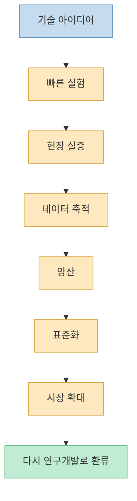
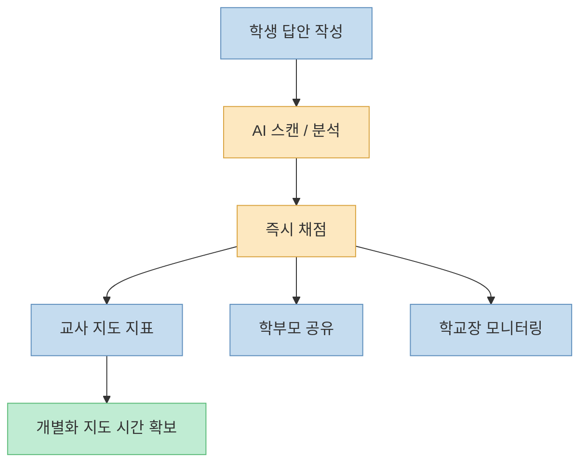
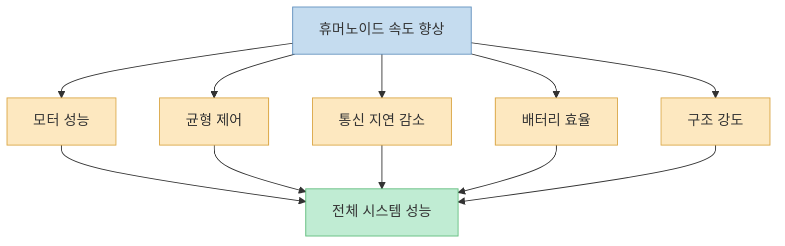
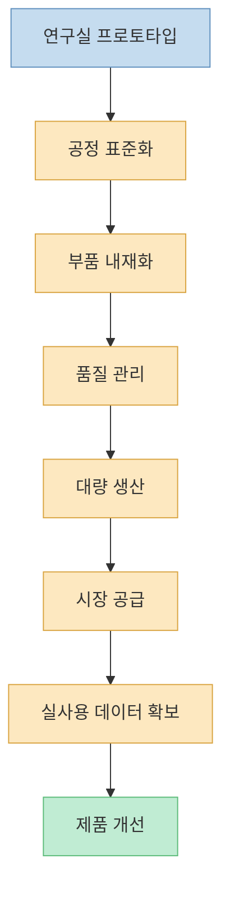
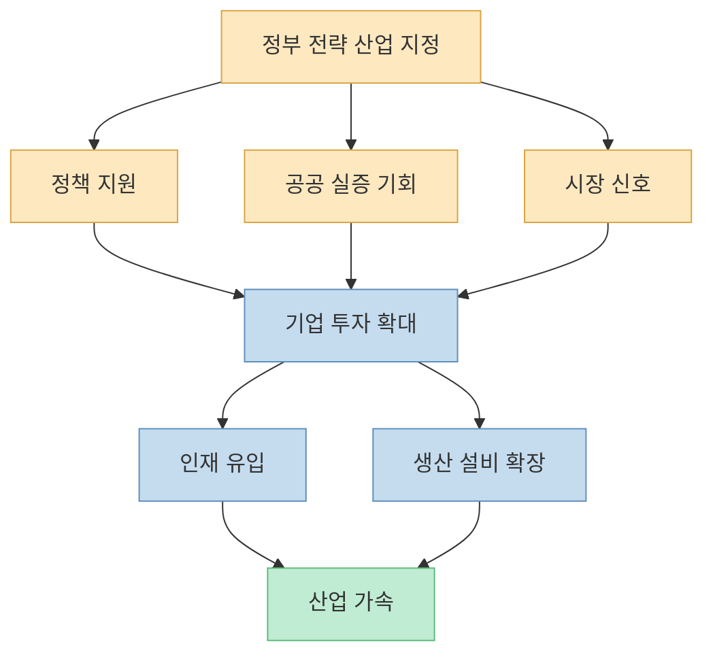
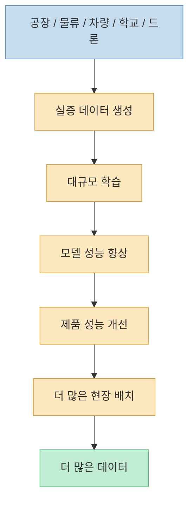
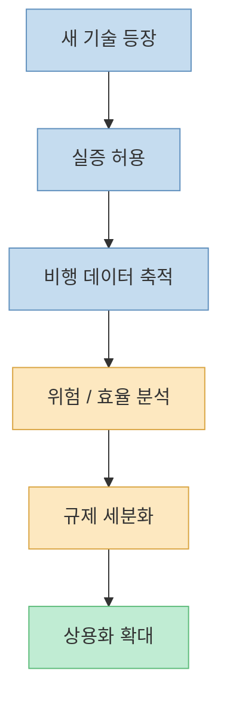
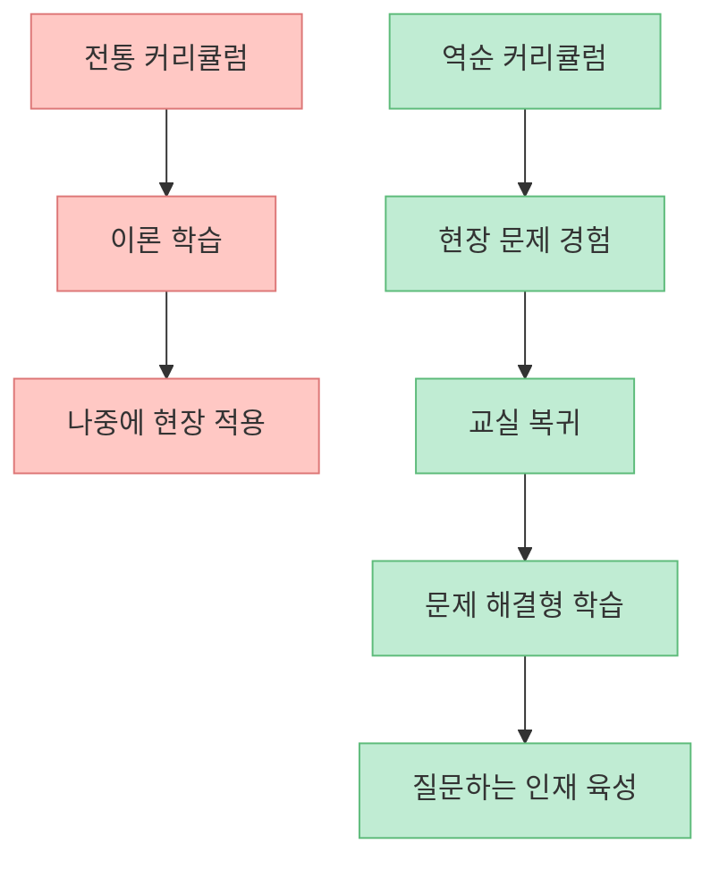
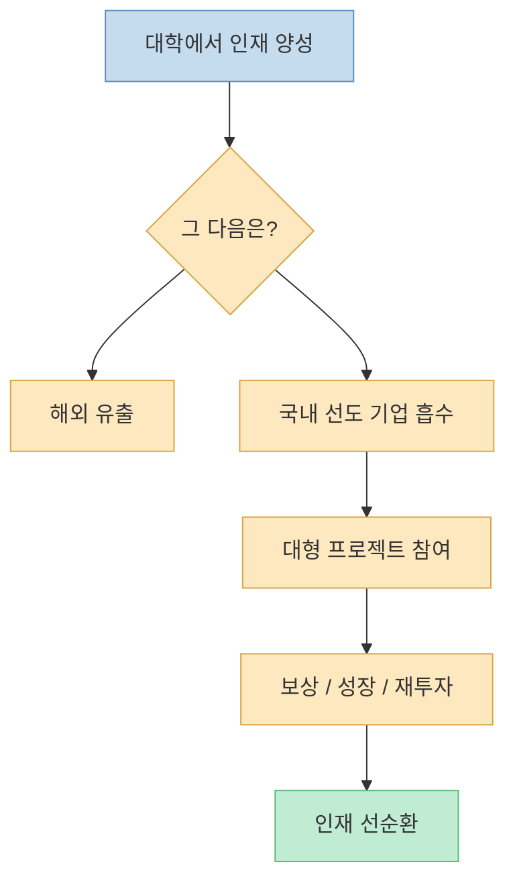

중국의 기술 굴기는 흔히 로봇, 드론, 전기차, 태양열 발전 같은 결과물로만 보입니다. 하지만 이 다큐가 더 집요하게 보여 주는 것은 결과물 뒤의 구조입니다. **중국의 속도를 만드는 것은 단일 기술이 아니라, 인재를 빨리 훈련시키고 산업 현장으로 밀어 넣고 다시 데이터와 정책으로 되먹이는 시스템** 입니다.

<!--more-->

## Sources

- [전 세계가 주목하는 중국의 첨단기술, 그 중심에는 결국 ‘인재’가 있다](https://youtu.be/0-nPEj6euio)

## 1. 차이나 스피드는 기술 목표가 아니라 속도 자체가 전략이다

다큐는 중국 기술 전략의 핵심 감각을 “더 빠르게”라는 단어로 요약합니다. 과거 목표가 서방의 과학기술을 따라잡는 것이었다면, 이제는 추격을 넘어 추월을 말합니다. [영상 0분 부근](https://youtu.be/0-nPEj6euio?t=0)

여기서 중요한 것은 속도가 단순한 구호가 아니라는 점입니다. 속도는 연구개발, 규제, 생산, 교육, 실증, 표준화까지 모두 포함하는 시스템 목표로 작동합니다. 즉 “좋은 기술 하나”보다 “빨리 시험하고 빨리 양산하고 빨리 시장을 만드는 체계”가 더 중요하게 취급됩니다.

이 구조에서는 기술의 완성도만큼이나 **속도를 방해하지 않는 제도** 가 중요합니다. 그래서 중국식 기술 발전을 이해하려면 연구소보다 정책과 교육, 생산기지를 함께 봐야 합니다.

## 2. 학교는 지식 전달보다 실시간 피드백 공장으로 변하고 있다

다큐 초반부는 중국 교실의 변화를 보여 줍니다. 학생이 쓴 장문 답안을 AI가 빠르게 스캔하고 문맥과 구성을 분석해 채점하며, 그 결과가 학교장과 학부모, 교사에게 즉시 전달됩니다. 교사는 채점 노동을 덜고 학생과의 개별 상호작용에 시간을 더 쓰게 됩니다. [영상 3분 부근](https://youtu.be/0-nPEj6euio?t=180)

이 장면의 핵심은 AI 자체보다 **교육의 피드백 속도** 입니다. 기존에는 과제를 제출하고, 사람이 읽고, 점수를 매기고, 피드백이 전달되기까지 시간이 오래 걸렸습니다. 그런데 자동화된 평가 시스템은 학습과 피드백의 간격을 크게 줄입니다.

또한 정규 정보과학 수업에서 로봇이 함께 들어오고, 체험 중심 AI 수업을 통해 학생이 기술을 “배운다”기보다 “만진다”는 점도 중요합니다. 이건 단순한 시연이 아니라 기술 친숙성을 일찍부터 생활화하는 전략으로 읽을 수 있습니다.

## 3. 로봇 마라톤이 보여 주는 것: 속도 경쟁은 시스템 통합 경쟁이다

다큐는 세계 유일의 로봇 마라톤 대회를 소개합니다. 20km가 넘는 코스를 달리는 자율주행·원격조정 로봇들이 배터리, 모터, 균형, 열관리, 자율 판단을 한꺼번에 시험받습니다. [영상 6분 부근](https://youtu.be/0-nPEj6euio?t=360)

여기서 핵심은 “누가 제일 빨리 달리느냐”가 아닙니다. 다큐 속 개발자도 속도 그 자체보다, 속도를 통해 시스템의 강도, 통신, 에너지 밀도, 제어 성능을 한꺼번에 밀어붙인다고 설명합니다. [영상 12분 부근](https://youtu.be/0-nPEj6euio?t=720)

이건 중국 기술전략의 중요한 특징을 드러냅니다. 특정 부품 하나의 성능보다, **여러 기술을 동시에 통합하고 실제 환경에서 빨리 시험하는 능력** 이 경쟁력의 중심이라는 점입니다.

## 4. 양산 능력은 연구 성과를 산업 지배력으로 바꾸는 변환기다

다큐는 휴머노이드 공장 장면에서 “자동차 제조 기술을 로봇 생산에 적용한다”는 점을 보여 줍니다. 표준화된 생산과 품질 통제를 통해 대량 생산으로 넘어가고, 그것이 다시 시장을 만들고 고객을 확보하는 구조입니다. [영상 15분 부근](https://youtu.be/0-nPEj6euio?t=900)

이 지점은 매우 중요합니다. 기술 패권은 발명만으로 생기지 않습니다. 발명을 빠르게 **공정·부품·품질관리·유통** 의 언어로 번역할 수 있어야 실제 지배력이 됩니다.

중국의 강점은 바로 이 변환 속도입니다. 실험실의 기술을 “시범 제품” 수준에서 멈추지 않고, 곧바로 시장이 있는 산업제품으로 바꾸는 능력이 강합니다.

## 5. 정부는 기술을 지원하는 것이 아니라 시장 자체를 먼저 만든다

다큐는 중국 공산당의 정책이 휴머노이드와 피지컬 AI의 시장을 만들어 준다고 설명합니다. 이는 단순한 보조금 정책이 아니라, 기업과 엔지니어에게 “이 분야는 미래 시장이 확실하다”는 신호를 주는 방식입니다. [영상 18분 부근](https://youtu.be/0-nPEj6euio?t=1080)

이 구조에서는 연구자와 기업이 기술 위험만 계산하는 것이 아니라, **시장 불확실성이 이미 줄어든 상태** 에서 움직일 수 있습니다. 시장이 열릴 것이라는 정책적 확신은 인재 유입, 투자 확대, 생산설비 증설을 동시에 촉진합니다.

다큐가 강조하는 “차이나 스피드”는 바로 여기서 나옵니다. 기술은 시장 안에서 자라는데, 그 시장을 기다리지 않고 **먼저 설계해 버리는 것** 이죠.

## 6. 데이터가 많을수록 AI가 강해지고, 현장이 곧 학습장이 된다

다큐는 자율주행차와 휴머노이드의 예를 통해, AI 학습의 질과 양을 결정하는 것은 결국 데이터라고 설명합니다. 중국 자동차 기업 전체의 주행 데이터를 합치면 테슬라보다 많을 수 있다는 식의 설명도 이 맥락에서 등장합니다. [영상 21분 부근](https://youtu.be/0-nPEj6euio?t=1260)

여기서 중요한 건 단순한 데이터 양이 아니라, **실제 현장에서 반복적으로 생성되는 대규모 데이터 파이프라인** 입니다. 공장, 물류센터, 자동차, 드론, 학교가 모두 데이터 생성 장치가 되는 순간, 국가 전체가 하나의 거대한 학습장으로 바뀝니다.

AI 경쟁은 결국 “누가 더 좋은 모델을 만들었는가”만이 아니라 “누가 더 좋은 데이터를 더 빨리 더 많이 순환시킬 수 있는가”의 경쟁이기도 합니다.

## 7. 드론과 저공경제: 규제를 늦추는 것이 아니라 기술과 같이 움직인다

다큐 후반은 드론 택시와 해양 드론 사례를 통해 중국의 저공경제 전략을 보여 줍니다. 핵심은 규제를 모두 완성한 뒤 산업을 열겠다는 방식이 아니라, 새로운 기술에 대해 비교적 우호적인 태도로 실증과 데이터를 먼저 쌓아 간다는 점입니다. [영상 27분~30분 부근](https://youtu.be/0-nPEj6euio?t=1620)

이 방식은 위험도 있습니다. 하지만 기술 발전 속도만 놓고 보면 매우 강력한 전략입니다. 규제가 실험의 선행조건이 아니라, **실험과 함께 진화하는 후행 구조** 에 가깝기 때문입니다.

그래서 중국의 드론 경쟁력은 기체 성능만이 아니라, **더 많은 비행과 더 많은 시행착오를 허용하는 환경** 에서 나옵니다.

## 8. 교육은 교실 안이 아니라 산업 현장에서 완성된다

다큐에서 가장 인상적인 장면 중 하나는 칭화대의 실험적 교육 프로그램입니다. 학생들이 먼저 산업 현장의 문제를 경험하고, 그 뒤에 교실로 돌아와 해답을 찾는 역순 커리큘럼을 운영합니다. [영상 39분 부근](https://youtu.be/0-nPEj6euio?t=2340)

이 교육 방식은 전통적인 “이론 먼저, 현장 나중” 패턴을 뒤집습니다. 문제를 먼저 보고 배우면, 학생은 지식을 암기 대상이 아니라 해결 도구로 받아들입니다.

이 구조는 결국 인재를 더 빨리 실전에 연결합니다. 다큐가 말하는 인재전쟁은 단순히 명문대 입학생을 많이 확보하는 싸움이 아니라, **문제를 보고 즉시 해결 구조로 들어갈 수 있는 사람을 얼마나 빠르게 길러내느냐** 의 싸움입니다.

## 9. 좋은 대학보다 좋은 산업이 인재를 붙잡는다

다큐는 BYD 같은 기업으로 인재가 자연스럽게 흘러가는 장면도 보여 줍니다. 대학이 키운 인재가 중국의 유력 기업으로 향하는 이유는 단순한 애국심이 아니라, 실제로 세계 선도 기업 수준의 프로젝트와 보상, 성장 경로가 국내에 존재하기 때문입니다. [영상 42분~45분 부근](https://youtu.be/0-nPEj6euio?t=2520)

이건 중요한 시사점입니다. 인재는 교육만으로 남지 않습니다. **실력을 써 볼 수 있는 산업과 시장** 이 있어야 남습니다.

결국 “인재 확보”는 교육 정책만으로 해결되지 않습니다. 산업정책, 기술정책, 보상체계, 국가적 프로젝트가 같이 움직여야 합니다.

## 핵심 요약

- 중국의 기술 경쟁력은 개별 기술보다 **빠른 실험-양산-시장화 시스템** 에서 나온다.
- 학교는 AI 채점과 로봇 체험 수업을 통해 피드백 속도와 기술 친숙성을 높이고 있다.
- 로봇 마라톤은 단순한 홍보 이벤트가 아니라, 배터리·통신·제어·구조를 동시에 시험하는 시스템 경쟁이다.
- 중국의 강점은 연구실 기술을 곧바로 표준화·양산화해 시장 제품으로 바꾸는 속도에 있다.
- 정부는 기술을 지원하는 수준을 넘어, 전략 산업의 **미래 시장 자체를 먼저 만들어 준다.**
- 공장, 차량, 드론, 학교는 모두 데이터 생성 장치가 되고, 이는 AI 학습 가속으로 이어진다.
- 규제는 기술보다 먼저 완성되는 것이 아니라, 실증과 함께 움직이며 차이나 스피드를 만든다.
- 대학 교육도 산업 현장의 문제를 먼저 경험하게 하는 방식으로 바뀌고 있다.
- 인재를 붙잡는 힘은 대학 순위보다, 결국 **실력을 발휘할 수 있는 국내 산업 생태계** 에서 나온다.

## 결론

중국의 속도를 단순히 “국가가 밀어붙이기 때문”이라고만 보면 절반만 본 셈입니다. 더 중요한 것은 교육, 실증, 생산, 데이터, 시장, 기업 채용이 하나의 파이프라인처럼 이어져 있다는 점입니다.

차이나 스피드의 진짜 엔진은 로봇도 드론도 전기차도 아닙니다. **그 기술들이 쉬지 않고 밖으로 나올 수 있게 만드는 인재 시스템** 입니다.

결국 인재전쟁은 좋은 사람을 뽑는 경쟁이 아니라, **좋은 사람이 가장 빨리 실전에 연결되고 가장 오래 머물고 싶어지는 구조를 누가 먼저 만드느냐의 경쟁** 입니다.
