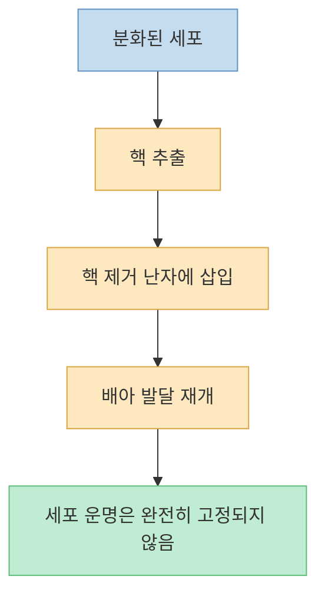
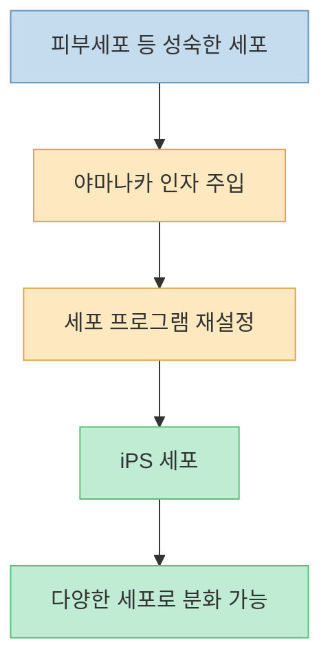
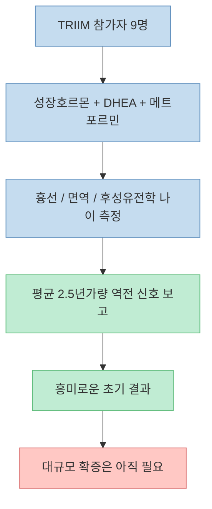
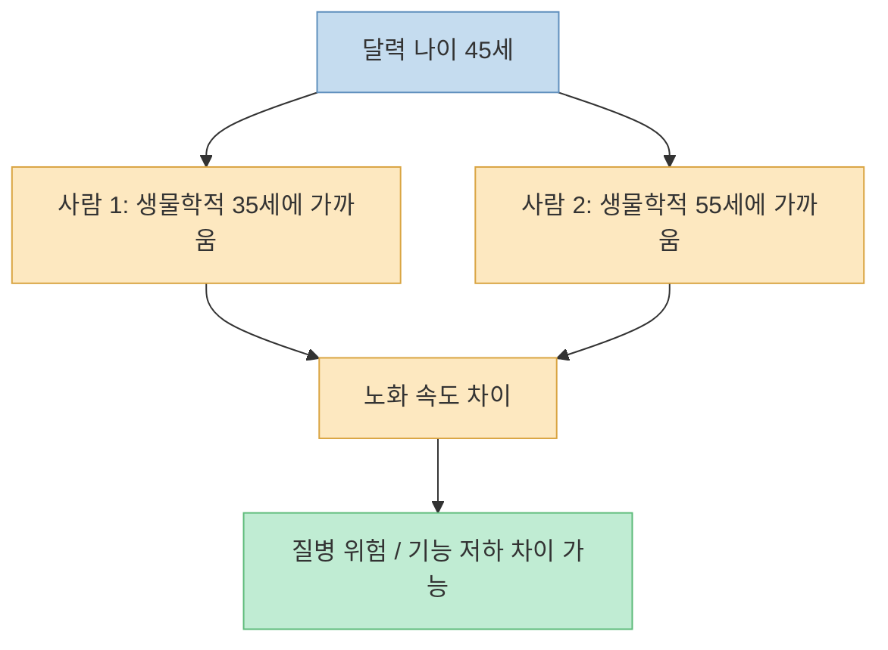
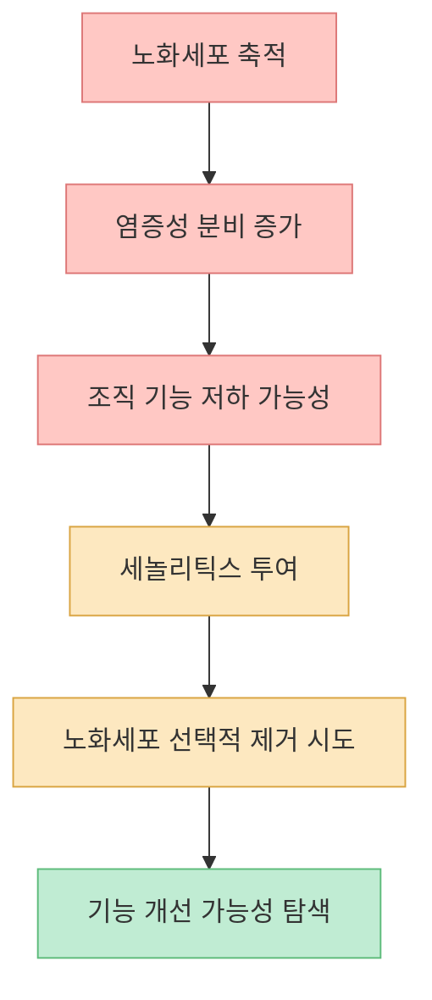
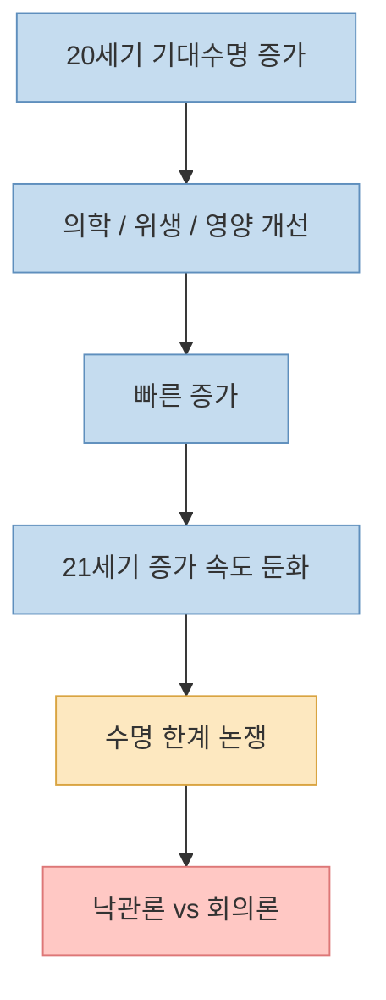
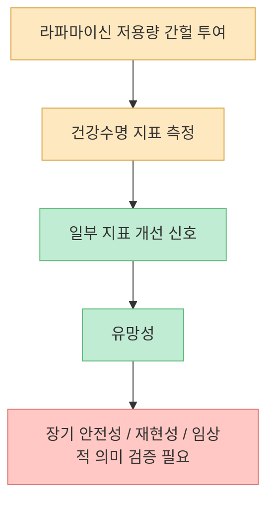
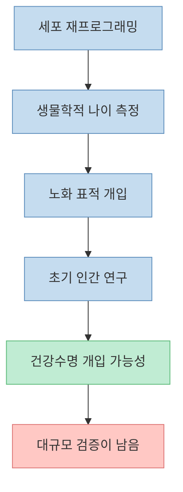

노화 역전 연구는 늘 과장과 희망이 섞여 있습니다. 어떤 뉴스는 인간이 곧 140세까지 살 것처럼 말하고, 어떤 연구는 1년 만에 생물학적 나이를 되돌렸다고 주장합니다. 중요한 것은 흥분하거나 비웃는 것이 아니라, **무엇이 세포 수준의 가능성인지, 무엇이 초기 인간 연구인지, 무엇이 아직 논쟁 중인지 구분하는 것** 입니다.

<!--more-->

## Sources

- [9명이 1년 만에 2.5살 어려졌습니다](https://youtu.be/cFoYmYO0Rmg)
- [Nobel Prize — John Gurdon Facts](https://www.nobelprize.org/prizes/medicine/2012/gurdon/facts/)
- [Nobel Prize — Shinya Yamanaka Facts](https://www.nobelprize.org/prizes/medicine/2012/yamanaka/facts/)
- [Aging Cell — Reversal of epigenetic aging and immunosenescent trends in humans](https://onlinelibrary.wiley.com/doi/10.1111/acel.13028)
- [ClinicalTrials.gov — TRIIM-X](https://clinicaltrials.gov/study/NCT04375657)
- [Nature Medicine — Senolytic therapy in mild Alzheimer’s disease: a phase 1 feasibility trial](https://www.nature.com/articles/s41591-023-02543-w)
- [Nature Aging — Implausibility of radical life extension in humans in the twenty-first century](https://www.nature.com/articles/s43587-024-00702-3)
- [medRxiv — PEARL Trial Results](https://www.medrxiv.org/content/10.1101/2024.08.21.24312372v4)

## 1. 노화 역전의 출발점: 세포의 운명은 되돌릴 수 있는가

영상은 1962년 존 거든의 개구리 핵치환 실험으로 시작합니다. 분화가 끝난 장세포의 핵을 핵이 제거된 난자에 넣었더니, 다시 올챙이가 만들어졌다는 이야기입니다. [영상 0분 부근](https://youtu.be/cFoYmYO0Rmg?t=0)

이 실험의 의미는 단순한 복제 기술이 아닙니다. **성숙한 세포도 적절한 환경을 만나면 초기 상태의 프로그램을 다시 켤 수 있다** 는 가능성을 보여 준 것입니다. 존 거든은 이 공로로 2012년 노벨생리의학상을 받았습니다. [Nobel Prize - Gurdon](https://www.nobelprize.org/prizes/medicine/2012/gurdon/facts/)

이 발견은 “노화는 무조건 한 방향”이라는 직관에 처음 균열을 냈습니다. 다만 여기서 바로 “사람도 젊어질 수 있다”로 뛰어넘으면 과장입니다. 이건 가능성의 시작점이지, 인간 치료의 완성형이 아니었습니다.

## 2. 야마나카 인자는 왜 혁명이었나

영상은 이어서 야마나카 신야의 연구를 다룹니다. 그는 배아세포 상태를 만드는 데 필요한 수많은 인자가 아니라, 단 4개의 전사인자 조합으로 성숙한 세포를 유도만능줄기세포(iPS cell) 상태로 되돌릴 수 있음을 보여 줬습니다. [영상 3분 부근](https://youtu.be/cFoYmYO0Rmg?t=180)

야마나카도 2012년 거든과 함께 노벨상을 받았습니다. [Nobel Prize - Yamanaka](https://www.nobelprize.org/prizes/medicine/2012/yamanaka/facts/)

이 실험은 세포의 정체성이 생각보다 훨씬 유연하다는 것을 보여 줬습니다. 노화 역전 연구가 오늘날까지 이어지는 이유도 바로 이 지점입니다. 생물학적 상태는 완전히 고정된 것이 아니라, **일부는 다시 프로그래밍할 수 있다** 는 사실이 드러났기 때문입니다.

## 3. TRIIM: 9명이 1년 만에 2.5살 어려졌다는 말은 정확히 무엇을 뜻하나

영상 제목의 핵심은 TRIIM 실험입니다. 51~65세 건강한 남성 9명을 대상으로 성장호르몬, DHEA, 메트포르민 조합을 사용해 흉선 재생과 면역 노화, 후성유전학적 나이 변화를 본 연구입니다. [영상 6분 부근](https://youtu.be/cFoYmYO0Rmg?t=360)

Aging Cell에 발표된 2019년 논문은 흉선 지방 감소, 면역 지표 변화, 그리고 여러 DNA methylation clock에서 평균 약 2.5년 정도의 epigenetic age reversal 신호가 관찰됐다고 보고했습니다. [Aging Cell](https://onlinelibrary.wiley.com/doi/10.1111/acel.13028)

하지만 여기에는 반드시 붙여야 할 제한점이 있습니다.

- 참가자가 **9명** 으로 매우 적습니다.
- 대조군이 없는 초기 연구입니다.
- 전원 건강한 중년 남성으로 표본이 좁습니다.
- 측정된 것은 **달력 나이 감소가 아니라 후성유전학적 나이 지표 변화** 입니다.

즉 “1년 만에 2.5살 어려졌다”는 문장은 엄밀히 말하면 **특정 후성유전학 시계 기준으로 그렇게 계산된 초기 연구 결과** 입니다. 사람 전체가 임상적으로 젊어졌다는 확정 판정은 아닙니다.

## 4. 호바스 시계가 바꾼 것: 나이는 하나가 아니다

영상은 스티브 호바스의 후성유전학적 시계를 중요한 분기점으로 다룹니다. DNA 메틸화 패턴을 통해 생물학적 나이를 추정하고, 같은 45세라도 세포 수준에서는 더 젊거나 더 늙을 수 있다는 개념을 설명합니다. [영상 6분 부근](https://youtu.be/cFoYmYO0Rmg?t=360)

이 개념이 중요한 이유는 “노화”가 단순히 생일 케이크 위 숫자가 아니라는 사실을 보여 주기 때문입니다.

이 때문에 노화 역전 연구는 수명만 보는 것이 아니라, **생물학적 나이 지표·면역 기능·근육·인지·염증** 같은 건강수명 지표를 함께 봅니다.

## 5. 세놀리틱스: 좀비세포만 골라 죽이는 전략

영상은 중반부에서 다사티닙과 퀘르세틴 조합을 “세놀리틱스”로 소개합니다. 노화세포, 이른바 좀비세포를 선택적으로 제거하려는 접근입니다. [영상 9분 부근](https://youtu.be/cFoYmYO0Rmg?t=540)

Nature Medicine 2023 논문은 경증 알츠하이머 환자에서 다사티닙+퀘르세틴의 **중추신경계 도달 가능성, 안전성, 실행 가능성** 을 보는 1상 수준의 소규모 연구였습니다. [Nature Medicine](https://www.nature.com/articles/s41591-023-02543-w)

이 연구의 해석도 매우 신중해야 합니다.

- 아주 작은 규모의 **feasibility trial** 입니다.
- 효과를 확정하는 치료 시험이 아닙니다.
- “4명에서 뇌척수액 검출” 같은 결과는 약물이 CNS에 도달할 가능성을 시사할 뿐, 알츠하이머 치료 효과를 확정하지 않습니다.

세놀리틱스는 현재 노화 생물학의 중요한 축이지만, 아직 대중이 당장 따라 쓸 수 있는 확립된 회춘 치료와는 거리가 있습니다.

## 6. 인간 수명은 정말 85세 근처에서 멈추고 있는가

영상은 수명 한계 논쟁도 함께 다룹니다. 2024년 Nature Aging에 발표된 S. Jay Olshansky의 논문은 인간 기대수명 증가 속도가 둔화되고 있으며, 급진적 장수의 가능성을 회의적으로 봅니다. [영상 12분 부근](https://youtu.be/cFoYmYO0Rmg?t=720)

Nature Aging 논문은 선진국 기대수명의 증가 속도가 과거보다 둔화됐고, “이번 세기에 극단적인 수명 연장”이 쉽게 오지 않을 수 있다고 주장합니다. [Nature Aging](https://www.nature.com/articles/s43587-024-00702-3)

즉 현재 주류 과학계에서 “곧 누구나 140세까지 산다”는 식의 주장은 아직 합의가 아닙니다. 수명 연장보다 더 강한 합의가 있는 분야는 **건강수명 연장**, 즉 병들지 않고 늦게 쇠약해지는 방향입니다.

## 7. 라파마이신과 PEARL: 방향은 흥미롭지만 아직 최종 답은 아니다

영상 후반은 브라이언 존슨의 사례와 함께 PEARL trial, 라파마이신을 언급합니다. 2024년 medRxiv에 공개된 PEARL 결과는 50~85세 성인 114명에게 48주간 저용량 간헐적 라파마이신을 투여한 연구로 소개됩니다. [영상 15분 부근](https://youtu.be/cFoYmYO0Rmg?t=900)

PEARL은 아직 **preprint** 단계로 이해해야 합니다. medRxiv 버전에서는 일부 지표—예를 들어 여성의 lean tissue mass, 남성의 bone mineral content—개선이 보고되었지만, 이것이 곧바로 장기적 수명 연장이나 임상 표준 처방으로 이어지는 것은 아닙니다. [medRxiv](https://www.medrxiv.org/content/10.1101/2024.08.21.24312372v4)

따라서 라파마이신은 “기적의 회춘약”이라기보다, **가장 주목받는 노화 표적 약물 후보 중 하나** 로 보는 편이 정확합니다.

## 8. 지금 단계에서 가장 현실적인 결론은 무엇인가

이 영상이 흥미로운 이유는 여러 흐름을 한 방향으로 묶기 때문입니다.

- 세포는 생각보다 되돌릴 수 있다
- 생물학적 나이는 측정 가능하다
- 노화세포 제거 같은 기전 접근이 가능하다
- 일부 인간 초기 연구에서 역전 신호가 보인다
- 그러나 대규모 확증과 장기 안전성은 아직 멀었다

즉 노화 역전 연구는 더 이상 공상과학만은 아닙니다. 하지만 아직 “검진센터에서 노화 역전 처방 받는 시대”도 아닙니다. 지금은 가능성의 축이 생겼고, 그것을 임상적으로 믿을 수 있는 수준까지 끌어올리는 과정에 있는 단계입니다.

## 핵심 요약

- 존 거든과 야마나카의 연구는 성숙한 세포도 다시 초기 프로그램을 켤 수 있음을 보여 줬다.
- TRIIM은 9명의 건강한 중년 남성에서 후성유전학적 나이 역전 신호를 보고한 매우 초기 인간 연구다.
- “1년 만에 2.5살 어려졌다”는 표현은 임상적으로 사람이 2.5살 젊어졌다는 뜻이 아니라, 특정 생물학적 나이 지표 변화에 가깝다.
- 세놀리틱스는 노화세포를 표적으로 삼는 유망한 전략이지만, 알츠하이머 등에서 아직 초기 단계다.
- 인간 기대수명 증가 속도는 둔화되고 있으며, 급진적 장수 전망에는 여전히 강한 논쟁이 있다.
- 라파마이신과 PEARL 같은 연구는 방향성이 흥미롭지만, 아직 확정적 표준 치료로 보기는 어렵다.
- 현재 가장 현실적인 기대는 “영생”보다 건강수명 연장, 즉 더 늦게 병들고 더 늦게 쇠약해지는 것이다.

## 결론

노화 역전 연구는 분명히 과거보다 훨씬 진지한 과학이 되었습니다. 세포는 재프로그래밍될 수 있고, 생물학적 나이는 측정할 수 있으며, 일부 개입은 사람에서도 신호를 보이기 시작했습니다.

하지만 그 사실이 곧 “이제 인간은 쉽게 젊어진다”는 뜻은 아닙니다. 지금 단계에서 가장 정직한 표현은 이렇습니다.

**노화는 완전히 고정된 운명이 아닐 수 있다. 하지만 그것을 안전하고 재현 가능한 의학으로 바꾸는 일은 아직 진행 중이다.**
