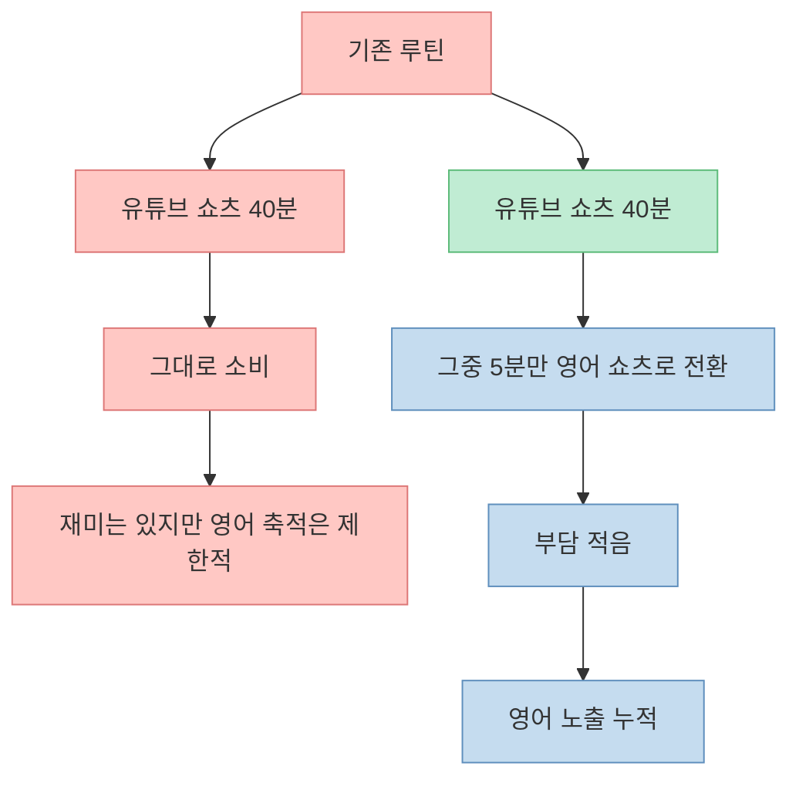
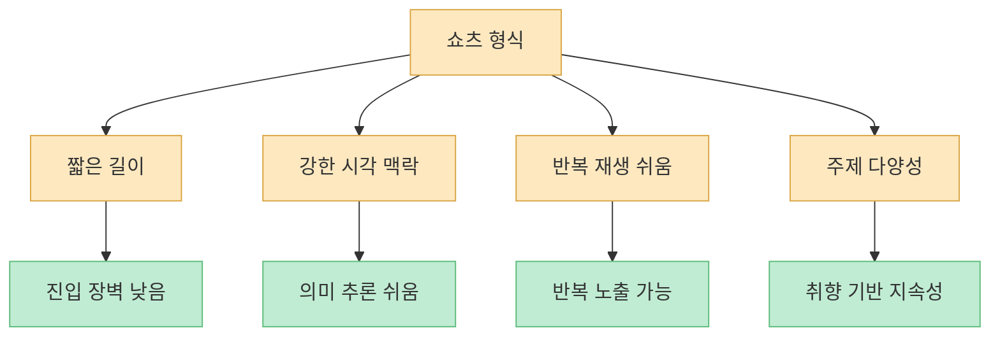
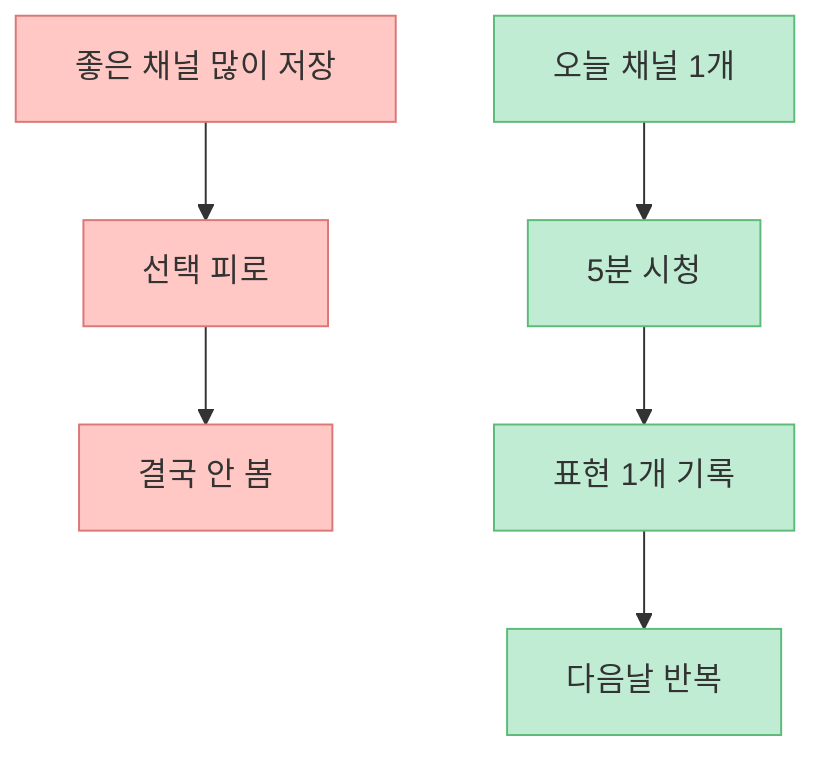
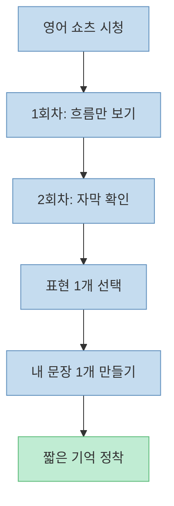
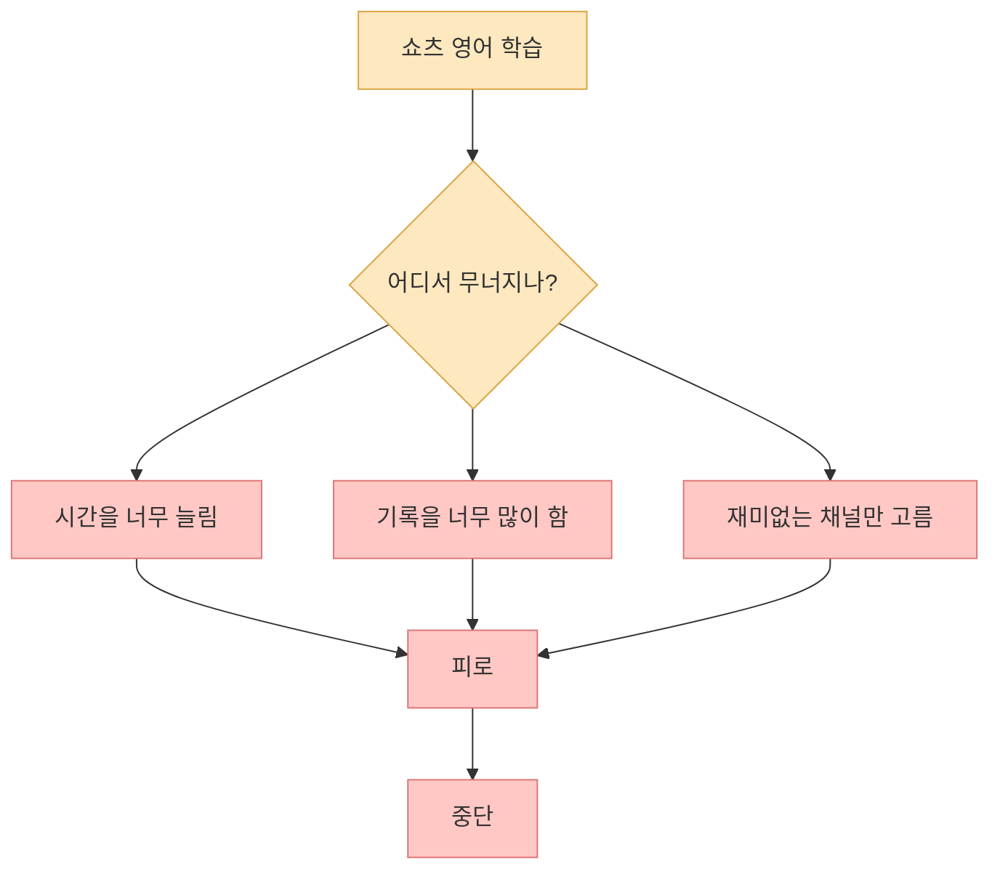
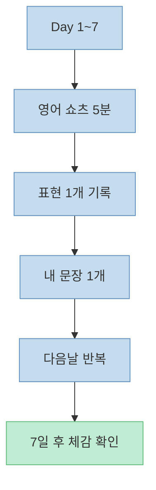

영어 공부는 따로 시간을 내야만 가능한 일이 아닙니다. 오히려 많은 사람에게 더 현실적인 방법은 이미 매일 쓰고 있는 시간을 영어 노출로 조금 바꾸는 것입니다. 이번 Threads 글의 핵심도 바로 그 지점이었습니다. **유튜브 쇼츠를 40분 볼 수 있다면, 그중 5분만 영어로 바꾸는 것이 훨씬 현실적인 시작점** 이라는 것입니다.

<!--more-->

## Sources

- [Threads 원문](https://www.threads.com/@tonytotally001/post/DYeBsQyivru?xmt=AQG00BU9pdgGy6S0HnAU3rsLw7Z_X0V5yiHvWKQeSb71MtVUFkYrrSJUULG4YIAqt5HGyhyh&slof=1)
- [유튜브 쇼츠 영어 채널 검색 링크](https://www.youtube.com/results?search_query=english+shorts+animation+cooking+storytelling+science)

## 1. 이 아이디어가 좋은 이유: 공부 시간을 새로 만드는 게 아니라 갈아끼우기 때문이다

Threads 원문에서 공개 메타 설명으로 확인된 핵심 문장은 이렇습니다.

- "영어 공부할 시간 없다면서 유튜브쇼츠 40분 본 사람?"
- "그중 5분만 영어로 바꿔봐"
- "애니메이션+요리+상식+스토리텔링까지 영상미 쩌는 쇼츠 채널 10개 털어옴"

이 제안이 좋은 이유는 공부법이 거창하지 않기 때문입니다. 대부분의 실패한 영어 계획은 “매일 1시간 공부”처럼 새 블록을 일정표에 넣으려다 무너집니다. 반면 이 방식은 이미 존재하는 소비 시간을 **언어 노출 시간으로 치환** 합니다.

중요한 것은 “영어 공부를 시작한다”보다 “쇼츠 소비의 일부를 영어로 바꾼다”는 발상입니다. 행동 단위가 훨씬 작아지고, 따라서 시작 저항도 크게 줄어듭니다.

## 2. 왜 쇼츠가 영어 입문에 생각보다 잘 맞는가

짧은 영상은 깊이 있는 문법 학습에는 한계가 있지만, 입문 단계의 영어 감각을 만드는 데는 강점이 있습니다.

첫째, **맥락이 강하다.**  
영상·표정·장면 전환 덕분에 뜻을 완벽히 몰라도 내용을 추정할 수 있습니다.

둘째, **반복 진입이 쉽다.**  
3분짜리 강의는 미루기 쉽지만 20~40초짜리 쇼츠는 다시 보기 부담이 적습니다.

셋째, **주제가 다양하다.**  
원문도 애니메이션, 요리, 상식, 스토리텔링을 예로 들었는데, 이건 매우 중요합니다. 사람은 재미있는 주제에는 오래 남습니다.

즉 쇼츠는 완전한 학습 도구라기보다 **영어를 생활 안으로 끌어들이는 입구** 로 보는 것이 가장 정확합니다.

## 3. 중요한 건 10개 채널보다 1개의 반복 가능한 구조다

원문은 “영상미 좋은 쇼츠 채널 10개”를 소개한다고 말합니다. 하지만 실제 행동 변화에는 채널 수보다 **반복 가능한 구조** 가 더 중요합니다.

사람들은 종종 이런 실수를 합니다.

- 좋은 채널 20개를 저장한다
- 당장은 뿌듯하다
- 며칠 뒤 하나도 안 본다

반대로 더 효과적인 구조는 단순합니다.

1. 오늘 볼 영어 쇼츠 채널 1개만 정한다
2. 5분만 본다
3. 가장 인상적인 표현 1개만 남긴다

콘텐츠 큐레이션은 출발점일 뿐입니다. 진짜 차이는 **오늘 한 번 볼 수 있는가** 에서 생깁니다.

## 4. 영어 쇼츠를 볼 때 그냥 보지 말고 이렇게 보자

영어 쇼츠를 한국어 쇼츠 대신 틀어 놓는 것만으로도 노출은 생깁니다. 하지만 조금만 구조를 주면 효과가 훨씬 좋아집니다.

### 1단계: 첫 시청은 그냥 본다

완벽하게 해석하려고 멈추지 말고, 영상의 분위기와 장면 흐름으로 의미를 잡습니다.

### 2단계: 두 번째는 자막과 함께 본다

못 알아들은 단어보다 **반복해서 들리는 표현** 에 집중합니다.

### 3단계: 표현 1개만 적는다

전체 문장을 외우려 하지 말고, 오늘 가장 자주 쓰일 법한 짧은 표현 1개만 남깁니다.

### 4단계: 그 표현으로 짧은 문장 하나 만든다

입력만 하면 금방 잊습니다. 한 줄이라도 직접 써 보면 기억에 남습니다.

이 방식의 장점은 부담이 거의 없다는 것입니다. 긴 문법 공부도, 단어장도, 완벽한 쉐도잉도 필요 없습니다. 대신 **하루 한 표현** 이라는 작은 출력이 생깁니다.

## 5. 쇼츠 기반 영어 학습이 실패하는 패턴도 있다

이 방식도 아무렇게나 하면 쉽게 실패합니다. 대표적인 실패 패턴은 세 가지입니다.

### 1. 너무 많이 보려 한다

5분을 30분으로 늘리는 순간 다시 “공부”가 되어 버리고 피로가 생깁니다.

### 2. 너무 많이 적으려 한다

표현 1개만 남겨도 충분한데, 문장 10개를 정리하려 들면 금방 중단합니다.

### 3. 너무 교육적인 채널만 고른다

재미가 없으면 지속되지 않습니다. 원문이 애니메이션, 요리, 상식, 스토리텔링을 강조한 이유도 여기에 있습니다.

즉 이 시스템의 성공 조건은 “열심히”가 아니라 **작게, 재밌게, 오래** 입니다.

## 6. 요청하신 유튜브 링크는 이렇게 쓰는 것이 가장 실용적이다

이번 Threads 원문은 로그인 제한 때문에 추천 채널 10개 전체를 공개적으로 완전 추출할 수는 없었습니다. 그래서 특정 채널 링크를 임의로 만들어 넣는 대신, 바로 활용 가능한 **유튜브 검색 링크** 를 함께 만드는 것이 가장 안전하고 실용적입니다.

제가 넣은 링크는 아래 검색어를 기반으로 만들었습니다.

- english shorts
- animation
- cooking
- storytelling
- science

바로 열어볼 수 있는 링크:

- [YouTube 검색 링크](https://www.youtube.com/results?search_query=english+shorts+animation+cooking+storytelling+science)

이 링크의 장점은 단순합니다.

- 지금 바로 클릭해서 볼 수 있다
- 취향에 맞는 채널을 직접 고를 수 있다
- 원문 취지인 “재미있는 쇼츠로 영어 노출 바꾸기”와 잘 맞는다

## 7. 가장 현실적인 실행법: 7일 테스트

이 방법이 자기에게 맞는지 확인하려면 거창한 계획보다 **7일 테스트** 가 좋습니다.

### 7일 테스트 규칙

1. 매일 영어 쇼츠 5분만 보기
2. 표현 1개만 남기기
3. 주제는 재미있는 것만 고르기
4. 빠진 날이 있어도 다음날 바로 재개하기

7일만 해 보면 알 수 있습니다. 이 방식이 잘 맞는 사람은 “영어 공부”보다 “영어 소비 습관”이 먼저 생깁니다. 그게 훨씬 중요합니다.

## 핵심 요약

- Threads 원문의 핵심은 영어 공부 시간을 새로 만들기보다, 유튜브 쇼츠 시간 일부를 영어로 바꾸라는 제안입니다.
- 이 방식의 강점은 진입 장벽이 낮고, 재미 기반이라 지속 가능성이 높다는 점입니다.
- 중요한 것은 채널 10개 저장보다 오늘 5분을 실제로 영어 쇼츠에 쓰는 구조를 만드는 것입니다.
- 영어 쇼츠는 1회차 흐름 보기, 2회차 자막 확인, 표현 1개 기록, 내 문장 1개 만들기 방식으로 활용하면 좋습니다.
- 실패를 막으려면 시간을 늘리지 말고, 기록을 과하게 하지 말고, 재미있는 주제를 고르는 것이 중요합니다.
- 요청하신 유튜브 링크는 특정 채널을 임의 생성하는 대신, 바로 활용 가능한 YouTube 검색 링크로 만드는 것이 가장 안전하고 실용적입니다.

## 결론

영어 공부의 가장 큰 장벽은 종종 실력이 아니라 시작 방식입니다. “매일 1시간 공부하자”는 계획은 멋있지만 무겁고, “쇼츠 5분만 영어로 바꾸자”는 계획은 작지만 실제로 움직일 수 있습니다.

이번 Threads 글의 진짜 통찰은 여기 있습니다.  
**영어를 공부 대상으로만 두지 말고, 소비 습관 안으로 밀어 넣으라.**

그렇게 하면 영어는 따로 시간을 빼앗는 과제가 아니라, 원래 하던 행동의 방향을 조금 바꾼 결과가 됩니다.
