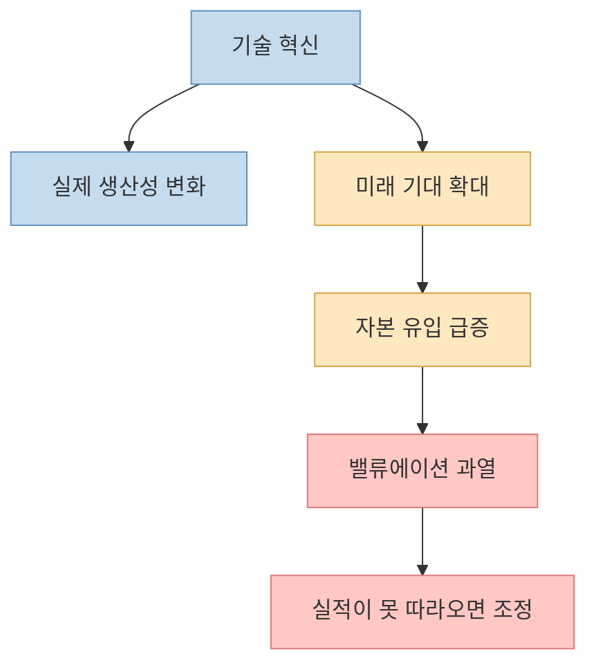
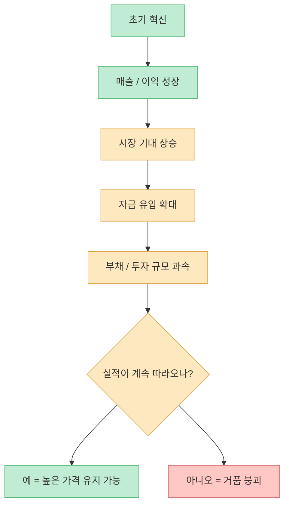
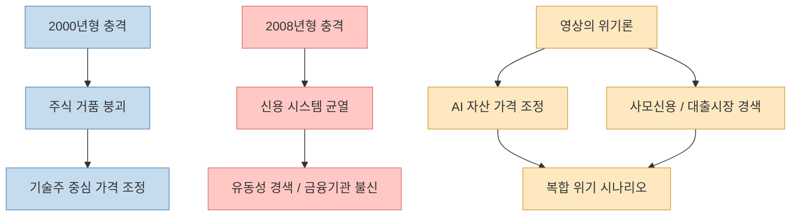
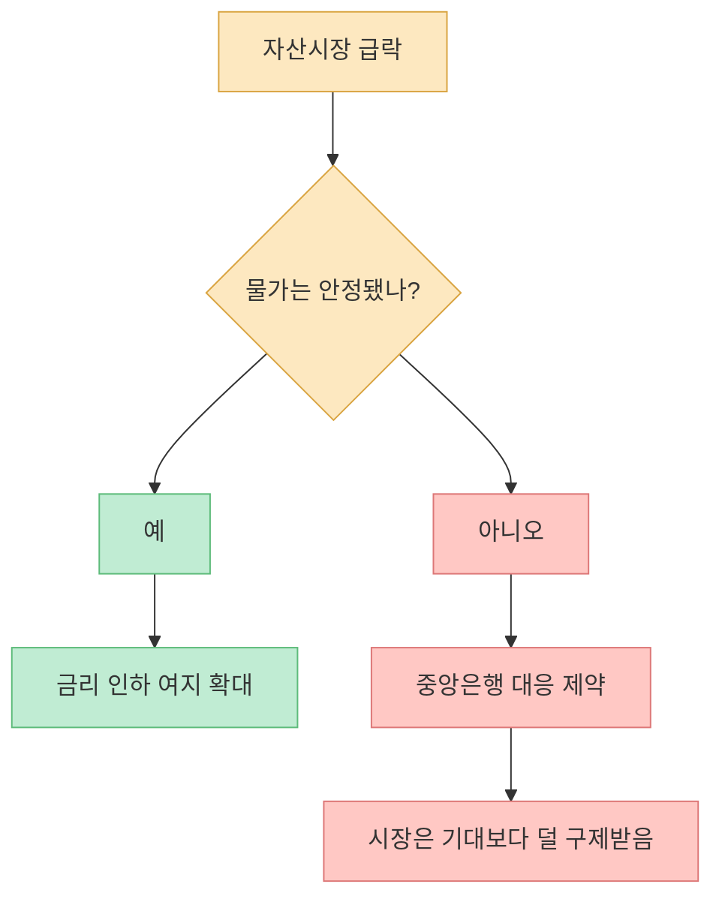
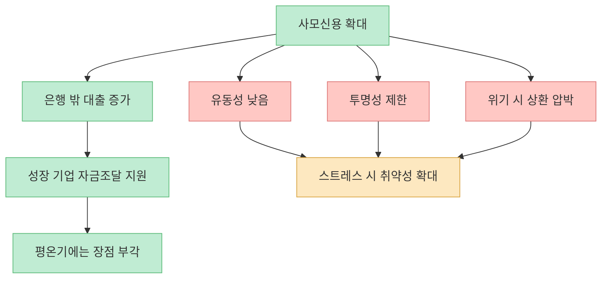
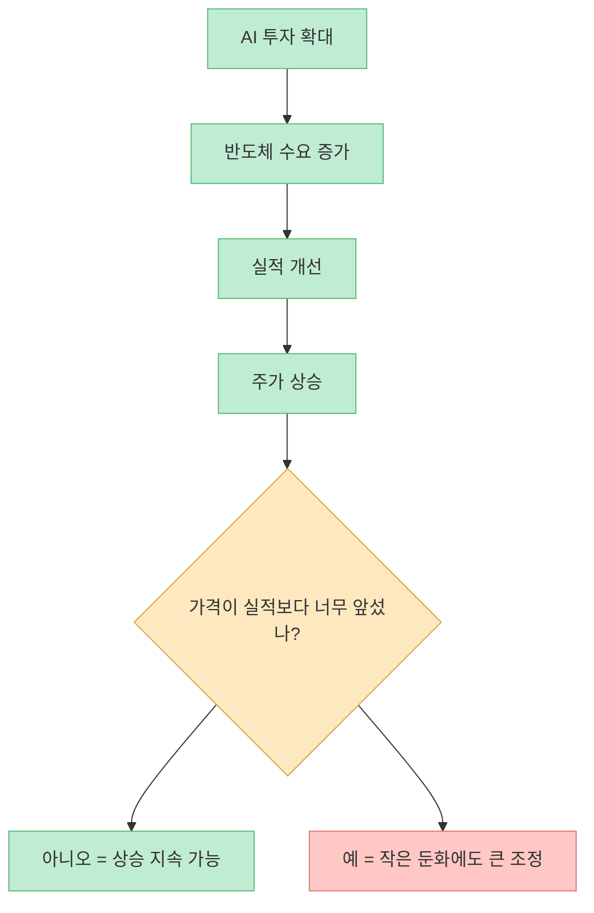
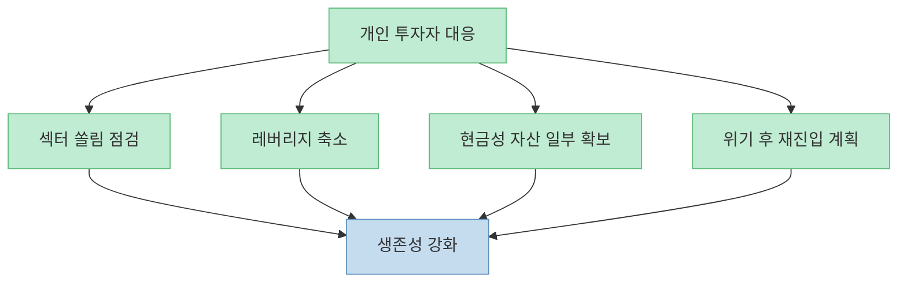

이 영상은 “AI가 세상을 바꾼다”는 말에 반대하지 않습니다. 대신 **기술 혁신과 투자 수익은 같은 말이 아니라는 점** 을 강하게 밀어붙입니다. 기술은 살아남아도, 그 기술에 뒤늦게 몰린 자본은 대규모로 파괴될 수 있다는 것이죠. 특히 영상은 반도체와 AI 관련 주식, 사모신용, 중앙은행 정책 제약이 겹치면서 향후 큰 충격이 올 수 있다고 주장합니다.

<!--more-->

## Sources

- ["위험신호 나왔습니다" 반도체 파티 끝난다 [이슈임당]](https://youtu.be/hCJMyPGn_SA)
- [Federal Reserve — What economic goals does the Federal Reserve seek to achieve through its monetary policy?](https://www.federalreserve.gov/faqs/what-economic-goals-does-federal-reserve-seek-to-achieve-through-monetary-policy.htm)
- [Federal Reserve — Monetary Policy: What Are Its Goals? How Does It Work?](https://www.federalreserve.gov/monetarypolicy/monetary-policy-what-are-its-goals-how-does-it-work.htm)
- [IMF — Global Financial Stability Report 2024, Chapter 2: The Rise and Risks of Private Credit](https://www.imf.org/-/media/Files/Publications/GFSR/2024/April/English/ch2.ashx)
- [SEC — Mutual Funds and Exchange-Traded Funds (ETFs) – A Guide for Investors](https://www.sec.gov/about/reports-publications/investor-publications/introduction-mutual-funds)

## 1. 기술 혁명과 주식 수익은 다르다: 진짜 위험은 “좋은 이야기 + 너무 많은 돈”의 결합이다

영상의 첫 문장은 자극적이지만 핵심은 분명합니다. 지금 시장은 AI라는 “가장 반짝이는 이야기”에 자본이 과도하게 빨려 들어가는 국면일 수 있다는 것입니다. 영상은 역사적으로 기술 혁명의 말미에 항상 자본 파괴가 따라왔고, 이번에도 예외가 아닐 수 있다고 주장합니다. [영상 0분 부근](https://youtu.be/hCJMyPGn_SA?t=0)

이 메시지를 차분하게 번역하면 이렇습니다. **좋은 기술이 있다고 해서, 그 기술 주변의 모든 기업과 모든 가격이 정당화되는 것은 아닙니다.** 투자자는 종종 “산업의 방향이 맞다”는 사실과 “지금 가격이 합리적이다”는 판단을 혼동합니다. AI가 장기적으로 중요해질 가능성은 높지만, 그렇다고 해서 모든 AI 관련 자산이 현재 시점에서도 좋은 투자라는 뜻은 아닙니다.

즉 영상이 겨냥하는 대상은 AI 자체가 아니라, **AI를 명분으로 붙은 가격과 레버리지** 입니다.

## 2. 거품은 “실적이 멈추는데 자본이 더 빨리 불어날 때” 만들어진다

영상은 시장 붕괴의 조건을 꽤 명확하게 설명합니다. 기업이 버는 돈은 어느 시점부터 증가 속도가 둔화되는데, 투자자들의 기대와 부채는 그보다 훨씬 빠르게 불어나는 순간이 온다는 것입니다. [영상 2분 부근](https://youtu.be/hCJMyPGn_SA?t=120)

이 설명은 투자자가 꼭 기억할 만합니다. 거품은 단순히 “가격이 많이 오른 상태”가 아니라, **기초체력보다 기대와 자금조달이 더 빠르게 커진 상태** 입니다. 처음에는 혁신이 실제로 성장과 실적을 만들 수 있습니다. 문제는 그다음입니다. 시장은 어느 순간 성장률이 아니라 “영원한 성장”을 가격에 넣기 시작하고, 그때부터 작은 실망도 큰 충격이 됩니다.

여기서 중요한 것은 “버블이냐 아니냐”를 단정하는 것보다, **시장이 지금 무엇을 이미 가격에 넣고 있는가** 를 읽는 일입니다.

## 3. 2000년과 2008년은 다른 붕괴였다: 이번 위기론은 ‘주가 폭락 + 신용 경색’의 동시 발생을 상정한다

영상은 과거 두 번의 위기를 비교합니다. 2000년 IT 버블 붕괴는 주식시장의 거품이 크게 꺼진 사례였고, 2008년 금융위기는 금융 시스템 자체의 신용 문제로 번진 사례였다는 것입니다. [영상 4분~6분 부근](https://youtu.be/hCJMyPGn_SA?t=240)

이 비교는 꽤 유용합니다. 2000년형 위기에서는 주가가 크게 빠져도 금융기관 전체가 동시에 얼어붙는 수준은 아니었습니다. 반면 2008년형 위기는 “누가 누구에게 돈을 빌려줄 수 있느냐”라는 금융 시스템의 신뢰 자체가 흔들렸습니다. 그래서 영상은 다가올 위험을 단순한 밸류에이션 조정이 아니라, **자산 가격 조정과 신용 시장 문제의 결합** 으로 설명하려 합니다.

다만 여기서 조심할 점도 있습니다. **“복합 위기 가능성”과 “정확한 위기 도래 시점”은 다른 문제** 입니다. 영상의 2027 상반기 같은 표현은 근거가 확정된 사실이라기보다 강한 시나리오 제시에 가깝습니다.

## 4. 왜 중앙은행이 예전처럼 쉽게 구해 주지 못할 수 있나: 물가가 남아 있으면 금리 인하가 제한된다

영상 후반의 핵심 논리 중 하나는 “예전처럼 위기 때마다 중앙은행이 바로 돈을 풀어 주지 못할 수 있다”는 점입니다. 에너지 가격과 물가가 충분히 내려오지 않으면, 자산시장을 구하기 위해 금리를 급히 내리는 선택이 어려워진다는 것이죠. [영상 8분 부근](https://youtu.be/hCJMyPGn_SA?t=480)

이 부분은 공식 자료와도 연결됩니다. 연준은 최대고용과 물가안정이라는 이중 책무를 갖고 있고, 장기적으로는 2% 수준의 인플레이션이 물가안정 목표와 가장 부합한다고 설명합니다. 즉 시장이 흔들린다고 해서 중앙은행이 항상 자산 가격 방어를 최우선으로 둘 수는 없습니다. [Fed FAQ](https://www.federalreserve.gov/faqs/what-economic-goals-does-federal-reserve-seek-to-achieve-through-monetary-policy.htm), [Fed Monetary Policy](https://www.federalreserve.gov/monetarypolicy/monetary-policy-what-are-its-goals-how-does-it-work.htm)

이 말은 곧, 투자자가 “위기 오면 또 돈 풀겠지”라는 자동 반사적 믿음에만 기대면 안 된다는 뜻이기도 합니다.

## 5. 사모신용 시장은 왜 중요한가: 조용할 때는 안 보이지만 흔들리면 유동성이 사라질 수 있다

영상이 가장 날카롭게 짚는 부분은 사모신용(private credit)입니다. 영상은 일부 펀드의 환매 중단 사례를 소개하며, 겉으로는 멀쩡해 보여도 돈줄이 말라붙는 순간 산업 전체가 급격히 멈출 수 있다고 경고합니다. [영상 10분 부근](https://youtu.be/hCJMyPGn_SA?t=600)

이 문제의식은 IMF의 2024년 GFSR과도 맞닿아 있습니다. IMF는 사모신용이 최근 빠르게 커졌고, 유동성이 낮고 위험이 높은 자산을 담을 수 있으며, 충격 시 금융안정 리스크를 키울 수 있다고 봅니다. 특히 시장이 평온할 때는 잘 보이지 않지만, 스트레스가 오면 상환 구조와 평가 방식, 레버리지, 상호연결성이 문제를 키울 수 있습니다. [IMF GFSR 2024 Ch.2](https://www.imf.org/-/media/Files/Publications/GFSR/2024/April/English/ch2.ashx)

이 섹션의 요점은 간단합니다. **주가만 보지 말고, 그 주가를 떠받치는 자금조달 구조가 얼마나 튼튼한지도 봐야 한다** 는 것입니다.

## 6. 한국 반도체 투자자는 무엇을 봐야 하나: AI 수요가 계속돼도 주가는 언제든 먼저 흔들릴 수 있다

영상은 결국 한국 투자자에게 반도체를 이야기합니다. 반도체 수출이 강하게 나오고, AI 수요가 실적을 밀어주는 것은 맞지만, 최종 수요가 꺾이거나 고객사의 투자 속도가 둔화되면 주문은 빠르게 줄 수 있다고 봅니다. [영상 10분~12분 부근](https://youtu.be/hCJMyPGn_SA?t=600)

이 지점에서 중요한 것은 “반도체가 끝났나?”가 아닙니다. 오히려 더 현실적인 질문은 이것입니다.

- 지금 주가는 어떤 성장률을 이미 반영하고 있는가  
- 그 성장의 고객은 몇 군데에 집중돼 있는가  
- AI 투자 확대가 실제 현금흐름으로 얼마나 연결되는가  
- 메모리·장비·전력·데이터센터 중 어디가 더 먼저 둔화 신호를 보이는가  

즉 산업 논리가 살아 있어도, **주식은 산업보다 먼저 과열되고 먼저 식을 수 있습니다.**

영상이 말하는 “반도체 파티 끝난다”는 표현은 단정이라기보다, **좋은 산업에도 나쁜 진입 가격이 있을 수 있다** 는 경고로 읽는 편이 더 정확합니다.

## 7. 그래서 개인 투자자는 무엇을 해야 하나: 예언보다 생존성을 먼저 설계해야 한다

영상의 결론은 꽤 보수적입니다. 현금을 더 두껍게 들고, 짧은 만기의 안전자산을 일부 보유하고, 위기 뒤에 살아남을 기업을 싸게 살 기회를 기다리라는 것입니다. [영상 14분 부근](https://youtu.be/hCJMyPGn_SA?t=840)

이 전략은 공포 마케팅처럼 보일 수 있지만, 원칙 자체는 크게 이상하지 않습니다. SEC도 투자자에게 펀드와 현금성 상품, 채권, 주식의 성격이 다르며 목적과 위험 수준에 따라 비중을 정해야 한다고 설명합니다. [SEC 가이드](https://www.sec.gov/about/reports-publications/investor-publications/introduction-mutual-funds)

다만 중요한 것은 “2027 폭락 확신”이 아니라 **생존 가능성** 입니다. 개인 투자자에게 필요한 것은 정확한 시점 예언이 아니라:

- 한 섹터 쏠림이 과도한지 점검하기  
- 레버리지 사용을 줄이기  
- 현금성 비중을 일부 확보하기  
- 위기 때 다시 살 총알을 남겨 두기  

## 핵심 요약

- AI 혁명과 AI 관련 주식 수익은 같은 말이 아닙니다. 기술이 살아남아도 **늦게 몰린 자본은 손실** 을 볼 수 있습니다. [영상 0분 부근](https://youtu.be/hCJMyPGn_SA?t=0)
- 거품은 실적보다 **기대와 자금조달이 더 빨리 커질 때** 만들어집니다. [영상 2분 부근](https://youtu.be/hCJMyPGn_SA?t=120)
- 영상의 위기론은 2000년형 주가 조정과 2008년형 신용 위기가 **겹칠 수 있다** 는 시나리오입니다. [영상 4분~10분 부근](https://youtu.be/hCJMyPGn_SA?t=240)
- 중앙은행은 물가안정이라는 제약 때문에 언제나 시장을 바로 구해 주지 못할 수 있습니다.
- 사모신용과 유동성 문제는 겉으로 안 보여도, 흔들릴 때는 **주가보다 더 위험한 균열** 이 될 수 있습니다.
- 개인 투자자에게 중요한 것은 폭락 날짜 예측보다 **현금, 분산, 레버리지 관리, 재진입 계획** 입니다.

## 결론

이 영상은 “AI는 끝났다”가 아니라 **AI에 대한 과열된 금융 구조가 먼저 흔들릴 수 있다** 는 경고에 가깝습니다. 따라서 핵심 질문은 “반도체를 버릴까?”가 아니라 “지금 내 포트폴리오가 좋은 산업을 너무 비싼 가격과 너무 높은 기대치로 들고 있지는 않은가?”입니다. 결국 시장에서 오래 살아남는 사람은 예언을 가장 세게 한 사람이 아니라, 거품과 조정이 둘 다 올 수 있다는 전제를 두고 버틸 구조를 만든 사람일 가능성이 높습니다.
