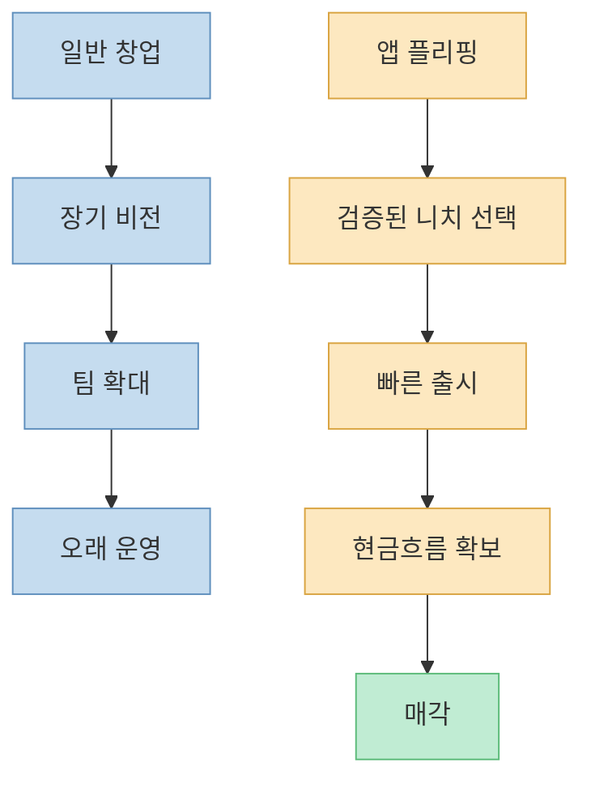
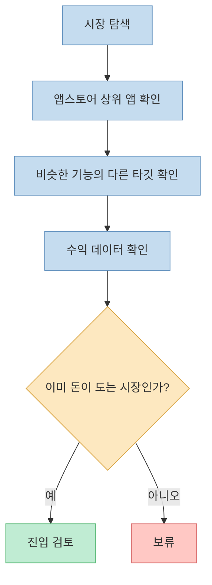
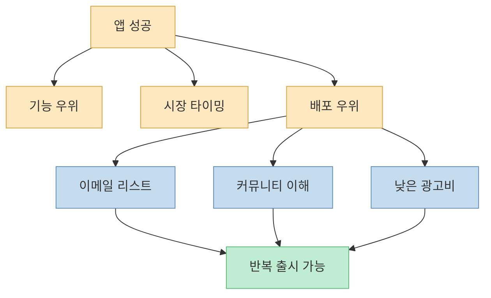
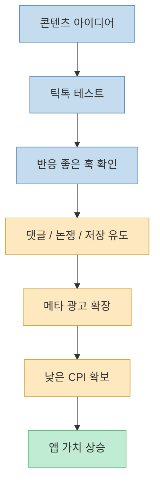
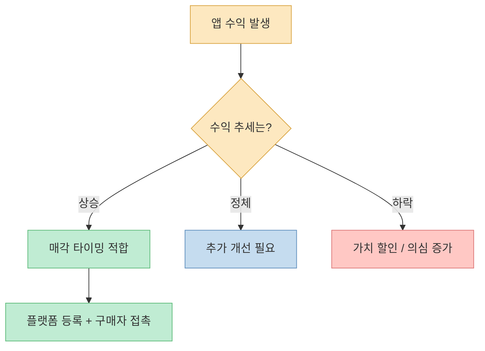
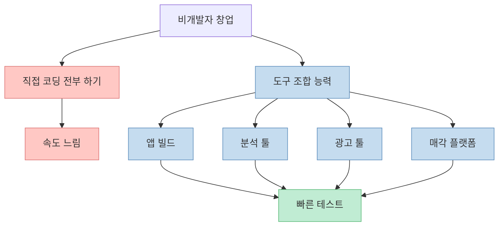
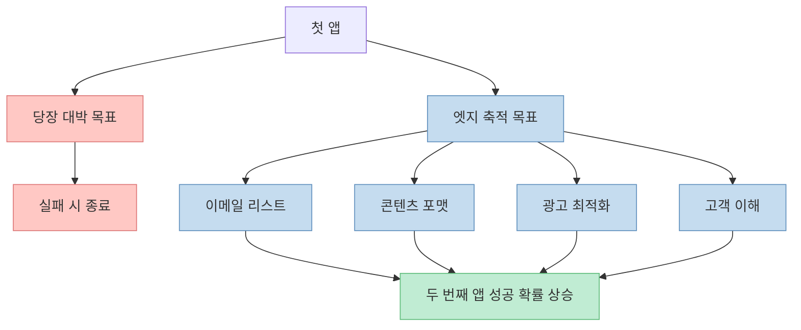

대부분의 창업 조언은 “큰 비전을 붙잡아라”에 가깝습니다. 그런데 이 영상은 정반대의 관점을 제시합니다. **앱을 오래 운영할 서비스가 아니라, 일정 수준의 현금흐름을 만든 뒤 되파는 자산으로 본다** 는 것입니다. 이 접근은 낭만은 적지만 현금화는 빠를 수 있습니다.

<!--more-->

## Sources

- ['바이브코딩'으로 인기있는 앱을 빠르게 카피해 1년만에 7억 번 비개발자](https://youtu.be/mlJkPO8zz7g)
- [Acquire.com — How to Flip a SaaS](https://blog.acquire.com/how-to-flip-a-saas-microacquire/)
- [Money Making Story — How Lots Made $500,000 Flipping Four Simple Apps in Two Years](https://www.moneymakingstory.com/p/how-lots-made-500-000-flipping-four-simple-apps-in-two-years)

## 1. 앱 플리핑은 무엇이 다른가

영상의 주인공은 2022년 이후 앱을 만들고 네 번 매각해 큰 수익을 올렸다고 소개됩니다. 핵심은 처음부터 “좋은 앱을 만들자”가 아니라 **“팔 수 있는 앱을 만들자”** 는 출발점입니다. [영상 0분 부근](https://youtu.be/mlJkPO8zz7g?t=0)

앱 플리핑은 부동산 플리핑과 비슷합니다. 오래 살 집을 짓는 것이 아니라, 시장성이 있는 자산을 빠르게 만들고, 가치가 붙으면 판매하는 방식입니다. Acquire.com도 SaaS 플리핑을 “작게 사고, 개선하고, 다시 파는” M&A 전략으로 설명합니다. [Acquire.com](https://blog.acquire.com/how-to-flip-a-saas-microacquire/)

이 방식의 장점은 명확합니다. 창업의 목표가 “세상을 바꾸는 서비스”가 아니라 “매각 가능한 캐시플로우 자산”이 되므로, 우선순위가 훨씬 현실적으로 바뀝니다.

## 2. 아이디어보다 중요한 것은 이미 돈이 도는 시장이다

영상에서 가장 실용적인 부분은 아이디어 탐색법입니다. 그는 앱스토어 카테고리 상위권 앱을 먼저 보고, 비슷한 기능으로 다른 하위 시장을 공략하는 앱들이 있는지 살핍니다. 그리고 Sensor Tower 같은 도구로 실제 매출 규모를 확인합니다. [영상 3분 부근](https://youtu.be/mlJkPO8zz7g?t=180)

이 접근의 핵심은 “새로운 것”보다 **이미 검증된 돈의 흐름** 입니다. 창업 초보자가 자주 빠지는 함정은 시장 검증이 안 된 아이디어에 과도하게 애착을 갖는 것입니다. 반면 앱 플리핑은 시장 수요가 입증된 영역에서 작은 차별화만 찾습니다.

즉 앱 플리핑에서 좋은 아이디어란 “세상에 없는 것”이 아니라, **이미 팔리는 것을 다른 니치에 더 잘 맞게 옮긴 것** 입니다.

## 3. 차별화는 기능 혁신보다 배포 우위에서 나온다

영상의 사례에서 주인공은 기독교 시장을 택합니다. 이유는 단순히 본인이 기독교인이어서가 아니라, 기술 도입이 상대적으로 느린 영역이고 자신이 그 시장의 사용자 이해와 유통 채널을 가지고 있었기 때문이라고 설명합니다. [영상 3분 부근](https://youtu.be/mlJkPO8zz7g?t=180)

여기서 중요한 개념이 **엣지(edge)** 입니다. 앱의 기능이 대단해서가 아니라, 특정 커뮤니티에 더 잘 팔 수 있는 유통 우위를 가진 것입니다. Money Making Story 인터뷰 요약도 그가 Christian user email list를 크게 확보했고, 이것이 반복적 앱 출시의 핵심 자산이 됐다고 설명합니다. [Money Making Story](https://www.moneymakingstory.com/p/how-lots-made-500-000-flipping-four-simple-apps-in-two-years)

이 구조는 “좋은 앱을 만들면 알아서 퍼진다”는 환상을 깨 줍니다. 실제로는 배포 우위가 없는 사람은 첫 앱에서 기술보다 **고객 획득 채널** 을 먼저 만들어야 합니다.

## 4. 바이럴은 우연이 아니라 포맷 실험에서 나온다

영상은 틱톡 중심의 짧은 콘텐츠 마케팅을 강조합니다. 특히 논쟁을 일으키거나 댓글을 유도하는 형식, 즉 engagement를 크게 만드는 훅을 찾고, 그중 반응이 검증된 것을 메타 광고로 확장한다고 설명합니다. [영상 6분 부근](https://youtu.be/mlJkPO8zz7g?t=360)

이 구조에서 중요한 건 콘텐츠가 예쁘냐가 아닙니다. **설치당 비용(CPI)을 낮출 수 있느냐** 가 핵심입니다. 앱 플리핑에서는 브랜드 충성도보다도, 매수자가 봤을 때 “이 앱은 합리적인 CAC/CPI로 유저를 계속 확보할 수 있다”는 그림이 중요합니다.

즉 앱 마케팅은 출시 후에 붙이는 장식이 아니라, 제품 설계와 동시에 시작되는 수익 엔진입니다.

## 5. 매각 시점은 “앱이 좋을 때”가 아니라 “상승 곡선이 보일 때”다

영상은 월 1천만~2천만 원 수준의 수익이 날 때 매각을 검토하고, 특히 직전 3개월 동안 수익이 상승 곡선을 보여야 한다고 말합니다. 하락 중인 앱은 구매자에게 문제를 떠넘기는 것처럼 보이기 때문입니다. [영상 6분 부근](https://youtu.be/mlJkPO8zz7g?t=360)

이 부분은 아주 중요합니다. 매수자는 과거보다 **앞으로의 현금흐름** 을 삽니다. 따라서 앱의 현재 상태보다 “지금 이 추세가 계속될 가능성”이 더 중요합니다.

영상 속 독특한 포인트는 “최고가 입찰자보다 세 번째로 높은 가격 제시자에게 판다”는 전략입니다. 이건 단일 창업자 사례로 봐야 하지만, 논리는 분명합니다. 최고가를 제시한 사람이 협상 막판에 더 오래 끌거나 재협상할 가능성이 있다는 판단입니다. [영상 6분 부근](https://youtu.be/mlJkPO8zz7g?t=360)

## 6. 비개발자에게 더 중요한 것은 코딩이 아니라 조립 능력이다

영상 제목은 비개발자를 강조하지만, 본문을 보면 핵심은 “전혀 기술이 필요 없다”가 아닙니다. 오히려 **기술 스택을 최소한으로 이해하고 빠르게 조립할 줄 알아야 한다** 는 쪽에 가깝습니다. 그는 React Native, TikTok 분석 도구, 광고 도구 등을 조합합니다. [영상 9분 부근](https://youtu.be/mlJkPO8zz7g?t=540)

요즘 말하는 바이브코딩의 요지는 코드 한 줄도 몰라도 된다는 뜻이 아니라, 제품을 이루는 조각들을 **빠르게 테스트하고 묶어낼 실행 감각** 이 중요하다는 뜻에 더 가깝습니다.

따라서 비개발자에게 필요한 것은 “천재 개발자 수준의 기술”이 아니라, **제품-마케팅-매각의 연결 구조를 이해하는 사업 감각** 입니다.

## 7. 첫 앱의 진짜 목표는 수익보다 엣지 축적일 수 있다

영상 후반부에서 가장 실용적인 조언은 엣지가 없는 사람에게는 첫 앱이 수익보다 **엣지를 만드는 단계** 여야 한다는 말입니다. 첫 앱으로 이메일 리스트를 모으고, 두 번째 앱에서 이를 활용하고, 세 번째 앱에서 더 큰 시너지를 만드는 식입니다. [영상 12분 부근](https://youtu.be/mlJkPO8zz7g?t=720)

이 조언은 매우 중요합니다. 많은 사람이 첫 제품에 너무 큰 성공을 기대합니다. 하지만 실제로는 첫 앱이 남겨야 할 자산은 다음일 수 있습니다.

- 이메일 리스트
- 특정 커뮤니티에 대한 이해
- 낮은 광고비를 만드는 크리에이티브 포맷
- 반복 가능한 온보딩 구조
- 매각 가능한 KPI 설계 경험

즉 앱 플리핑은 한 번의 홈런보다 **작은 자산을 여러 번 축적하는 복리 구조** 에 가깝습니다.

## 핵심 요약

- 앱 플리핑은 앱을 오래 운영할 서비스가 아니라 일정 현금흐름을 만든 뒤 판매하는 자산으로 보는 전략이다.
- 아이디어의 독창성보다 이미 돈이 도는 시장인지 확인하는 것이 먼저다.
- 차별화는 기능 혁신보다 유통 채널, 이메일 리스트, 커뮤니티 이해 같은 배포 우위에서 더 자주 나온다.
- 틱톡과 메타 광고를 활용한 저비용 유저 획득 구조는 앱 가치에 직접 영향을 준다.
- 매각은 수익 규모만이 아니라 최근 상승 추세가 있을 때 더 유리하다.
- 비개발자에게 중요한 것은 전면적인 코딩 능력보다 도구를 빠르게 조합하고 실험하는 능력이다.
- 첫 앱의 진짜 목표는 큰돈보다 다음 앱에 재사용할 수 있는 엣지를 만드는 것일 수 있다.

## 결론

앱을 만든다는 말은 보통 제품을 오래 키운다는 뜻으로 받아들여집니다. 하지만 이 영상은 다른 선택지를 보여 줍니다. **앱을 처음부터 매각 가능한 디지털 자산으로 설계하는 방식** 입니다.

이 접근은 낭만이 적고 차갑게 느껴질 수 있습니다. 그러나 그만큼 현실적입니다. 시장이 이미 있는 곳을 찾고, 작은 차별화를 만들고, 유통 우위를 쌓고, 현금흐름이 생기면 판다. 그리고 다시 반복합니다.

결국 앱 플리핑의 본질은 코딩보다도 이것입니다.  
**무엇을 만들 것인가보다, 무엇이 팔릴 것인가를 먼저 보는 시선.**
