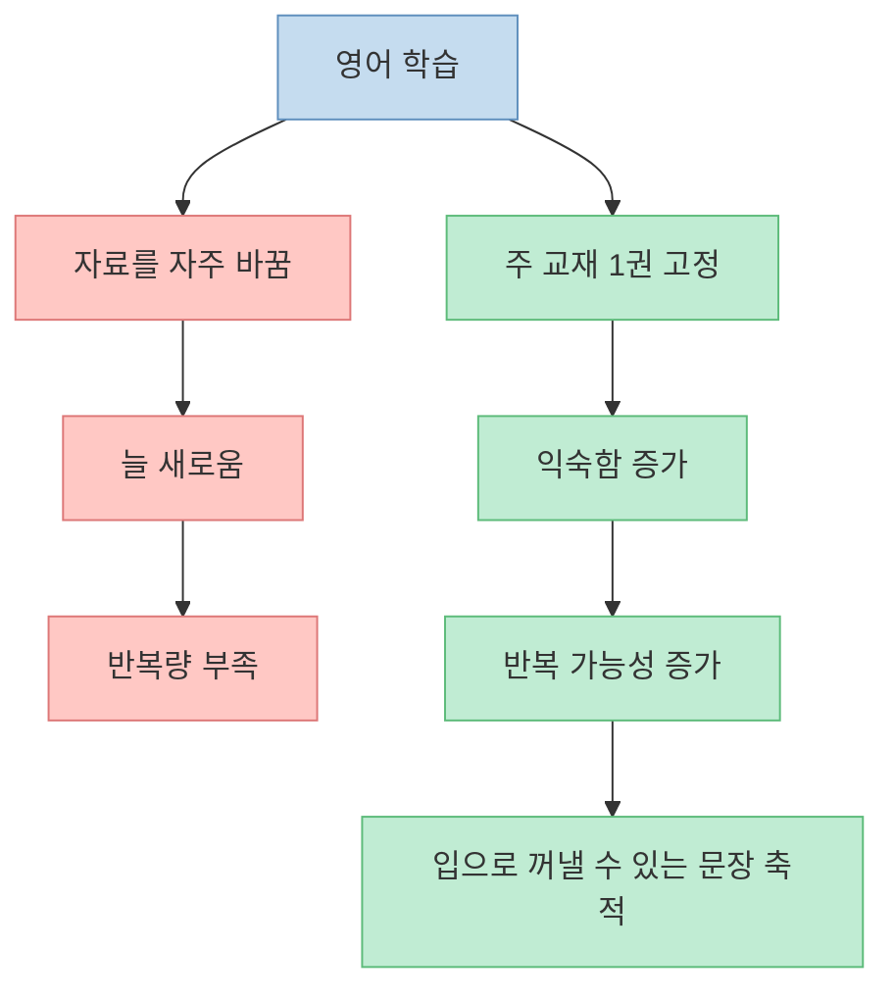
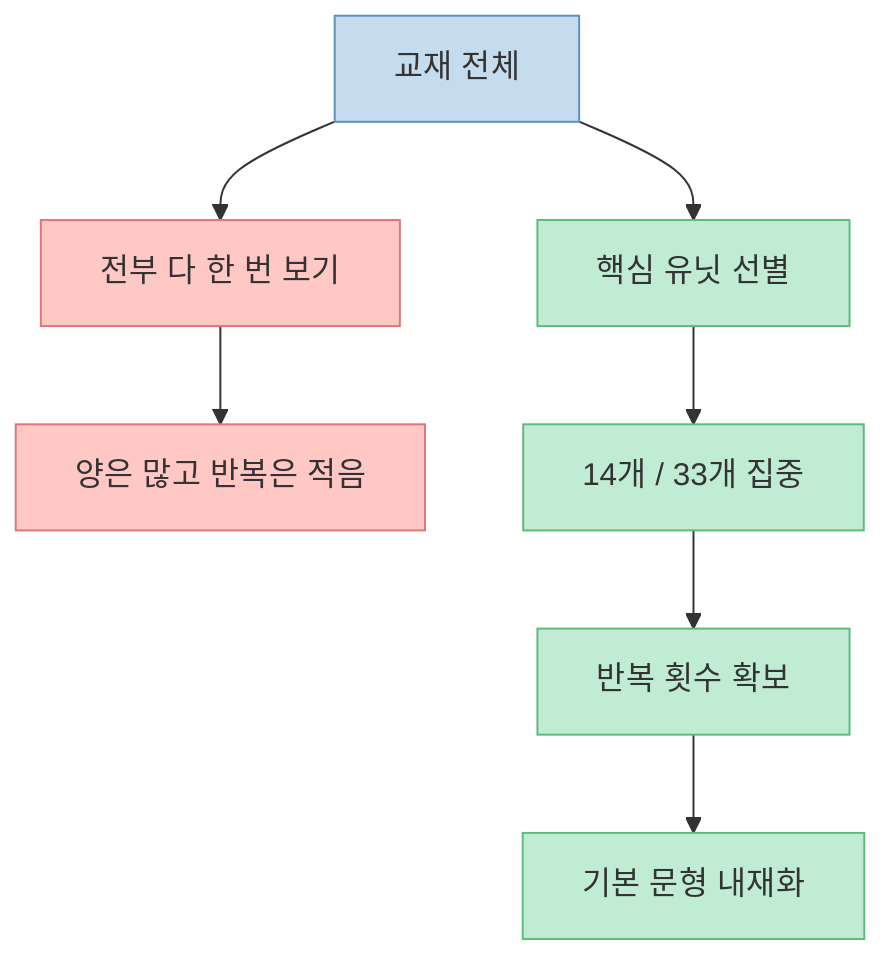
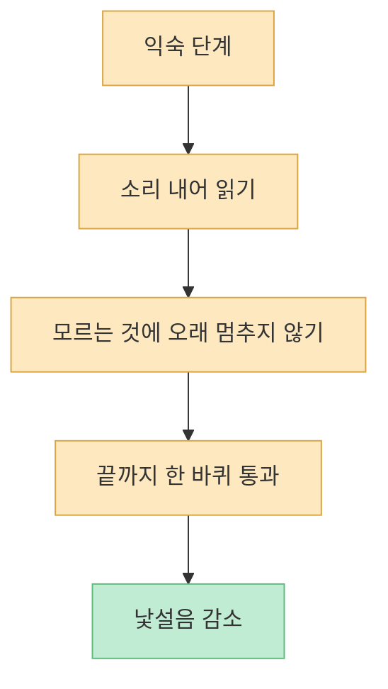
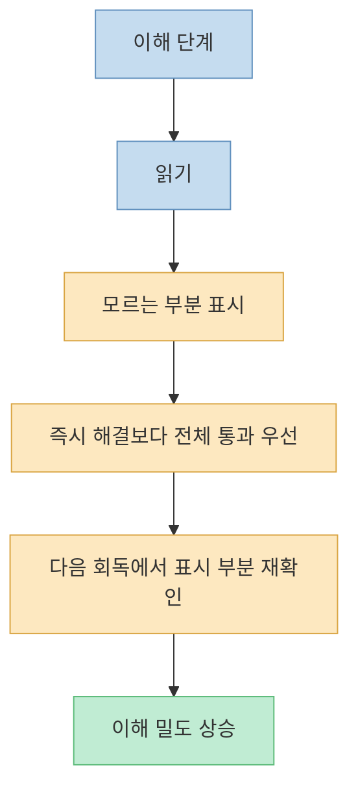
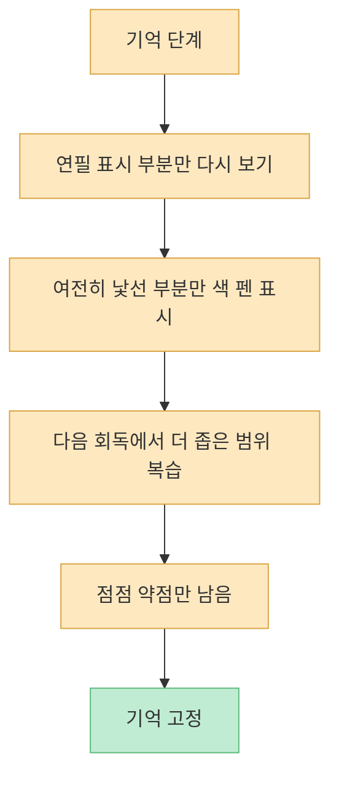
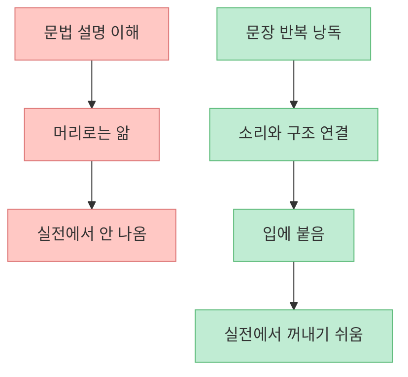
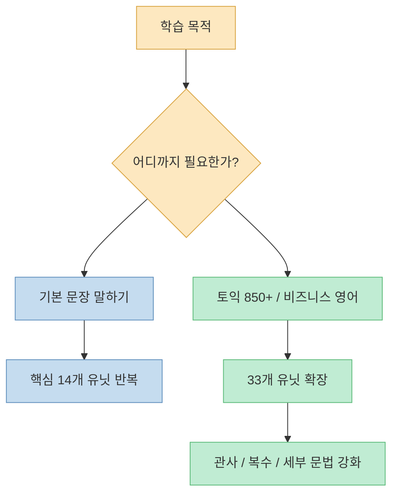

문법책을 끝까지 한 번 보는 사람은 많지만, 그 내용을 입으로 꺼낼 수 있는 사람은 훨씬 적습니다. 이 영상의 문제의식도 정확히 거기에 있습니다. **영어 실력은 한 번 이해했다고 생기는 것이 아니라, 이해 가능한 문장을 반복해 입 밖으로 꺼내는 과정에서 비로소 자기 것이 된다** 는 것입니다.

<!--more-->

## Sources

- [Basic Grammar in Use 관련 글만 12년간 250개 쓴 사람이 정리한 학습법 풀버전](https://youtu.be/87lAOgkNp5Q)
- [Cambridge University Press — Basic Grammar in Use Student's Book](https://www.cambridge.org/elt/grammarinuse/basic/students_book.html)
- [Springer — Learning a Language Through Reading: A Meta-analysis](https://link.springer.com/article/10.1007/s10648-025-10068-6)
- [SAGE — Developing reading fluency and comprehension using repeated reading](https://journals.sagepub.com/doi/10.1177/1362168809346494)

## 1. 왜 한 권을 정해서 오래 반복해야 하나

영상은 영어 공부의 기본을 “내가 봤을 때 80~90% 이상 이해되는 내용을 20번 이상 낭독하는 것”으로 설명합니다. 그리고 그렇게 반복하기 위해서는 먼저 **주 교재 한 권** 을 정해야 한다고 말합니다. [영상 0분 부근](https://youtu.be/87lAOgkNp5Q?t=0)

이 관점은 매우 현실적입니다. 영어 초중급 학습자가 자주 실패하는 이유는 교재가 부족해서가 아니라, 매번 새로운 자료로 갈아타기 때문입니다. 자료가 바뀌면 낯설음이 늘고, 반복량은 줄어듭니다. 반면 한 권을 오래 붙잡으면 이해의 비용은 줄고 반복의 효과는 커집니다.

Cambridge도 Basic Grammar in Use를 기본 문법 학습용 핵심 교재로 소개합니다. [Cambridge](https://www.cambridge.org/elt/grammarinuse/basic/students_book.html)

핵심은 “한 권을 다 보느냐”보다 “한 권을 반복 가능한 단위로 쪼개 오래 보느냐”입니다.

## 2. 전체 완독보다 핵심 유닛 선별이 먼저다

영상은 Basic Grammar in Use 전체를 처음부터 끝까지 다 밀어붙이는 대신, 핵심 유닛만 추려서 50~100시간 정도 집중 학습하는 구조를 제안합니다. 특히 100개가 넘는 유닛 중에서 먼저 33개, 더 줄이면 핵심 14개 유닛부터 시작할 수 있다고 말합니다. [영상 0분 부근](https://youtu.be/87lAOgkNp5Q?t=0)

이 접근의 장점은 분명합니다.

- 완주 부담을 줄인다
- 반복 횟수를 확보한다
- 핵심 문형을 먼저 몸에 넣는다

처음부터 완벽한 전범위를 노리면 결국 반복이 무너집니다. 기본기는 범위를 넓혀서 생기기보다, **좁은 범위를 많이 돌릴 때** 생깁니다.

## 3. 회독 1단계: 익숙해지기

영상이 제안하는 첫 단계는 “익숙” 단계입니다. 여기서는 본문을 처음부터 완전히 이해하려 들지 않고, 페이지를 소리 내어 읽으며 빠르게 훑고 넘어갑니다. 모르는 단어나 구조를 만나더라도 바로 붙잡지 않고, 전체 범위를 일단 한 번 통과하는 것이 목적입니다. [영상 3분~6분 부근](https://youtu.be/87lAOgkNp5Q?t=180)

이 단계는 공부 같지 않게 느껴질 수 있습니다. 하지만 실제 목적은 분석이 아니라 **낯설음 제거** 입니다. 낯설음이 줄어들어야 다음 회독에서 이해가 빨라집니다.

처음부터 모르는 것 전부를 해결하려 들면 속도가 끊깁니다. 이 단계에서는 “이해하려고 보기”보다 “익숙해지려고 보기”가 더 중요합니다.

## 4. 회독 2단계: 이해하기

익숙 단계 이후에는 본격적인 “이해” 회독으로 들어갑니다. 영상에서는 이때부터 모르는 단어, 표현, 문장 구조에 연필로 표시를 하고, 물음표를 남기며, 체크는 하되 페이지마다 오래 머물지 않고 끝까지 나아가라고 설명합니다. [영상 9분 부근](https://youtu.be/87lAOgkNp5Q?t=540)

핵심은 이렇습니다.

1. 읽는다  
2. 모르는 부분을 표시한다  
3. 그 자리에서 다 해결하지 않는다  
4. 범위를 끝까지 간다  
5. 다음 회독에서 표시된 부분만 다시 본다

영상의 중요한 포인트는 “세 번 보면 내용이 알아서 정리돼 들어오는 느낌”입니다. 이건 과장이 아닙니다. 반복 읽기(repeated reading)는 언어 학습에서 유창성과 이해를 끌어올리는 방법으로 연구돼 왔습니다. [SAGE](https://journals.sagepub.com/doi/10.1177/1362168809346494)

## 5. 회독 3단계: 기억하기

이해 단계까지 거친 뒤에는 “기억” 단계로 들어갑니다. 영상은 이때 색깔 펜을 사용해, 이전에 연필로 표시했던 부분 가운데 여전히 생소한 부분만 다시 표시하며 4회에 걸쳐 복습하라고 제안합니다. [영상 15분~18분 부근](https://youtu.be/87lAOgkNp5Q?t=900)

이 방식의 핵심은 전체를 똑같이 다시 보는 것이 아니라 **약한 부분만 점점 더 진하게 남기는 것** 입니다.

이 방법은 학습 범위를 점차 압축해 줍니다. 처음에는 14개 유닛 전체를 보지만, 나중에는 정말 내 약점만 남기게 됩니다. 그래서 시간이 갈수록 학습은 더 짧아지고 더 정밀해집니다.

## 6. 낭독은 왜 꼭 필요한가

영상은 반복 학습의 목적을 단순 이해가 아니라 **낭독 가능한 상태** 로 둡니다. 20번 이상 낭독해야 그것이 자기 실력이 된다고 말하는데, 여기에는 중요한 통찰이 있습니다. 이해한 문장은 머릿속 지식이고, 입으로 나오는 문장은 실사용 자산입니다. [영상 0분 부근](https://youtu.be/87lAOgkNp5Q?t=0)

반복 읽기와 읽기 기반 입력의 효과를 다룬 최근 메타분석들도, 반복적 노출과 읽기가 언어 습득에 긍정적 영향을 줄 수 있음을 보여 줍니다. [Springer](https://link.springer.com/article/10.1007/s10648-025-10068-6)

낭독의 목적은 발음 완벽주의가 아닙니다. 문장 구조를 **입 근육 수준까지 익숙하게 만드는 것** 입니다. 그래서 영상도 듣기-따라읽기가 가장 좋지만, 처음에는 혼자 낭독하는 것만으로도 충분하다고 설명합니다.

## 7. 14개에서 끝낼지, 33개까지 넓힐지는 목적에 따라 다르다

영상 후반부는 학습 범위를 어디까지 확장할지에 대해서도 구체적인 기준을 제시합니다. 단순히 기본 문장 구조를 익히고 싶다면 핵심 14개 유닛만 반복해도 되고, 토익 850점 이상이나 실제 비즈니스 영어까지 원한다면 33개 유닛으로 넓혀야 한다고 말합니다. 특히 명사 단수·복수, 관사 영역을 중요하게 짚습니다. [영상 21분 부근](https://youtu.be/87lAOgkNp5Q?t=1260)

이건 매우 좋은 기준입니다. 교재를 얼마나 하느냐는 정답이 있는 것이 아니라, **내가 어디까지 영어를 써야 하느냐** 에 따라 달라집니다.

즉 중요한 것은 교재 전체 완독 여부가 아니라, **목표에 맞는 범위를 정하고 끝까지 반복하는 것** 입니다.

## 핵심 요약

- 영어 실력은 한 번 이해했다고 생기지 않고, 이해 가능한 문장을 반복해 낭독할 때 자기 것이 된다.
- Basic Grammar in Use는 전체를 무조건 다 보기보다, 핵심 유닛을 추려 반복하는 방식이 더 현실적이다.
- 회독은 익숙 단계, 이해 단계, 기억 단계로 나누면 부담이 줄고 반복이 쉬워진다.
- 익숙 단계에서는 완벽한 이해보다 낯설음 제거가 목표다.
- 이해 단계에서는 모르는 부분을 표시하되, 그 자리에서 오래 멈추지 않고 전체를 통과하는 것이 중요하다.
- 기억 단계에서는 표시된 약점만 다시 좁혀 가며 복습해 효율을 높인다.
- 낭독은 문법 지식을 실제로 입에 붙는 문장 자산으로 바꾸는 과정이다.
- 14개 유닛으로 기본기를 만들고, 필요하면 33개 유닛까지 확장하는 방식이 목적 맞춤형으로 적절하다.

## 결론

문법책 공부가 자꾸 실패하는 이유는 문법이 어려워서가 아니라, 너무 적게 반복하고 너무 넓게 손대기 때문인 경우가 많습니다. 이 영상이 제안하는 시스템은 정반대입니다. **범위는 줄이고, 회독은 늘리고, 마지막엔 낭독으로 고정시키는 것** 입니다.

한 권의 책을 잘 고르고, 핵심 범위를 추리고, 세 단계로 회독하고, 충분히 소리 내어 읽는 것. 이 단순한 구조가 Basic Grammar in Use를 “다 본 책”이 아니라 “입에서 나오는 책”으로 바꿉니다.
