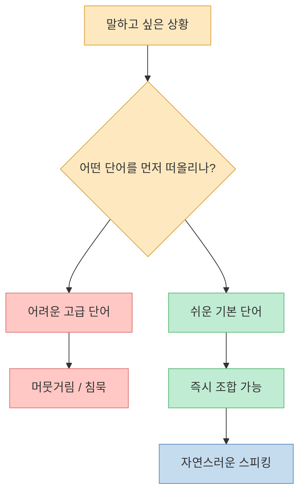
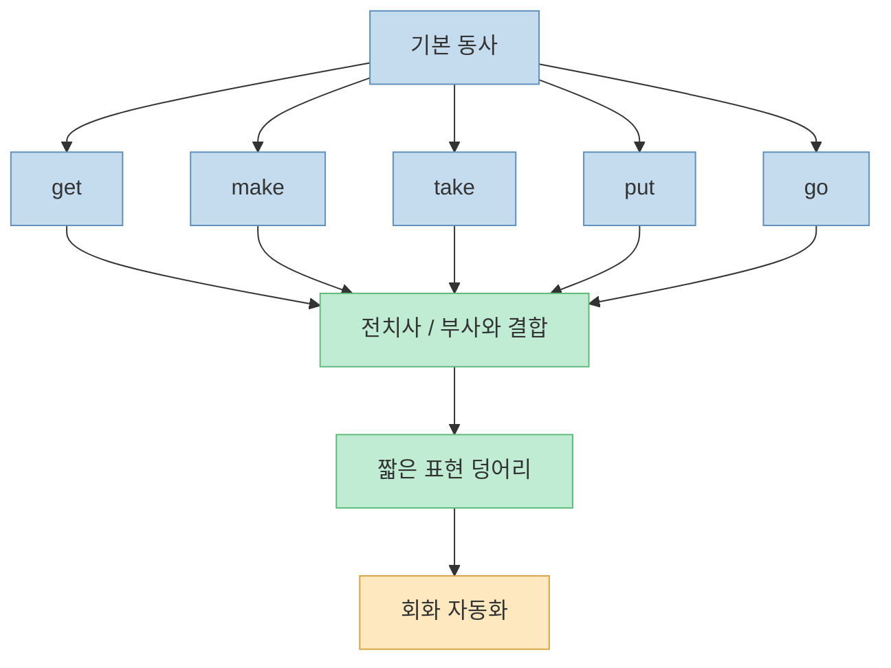
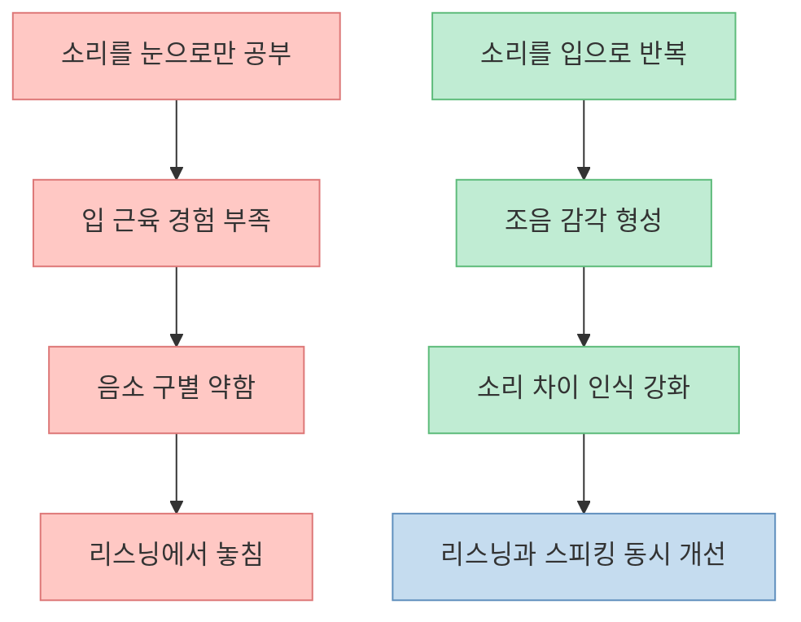
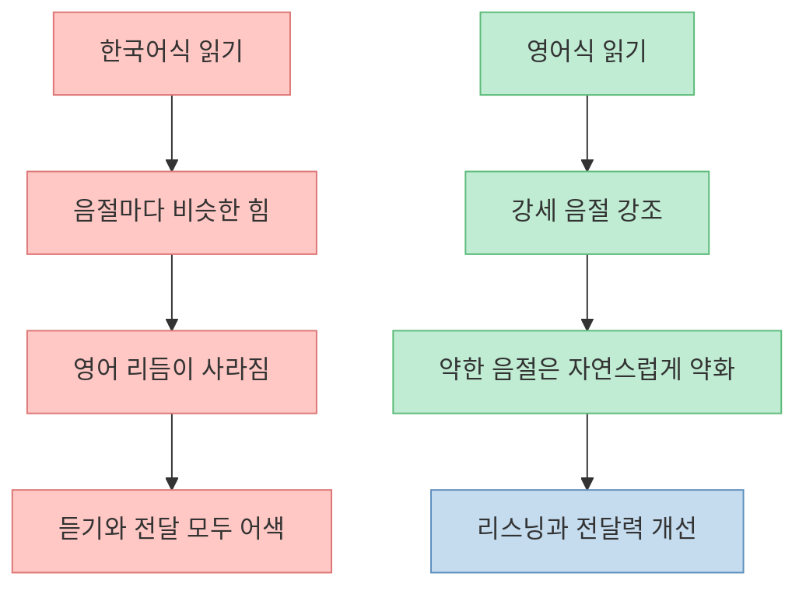
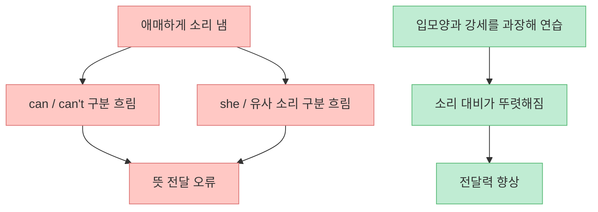
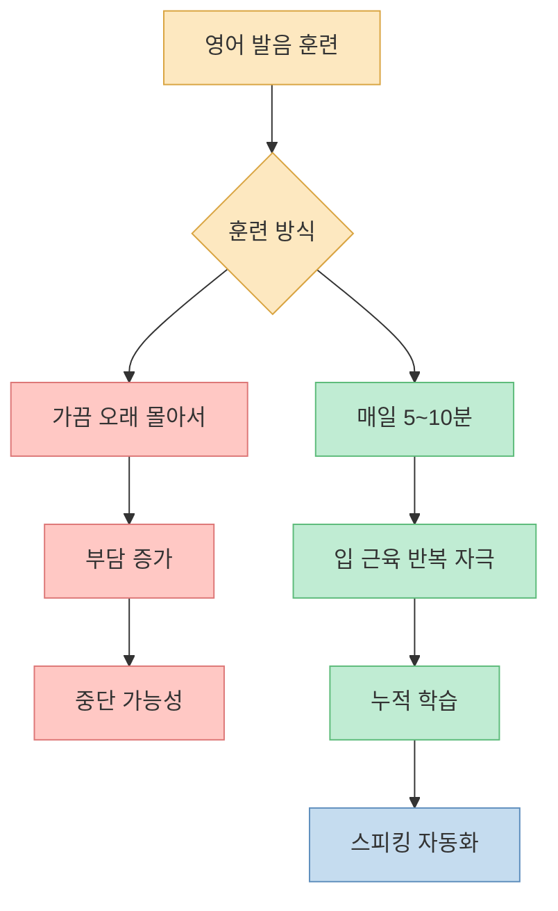

이 영상의 핵심은 의외로 단순합니다. **영어를 더 어렵게 공부해서가 아니라, 더 쉽게 말하는 훈련을 해야 입이 빨리 트인다** 는 것입니다. 많은 학습자가 읽기용 영어와 말하기용 영어를 같은 방식으로 다루는데, 영상은 그 습관을 정면으로 뒤집습니다. 쉬운 단어, 구동사, 강세, 발음, 짧은 루틴이 실제 스피킹 속도를 바꾼다는 이야기입니다.

<!--more-->

## Sources

- ["영어 입이 트이는 속도 완전 달라져요" 나이에 상관 없이 영어를 배우는 가장 현실적인 방법 (하이빅쌤)](https://youtu.be/U1zsfTZm5qY)

## 1. 영어가 안 나오는 이유는 단어 부족보다 “말하기용 단어 선택” 문제일 수 있다

영상은 아주 좋은 예시로 시작합니다. “불이 났어, 불 꺼야 돼”라는 상황에서 많은 한국 학습자가 먼저 떠올리는 단어가 `extinguish` 같은 어려운 단어라는 것입니다. 하지만 실제 말하기에서는 `There is a fire.` 와 `We need to put out the fire.` 같은 훨씬 쉬운 조합이 더 자연스럽습니다. [영상 0분 부근](https://youtu.be/U1zsfTZm5qY?t=0)

이 지점이 중요합니다. 시험 영어에 오래 익숙한 사람일수록 “아는 단어의 수준”과 “입에서 바로 나오는 표현”이 서로 다를 수 있습니다. 읽을 때는 어려운 단어를 알아보는 능력이 도움이 되지만, 말할 때는 **쉬운 단어를 빠르게 꺼내 조합하는 능력** 이 더 중요합니다. 영상이 말하는 현실적인 영어 학습은 바로 이 간극을 줄이는 데 초점이 있습니다.

그래서 스피킹 훈련의 첫 단계는 “더 많은 단어 암기”가 아니라 “내가 이미 아는 쉬운 단어로 얼마나 많은 상황을 말할 수 있는가”를 다시 설계하는 일에 가깝습니다.

## 2. get, make, take, put 같은 쉬운 동사와 구동사가 진짜 회화의 뼈대다

영상은 일상 회화에서 자주 쓰는 기본 동사들을 계속 강조합니다. `get`, `have`, `make`, `give`, `go`, `put`, `take` 같은 동사는 너무 쉬워 보여서 오히려 훈련 대상에서 빠지기 쉽습니다. 하지만 실제로는 이런 동사들이 다양한 전치사·부사와 결합하면서 회화의 뼈대를 만듭니다. [영상 2분 부근](https://youtu.be/U1zsfTZm5qY?t=120)

구동사도 같은 맥락입니다. 예를 들어 “치워”라는 상황에서 학습자는 `clean up` 같은 단어만 떠올리기 쉬운데, 영상은 상황에 따라 `put away` 같은 표현도 훨씬 자주 쓰인다고 설명합니다. 중요한 것은 어려운 표현을 더 많이 모으는 것이 아니라, **자주 쓰는 표현 덩어리를 반복적으로 입에 붙이는 것** 입니다. [영상 2분 부근](https://youtu.be/U1zsfTZm5qY?t=120)

즉 영어 입을 트이게 만드는 것은 화려한 단어장이 아니라, **쉽고 자주 쓰는 동사를 문장 안에서 꺼내는 속도** 입니다.

## 3. 내가 못 내는 소리는 잘 안 들린다: 발음은 리스닝의 열쇠이기도 하다

영상에서 가장 중요한 주장 중 하나는 “내가 낼 줄 아는 소리를 더 잘 듣는다”는 부분입니다. 영어에는 있지만 한국어에는 없는 소리가 많고, 우리는 그 소리를 익숙한 한국어 소리로 끼워 맞추기 때문에 실제 발음을 놓치기 쉽습니다. 그래서 자막을 보면 쉬운 단어였는데, 귀로만 들을 때는 전혀 안 들리는 현상이 생깁니다. [영상 2분~4분 부근](https://youtu.be/U1zsfTZm5qY?t=120)

발음을 “예쁘게 말하기” 용도로만 생각하면 이 부분이 잘 안 보입니다. 하지만 영상은 발음을 **청취의 열쇠** 로 설명합니다. 내가 특정 소리 차이를 실제로 입으로 내 본 적이 있어야, 상대가 빠르게 말할 때도 그 차이를 더 잘 구별할 가능성이 높아집니다. [영상 4분 부근](https://youtu.be/U1zsfTZm5qY?t=240)

그래서 발음 훈련은 “원어민처럼 보이기 위한 장식”이 아니라, **입과 귀를 같은 시스템으로 훈련하는 과정** 이라고 보는 편이 훨씬 실용적입니다.

## 4. 영어는 글자보다 강세와 리듬이 더 중요하다

영상은 여러 예시를 통해 영어에서 강세가 얼마나 중요한지 설명합니다. `I'm Amanda`가 연결되면 초보 학습자는 전혀 다른 단어처럼 들을 수 있고, `Paris`도 철자만 보고 읽으면 실제 발음과 어긋나기 쉽습니다. [영상 4분~9분 부근](https://youtu.be/U1zsfTZm5qY?t=240)

핵심은 이겁니다. 영어는 한국어처럼 음절마다 비슷한 힘으로 읽는 언어가 아니라, **강하게 읽는 부분과 약하게 흘리는 부분이 분명한 언어** 입니다. 그래서 발음 정확도는 개별 알파벳을 다 맞히는 것보다, 단어와 문장 안에서 어디에 힘이 실리고 어디가 약해지는지를 체득하는 데서 크게 갈립니다. [영상 8분~14분 부근](https://youtu.be/U1zsfTZm5qY?t=480)

이 시각에서 보면 영어 발음 공부는 철자 교정이 아니라 **리듬 재훈련** 에 가깝습니다.

## 5. can't / can, she / sea 같은 최소 차이가 실제 의사소통을 갈라놓는다

영상은 `can't`와 `can`의 차이, `she`처럼 입모양과 장단이 중요한 소리들을 구체적으로 짚습니다. 특히 `can't`의 경우 끝의 `t`를 과하게 읽는 것보다 순간적으로 숨이 멈추는 느낌과 강세 차이를 잡는 것이 더 중요하다고 설명합니다. [영상 10분 부근](https://youtu.be/U1zsfTZm5qY?t=600)

또 `she` 같은 발음은 “못생기게 보여도 정확한 입모양을 만드는 것이 더 중요하다”고 말합니다. 이 부분이 실전적입니다. 많은 학습자가 발음을 소심하게 내기 때문에 오히려 소리가 더 뭉개집니다. 영상은 **작게 틀리기보다 과장되게 정확하게 내는 쪽이 교정에 더 유리하다** 는 메시지를 줍니다. [영상 12분 부근](https://youtu.be/U1zsfTZm5qY?t=720)

결국 발음은 미세한 차이를 구분하는 기술이고, 그 미세한 차이가 쌓이면 스피킹 자신감도 함께 올라갑니다.

## 6. 영어는 하루에 오래보다, 매일 짧게 루틴으로 하는 쪽이 훨씬 현실적이다

영상 마지막은 학습법으로 자연스럽게 이어집니다. 부담스럽게 완벽한 발음을 만들려고 하지 말고, 매일 5분이나 10분처럼 짧은 시간을 정해 루틴을 만들라는 것입니다. **언어 학습은 편안하고 자신감이 있을 때 더 잘 되고, 틀릴 부담이 적을수록 계속할 가능성이 커진다** 는 메시지입니다. [영상 16분 부근](https://youtu.be/U1zsfTZm5qY?t=960)

이 부분은 특히 중요합니다. 영어 학습은 종종 “주말 몰아치기”나 “한 번에 많이”의 형태로 무너집니다. 하지만 발음과 리듬은 근육 기억과 반복 노출의 영역이기 때문에, 긴 한 번보다 짧은 여러 번이 더 효과적일 수 있습니다. 영상이 말하는 현실적인 방법은 결국 **작은 루틴을 매일 유지해 입과 귀를 계속 깨우는 방식** 입니다.

## 핵심 요약

- 영어 스피킹은 고급 단어보다 **쉬운 단어를 빨리 조합하는 능력** 이 더 중요합니다. [영상 0분 부근](https://youtu.be/U1zsfTZm5qY?t=0)
- `get`, `make`, `put`, `take` 같은 기본 동사와 구동사가 **회화의 핵심 재료** 입니다. [영상 2분 부근](https://youtu.be/U1zsfTZm5qY?t=120)
- 발음 훈련은 예쁘게 말하기보다 **잘 듣기 위한 훈련** 이기도 합니다. [영상 2분~4분 부근](https://youtu.be/U1zsfTZm5qY?t=120)
- 영어는 철자보다 **강세와 리듬** 이 중요합니다. [영상 8분~14분 부근](https://youtu.be/U1zsfTZm5qY?t=480)
- 짧고 매일 하는 루틴이 발음과 스피킹 자동화에 가장 현실적입니다. [영상 16분 부근](https://youtu.be/U1zsfTZm5qY?t=960)

## 결론

이 영상이 주는 가장 현실적인 메시지는 분명합니다. **영어는 더 어려운 걸 아는 사람이 아니라, 더 쉬운 걸 자연스럽게 내는 사람이 잘한다** 는 것입니다. 쉬운 단어, 강세, 리듬, 입모양, 짧은 루틴. 결국 영어 입이 트이는 속도는 지식량보다 반복 가능한 훈련 구조에서 갈립니다.
