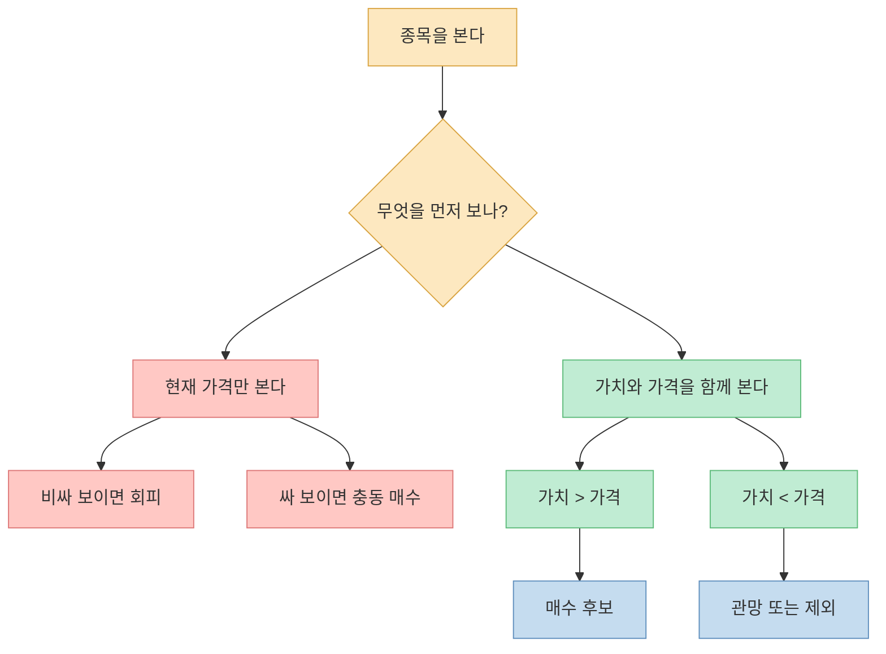
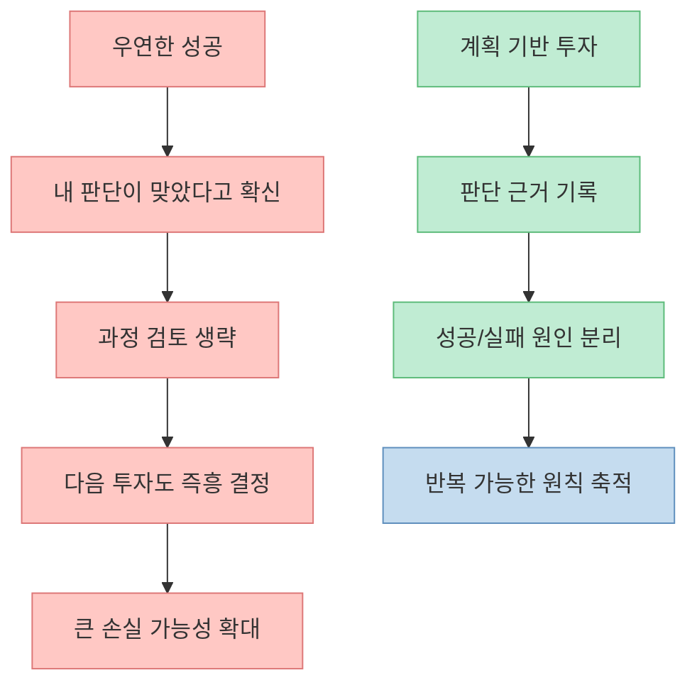
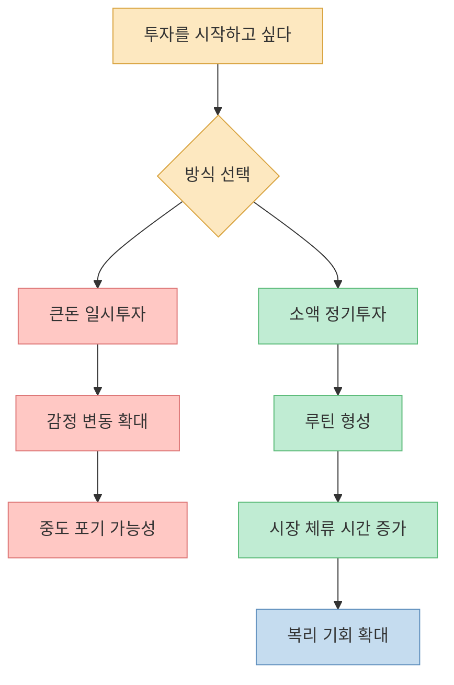
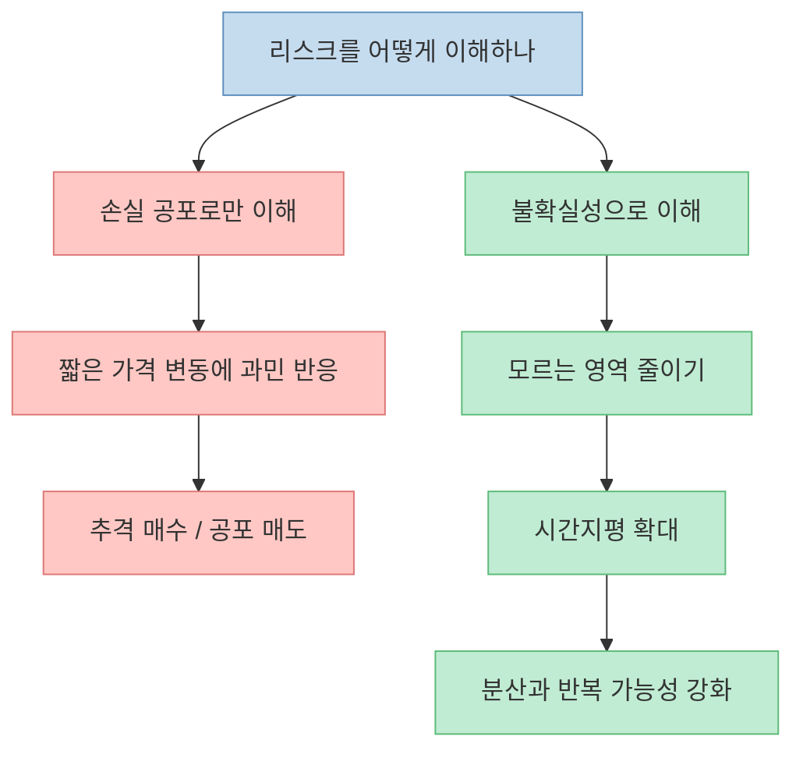
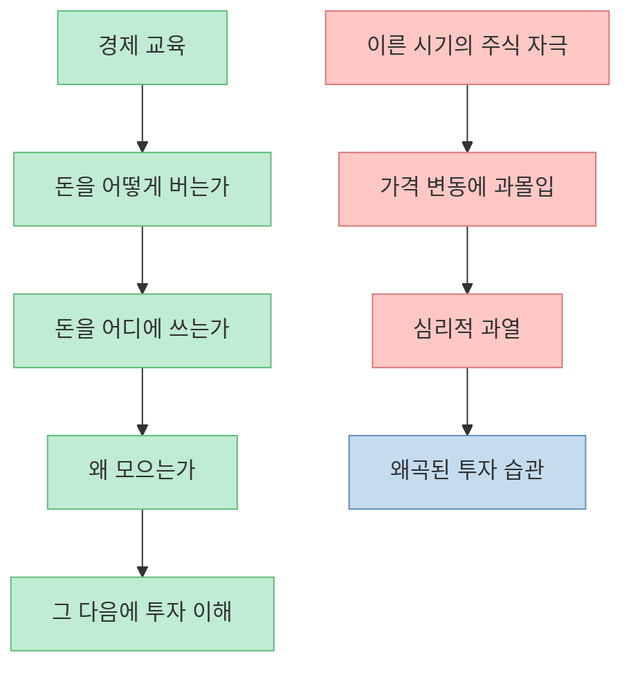

이 영상의 핵심은 “좋은 종목을 고르는 법”보다 더 앞에 있습니다. **왜 사람은 가격을 보고 흔들리고, 왜 운 좋게 번 돈이 다음 실패의 씨앗이 되며, 왜 작은 돈과 자동화가 오히려 큰돈보다 강한 투자 습관을 만드는가** 를 설명합니다. 결국 주식 투자에서 오래 살아남게 만드는 것은 정보량보다 심리 구조입니다.

<!--more-->

## Sources

- [운으로 돈 번 사람들이 쉽게 빠지는 주식의 함정ㅣ지식인초대석: 합석 (김경일 X 이광수 풀버전)](https://youtu.be/ZmgsKOUZTYg)
- [Investor.gov — Dollar Cost Averaging](https://www.investor.gov/introduction-investing/investing-basics/glossary/dollar-cost-averaging)
- [Investor.gov — Asset Allocation and Diversification](https://www.investor.gov/introduction-investing/getting-started/asset-allocation)
- [U.S. Department of Labor — Automatic Enrollment 401(k) Plans For Small Businesses](https://www.dol.gov/node/63357)
- [SEC — Taking Stock](https://www.sec.gov/about/reports-publications/investorpubstakingstockhtm)

## 1. 가격을 보는 투자와 가치를 보는 투자는 완전히 다르다

영상 초반에서 가장 날카로운 장면은 “정찰병” 이야기입니다. 한두 주만 먼저 사 두고 가격 변화를 보면서 판단하겠다는 방식에 대해, 이광수 소장은 그것이 결국 **가치가 아니라 가격에 의사결정을 맡기는 행동** 이라고 지적합니다. 투자자는 가격이 아니라 내가 생각하는 가치와 현재 가격을 비교해야 하는데, 대부분은 가격이 오르내리는 자극 자체에 끌려간다는 뜻입니다. [영상 6분 25초~7분 8초](https://youtu.be/ZmgsKOUZTYg?t=385)

조금 뒤에는 이 논리가 더 분명해집니다. SK하이닉스처럼 이미 많이 오른 종목을 보면 사람들은 “비싸 보인다”고 느끼지만, 이 판단은 대개 절대 가격에서 나옵니다. 영상은 **지금 가격이 높은가가 아니라, 내가 추정하는 가치보다 높은가 낮은가를 따져야 한다** 고 말합니다. 많이 오른 주식이라도 가치가 더 빨리 커지고 있다면 여전히 저평가일 수 있고, 반대로 싸 보이는 주식이라도 가치가 약하면 함정일 수 있습니다. [영상 9분 23초~9분 40초](https://youtu.be/ZmgsKOUZTYg?t=563)

이 관점은 장기 투자에서도 중요합니다. SEC도 장기적으로는 한 종목이나 한 섹터에 몰입하는 방식보다 분산이 위험을 나누는 더 나은 방법이라고 설명합니다. 즉, 투자 판단의 기준은 “많이 올랐으니 무섭다”가 아니라 **무엇을 얼마나 이해하고 있고, 그 판단이 한 종목 가격 움직임에 과도하게 종속되어 있지 않은가** 여야 합니다. [SEC Taking Stock](https://www.sec.gov/about/reports-publications/investorpubstakingstockhtm)

## 2. 운으로 번 돈은 실력을 착각하게 만들고, 그 착각이 다음 손실을 부른다

영상에서 김경일 교수는 “시어머니가 준 3천만 원으로 삼성전자를 샀는데 9억이 됐다”는 식의 기사에 사람들이 강하게 끌리는 이유를 짚습니다. 문제는 그런 사례가 단순한 성공담으로 끝나지 않는다는 데 있습니다. **의지와 계획이 아니라 우연으로 큰 성공을 경험하면, 사람은 다음에도 같은 방식으로 판단해도 된다고 믿기 쉽습니다.** [영상 19분 31초~20분 25초](https://youtu.be/ZmgsKOUZTYg?t=1171)

이광수 소장의 관점에서 이런 사례가 위험한 이유는, 성공한 경험이 곧바로 확증편향으로 연결되기 때문입니다. 실제로 그 결정은 산업 분석, 기업 경쟁력, 밸류에이션 점검 같은 과정을 거친 것이 아닐 수 있는데, 결과가 좋았다는 이유만으로 그 행동 전체가 정당화됩니다. 그러면 다음 투자에서도 “이번에도 그냥 사면 되겠지”가 반복됩니다. 영상이 말하는 “운으로 시작해서 끝까지 운으로 가 버리는 투자”가 바로 이것입니다. [영상 17분 32초~18분 7초](https://youtu.be/ZmgsKOUZTYg?t=1052)

또한 이 대목은 투자와 투기의 구분과도 이어집니다. 영상은 **투자는 미래를 모르는 상태에서 연구하고 결정하는 것** 이고, 투기는 미래를 안다고 착각하거나 아예 정해진 미래를 이용하는 것에 가깝다고 설명합니다. 즉, 과정 없는 성공은 수익이 나도 학습을 남기지 못합니다. [영상 21분 52초~22분 14초](https://youtu.be/ZmgsKOUZTYg?t=1312)

이 섹션의 실전 메시지는 단순합니다. **돈을 벌었는가보다 왜 벌었는가를 먼저 분해해야 합니다.** 운으로 번 돈을 실력으로 오해하면 계좌는 커질 수 있어도 판단 체계는 오히려 약해질 수 있습니다.

## 3. 큰돈보다 작은 돈, 결심보다 루틴이 오래가는 투자를 만든다

영상은 반복해서 “처음부터 큰돈을 넣지 말라”고 말합니다. 이유는 단순히 손실이 무서워서가 아니라, 너무 큰돈으로 시작하면 수익과 손실 모두 감정 자극이 커져서 오래 버티기 어려워지기 때문입니다. 이광수 소장은 **적은 돈으로 시작한 사람이 오랫동안 투자하고, 오랫동안 투자한 사람이 결국 더 부자가 될 가능성이 높다** 고 설명합니다. [영상 24분 4초~24분 33초](https://youtu.be/ZmgsKOUZTYg?t=1444)

김경일 교수는 여기서 한 걸음 더 나갑니다. 개인 차원에서는 습관이, 사회 차원에서는 디폴트가 필요하다는 것입니다. 한 번에 1천만 원을 넣는 건 어렵지만 매달 5만 원, 10만 원을 자동으로 투자하게 만들면 심리적 저항이 크게 줄어듭니다. 그는 이를 “비명시적인 강제”라고 표현합니다. 내가 매번 의지를 짜내지 않아도 시스템이 먼저 행동을 만들어 주는 구조입니다. [영상 14분 39초~16분 53초](https://youtu.be/ZmgsKOUZTYg?t=879)

이 부분은 공식 자료와도 맞닿습니다. Investor.gov는 달러 코스트 애버리징을 **같은 금액을 정기적으로 투자해 시장의 오르내림과 무관하게 지속하는 방식** 으로 설명합니다. 또 미국 노동부는 자동등록 401(k) 제도에서 급여에서 자동으로 적립하고, 장기 성장을 위한 기본 투자 옵션을 두는 구조를 안내합니다. 이는 영상의 주장처럼 “의지”보다 “설계”가 장기 참여를 더 잘 만든다는 점을 보여 줍니다. [Investor.gov DCA](https://www.investor.gov/introduction-investing/investing-basics/glossary/dollar-cost-averaging), [DOL 401(k)](https://www.dol.gov/node/63357)

여기서 중요한 것은 자동화가 만능이라는 뜻이 아니라는 점입니다. 자동화는 **판단을 대신하기보다, 흔들릴 가능성이 큰 인간을 덜 흔들리게 만드는 안전레일** 에 가깝습니다.

## 4. 리스크는 “위험한 기분”이 아니라 내가 모르는 것이 얼마나 많은가의 문제다

영상 후반에서 이광수 소장은 “리스크를 위험이라고 번역하는 것은 피해야 한다”고 말합니다. 그의 논리는 분명합니다. 투자에서 리스크는 단순히 “돈을 잃을 가능성”이 아니라 **불확실성이 얼마나 큰가** 에 더 가깝다는 것입니다. 그래서 짧은 구간일수록 변수 노출이 크고, 더 긴 시간축을 볼수록 내가 모르는 돌발 변수의 비중을 줄일 수 있다는 설명으로 이어집니다. [영상 35분 34초~38분 0초](https://youtu.be/ZmgsKOUZTYg?t=2134)

이 관점에서 “고수익 고위험”이라는 익숙한 문구도 다시 봐야 합니다. 영상은 고수익을 노리려면 오히려 더 긴 시간축과 더 긴 체류가 필요하다고 봅니다. 짧은 시간 안에 큰돈을 벌겠다는 태도는 변수에 더 많이 노출되고, 감정적 의사결정도 커집니다. 반대로 오래 투자하려면 많이 잃지 않아야 하고, 많이 잃지 않으려면 내가 이해하지 못하는 영역에 과도하게 베팅하지 말아야 합니다. [영상 36분 0초~37분 20초](https://youtu.be/ZmgsKOUZTYg?t=2160)

Investor.gov 역시 자산배분에서 시간지평과 위험감내도를 핵심 변수로 설명합니다. 투자 기간이 길수록 더 큰 변동성을 감수할 수 있고, 분산은 한 바구니 리스크를 줄이는 기본 수단입니다. 또 ETF나 뮤추얼펀드도 한 섹터에 너무 좁게 집중되면 충분한 분산이 아닐 수 있다고 안내합니다. 이는 영상의 “불확실성을 줄이는 방향으로 투자 구조를 짜라”는 메시지와 맞닿아 있습니다. [Investor.gov Asset Allocation](https://www.investor.gov/introduction-investing/getting-started/asset-allocation)

즉, 리스크 관리는 겁을 없애는 일이 아니라 **무엇을 모르고 있는지 인정하는 능력** 에 가깝습니다.

## 5. 비교하는 사람은 흔들리고, 아이에게 너무 이른 투자는 심리를 망가뜨릴 수 있다

김경일 교수는 투자에 실패하는 사람들의 공통점으로 “비교”를 꼽습니다. 비교는 답이 있는 문제를 푸는 과정이 아니라, 끝없는 기준 이동에 가깝기 때문입니다. 누군가의 수익률, 버핏의 성과, 옆 사람의 급등주 경험을 기준으로 행동을 바꾸기 시작하면 내 계획은 사라지고 남의 성과가 내 의사결정의 리모컨이 됩니다. [영상 28분 9초~28분 42초](https://youtu.be/ZmgsKOUZTYg?t=1689)

이 비교 심리는 자녀 경제교육 이야기에서도 이어집니다. 영상은 아이들에게 너무 일찍 주식 투자 자체를 가르치는 것에 부정적입니다. 그보다 먼저 필요한 것은 **돈이 어떻게 벌리고, 왜 쓰이며, 무엇을 위해 모으는가** 를 아는 일이라는 것입니다. 부모가 자신의 노동과 가계 흐름을 솔직하게 설명하고, 그다음에 투자 활동을 연결해야 한다는 순서입니다. 아이를 너무 이른 시점에 가격 변동과 손익 자극에 노출시키면, 투자 교육이 아니라 과도한 심리 자극 교육이 될 수 있다는 경고입니다. [영상 44분 13초~44분 56초](https://youtu.be/ZmgsKOUZTYg?t=2653)

이 메시지는 성인 투자자에게도 그대로 적용됩니다. 내 계좌를 망치는 첫 번째 원인은 종목이 아니라, **남의 결과를 보고 내 원칙을 바꾸는 습관** 일 수 있습니다.

## 핵심 요약

- 투자 판단의 기준은 가격 자체가 아니라 **가치와 가격의 비교** 여야 합니다. [6분 25초~9분 40초](https://youtu.be/ZmgsKOUZTYg?t=385)
- **운으로 번 돈은 실력을 착각하게 만들기 쉬워서 더 위험** 합니다. [17분 32초~20분 25초](https://youtu.be/ZmgsKOUZTYg?t=1052)
- 오래 투자하려면 처음부터 큰돈보다 **작은 돈과 자동화된 루틴** 이 유리합니다. [14분 39초~16분 53초](https://youtu.be/ZmgsKOUZTYg?t=879), [24분 4초~24분 33초](https://youtu.be/ZmgsKOUZTYg?t=1444)
- 투자에서 리스크는 단순 손실 공포보다 **불확실성 관리** 에 가깝습니다. [35분 34초~38분 0초](https://youtu.be/ZmgsKOUZTYg?t=2134)
- 비교 습관은 투자 계획을 무너뜨리고, 아이에게 너무 이른 주식 교육은 심리적 왜곡을 만들 수 있습니다. [28분 9초~28분 42초](https://youtu.be/ZmgsKOUZTYg?t=1689), [44분 13초~44분 56초](https://youtu.be/ZmgsKOUZTYg?t=2653)

## 결론

이 영상은 종목 추천 영상이 아니라 **투자자를 망가뜨리는 심리 구조를 해부한 영상** 에 가깝습니다. 많이 아는 것보다 중요한 것은 가격 자극에 덜 흔들리는 구조를 만드는 일입니다. 적은 돈으로, 오래, 비교를 줄이고, 운을 실력으로 착각하지 않는 사람만이 시장에 오래 남을 가능성이 높습니다.
