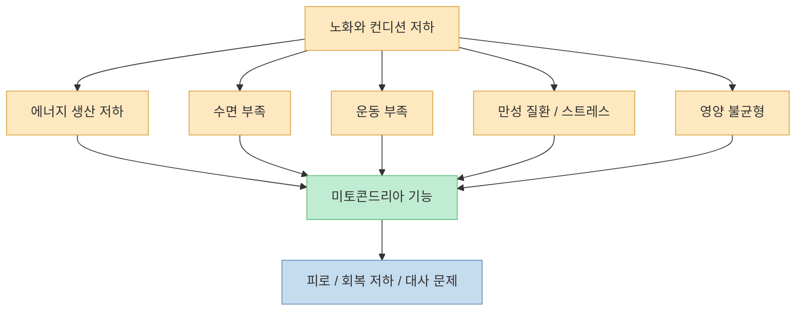
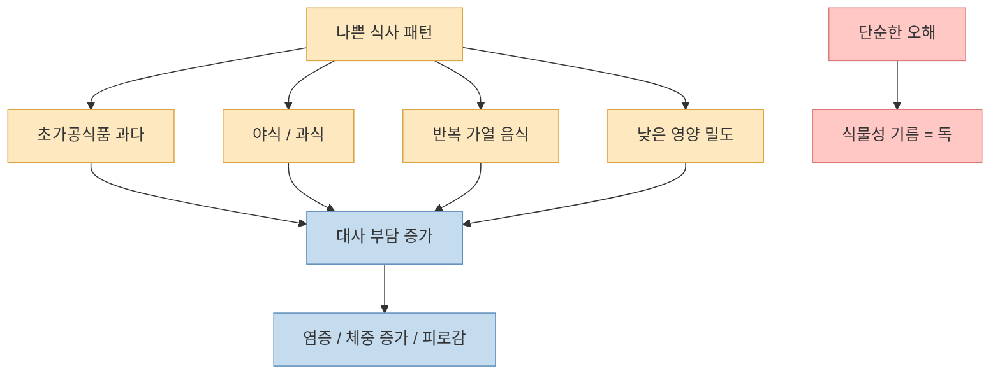
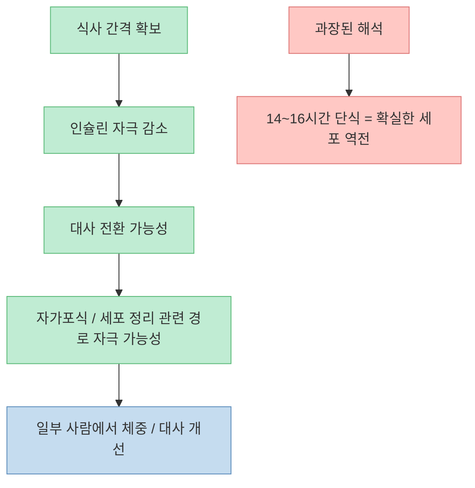
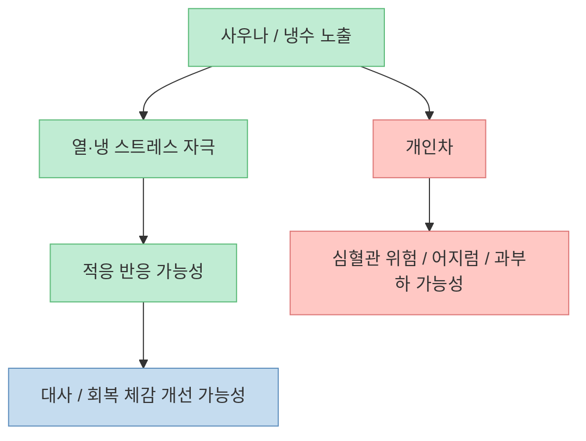
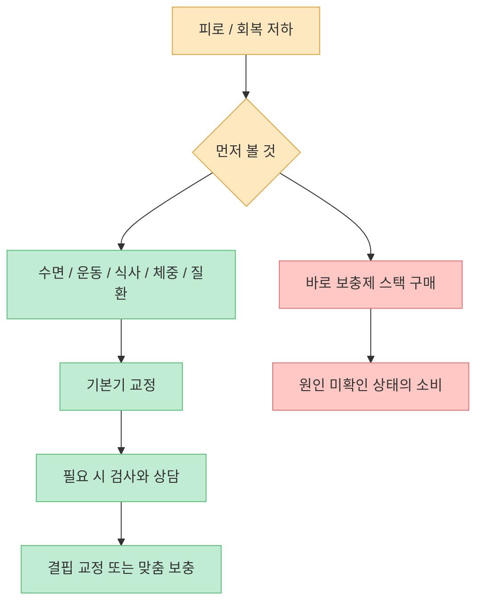
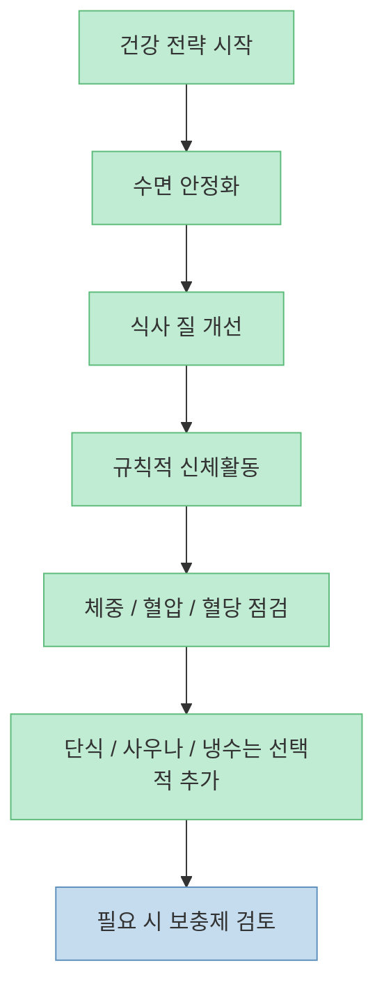

이 영상은 노화의 원인을 미토콘드리아 기능 저하로 묶고, 해결책으로 단식, 사우나, 냉수 노출, 일부 보충제를 제안합니다. 방향 자체는 흥미롭습니다. **미토콘드리아가 세포 에너지 생산과 대사 건강에 중요한 것은 사실** 이기 때문입니다. 다만 영상은 일부 메커니즘을 매우 강하게 단순화합니다. 실제로는 “미토콘드리아가 중요하다”와 “특정 음식이나 습관이 미토콘드리아를 독살한다” 사이에는 꽤 큰 간격이 있습니다.

<!--more-->

## Sources

- [노화를 멈추는 미토콘드리아의 비밀: 당신이 늙는 진짜 이유와 세포 역전 가이드](https://youtu.be/oGUBEUXA3LI)
- [National Institute on Aging — Cognitive Health and Older Adults](https://www.nia.nih.gov/health/brain-health/cognitive-health-and-older-adults)
- [NHLBI, NIH — Heart-Healthy Living: Choose Heart-Healthy Foods](https://www.nhlbi.nih.gov/health/heart-healthy-living/healthy-foods)
- [American Heart Association — Fats in Foods](https://www.heart.org/en/healthy-living/healthy-eating/eat-smart/fats/fats-in-foods)
- [NIH ODS — Magnesium Fact Sheet for Health Professionals](https://ods.od.nih.gov/factsheets/Magnesium-HealthProfessional/)
- [NIH ODS — Dietary Supplements for Primary Mitochondrial Disorders](https://ods.od.nih.gov/factsheets/primarymitochondrialdisorders-healthprofessional/)
- [PubMed — Heat shock proteins and heat therapy for type 2 diabetes: pros and cons](https://pubmed.ncbi.nlm.nih.gov/26049635/)
- [PMC — Cold exposure and human metabolism: A heterogeneous response across tissues and organs](https://pmc.ncbi.nlm.nih.gov/articles/PMC12962692/)
- [PMC — Fasting: From Physiology to Pathology](https://pmc.ncbi.nlm.nih.gov/articles/PMC10037992/)

## 1. 미토콘드리아가 중요한 건 맞다: 에너지, 회복, 노화가 모두 여기와 연결된다

영상은 미토콘드리아를 세포 속 “배터리”로 설명합니다. 비유는 다소 자극적이지만, 방향은 틀리지 않습니다. 미토콘드리아는 ATP 생산에 핵심적인 역할을 하고, 에너지 생산이 흔들리면 피로감, 운동 수행능력 저하, 대사 불균형 같은 문제가 나타날 수 있습니다. 영상도 음식이 직접 에너지가 되는 것이 아니라, 결국 세포 수준에서 에너지 화폐로 바뀌어야 한다는 점을 강조합니다. [영상 2분 부근](https://youtu.be/oGUBEUXA3LI?t=120)

다만 여기서 바로 “나이 든다는 것은 미토콘드리아가 독에 중독되는 과정”이라고 말해 버리면 과학보다 서사가 앞서게 됩니다. 노화는 미토콘드리아 하나로 설명되지 않습니다. 유전, 면역, 호르몬, 수면, 활동량, 만성질환, 영양상태, 사회적 스트레스가 함께 작동합니다. 그래서 미토콘드리아를 **노화의 핵심 축 중 하나** 로 보는 것은 가능하지만, 그것을 “유일한 스위치”처럼 다루는 순간 해석이 과장됩니다.

NIA도 건강한 노화에서 식사, 운동, 수면, 만성질환 관리가 함께 중요하다고 설명합니다. 즉 실제 건강 전략은 미토콘드리아만 겨냥하는 단일 해법이 아니라, **생활습관 전체가 에너지 시스템을 덜 망가뜨리도록 설계하는 일** 에 가깝습니다. [NIA 인지건강 안내](https://www.nia.nih.gov/health/brain-health/cognitive-health-and-older-adults)

## 2. “식물성 기름이 미토콘드리아를 독살한다”는 주장은 너무 세다

영상에서 가장 강한 표현은 씨앗기름과 가공식품이 미토콘드리아 막을 무너뜨리고 세포를 안쪽에서부터 파괴한다는 부분입니다. 특히 오메가6 다중불포화지방산을 구조적으로 불안정한 성분으로 설명하면서, 사실상 대부분의 외식·가공식품을 세포 독성의 원인처럼 연결합니다. [영상 4분~6분 부근](https://youtu.be/oGUBEUXA3LI?t=240)

하지만 이 대목은 현재의 공식 영양 가이드와 충돌합니다. NHLBI와 미국심장협회는 포화지방과 트랜스지방을 줄이고, 대신 불포화지방을 포함한 식품과 액체 식물성 기름을 활용하라고 권고합니다. AHA는 단일불포화·다중불포화지방이 심혈관 건강에 도움이 될 수 있고, 비열대성 식물성 기름을 포화지방 대체재로 권합니다. [AHA 지방 가이드](https://www.heart.org/en/healthy-living/healthy-eating/eat-smart/fats/fats-in-foods), [NHLBI 식사 가이드](https://www.nhlbi.nih.gov/health/heart-healthy-living/healthy-foods)

그렇다면 영상이 완전히 틀렸다는 뜻일까요? 꼭 그렇지는 않습니다. **문제는 “식물성 기름 자체”보다, 초가공식품 패턴과 반복 가열, 과잉 열량, 야식, 낮은 영양밀도 식사일 가능성이 더 큽니다.** 치킨, 과자, 드레싱, 디저트가 건강에 좋지 않은 이유를 전부 오메가6 독성 하나로 설명하는 것은 지나친 단순화입니다. 같은 식물성 기름이라도 조리 방식, 전체 식단, 총 섭취량, 가공 정도가 결과를 크게 바꿉니다.

건강하게 읽는 방법은 이렇습니다. 영상의 경고를 “외식과 가공식품 비중이 너무 높고, 밤늦게 자주 먹고, 식단의 질이 떨어지면 대사 건강이 무너질 수 있다”로 번역하면 상당 부분 유효합니다. 반대로 “모든 식물성 기름은 세포 독”으로 받아들이면 현재의 근거 기반 영양학과 멀어집니다.

## 3. 단식과 오토파지는 유망하지만, 인간에서의 효과는 아직 ‘만능 스위치’가 아니다

영상은 미토콘드리아 청소 시스템을 켜는 핵심으로 공복을 제시합니다. 밤 1시부터 아침 7시까지 자고, 오전 식사를 건너뛰어 오후 1시까지 공복을 유지하면 14시간 단식이 되며, 이것이 청소 모드인 오토파지를 켠다고 설명합니다. [영상 10분~11분 부근](https://youtu.be/oGUBEUXA3LI?t=600)

방향은 상당히 그럴듯합니다. 단식과 시간제한식이(time-restricted feeding)가 대사 전환, 인슐린 신호 변화, 자가포식 관련 경로와 연결된다는 연구는 많습니다. 다만 중요한 단서가 있습니다. **세포·동물 수준에서 보이는 메커니즘과, 실제 인간이 특정 시간 단식을 했을 때 임상적으로 얼마나 큰 차이를 만드는지는 아직 같은 강도로 증명되지 않았습니다.** 인간 연구는 유망하지만, 아직 “몇 시간 공복 = 확실한 세포 역전”이라고 단정할 단계는 아닙니다. [PMC 단식 리뷰](https://pmc.ncbi.nlm.nih.gov/articles/PMC10037992/)

또 단식이 누구에게나 같은 방식으로 좋은 것도 아닙니다. 당뇨약을 쓰는 사람, 임신 중인 사람, 섭식장애 병력이 있는 사람, 과도한 저체중인 사람에게는 오히려 위험할 수 있습니다. 그래서 단식은 “누구나 무조건 해야 하는 필수 의식”이 아니라 **대사 건강을 개선할 수 있는 한 가지 도구** 로 보는 편이 맞습니다.

실전에서는 “단식 시간 그 자체”보다 먼저 봐야 할 것이 있습니다. 밤늦은 야식을 줄였는지, 총열량이 관리되는지, 아침을 굶는 대신 오후에 폭식하지 않는지, 단백질과 섬유질이 충분한지입니다. 이런 기본기가 빠진 채 단식 시간만 늘리면 건강 전략이 아니라 일정표 놀이가 되기 쉽습니다.

## 4. 사우나와 냉수는 흥미로운 스트레스 자극이지만, 효과를 과장하면 안 된다

영상은 사우나를 통해 열충격 단백질이 유도되고, 냉수 노출로 미토콘드리아 생성 능력이 크게 증가할 수 있다고 설명합니다. 또 사우나와 냉수 샤워를 번갈아 적용하는 “호르메틱 스트레스”를 한국형 바이오해킹 프로토콜처럼 제안합니다. [영상 12분~15분 부근](https://youtu.be/oGUBEUXA3LI?t=720)

이 역시 완전히 허구는 아닙니다. 열 자극은 heat shock protein과 관련된 반응을 일으킬 수 있고, 냉자극은 대사 적응과 열생산, 일부 조직에서의 미토콘드리아 관련 경로와 연결될 수 있다는 연구가 있습니다. 다만 여기서도 핵심은 **가능성** 과 **확정된 임상효과** 를 구분하는 일입니다. 사우나와 열치료에 대한 리뷰는 대사·혈관 측면의 잠재적 이점을 말하지만, 동시에 대상자 특성과 안전성 문제를 함께 봅니다. 냉노출 연구 역시 개인차가 크고, 장기적인 임상효과는 아직 더 확인이 필요하다고 봅니다. [PubMed 열치료 리뷰](https://pubmed.ncbi.nlm.nih.gov/26049635/), [PMC 냉노출 리뷰](https://pmc.ncbi.nlm.nih.gov/articles/PMC12962692/)

특히 고혈압, 심혈관질환, 부정맥, 실신 경향이 있는 사람에게는 고온·저온 자극이 안전하지 않을 수 있습니다. 즉 사우나와 냉수는 **기본 수면, 식사, 운동을 대체하는 핵심 치료법** 이 아니라, 안전한 사람에게 제한적으로 추가할 수 있는 부가적 자극에 더 가깝습니다.

이 주제를 가장 현실적으로 정리하면 이렇습니다. **사우나와 냉수는 “좋을 수 있는 선택지”이지, 미토콘드리아를 되살리는 필수 코스는 아닙니다.**

## 5. 보충제 스택은 가장 나중 문제다: 결핍 교정과 질환 맥락을 구분해야 한다

영상 후반은 NMN, 마그네슘, 카르니틴, 알파리포산 같은 보충제를 묶어 “미토콘드리아 스택”처럼 제시합니다. [영상 16분 부근](https://youtu.be/oGUBEUXA3LI?t=960) 이 중 일부는 실제로 미토콘드리아 대사와 관련이 있습니다. 예를 들어 NIH ODS는 마그네슘이 수백 개 효소 시스템에 관여하고 에너지 생산에도 필요하다고 설명합니다. [NIH ODS 마그네슘](https://ods.od.nih.gov/factsheets/Magnesium-HealthProfessional/)

하지만 여기서도 중요한 구분이 있습니다.

- **마그네슘**: 결핍이 있거나 섭취가 부족하면 교정이 도움이 될 수 있습니다. 그러나 모든 피로와 노화를 마그네슘 부족으로 설명할 수는 없습니다.
- **카르니틴 / 알파리포산**: NIH ODS가 별도 팩트시트에서 다루는 맥락은 주로 **원발성 미토콘드리아 질환** 입니다. 즉 일반인이 항노화 목적으로 먹는 상황과, 특정 질환에서 보조적으로 검토되는 상황은 다릅니다. [NIH ODS 미토콘드리아 질환 보충제](https://ods.od.nih.gov/factsheets/primarymitochondrialdisorders-healthprofessional/)
- **NMN**: 대중적 관심은 크지만, 일반인의 장기 복용이 노화를 늦춘다고 단정할 정도의 확고한 임상 근거는 아직 부족합니다.

이 섹션의 결론은 단순합니다. **보충제는 생활습관을 대신할 수 없고, 질환 맥락에서 쓰이는 성분을 일반 항노화 전략으로 곧장 옮겨오면 과장되기 쉽습니다.**

## 6. 실제로 적용한다면 “미토콘드리아 해킹”보다 기본기 재설계가 먼저다

영상의 장점은 사람들이 평소 너무 당연하게 여기던 피로, 체력 저하, 회복력 감소를 세포 수준의 관점에서 다시 보게 만든다는 점입니다. 또 “지금의 일상 패턴이 에너지 시스템을 망가뜨리고 있을 수 있다”는 경고도 꽤 유효합니다. [영상 18분 부근](https://youtu.be/oGUBEUXA3LI?t=1080)

하지만 현실적인 적용 순서는 영상과 조금 달라야 합니다.

1. 먼저 수면 시간을 안정화합니다.  
2. 초가공식품·야식·과식을 줄입니다.  
3. 주 150분 수준의 규칙적인 신체활동을 확보합니다. NIA도 신체활동이 에너지, 균형, 기분, 대사 건강에 폭넓게 도움이 된다고 설명합니다. [NIA 신체활동 안내](https://www.nia.nih.gov/health/brain-health/cognitive-health-and-older-adults)
4. 그다음에 식사 간격 조절이나 사우나 같은 추가 전략을 검토합니다.  
5. 마지막이 보충제입니다.

이 순서를 거꾸로 하면 대부분 실패합니다. 사우나는 갔는데 수면은 여전히 엉망이고, NMN은 샀는데 야식은 계속하고, 냉수 샤워는 하는데 운동은 안 하는 식이면 체감 변화가 작을 수밖에 없습니다.

## 핵심 요약

- 미토콘드리아가 노화와 대사 건강에 중요한 것은 맞지만, **노화를 하나의 원인으로 환원하면 과장** 이 됩니다. [영상 2분 부근](https://youtu.be/oGUBEUXA3LI?t=120)
- 영상의 “식물성 기름 독성론”은 너무 강합니다. 공식 가이드는 오히려 **포화지방 대신 불포화지방을 권장** 합니다.
- 단식과 오토파지는 유망한 주제지만, **인간에서의 효과는 아직 조건과 개인차가 큽니다**. [영상 10분 부근](https://youtu.be/oGUBEUXA3LI?t=600)
- 사우나와 냉수는 도움이 될 수 있지만, **보조적 전략** 이지 핵심 치료는 아닙니다. [영상 12분~15분 부근](https://youtu.be/oGUBEUXA3LI?t=720)
- 보충제는 가장 마지막 문제입니다. **기본 생활습관과 결핍 평가 없이 “미토콘드리아 스택”부터 시작하면 우선순위가 뒤집힙니다.**

## 결론

이 영상은 좋은 문제의식을 던집니다. 우리는 피로와 노화를 너무 쉽게 “나이 탓”으로 넘깁니다. 하지만 **대부분의 사람에게 필요한 것은 미토콘드리아 신화가 아니라 생활습관의 구조조정** 입니다. 덜 자주 먹고, 덜 가공된 음식을 먹고, 더 자고, 더 움직이고, 필요하면 그다음에 단식·사우나·보충제를 얹는 것. 그 순서를 지키는 사람이 결국 가장 현실적으로 “젊게 사는 사람”에 가깝습니다.
