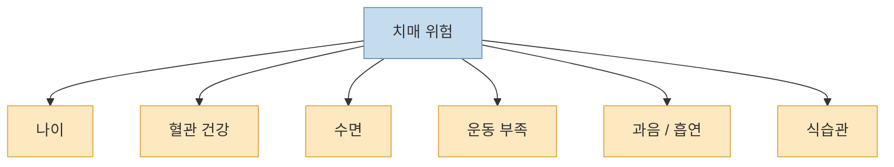
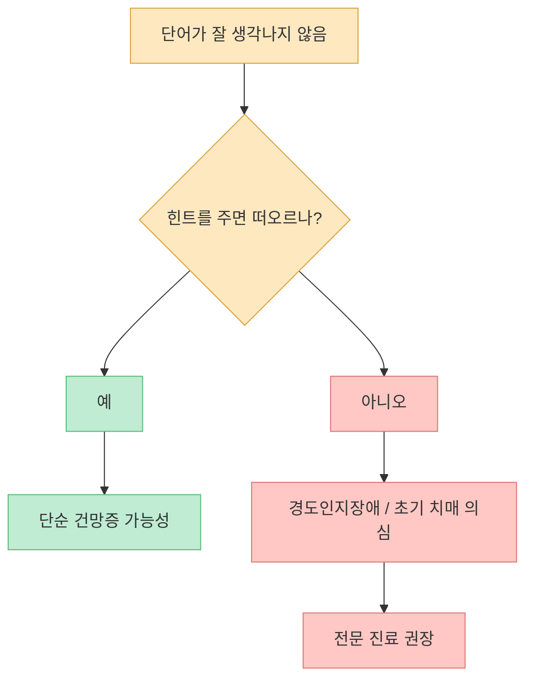
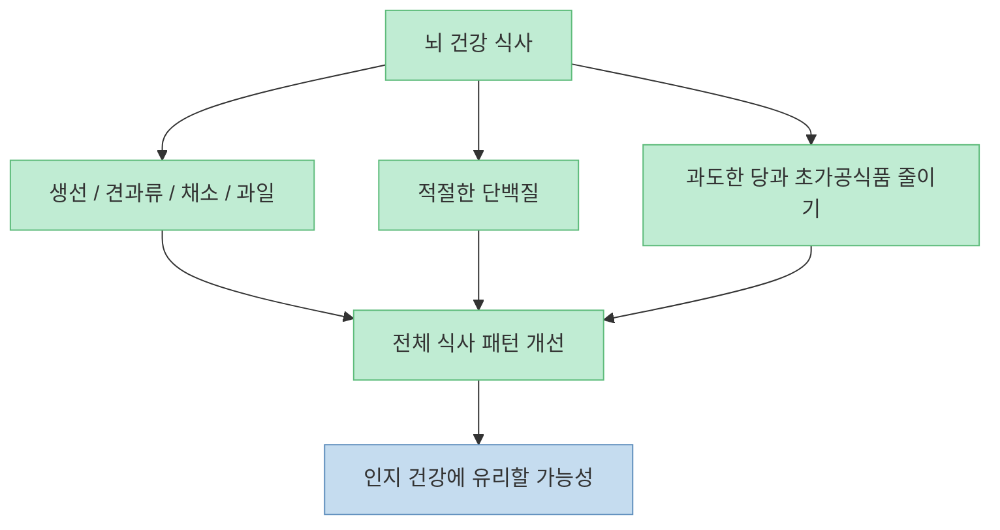
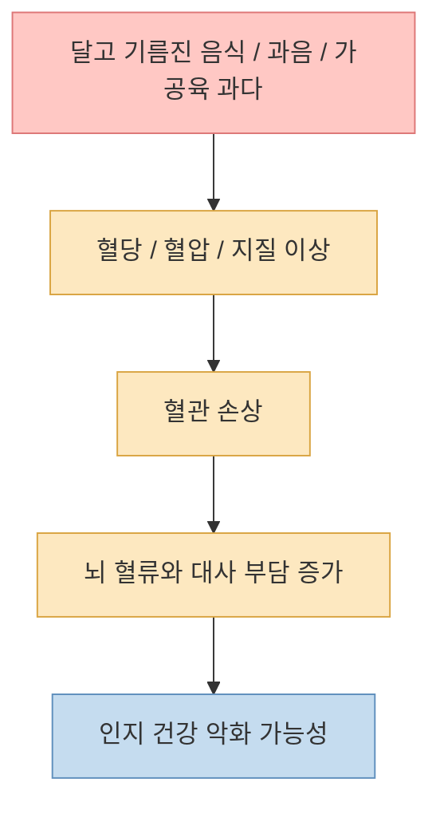
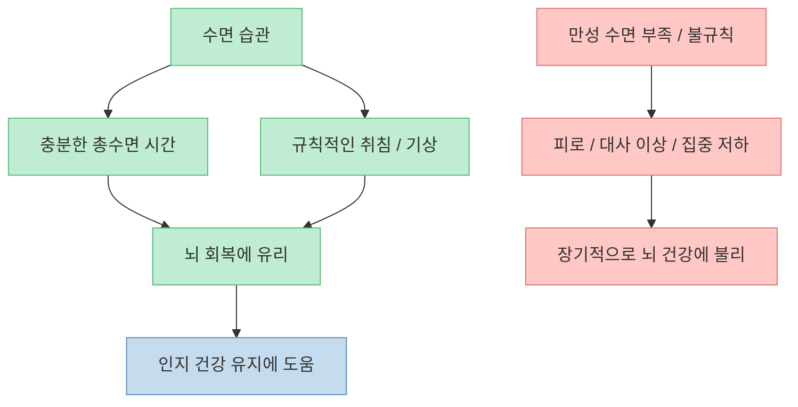
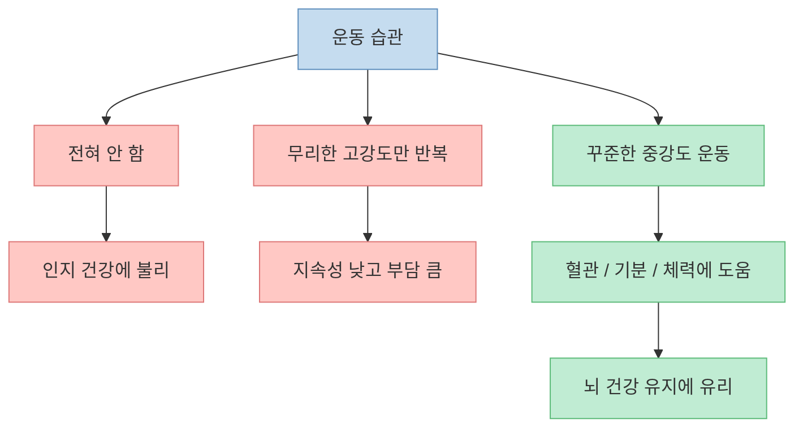
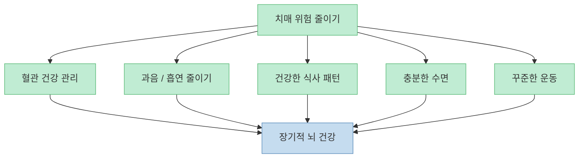

이 영상은 치매 위험을 낮추는 음식과 생활습관을 한 번에 정리합니다. 핵심 메시지는 나쁘지 않습니다. **치매는 단순히 나이 탓으로만 생기는 것이 아니라, 혈관 건강·수면·운동·음주·식습관과 깊게 연결될 수 있다** 는 것이죠. 다만 “계란을 먹으면 치매를 막는다”처럼 단일 음식 중심으로 이해하면 과장되기 쉽습니다. 실제로는 생활습관 전체가 훨씬 중요합니다.

<!--more-->

## Sources

- [의사들도 모르는 치매 걸리는 원인! 결국 밝혀졌습니다. 제발 '이것' 그만 드세요 (치매 총정리)](https://youtu.be/_lBt-48nUvs)
- [National Institute on Aging — Cognitive Health and Older Adults](https://www.nia.nih.gov/health/brain-health/cognitive-health-and-older-adults)
- [National Institute on Aging — Understanding Memory Loss](https://order.nia.nih.gov/sites/default/files/2024-08/understanding-memory-loss.pdf)
- [WHO — Dementia](https://www.who.int/news-room/fact-sheets/detail/dementia)
- [WHO — Risk reduction of cognitive decline and dementia](https://www.who.int/publications/i/item/risk-reduction-of-cognitive-decline-and-dementia)

## 1. 치매는 “나이 들면 어쩔 수 없는 병”이 아니라 위험요인이 쌓여 생길 수 있는 질환이다

영상은 65세 이상 10명 중 1명 정도가 치매를 겪는다는 점을 강조하며, 고령화와 함께 치매가 더 흔해지고 있다고 설명합니다. 또 초기 단계인 경도인지장애까지 포함하면 훨씬 더 많은 사람이 위험군에 들어간다고 말합니다. [영상 0분 부근](https://youtu.be/_lBt-48nUvs?t=0)

WHO도 치매를 단순한 정상 노화가 아니라, 기억·사고·일상 기능에 영향을 주는 질환군으로 설명합니다. 중요한 것은 나이가 가장 큰 위험요인 중 하나이긴 하지만, 나이만으로 결정되는 것은 아니라는 점입니다. 고혈압, 당뇨, 비만, 흡연, 과음, 신체활동 부족, 우울, 사회적 고립 같은 요인도 치매 위험을 높일 수 있습니다. [WHO 치매 팩트시트](https://www.who.int/news-room/fact-sheets/detail/dementia)

즉 치매를 두려워하는 가장 좋은 방법은 “특효식품 찾기”보다 **위험요인을 줄이는 방향으로 삶을 조정하는 것** 입니다.

## 2. 건망증과 초기 인지저하는 구분해야 한다: 힌트를 줘도 낯설면 진료가 필요하다

영상은 경도인지장애를 의심할 수 있는 신호로, 평소 자주 쓰던 단어가 잘 떠오르지 않는 현상을 제시합니다. 특히 힌트를 듣고 바로 떠오르면 단순 건망증일 수 있지만, 힌트를 들어도 단어가 낯설고 연결이 잘 안 되면 더 주의해야 한다고 설명합니다. [영상 2분 부근](https://youtu.be/_lBt-48nUvs?t=120)

NIA의 안내도 비슷한 방향입니다. 경도인지장애(MCI)는 같은 나이대 사람보다 기억이나 사고 문제를 더 많이 겪지만, 알츠하이머병만큼 심각한 기능 저하까지는 가지 않은 상태를 뜻합니다. 다만 일부 사람에게서는 이후 치매로 진행할 수 있기 때문에 평가와 추적이 중요합니다. [NIA Understanding Memory Loss](https://order.nia.nih.gov/sites/default/files/2024-08/understanding-memory-loss.pdf)

이 구분은 중요합니다. “나이 들면 다 그렇지”라고 넘기면, 정작 조기에 확인하고 관리할 기회를 놓칠 수 있기 때문입니다.

## 3. 계란·생선·블루베리는 도움이 될 수 있지만, 어디까지나 ‘패턴의 일부’다

영상은 치매에 도움이 되는 음식으로 계란, 기름진 생선, 블루베리를 제시합니다. 계란의 콜린과 레시틴, 생선의 오메가3, 블루베리의 안토시아닌처럼 뇌 기능과 연관된 영양 성분이 있다는 설명입니다. [영상 4분~8분 부근](https://youtu.be/_lBt-48nUvs?t=240)

이런 방향은 충분히 이해할 만합니다. 실제로 NIA와 WHO도 전반적으로 건강한 식사 패턴이 인지 건강에 도움이 될 수 있다고 설명합니다. 하지만 여기서 꼭 짚어야 할 점이 있습니다. **특정 음식 하나가 치매를 예방한다고 단정할 수준의 근거는 보통 부족하고, 대부분은 식사 패턴 전체의 효과가 더 큽니다.** 다시 말해 계란, 생선, 블루베리가 “좋은 후보”일 수는 있어도, 그것만으로 치매 위험이 정해지는 것은 아닙니다.

따라서 영상을 실천할 때는 “오늘부터 계란만 더 먹자”가 아니라, **초가공식품을 줄이고, 생선·과일·채소 비중을 높이는 방향으로 식사 전체를 바꾸자** 로 해석하는 편이 맞습니다.

## 4. 달고 기름진 음식, 가공육, 과음이 문제인 이유는 결국 혈관과 염증 때문이다

영상은 치매에 나쁜 음식으로 달고 기름진 음식, 가공육·적색육, 술을 강조합니다. 논리는 비교적 일관됩니다. 혈당 급등, 혈관 손상, 염증 증가, 뇌로 가는 혈류 악화 같은 변화가 장기적으로 인지 저하 위험을 높일 수 있다는 것입니다. [영상 8분~12분 부근](https://youtu.be/_lBt-48nUvs?t=480)

WHO 역시 해로운 음주, 비만, 혈당 이상, 고혈압, 고지혈증 같은 요인을 치매 위험과 연결합니다. NIA도 심혈관 건강을 잘 관리하는 것이 뇌 건강을 지키는 데 중요하다고 설명합니다. 즉 영상의 핵심은 과장된 “독성 식품론”이 아니라, **혈관 건강을 망가뜨리는 식사와 음주 습관이 뇌에도 좋지 않다** 는 쪽으로 이해하는 것이 가장 안전합니다. [WHO 가이드](https://www.who.int/publications/i/item/risk-reduction-of-cognitive-decline-and-dementia), [NIA Cognitive Health](https://www.nia.nih.gov/health/brain-health/cognitive-health-and-older-adults)

특히 술은 “적당히 마시면 괜찮지 않을까?”라고 생각하기 쉽지만, 영상처럼 장기간 과음은 분명히 좋지 않습니다. WHO도 해로운 음주를 줄이는 것을 치매 위험 감소 전략에 포함합니다.

## 5. 수면은 생각보다 훨씬 중요하다: 총수면 시간과 규칙성이 둘 다 중요하다

영상은 수면 시간을 6시간 이하로 줄이는 것이 치매 위험을 높일 수 있다고 설명하고, 하루 7시간 이상 자는 습관과 규칙적인 수면 패턴을 강조합니다. [영상 14분~16분 부근](https://youtu.be/_lBt-48nUvs?t=840)

NIA도 충분한 수면, 일반적으로 성인에서 7~9시간 정도의 수면을 권하며, 수면이 기억력·집중력·전반적 뇌 기능에 중요하다고 설명합니다. 영상처럼 “수면 부족이 치매 위험과 연결될 수 있다”는 방향은 현재의 공중보건 메시지와도 크게 어긋나지 않습니다. 다만 여기서도 핵심은 한 연구 수치 자체보다, **만성적인 수면 부족과 불규칙한 생활이 뇌 건강에 좋지 않다** 는 큰 원칙입니다. [NIA Cognitive Health](https://www.nia.nih.gov/health/brain-health/cognitive-health-and-older-adults)

영상에 나온 “낮잠이 늘어나면 위험 신호일 수 있다”는 대목도 흥미롭지만, 이것은 진단 기준이라기보다 **평소와 달리 졸림과 수면 패턴이 변하면 체크가 필요하다** 는 신호로 받아들이는 편이 좋습니다.

## 6. 운동은 세게보다 꾸준하게: 너무 안 해도, 너무 과해도 문제일 수 있다

영상은 운동이 치매 예방에 도움되지만, 너무 고강도 운동만 고집하는 것은 오히려 부담이 될 수 있고, 중강도 운동을 꾸준히 하는 편이 더 현실적이라고 설명합니다. 또 일주일 140분 정도의 중강도 운동이 도움이 될 수 있다고 말합니다. [영상 18분 부근](https://youtu.be/_lBt-48nUvs?t=1080)

NIA는 모든 성인이 일주일에 최소 150분 정도의 신체활동을 하는 것을 권하며, 걷기 같은 활동도 좋은 출발이 될 수 있다고 설명합니다. 여러 연구가 신체활동과 인지 건강의 연관성을 보여 주지만, 정확히 어떤 운동이 치매를 “예방한다”고 단정하기보다 **운동이 전반적인 뇌·혈관 건강을 개선하는 방향으로 작용할 가능성이 높다** 고 이해하는 편이 맞습니다. [NIA Cognitive Health](https://www.nia.nih.gov/health/brain-health/cognitive-health-and-older-adults)

결국 운동의 핵심은 “특별한 프로그램”보다 **오래 지속할 수 있는 빈도와 강도** 입니다.

## 7. 치매 예방은 결국 음식 3개보다 생활습관 5개가 더 중요하다

영상은 여러 음식과 위험 요소를 소개하지만, 끝까지 읽고 나면 진짜 중요한 구조는 훨씬 단순합니다.

1. 혈압·혈당·콜레스테롤을 관리한다.  
2. 과음과 흡연을 줄인다.  
3. 너무 달고 기름진 식사를 줄인다.  
4. 충분하고 규칙적으로 잔다.  
5. 무리하지 않는 운동을 꾸준히 한다.  

WHO의 치매 위험 감소 가이드도 사실상 같은 방향을 제시합니다. **심장에 좋은 것이 뇌에도 좋은 경우가 많다** 는 원칙입니다. 음식 하나를 영웅처럼 보는 대신, 생활습관 전체를 “뇌 친화적”으로 바꾸는 것이 훨씬 현실적입니다. [WHO 가이드](https://www.who.int/publications/i/item/risk-reduction-of-cognitive-decline-and-dementia)

## 핵심 요약

- 치매는 정상 노화만의 문제가 아니라, **혈관 건강과 생활습관의 영향을 크게 받는 질환** 입니다.
- 계란·생선·블루베리 같은 음식은 도움이 될 수 있지만, **핵심은 특정 식품이 아니라 전체 식사 패턴** 입니다. [영상 4분~8분 부근](https://youtu.be/_lBt-48nUvs?t=240)
- 달고 기름진 음식, 과음, 가공육 위주의 식사 습관은 **혈관과 염증을 통해 뇌 건강에 불리** 할 수 있습니다. [영상 8분~12분 부근](https://youtu.be/_lBt-48nUvs?t=480)
- 수면은 양과 규칙성이 둘 다 중요합니다. **만성 수면 부족은 무시하기 어려운 위험 신호** 입니다. [영상 14분 부근](https://youtu.be/_lBt-48nUvs?t=840)
- 운동은 과시용 고강도보다 **지속 가능한 중강도 운동의 꾸준함** 이 더 중요합니다. [영상 18분 부근](https://youtu.be/_lBt-48nUvs?t=1080)

## 결론

치매를 두려워하는 마음은 자연스럽지만, 그 해답을 음식 한두 개에서 찾기 시작하면 오히려 길을 잃기 쉽습니다. **진짜 예방 전략은 계란이나 블루베리보다, 수면·운동·음주·혈관 건강을 함께 관리하는 생활 전체의 방향 전환** 에 있습니다. 오늘부터 할 수 있는 가장 좋은 일은 특별한 건강식품을 사는 것이 아니라, 늦은 밤 술자리 하나를 줄이고, 30분 걷고, 7시간 자는 것입니다.
