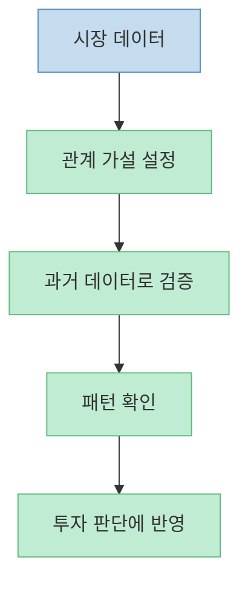
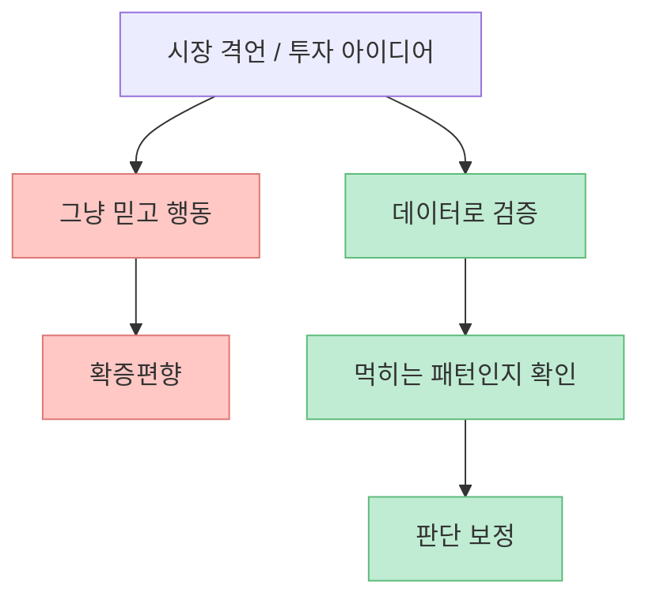
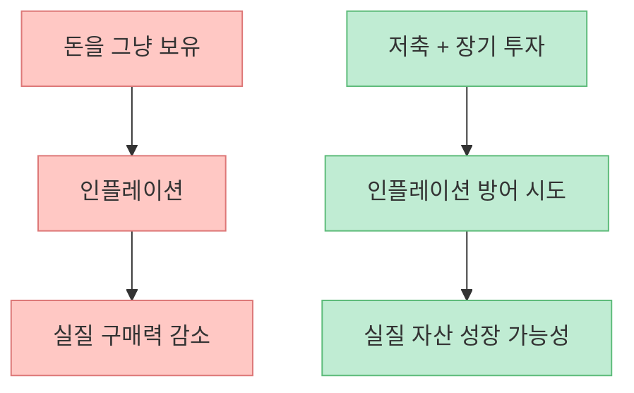
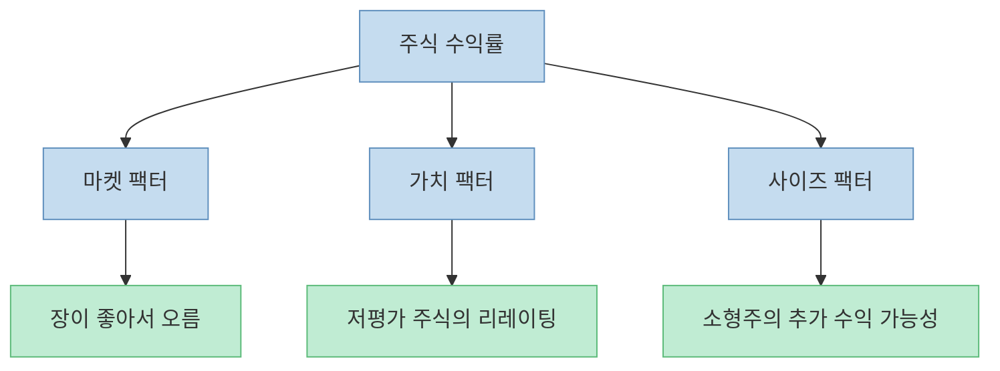
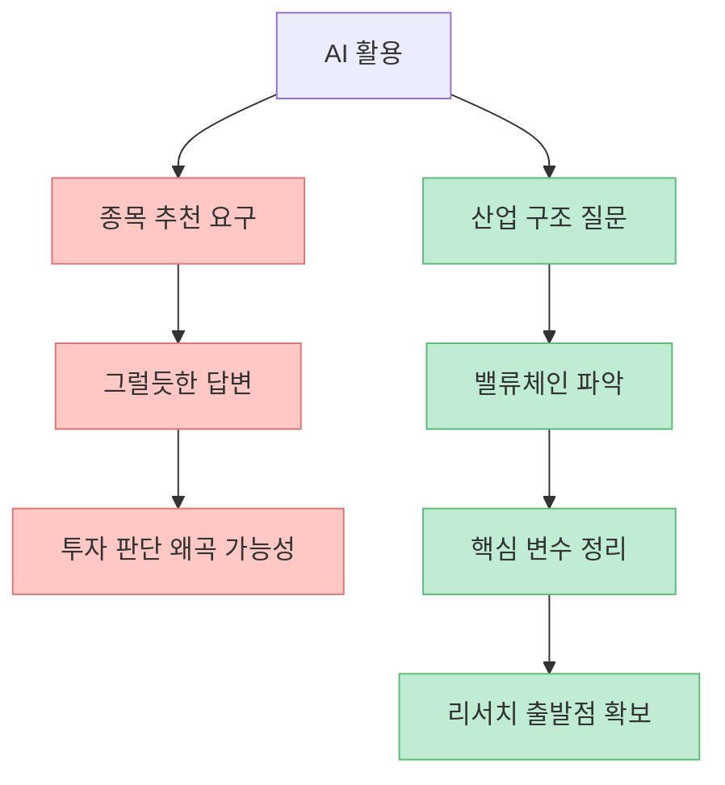
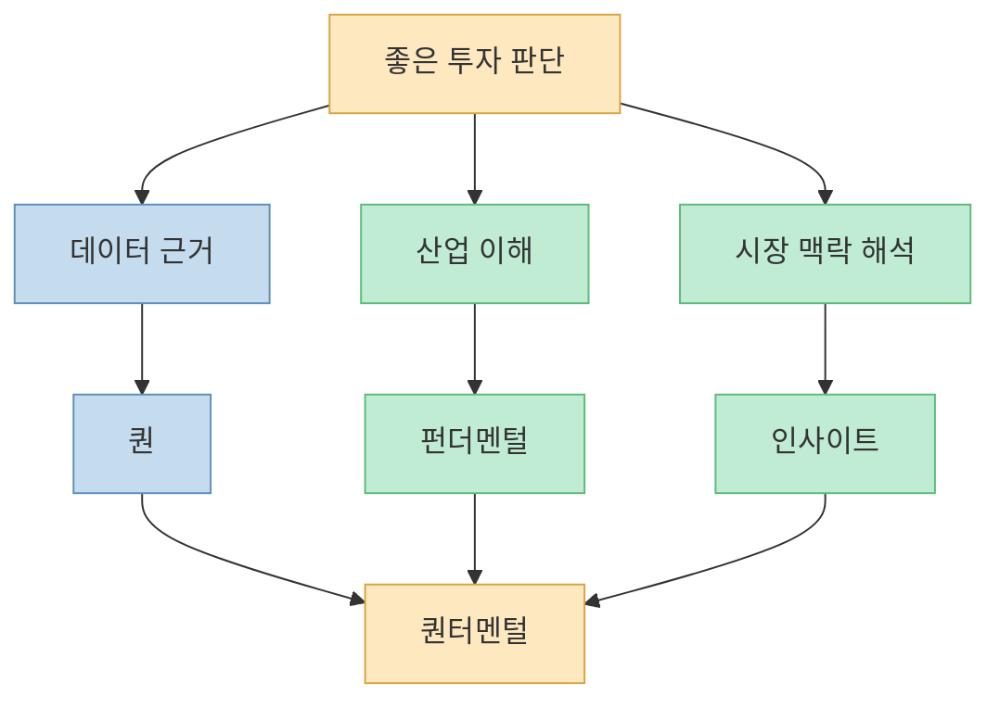
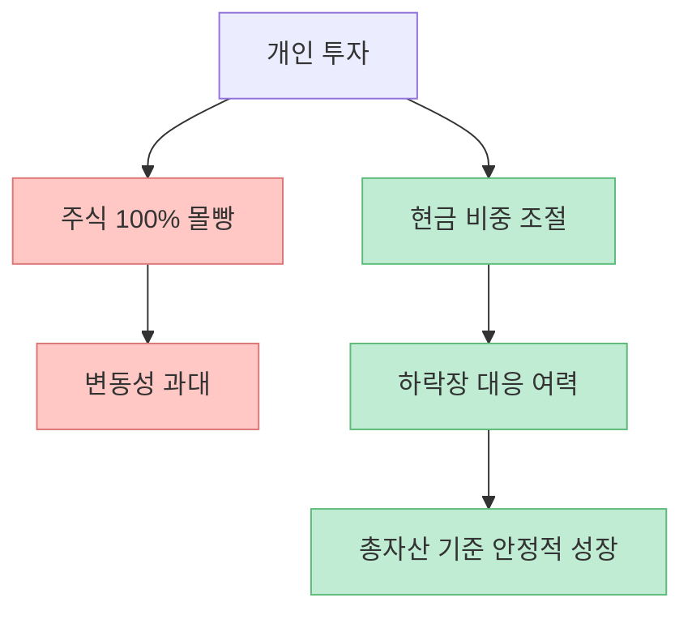

이 영상은 “퀀 투자로 돈 버는 법”을 자극적으로 말하는 콘텐츠가 아닙니다. 오히려 정반대입니다. **개인이 퀀에서 정말 배워야 하는 것은 초고속 매매 기술이 아니라, 데이터를 보고 생각하는 습관과 욕심을 통제하는 투자 태도** 라는 점을 계속 강조합니다. AI도 마찬가지입니다. 종목 추천을 받는 용도가 아니라, 산업 구조를 빠르게 이해하고 질문을 정리하는 도구로 써야 한다는 메시지가 선명합니다.

<!--more-->

## Sources

- [한국인 최초 퀀트 챔피언십 1위의 AI 주식투자 꿀팁과 당장 투자를 시작해야하는 이유 (유니스트 김민겸) | 주식아지트 EP.외전](https://youtu.be/Ng8kQtHMY2c)
- [Investor.gov — Asset Allocation and Diversification](https://www.investor.gov/introduction-investing/getting-started/assessing-your-risk-tolerance)
- [Investor.gov — Diversify Your Investments](https://www.investor.gov/index.php/introduction-investing/investing-basics/save-and-invest/diversify-your-investments)
- [Investor.gov — Build Wealth Over Time Through Saving and Investing](https://www.investor.gov/build-wealth-over-time-through-saving-and-investing)

## 1. 퀀 투자의 본질은 “수학으로 주식을 맞히는 것”보다 데이터를 가지고 투자하는 것이다

영상 초반에서 김민겸 씨는 퀀을 아주 간단하게 설명합니다. **데이터를 가지고 투자하는 것** 이라는 말입니다. [영상 2분 부근](https://youtu.be/Ng8kQtHMY2c?t=120) 여기서 중요한 건 “데이터”입니다. 퀀은 무조건 AI나 복잡한 수식으로 매매하는 것이 아니라, 시장 안에 흩어져 있는 관계와 패턴을 찾아 그것을 검증 가능한 방식으로 다루는 접근입니다.

영상에서 예로 든 하이일드 스프레드와 한국 레버리지 ETF의 음의 상관관계 같은 사례가 대표적입니다. 언뜻 무관해 보이는 지표들 사이의 관계를 데이터로 그려 보고, 실제로 일정한 패턴이 보이는지 확인하는 것이죠. [영상 6분~8분 부근](https://youtu.be/Ng8kQtHMY2c?t=360)

즉 퀀의 핵심은 “정답을 안다”가 아니라, **감이 아니라 검증 가능한 가설로 시장을 바라보려는 태도** 에 가깝습니다.

## 2. 개인이 따라 해야 할 퀀은 초단타가 아니라 ‘검증하는 사고법’이다

영상은 퀀 내부에도 종류가 매우 많다고 설명합니다. 초단타 고빈도 매매(HFT), 빅데이터 기반 알파 탐색, 저빈도 장기 전략 등 스펙트럼이 넓습니다. [영상 4분 부근](https://youtu.be/Ng8kQtHMY2c?t=240) 하지만 동시에 개인이 그 모든 것을 따라 할 필요는 없다고 말합니다.

이 부분이 중요합니다. 많은 사람이 퀀을 “천재들만 하는 수학 게임”처럼 생각하지만, 영상은 개인이 바로 배워 쓸 수 있는 부분이 따로 있다고 봅니다. 바로 **투자 아이디어를 검증하는 습관** 입니다. 예를 들어 “5월에는 팔고 떠나라” 같은 시장 격언도 그냥 믿지 말고, 실제로 10년·20년 데이터를 뽑아 확인해 보라는 식입니다. [영상 40분 부근](https://youtu.be/Ng8kQtHMY2c?t=2400)

개인 투자자에게 필요한 퀀은 결국 “내가 들은 이야기를 숫자로 다시 확인해 보는 습관”입니다.

## 3. 투자의 출발점은 대박이 아니라 인플레이션을 이기는 것이다

영상에서 가장 인상적인 대목 중 하나는, 김민겸 씨가 투자를 시작한 이유를 “큰 부자가 되기 위해서”가 아니라 **인플레이션으로부터 자산을 지키기 위해서** 라고 설명한 부분입니다. [영상 14분~16분 부근](https://youtu.be/Ng8kQtHMY2c?t=840) 이 관점은 굉장히 건강합니다.

Investor.gov도 장기적으로 부를 쌓는 기본은 지속적인 저축과 투자라고 설명합니다. 특히 장기 목표를 위해서는 월급의 일부를 꾸준히 투자하고, 빈번한 매매보다 오래 보유하는 접근이 일반적으로 더 유리하다고 안내합니다. [Investor.gov Build Wealth Over Time](https://www.investor.gov/build-wealth-over-time-through-saving-and-investing)

이 메시지는 특히 젊은 투자자에게 중요합니다. 투자란 한 번에 인생 역전을 노리는 행동이 아니라, **가만히 있으면 녹는 돈을 장기적으로 방어하는 시스템** 으로 이해할 때 훨씬 지속 가능해집니다.

## 4. 팩터 투자는 개인이 퀀을 현실적으로 배우는 가장 좋은 입구일 수 있다

영상은 개인이 퀀을 공부하고 싶다면 팩터 투자부터 보는 것이 현실적일 수 있다고 말합니다. [영상 28분 부근](https://youtu.be/Ng8kQtHMY2c?t=1680) 팩터 투자란 쉽게 말해, 수익률이 어디에서 나오는지 설명하는 요인을 찾는 방식입니다.

영상에서는 파마-프렌치의 세 가지 대표 요인도 언급합니다. 시장 전체가 좋아서 오르는 마켓 팩터, 저평가 가치주가 더 오른다는 가치 팩터, 시가총액이 작은 주식이 더 높은 수익을 낸다는 사이즈 팩터입니다. [영상 58분 부근](https://youtu.be/Ng8kQtHMY2c?t=3480)

팩터 투자의 장점은, 종목 하나를 맞히려 하기보다 **수익의 원인을 구조적으로 이해하려는 방향** 으로 생각을 바꿔 준다는 데 있습니다.

## 5. AI는 종목 추천기가 아니라 ‘질문 정리와 산업 지도 작성 도구’로 써야 한다

영상 후반의 AI 활용 조언은 매우 실전적입니다. 김민겸 씨는 AI에게 “이 종목 얼마 갈 것 같냐” “뭐가 좋냐” 같은 질문을 던지는 것은 좋지 않다고 말합니다. [영상 52분 부근](https://youtu.be/Ng8kQtHMY2c?t=3120) 이유는 단순합니다. AI는 이미 인터넷에 널린 정보를 가장 그럴듯하게 요약하는 데는 강하지만, 미래 가격을 예언하는 기계는 아니기 때문입니다.

대신 잘 쓰는 방법은 산업 구조를 파악하는 것입니다. 예를 들어 피지컬 AI 산업을 공부하고 싶다면, AI에게 “밸류체인이 어떻게 되나”, “핵심 부품은 무엇인가”, “서보모터는 왜 중요한가” 같은 질문을 던져서 큰 그림을 빠르게 얻는 식입니다. [영상 52분~56분 부근](https://youtu.be/Ng8kQtHMY2c?t=3120)

즉 AI의 진짜 효용은 “정답 받기”가 아니라, **내가 무엇을 모르는지 빨리 드러내고 공부의 출발점을 잡는 것** 입니다.

## 6. 데이터만으로는 부족하고, 감만으로도 부족하다: 그래서 퀀터멘털이 중요해진다

영상은 요즘 투자 현장에서 “퀀터멘털”이라는 개념이 중요해졌다고 설명합니다. 이는 퀀(quant)과 펀더멘털(fundamental)의 결합입니다. [영상 42분~44분 부근](https://youtu.be/Ng8kQtHMY2c?t=2520) 데이터만으로 경쟁하던 시대에서, 모두가 같은 데이터를 쓰기 시작하면 사람의 경험과 인사이트가 다시 중요해진다는 뜻입니다.

이 관점은 매우 현실적입니다. 데이터는 과거를 정리해 주지만, 시장은 늘 미래를 가격에 반영합니다. 그래서 데이터로 근거를 잡되, 그 데이터를 어떤 맥락에서 해석할지는 사람의 몫이 됩니다.

개인 투자자도 마찬가지입니다. 엑셀만 잘 다룬다고 되는 것도 아니고, 감으로만 버티는 것도 위험합니다. **숫자와 해석이 같이 가야** 합니다.

## 7. 좋은 개인 투자는 대박보다 총자산 10%를 지키는 쪽에 가깝다

영상에서 김민겸 씨는 개인 투자 목표를 연 10% 정도로 잡는다고 말합니다. [영상 46분~48분 부근](https://youtu.be/Ng8kQtHMY2c?t=2760) 듣기에 작아 보일 수 있지만, 그는 투자 수익률과 총자산 수익률을 구분해야 한다고 강조합니다. 실제 삶에서는 모든 돈을 주식에 넣지 못하고, 현금 비중도 조절해야 하기 때문에 총자산 기준 연 10%는 결코 작은 숫자가 아니라는 것입니다.

Investor.gov 역시 자산배분과 분산이 시간 지평과 위험 감내도에 따라 달라져야 하며, 분산은 한 바구니에 모든 돈을 담지 않게 해 주는 기본 원칙이라고 설명합니다. [Investor.gov Asset Allocation and Diversification](https://www.investor.gov/introduction-investing/getting-started/assessing-your-risk-tolerance), [Investor.gov Diversify Your Investments](https://www.investor.gov/index.php/introduction-investing/investing-basics/save-and-invest/diversify-your-investments)

이건 결국 투자의 기준을 바꾸는 이야기입니다. “얼마를 벌었나”보다 **얼마나 오래 버틸 수 있는 구조를 만들었나** 가 더 중요하다는 뜻입니다.

## 핵심 요약

- 퀀 투자의 핵심은 초단타 기술이 아니라 **데이터로 투자 가설을 검증하는 사고법** 입니다. [영상 2분~8분 부근](https://youtu.be/Ng8kQtHMY2c?t=120)
- 개인이 바로 배울 수 있는 퀀의 출발점은 **팩터 투자와 검증 습관** 입니다. [영상 28분 부근](https://youtu.be/Ng8kQtHMY2c?t=1680)
- 투자의 출발점은 대박이 아니라 **인플레이션을 이기는 장기적인 자산 방어** 여야 합니다. [영상 14분 부근](https://youtu.be/Ng8kQtHMY2c?t=840)
- AI는 종목 추천 도구보다 **산업 구조와 밸류체인을 이해하는 리서치 도구** 로 쓸 때 훨씬 유용합니다. [영상 52분~56분 부근](https://youtu.be/Ng8kQtHMY2c?t=3120)
- 데이터만으로는 부족하고, 감만으로도 부족합니다. **퀀터멘털**, 즉 데이터와 인사이트의 결합이 중요합니다. [영상 42분 부근](https://youtu.be/Ng8kQtHMY2c?t=2520)
- 개인 투자에서는 수익률보다 **총자산 기준의 생존성과 현금 비중 관리** 가 더 중요할 수 있습니다. [영상 46분 부근](https://youtu.be/Ng8kQtHMY2c?t=2760)

## 결론

이 영상이 진짜로 가르쳐 주는 것은 “퀀처럼 돈 버는 비법”이 아닙니다. **잘 모르는 것을 그럴듯하게 믿지 말고, 숫자로 확인하고, AI는 질문 정리 도구로 쓰고, 욕심보다 오래 가는 구조를 먼저 만들라** 는 것입니다. 개인 투자자가 퀀에서 배워야 할 가장 큰 기술은 알고리즘이 아니라, 더 차분하고 더 검증 가능한 방식으로 생각하는 습관입니다.
