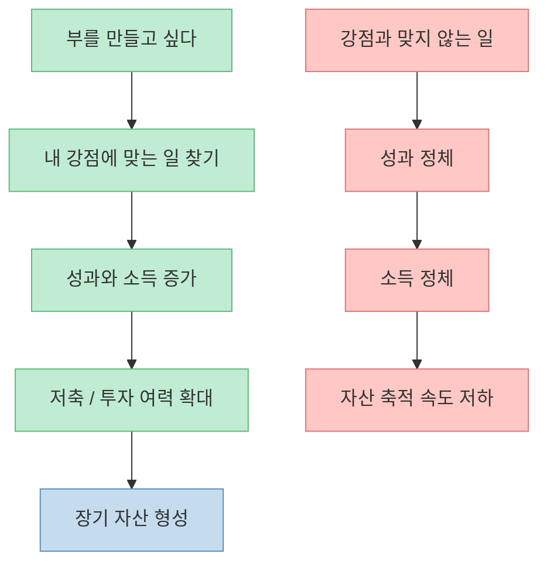
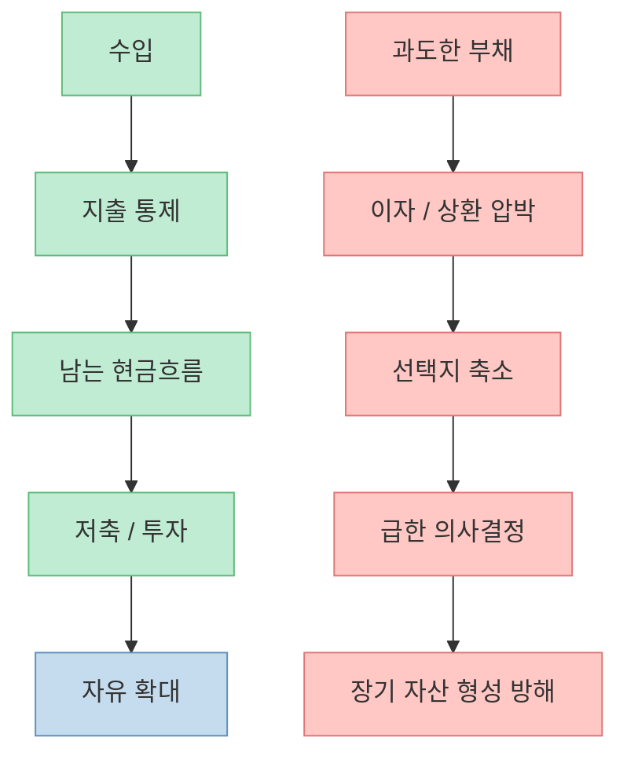
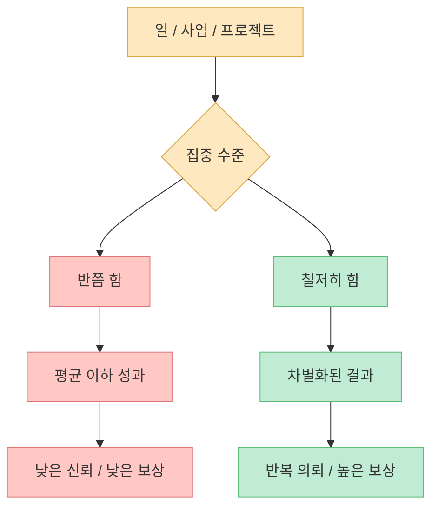
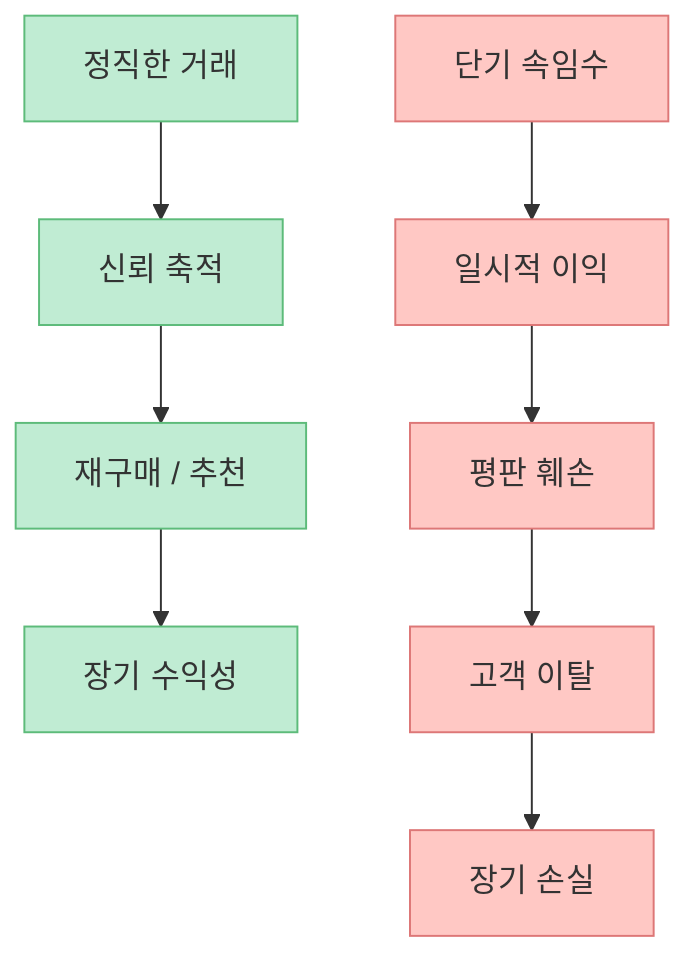
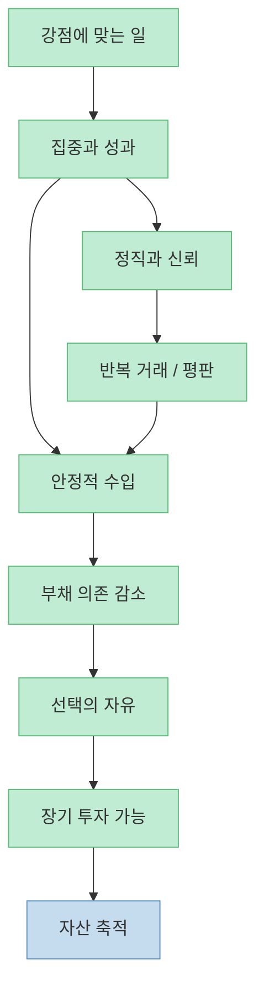
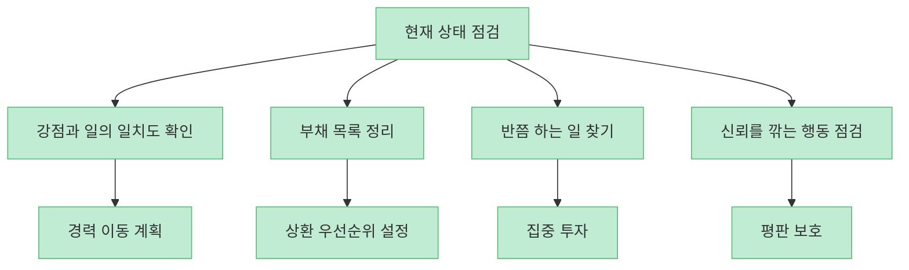

이 글은 돈 버는 비법을 알려 주는 현대적인 투자서가 아닙니다. 오히려 정반대입니다. **무슨 종목을 살지보다 어떤 태도로 일하고, 빚을 다루고, 신뢰를 쌓을지** 를 먼저 묻습니다. Cool Tools의 소개 글은 P.T. 바넘의 《The Art of Money Getting》을 네 가지 핵심 원칙으로 압축하는데, 놀랍게도 그 내용은 오늘날의 투자·커리어·사업에도 거의 그대로 통합니다.

<!--more-->

## Sources

- [Book Freak #210: The Art of Money Getting – Cool Tools](https://kk.org/cooltools/book-freak-210-the-art-of-money-getting/)

## 1. 돈 버는 문제는 종종 금융 지식보다 직업 선택에서 먼저 갈린다

Cool Tools가 소개한 바넘의 첫 번째 원칙은 “자기 천직을 착각하지 말라”입니다. 글에 따르면 바넘은 사람이 자기에게 맞지 않는 일을 붙잡고 수십 년을 거슬러 올라가듯 버티는 경우가 많다고 봤습니다. 반대로 성공하는 사람은 자신이 잘하는 일, 즉 타고난 감각이 있는 분야를 먼저 찾고 그 안에서 최고가 되려 한다는 것입니다. [Cool Tools 본문](https://kk.org/cooltools/book-freak-210-the-art-of-money-getting/)

이 메시지는 요즘 말로 바꾸면 아주 단순합니다. **돈은 종목보다 생산성에서 먼저 나온다** 는 뜻입니다. 투자 수익률을 아무리 고민해도, 내가 가장 강한 능력을 발휘할 수 있는 일에서 충분한 현금흐름을 만들지 못하면 자산 축적의 속도는 느릴 수밖에 없습니다. 그래서 부의 문제는 금융 상품 선택보다 먼저 “나는 어떤 일을 할 때 가장 경쟁력이 높은가”를 묻는 문제이기도 합니다.

결국 “무엇에 투자할까”보다 앞선 질문은 “나는 무엇으로 벌까”입니다.

## 2. 부채는 단순한 숫자가 아니라 자유를 갉아먹는 구조가 될 수 있다

두 번째 원칙은 “빚을 전염병처럼 피하라”입니다. 글은 바넘이 특히 젊은 사람에게 부채를 경계하라고 조언했다고 전합니다. 누군가에게 돈을 빚지는 순간 자유의 일부를 넘겨 주는 것이고, 핵심은 언제나 지출보다 수입을 높게 유지하는 데 있다는 설명입니다. [Cool Tools 본문](https://kk.org/cooltools/book-freak-210-the-art-of-money-getting/)

이 관점은 오늘날에도 강력합니다. 물론 모든 부채가 나쁜 것은 아닙니다. 사업 확장, 주거, 교육처럼 장기적으로 생산성을 높이는 부채도 존재합니다. 그러나 바넘의 경고는 여전히 유효합니다. **부채가 내 선택지를 넓히는 도구가 아니라, 매달 현금흐름을 압박해 판단을 왜곡하는 구조가 되는 순간 위험해진다** 는 점입니다.

즉 바넘이 말한 “부채 회피”는 단순한 절약주의가 아니라, **의사결정의 독립성을 지키기 위한 원칙** 으로 읽는 것이 맞습니다.

## 3. 반쯤 하는 사람은 오래 가난해질 수 있다: 집중은 재능을 현금으로 바꾸는 장치다

세 번째 원칙은 “무엇을 하든 온 힘을 다해 하라”입니다. Cool Tools의 정리에 따르면 바넘은 같은 일을 하면서도 반쯤만 하는 사람과 철저하게 하는 사람의 격차가 평생 누적된다고 봤습니다. [Cool Tools 본문](https://kk.org/cooltools/book-freak-210-the-art-of-money-getting/)

이건 단순한 근면론처럼 들릴 수 있지만, 사실은 훨씬 경제적입니다. 오늘날 정보와 기회는 넘치지만, 사람의 시간과 집중력은 제한되어 있습니다. 그래서 돈을 버는 능력은 종종 정보량보다 **한정된 에너지를 어디에 깊게 투입하느냐** 에서 갈립니다. 반쯤 배운 기술, 반쯤 운영하는 사업, 반쯤 관리하는 고객 관계는 모두 그럴듯해 보이지만, 장기적으로는 성과를 얇게 만듭니다.

바넘의 말은 결국 “열심히 살아라”보다 구체적입니다. **깊이 없는 노력은 시장에서 잘 보상되지 않는다** 는 뜻입니다.

## 4. 정직은 도덕 규범이 아니라 가장 강력한 장기 자산이다

네 번째 원칙은 “정직을 지켜라”입니다. 글은 고객이 상인을 믿지 못하면 친절함과 호감만으로는 거래가 지속되지 않는다고 요약합니다. 주간의 이익을 위해 속이는 행동은 가능할 수 있지만, 평판이라는 장기 자산을 잃는 비용이 훨씬 크다는 것이죠. [Cool Tools 본문](https://kk.org/cooltools/book-freak-210-the-art-of-money-getting/)

이 원칙은 디지털 시대에 오히려 더 중요해졌습니다. 온라인에서는 정보가 더 빨리 퍼지고, 평판의 축적도 더 빠르지만, 훼손도 더 빠릅니다. 고객 후기, 커뮤니티 평가, 업계 평판, 재구매율은 모두 정직의 경제적 가치와 연결됩니다. 결국 신뢰는 눈에 안 보이지만, 실제로는 가격 경쟁력보다 더 오래 버티는 자산이 될 수 있습니다.

바넘이 말한 정직은 착하게 살자는 교훈이 아니라, **부를 오래 유지하기 위한 운영 원칙** 에 가깝습니다.

## 5. 이 네 가지 원칙은 결국 하나의 구조로 연결된다

Cool Tools의 요약을 보면 이 책의 네 원칙은 각각 따로 떨어져 있지 않습니다. 잘 맞는 일을 찾고, 빚을 조심하고, 철저하게 일하고, 정직하게 신뢰를 쌓는다는 것은 사실 하나의 부의 구조를 설명합니다.

먼저 맞는 일을 찾아야 성과가 나오고, 성과가 나야 수입이 늘고, 수입이 늘어야 빚에 끌려가지 않을 여유가 생깁니다. 그 여유가 다시 장기적 판단을 가능하게 하고, 철저함과 정직은 그 구조를 오래 유지하게 만듭니다. 결국 바넘의 원칙은 “한 방에 돈 버는 기술”이 아니라, **오래 돈을 벌 수 있는 시스템을 만드는 법** 입니다.

그래서 이 책은 투자서라기보다, **투자 가능한 삶을 만드는 책** 에 더 가깝습니다.

## 6. 오늘날 이 원칙을 어떻게 적용할 수 있나

Cool Tools 글의 “Try It Now” 섹션도 실용적입니다. 현재 하고 있는 일이 자신의 자연스러운 능력과 맞는지 점검하고, 빚을 적어 보고, 반쯤 해온 일을 이번 주에 제대로 해 보라는 제안입니다. [Cool Tools 본문](https://kk.org/cooltools/book-freak-210-the-art-of-money-getting/)

이걸 지금식으로 바꾸면 적용은 더 명확해집니다.

1. 지금 하는 일이 강점과 맞지 않으면, 당장 퇴사보다 **이동 경로** 를 설계합니다.  
2. 부채는 감정적으로 보지 말고, **상환 계획표** 로 바꿉니다.  
3. 돈이 안 되는 이유를 운 탓하기 전에, **반쯤 하고 있는 영역이 없는지** 봅니다.  
4. 단기 매출보다 **평판이 남는 행동** 을 선택합니다.  

바넘의 원칙이 오래 살아남는 이유는, 결국 돈 문제를 숫자보다 **행동 구조의 문제** 로 보기 때문입니다.

## 핵심 요약

- 부의 시작점은 투자 비법보다 **자기 강점에 맞는 일** 을 찾는 데 있을 수 있습니다.
- 부채는 단순한 금융 도구가 아니라, 때로는 **자유를 갉아먹는 구조** 가 됩니다.
- 반쯤 하는 태도는 장기적으로 성과를 얇게 만들고, **집중은 재능을 수입으로 바꾸는 장치** 입니다.
- 정직은 도덕 교훈이 아니라 **장기 수익을 지탱하는 평판 자산** 입니다.
- 이 네 가지 원칙은 결국 “오래 돈을 벌 수 있는 시스템”을 만드는 하나의 구조로 연결됩니다.

## 결론

《The Art of Money Getting》이 지금도 유효한 이유는, 돈을 버는 문제를 투자 기술이 아니라 **직업, 부채, 집중, 신뢰의 설계 문제** 로 보기 때문입니다. 결국 부를 오래 쌓는 사람은 특별한 종목을 먼저 찾는 사람이 아니라, 오래 일할 수 있는 자리와 오래 신뢰받을 수 있는 방식을 먼저 만드는 사람일 가능성이 높습니다.
