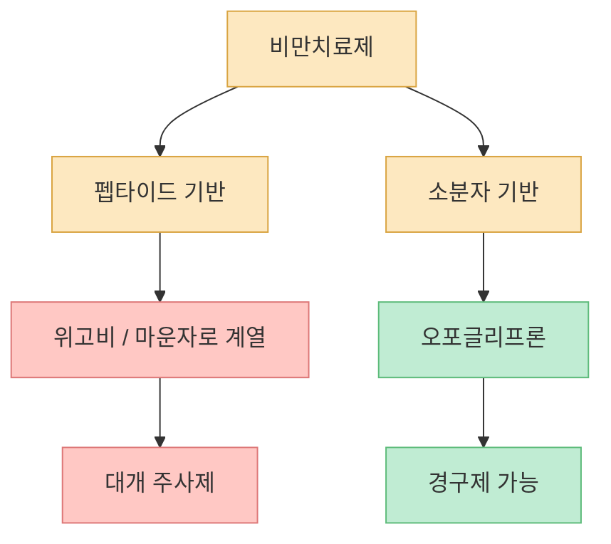
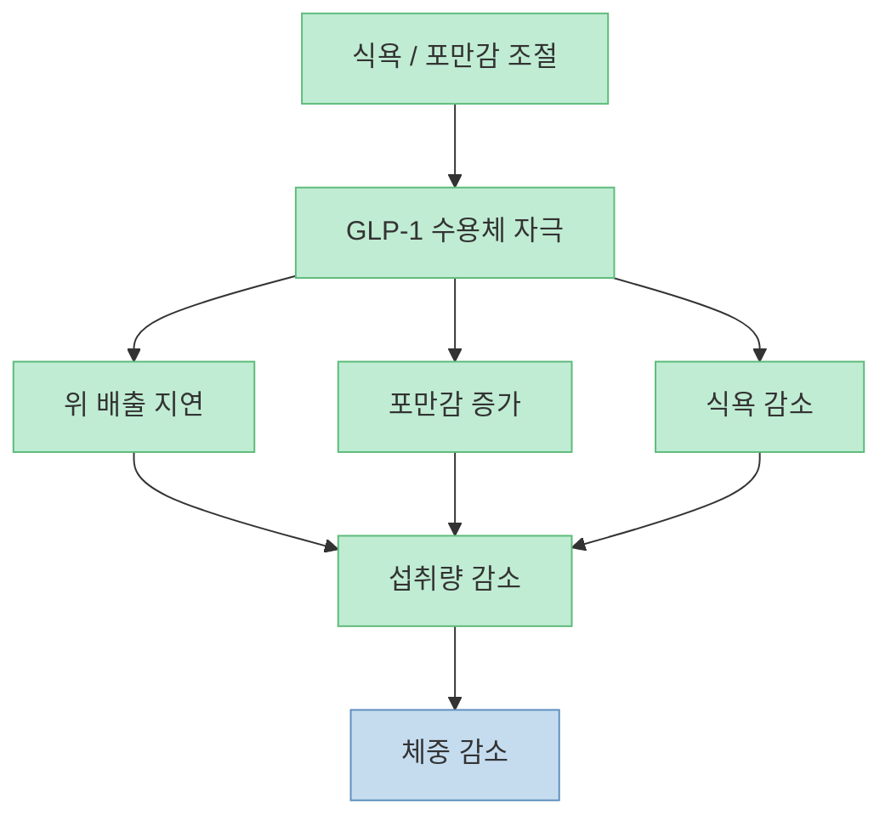
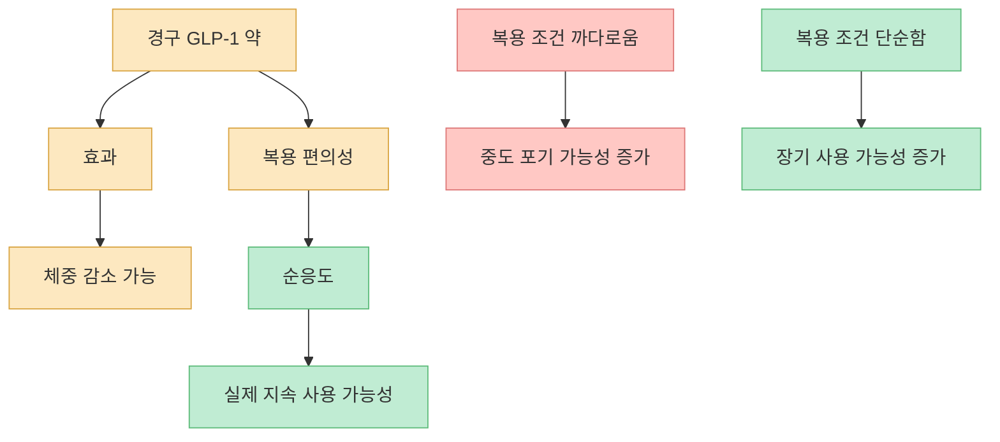
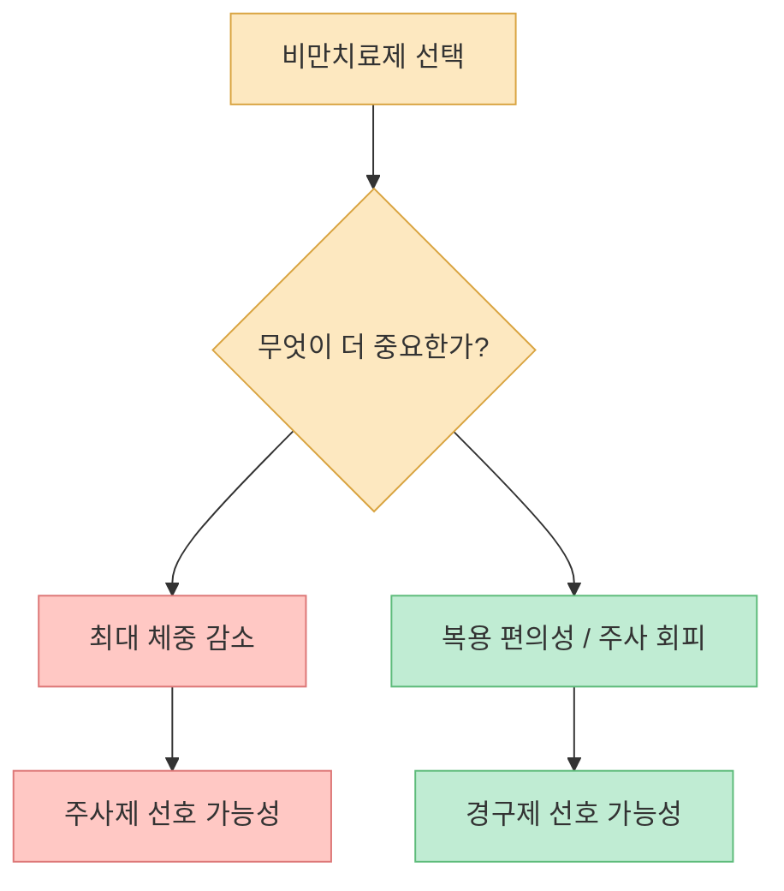
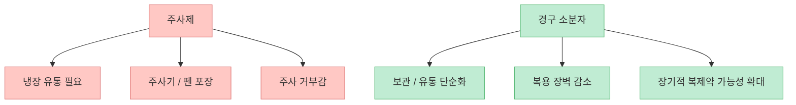
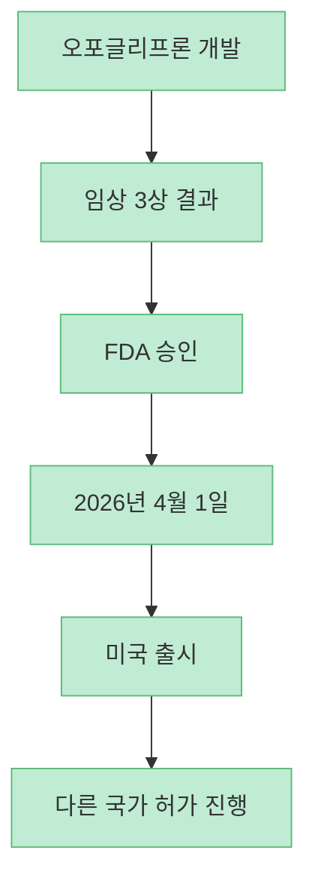
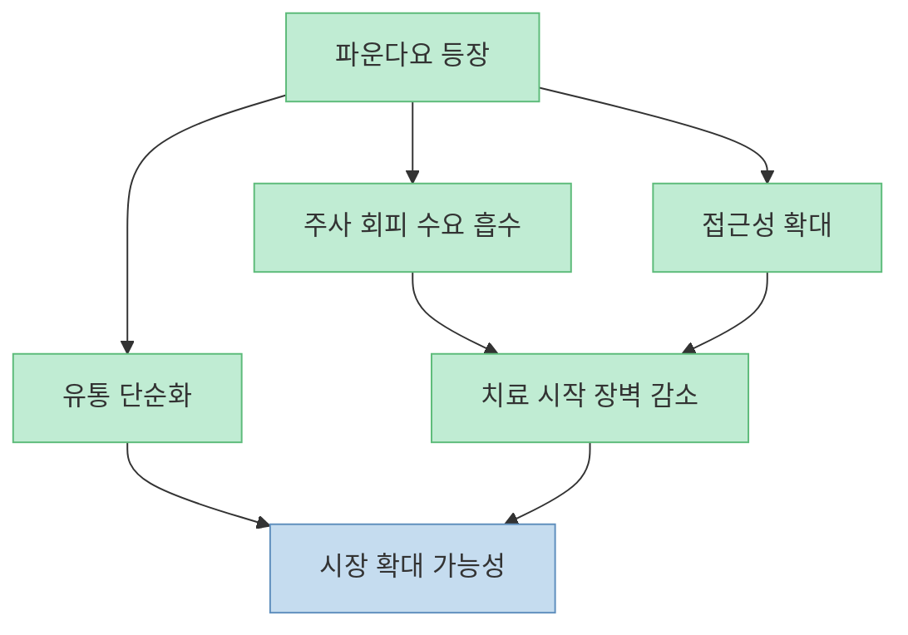

먹는 비만치료제 `파운다요(Foundayo, 성분명 orforglipron)`의 핵심은 단순히 “알약으로도 살이 빠진다”가 아닙니다. 진짜 중요한 변화는 **주사제 중심이던 비만치료제 시장의 진입 장벽을 낮춘다** 는 점입니다. 위고비와 마운자로가 효과는 좋지만 주사라는 형식 때문에 망설이던 사람들에게, 완전히 다른 선택지가 생긴 것이죠.

<!--more-->

## Sources

- [위고비, 마운자로 시대 끝? 먹는 비만치료제 '파운다요'가 온다](https://youtu.be/YaESJ1X6AJo)
- [FDA Approves First New Molecular Entity Under National Priority Voucher Program](https://www.fda.gov/news-events/press-announcements/fda-approves-first-new-molecular-entity-under-national-priority-voucher-program)
- [Novel Drug Approvals for 2026 | FDA](https://www.fda.gov/drugs/novel-drug-approvals-fda/novel-drug-approvals-2026)
- [FDA approves Lilly's Foundayo™ (orforglipron), the only GLP-1 pill for weight loss that can be taken any time of day without food or water restrictions | Eli Lilly](https://investor.lilly.com/news-releases/news-release-details/fda-approves-lillys-foundayotm-orforglipron-only-glp-1-pill)
- [Lilly's oral GLP-1, orforglipron, delivers weight loss of up to an average of 27.3 lbs in first of two pivotal Phase 3 trials in adults with obesity | Eli Lilly](https://investor.lilly.com/news-releases/news-release-details/lillys-oral-glp-1-orforglipron-delivers-weight-loss-average-273)

## 1. 파운다요는 “먹는 위고비”가 아니라 구조가 다른 약이다

영상은 파운다요의 가장 큰 차이를 처음부터 분명하게 짚습니다. 위고비나 마운자로 같은 기존 약은 펩타이드 기반 주사제인데, 파운다요의 성분인 오포글리프론은 **비펩타이드 소분자 약물** 입니다. 쉽게 말해 원래 호르몬 구조를 닮은 큰 분자가 아니라, 화학적으로 설계된 작은 분자라는 뜻입니다. [영상 0분 부근](https://youtu.be/YaESJ1X6AJo?t=0)

이 차이는 단순한 화학 구조의 문제가 아닙니다. 펩타이드 계열은 보통 위장관에서 쉽게 분해되기 때문에 주사 형태로 가야 하는 경우가 많습니다. 반면 오포글리프론처럼 소분자 약물이 같은 수용체를 자극할 수 있다면, 먹는 약으로 개발할 여지가 훨씬 커집니다.

즉 파운다요의 의미는 “주사를 알약으로 바꿨다”가 아니라, **같은 치료 타깃을 완전히 다른 약물 플랫폼으로 공략했다** 는 데 있습니다.

## 2. 왜 GLP-1 약이 비만치료에 효과적인가: 식욕을 줄이고 포만감을 오래 남기기 때문이다

영상은 GLP-1 계열 약이 효과를 내는 원리를 비교적 쉽게 설명합니다. 비만은 단순히 의지 부족이 아니라, 식욕과 포만감 신호, 에너지 대사, 보상 체계가 함께 얽힌 문제라는 것입니다. 이런 상황에서 GLP-1 수용체를 자극하면 위 배출이 느려지고 포만감이 오래가며, 식욕도 줄어드는 효과를 기대할 수 있습니다. [영상 2분 부근](https://youtu.be/YaESJ1X6AJo?t=120)

기존 세마글루타이드(위고비)는 GLP-1 수용체만 자극하고, 티르제파타이드(마운자로/제프바운드 계열)는 GLP-1과 GIP를 함께 자극합니다. 그래서 일반적으로 티르제파타이드가 더 높은 체중 감소 효과를 보이는 것으로 알려져 있습니다. 영상도 이 점을 분명히 언급합니다. [영상 2분 부근](https://youtu.be/YaESJ1X6AJo?t=120)

즉 오포글리프론의 포인트는 “완전히 새로운 생리학”이 아니라, **익숙한 GLP-1 경로를 더 편한 제형으로 가져왔다** 는 것입니다.

## 3. 먹는 위고비도 있었지만, 복용 조건이 까다로웠다

영상은 “먹는 위고비”가 이미 있었지만, 시장을 크게 뒤흔들지 못한 이유를 설명합니다. 경구 세마글루타이드는 효과 자체는 의미 있었지만, 공복 상태, 제한된 물 섭취, 복용 후 일정 시간 금식 등 복약 조건이 꽤 까다로웠습니다. [영상 4분 부근](https://youtu.be/YaESJ1X6AJo?t=240)

이건 실제 사용성에서 매우 큰 차이를 만듭니다. 약효가 조금 더 좋더라도, **매일 지키기 어려운 루틴** 이 붙는 순간 현실에서는 순응도가 떨어질 수 있습니다. 바쁜 아침에 다른 약도 먹어야 하고, 식사 시간도 일정하지 않은 사람에게는 이런 조건 자체가 진입 장벽이 됩니다.

반면 Lilly의 승인 발표에 따르면 파운다요는 **음식이나 물 제한 없이 하루 한 번 복용할 수 있는 GLP-1 알약** 이라는 점이 가장 큰 차별점입니다. 이 편의성은 약효 숫자 이상의 의미를 가질 수 있습니다. [Lilly 보도자료](https://investor.lilly.com/news-releases/news-release-details/fda-approves-lillys-foundayotm-orforglipron-only-glp-1-pill)

그래서 경구 비만약 경쟁에서는 “몇 % 더 빠졌나” 못지않게 **얼마나 쉽게 먹을 수 있느냐** 가 시장을 크게 바꿀 수 있습니다.

## 4. 효과는 주사제보다 약할 수 있다: 편의성과 체중 감소율은 별개의 문제다

영상은 오포글리프론의 체중 감소 효과를 꽤 냉정하게 봅니다. 72주간의 ATTAIN-1 결과에서 최고 용량 그룹의 평균 체중 감소율이 약 12.4%였고, 이는 위고비 주사나 마운자로/제프바운드 계열보다 낮은 편이라고 설명합니다. [영상 6분 부근](https://youtu.be/YaESJ1X6AJo?t=360)

Lilly의 2025년 발표도 비슷한 방향입니다. ATTAIN-1에서 오포글리프론은 임상적으로 의미 있는 체중 감소를 보였지만, 현재 알려진 최고 수준의 주사제 체중감소율보다는 낮은 범주에 있습니다. [Lilly ATTAIN-1 보도자료](https://investor.lilly.com/news-releases/news-release-details/lillys-oral-glp-1-orforglipron-delivers-weight-loss-average-273)

즉 시장은 두 가지를 구분해야 합니다.

- **최대 체중 감소 효과** 가 더 중요한 사람  
- **주사 회피와 복약 편의성** 이 더 중요한 사람  

파운다요는 주사제를 완전히 대체한다기보다, **효과와 편의성 사이의 새로운 균형점** 을 제시하는 약으로 보는 편이 정확합니다.

## 5. 파운다요의 진짜 위력은 약효보다 유통과 접근성에 있을 수 있다

영상 후반은 가격과 유통 구조의 변화를 강조합니다. 소분자 경구제는 주사제보다 냉장 유통 부담이 적고, 포장도 단순하며, 장기적으로는 복제약 진입 장벽도 더 낮을 수 있다는 점입니다. [영상 8분 부근](https://youtu.be/YaESJ1X6AJo?t=480)

이 부분은 매우 중요합니다. 비만치료제 시장은 단지 “누가 더 잘 빠지느냐”의 경쟁이 아니라, **누가 더 많은 사람에게 실제로 접근 가능한가** 의 경쟁이기도 합니다. 주사제는 생산·보관·배송·투여 편의성에서 한계가 있고, 이런 한계는 가격과 공급 부족 문제로 이어지기 쉽습니다. 경구제는 이 구조를 단순화할 수 있습니다.

그래서 파운다요의 경쟁력은 “마운자로보다 더 세다”가 아니라, **더 많은 사람이 더 쉽게 시작할 수 있는 비만치료제** 가 될 가능성에 있습니다.

## 6. 최신 승인 상황: 2026년 4월 1일 미국 FDA 승인, 한국은 아직 미정

영상은 2026년 4월 FDA 승인 소식을 전하고, 한국 출시는 2026년 말~2027년 중반 정도를 추정합니다. [영상 8분 부근](https://youtu.be/YaESJ1X6AJo?t=480) 최신 공식 자료를 확인해 보면, FDA는 실제로 **2026년 4월 1일 Foundayo(orforglipron)** 를 승인했습니다. 적응증은 비만, 또는 체중 관련 동반질환이 있는 과체중 성인의 장기 체중 감소 유지입니다. [FDA 승인 발표](https://www.fda.gov/news-events/press-announcements/fda-approves-first-new-molecular-entity-under-national-priority-voucher-program), [FDA Novel Drug Approvals 2026](https://www.fda.gov/drugs/novel-drug-approvals-fda/novel-drug-approvals-2026)

Lilly는 승인 당시 미국 외 40개국 이상에 허가를 제출했거나 제출할 예정이라고 밝혔습니다. 다만 한국 식약처 승인 일정과 실제 약가는 아직 확정된 공식 발표로 보기 어렵기 때문에, 영상처럼 **추정 시나리오** 로만 받아들이는 것이 안전합니다. [Lilly 승인 보도자료](https://investor.lilly.com/news-releases/news-release-details/fda-approves-lillys-foundayotm-orforglipron-only-glp-1-pill)

즉 “먹는 비만약이 온다”는 말은 이제 미래 예측이 아니라, **미국에서는 이미 현실이 된 이야기** 입니다.

## 7. 결국 무엇이 바뀌나: 치료 대상이 넓어지고, 비만치료제 시장이 더 대중화될 수 있다

파운다요가 중요한 이유를 한 문장으로 요약하면 이렇습니다. **효과만으로는 최고가 아닐 수 있지만, 시장 자체를 넓힐 가능성은 매우 크다** 입니다. 주사 공포, 복용 불편, 유통 부담 때문에 치료를 미뤘던 사람들에게 경구제는 훨씬 낮은 장벽으로 다가올 수 있습니다.

물론 그렇다고 해서 파운다요가 모든 문제를 해결하는 만능약은 아닙니다. 주사제보다 체중 감소 폭이 작을 수 있고, 장기 안전성·가격·보험 적용·국가별 접근성 문제는 여전히 남아 있습니다. 하지만 **먹는 GLP-1 계열 비만약이 실제 승인까지 도달했다는 사실 자체** 가 산업 판을 크게 바꾸는 사건입니다.

## 핵심 요약

- 파운다요(오포글리프론)는 펩타이드 주사제가 아니라 **비펩타이드 소분자 경구 GLP-1 약물** 입니다. [영상 0분 부근](https://youtu.be/YaESJ1X6AJo?t=0)
- 먹는 위고비와 달리 **음식·물 제한 없이 복용 가능한 편의성** 이 큰 장점입니다.
- 체중 감소 효과는 의미 있지만, **주사제 최고 성적보다는 다소 약할 수 있습니다**. [영상 6분 부근](https://youtu.be/YaESJ1X6AJo?t=360)
- 진짜 파급력은 약효보다 **유통·접근성·주사 회피 수요 흡수** 에 있을 수 있습니다.
- 최신 공식 정보 기준으로, 파운다요는 **2026년 4월 1일 미국 FDA 승인을 받았습니다**.

## 결론

파운다요는 위고비와 마운자로를 곧바로 끝내는 약이라기보다, **비만치료제 시장의 문턱을 낮추는 약** 에 가깝습니다. 가장 강한 체중감량 효과를 원하는 사람은 여전히 주사제를 선택할 수 있지만, 더 많은 사람에게 치료를 현실적인 옵션으로 만들 수 있다는 점에서 파운다요는 단순한 신약 하나가 아니라 시장 구조를 바꾸는 사건으로 볼 만합니다.
