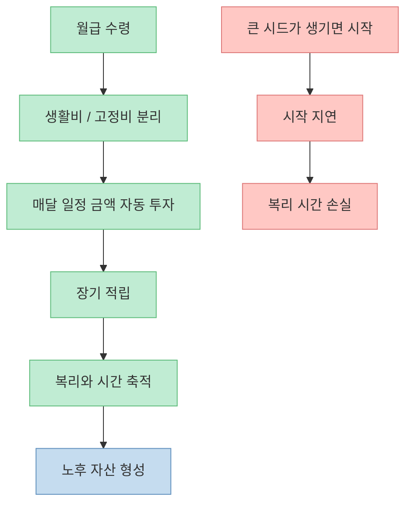
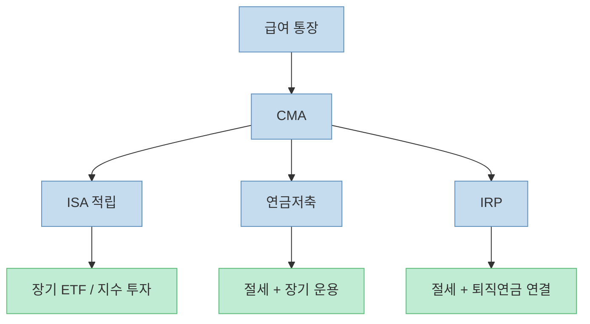
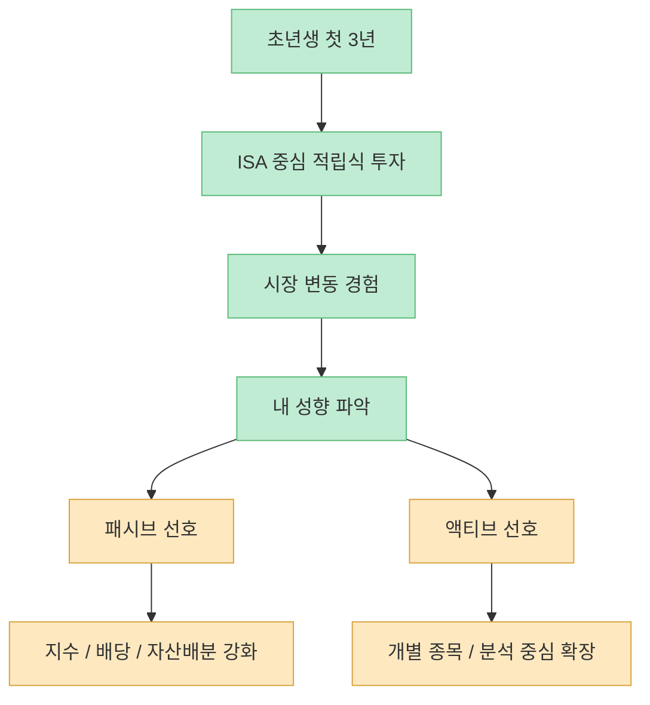
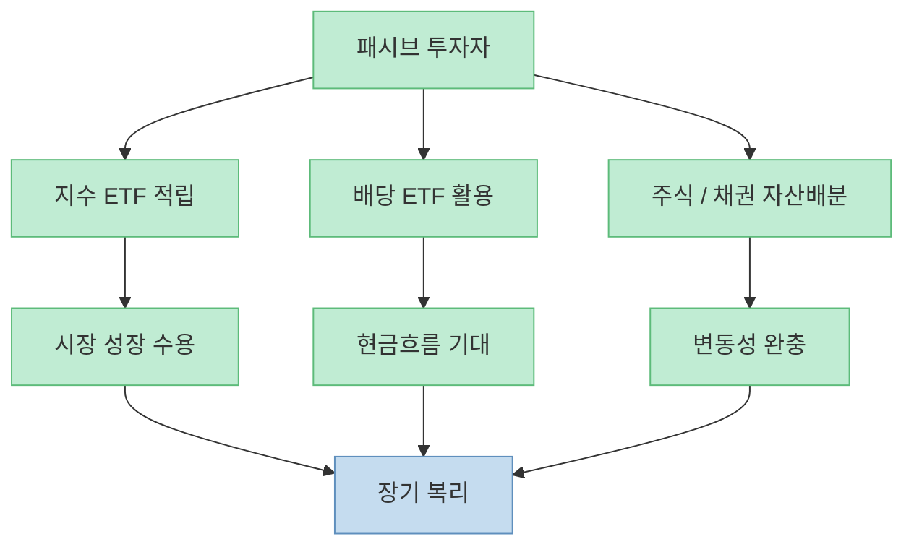
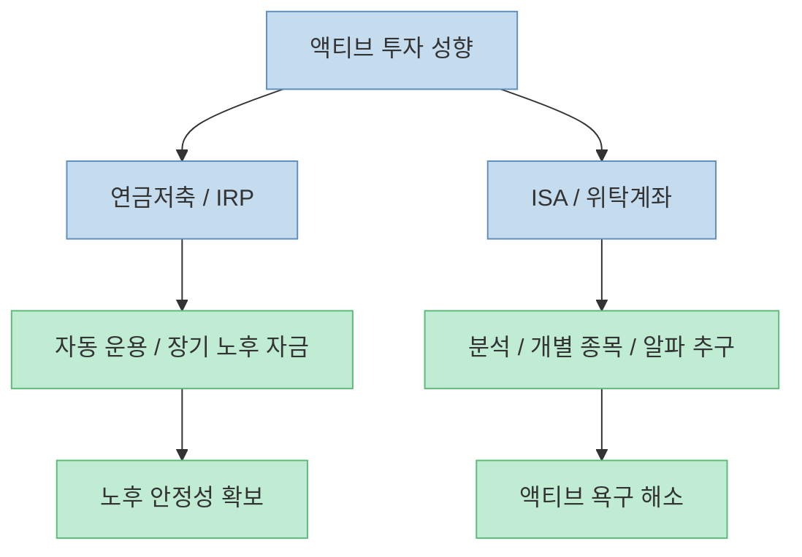
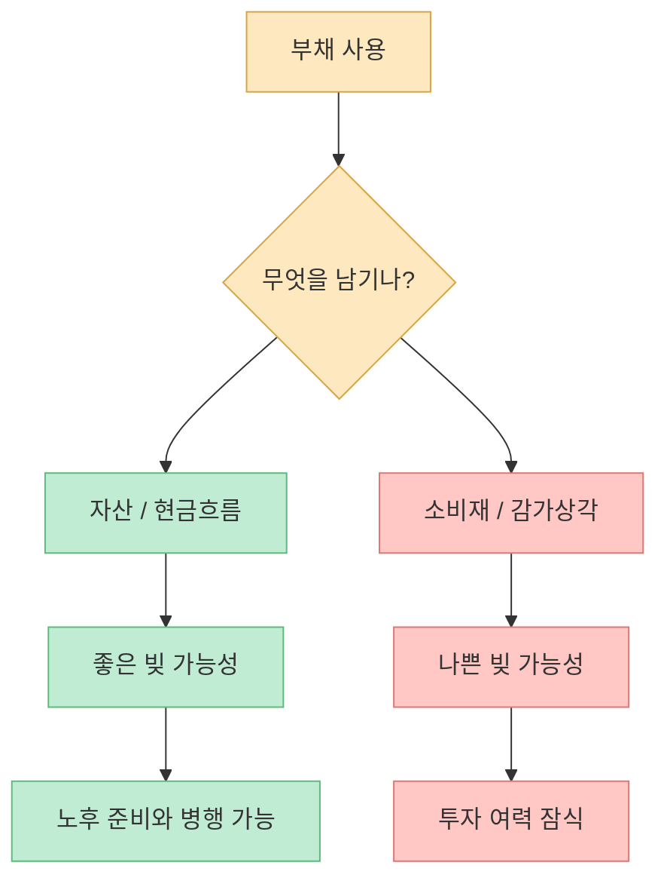
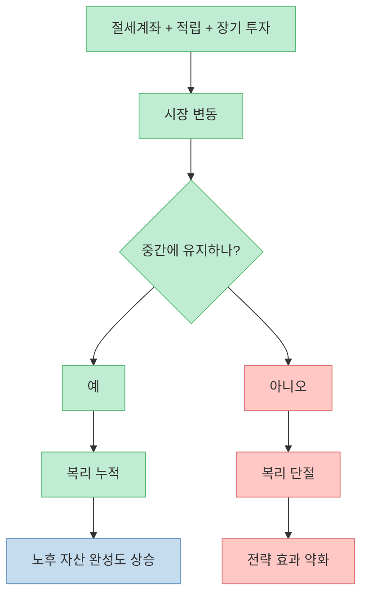

이 영상의 가장 강한 메시지는 “월급에서 50만 원만 이 계좌에 넣으라”가 아닙니다. 진짜 핵심은 **노후 준비를 종목 맞히기 게임이 아니라 계좌 구조와 시간의 문제로 바꾸는 것** 입니다. 수익률을 극단적으로 높이지 않아도, 절세계좌와 자동이체, 장기 투자, 자산배분을 잘 결합하면 노후의 큰 부분을 해결할 수 있다는 주장입니다.

<!--more-->

## Sources

- ["노후는 완벽하게 해결됩니다" 월급에서 딱 50만 원만 '이 계좌'에 넣으세요 (박곰희 작가 2부)](https://youtu.be/L_g1h2oVZv0)
- [Investor.gov — Build Wealth Over Time Through Saving and Investing](https://www.investor.gov/build-wealth-over-time-through-saving-and-investing)
- [Investor.gov — Asset Allocation and Diversification](https://www.investor.gov/introduction-investing/getting-started/assessing-your-risk-tolerance)
- [Investor.gov — 401(k) Plans](https://www.investor.gov/additional-resources/retirement-toolkit/employer-sponsored-plans/traditional-and-roth-401k-plans)
- [Investor.gov — Diversify Your Investments](https://www.investor.gov/index.php/introduction-investing/investing-basics/save-and-invest/diversify-your-investments)

## 1. 노후 준비는 “시드 모으기”보다 “매달 넣는 구조”가 먼저다

영상은 사회초년생에게 “시드가 없다”는 생각부터 버리라고 말합니다. [영상 0분 부근](https://youtu.be/L_g1h2oVZv0?t=0) 이 말의 의미는 꽤 중요합니다. 많은 사람이 노후 준비를 “큰돈이 생기면 시작하는 것”으로 생각하는데, 영상은 오히려 반대로 봅니다. 큰돈이 없어도 **매달 일정 금액을 오래 넣는 구조** 를 먼저 만들면 시간이 복리의 역할을 대신해 준다는 것입니다.

Investor.gov도 장기적인 자산 형성은 한 번의 큰 투자보다 꾸준한 저축과 투자 습관에서 출발한다고 설명합니다. 즉 노후 준비의 핵심은 “언제 큰돈이 생기느냐”가 아니라, **월급이 들어오는 순간 일정 비율이 투자로 빠져나가는 시스템이 만들어져 있느냐** 입니다. [Investor.gov Build Wealth Over Time](https://www.investor.gov/build-wealth-over-time-through-saving-and-investing)

그래서 영상의 “월 50만 원”은 액수가 본질이 아니라, **적립 구조를 만드는 최소 단위** 로 이해하는 편이 맞습니다.

## 2. 계좌는 4개지만 역할은 명확하다: 현금 대기, 장기 적립, 절세, 연금화

영상은 CMA, ISA, 연금저축, IRP라는 네 가지 계좌를 열어 두라고 제안합니다. [영상 4분 부근](https://youtu.be/L_g1h2oVZv0?t=240) 여기서 중요한 것은 계좌 수가 아니라, 각 계좌의 역할이 다르다는 점입니다.

- **CMA**: 대기 자금과 중간 흐름 관리  
- **ISA**: 주식·ETF 중심 장기 적립  
- **연금저축**: 절세와 장기 운용  
- **IRP**: 추가 절세와 퇴직연금 자산 연결  

영상은 특히 사회초년생 시기에는 연금저축과 IRP에 무조건 큰돈을 넣기보다, 공돈이나 특별수입 위주로 활용하고, 메인은 CMA와 ISA로 시작하라고 말합니다. [영상 4분~6분 부근](https://youtu.be/L_g1h2oVZv0?t=240)

이 구조의 장점은, 돈의 목적을 계좌별로 분리해 **생활비, 투자금, 노후자금이 뒤섞이지 않게 만드는 것** 입니다.

## 3. 초년생의 첫 3년은 수익률 경쟁보다 ‘투자 성향 확인 기간’에 가깝다

영상은 초년생에게 ISA에서 지수 ETF를 중심으로 3년 이상 적립해 보라고 권합니다. [영상 10분~12분 부근](https://youtu.be/L_g1h2oVZv0?t=600) 이 기간의 목적은 단순히 돈을 모으는 것만이 아닙니다. **내가 어떤 투자 성향을 가진 사람인지 확인하는 시간** 이기도 합니다.

이 과정에서 어떤 사람은 지수 투자와 자산배분이 편하다는 사실을 알게 되고, 어떤 사람은 개별 종목 분석과 액티브 투자에 더 큰 흥미를 느낄 수 있습니다. 영상은 이 차이를 매우 중요하게 봅니다. 처음 3년은 모두 비슷한 방식으로 시작하되, 이후에는 패시브형과 액티브형으로 길이 갈린다는 것입니다. [영상 12분~16분 부근](https://youtu.be/L_g1h2oVZv0?t=720)

즉 초년생 시기의 핵심은 최고 수익률이 아니라, **지속 가능한 투자 스타일을 발견하는 것** 입니다.

## 4. 패시브 투자자의 핵심은 종목 선택이 아니라 자산배분과 적립 지속성이다

영상은 패시브 투자 성향을 가진 사람에게는 굳이 기업 분석과 개별 종목 선택에 깊게 들어갈 필요가 없다고 말합니다. [영상 14분~18분 부근](https://youtu.be/L_g1h2oVZv0?t=840) 대신 미국, 한국, 신흥국, 일본 등 지수 ETF를 적절히 조합하거나, 배당과 자산배분 중심으로 접근하는 것이 더 잘 맞을 수 있다고 설명합니다.

Investor.gov도 자산배분은 투자 기간과 위험 감내도에 맞게 주식, 채권, 현금을 나누는 과정이며, 분산은 한 자산군의 충격을 전체 포트폴리오에 덜 전달하게 해 주는 기본 전략이라고 설명합니다. [Investor.gov Asset Allocation and Diversification](https://www.investor.gov/introduction-investing/getting-started/assessing-your-risk-tolerance)

여기서 중요한 것은 “어떤 ETF가 최고냐”보다, **내가 시장 변동을 견디면서 오래 유지할 수 있는 조합이 무엇이냐** 입니다.

## 5. 액티브 투자자는 절세계좌를 버리는 것이 아니라, 액티브 자금과 패시브 자금을 분리해야 한다

영상은 액티브 투자 성향의 사람도 결국 연금저축과 IRP를 버리지는 않는다고 설명합니다. [영상 20분 부근](https://youtu.be/L_g1h2oVZv0?t=1200) 오히려 세액공제와 장기 노후 자산은 자동 운용 쪽으로 두고, 실제 알파를 추구하는 계좌는 ISA와 일반 위탁계좌로 분리하는 방식을 제안합니다.

이 방식은 매우 합리적입니다. 액티브 투자자는 성향상 분석과 판단, 종목 교체를 즐기지만, 그 성향 때문에 노후 자산 전체까지 같은 변동성에 노출할 필요는 없습니다. 다시 말해 **노후 자산은 노후 자산대로 자동화하고, 욕심과 실험은 별도 계좌에서 하라** 는 뜻입니다.

계좌 분리는 곧 감정 분리이기도 합니다. 같은 돈이 아니라고 인식하는 순간, 투자 판단도 더 일관되기 쉬워집니다.

## 6. 좋은 빚과 나쁜 빚의 차이는 소비가 아니라 자산을 남기느냐에 달려 있다

영상 후반은 빚의 성격도 구분합니다. [영상 24분 부근](https://youtu.be/L_g1h2oVZv0?t=1440) 부채 자체가 나쁜 것이 아니라, 그 빚이 자산을 남기는지, 단순 소비를 당겨오는지에 따라 다르다는 설명입니다. 예를 들어 주거 자산 형성에 쓰이는 빚과, 감가상각되는 소비재를 위해 쓰이는 빚은 다르게 봐야 한다는 것이죠.

이 메시지는 노후 준비와도 직결됩니다. 매달 불입해야 할 자금이 있는데 동시에 과도한 소비성 할부와 신용대출이 쌓여 있으면, 절세계좌를 오래 유지할 힘이 약해질 수밖에 없습니다. 따라서 노후 설계는 투자계좌 설계이면서 동시에 **부채 구조조정의 문제** 이기도 합니다.

결국 은퇴 준비는 수익률 게임만이 아니라, **자산과 부채의 구조를 같이 설계하는 문제** 입니다.

## 7. 이 전략의 핵심은 수익률이 아니라 ‘중간에 안 깨먹는 것’이다

영상은 여러 번 반복해서 말합니다. 이 시스템이 작동하려면 무엇보다 **중간에 깨먹지 않아야 한다** 고요. [영상 32분~36분 부근](https://youtu.be/L_g1h2oVZv0?t=1920) ISA 만기 자금을 다시 연금으로 넘기고, IRP와 연금저축을 장기적으로 연결하고, 55세 이후 계좌를 정리하는 흐름은 모두 “계속 유지한다”는 전제 위에서만 힘을 발휘합니다.

이건 투자에서 자주 간과되는 부분입니다. 사람들은 높은 수익률 공식을 찾지만, 실제 자산 형성에서는 종종 **수익률보다 지속 기간** 이 더 큰 차이를 만듭니다. 영상이 말하는 “노후는 완벽하게 해결된다”는 표현도 결국 “무조건 오르는 종목을 찾았다”가 아니라, “오래 지속되는 구조를 만들었다”는 뜻에 가깝습니다.

## 핵심 요약

- 노후 준비의 시작점은 큰 시드가 아니라 **매달 자동으로 넣는 구조** 입니다. [영상 0분 부근](https://youtu.be/L_g1h2oVZv0?t=0)
- CMA, ISA, 연금저축, IRP는 각각 역할이 다르며, **계좌 구조를 나누는 것 자체가 전략** 입니다. [영상 4분 부근](https://youtu.be/L_g1h2oVZv0?t=240)
- 초년생의 첫 3년은 수익률 경쟁보다 **내 투자 성향을 확인하는 기간** 에 가깝습니다. [영상 10분~16분 부근](https://youtu.be/L_g1h2oVZv0?t=600)
- 패시브 투자자는 종목 선택보다 **자산배분과 적립 지속성** 이 더 중요합니다.
- 액티브 투자자도 노후 자산은 별도 계좌에서 자동화해야 하며, **액티브 욕구와 노후 자금을 분리** 해야 합니다.
- 전략의 성패는 결국 **중간에 안 깨먹는 것** 에 달려 있습니다. [영상 32분 부근](https://youtu.be/L_g1h2oVZv0?t=1920)

## 결론

이 영상의 진짜 메시지는 “월 50만 원이면 끝”이 아닙니다. **노후는 종목 추천이 아니라 구조 설계로 해결하는 문제** 라는 것입니다. 절세계좌를 나눠 두고, 자동으로 넣고, 성향에 맞게 패시브와 액티브를 구분하고, 중간에 꺼내 쓰지 않는 것. 화려하지 않지만 이런 시스템이 결국 가장 높은 확률로 노후를 바꾸는 전략에 가깝습니다.
