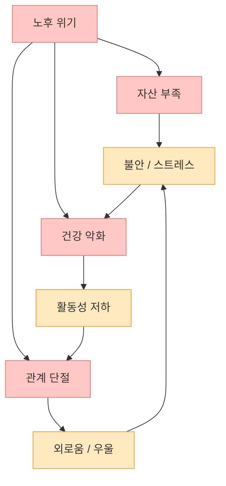
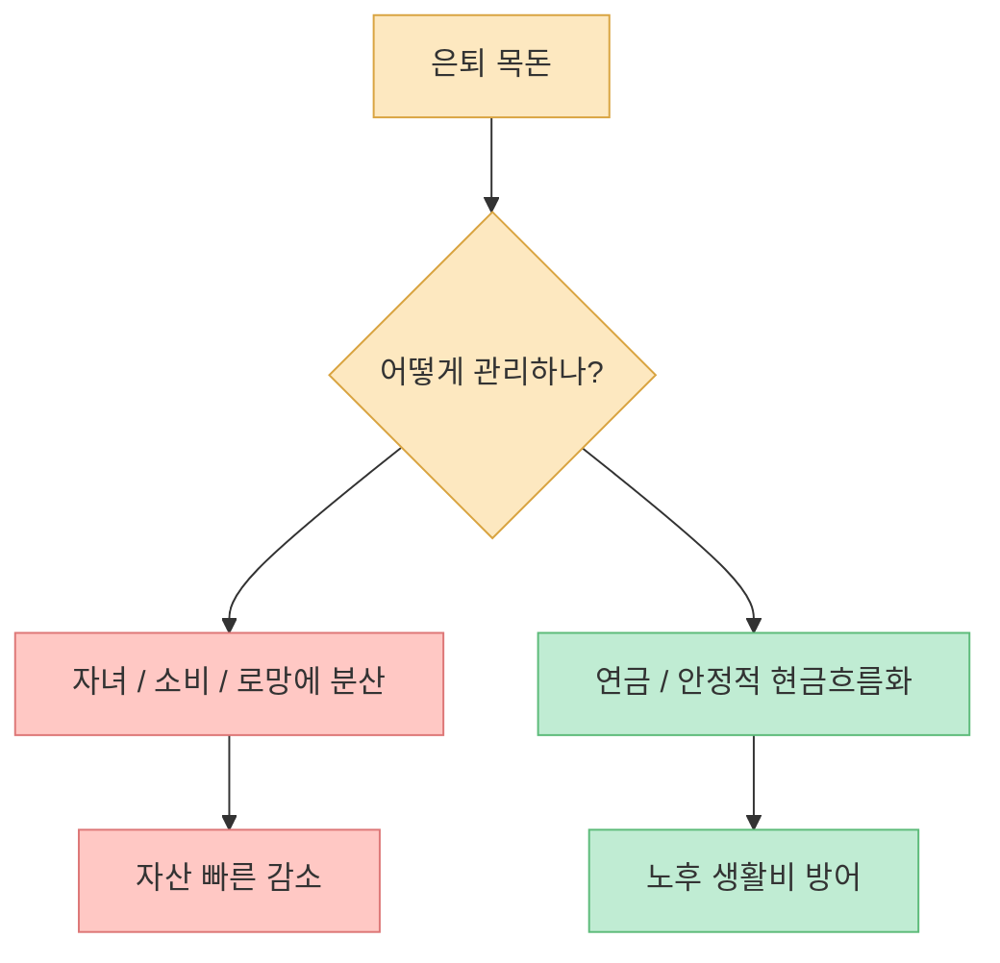
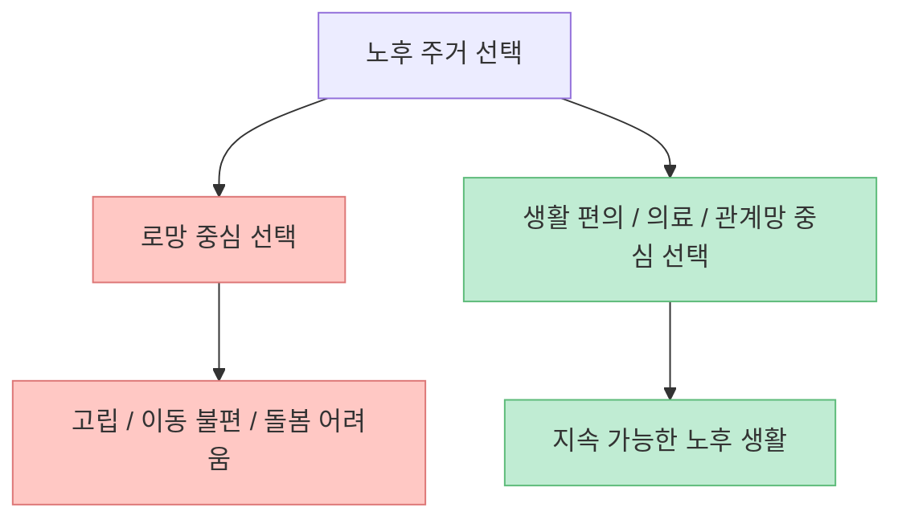
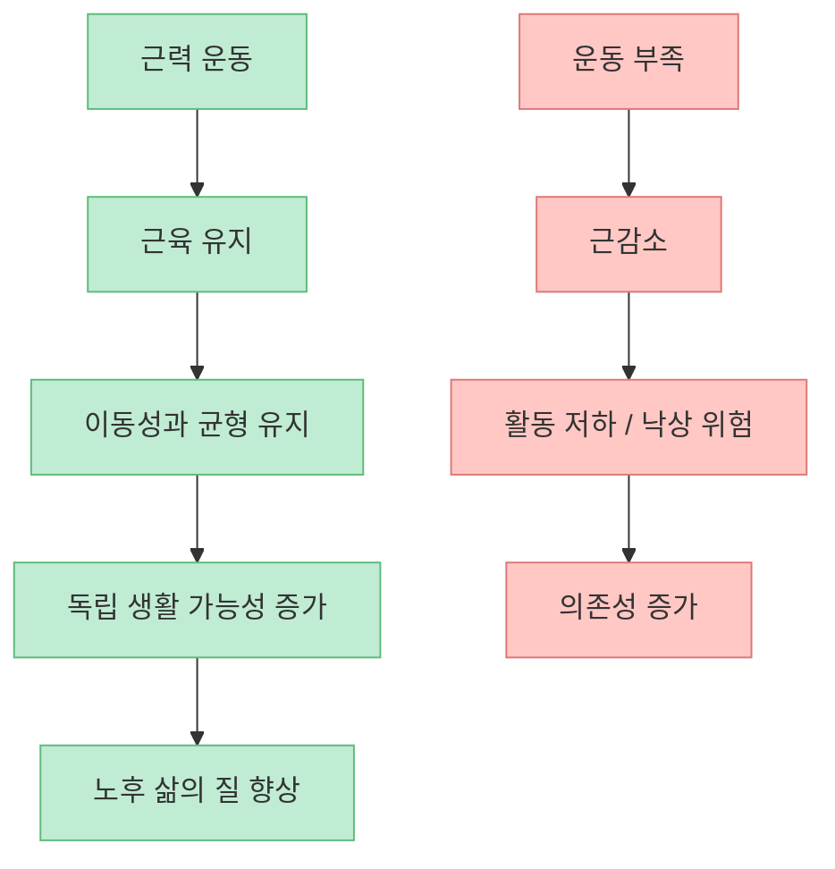
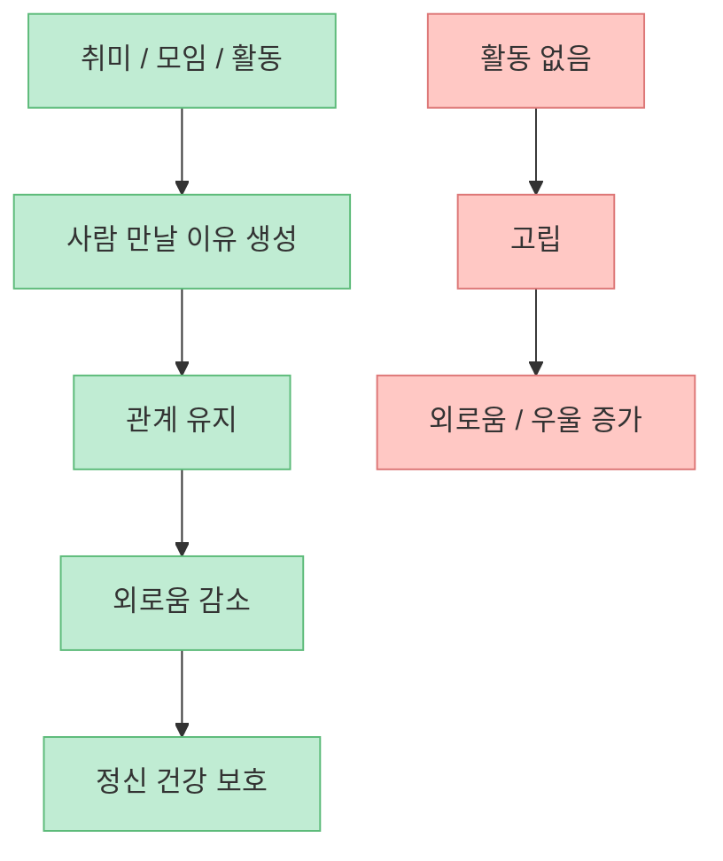
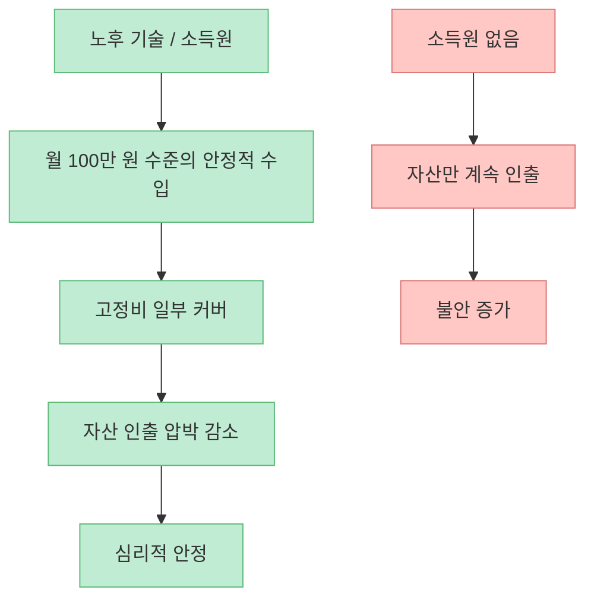
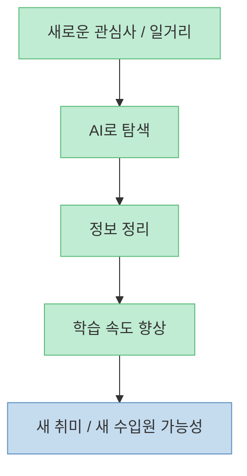

이 영상의 핵심은 “노후에 얼마가 필요하다”는 계산보다 더 근본적입니다. **노후를 망치는 것은 돈 부족 하나가 아니라, 돈·건강·관계가 동시에 무너지는 구조** 라는 것이죠. 그래서 준비도 세 갈래여야 합니다. 자산 관리, 건강 관리, 관계 관리입니다. 이 셋이 따로가 아니라 서로를 떠받친다는 점이 영상의 가장 강한 메시지입니다.

<!--more-->

## Sources

- ["아파트 아닙니다" '이 3가지' 있다면 이미 훌륭한 중년입니다ㅣ지식인클래스 EP.01 (김민식 PD)](https://youtu.be/vgYAHX4BtAM)
- [OECD Poverty rate](https://www.oecd.org/en/data/indicators/poverty-rate.html)
- [Pensions at a Glance 2025: Korea](https://www.oecd.org/en/publications/pensions-at-a-glance-2025-country-notes_8a53ef12-en/korea-republic-of_5cd52913-en.html)
- [WHO Ageing](https://www.who.int/health-topics/ageing)
- [WHO Reducing social isolation and loneliness among older people](https://www.who.int/health-topics/ageing/reducing-social-isolation-and-loneliness-among-older-people)
- [NIA Cognitive Health and Older Adults](https://www.nia.nih.gov/health/brain-health/cognitive-health-and-older-adults)

## 1. 노후 파산은 통장 잔고만의 문제가 아니다

영상은 노후의 위기를 세 가지 빈곤으로 설명합니다. 돈이 없고, 몸이 약해지고, 관계가 끊기는 상태입니다. [영상 0분~2분 부근](https://youtu.be/vgYAHX4BtAM?t=0) 이 셋은 서로 연결되어 있습니다. 자산이 부족하면 불안이 커지고, 불안은 건강을 해치며, 몸이 약해지면 사람 만나는 일도 줄어듭니다. 그러면 관계가 끊기고, 외로움과 스트레스는 다시 삶의 의욕과 관리 능력을 떨어뜨립니다.

한국의 현실도 이 문제의식을 뒷받침합니다. OECD 자료에 따르면 한국은 여전히 고령층 상대빈곤율이 매우 높은 나라 중 하나입니다. 2025년 OECD 한국 노트는 한국의 66세 이상 상대적 소득빈곤율이 OECD 국가 중 가장 높다고 설명합니다. [OECD Korea note](https://www.oecd.org/en/publications/pensions-at-a-glance-2025-country-notes_8a53ef12-en/korea-republic-of_5cd52913-en.html)

즉 노후 준비는 잔고를 키우는 작업이면서 동시에 **무너지는 고리를 끊는 작업** 이어야 합니다.

## 2. 자산 관리의 핵심은 목돈을 지키는 방식이지, 자식에게 먼저 나눠주는 것이 아니다

영상에서 가장 현실적인 경고 중 하나는 “목돈은 내 돈이 아니라 내가 가장 사랑하는 사람의 돈”이라는 표현입니다. [영상 4분 부근](https://youtu.be/vgYAHX4BtAM?t=240) 자녀 창업자금, 생활비 지원, 전원생활 로망 같은 이유로 은퇴자금이 빠르게 새기 시작하면, 정작 노후를 지탱해야 할 자산이 약해질 수 있다는 것입니다.

특히 영상은 은퇴 목돈은 가능한 한 연금 형태로 돌려 두라고 권합니다. 이유는 분명합니다. 목돈은 쓰기 쉽지만, 연금은 나를 지켜 주는 구조로 남기 쉽기 때문입니다. 이 관점은 단순한 절약 조언이 아니라, **노후 자산을 스스로 지키는 장치가 필요하다** 는 말입니다.

노후 자산에서 중요한 것은 “얼마를 모았나”만이 아니라, **어떻게 지출 충동으로부터 분리해 두느냐** 입니다.

## 3. 전원주택은 로망일 수 있지만, 노후의 기본 해답은 아니다

영상은 50대 이후 많은 사람이 “전원주택 지어서 여유롭게 살겠다”는 로망을 갖지만, 그것이 노후의 해답은 아니라고 강하게 말합니다. [영상 4분~6분 부근](https://youtu.be/vgYAHX4BtAM?t=240) 이유는 단순합니다. 시골이나 외딴 공간의 삶은 멋있어 보이지만, 실제로는 이동, 병원 접근성, 관계망 유지, 생활 유지비, 돌봄 부담 같은 문제를 키울 수 있습니다.

WHO가 말하는 healthy ageing도 개인의 건강만이 아니라, **사람이 실제로 기능하며 살아갈 수 있게 해 주는 환경** 을 중요하게 봅니다. [WHO Ageing](https://www.who.int/health-topics/ageing) 그래서 노후 주거를 생각할 때는 경치보다 먼저 의료 접근성, 커뮤니티, 이동성, 생활 편의성을 보는 편이 훨씬 현실적입니다.

노후의 집은 꿈의 상징이 아니라, **내 몸과 관계가 오래 유지될 수 있는 운영 기반** 이어야 합니다.

## 4. 건강 관리의 핵심은 근육이다: 노후 대비에서 PT가 골프보다 먼저일 수 있다

영상에서 김민식 PD는 노후 준비를 위해 돈 쓰는 항목 중 가장 확실한 것이 PT라고 말합니다. [영상 8분~10분 부근](https://youtu.be/vgYAHX4BtAM?t=480) 표현은 다소 세지만, 논리는 분명합니다. 나이가 들수록 가장 비싼 자산은 결국 근력과 활동성이라는 것입니다.

WHO는 건강한 노화의 핵심을 기능적 능력 유지로 설명합니다. NIA 역시 신체활동과 사회적 활동이 인지 건강과 삶의 질에 중요하다고 안내합니다. [WHO Ageing](https://www.who.int/health-topics/ageing), [NIA Cognitive Health](https://www.nia.nih.gov/health/brain-health/cognitive-health-and-older-adults) 근력 운동은 단순히 몸매 관리가 아니라, 넘어짐 예방, 독립적인 생활 유지, 만성질환 관리, 우울 감소와 모두 연결됩니다.

그래서 노후 준비의 첫 투자처를 묻는다면, 금융상품 이전에 **몸의 사용 가능 기간을 늘리는 투자** 가 들어가야 한다는 말이 됩니다.

## 5. 관계 관리는 취미와 사회 연결에서 시작된다

영상은 “집에서 아이만 봐 주는 삶”이나 “할 일이 없어 사람 만날 핑계가 사라지는 삶”을 경계합니다. [영상 6분~8분 부근](https://youtu.be/vgYAHX4BtAM?t=360) 은퇴 후에 일이 사라지면 관계도 함께 사라질 수 있기 때문입니다. 그래서 김민식 PD는 취미 활동, 강의, 글쓰기, 춤, 대화 같은 활동이 결국 사람을 바깥과 연결한다고 봅니다.

WHO도 고령층의 사회적 고립과 외로움은 중요한 건강 결정요인이라고 설명합니다. 고품질의 사회적 연결은 정신적·신체적 건강과 수명에 실제 영향을 줍니다. [WHO social isolation](https://www.who.int/health-topics/ageing/reducing-social-isolation-and-loneliness-among-older-people)

관계는 시간이 남아서 자연히 생기는 것이 아니라, **생활 구조를 밖으로 열어 둘 때 유지되는 자산** 입니다.

## 6. 월 100만 원짜리 기술 하나가 노후의 불안을 크게 줄일 수 있다

영상 후반에서 김민식 PD는 노후 대비의 핵심을 “월 100만 원을 꾸준히 벌 수 있는 기술 하나”라고 표현합니다. [영상 14분~16분 부근](https://youtu.be/vgYAHX4BtAM?t=840) 이 말은 큰 사업을 하라는 뜻이 아닙니다. 오히려 그 반대입니다. 20~30대와 정면 승부할 정도의 큰 수익보다, **내가 나이 들어서도 지속 가능하게 할 수 있는 작고 안정적인 현금흐름** 을 만들라는 뜻입니다.

이 논리는 매우 현실적입니다. 노후의 공포는 종종 “영원히 돈이 안 들어온다”는 감각에서 시작됩니다. 반대로 월 100만 원이라도 내가 스스로 벌 수 있는 구조가 있으면, 지출 구조와 심리적 안정성이 크게 달라집니다.

노후 기술은 거대한 창업 아이템이 아니라, **오래 할 수 있고 덜 망가지는 수입원** 이어야 합니다.

## 7. AI는 노후에도 새로운 직업과 공부의 도구가 될 수 있다

영상은 생성형 AI를 단순한 유행이 아니라, 나이 든 이후에도 공부와 수입 기회를 넓히는 도구로 소개합니다. [영상 12분~16분 부근](https://youtu.be/vgYAHX4BtAM?t=720) 영어 번역, 직업 탐색, 콘텐츠 정리, 아이디어 확장, 강의 준비처럼 과거에는 시간과 돈이 많이 들던 작업을 AI가 크게 도와줄 수 있다는 것입니다.

이 대목의 중요성은 기술 자체보다 태도에 있습니다. 50대 이후에는 늦었다고 생각하기 쉽지만, 영상은 오히려 “한 번도 안 해 본 것”을 시작하는 사람이 삶의 폭을 넓힐 수 있다고 말합니다. AI는 그 출발점의 마찰을 줄여 주는 도구가 될 수 있습니다.

즉 AI는 젊은 세대만의 무기가 아니라, **노후의 학습 비용을 낮춰 주는 보조 도구** 로도 충분히 쓸 수 있습니다.

## 핵심 요약

- 노후 파산은 자산 부족만이 아니라 **건강 악화와 관계 단절이 함께 오는 구조적 문제** 입니다. [영상 0분~2분 부근](https://youtu.be/vgYAHX4BtAM?t=0)
- 은퇴 목돈은 쉽게 쓰는 돈이 아니라, **연금화해서 나를 지켜 주는 자산** 으로 바꾸는 편이 안전합니다. [영상 4분 부근](https://youtu.be/vgYAHX4BtAM?t=240)
- 전원주택 로망보다 중요한 것은 **의료·이동·관계망이 유지되는 생활 환경** 입니다.
- 건강 관리의 핵심은 결국 **근육과 활동성 유지** 입니다. [영상 8분~10분 부근](https://youtu.be/vgYAHX4BtAM?t=480)
- 관계 관리는 취미와 사회적 연결에서 시작되며, 고립을 막는 것이 곧 건강 관리이기도 합니다.
- 노후에는 월 100만 원 수준의 **지속 가능한 기술 기반 수입원** 하나가 큰 안정감을 줄 수 있습니다. [영상 14분 부근](https://youtu.be/vgYAHX4BtAM?t=840)

## 결론

결국 노후를 지키는 자산은 아파트 한 채가 아니라, **돈을 관리하는 습관, 몸을 움직일 수 있는 근력, 사람과 연결되는 생활 구조** 입니다. 이 세 가지가 함께 가야만 노후의 빈곤·질병·외로움을 동시에 늦출 수 있습니다. 그래서 좋은 노후 준비는 금융상품만 고르는 일이 아니라, 삶의 구조를 다시 설계하는 일에 더 가깝습니다.
