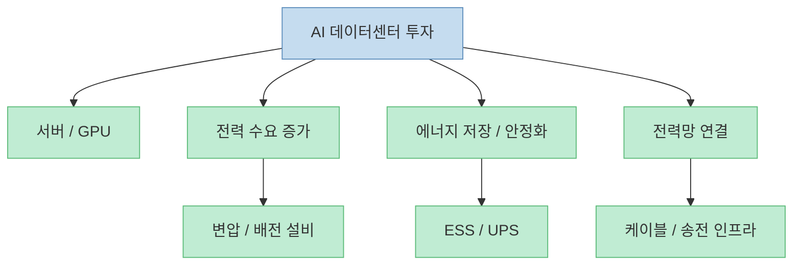
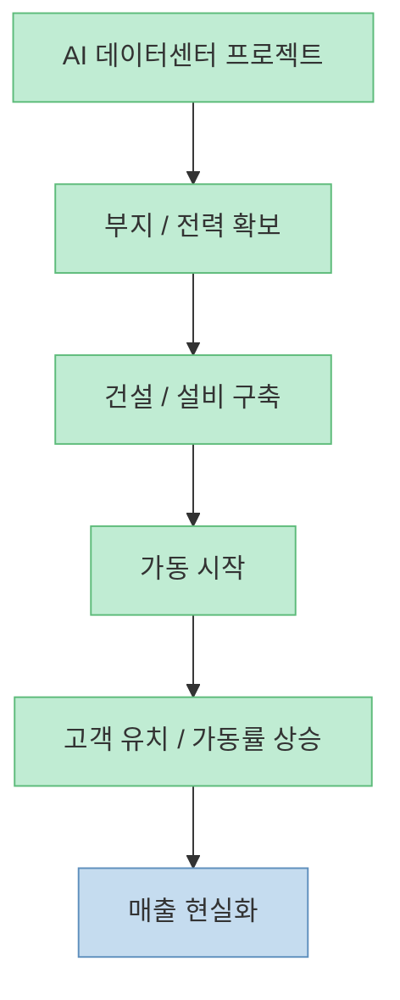
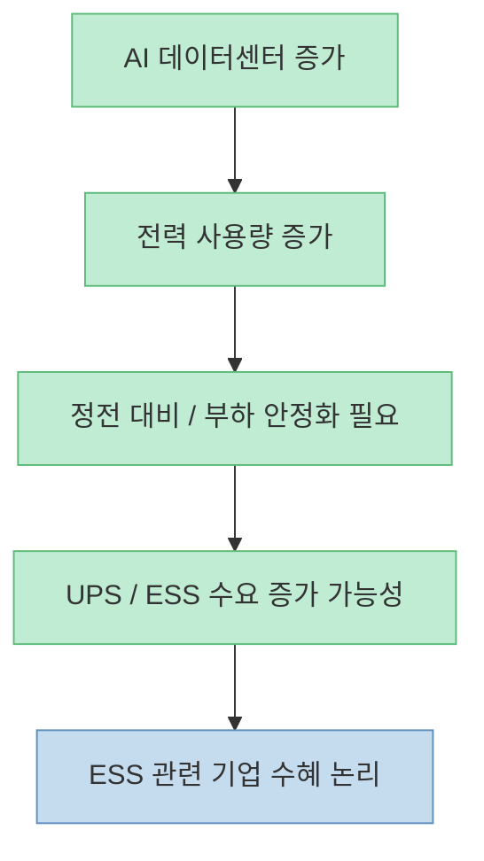
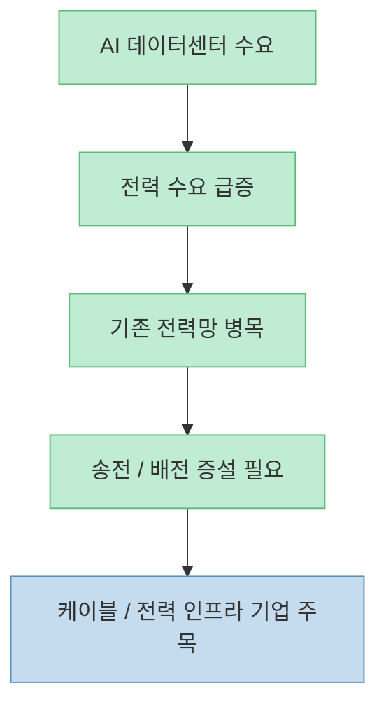
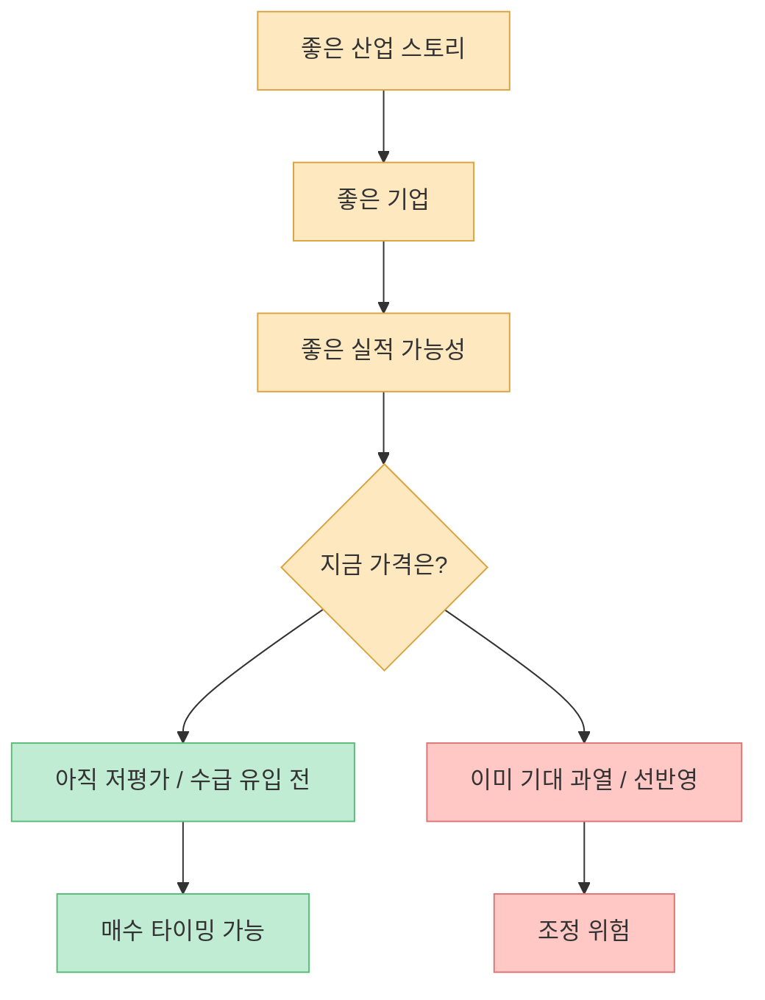
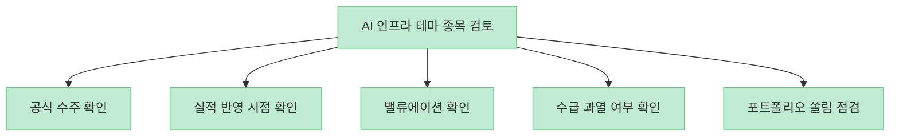

이 쇼츠 영상은 SKT, LG에너지솔루션, 대한전선을 `AI 인프라 대장주` 후보로 제시합니다. 핵심 논리는 단순합니다. **AI 데이터센터가 늘면 서버만 필요한 게 아니라 전력망, ESS, 케이블, 냉각, 부지, 클라우드 인프라까지 함께 커진다** 는 것입니다. 이 방향 자체는 맞을 수 있습니다. 다만 이런 쇼츠형 콘텐츠를 볼 때는 “이 종목 사면 되나?”보다 먼저, **지금 시장이 어떤 공급망을 어떤 속도로 가격에 반영하고 있는가** 를 따져야 합니다.

<!--more-->

## Sources

- [연말까지 5배 급등할 AI 인프라 대장주, LGCNS에서 부자들이 몰래 갈아탄 숨은 한국주식 대장주 3종목 공개](https://youtube.com/shorts/DMxWlG37qEY)
- [SK Group and AWS Team Up to Build Cloud Computing Infrastructure to Support AI Innovation – SK Telecom Newsroom](https://news.sktelecom.com/en/1948)
- [SK-AWS 울산 AI 데이터센터, AI 고속도로의 거점으로 – SK텔레콤 뉴스룸](https://news.sktelecom.com/213316)
- [Investor.gov — Diversify Your Investments](https://www.investor.gov/index.php/introduction-investing/investing-basics/save-and-invest/diversify-your-investments)

## 1. AI 데이터센터 테마는 반도체만의 이야기가 아니다

영상은 AI 인프라 수혜주를 이야기하면서, 단순히 GPU나 반도체만 보지 않습니다. AWS와 함께 울산 AI 데이터센터를 추진하는 SKT, 데이터센터용 ESS 공급 모멘텀을 받는 LG에너지솔루션, 전력망 확장 수혜 논리의 대한전선까지 이어집니다. [영상 전체](https://youtube.com/shorts/DMxWlG37qEY)

이 구조는 꽤 설득력 있습니다. AI 데이터센터가 커질수록 필요한 것은 다음처럼 넓어집니다.

- 연산 장비: GPU, 서버, 네트워크  
- 전력 인프라: 변압, 배전, 전력망 증설  
- 저장 / 안정화: ESS, UPS  
- 연결 인프라: 초고압 케이블, 배선  
- 운영 인프라: 냉각, 부지, 전력 효율화  

즉 AI 인프라 테마를 볼 때는 반도체 하나로 끝내면 안 되고, **전력과 저장, 연결 인프라까지 같이 봐야** 합니다.

## 2. SKT의 핵심은 통신주가 아니라 ‘AI 데이터센터 운영 주체’라는 포지션이다

영상이 SKT를 첫 번째로 꼽는 이유는 AWS와의 울산 AI 데이터센터 협력, 그리고 자체 AI 클러스터 경험을 결합한 `운영 주체` 포지션에 있습니다. [영상 00:17~00:30](https://youtube.com/shorts/DMxWlG37qEY?t=17) 이 부분은 공식 자료로도 확인됩니다. SK그룹과 AWS는 울산에 하이퍼스케일 AI 전용 데이터센터를 추진하고 있으며, SK텔레콤 뉴스룸은 이를 한국 AI 인프라 확장의 핵심 거점으로 설명합니다. [SKT Newsroom 1](https://news.sktelecom.com/en/1948), [SKT Newsroom 2](https://news.sktelecom.com/213316)

여기서 투자 포인트는 통신 요금이 아닙니다. **AI 인프라를 누가 실제로 깔고 운영하며, 그 과정에서 장기 매출 구조를 만들 수 있느냐** 입니다. 다만 데이터센터 사업은 착공, 증설, 가동, 고객 유치, 전력 확보가 단계별로 이어져야 하므로, 장밋빛 스토리만 보고 당장 실적이 폭발한다고 보면 안 됩니다.

따라서 SKT를 볼 때는 “AI 한다더라”보다, **프로젝트가 어느 단계까지 왔는지** 가 훨씬 중요합니다.

## 3. LG에너지솔루션의 논리는 배터리보다 ESS와 전력 안정화 쪽에서 읽어야 한다

영상은 LG에너지솔루션을 데이터센터향 ESS 수요 수혜주로 제시합니다. [영상 00:32~00:40](https://youtube.com/shorts/DMxWlG37qEY?t=32) 이 논리의 핵심은 EV 배터리만이 아니라, AI 데이터센터가 커질수록 **전력 공급의 안정성과 피크 대응** 이 중요해지고, 그 과정에서 대형 ESS가 더 자주 쓰일 수 있다는 점입니다.

이 해석은 충분히 가능합니다. 데이터센터는 전력 사용량이 크고, 특히 AI 워크로드는 전력과 냉각 부담이 높기 때문에 UPS·ESS·전력 관리 수요가 따라붙기 쉽습니다. 다만 투자에서는 한 가지를 더 확인해야 합니다. **이 수요가 실제 LG에너지솔루션의 수주와 매출로 얼마나 연결되느냐** 입니다. 테마 논리와 실적 반영은 같은 말이 아닙니다.

즉 LG에너지솔루션은 배터리 종목이라는 일반론보다, **전력 저장 인프라 기업으로서의 서사를 어떻게 실적으로 전환하느냐** 가 핵심입니다.

## 4. 대한전선의 포인트는 AI보다 전력망 병목이다

영상은 대한전선을 세 번째 종목으로 제시하면서, AI 데이터센터가 늘수록 전력망 수요가 커질 수밖에 없다는 점을 강조합니다. [영상 00:44~00:56](https://youtube.com/shorts/DMxWlG37qEY?t=44) 이건 꽤 중요한 통찰입니다. AI 투자에서 진짜 병목은 종종 GPU가 아니라 **전력과 송배전 인프라** 일 수 있기 때문입니다.

데이터센터는 전기를 많이 먹고, 그 전기를 제때 끌어오지 못하면 설비를 지어도 의미가 줄어듭니다. 그래서 전력 케이블, 송전망 증설, 배전 설비, 변전 인프라가 모두 AI 테마 안으로 들어오기 시작합니다.

대한전선을 볼 때도 “AI 관련주”라고 단순히 부르기보다, **전력 인프라 병목 해소 테마** 로 읽는 편이 더 정확합니다.

## 5. 쇼츠형 추천의 핵심 위험: 좋은 기업과 좋은 매수 타이밍은 다르다

영상 안에서도 의외로 중요한 말이 나옵니다. “그래서 이 종목들 바로 사냐? 아닙니다. 기업이 아무리 좋아도 주가는 수급이 붙어야 올라가죠. 우린 그때만 노릴 겁니다.” [영상 00:56~01:02](https://youtube.com/shorts/DMxWlG37qEY?t=56)

이 문장은 사실 쇼츠 전체의 가장 중요한 경고입니다. 좋은 산업, 좋은 서사, 실제 수주, 장기 성장성은 모두 중요하지만, **주가가 언제 반응하느냐는 수급과 기대치에 따라 달라집니다.** 그래서 뉴스가 좋아도 이미 가격에 다 반영됐을 수 있고, 반대로 실적이 좋아도 잠시 주가가 쉬는 경우도 생깁니다.

그래서 쇼츠형 콘텐츠를 볼 때는 종목 이름보다, **언제 사면 안 되는가** 를 같이 생각해야 합니다.

## 6. 개인 투자자는 종목 추천보다 체크리스트를 가져가야 한다

이런 테마 영상을 보고 개인 투자자가 바로 가져가야 하는 것은 “세 종목 메모”가 아니라, 아래 같은 체크리스트입니다.

1. 이 회사의 AI 인프라 서사는 **공식 수주나 프로젝트 진행 상황** 으로 확인되는가?  
2. 매출과 이익으로 연결되는 시점은 언제인가?  
3. 현재 주가에는 이미 몇 년치 기대가 반영돼 있는가?  
4. AI 외 수요 둔화가 이 서사를 상쇄하지는 않는가?  
5. 공급망 안에서 가장 병목이 되는 구간은 어디인가?  

Investor.gov도 투자자는 특정 종목이나 섹터에 과도하게 몰리지 말고 분산과 위험 관리를 함께 고려해야 한다고 설명합니다. [Investor.gov Diversify](https://www.investor.gov/index.php/introduction-investing/investing-basics/save-and-invest/diversify-your-investments)

결국 중요한 것은 “무슨 종목이냐”보다, **그 종목이 지금 어떤 위치에 있느냐** 입니다.

## 핵심 요약

- AI 데이터센터 테마는 반도체만이 아니라 **전력, ESS, 케이블, 운영 인프라** 까지 넓게 연결됩니다.
- SKT는 통신주라기보다 **AI 데이터센터 운영 주체** 서사가 중요합니다.
- LG에너지솔루션은 EV보다 **ESS / 전력 안정화 수요** 쪽에서 읽는 편이 더 정확합니다.
- 대한전선은 AI 직접 수혜보다 **전력망 병목 해소** 테마로 봐야 합니다.
- 좋은 기업과 좋은 매수 타이밍은 다릅니다. 쇼츠에서도 결국 **수급이 붙는 시점** 을 말하고 있습니다.
- 개인 투자자는 종목명보다 **수주, 실적 시점, 밸류에이션, 수급, 쏠림** 체크리스트를 가져가야 합니다.

## 결론

이 영상이 던지는 핵심은 “지금 당장 이 세 종목을 사라”보다, **AI 인프라 테마가 반도체 바깥으로 퍼지고 있다** 는 사실에 가깝습니다. 다만 테마가 맞는 것과 매수 타이밍이 맞는 것은 전혀 다른 문제입니다. 그래서 개인 투자자가 가장 먼저 해야 할 일은 종목 암기가 아니라, 공급망 구조와 가격 반영 정도를 같이 읽는 습관을 만드는 것입니다.
