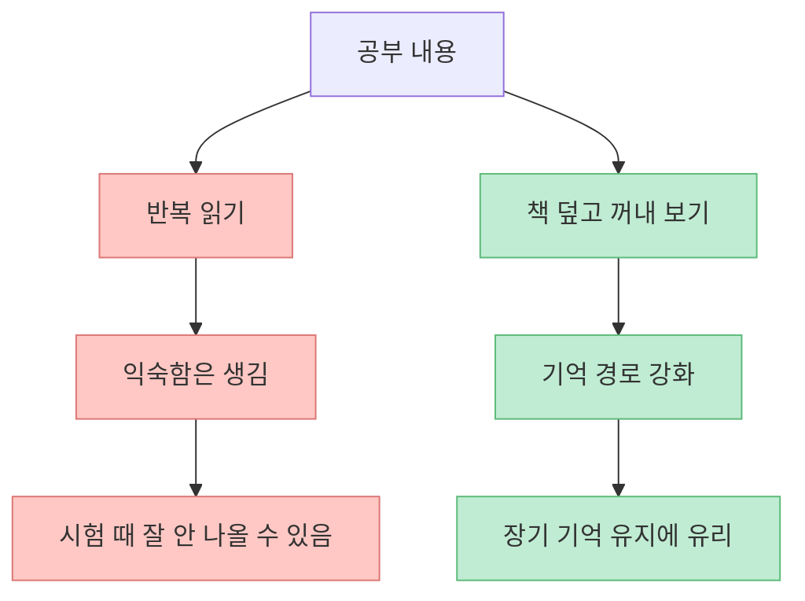
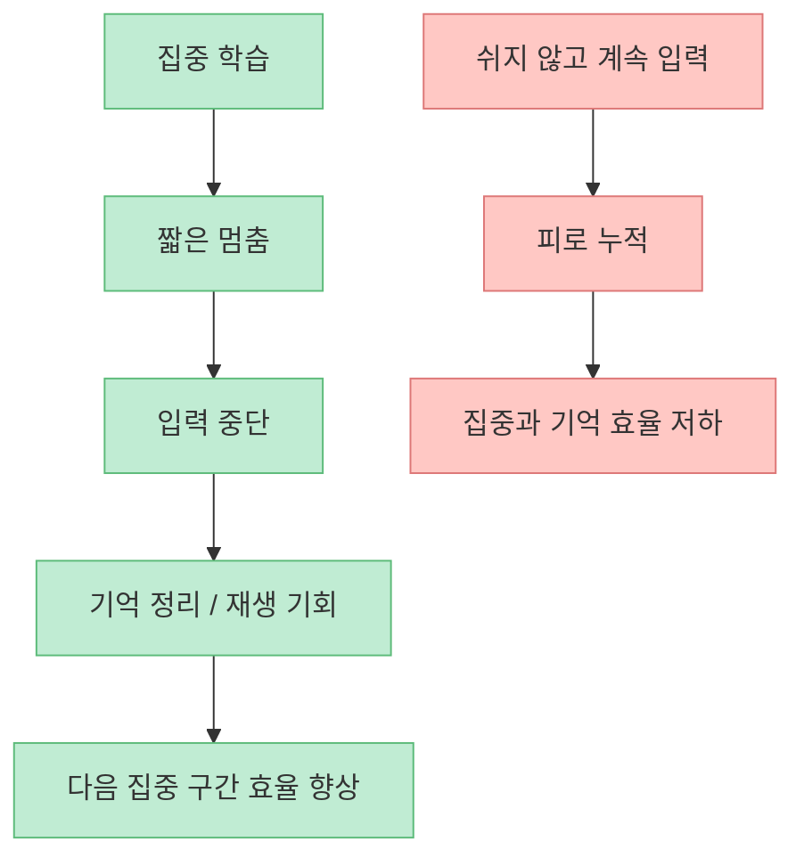
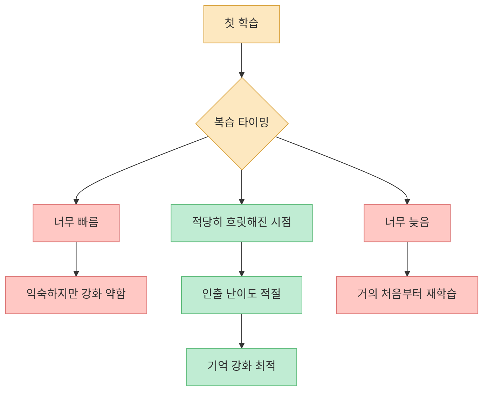
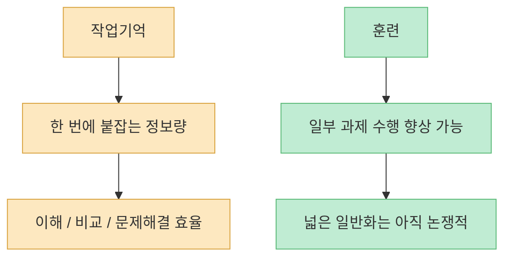
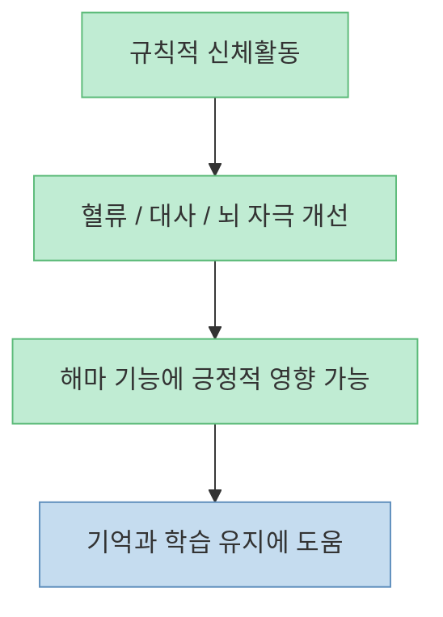
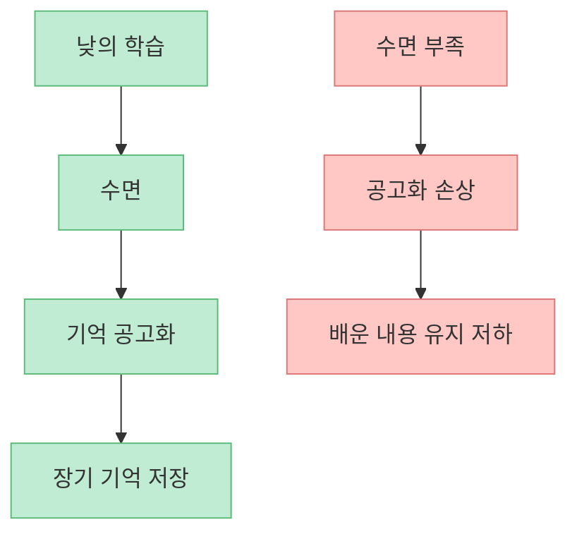
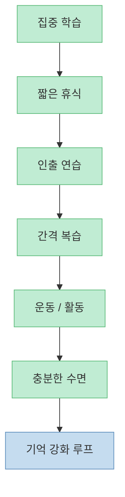

이 영상의 핵심은 “머리가 좋은 사람”의 비밀이 아닙니다. **뇌가 기억을 만들고 꺼내는 방식에 맞춰 공부법을 설계하는 사람** 이 결국 더 적게 공부해도 더 오래 기억한다는 이야기입니다. 특히 영상은 다섯 가지 축을 제시합니다. 짧은 휴식, 인출 연습, 간격 복습, 작업기억 훈련, 그리고 수면입니다.

<!--more-->

## Sources

- [노는줄 알았는데 성적은 늘 좋은 사람들의 비밀, 두뇌 좋아지는 5가지 방법](https://youtu.be/b_Q1n3jGPhk)
- [Karpicke & Roediger (2008), The Critical Importance of Retrieval for Learning, Science](https://www.science.org/doi/10.1126/science.1152408)
- [Cepeda et al. (2008), Spacing Effects in Learning, Psychological Science](https://journals.sagepub.com/doi/10.1111/j.1467-9280.2008.02079.x)
- [Walker & Stickgold (2004), Sleep-dependent learning and memory consolidation, Neuron](https://www.sciencedirect.com/science/article/pii/S0896627304008113)
- [Erickson et al. (2011), Exercise training increases size of hippocampus and improves memory, PNAS](https://www.pnas.org/doi/10.1073/pnas.1015950108)

## 1. 많이 읽는 것보다 다시 꺼내는 것이 더 강하다

영상에서 가장 중요한 포인트는 “공부가 안 되는 고통 자체가 사실은 공부가 되고 있다는 신호”라는 대목입니다. [영상 4분 부근](https://youtu.be/b_Q1n3jGPhk?t=240) 이 말은 감성적인 조언이 아니라, 실제로 인출 연습(retrieval practice) 연구와 맞닿아 있습니다.

Karpicke와 Roediger의 2008년 Science 논문은 반복 읽기보다 **기억에서 꺼내 보는 연습** 이 장기 기억에 훨씬 유리하다는 점을 보여 줬습니다. 같은 시간을 써도 읽기만 한 집단보다 꺼내 쓰기를 한 집단이 더 오래 기억한 것이죠. [Science 논문](https://www.science.org/doi/10.1126/science.1152408)

즉 “봤다”와 “꺼낼 수 있다”는 전혀 다릅니다. 공부 잘하는 사람들은 대개 이 둘을 구분합니다.

## 2. 짧은 휴식은 게으름이 아니라 뇌의 정리 시간일 수 있다

영상은 10분 공부 후 30초~1분 정도 완전히 쉬어 주는 짧은 휴식을 권합니다. [영상 2분 부근](https://youtu.be/b_Q1n3jGPhk?t=120) 여기서 중요한 건 “딴짓”이 아니라 진짜 휴식입니다. 폰을 붙잡는 것이 아니라, 입력을 잠깐 끊어 주는 식의 멈춤이죠.

이 주장은 최근 기억 재생(replay) 연구들과 연결됩니다. 영상은 짧은 휴식 동안 해마가 방금 배운 정보를 빠르게 재생한다고 설명하는데, 이런 방향성 자체는 신경과학적으로 충분히 설득력이 있습니다. 다만 여기서 조심할 점은 “20배 빨라진다” 같은 숫자를 만능 공식처럼 받아들이지 않는 것입니다. 중요한 것은 정확한 배수보다 **휴식이 기억 정리에 실제로 기여할 수 있다** 는 원리입니다.

휴식의 기능은 놀기 위한 변명이 아니라, **뇌가 배운 것을 붙잡게 해 주는 간격** 으로 이해하면 됩니다.

## 3. 복습은 ‘언제’ 하느냐가 ‘얼마나’ 하느냐만큼 중요하다

영상은 너무 빨라도, 너무 늦어도 복습 효율이 떨어진다고 설명합니다. [영상 8분 부근](https://youtu.be/b_Q1n3jGPhk?t=480) 이것은 간격 효과(spacing effect) 연구와도 맞습니다.

Cepeda 연구팀의 2008년 논문은 복습 간격이 학습 유지에 매우 중요하다는 점을 정리했습니다. 핵심은 간단합니다. **조금 잊을 듯할 때 다시 꺼내는 것이 오래 남는다** 는 것입니다. 너무 빨리 보면 뇌가 이미 알고 있다고 느끼고, 너무 늦으면 거의 처음부터 다시 해야 합니다. [Psychological Science 논문](https://journals.sagepub.com/doi/10.1111/j.1467-9280.2008.02079.x)

그래서 복습은 의지의 문제가 아니라 **시간 설계의 문제** 입니다.

## 4. 작업기억은 공부의 ‘조리대’다, 하지만 과장된 숫자는 걸러서 봐야 한다

영상은 작업기억을 뇌 안의 조리대에 비유합니다. [영상 10분 부근](https://youtu.be/b_Q1n3jGPhk?t=600) 이 비유는 꽤 좋습니다. 한 번에 붙잡고 비교하고 조작할 수 있는 정보의 폭이 넓을수록, 읽고 이해하고 문제를 푸는 과정이 더 수월해질 수 있기 때문입니다.

다만 영상에서 언급한 2008년 Jaeggi 연구를 볼 때는 주의가 필요합니다. 듀얼 N-back 훈련으로 유동지능이 향상됐다는 초기 결과는 큰 관심을 받았지만, 이후 재현성과 효과 크기를 두고 논쟁도 많았습니다. 즉 **작업기억 훈련이 전혀 의미 없다고 단정할 필요는 없지만, 단기간에 지능이 폭발적으로 오른다고 기대하는 것도 과장** 입니다.

이 영역에서 중요한 건 “몇 배 향상” 같은 자극적 수치보다, **정보를 다루는 순간의 병목이 어디인지 이해하는 것** 입니다.

## 5. 운동은 뇌에도 투자다: 몸을 움직이면 해마가 바뀔 수 있다

영상은 뇌가 바뀔 수 있는 장기라는 점을 강조하며, 걷기 같은 신체활동도 중요하다고 말합니다. [영상 12분 부근](https://youtu.be/b_Q1n3jGPhk?t=720) 이 부분은 Erickson 연구와 잘 맞습니다.

2011년 PNAS에 실린 Erickson 등의 연구는 규칙적인 유산소 운동이 노년층의 해마 부피와 기억력에 긍정적인 변화를 줄 수 있음을 보여 줬습니다. [PNAS 논문](https://www.pnas.org/doi/10.1073/pnas.1015950108) 여기서 핵심은 “운동하면 천재가 된다”가 아닙니다. **뇌는 나이가 들어도 변화할 수 있고, 몸의 활동이 그 변화에 실제로 관여할 수 있다** 는 사실입니다.

공부를 잘하고 싶다면 책상 앞 시간만 늘리는 것이 아니라, **몸을 움직이는 시간을 같이 설계** 해야 합니다.

## 6. 수면은 공부의 마지막 단계가 아니라 기억 저장의 핵심 공정이다

영상 마지막 축은 수면입니다. 잠을 줄이면 공부 시간이 늘어나는 것처럼 보이지만, 실제로는 낮에 넣어 둔 정보를 장기 기억으로 옮기는 과정이 망가질 수 있다고 설명합니다. [영상 14분~16분 부근](https://youtu.be/b_Q1n3jGPhk?t=840)

Walker와 Stickgold의 리뷰는 수면이 기억 공고화와 학습에 핵심적이라는 점을 잘 보여 줍니다. [Neuron 리뷰](https://www.sciencedirect.com/science/article/pii/S0896627304008113) 즉 수면은 “공부를 안 하는 시간”이 아니라, **낮의 학습을 저장하고 정리하는 시간** 입니다.

그래서 수면을 깎아서 공부 시간을 늘리는 전략은 단기적으로는 버티는 것처럼 보여도, 장기 기억 관점에서는 손해일 수 있습니다.

## 7. 이 다섯 가지를 한 번에 다 하려 하기보다, 루틴으로 묶어야 한다

영상은 마지막에 다섯 가지 원리를 묶어 작은 루틴으로 제안합니다. [영상 16분~18분 부근](https://youtu.be/b_Q1n3jGPhk?t=960) 이 부분이 중요합니다. 인출 연습, 간격 복습, 휴식, 운동, 수면은 각각 좋은 팁이지만, 실제 성과는 **서로 연결된 시스템** 으로 만들 때 더 커집니다.

예를 들어:

- 10분~30분 집중  
- 짧은 휴식  
- 책 덮고 1분 꺼내 보기  
- 다음날 다시 복습  
- 밤에는 최소 6시간 이상 수면  

이렇게만 해도 단순 반복 읽기보다 훨씬 강한 구조가 됩니다.

공부 잘하는 사람의 차이는 종종 재능이 아니라, **이 루프를 생활 속에 얼마나 자동화했는가** 에서 갈립니다.

## 핵심 요약

- 반복 읽기보다 **인출 연습** 이 장기 기억에 훨씬 강합니다. [Karpicke & Roediger, 2008](https://www.science.org/doi/10.1126/science.1152408)
- 복습은 너무 빠르지도 늦지도 않게, **조금 잊을 듯할 때** 하는 것이 유리합니다. [Cepeda et al., 2008](https://journals.sagepub.com/doi/10.1111/j.1467-9280.2008.02079.x)
- 짧은 휴식은 게으름이 아니라 **기억 정리 시간** 이 될 수 있습니다.
- 작업기억 훈련은 흥미롭지만, **과장된 숫자 해석은 조심** 해야 합니다.
- 운동은 몸뿐 아니라 **해마와 기억에도 긍정적 영향** 을 줄 수 있습니다. [Erickson et al., 2011](https://www.pnas.org/doi/10.1073/pnas.1015950108)
- 수면은 공부의 적이 아니라 **기억 저장의 핵심 단계** 입니다. [Walker & Stickgold, 2004](https://www.sciencedirect.com/science/article/pii/S0896627304008113)

## 결론

결국 공부를 잘하는 사람은 더 오래 앉아 있는 사람이 아니라, **뇌가 기억을 저장하는 방식에 맞춰 공부를 설계하는 사람** 일 가능성이 큽니다. 읽고, 쉬고, 꺼내고, 다시 보고, 자고, 움직이는 것. 화려한 비법처럼 보이지 않지만, 실제로는 이런 기본 원리의 조합이 가장 강력한 공부 전략에 가깝습니다.
