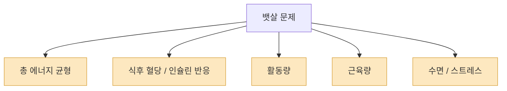
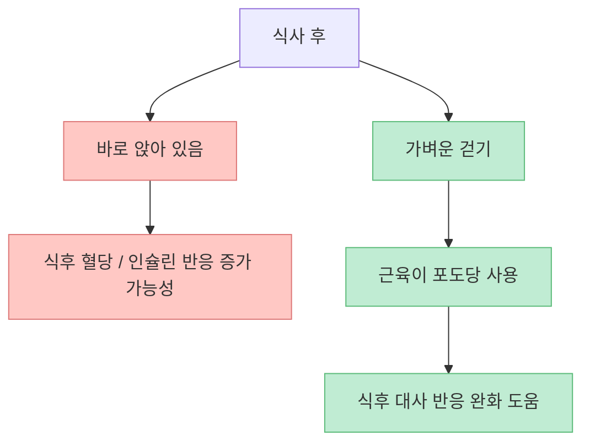
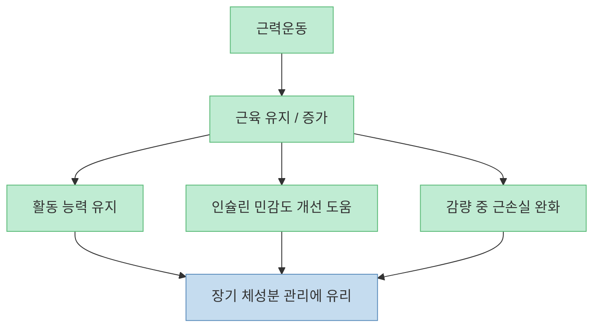
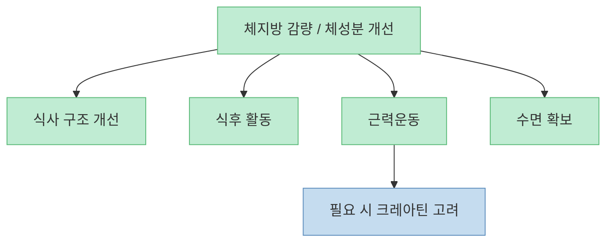
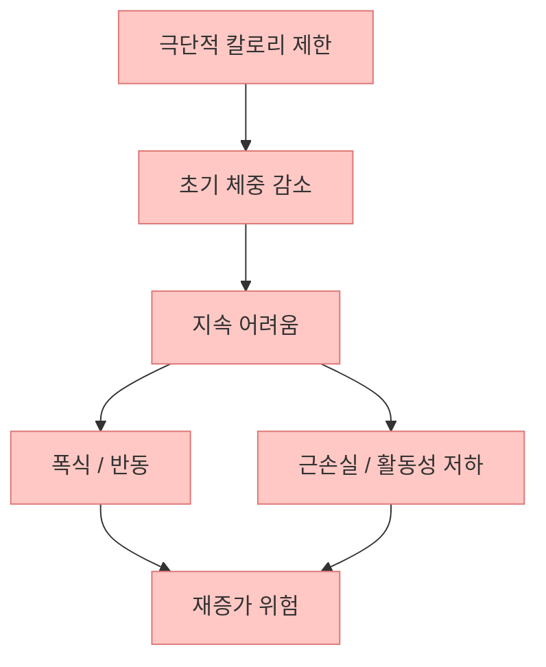
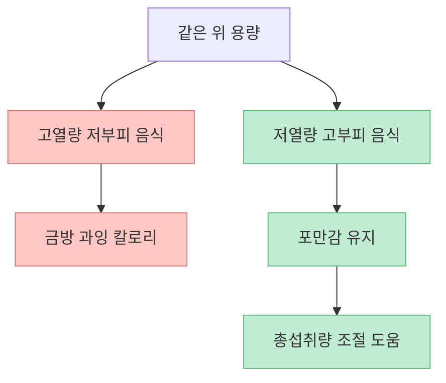
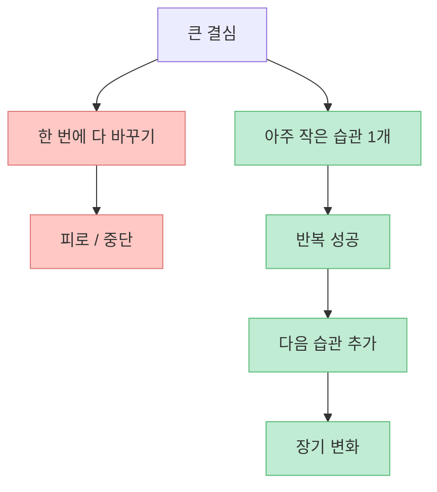

이 영상의 가장 중요한 메시지는 단순합니다. **뱃살은 복근운동 횟수보다 식후 대사 반응과 생활 습관의 구조에서 더 크게 갈린다** 는 것입니다. 크런치나 플랭크를 아무리 많이 해도 식사 패턴, 활동량, 근육량, 수면, 극단적 다이어트 습관이 그대로면 복부 지방은 잘 안 바뀔 수 있습니다.

<!--more-->

## Sources

- [99%가 잘못 알고 있는 뱃살 제거법 | 10분이면 정리됩니다](https://youtu.be/P2v4rw2sK4k)
- [Metabolic Adaptations to Morning Versus Afternoon Training: A Systematic Review and Meta-analysis - PubMed](https://pubmed.ncbi.nlm.nih.gov/37458979/)
- [The Acute Effects of Interrupting Prolonged Sitting Time in Adults with Standing and Light-Intensity Walking on Biomarkers of Cardiometabolic Health - PMC](https://pmc.ncbi.nlm.nih.gov/articles/PMC9325803/)
- [Effects of interrupting prolonged sitting on postprandial glycemia and insulin responses: A network meta-analysis - PMC](https://pmc.ncbi.nlm.nih.gov/articles/PMC8343076/)
- [NIH ODS — Dietary Supplements for Exercise and Athletic Performance](https://ods.od.nih.gov/factsheets/ExerciseAndAthleticPerformance-HealthProfessional/)

## 1. 뱃살 문제를 복근 문제로 보면 출발점부터 어긋나기 쉽다

영상은 많은 사람이 뱃살을 없애기 위해 크런치, 플랭크 같은 국소 운동부터 떠올리지만, 실제 핵심은 호르몬과 대사 구조라고 말합니다. [영상 0분 부근](https://youtu.be/P2v4rw2sK4k?t=0) 이 방향은 꽤 설득력 있습니다. 복부 지방은 단순히 배 근육을 안 써서 붙는 것이 아니라, 총 에너지 수지, 식사 패턴, 활동량, 수면, 스트레스, 인슐린 반응이 함께 얽혀 생깁니다.

즉 “배를 많이 움직이면 배 지방이 빠진다”는 식의 국소지방감소 기대는 대개 과장입니다. 배 운동이 코어를 강화하고 자세를 개선할 수는 있어도, **복부 지방 자체를 선택적으로 태우는 마법 버튼은 아닙니다.**

그래서 뱃살 제거의 첫 질문은 “무슨 복근 운동을 할까?”가 아니라, **내 몸이 하루 종일 어떤 대사 환경에 놓여 있는가** 입니다.

## 2. 식후 가벼운 걷기는 생각보다 강력한 개입일 수 있다

영상은 밥 먹고 바로 누워 있거나 앉아 있기보다, 짧게라도 걷는 습관이 중요하다고 말합니다. [영상 1분~2분 부근](https://youtu.be/P2v4rw2sK4k?t=60) 이건 단순한 생활 꿀팁 수준이 아니라, 실제로 식후 혈당과 인슐린 반응 개선과 연결되는 연구들이 있습니다.

메타분석과 체계적 문헌고찰을 보면, 오래 앉아 있는 시간을 짧은 활동으로 끊거나 식후 가벼운 걷기를 하면 식후 혈당 반응을 줄이는 데 도움이 될 수 있습니다. 특히 light-intensity walking은 단순히 서 있는 것보다 더 나은 자극이 될 수 있다는 결과가 나옵니다. [PMC sitting interruption review](https://pmc.ncbi.nlm.nih.gov/articles/PMC9325803/), [PMC network meta-analysis](https://pmc.ncbi.nlm.nih.gov/articles/PMC8343076/)

식후 걷기는 헬스장 등록 없이도 바로 시작할 수 있다는 점에서, 뱃살 관리의 가장 현실적인 개입 중 하나입니다.

## 3. 근육은 체형뿐 아니라 대사에도 영향을 준다

영상은 근육이 많을수록 기초대사량이 올라가고, 결과적으로 지방을 더 태우기 쉬워진다고 설명합니다. [영상 3분~4분 부근](https://youtu.be/P2v4rw2sK4k?t=180) 이 문장은 방향은 맞지만, 과장 없이 해석할 필요가 있습니다. 근육 1kg이 하루 수백 칼로리를 태워 주는 것은 아니지만, **근육량이 유지되면 에너지 소비, 활동 능력, 인슐린 민감도, 체성분 유지 측면에서 유리** 한 것은 사실입니다.

따라서 뱃살을 빼고 싶다면 유산소만이 아니라 근력운동도 중요합니다. 이유는 단순히 칼로리 소모 때문이 아니라, **체중을 줄이는 과정에서 근육을 지키고 대사를 덜 망가뜨리기 위해서** 입니다.

즉 뱃살 감량은 지방만의 문제가 아니라, **근육을 지키면서 지방을 줄이는 체성분 게임** 에 더 가깝습니다.

## 4. 크레아틴은 보조 도구일 뿐, 핵심 전략은 아니다

영상은 크레아틴을 근육을 더 빠르게 키워 주는 도구로 언급합니다. [영상 4분 부근](https://youtu.be/P2v4rw2sK4k?t=240) 이 부분은 어느 정도 근거가 있습니다. NIH ODS는 크레아틴이 가장 많이 연구된 운동 보조제 중 하나이며, 특히 짧고 강한 운동 수행이나 근력 향상에 도움을 줄 수 있다고 설명합니다. [NIH ODS creatine](https://ods.od.nih.gov/factsheets/ExerciseAndAthleticPerformance-HealthProfessional/)

다만 여기서 중요한 건 우선순위입니다. 크레아틴은 어디까지나 **이미 규칙적인 근력운동과 충분한 단백질, 수면이 갖춰졌을 때 고려할 수 있는 보조 도구** 입니다. 크레아틴을 먹는다고 식후 활동 부족, 과식, 수면 부족, 운동 회피가 해결되지는 않습니다.

보조제를 쓸 수는 있지만, 뱃살 관리의 중심축은 여전히 **행동 변화** 입니다.

## 5. 굶는 다이어트는 처음엔 빠르지만, 오래 가면 체성분을 망치기 쉽다

영상은 하루 550kcal 같은 큰 폭의 적자를 극단적으로 만드는 방식이 오래 유지되지 않고, 결국 근손실과 대사 저하로 이어질 수 있다고 경고합니다. [영상 4분~6분 부근](https://youtu.be/P2v4rw2sK4k?t=240) 이 방향 역시 현실적입니다.

체중 1kg이 약 7,700kcal라는 계산 자체는 자주 쓰이지만, 실제 사람 몸은 시간이 지나면서 대사 적응이 생기기 때문에 그렇게 단순하게 움직이지 않습니다. 특히 급격한 제한식은:

- 유지가 어렵고  
- 폭식 반동을 부르기 쉽고  
- 활동량을 줄이며  
- 근손실 가능성을 높입니다  

뱃살을 진짜 줄이고 싶다면, 빨리 빼는 것보다 **계속 유지할 수 있는 적자 구조** 가 훨씬 중요합니다.

## 6. 볼륨 이팅의 장점은 칼로리보다 ‘포만감 설계’에 있다

영상은 채소, 과일, 부피 큰 저열량 식품으로 위를 먼저 채우는 `볼륨 이팅`을 소개합니다. [영상 4분~5분 부근](https://youtu.be/P2v4rw2sK4k?t=240) 이 접근은 꽤 유용합니다. 사람은 칼로리 계산만으로 식사를 지속하지 못하고, 결국 **얼마나 배부르고 얼마나 덜 허기지는가** 에 따라 습관이 유지되기 때문입니다.

즉 다이어트는 “먹지 않는 기술”보다 “덜 괴롭게 먹는 구조”가 중요합니다. 채소를 많이 먹는 이유도 영양학 교과서적 정답이어서가 아니라, 실제로 **총섭취량을 덜 고통스럽게 조절하게 해 줄 수 있기 때문** 입니다.

그래서 뱃살 관리의 핵심은 먹는 양을 의지만으로 줄이는 것이 아니라, **덜 힘들게 줄일 수 있는 식사 환경을 만드는 것** 입니다.

## 7. 정보보다 습관이 더 중요하다: 결국 시작은 아주 작아야 한다

영상 마지막은 아주 현실적입니다. 대부분의 사람은 정보를 몰라서 실패하는 게 아니라, 습관으로 못 붙여서 실패한다고 말합니다. [영상 6분~8분 부근](https://youtu.be/P2v4rw2sK4k?t=360) 이건 정확합니다.

뱃살을 줄이는 데 필요한 지식은 사실 복잡하지 않습니다.

- 식후 조금 걷기  
- 매주 근력운동하기  
- 너무 굶지 않기  
- 채소와 단백질 비중 늘리기  
- 잠과 스트레스 관리하기  

문제는 한 번에 다 하려고 하다가 무너진다는 점입니다. 그래서 제일 중요한 것은 **아주 작은 성공 루프를 만드는 것** 입니다.

결국 뱃살 관리는 정보전보다 **구조전** 입니다. 무엇을 아느냐보다, 무엇을 반복할 수 있느냐가 더 중요합니다.

## 핵심 요약

- 복부 지방은 국소 운동보다 **식후 대사 반응, 활동량, 근육량, 식사 구조** 의 영향을 더 크게 받습니다.
- 식후 가벼운 걷기는 혈당과 인슐린 반응을 줄이는 데 실제로 도움이 될 수 있습니다.
- 근력운동은 체중 감량보다 **근손실 방지와 체성분 개선** 측면에서 중요합니다.
- 크레아틴은 보조 도구일 뿐, 핵심 전략은 아닙니다.
- 극단적 굶기는 장기적으로 유지가 어렵고, 근손실과 반동 위험을 키웁니다.
- 볼륨 이팅은 칼로리 계산보다 **포만감 설계** 차원에서 유용합니다.
- 가장 중요한 것은 작은 습관을 반복 가능한 구조로 만드는 것입니다.

## 결론

뱃살을 줄이는 가장 현실적인 방법은 복근운동을 더하는 것이 아니라, **식후 걷기, 근력운동, 포만감 높은 식사, 무리하지 않는 감량, 그리고 꾸준한 습관** 을 먼저 설계하는 것입니다. 즉 뱃살은 배에서만 해결되는 문제가 아니라, 하루 전체의 대사 환경을 어떻게 만들고 있느냐에서 결정됩니다.
