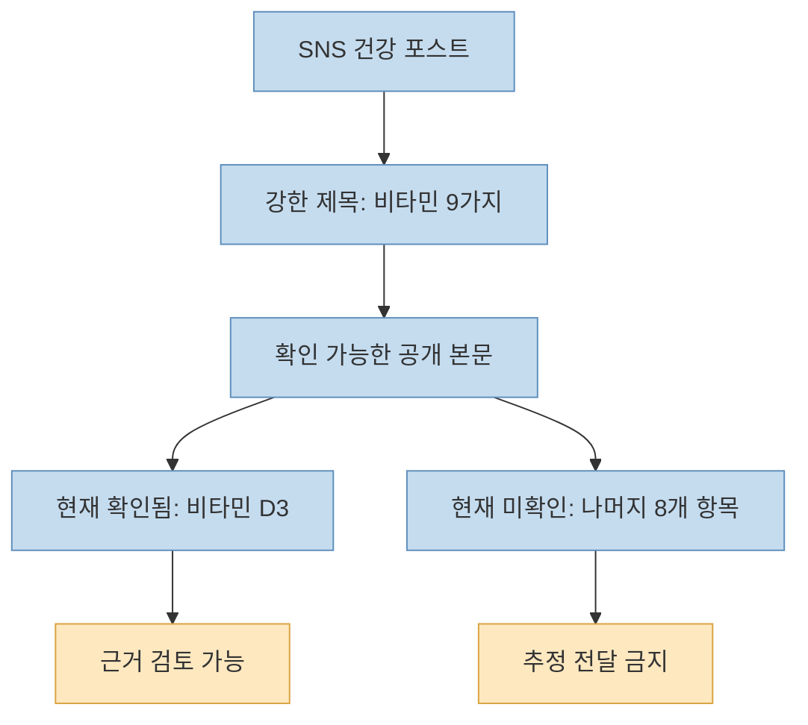
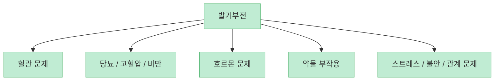
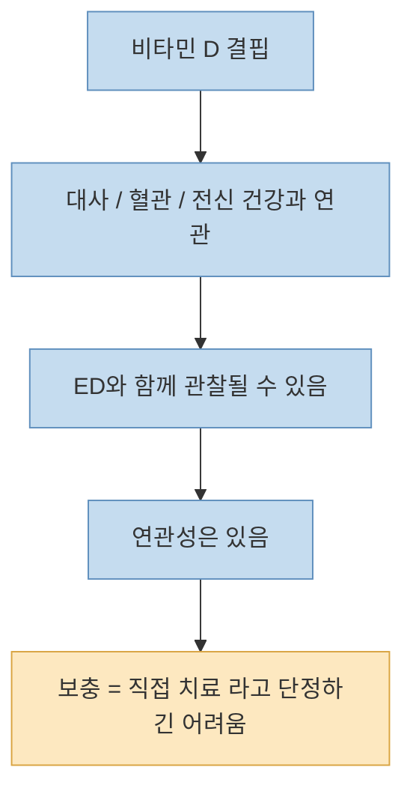
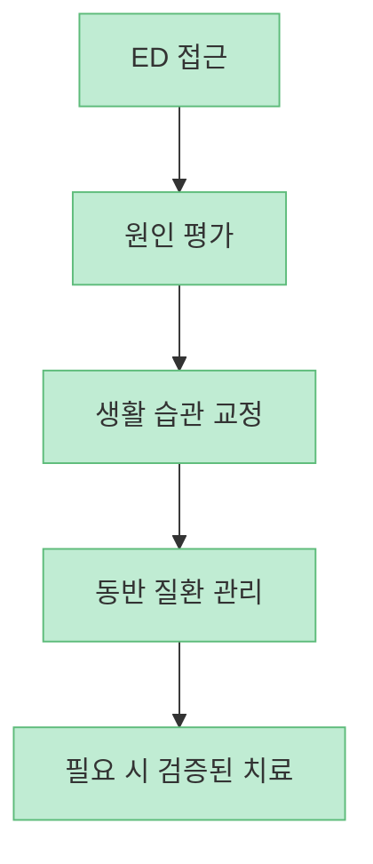
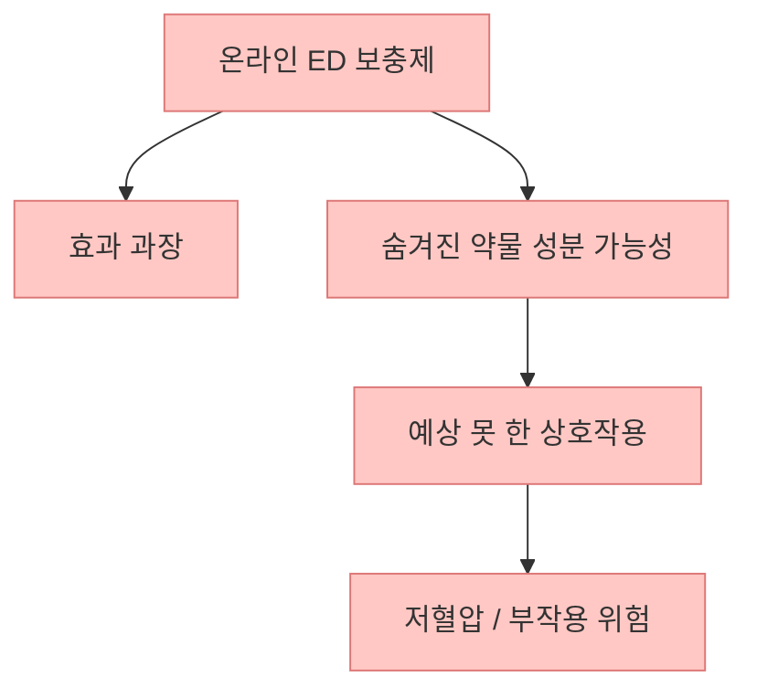
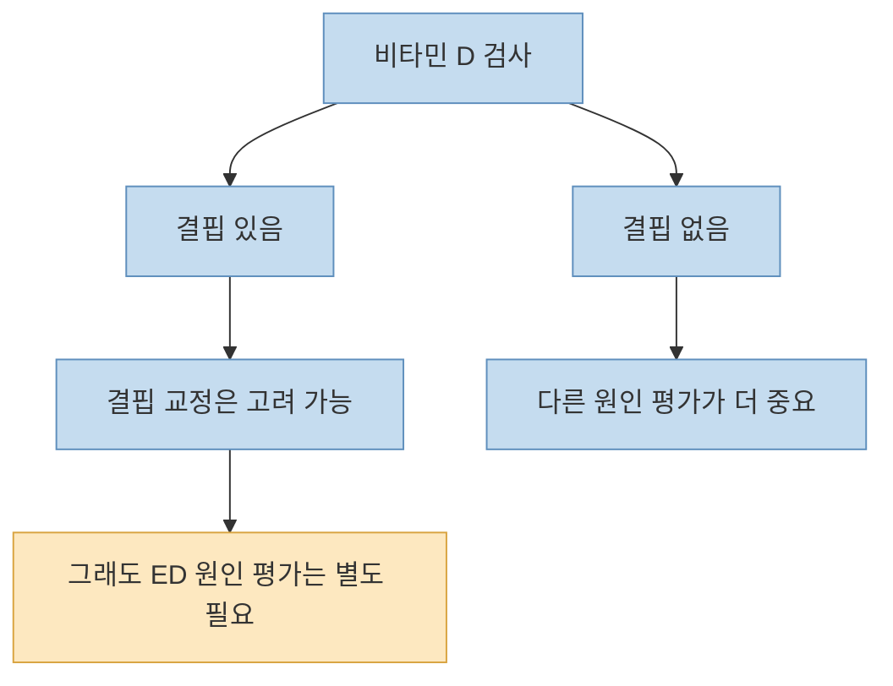

이 X 포스트는 "발기부전에 좋은 비타민 9가지"를 소개하면서 첫 항목으로 **비타민 D3** 를 제시합니다. 하지만 공개적으로 확인되는 본문은 제목과 `1. Vitamin D3` 정도까지이며, 나머지 8개 항목은 현재 확보한 공개 데이터만으로는 검증할 수 없었습니다. 그래서 이 글은 **확인된 원문을 그대로 과장해서 재전달하지 않고**, 실제 근거가 비교적 있는 부분과 과장이 쉬운 부분을 분리해 설명합니다.

<!--more-->

## Sources

- [X 원문](https://x.com/i/status/2061555300285689924)
- [Erectile Dysfunction (ED) - NIDDK](https://www.niddk.nih.gov/health-information/urologic-diseases/erectile-dysfunction)
- [Treatment for Erectile Dysfunction - NIDDK](https://www.niddk.nih.gov/health-information/urologic-diseases/erectile-dysfunction/treatment)
- [Erectile Dysfunction/Sexual Enhancement - NCCIH](https://www.nccih.nih.gov/health/erectile-dysfunctionsexual-enhancement)
- [4 Things To Know About Dietary Supplements Marketed for Sexual Enhancement - NCCIH](https://www.nccih.nih.gov/health/tips/4-things-to-know-about-dietary-supplements-marketed-for-sexual-enhancement)
- [Sexual Enhancement and Energy Product Notifications - FDA](https://www.fda.gov/drugs/medication-health-fraud/tainted-sexual-enhancement-products)
- [Is There an Association Between Vitamin D Deficiency and Erectile Dysfunction? A Systematic Review and Meta-Analysis - MDPI](https://www.mdpi.com/2072-6643/12/5/1411)

## 1. 이 포스트에서 확인되는 것은 "비타민 D3"까지다

공개 임베드와 API로 확인되는 원문은 아랍어로 작성된 "발기부전에 권장되는 9가지 비타민"이라는 제목과 `1. Vitamin D3` 입니다. 나머지 항목 전체 텍스트는 현재 접근 가능한 공개 데이터만으로 확인되지 않았습니다. 따라서 "어떤 9가지가 있다"는 형식을 그대로 받아 적는 것은 정확하지 않습니다.

이 점이 중요한 이유는 단순합니다. SNS 건강 글은 종종 **목록형 구조 자체가 신뢰를 만들어 주는 효과** 를 갖기 때문입니다. 하지만 목록의 길이가 길다고 해서 근거 수준이 높아지는 것은 아닙니다. 확인 가능한 정보가 일부뿐이라면, 그 일부만 가지고 다시 검토해야 합니다.

그래서 이 글의 핵심 질문은 "비타민이 몇 개인가"가 아니라, **발기부전에서 비타민 D3가 실제로 어떤 위치에 있는가** 입니다.

## 2. 발기부전은 영양제 문제라기보다 원인 평가 문제에 가깝다

NIDDK는 발기부전(ED)을 단순히 나이가 들면 생기는 일상 현상으로 보지 않습니다. 발기부전은 혈관, 신경, 호르몬, 심리 상태, 약물, 당뇨, 고혈압, 비만 같은 여러 문제와 연결될 수 있고, 그래서 진단도 병력, 신체 진찰, 검사까지 포함해 접근해야 한다고 설명합니다. 즉 ED는 증상이지, 언제나 하나의 원인만 가진 독립 질환은 아닙니다.

이 말은 곧 **비타민 하나로 해결될 수 없는 경우가 많다** 는 뜻이기도 합니다. 원인이 혈관 질환 쪽이면 혈류 문제를 봐야 하고, 당뇨 조절이 안 되면 그쪽을 먼저 잡아야 하며, 심리적 불안이나 약물 부작용이 핵심이면 접근 자체가 달라집니다.

그래서 "이 비타민만 먹으면 된다"는 구조는 대부분 실제 진료의 순서를 거꾸로 뒤집습니다. 올바른 순서는 **원인 평가 → 생활 습관 및 동반 질환 관리 → 필요 시 검증된 치료** 입니다.

## 3. 비타민 D3는 "관련성"은 있지만, "만능 치료제" 근거는 약하다

비타민 D3가 완전히 근거 없는 이름은 아닙니다. 관찰 연구와 메타분석에서는 비타민 D 결핍이 있는 사람들에서 ED 지표가 더 나쁜 경향이 관찰되기도 했습니다. 다만 여기서 조심해야 할 점이 있습니다. 그 연구들 상당수는 당뇨, 신장질환, 호르몬 문제, 심혈관 위험 같은 **ED 자체를 악화시키는 동반 질환** 과 뒤섞여 있습니다.

MDPI의 체계적 문헌고찰·메타분석도 비슷한 결론을 냅니다. 비타민 D 수치와 ED 사이의 연관은 일부 보이지만, 연구들의 이질성이 크고, 결핍이 심한 집단에서만 더 나쁜 결과가 관찰되는 경향이 있으며, 보충 자체가 ED를 직접 고친다고 단정할 수준은 아니라고 볼 수 있습니다.

즉 더 정확한 표현은 이렇습니다.

- **비타민 D 결핍은 ED와 함께 나타날 수 있다**
- 하지만 **비타민 D 보충이 ED를 독립적으로 치료한다는 강한 근거는 아직 부족하다**
- 따라서 D3는 **결핍 교정** 에는 의미가 있을 수 있지만, **모든 ED 환자의 핵심 치료** 로 일반화하면 과장입니다

결국 D3는 "절대 무의미"도 아니고 "먹으면 해결"도 아닙니다. **결핍이 확인된 사람에게는 의미가 있을 수 있지만, ED 전체를 대체 설명하는 카드로 쓰기엔 부족하다** 가 더 정확합니다.

## 4. 공식 가이드는 비타민 리스트보다 생활 습관과 검증된 치료를 먼저 둔다

NIDDK의 치료 설명을 보면 우선순위가 분명합니다. 금연, 운동, 체중 관리, 식사 개선, 음주 조절, 스트레스 관리 같은 생활 습관 조정이 먼저 나오고, 이후에 필요하면 PDE5 억제제 같은 처방약, 주사제, 기구, 수술 같은 검증된 치료 옵션으로 넘어갑니다.

이 순서가 중요한 이유는 ED가 매우 자주 **혈관 건강의 문제** 와 맞닿아 있기 때문입니다. 몸 전체 혈류 상태가 좋지 않으면 음경 혈류도 영향을 받기 쉽고, 그래서 발기 문제는 때로 심혈관 건강의 신호가 되기도 합니다.

따라서 SNS에서 흔히 보이는 "비타민 A, B, C, D…" 식 목록은 실제 진료의 핵심을 옮겨놓은 것이 아니라, **주변부 요소를 중심부처럼 보이게 만든 요약** 일 가능성이 큽니다.

## 5. ED 보충제 시장은 효과보다 안전성 문제가 더 클 때가 많다

NCCIH와 FDA는 ED나 성기능 향상을 표방하는 보충제 시장에 대해 매우 조심하라고 경고합니다. 이유는 두 가지입니다.

첫째, **효과 근거가 약한 경우가 많다** 는 점입니다.  
둘째, 더 중요하게는 **숨겨진 의약품 성분이 들어간 불법·불량 제품이 적지 않다** 는 점입니다.

FDA는 성기능 향상 제품들 중 상당수에서 표시되지 않은 약물 성분이 발견될 수 있다고 경고해 왔고, NCCIH도 ED용 보충제를 처방약 대체재처럼 가볍게 구매하지 말라고 안내합니다. 특히 질산염 계열 약을 복용 중이거나 심혈관 질환이 있는 사람은 이런 숨겨진 성분이 더 위험할 수 있습니다.

이 부분은 매우 실용적인 포인트입니다. ED가 걱정될수록 사람은 조용히 해결하고 싶어지고, 그 심리가 익명 보충제 구매로 이어지기 쉽습니다. 하지만 이 영역은 오히려 **처방약보다 더 불투명한 제품들** 이 섞여 있을 수 있습니다.

## 6. 그래서 실제로는 "결핍 교정"과 "질환 평가"를 분리해야 한다

비타민 D를 포함한 영양소 접근에서 가장 중요한 원칙은 이것입니다. **영양 결핍 교정과 ED 치료를 같은 개념으로 합치지 말아야 한다** 는 점입니다.

예를 들어 혈액검사에서 비타민 D 결핍이 확인됐다면, 그 결핍을 교정하는 것은 전신 건강 차원에서 충분히 의미가 있을 수 있습니다. 하지만 그것이 자동으로 "ED 치료가 끝났다"를 의미하지는 않습니다. 반대로 비타민 D가 정상인데도 ED가 지속된다면, 그 원인은 혈관, 신경, 약물, 내분비, 심리적 요인 등 다른 곳에 있을 가능성이 더 큽니다.

즉 비타민은 어디까지나 **결핍이 있을 때 보조적으로 다뤄야 하는 축** 이지, 원인 평가를 건너뛰게 만드는 지름길이 아닙니다.

## 핵심 요약

- X 원문에서 공개적으로 확인되는 내용은 "발기부전에 좋은 비타민 9가지"라는 제목과 `1. 비타민 D3` 까지입니다.
- 발기부전은 비타민 부족 하나로 설명되기보다 **혈관, 대사, 호르몬, 약물, 심리 요인** 이 함께 얽히는 증상입니다.
- 비타민 D 결핍과 ED 사이에 **연관성** 을 시사하는 연구는 있지만, **비타민 D 보충이 ED를 직접 치료한다는 강한 근거는 아직 부족** 합니다.
- 공식 자료는 비타민 목록보다 **원인 평가, 생활 습관 교정, 동반 질환 관리, 검증된 치료** 를 우선합니다.
- ED 보충제 시장은 효과 문제뿐 아니라 **숨겨진 약물 성분과 안전성 문제** 도 큽니다.

## 결론

이 포스트를 가장 현실적으로 해석하면 이렇습니다. **비타민 D3는 "확인할 만한 요소"일 수는 있어도, 발기부전을 설명하는 중심축은 아니다** 는 것입니다. ED가 반복된다면 핵심은 비타민 9가지를 찾는 일이 아니라, **혈압·혈당·체중·복용약·수면·스트레스·호르몬·혈관 상태를 함께 보는 것** 입니다. 목록형 건강 정보는 간단하지만, 실제 해결은 거의 항상 그보다 더 구조적입니다.
