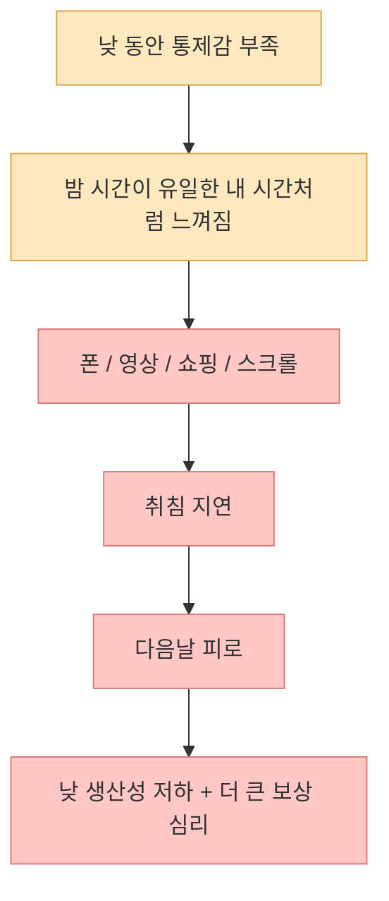
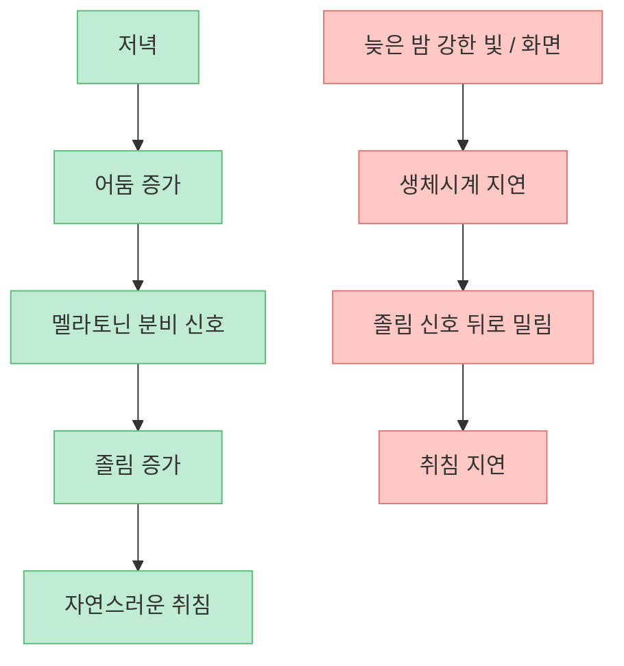
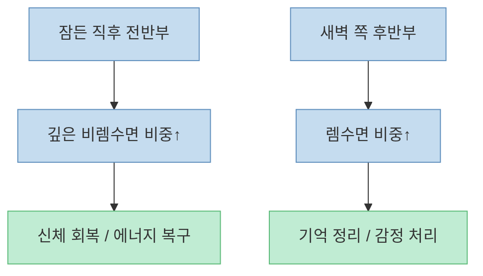
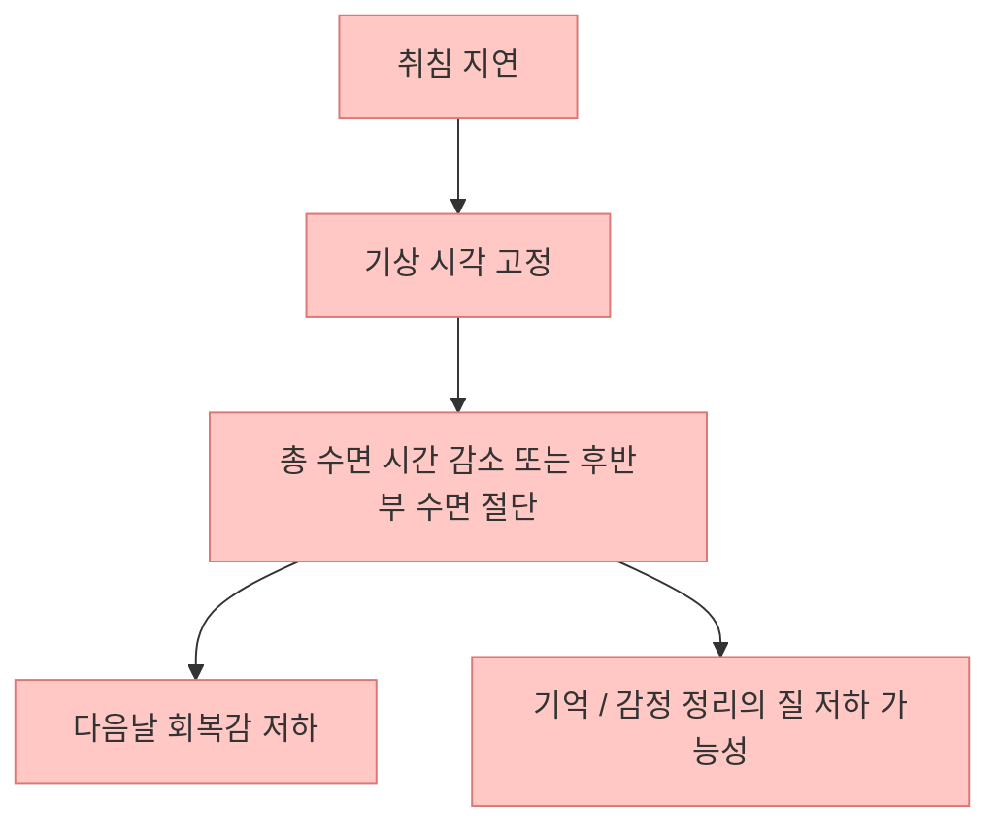
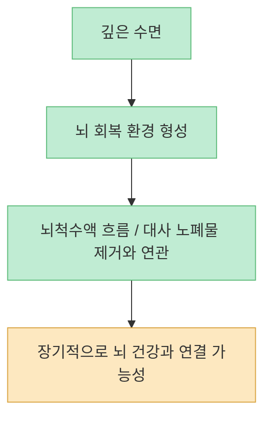
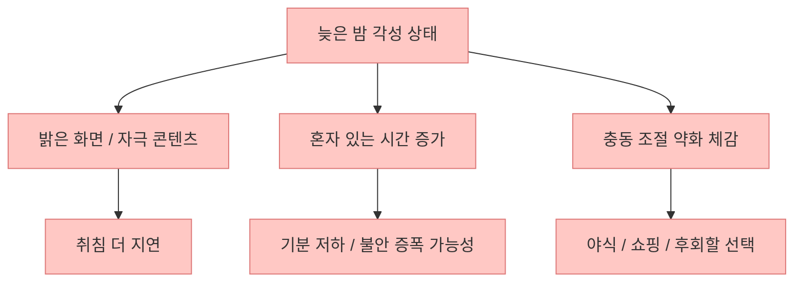
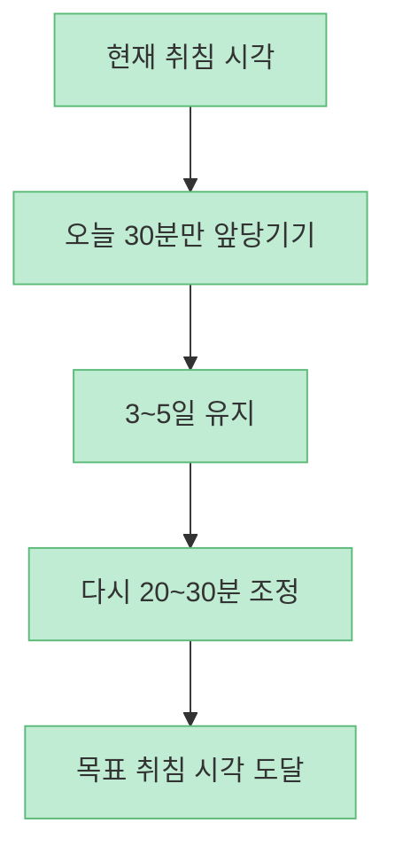
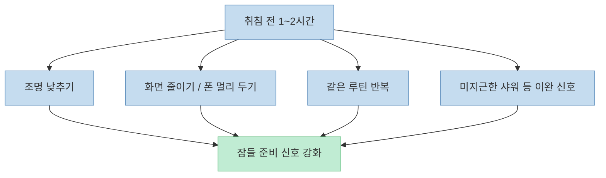

이 영상의 핵심 메시지는 분명합니다. **건강은 몇 시간 잤느냐만으로 결정되지 않고, 몇 시에 잠들었는가에도 크게 영향을 받는다** 는 것입니다. 특히 새벽 1시 이후 취침을 하나의 "경계선"처럼 설명하지만, 실제로 더 정확한 표현은 **늦은 취침이 반복될수록 생체시계와 회복 구조가 더 쉽게 어긋난다** 에 가깝습니다. 영상의 문제의식은 타당하지만, 숫자와 기전을 그대로 절대화하기보다는 연구가 어디까지 말해 주는지 함께 보는 편이 좋습니다.

<!--more-->

## Sources

- [이 시간만 넘겨서 자지 마세요. 1시간의 차이가 건강을 가르는 이유.](https://youtu.be/TfdCVbHjtPI)
- [Accelerometer-derived sleep onset timing and cardiovascular disease incidence: a UK Biobank cohort study - PMC](https://pmc.ncbi.nlm.nih.gov/articles/PMC9708010/)
- [How Sleep Works - Your Sleep/Wake Cycle | NHLBI, NIH](https://www.nhlbi.nih.gov/health/sleep/sleep-wake-cycle)
- [Circadian Rhythm Disorders - Treatment | NHLBI, NIH](https://www.nhlbi.nih.gov/health/circadian-rhythm-disorders/treatment)
- [Sleep, Cerebrospinal Fluid, and the Glymphatic System: A Systematic Review - PMC](https://pmc.ncbi.nlm.nih.gov/articles/PMC8821419/)
- [The glymphatic system: Current understanding and modeling - PMC](https://pmc.ncbi.nlm.nih.gov/articles/PMC9460186/)
- [Using Mendelian Randomisation methods to understand whether diurnal preference is causally related to mental health | Molecular Psychiatry](https://www.nature.com/articles/s41380-021-01157-3)
- [Day and night light exposure are associated with psychiatric disorders: an objective light study in >85,000 people | Nature Mental Health](https://www.nature.com/articles/s44220-023-00135-8)

## 1. 왜 사람은 알면서도 늦게 잘까: 의지 부족보다 보상 심리에 가깝다

영상 초반은 많은 사람이 "일찍 자야 좋은 걸 알면서도" 밤에 휴대폰을 놓지 못하는 이유를 `복수 수면` 혹은 보상 심리로 설명합니다. [영상 0:35~1:08](https://youtu.be/TfdCVbHjtPI?t=35) 이 표현은 꽤 현실적입니다. 낮 동안 통제권이 부족했다고 느낄수록 밤 시간을 개인 시간처럼 붙잡고 싶어지는 패턴은 실제로 아주 흔합니다.

중요한 점은 이 문제가 단순히 게으름의 문제가 아니라는 것입니다. 몸은 피곤한데도 뇌는 "이제야 내 시간이 시작됐다"는 신호를 보내기 때문에, 피로와 각성이 동시에 존재하는 이상한 밤이 만들어집니다. 그래서 늦게 자는 습관을 바꾸려면 의지를 비난하는 방식보다 **밤의 자유 시간을 어디서 확보하고 있는지** 먼저 봐야 합니다.

그래서 취침 시간을 당기는 첫 단계는 "왜 또 늦게 잤지?"가 아니라, **밤에만 몰려 있는 보상 욕구를 어떻게 줄일지** 를 묻는 것입니다.

## 2. 새벽 1시는 절대선이라기보다, 늦은 취침이 위험해지기 쉬운 구간이다

영상은 새벽 1시를 건강이 갈리는 선처럼 설명합니다. [영상 1:19~1:33](https://youtu.be/TfdCVbHjtPI?t=79) 다만 연구는 보통 그렇게 칼같이 "1시 이후는 위험, 12시 59분은 안전"이라고 말하지는 않습니다. 실제로 널리 인용되는 UK Biobank 기반 연구는 약 10만 명 규모에서 **오후 10시~11시 사이 취침이 가장 낮은 심혈관 위험과 연결** 되었고, 자정 이후 취침에서는 위험이 더 높게 관찰됐다고 보고했습니다. 이 연구는 연관성을 보여 주는 관찰 연구이지, 특정 시각이 모든 사람에게 절대 기준이라는 뜻은 아닙니다. 그래도 메시지는 분명합니다. **취침이 뒤로 밀릴수록 생체 리듬과 건강 지표가 어긋날 가능성이 커진다** 는 것입니다.

NIH도 수면-각성 주기가 빛과 어둠, 멜라토닌, 생체시계에 의해 조절된다고 설명합니다. 밤이 깊어질수록 몸은 원래 잠드는 방향으로 맞춰져 있는데, 늦은 시간의 밝은 빛과 각성 활동은 그 신호를 더 뒤로 밉니다. [NHLBI sleep-wake cycle](https://www.nhlbi.nih.gov/health/sleep/sleep-wake-cycle)

즉 영상이 말하는 "1시 경계선"은 엄밀한 생물학적 절단선이라기보다, **늦은 취침과 생체시계 지연이 누적되기 쉬운 생활상의 위험 구간** 으로 이해하는 편이 더 정확합니다.

## 3. 수면은 양만의 문제가 아니라 순서의 문제다

영상 중반의 중요한 포인트는 잠이 하나의 덩어리가 아니라는 설명입니다. [영상 6:26~7:48](https://youtu.be/TfdCVbHjtPI?t=386) 이건 매우 중요합니다. 일반적으로 수면 전반부에는 깊은 비렘수면이 더 많이 몰리고, 후반부에는 렘수면 비중이 커집니다. 그래서 같은 7시간을 자더라도 **언제 잠들고 언제 깨느냐에 따라 체감 회복과 기억 정리 경험이 달라질 수 있습니다.**

물론 "늦게 자면 깊은 잠이 전부 사라진다"처럼 단순화하면 과장입니다. 하지만 늦게 자고도 기상 시각은 사회 일정 때문에 그대로일 때, 수면의 뒤쪽 구간이 잘리기 쉽고 전체 회복 구조가 훼손될 가능성은 충분히 있습니다.

그래서 "늦게 자도 8시간만 채우면 되지"는 현실에서 자주 깨집니다. 실제 생활에서는 출근, 등교, 육아 같은 고정 기상 시각이 있기 때문에 **늦은 취침이 곧 질 낮은 회복** 으로 이어지기 쉽습니다.

## 4. 뇌 청소 비유는 꽤 유용하지만, 아직 인간 연구는 조심해서 봐야 한다

영상은 수면 중 `글림프 시스템`이 뇌의 노폐물을 치우는 것처럼 설명합니다. [영상 2:20~4:18](https://youtu.be/TfdCVbHjtPI?t=140) 이 비유는 대중 설명으로는 좋지만, 약간의 보정이 필요합니다. 현재 연구는 **수면이 뇌척수액 흐름과 대사 노폐물 제거에 중요한 역할을 할 가능성** 을 강하게 시사합니다. 다만 인간에서 이 시스템을 얼마나 직접적이고 정밀하게 측정할 수 있는지는 아직 발전 중입니다.

즉 "늦게 자면 매일 뇌 청소를 반쯤 건너뛴다"는 표현은 직관적이지만 다소 강한 비유입니다. 더 정확하게는 **수면 부족과 수면-각성 리듬 교란이 뇌의 회복과 노폐물 처리에 불리할 수 있다** 는 정도가 현재 근거에 더 가깝습니다.

이 지점에서 중요한 건 공포 마케팅이 아니라 방향성입니다. 수면을 줄여도 멀쩡해 보이는 날은 있을 수 있지만, **몸은 그 시간에 실제로 회복 작업을 하고 있다** 는 사실 자체는 가볍게 보기 어렵습니다.

## 5. 늦게 자는 습관은 기분과 판단에도 영향을 줄 수 있다

영상은 새벽 시간대가 충동 조절과 정신건강에 불리할 수 있다고 설명합니다. [영상 4:20~6:06](https://youtu.be/TfdCVbHjtPI?t=260) 이 부분은 과장 없이 다시 표현하면, **늦은 chronotype 또는 야간 빛 노출, 불규칙한 수면 타이밍이 우울·불안 같은 정신건강 문제와 관련될 수 있다는 근거가 점점 쌓이고 있다** 정도입니다.

예를 들어 Mendelian randomization 연구는 저녁형 성향과 정신건강 문제 사이의 연관을 탐색했고, Nature Mental Health 연구는 밤 빛 노출이 많은 사람들에서 여러 정신과적 지표가 더 나빴다고 보고했습니다. 물론 이것도 인과를 단정하는 것은 아닙니다. 다만 실제 생활에서는 늦은 밤의 각성, 고립감, 밝은 화면, 정서적 취약성이 한데 묶여 움직이기 때문에 **늦은 취침은 생체시계 문제이면서 동시에 감정 위생의 문제** 이기도 합니다.

따라서 수면 개선은 단순히 피로 회복 프로젝트가 아니라, **판단력과 감정 안정성을 지키는 일상 설계** 로 보는 편이 맞습니다.

## 6. 되돌릴 때는 두 시간을 한 번에 당기지 말고, 30분씩 움직여야 한다

영상 후반에서 가장 실용적인 제안은 "오늘 밤부터 30분만 앞당기기"입니다. [영상 9:40~10:58](https://youtu.be/TfdCVbHjtPI?t=580) 이 조언은 상당히 좋습니다. NHLBI도 지연된 수면-각성 주기 문제에서는 빛 노출 관리, 루틴, 경우에 따라 멜라토닌이나 광치료처럼 **생체시계를 조금씩 재동기화하는 방식** 을 설명합니다.

현실적인 원칙은 세 가지입니다.

- 밤의 빛을 줄여서 멜라토닌 신호를 방해하지 않기  
- 잠들기 전 루틴을 반복해서 몸에 예고 신호 주기  
- 갑작스러운 대수술보다 작은 시간 이동을 며칠씩 유지하기  

만약 이렇게 해도 몇 달째 새벽 3~4시에나 잠이 들고 일상 기능이 무너진다면, 그때는 단순 습관 문제가 아니라 **지연된 수면-각성 위상 문제나 불면 문제** 일 수 있으니 전문 진료를 고려하는 편이 좋습니다.

## 핵심 요약

- 늦게 자는 습관은 의지 부족보다 **밤에 보상 시간을 확보하려는 심리** 와 더 자주 연결됩니다.
- 새벽 1시는 절대적인 생물학적 절단선이라기보다, **늦은 취침이 건강 지표와 더 자주 엮이는 생활상의 경계 구간** 으로 보는 편이 정확합니다.
- 수면은 총량만이 아니라 **전반부 깊은 잠과 후반부 렘수면의 순서** 가 중요합니다.
- 글림프 시스템 비유는 유용하지만, 인간 연구에서는 아직 **조심스럽게 해석해야 하는 기전** 입니다.
- 늦은 취침, 야간 빛 노출, 불규칙한 수면은 정신건강과도 관련될 수 있습니다.
- 수면 시간을 되돌릴 때는 한 번에 두세 시간을 바꾸기보다 **30분 단위의 점진적 조정** 이 현실적입니다.

## 결론

이 영상이 던지는 진짜 메시지는 "새벽 1시가 무조건 위험하다"가 아닙니다. 더 중요한 건 **취침이 반복적으로 뒤로 밀릴수록 몸의 회복 시간표 전체가 흐트러질 수 있다** 는 점입니다. 결국 수면 건강은 오래 누워 있는 기술보다, **빛을 줄이고, 루틴을 고정하고, 취침 시각을 조금씩 앞당기는 생활 설계** 에서 갈립니다.
