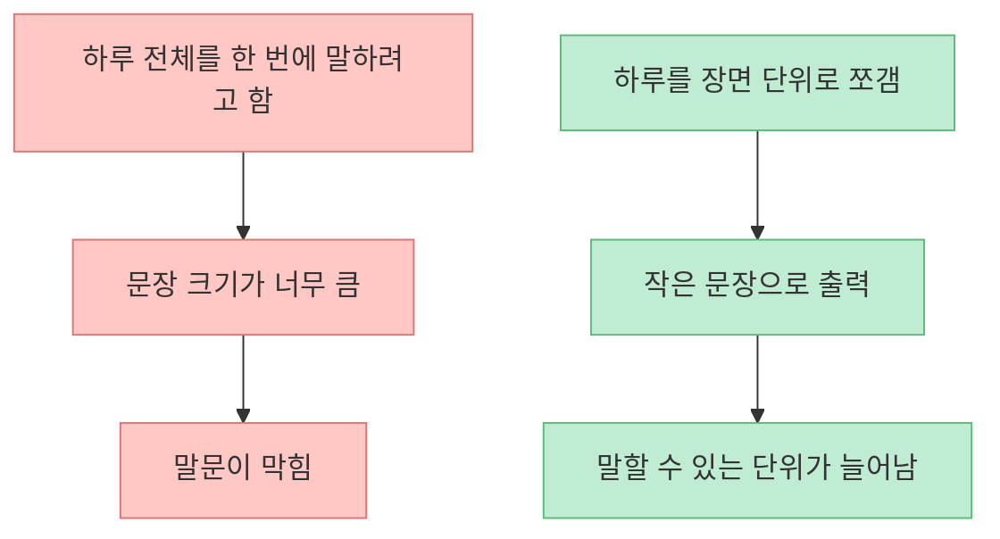
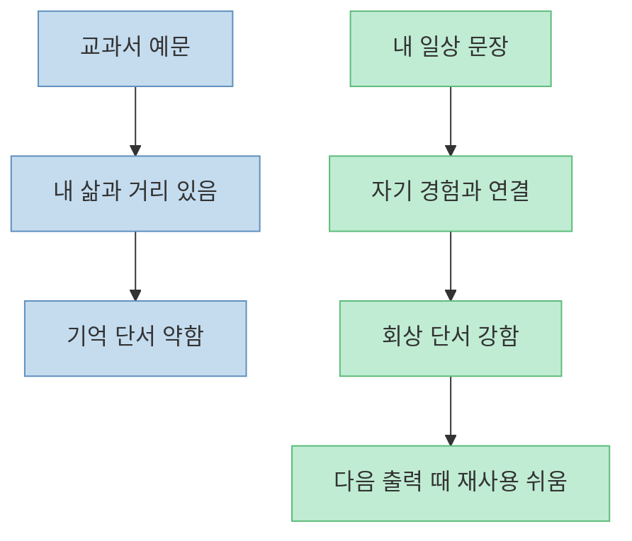
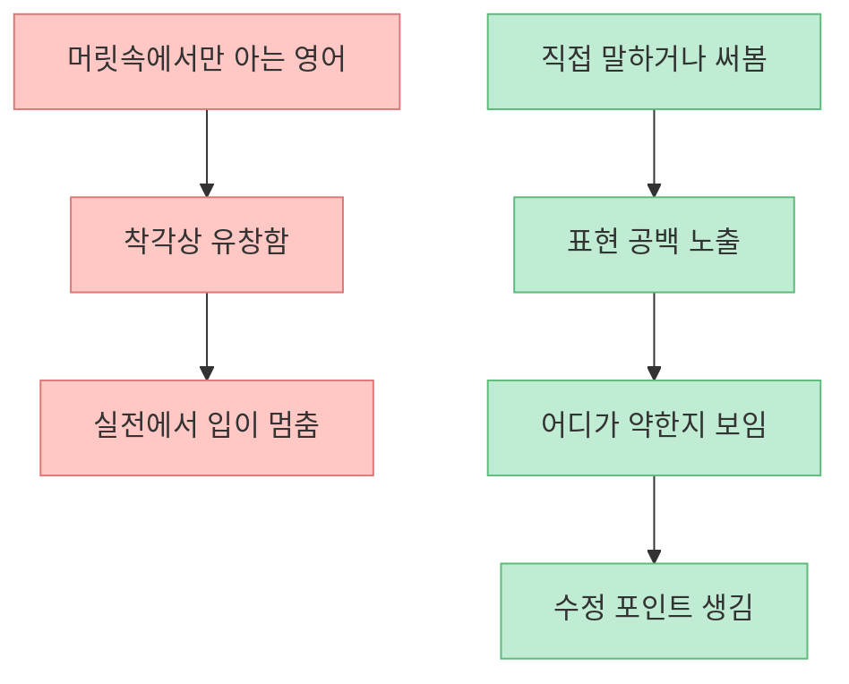
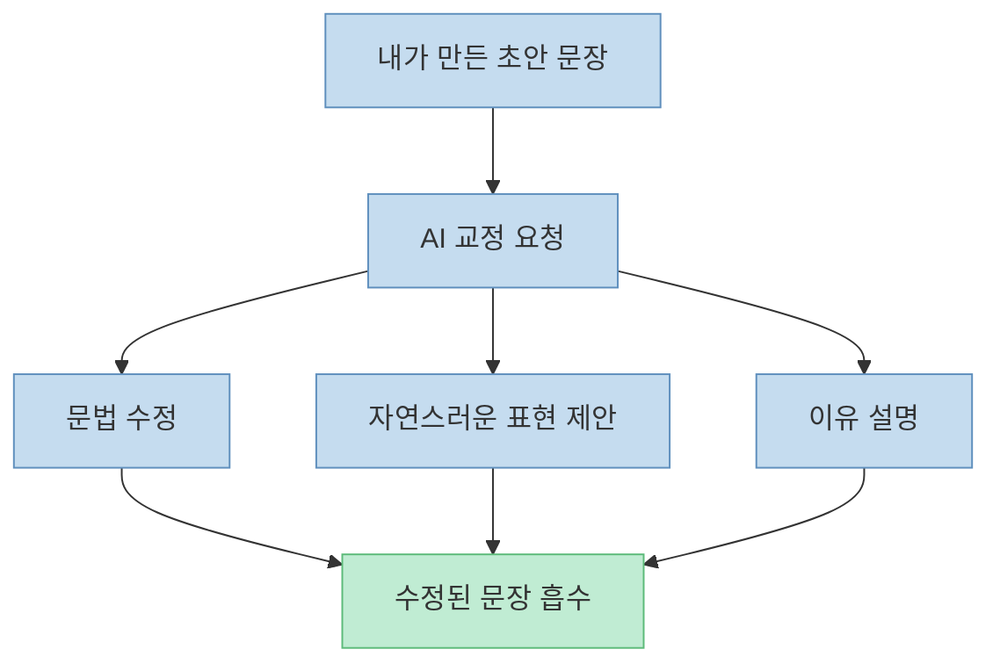
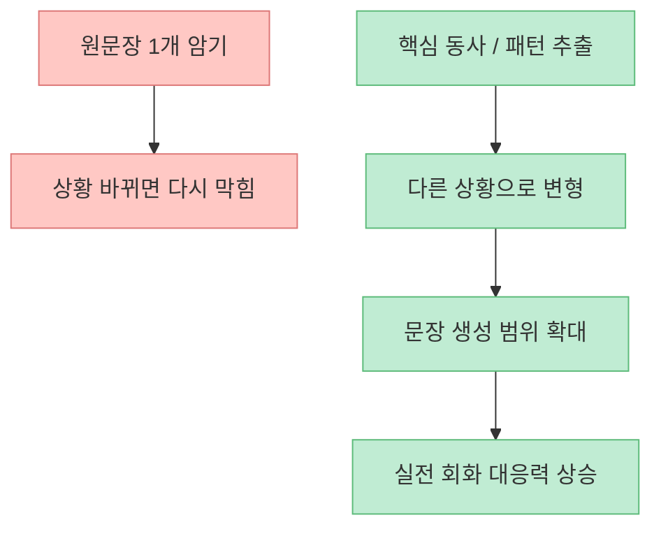
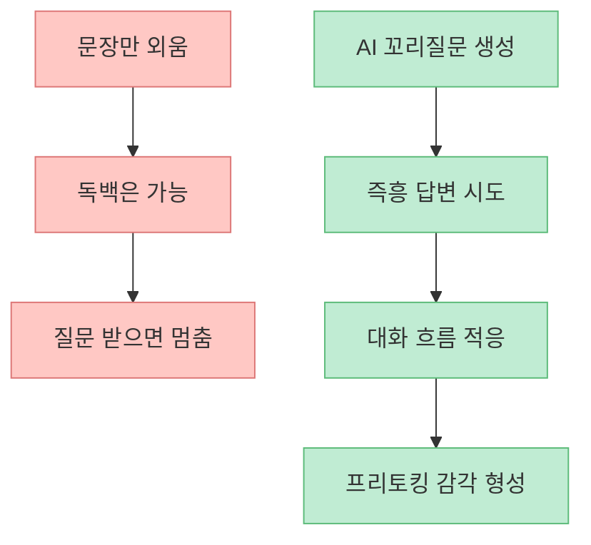
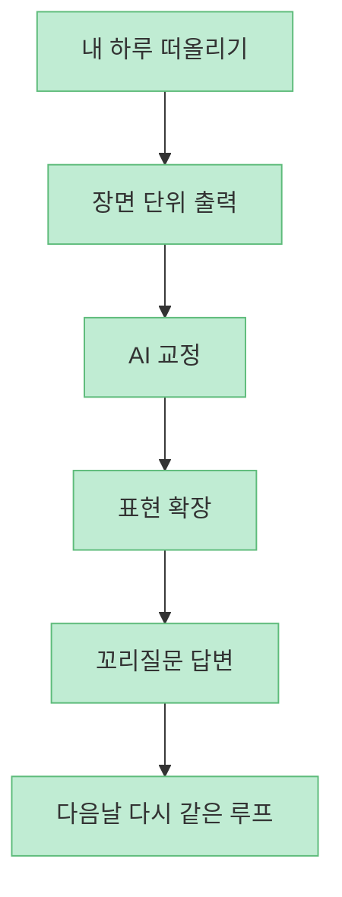
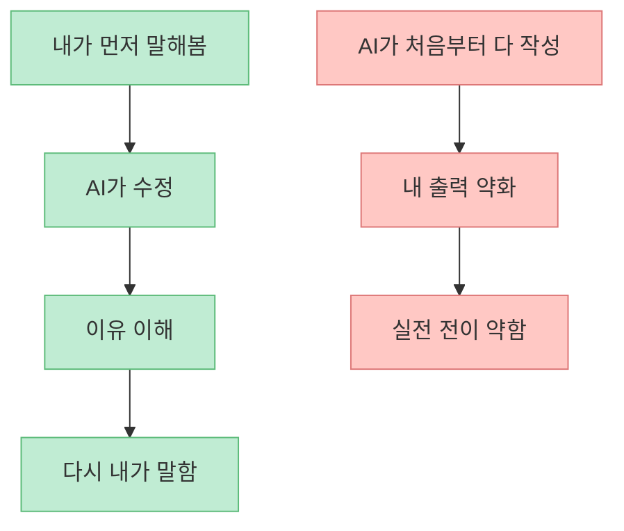

이 영상의 핵심은 단순합니다. 영어회화가 오래 안 느는 이유를 "어려운 표현을 아직 몰라서"로 보지 않고, **내 일상을 영어로 꺼내는 출력 루프가 없기 때문** 이라고 봅니다. 그래서 해결책도 화려한 문장 암기가 아니라, 하루를 장면 단위로 쪼개서 말해 보고, 그 결과를 AI에게 교정·확장·대화 연습까지 연결하는 방식으로 제시합니다.

<!--more-->

## Sources

- [10년 해도 안 되던 영어회화, 무료 AI로 갑자기 입 트인 영업비밀](https://youtu.be/ElMo6-KnzEs)
- [Problems in Output and the Cognitive Processes They Generate: A Step Towards Second Language Learning - Applied Linguistics](https://academic.oup.com/applij/article/16/3/371/184113)
- [The type and linguistic foci of oral corrective feedback in the L2 classroom: A meta-analysis - SAGE](https://journals.sagepub.com/doi/10.1177/1362168814563200)
- [Self-referential encoding of source information in recollection memory - PMC](https://pmc.ncbi.nlm.nih.gov/articles/PMC8049320/)

## 1. 이 방법의 출발점은 "영어를 배운다"가 아니라 "내 하루를 말한다"는 것이다

영상은 `장면 일기`라는 이름을 붙입니다. 하루를 영화 장면처럼 잘게 쪼개서, 내가 한 행동을 아주 쉬운 영어로 말하는 방식입니다. [영상 1:41~2:20](https://youtu.be/ElMo6-KnzEs?t=101) 예를 들면:

- 일어났다  
- 계란 세 개를 먹었다  
- 자전거를 타고 헬스장에 갔다  
- 돌아와서 샤워했다  

이걸 복잡한 문장으로 만들지 않고, `I woke up. I ate three eggs. I rode a bicycle and went to the gym. I took a shower.` 같은 식으로 출력하는 겁니다.

이 접근이 중요한 이유는 영어회화의 병목이 종종 "지식 부족"보다 **출력 단위가 너무 크다** 는 데 있기 때문입니다. 사람들은 실제로는 `BBC 인터뷰 수준 문장` 을 못 해서 말문이 막히는 것이 아니라, **아주 평범한 자기 일상도 영어로 조립해 본 경험이 적어서** 입이 멈추는 경우가 많습니다.

즉 이 방법은 회화를 `어려운 문장 생산` 이 아니라, **잘게 쪼갠 자기 경험의 재구성** 으로 바꿉니다.

## 2. 왜 "내 일상"이 효과적인가: 자기참조형 정보는 기억에 더 잘 남기 쉽다

영상은 특별한 주제가 아니라 "내가 오늘 한 일"을 말하라고 권합니다. [영상 2:20~3:53](https://youtu.be/ElMo6-KnzEs?t=140) 이건 단순히 편해서가 아니라, 기억과 학습 측면에서도 합리적입니다.

인지심리학에서는 자기 자신과 연결된 정보가 더 잘 기억되는 `self-referential encoding` 경향이 반복적으로 관찰됩니다. 즉 남의 문장을 외우는 것보다 **내 실제 경험과 연결된 문장** 이 더 강하게 남을 가능성이 큽니다.

그래서 `I woke up late because I slept after watching Netflix` 같은 문장은 교과서 예문보다 학습자에게 훨씬 강한 기억 단서를 만듭니다. 문법이 더 쉬워서가 아니라, **나와 연결된 장면이기 때문** 입니다.

결국 장면일기의 장점은 쉽다는 데만 있지 않습니다. **내 삶을 영어의 재료로 쓰기 때문에 기억과 재사용이 동시에 쉬워진다** 는 점이 더 중요합니다.

## 3. 1단계는 "맞는 영어"보다 "일단 꺼내는 영어"를 만드는 것이다

영상의 첫 실전 단계는 아주 단순합니다. 장면 단위로 내가 한 일을 쉬운 문장으로 먼저 적습니다. [영상 3:13~4:39](https://youtu.be/ElMo6-KnzEs?t=193) 여기서 핵심은 완벽한 문장을 만드는 게 아닙니다.

오히려 중요한 것은:

- 쉬운 단어를 쓴다  
- 번역투여도 일단 쓴다  
- 틀릴까 봐 멈추지 않는다  

이 단계는 언어학적으로 보면 `output` 단계입니다. Merrill Swain의 논의처럼, 언어를 실제로 꺼내 보아야 비로소 "어디가 막히는지"가 보입니다. 읽기나 듣기만 할 때는 몰랐던 공백이, 내가 직접 말하거나 써보는 순간 드러납니다.

그래서 이 루틴의 첫 단계는 `잘 쓰기`가 아니라 `꺼내기`입니다. 영어회화가 막히는 사람일수록, 이 순서를 자주 거꾸로 놓습니다.

## 4. 2단계는 AI 교정이다: 출력 뒤에 즉시 피드백이 붙어야 학습이 빨라진다

영상의 두 번째 핵심은 AI에게 문장을 던져서 `문법적으로 교정하고 더 자연스럽게 바꿔 달라`고 요청하는 부분입니다. [영상 5:12~7:18](https://youtu.be/ElMo6-KnzEs?t=312) 이 과정에서 AI는 단순 오답 수정만 하는 게 아니라:

- 더 자연스러운 어휘를 제안하고  
- 문장 연결을 더 영어답게 바꾸고  
- 왜 그렇게 바꾸는지도 설명합니다  

이건 단순한 편의 기능 이상입니다. 제2언어습득 연구에서 `corrective feedback`은 학습자가 자기 표현의 한계를 인식하고 수정하는 데 중요한 역할을 합니다. 즉 출력만으로는 부족하고, **출력 뒤에 바로 피드백이 붙을 때** 학습 효율이 올라갑니다.

중요한 포인트는 AI를 `정답 제조기`로 쓰는 게 아니라, **내가 만든 출력물을 바로 수정해 주는 개인 튜터** 처럼 쓰는 것입니다.

## 5. 3단계는 확장 훈련이다: 한 문장을 다른 상황으로 늘려야 입이 풀린다

영상에서 특히 실용적인 부분은, 교정된 문장을 바탕으로 핵심 동사나 표현을 뽑아 다른 예문으로 확장하는 단계입니다. [영상 8:18~10:05](https://youtu.be/ElMo6-KnzEs?t=498) 예를 들어 `wake up`, `change`, `go`, `take a shower` 같은 표현을 유지한 채 빈칸 문제나 변형 문장을 만드는 방식입니다.

이 단계가 필요한 이유는, 하나의 문장을 외워도 그것이 **다른 상황으로 전이되지 않으면 회화력이 잘 늘지 않기 때문** 입니다. `I woke up and ate three eggs`를 외웠다고 해서, `I woke up late`, `I woke up feeling tired`, `After waking up, I...`가 자동으로 나오지는 않습니다.

그래서 이 단계는 단순 복습이 아니라, **패턴 일반화 훈련** 입니다. 문장을 외우는 데서 끝나지 않고, 그 문장을 여러 문장으로 증식시키는 과정입니다.

## 6. 4단계는 AI와 꼬리질문 대화다: 문장 암기에서 프리토킹으로 넘어가는 다리

영상의 네 번째 단계는 가장 중요합니다. AI에게 내 문장과 관련된 꼬리질문을 여러 개 만들어 달라고 하고, 그 질문에 음성으로 대답하는 방식입니다. [영상 10:02~11:05](https://youtu.be/ElMo6-KnzEs?t=602) 예를 들어:

- What time did you wake up this morning?  
- Was it easy to get up?  
- Did you feel tired?  

이런 질문은 단순 번역 연습보다 훨씬 회화에 가깝습니다. 왜냐하면 실제 대화는 준비된 문장 1개를 말하고 끝나는 것이 아니라, **상대가 던지는 예상 밖의 꼬리질문에 반응하는 과정** 이기 때문입니다.

여기서 음성 모드를 쓰면 더 좋지만, 핵심은 도구가 아니라 구조입니다. **내 문장 → 피드백 → 변형 → 꼬리질문 응답** 까지 가야 비로소 `문장 공부`가 `회화 연습`으로 바뀝니다.

## 7. 이 루틴의 진짜 장점은 저렴함보다 "루프가 닫힌다"는 데 있다

영상은 하루 20분, 두 달 정도만 해도 영어 모드가 달라질 수 있다고 말합니다. [영상 12:04~12:37](https://youtu.be/ElMo6-KnzEs?t=724) 이 기간은 개인차가 크기 때문에 보장처럼 받아들이면 안 됩니다. 하지만 구조 자체는 꽤 설득력 있습니다.

왜냐하면 이 루틴은 회화 학습의 핵심 루프를 거의 다 닫아 주기 때문입니다.

많은 영어 공부가 입력에서 멈춥니다.

- 강의를 본다  
- 표현을 읽는다  
- 문장을 외운다  

하지만 이 루틴은 출력이 출발점이고, 피드백과 재출력이 즉시 이어집니다. 그래서 비용 절감보다 더 큰 장점은 **혼자서도 회화 학습 루프를 닫을 수 있다** 는 데 있습니다.

## 8. 다만 이 방법도 한계는 있다: AI가 대신 말해 주면 안 된다

영상 마지막에서 프롬프트, 사용 빈도, AI 답변의 이상함 같은 우려를 언급하는데, 이건 실제로 중요한 문제입니다. [영상 12:39~13:02](https://youtu.be/ElMo6-KnzEs?t=759) AI 기반 회화 루틴은 강력하지만, 잘못 쓰면 다음 함정에 빠질 수 있습니다.

- 처음부터 너무 긴 문장을 생성시킨다  
- 내가 생각하기 전에 AI 답부터 본다  
- 교정 이유를 읽지 않고 정답만 복사한다  
- 음성 대화 없이 텍스트만 본다  

이렇게 되면 학습이 아니라 `AI가 대신 잘해 준 결과물 감상` 으로 끝날 수 있습니다.

따라서 원칙은 분명합니다. **AI는 첫 문장을 대신 만들어 주는 도구가 아니라, 내가 낸 문장을 다듬고 확장하는 도구로 써야 한다** 는 것입니다.

## 핵심 요약

- 영어회화가 막히는 이유는 어려운 표현 부족보다 **내 일상을 영어로 출력하는 루프가 없기 때문** 일 수 있습니다.
- 장면일기는 하루를 작은 동작 단위로 쪼개서 말하게 해 주기 때문에 회화 진입 장벽을 낮춥니다.
- 자기 경험을 재료로 쓰면 기억과 재사용이 쉬워질 가능성이 큽니다.
- 가장 좋은 AI 활용 순서는 **내가 먼저 말함 → AI 교정 → 표현 확장 → 꼬리질문 대화** 입니다.
- 이 루틴의 핵심 가치는 무료성보다 **입력, 출력, 피드백, 재출력 루프가 닫힌다** 는 데 있습니다.
- AI가 처음부터 대신 써 주게 만들면 학습 효과가 줄어들 수 있으므로, 반드시 **내 초안 출력이 먼저** 여야 합니다.

## 결론

이 영상이 주는 가장 좋은 통찰은 영어회화를 `실력 부족의 증거` 가 아니라 `루틴 설계의 문제` 로 바꿔 본다는 점입니다. 거창한 원어민 표현보다 먼저 필요한 것은, **내 하루를 장면으로 쪼개고, 쉬운 문장으로 꺼내고, AI 피드백으로 다시 말해 보는 반복 구조** 입니다. 영어회화는 결국 아는 영어의 양보다, **꺼내는 영어의 빈도와 수정 루프의 밀도** 에서 갈리는 경우가 많습니다.
