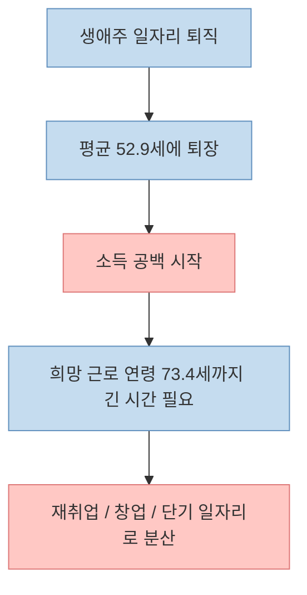
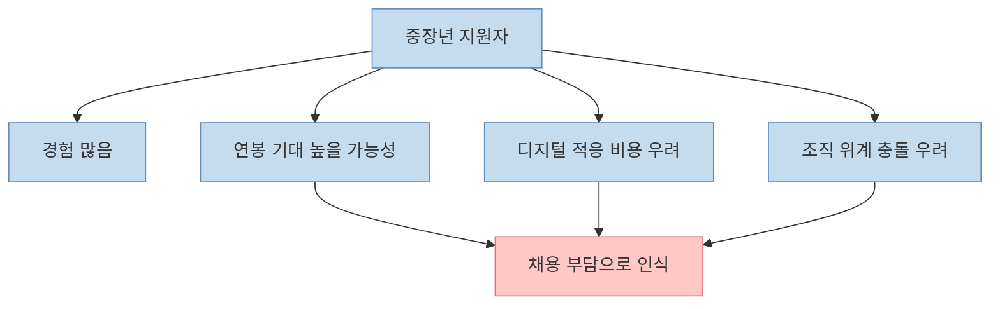
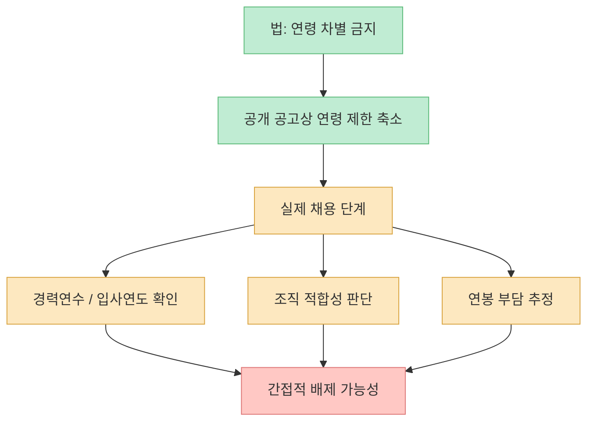
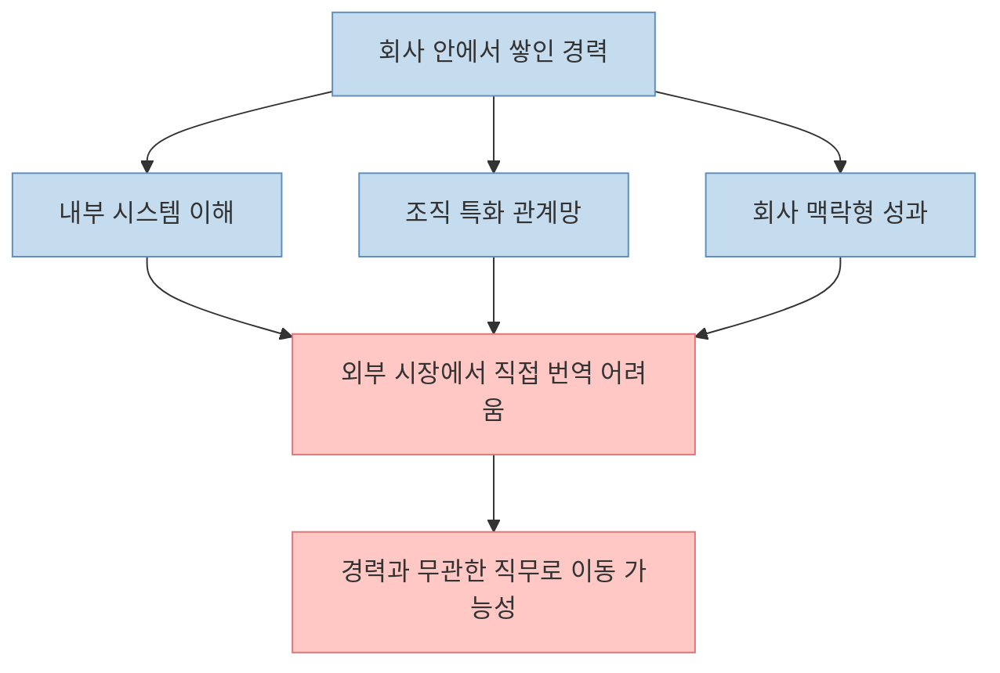
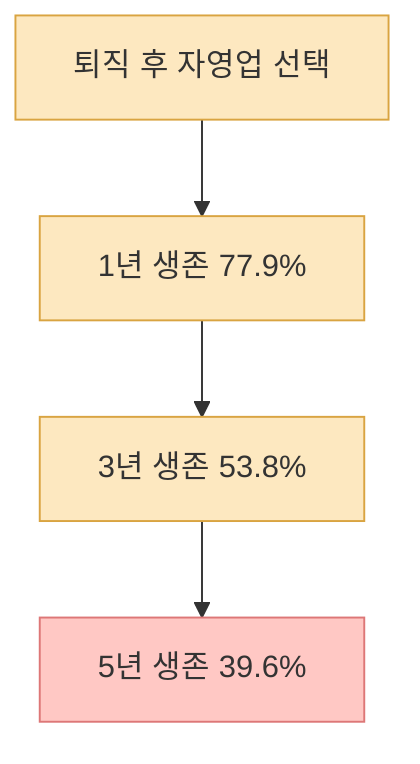
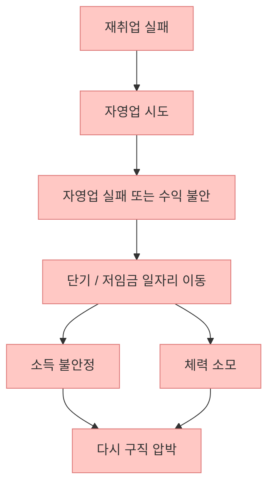
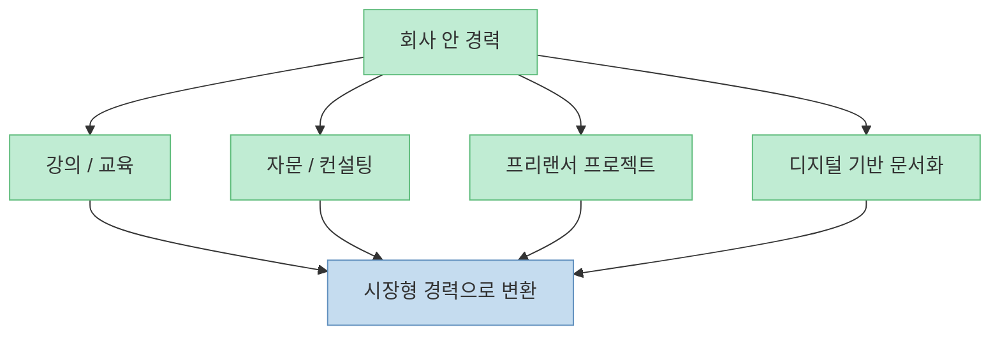
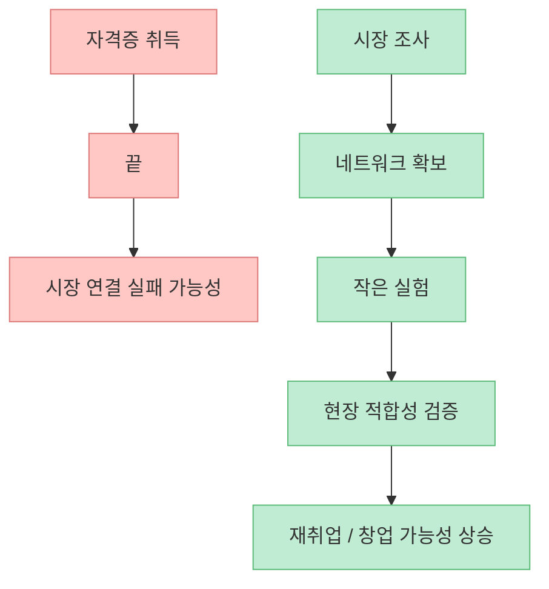

이 영상은 "50대에 직장을 잃으면 한국에서 다시 돌아오기 어렵다"는 매우 강한 문장으로 시작합니다. 표현은 다소 극단적이지만 문제의식 자체는 현실과 꽤 맞닿아 있습니다. 핵심은 50대 개인이 갑자기 무능해져서가 아니라, **한국 노동시장이 중장년 경력을 다시 받아들이는 방식 자체가 매우 좁고 비싸고 불안정하게 설계돼 있다** 는 점입니다.

<!--more-->

## Sources

- [50대에 직장 잃으면 다시는 못 돌아온다, 한국에서 재취업이 불가능한 이유! | 부자의경제학](https://youtu.be/gU91Ib_frL4)
- [2025년 5월 경제활동인구조사 고령층 부가조사 결과 - 통계청](https://www.kostat.go.kr/board.es?act=view&bid=210&list_no=437914&mid=a10301030200&nPage=1&ref_bid=&tag=)
- [최근 5년동안 100대 생활 업종 생존율 공개 - 국세청](https://www.nts.go.kr/webtv/na/ntt/selectNttInfo.do?mi=10675&nttSn=1342649)
- [고용상 연령차별금지 및 고령자고용촉진에 관한 법률 - 국가법령정보센터](https://www.law.go.kr/LSW/lsInfoP.do?lsiSeq=208543)

## 1. 문제의 출발점은 "너무 일찍 떠나고, 너무 오래 더 일해야 한다"는 간격이다

영상에서 가장 먼저 짚는 구조는 이겁니다. 많은 중장년이 생애주 일자리에서 비자발적으로 밀려나는데, 이후에는 이전과 비슷한 안정적인 일자리로 돌아가기 어렵다는 점입니다. [영상 1:01~1:44](https://youtu.be/gU91Ib_frL4?t=61)

통계청의 `2025년 5월 경제활동인구조사 고령층 부가조사`는 이 문제를 숫자로 보여 줍니다. 취업 경험자 중 가장 오래 근무한 일자리를 그만둔 사람의 **그만둘 당시 평균 연령은 52.9세** 였고, 장래 근로 희망 연령은 **평균 73.4세** 였습니다. 즉 많은 사람이 50대 초반에 주된 직장을 떠나지만, 실제로는 그 뒤에도 20년 가까이 더 일하고 싶거나 일해야 하는 상태에 놓인다는 뜻입니다.

이 간격이 크기 때문에, 중장년 재취업 문제는 단순히 "일하고 싶다"의 문제가 아니라 **남은 생애를 버틸 소득 구조를 다시 짜야 하는 문제** 로 바뀝니다.

## 2. 재취업이 어려운 첫 번째 이유는 경력보다 "비용"이 먼저 보이기 때문이다

영상 중반은 기업이 50대 지원자를 볼 때 실제로 어떤 계산을 하게 되는지를 설명합니다. 전직장 연봉 수준이 높을 가능성, 새 디지털 협업 도구 적응 시간, 조직 내 위계 문제 등을 기업이 부담으로 볼 수 있다는 이야기입니다. [영상 3:53~4:21](https://youtu.be/gU91Ib_frL4?t=233)

이 지점에서 중요한 건 "그 판단이 옳은가"가 아니라, **채용 단계에서 그런 계산이 실제로 작동하느냐** 입니다. 한국 기업 다수는 여전히 연공형 임금 구조의 흔적을 강하게 갖고 있습니다. 오래 근속할수록 임금이 올라가는 구조에서는, 같은 1명의 채용이라도 20년 경력 중장년은 젊은 인력보다 "비싼 인력"으로 보이기 쉽습니다.

그래서 중장년 재취업 시장에서는 "경력이 많다"가 곧바로 장점으로 작동하지 않습니다. 오히려 경력은 장점이 아니라 **고비용 인력이라는 신호** 로 번역될 수 있습니다.

## 3. 법적으로 연령 차별은 금지돼도, 실제 시장에서는 우회적으로 작동한다

영상은 공식적으로 연령 제한이 없어도 서류나 면접 단계에서 나이가 사실상 걸러질 수 있다고 말합니다. [영상 2:37~3:35](https://youtu.be/gU91Ib_frL4?t=157) 이 부분은 체감적으로 널리 공감되지만, 법과 현실을 분리해서 봐야 합니다.

한국에는 `고용상 연령차별금지 및 고령자고용촉진에 관한 법률`이 있고, 이 법은 합리적 이유 없이 연령을 이유로 고용 차별을 하는 것을 금지하는 취지를 분명히 두고 있습니다. 그러나 현실의 채용은 "나이가 많아서 불합격"이라고 대놓고 말하지 않아도 됩니다. 경력연수, 입사연도, 조직 적합성, 문화 적응성 같은 다른 언어로 판단이 이뤄질 수 있기 때문입니다.

즉 법이 있다고 해서 시장의 편견이 자동으로 사라지는 것은 아닙니다. 영상이 말하는 "조용한 차별"은 법 위반이 쉽게 입증되지 않는 형태의 **간접 배제 구조** 로 이해하는 편이 정확합니다.

## 4. 더 큰 문제는 경력의 비이식성이다: 같은 분야로 돌아가기도 어렵다

영상 후반부는 재취업에 성공해도 이전 경력과 직접 연결되지 않는 일자리로 이동하는 경우가 적지 않다고 설명합니다. [영상 9:24~10:14](https://youtu.be/gU91Ib_frL4?t=564) 25년간 물류관리 업무를 한 사람이 전혀 다른 시설관리나 경비 업무로 이동하는 식의 예가 나옵니다.

이 현상이 발생하는 이유는 한국의 많은 경력이 **회사 내부 시스템 안에서만 통하는 방식** 으로 축적되기 때문입니다. 특정 조직의 승인 체계, 특정 고객군, 특정 내부 보고 문화에 최적화된 능력은 회사 안에서는 강력하지만, 시장 바깥으로 나오면 그대로 가격이 매겨지지 않습니다.

그래서 중장년 재취업의 핵심은 단순히 이력서를 더 많이 넣는 것이 아니라, **내 경력이 다른 회사에서도 설명 가능한 언어로 번역돼 있는가** 입니다.

## 5. 창업은 대안처럼 보이지만, 통계상으로는 매우 거칠고 위험한 우회로다

영상은 재취업이 막히면 많은 사람이 결국 자영업을 선택한다고 설명합니다. [영상 10:38~11:31](https://youtu.be/gU91Ib_frL4?t=638) 여기서 중요한 건 감정이 아니라 숫자입니다.

국세청이 발표한 최근 5년간 `100대 생활업종 생존율` 통계에 따르면, **2023년 기준 1년 생존율은 77.9%, 3년 생존율은 53.8%, 5년 생존율은 39.6%** 였습니다. 다시 말해 생활밀착형 업종 창업은 꽤 많은 경우 3년, 5년을 넘기지 못합니다. 영상이 말하는 음식점·카페·편의점 창업의 위험성은 과장이 아니라, 실제로 공식 통계와도 상당히 맞아떨어집니다.

그래서 창업은 "재취업 실패의 자연스러운 다음 단계"가 아니라, **검증 없이 들어가면 퇴직금까지 잃을 수 있는 고위험 선택지** 에 더 가깝습니다.

## 6. 최후의 안전판은 종종 단기·저임금·고강도 노동이 된다

영상은 자영업 이후의 경로로 경비, 주차관리, 물류센터, 청소 같은 단기 일자리를 언급합니다. [영상 13:23~14:08](https://youtu.be/gU91Ib_frL4?t=803) 이 일자리들은 상대적으로 진입장벽이 낮지만, 임금 수준과 고용 안정성은 낮고 육체 부담은 클 수 있습니다.

이 대목에서 중요한 건 "일이 있다/없다"가 아닙니다. 문제는 **기존의 지식노동 경력에서 이탈한 뒤, 체력 기반 저임금 노동으로 급하게 이동하는 구조** 입니다. 이 경우 소득뿐 아니라 건강도 빠르게 약해질 수 있습니다.

이 악순환 때문에 중장년 노동 문제는 단순한 고용 문제가 아니라 **소득, 건강, 자존감이 함께 흔들리는 복합 위기** 가 됩니다.

## 7. 그래서 준비는 퇴직 후가 아니라 재직 중에 시작돼야 한다

영상이 가장 실용적인 부분은 마지막 대안 제시입니다. 지금 직장에 다니고 있다면, 자신의 경험을 특정 회사 안에서만 유효한 형태로 가두지 말아야 한다는 조언입니다. [영상 16:03~16:49](https://youtu.be/gU91Ib_frL4?t=963)

예를 들어 인사, 영업, 생산관리, 재무, 교육 같은 경력이 있다면 그것을 다음처럼 바깥 언어로 바꿔야 합니다.

- 강의로 팔 수 있는가  
- 중소기업 자문으로 연결할 수 있는가  
- 프로젝트성 프리랜서 업무로 만들 수 있는가  
- 디지털 툴과 함께 설명 가능한 경험인가  
- 특정 회사명이 빠져도 설득력 있게 소개할 수 있는가  

핵심은 퇴직 후 처음 시도하면 늦을 수 있다는 점입니다. 재직 중에 작게라도 외부 실험을 해본 사람과 그렇지 않은 사람의 차이는, 실제 퇴직 이후에 훨씬 크게 벌어집니다.

## 8. 자격증 하나보다 중요한 것은 "시장과 연결된 시험 운영"이다

영상은 정부나 전문가들이 흔히 제시하는 해법이 직업훈련과 자격증에 과도하게 집중돼 있다고 지적합니다. [영상 14:42~15:33](https://youtu.be/gU91Ib_frL4?t=882) 이 비판은 꽤 타당합니다. 자격증이 쓸모없다는 뜻이 아니라, **자격증만으로는 시장 진입이 되지 않는다** 는 뜻입니다.

실제 재취업 경로는 공공 취업 알선, 지인 소개, 업계 네트워크, 과거 고객, 동료 추천 등 여러 채널이 함께 작동합니다. 따라서 더 현실적인 전략은 다음과 같습니다.

- 자격증 취득보다 먼저 목표 시장을 정하기  
- 내가 들어갈 업종 사람을 먼저 만나기  
- 작은 프로젝트나 보조 업무라도 먼저 해보기  
- 창업 생각이 있다면 아르바이트나 현장 체험부터 해보기  

결국 중요한 건 종이 자격보다 **시장에 연결되는 경험의 사전 실험** 입니다.

## 핵심 요약

- 통계청 기준으로 많은 중장년은 **평균 52.9세** 에 주된 일자리를 떠나지만, **73.4세** 까지 일하기를 희망합니다.
- 50대 재취업이 어려운 이유는 개인 능력보다 **연공형 임금, 연령 편견, 경력의 비이식성, 조직 적응 비용 우려** 같은 구조적 문제에 가깝습니다.
- 법적으로 연령 차별은 금지돼 있지만, 현실에서는 간접적인 방식으로 배제가 일어날 수 있습니다.
- 재취업 실패 후 선택되는 자영업은 공식 통계상 **5년 생존율 39.6%** 로 결코 안전한 우회로가 아닙니다.
- 가장 현실적인 대비는 퇴직 후 자격증 몰입이 아니라, **재직 중 경력을 시장형 자산으로 번역하고 작은 외부 실험을 해보는 것** 입니다.

## 결론

이 영상의 제목처럼 "다시는 못 돌아온다"는 표현은 다소 과격합니다. 하지만 그 과장을 걷어내도 남는 진실은 분명합니다. **한국의 중장년 재취업 문제는 개인의 의지 부족보다 시장 구조의 문제에 훨씬 가깝다** 는 점입니다. 그래서 필요한 건 막연한 자기계발이 아니라, 지금 가진 경력을 회사 밖에서도 통하는 형태로 바꾸고, 퇴직 전에 작은 출구를 미리 만들어 두는 전략입니다.
