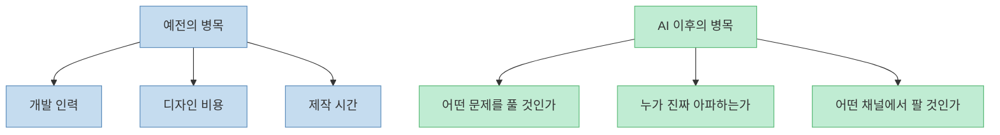
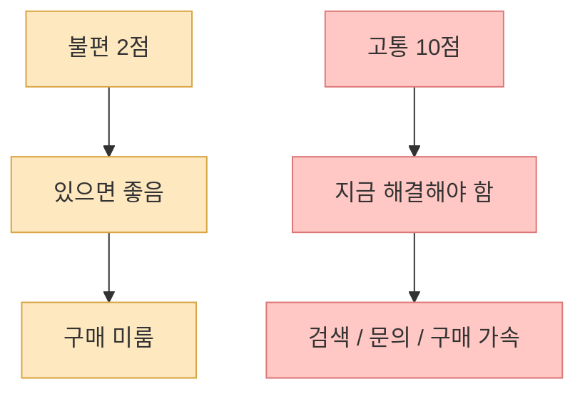
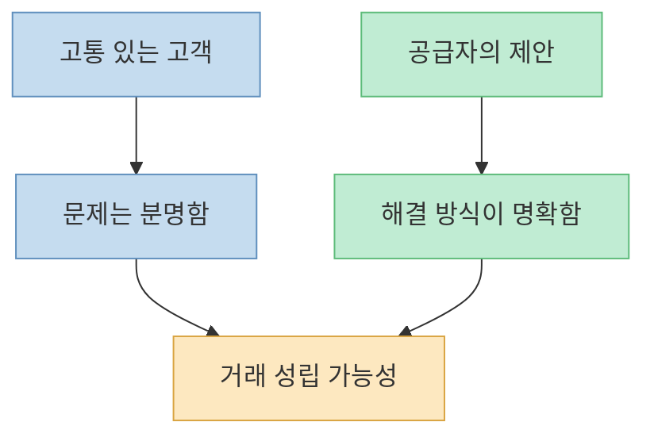
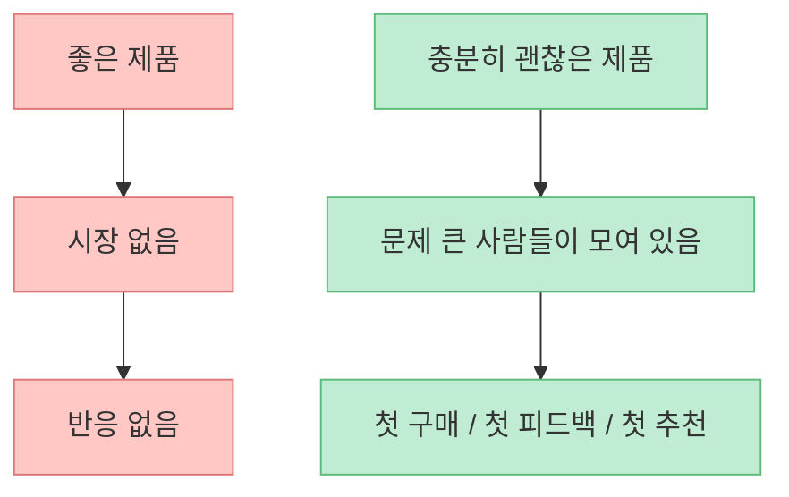
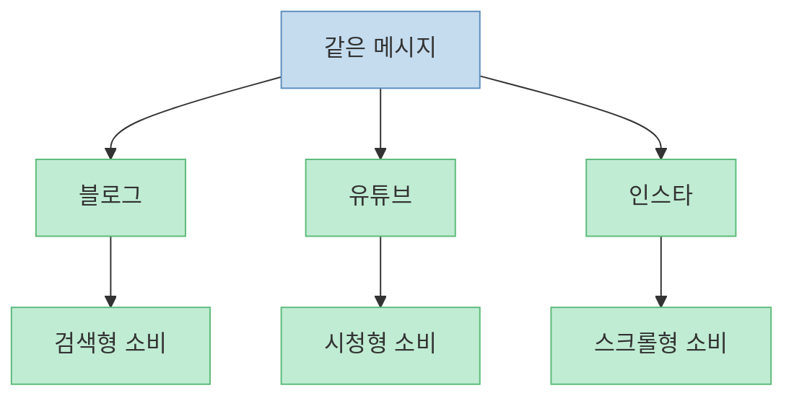
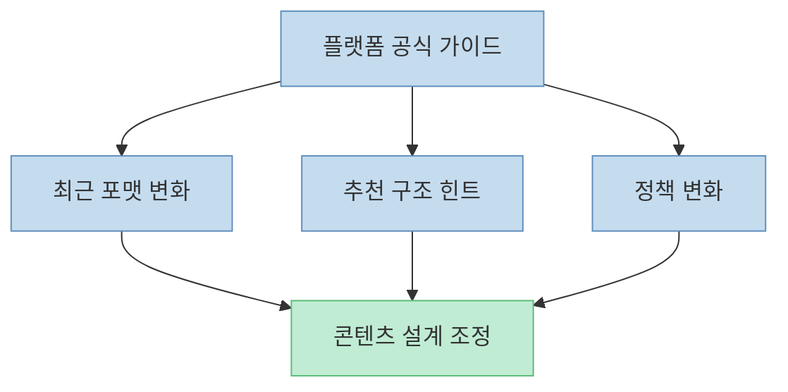
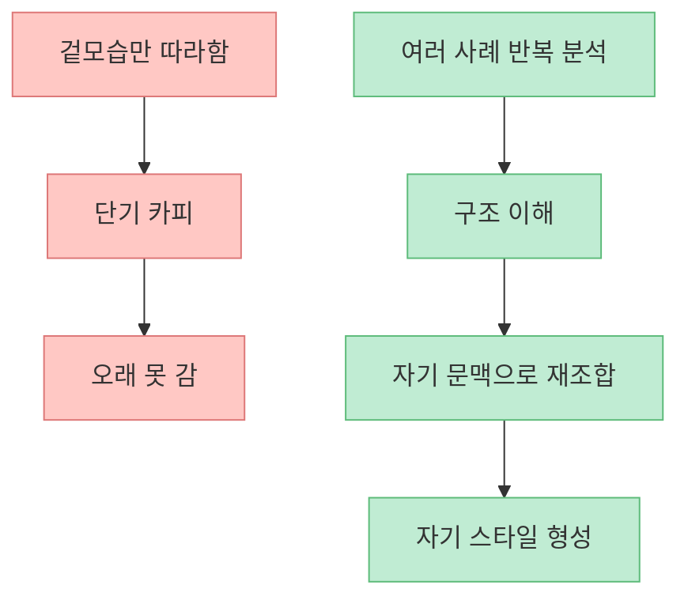
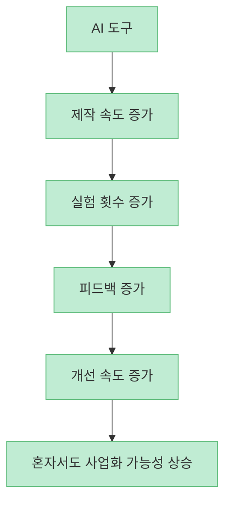

이 영상의 핵심은 "AI 덕분에 이제 혼자서도 사업을 할 수 있다"는 선언 그 자체보다, **그 혼자라는 상태가 실제로 무엇을 가능하게 하고 무엇을 대신 요구하는가** 를 설명하는 데 있습니다. 거대한 팀 없이도 제품을 만들고 콘텐츠를 찍고 판매 페이지를 만들 수는 있지만, 그 대신 문제 선택, 플랫폼 이해, 벤치마킹, 검증을 개인이 직접 해야 합니다.

<!--more-->

## Sources

- [Ai 시대에 월급쟁이였던 내가 1인 기업가가 되었던 과정](https://youtu.be/ZOTDzfQp34A)

## 1. 이 영상이 말하는 첫 번째 변화는 "혼자 만들 수 있다"가 아니라 "혼자 검증해야 한다"는 것이다

영상은 AI로 무장한 개인이 혼자서도 거대한 조직과 경쟁할 수 있는 시대가 왔다고 말합니다. [영상 0:00~0:58](https://youtu.be/ZOTDzfQp34A?t=0) 여기서 중요한 건 `개인도 앱을 만들 수 있다`, `코딩을 몰라도 사이트를 만들 수 있다` 같은 기술적 가능성 자체보다, **제품 제작 비용이 낮아지면서 사업의 병목이 개발에서 문제 선택과 검증으로 이동했다** 는 점입니다.

예전에는 아이디어가 있어도 개발자, 디자이너, 마케터를 모으는 순간부터 진입장벽이 높았습니다. 지금은 AI가 초기 제작비와 실험비를 낮춰 줍니다. 그래서 이제 더 중요한 질문은 "만들 수 있느냐"가 아니라, **무엇을 왜 만들어야 하느냐** 입니다.

즉 AI 시대의 1인 기업은 `제작 자동화`의 시대이면서 동시에 `판단 책임의 개인화` 시대이기도 합니다.

## 2. 사업의 출발점은 아이디어가 아니라 "10에 가까운 고통"이다

영상에서 가장 중요한 문장은 사업은 작은 불편이 아니라 **10에 가까운 고통을 해결하는 것** 이라는 대목입니다. [영상 1:24~1:53](https://youtu.be/ZOTDzfQp34A?t=84) 손목이 조금 불편한 사람과, 하루 10시간 넘게 마우스를 써서 수술 이야기까지 듣는 사람은 같은 문제를 가진 것처럼 보여도 `지불 의사` 는 완전히 다릅니다.

이 논리는 단순하지만 강력합니다. 사업은 "많은 사람이 조금 좋아할 것"보다, **어떤 사람이 정말 당장 해결하고 싶어 하는 문제** 를 찾는 쪽이 훨씬 유리합니다. 불편의 강도가 높을수록:

- 검색을 더 많이 하고  
- 돈을 더 빨리 쓰고  
- 추천도 더 강하게 일어납니다  

그래서 1인 기업가가 해야 할 첫 번째 일은 멋진 아이디어를 내는 것이 아니라, **누가 무엇 때문에 지금 고통받고 있는지 관찰하는 것** 입니다.

## 3. 좋은 사업 아이템은 "문제가 큰 사람"과 "말이 통하는 제안"이 만날 때 생긴다

영상은 디자인을 모르는 식당 사장님에게 정해진 가격으로 디자인을 만들어 판매했던 경험, 그리고 크몽 사례를 들어 설명합니다. [영상 1:53~3:18](https://youtu.be/ZOTDzfQp34A?t=113) 여기서 핵심은 단순히 디자인을 잘했느냐가 아닙니다.

핵심은 다음 두 가지입니다.

- 상대가 이미 분명한 문제를 갖고 있었고  
- 그 문제를 이해하기 쉬운 문장으로 제안했다는 점입니다  

`5,000원의 재능을 판다`는 문구가 강력했던 이유도 마찬가지입니다. 복잡한 설명보다, **누가 어떤 문제를 어떻게 해결받는지 한 줄로 이해되는 제안** 이 필요합니다.

즉 아이템은 `기능 목록` 에서 생기지 않습니다. **누군가의 고통과 그것을 설명하는 문장의 결합** 에서 생깁니다.

## 4. 시장은 "배고픈 사람을 얼마나 빨리 찾느냐"의 게임이다

영상은 게리 헬버트의 비유를 빌려, 햄버거를 더 잘 만드는 것보다 굶주린 군중을 먼저 확보하는 것이 중요하다고 말합니다. [영상 3:20~4:08](https://youtu.be/ZOTDzfQp34A?t=200) 이 부분은 사업 초보가 자주 놓치는 포인트를 잘 짚습니다.

많은 사람은 제품 개선을 먼저 생각합니다.

- 더 좋은 기능  
- 더 예쁜 디자인  
- 더 낮은 가격  

하지만 초기 사업에서 더 중요한 건 **이미 문제를 크게 느끼는 사람들이 모여 있는 곳** 입니다. 왜냐하면 시장은 제품이 완벽해서 열리는 경우보다, **문제를 느끼는 사람의 밀도가 높아서 열리는 경우** 가 훨씬 많기 때문입니다.

그래서 1인 기업가는 `무엇을 만들까` 이전에 **누가 지금 간절한가** 를 먼저 찾아야 합니다.

## 5. 같은 콘텐츠라도 플랫폼마다 소비 문법이 다르다

영상은 블로그, 유튜브, 인스타그램을 모두 해보니 보는 사람의 성향이 완전히 달랐다고 말합니다. [영상 4:18~5:04](https://youtu.be/ZOTDzfQp34A?t=258) 이 대목은 매우 중요합니다. 1인 기업은 대기업처럼 채널별 전담팀이 없기 때문에, 한 채널에서 먹히는 방식을 다른 채널에 그대로 옮기면 실패하기 쉽습니다.

예를 들어:

- 블로그는 검색 의도와 체류 시간이 중요하고  
- 유튜브는 클릭과 시청 지속 시간이 중요하며  
- 인스타그램은 스크롤 맥락과 첫 인상이 더 중요합니다  

이 차이를 이해하지 못하면, 같은 메시지를 열심히 복붙하면서도 성과가 안 나는 상황이 생깁니다.

따라서 1인 기업가의 콘텐츠 전략은 멀티채널 확장이 아니라, 먼저 **채널별 문법 차이를 해석하는 능력** 에서 시작해야 합니다.

## 6. 플랫폼 공식 가이드를 읽는다는 건 알고리즘을 외우는 게 아니라 운영체제를 배우는 것이다

영상은 잘나가는 채널들이 플랫폼 공식 채널이 내놓는 최신 가이드와 소식을 수십, 수백 번 읽는다고 강조합니다. [영상 4:36~5:05](https://youtu.be/ZOTDzfQp34A?t=276) 이건 단순한 팁이 아니라 운영 원칙에 가깝습니다.

플랫폼은 외부에서 보면 알고리즘처럼 보이지만, 내부에서는 사실상 하나의 운영체제입니다. 그리고 공식 가이드는 그 운영체제가 어떤 행동을 선호하는지, 어떤 포맷을 밀고 있는지, 어떤 규칙을 바꾸고 있는지 알려 주는 문서에 가깝습니다.

즉 공식 가이드를 본다는 건 단순히 `꿀팁을 찾는다` 가 아니라, **내가 일할 시장의 규칙을 읽는다** 는 뜻입니다.

## 7. 벤치마킹은 복제가 아니라 구조 해석 훈련이어야 한다

영상 후반은 샤오미 사례와 함께 `모방에서 시작하되, 그대로 내놓지는 말라`고 설명합니다. [영상 5:07~6:18](https://youtu.be/ZOTDzfQp34A?t=307) 이 대목은 1인 창작자나 1인 사업가에게 특히 중요합니다.

벤치마킹이 제대로 작동하려면 다음 순서가 필요합니다.

- 먼저 잘되는 사례를 그대로 따라 만들어 본다  
- 그걸 왜 그렇게 구성했는지 분해한다  
- 그 구조를 자기 주제와 자기 고객에 맞게 다시 조합한다  

잘 나가는 영상 하나를 겉모습만 따라하면 카피가 됩니다. 하지만 열 개 정도를 반복해서 따라 만들며 구조를 해석하면, `왜 이 타이밍에 이 정보를 넣는지`, `왜 이런 제목을 쓰는지`, `왜 이 순서로 설득하는지`가 보이기 시작합니다.

따라서 좋은 벤치마킹은 `비슷하게 보이게 만드는 기술` 이 아니라, **잘되는 구조를 해부하는 훈련** 에 가깝습니다.

## 8. 결국 1인 기업의 경쟁력은 AI 자체가 아니라 반복 속도다

영상 전체를 관통하는 메시지를 한 줄로 줄이면 이렇습니다. AI가 혼자서도 사업을 가능하게 만든 이유는, AI가 대신 사업을 해주기 때문이 아니라 **혼자서 더 빨리 만들고, 더 빨리 검증하고, 더 빨리 수정할 수 있게 만들기 때문** 입니다.

즉 경쟁력의 핵심은:

- 더 똑똑한 아이디어 1개  
보다
- 더 빠른 실험 10번  

에 가깝습니다.

그래서 AI 시대의 1인 기업가는 `한 방의 천재` 보다, **문제를 더 빨리 찾고 더 자주 고치는 운영자** 에 가깝습니다.

## 핵심 요약

- AI 시대의 1인 기업은 제작이 쉬워진 대신, **문제 선택과 검증 책임이 개인에게 더 크게 돌아오는 구조** 입니다.
- 사업 아이템은 멋진 기능보다 **10에 가까운 고통을 가진 고객** 에서 나올 가능성이 높습니다.
- 좋은 제안은 기능 설명이 아니라 **누가 어떤 문제를 어떻게 해결받는지 한 줄로 보이는 문장** 입니다.
- 초기 시장에서 더 중요한 것은 완벽한 제품보다 **배고픈 고객이 모여 있는 위치** 입니다.
- 블로그, 유튜브, 인스타는 같은 메시지도 전혀 다르게 소비되므로 **플랫폼별 문법** 을 따로 이해해야 합니다.
- 벤치마킹은 복제가 아니라 **구조 해석과 재조합 훈련** 이어야 오래 갑니다.
- AI의 진짜 장점은 자동화 그 자체보다 **반복 실험 속도를 올려 준다** 는 데 있습니다.

## 결론

이 영상이 말하는 1인 기업가의 본질은 화려한 자유가 아닙니다. 더 정확히는 **작게 만들고, 빨리 테스트하고, 남의 구조를 배우고, 자기만의 해석으로 다시 내놓는 반복자** 에 가깝습니다. AI는 그 반복을 싸고 빠르게 만들어 주는 도구일 뿐이고, 결국 승부는 여전히 **누구의 고통을 얼마나 정확히 이해하고 있느냐** 에서 갈립니다.
