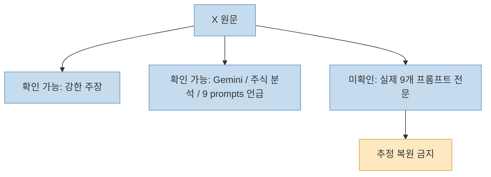
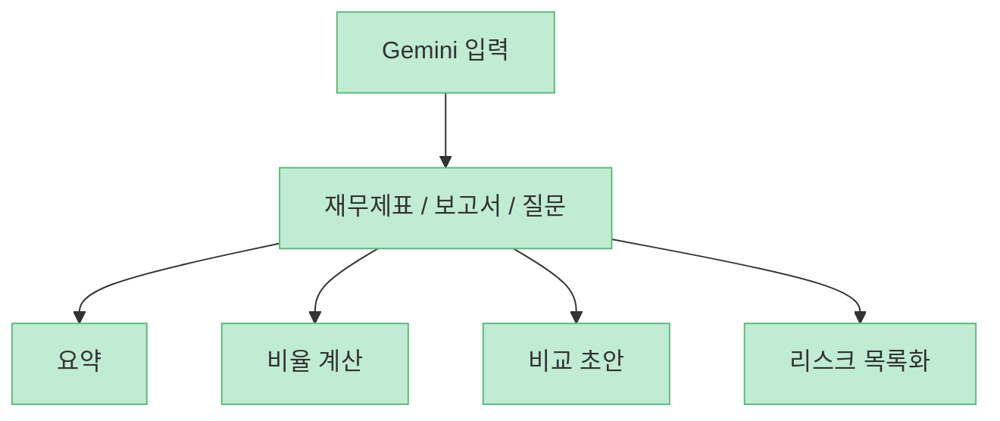
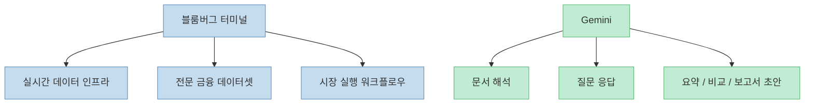
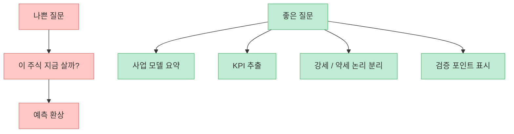
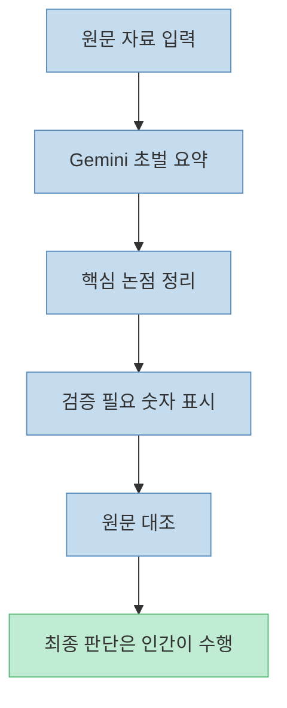
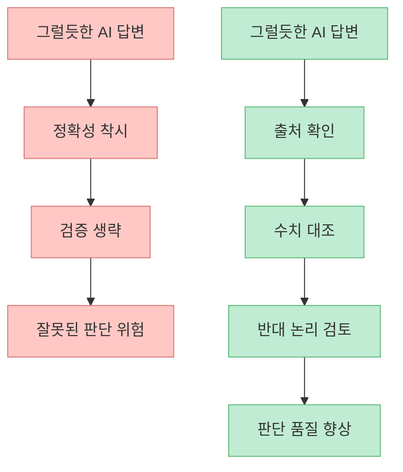
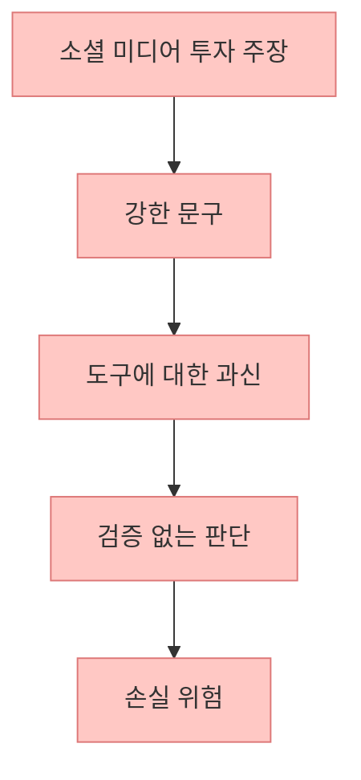

이 X 포스트는 Google Gemini가 이제 어떤 주식이든 월가 애널리스트처럼 분석할 수 있고, 월 4,000달러짜리 블룸버그 터미널을 대체할 수 있다고 주장합니다. 공개적으로 확인되는 원문에는 `9개의 프롬프트`가 있다고 적혀 있지만, 현재 확보한 공개 데이터에서는 그 프롬프트 목록 자체는 확인되지 않았습니다. 그래서 이 글은 목록을 추정해서 복원하지 않고, **Gemini가 실제로 잘하는 일과 절대 대신하지 못하는 일을 분리해서** 정리합니다.

<!--more-->

## Sources

- [X 원문](https://x.com/i/status/2064424997373026694)
- [Gemini Deep Research Agent | Google AI for Developers](https://ai.google.dev/gemini-api/docs/interactions/deep-research)
- [Use case: Analyze financial statements and calculate ratios | Gemini Enterprise](https://docs.cloud.google.com/gemini/enterprise/docs/use-case-analyze-financial-statements)
- [Prompt guide for Gemini Enterprise | Google Cloud](https://cloud.google.com/gemini-enterprise/resources/prompt-guide)
- [Resources for Investors | SEC](https://www.sec.gov/resources-investors)
- [Investor Alert: Beware of Stock Recommendations on Investment Research Websites | Investor.gov](https://www.investor.gov/introduction-investing/general-resources/news-alerts/alerts-bulletins/investor-alerts/investor-41)

## 1. 원문에서 확인되는 것은 "강한 주장"이지, 검증된 9개 프롬프트 목록은 아니다

공개 임베드와 공개 API로 확인되는 원문은 스페인어로 작성된 다음 주장입니다.

- Gemini가 이제 어떤 주식이든 월가 애널리스트처럼 분석할 수 있다  
- 무료다  
- 월 4,000달러짜리 블룸버그 터미널을 대체하는 9개 프롬프트가 있다  

하지만 현재 공개적으로 확보되는 자료에는 그 9개 프롬프트의 실제 텍스트가 포함돼 있지 않았습니다. 첨부 이미지는 Gemini 로고만 확인됐고, 프롬프트 목록 자체는 읽히지 않았습니다. 따라서 이 글에서 "`원문의 9개 프롬프트`를 재현한다"고 말하면 정확하지 않습니다.

그래서 진짜 질문은 "그 9개가 무엇이냐"보다, **Gemini가 실제 투자 리서치 과정 어디까지를 줄여 줄 수 있느냐** 입니다.

## 2. Gemini는 분명 강력한 리서치 도구다: 특히 요약, 비교, 초안 작성에서

Google 공식 문서를 보면 Gemini는 금융 데이터 요약, 재무제표 분석, 비율 계산, 다단계 리서치 같은 작업에 분명히 유용하게 설계돼 있습니다. Google Cloud 문서는 Gemini Enterprise가 **재무제표를 빠르게 분석하고 KPI를 계산하고 초기 해석을 생성** 할 수 있다고 설명합니다. 또 Deep Research Agent 문서는 Gemini가 여러 단계를 거쳐 검색·읽기·종합을 수행해 **인용이 포함된 보고서** 를 만들 수 있다고 소개합니다.

즉 Gemini는 다음 작업에 특히 강합니다.

- 회사 개요 빠른 요약  
- 분기 실적 자료의 초벌 해석  
- 재무비율 계산 요청  
- 경쟁사 비교 초안  
- 리스크 항목 체크리스트 정리  
- 여러 문서의 공통 패턴 추출  

따라서 "`주식 분석에 Gemini를 쓸 수 있나?`"라는 질문에는 분명히 **그렇다** 고 답할 수 있습니다. 다만 그 의미는 `블룸버그를 통째로 대체한다`가 아니라, **리서치의 문서 작업과 초벌 해석을 빠르게 만든다** 에 더 가깝습니다.

## 3. 하지만 블룸버그 터미널과 Gemini는 근본적으로 다른 도구다

원문의 가장 과장된 부분은 바로 이 지점입니다. 블룸버그 터미널은 단순히 질문에 답하는 AI가 아닙니다. 그것은 실시간 시장 데이터, 뉴스, 가격 피드, 기업 정보, 스크리닝, 채권·외환·파생 데이터, 데이터 라이선스, 실행 워크플로우까지 포함하는 거대한 인프라입니다.

반면 Gemini는 기본적으로 **언어 모델 기반 분석 도구** 입니다. 문서를 읽고 정리하고, 공개 웹과 연결된 정보를 요약하고, 입력된 재무 데이터를 해석하는 데 강합니다. 하지만 이 두 도구는 태생부터 역할이 다릅니다.

그래서 현실적인 표현은 이렇습니다.

- Gemini는 **애널리스트의 문서 작업 일부를 줄여 준다**
- 하지만 Gemini가 **시장 데이터 인프라 전체를 대체하지는 않는다**

즉 AI는 `터미널 대체재` 라기보다, **리서치 보조 엔진** 에 더 가깝습니다.

## 4. Gemini를 투자에 쓸 때 진짜 강한 프롬프트는 "예측"보다 "구조화"에 있다

Google의 프롬프트 가이드는 좋은 프롬프트의 기본 원칙을 꽤 명확하게 제시합니다.

- 구체적일 것  
- 맥락을 줄 것  
- 역할을 지정할 것  
- 출력 형식을 명시할 것  
- 반복해서 다듬을 것  

이 원칙을 투자 리서치에 옮기면, 가장 좋은 프롬프트는 "이 주식 오를까?" 같은 예측형 질문이 아닙니다. 더 좋은 방식은 다음과 같습니다.

- 이 회사의 사업 모델을 5개 항목으로 요약해 줘  
- 최근 4개 분기의 실적 변화에서 핵심 KPI만 뽑아 줘  
- 강세/약세 논리를 각각 3개씩 정리해 줘  
- 경쟁사 2곳과 비교표를 만들어 줘  
- 이 보고서에서 확인이 필요한 숫자만 따로 표시해 줘  

즉 Gemini를 잘 쓰는 사람은 `정답을 묻는 사람`이 아니라, **리서치 과정을 구조화해서 던지는 사람** 입니다.

## 5. 가장 실용적인 사용법은 "초안 작성기"와 "검증 체크리스트 생성기"로 쓰는 것이다

실전에서는 Gemini를 이렇게 쓰는 편이 가장 안전합니다.

첫째, **초안 작성기** 로 씁니다.  
예를 들어 10-K, 사업보고서, 실적 발표 자료, 컨콜 메모를 넣고 초벌 요약을 받습니다.

둘째, **검증 체크리스트 생성기** 로 씁니다.  
모델이 내놓은 요약 중 어떤 숫자, 어떤 비교, 어떤 해석이 원문 대조가 필요한지 다시 묻게 만듭니다.

셋째, **반대 논리 생성기** 로 씁니다.  
내가 낙관적으로 보는 기업이라면 "이 투자 아이디어가 틀릴 수 있는 이유 5개"를 먼저 뽑게 하는 식입니다.

이렇게 쓰면 AI는 투자 결정을 대신하는 존재가 아니라, **리서치 시간을 줄이고 누락을 줄이는 도구** 가 됩니다.

## 6. 투자에서 가장 위험한 오해는 "잘 말하는 모델 = 잘 아는 모델"이라고 믿는 것이다

Gemini 같은 모델은 말이 매우 그럴듯합니다. 그래서 리서치 초심자는 종종 `이 정도로 자신 있게 설명하면 맞겠지`라고 착각하기 쉽습니다. 하지만 언어 모델은 기본적으로 **설명 엔진** 이지, 자동으로 진실을 보증하는 엔진이 아닙니다.

특히 투자에서는 다음 문제가 큽니다.

- 최신 데이터가 실제로 반영됐는지  
- 출처가 정확한지  
- 수치가 원문과 일치하는지  
- 해석이 과도하게 단순화되지 않았는지  

이 부분은 사람이 끝까지 확인해야 합니다.

즉 AI 리서치의 진짜 리스크는 틀린 답 하나보다, **너무 자연스럽게 틀린 답을 믿게 만드는 구조** 에 있습니다.

## 7. SEC 관점에서도 소셜 미디어 기반 투자 주장은 항상 경계 대상이다

SEC와 Investor.gov는 투자자에게 온라인 투자 정보, 소셜 미디어 게시물, 낯선 출처의 종목 추천을 경계하라고 계속 안내합니다. 특히 특정 종목이나 투자 아이디어가 제품·서비스보다 과하게 홍보되는 경우는 위험 신호일 수 있다고 말합니다.

이 원문은 특정 종목을 직접 추천하는 글은 아니지만, `"월 4,000달러짜리 터미널을 무료 AI가 대체한다"` 같은 문장은 **도구 자체의 역량을 과대 포장해 투자 판단의 경계심을 낮출 수 있다** 는 점에서 비슷한 주의가 필요합니다.

결국 AI 시대에도 달라지지 않는 원칙은 같습니다. **출처, 데이터, 맥락, 반대 논리** 없이 내려진 투자 판단은 여전히 취약합니다.

## 핵심 요약

- X 원문에서 공개적으로 확인되는 것은 `Gemini가 월가 애널리스트처럼 주식을 분석한다`, `블룸버그를 대체하는 9개 프롬프트가 있다`는 주장까지입니다.
- 하지만 실제 9개 프롬프트 목록은 현재 공개적으로 검증되지 않았습니다.
- Google 공식 문서 기준으로 Gemini는 재무제표 분석, KPI 계산, 다단계 리서치, 요약·비교 초안 작성에는 분명 강합니다.
- 그렇다고 해서 Gemini가 실시간 금융 데이터 인프라와 전문 데이터셋까지 포함한 **블룸버그 터미널 전체를 대체하는 것은 아닙니다**.
- Gemini를 투자에 잘 쓰는 방법은 `예측`이 아니라 **요약, 구조화, 체크리스트, 반대 논리 생성** 에 쓰는 것입니다.
- 최종 투자 판단의 책임은 여전히 사람에게 있으며, 소셜 미디어 기반의 과장된 투자 주장은 항상 경계해야 합니다.

## 결론

Gemini는 분명 강력한 투자 리서치 보조 도구입니다. 하지만 그 강점은 `정답 제시`가 아니라 **문서를 빨리 읽고, 구조를 정리하고, 검증할 포인트를 드러내는 데** 있습니다. 그래서 `"블룸버그를 대체한다"`는 말보다는, **리서치 생산성을 크게 높여 주지만 데이터 인프라와 판단 책임은 대체하지 못한다** 는 쪽이 훨씬 정확합니다.
