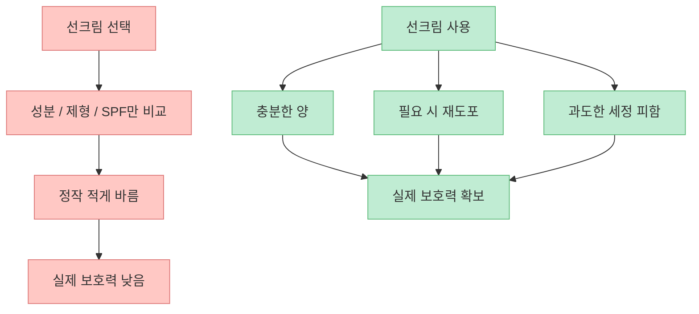
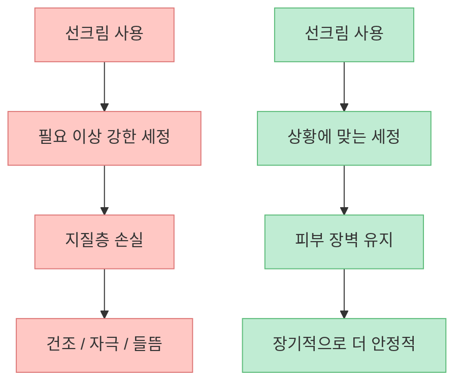
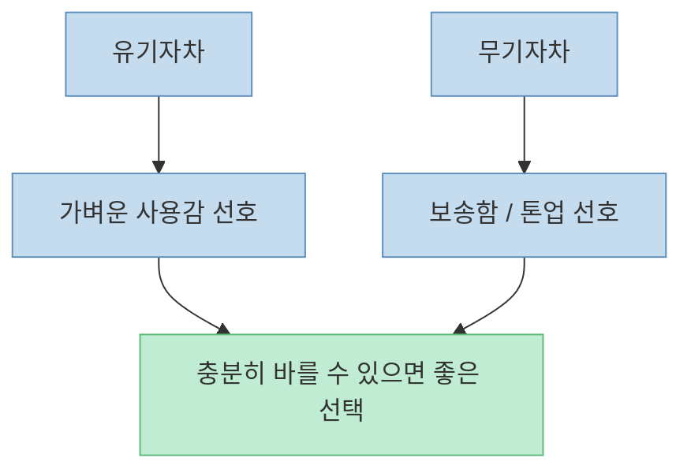
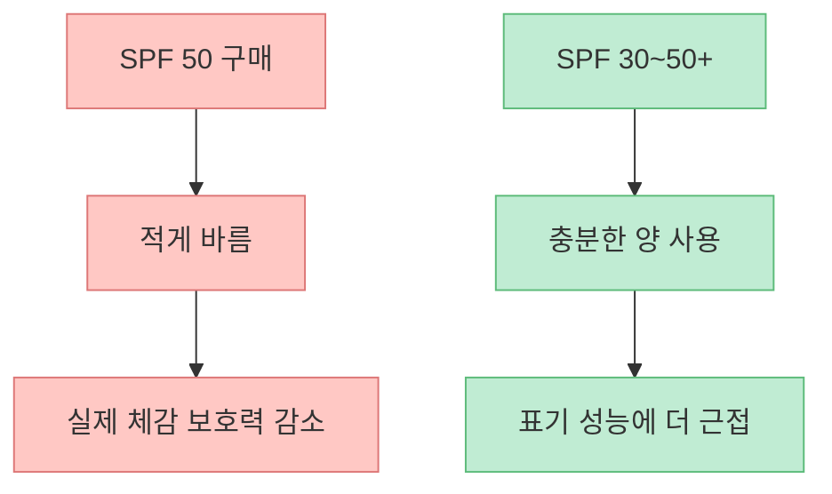
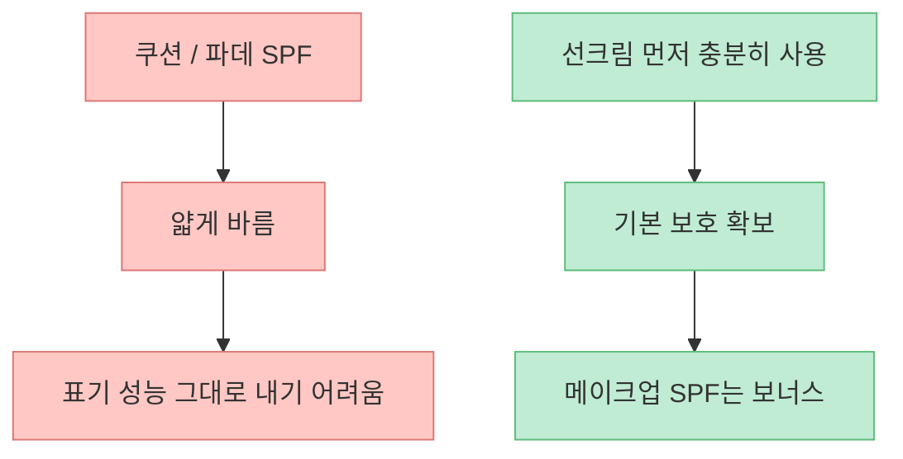
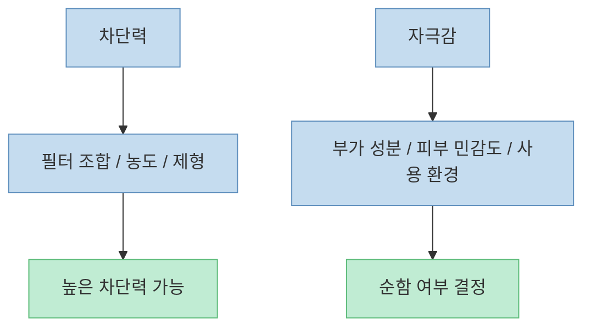
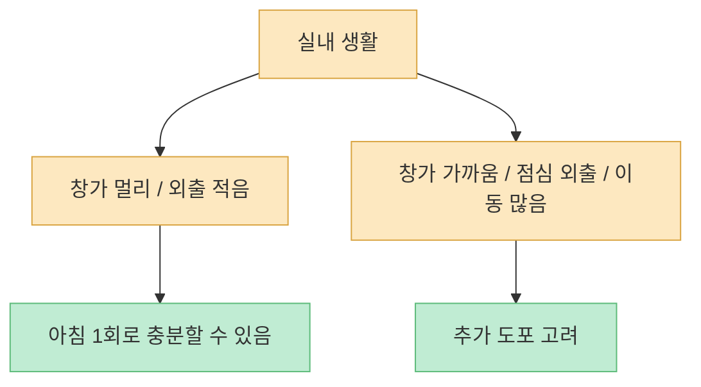
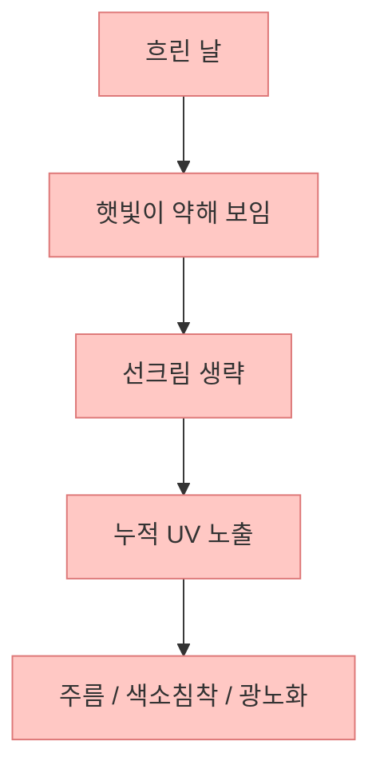

이 영상의 핵심은 의외로 단순합니다. 사람들은 선크림을 고를 때 유기자차냐 무기자차냐, SPF 30이냐 50이냐, 순하냐 독하냐 같은 문제에 지나치게 집중하는데, 실제로 더 큰 차이를 만드는 것은 **얼마나 충분히 바르는지, 얼마나 과하게 씻지 않는지, 어떤 상황에서 다시 바르는지 같은 사용 습관** 이라는 것입니다.

<!--more-->

## Sources

- ["90%가 쓸데없이 따지는 선크림 | '노화 부르는 습관' 이거부터 고치세요. 제발 │ 15년차 선크림 만드는 사람이 전부 정리했습니다.](https://youtu.be/EV2BqayZKoc)
- [How to apply sunscreen - American Academy of Dermatology](https://www.aad.org/public/everyday-care/sun-protection/shade-clothing-sunscreen/how-to-apply-sunscreen)
- [Sunscreen: How to Help Protect Your Skin from the Sun - FDA](https://www.fda.gov/drugs/understanding-over-counter-medicines/sunscreen-how-help-protect-your-skin-sun)
- [Sunscreen and Your Morning Routine - Johns Hopkins Medicine](https://www.hopkinsmedicine.org/health/wellness-and-prevention/sunscreen-and-your-morning-routine)
- [Ultraviolet (UV) Radiation and Sun Exposure - US EPA](https://www.epa.gov/radtown/ultraviolet-uv-radiation-and-sun-exposure)

## 1. 선크림에서 가장 큰 실수는 "뭘 고를까"에 비해 "어떻게 쓸까"를 너무 적게 본다는 점이다

영상 초반은 사람들이 선크림을 고를 때 대부분 안 따져도 되는 것을 너무 많이 따진다고 말합니다. [영상 0:15~0:28](https://youtu.be/EV2BqayZKoc?t=15) 이 말은 꽤 맞습니다. 실제 자외선 차단에서 더 큰 차이를 만드는 건 다음입니다.

- 충분한 양을 바르는가  
- 야외 노출이 길면 다시 바르는가  
- 땀·물·마찰 상황을 고려하는가  
- 지우겠다고 피부 장벽까지 벗기지 않는가  

즉 제품 비교보다 먼저 봐야 하는 것은 **사용 행동** 입니다.

그래서 선크림은 `비교 상품` 이기 전에, **습관 제품** 으로 보는 편이 훨씬 현실적입니다.

## 2. 이중 세안 논쟁보다 중요한 건 "피부를 얼마나 무리하게 씻느냐"다

영상은 특정 뉴스 보도 이후 선크림은 무조건 이중 세안해야 한다는 식의 공포가 퍼졌다고 지적합니다. [영상 0:28~1:20](https://youtu.be/EV2BqayZKoc?t=28) 여기서 포인트는 모든 선크림이 동일하지 않다는 점과, 더 중요한 건 **무조건 다 지워야 한다는 강박이 피부 장벽을 해칠 수 있다** 는 점입니다.

영상은 특히 무기자차 중 일부는 이중 세안이 필요할 수 있지만, 그렇다고 `100% 뽀득뽀득` 을 목표로 세정하면 안 된다고 말합니다. [영상 1:21~2:05](https://youtu.be/EV2BqayZKoc?t=81) 이 주장은 피부과학적으로도 꽤 상식적입니다. 피부 장벽은 각질세포와 지질층이 함께 유지하는 구조이고, 과도한 세정은 건조감, 자극감, 들뜸을 악화시킬 수 있습니다.

즉 질문은 "이중 세안을 하느냐 안 하느냐"보다, **내가 쓰는 제형과 내 피부 상태에서 어느 정도 세정이 적절한가** 에 가깝습니다.

## 3. 유기자차 vs 무기자차는 선악 구도가 아니라 사용감과 적합성의 차이에 더 가깝다

영상은 유기자차와 무기자차를 두고 공포 마케팅이 많았다고 설명합니다. [영상 3:01~3:47](https://youtu.be/EV2BqayZKoc?t=181) 특히 `무기자차는 안전하고 유기자차는 화학적이라 위험하다`는 식의 프레임은 지나치게 단순화된 경우가 많습니다.

현실적으로 두 제형은 보통 이런 차이로 이해하는 편이 낫습니다.

- 유기자차: 대체로 발림성, 투명감, 가벼움이 장점인 경우가 많음  
- 무기자차: 백탁이나 뻑뻑함이 있을 수 있지만, 질감이나 보송함을 선호하는 사람에게 맞을 수 있음  

둘 사이의 핵심은 절대적 우열보다 **나에게 잘 맞아서 충분한 양을 꾸준히 바를 수 있느냐** 입니다.

FDA나 AAD가 강조하는 것도 결국 broad-spectrum, SPF 기준, 재도포, 충분한 양이지, 유기자차/무기자차의 인터넷 선악론이 아닙니다.

## 4. SPF 50이 30보다 조금 낫긴 하지만, 더 큰 차이는 늘 "양"에서 난다

영상은 SPF 50이 30보다 아주 약간 낫기는 하지만, 그 차이보다 훨씬 중요한 건 바르는 양이라고 강조합니다. [영상 4:53~5:27](https://youtu.be/EV2BqayZKoc?t=293) 이건 공식 가이드와도 일치합니다.

AAD는 얼굴에 바를 때 **검지와 중지를 따라 길게 짜는 정도**, 즉 대략 1티스푼 수준을 권합니다. FDA도 충분한 양을 사용하고, 적어도 2시간마다 다시 바르라고 안내합니다. 문제는 대부분의 사람이 표기된 SPF를 전제로 한 시험량보다 적게 바른다는 점입니다. 그래서 실제 보호력은 병에 적힌 숫자보다 더 낮아지기 쉽습니다.

즉 비싼 SPF 50을 아껴 쓰는 것보다, **부담 없이 충분히 바를 수 있는 제품을 제대로 쓰는 것** 이 더 중요할 때가 많습니다.

## 5. 메이크업 제품의 SPF는 "보너스"에 가깝고, 선크림을 대체하기엔 부족하다

영상은 파운데이션이나 쿠션에 SPF가 적혀 있어도 선크림을 완전히 대체하긴 어렵다고 말합니다. [영상 6:59~7:28](https://youtu.be/EV2BqayZKoc?t=419) 이 주장도 타당합니다. 이유는 간단합니다. 표시된 SPF는 보통 시험 조건에 맞는 두께에서 측정되는데, 실제 메이크업 제품은 그 정도로 두껍게 바르지 않기 때문입니다.

그래서 더 현실적인 해석은 이렇습니다.

- 선크림: 기본 보호막  
- 메이크업 SPF: 추가 점수  

메이크업 제품에 SPF가 있다는 이유로 선크림을 건너뛰는 것은, 특히 야외 노출이 있는 날에는 과신에 가깝습니다.

## 6. "순한 선크림은 차단력이 약하다"는 오해도 지나치게 단순하다

영상은 차단력이 높으면 독하고, 순하면 차단이 약하다는 이분법을 부정합니다. [영상 8:32~9:20](https://youtu.be/EV2BqayZKoc?t=512) 이 역시 꽤 합리적입니다. 자외선 차단력은 필터 조합과 농도, 제형 설계에서 나오고, 자극감은 보존제, 향, 필름포머, 왁스, 사용감 설계 등 여러 부가 요소의 영향을 받습니다.

그래서 `SPF 50 / PA++++`와 `순함`은 원리상 동시에 성립할 수 있습니다. 물론 개인 피부에서는 특정 필터나 부가 성분에 민감할 수 있지만, 그것은 **개인 적합성 문제** 에 더 가깝지, 높은 차단력 자체가 곧 독하다는 뜻은 아닙니다.

즉 좋은 질문은 "이게 독한가요?"보다, **내 피부에서 자극 없이 충분한 양을 유지할 수 있는가** 입니다.

## 7. 실내에서는 무조건 덧바르기보다, 창가 노출과 외출 패턴을 먼저 봐야 한다

영상은 종일 실내 근무라면 굳이 과도하게 재도포를 권하고 싶지 않다고 말합니다. [영상 10:22~10:39](https://youtu.be/EV2BqayZKoc?t=622) 이 부분은 온라인에서 흔한 "`실내에서도 2시간마다 무조건 다시 발라야 한다`"는 주장보다 현실적입니다.

Johns Hopkins도 비슷하게 설명합니다. 실내에 있고 창가에서 멀다면 두 번째 도포가 꼭 필요하지 않을 수 있지만, 창가 근무나 점심 외출이 있다면 이야기가 달라집니다. 또 UVA는 유리창을 통과할 수 있기 때문에, 햇빛이 직접 들어오는 창가 자리에 오래 있는 경우에는 실내라고 해도 완전히 무방비하다고 보긴 어렵습니다.

즉 실내 도포는 `무조건`의 문제가 아니라, **창가 노출, 외출 빈도, 실제 UVA 노출량** 을 보는 게 더 정확합니다.

## 8. 흐린 날에도 자외선은 여전히 온다. 그리고 누적 노화는 "안 탄다"는 착각 속에서 쌓인다

영상은 흐린 날에도 자외선이 상당 부분 통과하고, 오히려 산란 때문에 더 강하게 느껴질 수 있다고 설명합니다. [영상 10:39~11:18](https://youtu.be/EV2BqayZKoc?t=639) EPA도 흐린 날에도 자외선 노출이 가능하다고 분명히 안내합니다. 특히 `안 따갑고 안 타는 날 = 안전한 날`로 오해하기 쉬운데, UVA 중심의 광노화는 이렇게 방심하는 날 누적되기 쉽습니다.

그래서 선크림은 더운 날 바르는 `여름용 제품` 이 아니라, **자외선 노출 습관을 관리하는 일상 장비** 에 가깝습니다.

## 핵심 요약

- 선크림에서 가장 큰 차이를 만드는 것은 유기자차/무기자차 논쟁보다 **충분한 양, 적절한 재도포, 과도한 세정 피하기** 입니다.
- 모든 선크림이 무조건 이중 세안을 요구하는 것은 아니며, 지나친 세정은 피부 장벽을 해칠 수 있습니다.
- 유기자차와 무기자차는 선악 구도보다 **사용감과 적합성의 차이** 로 보는 편이 현실적입니다.
- SPF 50이 30보다 조금 더 낫기는 해도, 더 큰 차이는 **양을 제대로 바르느냐** 에서 납니다.
- 쿠션이나 파운데이션의 SPF는 **보너스** 에 가깝고 선크림을 완전히 대체하긴 어렵습니다.
- 실내 재도포는 무조건 규칙이 아니라 **창가 노출과 외출 패턴** 을 봐야 합니다.
- 흐린 날에도 자외선은 누적되므로 방심하기 쉽고, 바로 그 점이 광노화를 키웁니다.

## 결론

선크림에서 진짜 중요한 건 성분 프레임 전쟁이 아니라 **내가 매일 실제로 반복하는 습관** 입니다. 충분히 바르고, 필요할 때 다시 바르고, 지우겠다고 피부를 벗겨내지 않고, 내 피부에 맞는 제형을 고르는 것. 결국 피부를 늙게 만드는 건 `잘못 고른 한 병` 보다, **오랫동안 반복된 잘못된 사용 방식** 인 경우가 더 많습니다.
